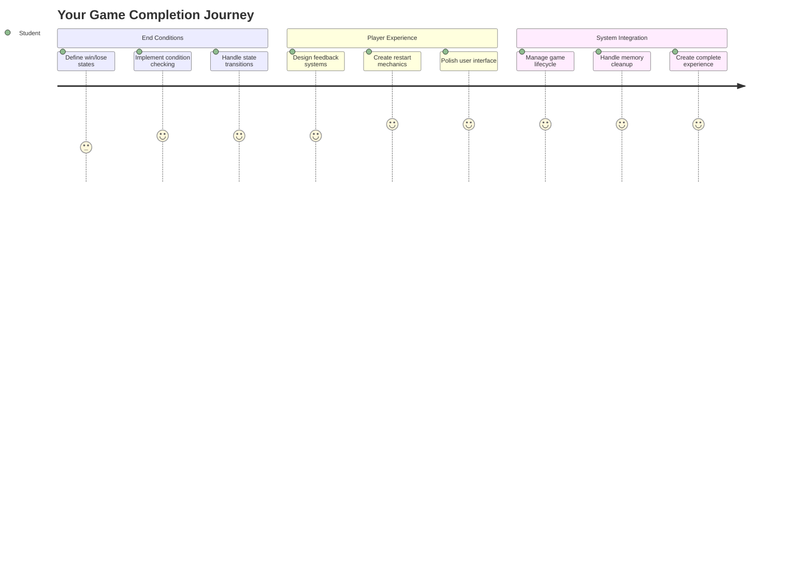
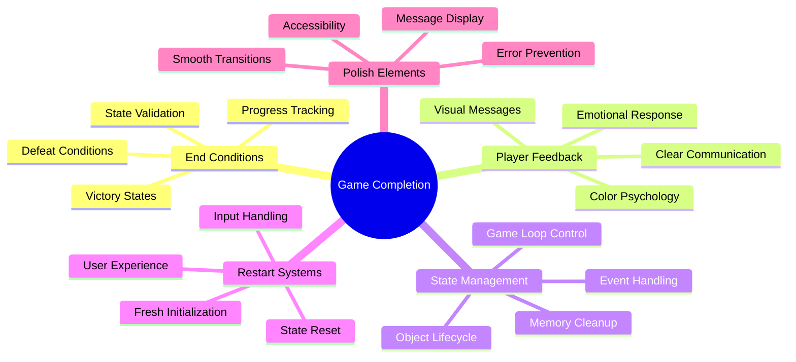
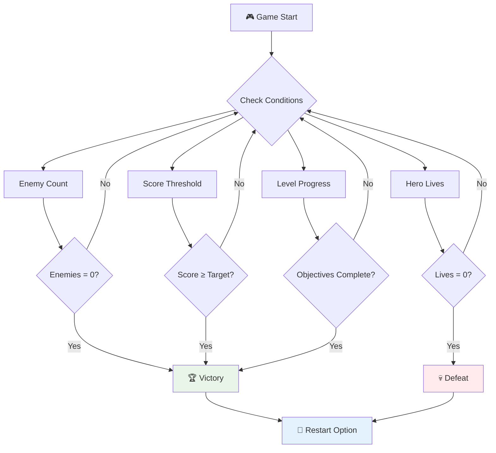
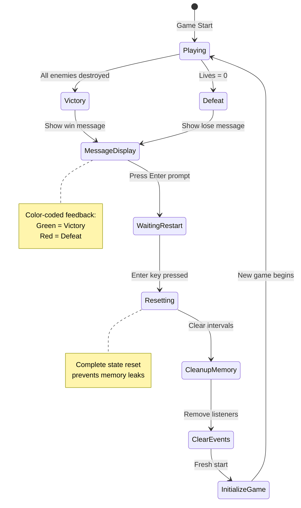
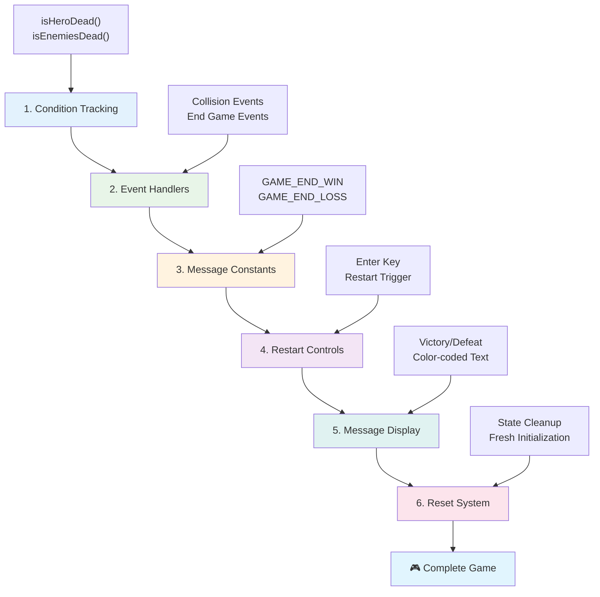
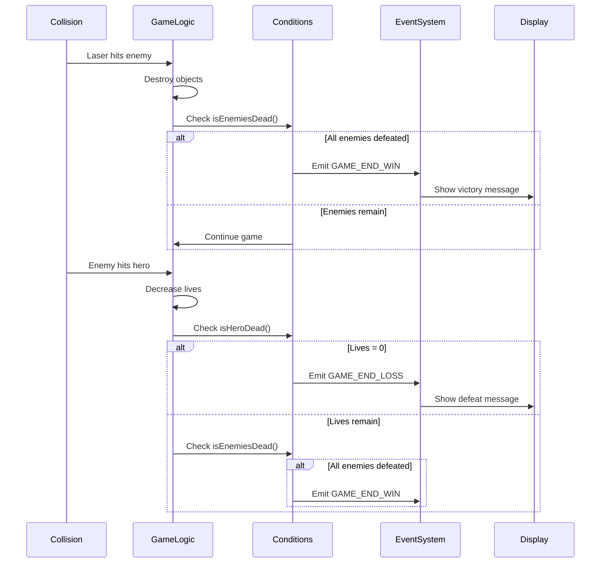
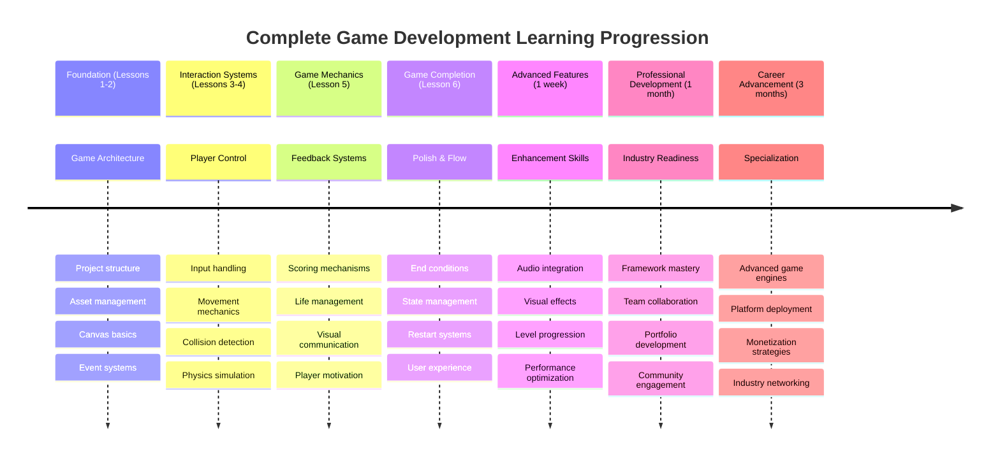

# بناء لعبة فضاء الجزء السادس: النهاية وإعادة التشغيل


  
كل لعبة رائعة تحتاج إلى شروط نهاية واضحة وآلية إعادة تشغيل سلسة. لقد قمت ببناء لعبة فضاء مذهلة مع الحركة والقتال وتسجيل النقاط - والآن حان الوقت لإضافة القطع النهائية التي تجعلها تبدو مكتملة.

لعبتك حاليًا تعمل بلا نهاية، مثل مجسات "فوياجر" التي أطلقتها ناسا في عام 1977 - ولا تزال تسافر عبر الفضاء بعد عقود. بينما هذا مناسب لاستكشاف الفضاء، تحتاج الألعاب إلى نقاط نهاية محددة لتوفير تجربة مرضية.

اليوم، سنقوم بتنفيذ شروط الفوز/الخسارة ونظام إعادة التشغيل. بنهاية هذا الدرس، ستكون لديك لعبة مصقولة يمكن للاعبين إكمالها وإعادة لعبها، تمامًا مثل ألعاب الأركيد الكلاسيكية التي شكلت هذا المجال.


  
## اختبار ما قبل الدرس  

[اختبار ما قبل الدرس](https://ff-quizzes.netlify.app/web/quiz/39)  

## فهم شروط نهاية اللعبة  

متى يجب أن تنتهي لعبتك؟ هذا السؤال الأساسي شكل تصميم الألعاب منذ عصر الأركيد المبكر. تنتهي لعبة "باك مان" عندما يتم الإمساك بك من قبل الأشباح أو عند تنظيف جميع النقاط، بينما تنتهي لعبة "غزاة الفضاء" عندما تصل الكائنات الفضائية إلى الأسفل أو يتم تدميرها جميعًا.

بصفتك منشئ اللعبة، أنت من يحدد شروط الفوز والهزيمة. بالنسبة للعبة الفضاء الخاصة بنا، إليك بعض الأساليب المثبتة التي تخلق تجربة لعب ممتعة:


  
- **`N` تم تدمير عدد معين من سفن العدو**: من الشائع جدًا إذا قمت بتقسيم اللعبة إلى مستويات مختلفة أن تحتاج إلى تدمير `N` سفن عدو لإكمال المستوى.  
- **تم تدمير سفينتك**: هناك بالتأكيد ألعاب تخسر فيها إذا تم تدمير سفينتك. نهج شائع آخر هو مفهوم "الحياة". في كل مرة يتم تدمير سفينتك، يتم خصم حياة. بمجرد فقدان جميع الأرواح، تخسر اللعبة.  
- **لقد جمعت `N` نقاط**: شرط نهاية شائع آخر هو جمع النقاط. كيفية الحصول على النقاط يعود إليك، ولكن من الشائع جدًا تخصيص نقاط لأنشطة مختلفة مثل تدمير سفينة عدو أو ربما جمع عناصر تسقطها السفن عند تدميرها.  
- **إكمال مستوى**: قد يتضمن ذلك عدة شروط مثل تدمير `X` سفن عدو، جمع `Y` نقاط، أو ربما جمع عنصر معين.  

## تنفيذ وظيفة إعادة تشغيل اللعبة  

الألعاب الجيدة تشجع على إعادة اللعب من خلال آليات إعادة تشغيل سلسة. عندما يكمل اللاعبون لعبة (أو يواجهون الهزيمة)، غالبًا ما يرغبون في المحاولة مرة أخرى فورًا - سواء لتحسين أدائهم أو لتحقيق نتيجة أفضل.


  
لعبة "تتريس" مثال رائع على ذلك: عندما تصل الكتل إلى الأعلى، يمكنك بدء لعبة جديدة فورًا دون الحاجة إلى التنقل عبر قوائم معقدة. سنقوم ببناء نظام إعادة تشغيل مشابه يعيد ضبط حالة اللعبة بشكل نظيف ويعيد اللاعبين إلى الحركة بسرعة.

✅ **تأمل**: فكر في الألعاب التي لعبتها. تحت أي ظروف تنتهي، وكيف يتم تحفيزك لإعادة التشغيل؟ ما الذي يجعل تجربة إعادة التشغيل سلسة مقابل محبطة؟

## ما الذي ستبنيه  

ستقوم بتنفيذ الميزات النهائية التي تحول مشروعك إلى تجربة لعبة مكتملة. هذه العناصر تميز الألعاب المصقولة عن النماذج الأولية الأساسية.

**إليك ما سنضيفه اليوم:**

1. **شرط الفوز**: تدمير جميع الأعداء والحصول على احتفال مناسب (لقد استحققت ذلك!)  
2. **شرط الهزيمة**: نفاد الأرواح ومواجهة شاشة الهزيمة  
3. **آلية إعادة التشغيل**: اضغط على Enter للعودة مباشرة - لأن لعبة واحدة لا تكفي  
4. **إدارة الحالة**: صفحة جديدة في كل مرة - لا أعداء متبقين أو أخطاء غريبة من اللعبة السابقة  

## البدء  

لنقم بإعداد بيئة التطوير الخاصة بك. يجب أن تكون لديك جميع ملفات لعبة الفضاء من الدروس السابقة جاهزة.

**يجب أن يبدو مشروعك شيئًا مثل هذا:**

```bash
-| assets
  -| enemyShip.png
  -| player.png
  -| laserRed.png
  -| life.png
-| index.html
-| app.js
-| package.json
```
  
**ابدأ خادم التطوير الخاص بك:**

```bash
cd your-work
npm start
```
  
**هذا الأمر:**  
- يشغل خادمًا محليًا على `http://localhost:5000`  
- يخدم ملفاتك بشكل صحيح  
- يقوم بالتحديث تلقائيًا عند إجراء تغييرات  

افتح `http://localhost:5000` في متصفحك وتأكد من أن لعبتك تعمل. يجب أن تكون قادرًا على التحرك، إطلاق النار، والتفاعل مع الأعداء. بمجرد التأكد، يمكننا المضي قدمًا في التنفيذ.

> 💡 **نصيحة احترافية**: لتجنب التحذيرات في Visual Studio Code، قم بتعريف `gameLoopId` في أعلى ملفك كـ `let gameLoopId;` بدلاً من تعريفه داخل وظيفة `window.onload`. هذا يتبع أفضل ممارسات تعريف المتغيرات في JavaScript الحديثة.


  
## خطوات التنفيذ  

### الخطوة 1: إنشاء وظائف تتبع شروط النهاية  

نحتاج إلى وظائف لمراقبة متى يجب أن تنتهي اللعبة. مثل أجهزة الاستشعار على محطة الفضاء الدولية التي تراقب الأنظمة الحرجة باستمرار، ستقوم هذه الوظائف بفحص حالة اللعبة بشكل مستمر.

```javascript
function isHeroDead() {
  return hero.life <= 0;
}

function isEnemiesDead() {
  const enemies = gameObjects.filter((go) => go.type === "Enemy" && !go.dead);
  return enemies.length === 0;
}
```
  
**ما يحدث خلف الكواليس:**  
- **يتحقق** إذا كانت سفينة البطل قد نفدت الأرواح (مؤلم!)  
- **يحسب** عدد الأعداء الذين لا يزالون على قيد الحياة  
- **يعيد** `true` عندما تكون ساحة المعركة خالية من الأعداء  
- **يستخدم** منطق بسيط يعتمد على true/false للحفاظ على الأمور واضحة  
- **يُرشح** جميع كائنات اللعبة للعثور على الناجين  

### الخطوة 2: تحديث معالجات الأحداث لشروط النهاية  

الآن سنقوم بربط هذه الفحوصات بنظام الأحداث في اللعبة. في كل مرة يحدث تصادم، ستقوم اللعبة بتقييم ما إذا كان يؤدي إلى شرط نهاية. هذا يخلق ردود فعل فورية للأحداث الحرجة في اللعبة.


  
```javascript
eventEmitter.on(Messages.COLLISION_ENEMY_LASER, (_, { first, second }) => {
    first.dead = true;
    second.dead = true;
    hero.incrementPoints();

    if (isEnemiesDead()) {
      eventEmitter.emit(Messages.GAME_END_WIN);
    }
});

eventEmitter.on(Messages.COLLISION_ENEMY_HERO, (_, { enemy }) => {
    enemy.dead = true;
    hero.decrementLife();
    if (isHeroDead())  {
      eventEmitter.emit(Messages.GAME_END_LOSS);
      return; // loss before victory
    }
    if (isEnemiesDead()) {
      eventEmitter.emit(Messages.GAME_END_WIN);
    }
});

eventEmitter.on(Messages.GAME_END_WIN, () => {
    endGame(true);
});
  
eventEmitter.on(Messages.GAME_END_LOSS, () => {
  endGame(false);
});
```
  
**ما يحدث هنا:**  
- **الليزر يصيب العدو**: كلاهما يختفي، تحصل على نقاط، ونتحقق إذا كنت قد فزت  
- **العدو يصيبك**: تخسر حياة، ونتحقق إذا كنت لا تزال على قيد الحياة  
- **ترتيب ذكي**: نتحقق من الهزيمة أولاً (لا أحد يريد الفوز والخسارة في نفس الوقت!)  
- **ردود فعل فورية**: بمجرد حدوث شيء مهم، تعرف اللعبة بذلك  

### الخطوة 3: إضافة ثوابت رسائل جديدة  

ستحتاج إلى إضافة أنواع رسائل جديدة إلى كائن الثوابت `Messages`. تساعد هذه الثوابت في الحفاظ على الاتساق وتجنب الأخطاء الإملائية في نظام الأحداث الخاص بك.

```javascript
GAME_END_LOSS: "GAME_END_LOSS",
GAME_END_WIN: "GAME_END_WIN",
```
  
**في ما سبق، قمنا بـ:**  
- **إضافة** ثوابت لأحداث نهاية اللعبة للحفاظ على الاتساق  
- **استخدام** أسماء وصفية تشير بوضوح إلى غرض الحدث  
- **اتباع** نمط التسمية الحالي لأنواع الرسائل  

### الخطوة 4: تنفيذ عناصر التحكم في إعادة التشغيل  

الآن ستضيف عناصر تحكم لوحة المفاتيح التي تسمح للاعبين بإعادة تشغيل اللعبة. مفتاح Enter هو خيار طبيعي لأنه يرتبط عادةً بتأكيد الإجراءات وبدء الألعاب الجديدة.

**أضف اكتشاف مفتاح Enter إلى مستمع حدث keydown الحالي الخاص بك:**

```javascript
else if(evt.key === "Enter") {
   eventEmitter.emit(Messages.KEY_EVENT_ENTER);
}
```
  
**أضف ثابت الرسالة الجديد:**

```javascript
KEY_EVENT_ENTER: "KEY_EVENT_ENTER",
```
  
**ما تحتاج إلى معرفته:**  
- **يمدد** نظام معالجة أحداث لوحة المفاتيح الحالي  
- **يستخدم** مفتاح Enter كمحفز لإعادة التشغيل لتجربة مستخدم بديهية  
- **يصدر** حدثًا مخصصًا يمكن لأجزاء أخرى من لعبتك الاستماع إليه  
- **يحافظ** على نفس النمط مثل عناصر التحكم الأخرى في لوحة المفاتيح  

### الخطوة 5: إنشاء نظام عرض الرسائل  

تحتاج لعبتك إلى التواصل بوضوح مع اللاعبين حول النتائج. سنقوم بإنشاء نظام رسائل يعرض حالات الفوز والهزيمة باستخدام نصوص ملونة، مشابهة لواجهات المحطات الطرفية في أجهزة الكمبيوتر المبكرة حيث يشير اللون الأخضر إلى النجاح والأحمر إلى الأخطاء.

**قم بإنشاء وظيفة `displayMessage()`:**

```javascript
function displayMessage(message, color = "red") {
  ctx.font = "30px Arial";
  ctx.fillStyle = color;
  ctx.textAlign = "center";
  ctx.fillText(message, canvas.width / 2, canvas.height / 2);
}
```
  
**خطوة بخطوة، ما يحدث:**  
- **يضبط** حجم الخط ونوعه لنص واضح وسهل القراءة  
- **يطبق** معلمة اللون مع "الأحمر" كإعداد افتراضي للتحذيرات  
- **يتمركز** النص أفقيًا وعموديًا على اللوحة  
- **يستخدم** معلمات JavaScript الحديثة الافتراضية لخيارات الألوان المرنة  
- **يستفيد** من سياق 2D للوحة للرسم المباشر للنص  

**قم بإنشاء وظيفة `endGame()`:**

```javascript
function endGame(win) {
  clearInterval(gameLoopId);

  // Set a delay to ensure any pending renders complete
  setTimeout(() => {
    ctx.clearRect(0, 0, canvas.width, canvas.height);
    ctx.fillStyle = "black";
    ctx.fillRect(0, 0, canvas.width, canvas.height);
    if (win) {
      displayMessage(
        "Victory!!! Pew Pew... - Press [Enter] to start a new game Captain Pew Pew",
        "green"
      );
    } else {
      displayMessage(
        "You died !!! Press [Enter] to start a new game Captain Pew Pew"
      );
    }
  }, 200)  
}
```
  
**ما تفعله هذه الوظيفة:**  
- **تجمد** كل شيء في مكانه - لا مزيد من تحركات السفن أو الليزر  
- **تأخذ** وقفة صغيرة (200 مللي ثانية) للسماح بإكمال رسم الإطار الأخير  
- **تمسح** الشاشة تمامًا وتلونها باللون الأسود لتأثير درامي  
- **تعرض** رسائل مختلفة للفائزين والخاسرين  
- **تستخدم** ألوانًا مختلفة للأخبار - الأخضر للأخبار الجيدة، والأحمر للأخبار السيئة  
- **تخبر** اللاعبين كيف يمكنهم العودة للعب  

### 🔄 **توقف تعليمي**  
**إدارة حالة اللعبة**: قبل تنفيذ وظيفة إعادة الضبط، تأكد من فهمك:  
- ✅ كيف تخلق شروط النهاية أهدافًا واضحة للعب  
- ✅ لماذا يعتبر ردود الفعل البصرية ضروريًا لفهم اللاعب  
- ✅ أهمية التنظيف المناسب في منع تسرب الذاكرة  
- ✅ كيف تمكن بنية الأحداث الانتقال السلس للحالة  

**اختبار سريع ذاتي**: ماذا سيحدث إذا لم تقم بمسح مستمعي الأحداث أثناء إعادة الضبط؟  
*الإجابة: تسرب الذاكرة ومعالجات الأحداث المكررة مما يسبب سلوكًا غير متوقع*  

**مبادئ تصميم الألعاب**: أنت الآن تنفذ:  
- **أهداف واضحة**: يعرف اللاعبون بالضبط ما يحدد النجاح والفشل  
- **ردود فعل فورية**: يتم التواصل مع تغييرات حالة اللعبة فورًا  
- **تحكم المستخدم**: يمكن للاعبين إعادة التشغيل عندما يكونون جاهزين  
- **موثوقية النظام**: التنظيف المناسب يمنع الأخطاء ومشاكل الأداء  

### الخطوة 6: تنفيذ وظيفة إعادة ضبط اللعبة  

يحتاج نظام إعادة الضبط إلى تنظيف حالة اللعبة الحالية تمامًا وتهيئة جلسة لعبة جديدة. هذا يضمن حصول اللاعبين على بداية نظيفة دون أي بيانات متبقية من اللعبة السابقة.

**قم بإنشاء وظيفة `resetGame()`:**

```javascript
function resetGame() {
  if (gameLoopId) {
    clearInterval(gameLoopId);
    eventEmitter.clear();
    initGame();
    gameLoopId = setInterval(() => {
      ctx.clearRect(0, 0, canvas.width, canvas.height);
      ctx.fillStyle = "black";
      ctx.fillRect(0, 0, canvas.width, canvas.height);
      drawPoints();
      drawLife();
      updateGameObjects();
      drawGameObjects(ctx);
    }, 100);
  }
}
```
  
**لنقم بفهم كل جزء:**  
- **يتحقق** إذا كانت حلقة اللعبة تعمل حاليًا قبل إعادة الضبط  
- **يمسح** حلقة اللعبة الحالية لإيقاف جميع أنشطة اللعبة الحالية  
- **يزيل** جميع مستمعي الأحداث لمنع تسرب الذاكرة  
- **يعيد** تهيئة حالة اللعبة بأجسام ومتغيرات جديدة  
- **يبدأ** حلقة لعبة جديدة مع جميع وظائف اللعبة الأساسية  
- **يحافظ** على نفس الفاصل الزمني 100 مللي ثانية لأداء اللعبة المتسق  

**أضف معالج حدث مفتاح Enter إلى وظيفة `initGame()`:**

```javascript
eventEmitter.on(Messages.KEY_EVENT_ENTER, () => {
  resetGame();
});
```
  
**أضف طريقة `clear()` إلى فئة EventEmitter الخاصة بك:**

```javascript
clear() {
  this.listeners = {};
}
```
  
**نقاط رئيسية يجب تذكرها:**  
- **يربط** ضغط مفتاح Enter بوظيفة إعادة ضبط اللعبة  
- **يسجل** مستمع الحدث هذا أثناء تهيئة اللعبة  
- **يوفر** طريقة نظيفة لإزالة جميع مستمعي الأحداث عند إعادة الضبط  
- **يمنع** تسرب الذاكرة عن طريق مسح معالجات الأحداث بين الألعاب  
- **يعيد** ضبط كائن المستمعين إلى حالة فارغة للتهيئة الجديدة  

## تهانينا! 🎉  

👽 💥 🚀 لقد نجحت في بناء لعبة مكتملة من البداية. مثل المبرمجين الذين أنشأوا أول ألعاب الفيديو في السبعينيات، لقد حولت سطور الكود إلى تجربة تفاعلية مع ميكانيكيات لعبة مناسبة وردود فعل المستخدم. 🚀 💥 👽  

**لقد أنجزت:**  
- **تنفيذ** شروط الفوز والخسارة الكاملة مع ردود فعل المستخدم  
- **إنشاء** نظام إعادة تشغيل سلس للعب المستمر  
- **تصميم** تواصل بصري واضح لحالات اللعبة  
- **إدارة** انتقالات حالة اللعبة المعقدة والتنظيف  
- **تجميع** جميع المكونات في لعبة متماسكة وقابلة للعب  

### 🔄 **توقف تعليمي**  
**نظام تطوير الألعاب الكامل**: احتفل بإتقانك لدورة تطوير الألعاب الكاملة:  
- ✅ كيف تخلق شروط النهاية تجارب مرضية للاعبين؟  
- ✅ لماذا تعتبر إدارة الحالة المناسبة ضرورية لاستقرار اللعبة؟  
- ✅ كيف يعزز ردود الفعل البصرية فهم اللاعب؟  
- ✅ ما هو دور نظام إعادة التشغيل في الحفاظ على اللاعبين؟  

**إتقان النظام**: لعبتك المكتملة تظهر:  
- **تطوير الألعاب الكامل**: من الرسومات إلى الإدخال إلى إدارة الحالة  
- **بنية احترافية**: أنظمة تعتمد على الأحداث مع تنظيف مناسب  
- **تصميم تجربة المستخدم**: تواصل واضح وتحكم بديهي  
- **تحسين الأداء**: عرض فعال وإدارة الذاكرة  
- **التلميع والكمال**: جميع التفاصيل التي تجعل اللعبة تبدو مكتملة  

**مهارات جاهزة للصناعة**: لقد نفذت:  
- **بنية حلقة اللعبة**: أنظمة الوقت الحقيقي مع أداء متسق  
- **برمجة تعتمد على الأحداث**: أنظمة مفصولة تتوسع بشكل فعال  
- **إدارة الحالة**: معالجة بيانات معقدة وإدارة دورة الحياة  
- **تصميم واجهة المستخدم**: تواصل واضح وتحكم استجابي  
- **اختبار وتصحيح الأخطاء**: تطوير تكراري وحل المشكلات  

### ⚡ **ما يمكنك القيام به في الدقائق الخمس القادمة**  
- [ ] العب لعبتك المكتملة واختبر جميع شروط الفوز والخسارة  
- [ ] جرب مع معلمات شروط النهاية المختلفة  
- [ ] حاول إضافة عبارات console.log لتتبع تغييرات حالة اللعبة  
- [ ] شارك لعبتك مع الأصدقاء واجمع ملاحظاتهم  

### 🎯 **ما يمكنك تحقيقه خلال هذه الساعة**  
- [ ] أكمل اختبار ما بعد الدرس وتأمل في رحلتك في تطوير الألعاب  
- [ ] أضف تأثيرات صوتية لحالات الفوز والخسارة  
- [ ] نفذ شروط نهاية إضافية مثل حدود الوقت أو الأهداف الإضافية  
- [ ] أنشئ مستويات صعوبة مختلفة مع أعداد أعداء متغيرة  
- [ ] قم بتلميع العرض البصري بخطوط وألوان أفضل  

### 📅 **إتقان تطوير الألعاب خلال أسبوع**  
- [ ] أكمل لعبة الفضاء المحسنة مع مستويات متعددة وتقدم  
- [ ] أضف ميزات متقدمة مثل التعزيزات، أنواع الأعداء المختلفة، والأسلحة الخاصة  
- [ ] أنشئ نظام تسجيل النقاط العالية مع تخزين دائم  
- [ ] صمم واجهات مستخدم للقوائم، الإعدادات، وخيارات اللعبة  
- [ ] قم بتحسين الأداء للأجهزة والمتصفحات المختلفة  
- [ ] انشر لعبتك عبر الإنترنت وشاركها مع المجتمع  
### 🌟 **مسيرتك المهنية في تطوير الألعاب خلال شهر**
- [ ] قم ببناء ألعاب كاملة متعددة تستكشف أنواعًا وآليات مختلفة
- [ ] تعلم أطر تطوير الألعاب المتقدمة مثل Phaser أو Three.js
- [ ] ساهم في مشاريع تطوير الألعاب مفتوحة المصدر
- [ ] دراسة مبادئ تصميم الألعاب وعلم نفس اللاعبين
- [ ] أنشئ ملفًا شخصيًا يعرض مهاراتك في تطوير الألعاب
- [ ] تواصل مع مجتمع تطوير الألعاب واستمر في التعلم

## 🎯 جدول زمني لإتقان تطوير الألعاب بالكامل



### 🛠️ ملخص أدوات تطوير الألعاب الكاملة الخاصة بك

بعد إكمال سلسلة ألعاب الفضاء هذه بالكامل، أصبحت الآن متقنًا لـ:
- **هندسة الألعاب**: أنظمة تعتمد على الأحداث، حلقات الألعاب، وإدارة الحالة
- **برمجة الرسومات**: واجهة Canvas API، عرض الصور المتحركة، والمؤثرات البصرية
- **أنظمة الإدخال**: التعامل مع لوحة المفاتيح، اكتشاف التصادم، والتحكم التفاعلي
- **تصميم الألعاب**: ردود فعل اللاعبين، أنظمة التقدم، وآليات الجذب
- **تحسين الأداء**: العرض الفعال، إدارة الذاكرة، والتحكم في معدل الإطارات
- **تجربة المستخدم**: التواصل الواضح، التحكم السلس، وتفاصيل الإتقان
- **أنماط احترافية**: كتابة الكود النظيف، تقنيات التصحيح، وتنظيم المشاريع

**تطبيقات واقعية**: مهاراتك في تطوير الألعاب تنطبق مباشرة على:
- **تطبيقات الويب التفاعلية**: واجهات ديناميكية وأنظمة الوقت الحقيقي
- **تصور البيانات**: الرسوم المتحركة التفاعلية والرسوم البيانية
- **التكنولوجيا التعليمية**: التلعيب وتجارب التعلم الجذابة
- **تطوير التطبيقات المحمولة**: التفاعلات القائمة على اللمس وتحسين الأداء
- **برامج المحاكاة**: محركات الفيزياء والنمذجة في الوقت الحقيقي
- **الصناعات الإبداعية**: الفن التفاعلي، الترفيه، والتجارب الرقمية

**المهارات المهنية المكتسبة**: يمكنك الآن:
- **تصميم** أنظمة تفاعلية معقدة من البداية
- **تصحيح الأخطاء** في التطبيقات الوقتية باستخدام نهج منهجي
- **تحسين** الأداء لتجارب مستخدم سلسة
- **تصميم** واجهات مستخدم جذابة وأنماط تفاعل
- **التعاون** بفعالية في المشاريع التقنية مع تنظيم الكود بشكل صحيح

**مفاهيم تطوير الألعاب التي تم إتقانها**:
- **أنظمة الوقت الحقيقي**: حلقات الألعاب، إدارة معدل الإطارات، والأداء
- **هندسة تعتمد على الأحداث**: أنظمة مفصولة وتمرير الرسائل
- **إدارة الحالة**: التعامل مع البيانات المعقدة وإدارة دورة الحياة
- **برمجة واجهات المستخدم**: رسومات Canvas وتصميم تفاعلي
- **نظرية تصميم الألعاب**: علم نفس اللاعبين وآليات الجذب

**المستوى التالي**: أنت جاهز لاستكشاف أطر الألعاب المتقدمة، الرسومات ثلاثية الأبعاد، الأنظمة متعددة اللاعبين، أو الانتقال إلى أدوار تطوير الألعاب الاحترافية!

🌟 **إنجاز محقق**: لقد أكملت رحلة تطوير الألعاب بالكامل وبنيت تجربة تفاعلية بجودة احترافية من البداية!

**مرحبًا بك في مجتمع تطوير الألعاب!** 🎮✨

## تحدي GitHub Copilot Agent 🚀

استخدم وضع Agent لإكمال التحدي التالي:

**الوصف:** قم بتحسين لعبة الفضاء من خلال تنفيذ نظام تقدم المستويات مع زيادة الصعوبة والميزات الإضافية.

**المهمة:** أنشئ نظام لعبة فضاء متعدد المستويات حيث يحتوي كل مستوى على المزيد من سفن الأعداء مع زيادة السرعة والصحة. أضف مضاعف نقاط يزيد مع كل مستوى، وقم بتنفيذ ميزات إضافية (مثل إطلاق النار السريع أو الدرع) تظهر عشوائيًا عند تدمير الأعداء. قم بتضمين مكافأة إكمال المستوى وعرض المستوى الحالي على الشاشة بجانب النقاط الحالية والأرواح.

تعرف على المزيد حول [وضع Agent](https://code.visualstudio.com/blogs/2025/02/24/introducing-copilot-agent-mode) هنا.

## 🚀 تحدي تحسين اختياري

**أضف الصوت إلى لعبتك**: قم بتحسين تجربة اللعب من خلال تنفيذ المؤثرات الصوتية! ضع في اعتبارك إضافة صوتيات لـ:

- **إطلاق الليزر** عند إطلاق اللاعب
- **تدمير الأعداء** عند ضرب السفن
- **ضرر البطل** عند تلقي اللاعب ضربات
- **موسيقى النصر** عند الفوز باللعبة
- **صوت الهزيمة** عند خسارة اللعبة

**مثال على تنفيذ الصوتيات:**

```javascript
// Create audio objects
const laserSound = new Audio('assets/laser.wav');
const explosionSound = new Audio('assets/explosion.wav');

// Play sounds during game events
function playLaserSound() {
  laserSound.currentTime = 0; // Reset to beginning
  laserSound.play();
}
```

**ما تحتاج إلى معرفته:**
- **إنشاء** كائنات صوتية لمؤثرات صوتية مختلفة
- **إعادة ضبط** `currentTime` للسماح بتأثيرات صوتية سريعة
- **التعامل مع** سياسات التشغيل التلقائي للمتصفح من خلال تشغيل الصوتيات عبر تفاعلات المستخدم
- **إدارة** حجم الصوت وتوقيته لتحسين تجربة اللعبة

> 💡 **مصدر تعليمي**: استكشف [صندوق الصوتيات](https://www.w3schools.com/jsref/tryit.asp?filename=tryjsref_audio_play) لتتعلم المزيد عن تنفيذ الصوتيات في ألعاب JavaScript.

## اختبار ما بعد المحاضرة

[اختبار ما بعد المحاضرة](https://ff-quizzes.netlify.app/web/quiz/40)

## المراجعة والدراسة الذاتية

مهمتك هي إنشاء نموذج لعبة جديد، لذا استكشف بعض الألعاب المثيرة للاهتمام لترى نوع اللعبة التي قد ترغب في بنائها.

## المهمة

[قم ببناء نموذج لعبة](assignment.md)

---

**إخلاء المسؤولية**:  
تم ترجمة هذا المستند باستخدام خدمة الترجمة بالذكاء الاصطناعي [Co-op Translator](https://github.com/Azure/co-op-translator). بينما نسعى لتحقيق الدقة، يرجى العلم أن الترجمات الآلية قد تحتوي على أخطاء أو عدم دقة. يجب اعتبار المستند الأصلي بلغته الأصلية المصدر الرسمي. للحصول على معلومات حاسمة، يُوصى بالترجمة البشرية الاحترافية. نحن غير مسؤولين عن أي سوء فهم أو تفسيرات خاطئة تنشأ عن استخدام هذه الترجمة.