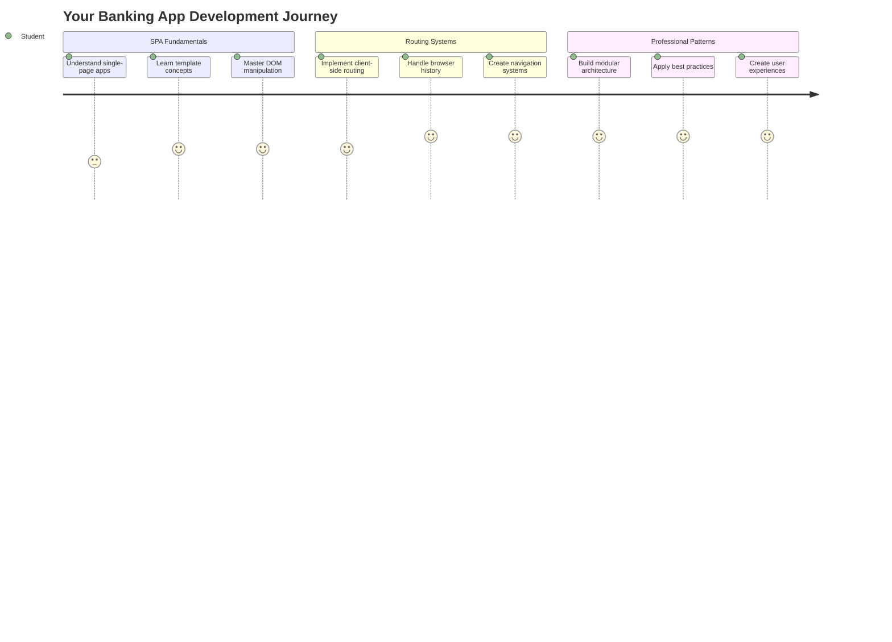
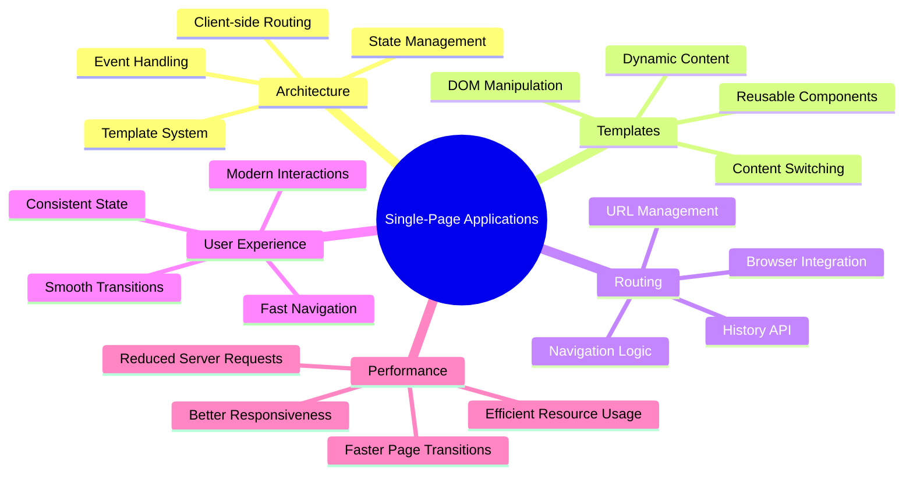
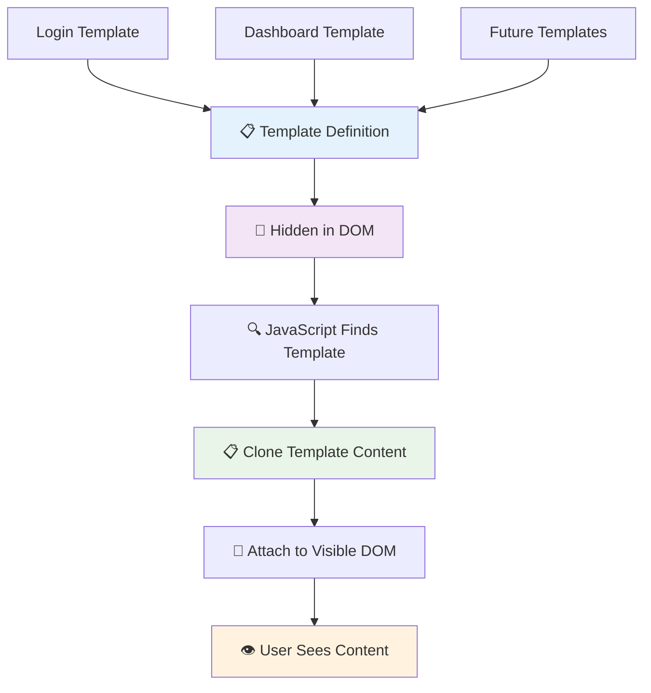
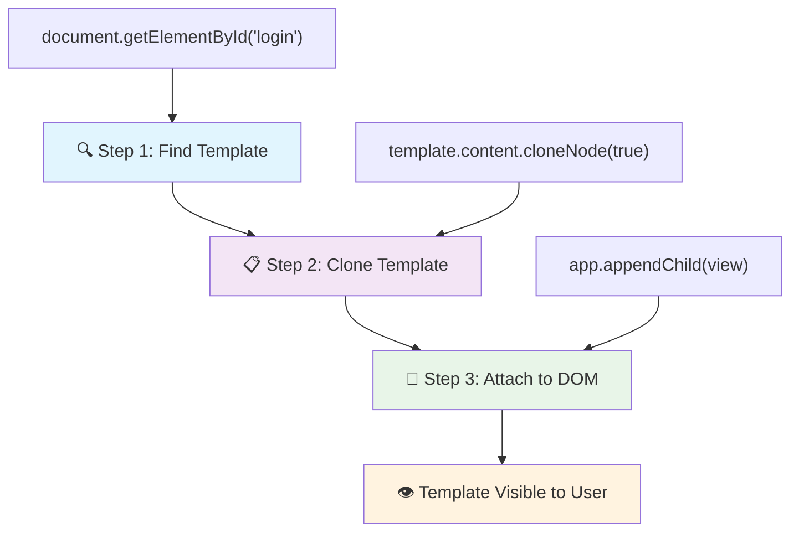
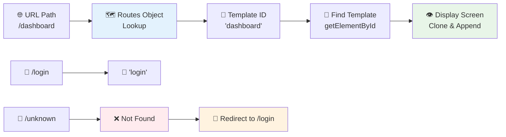
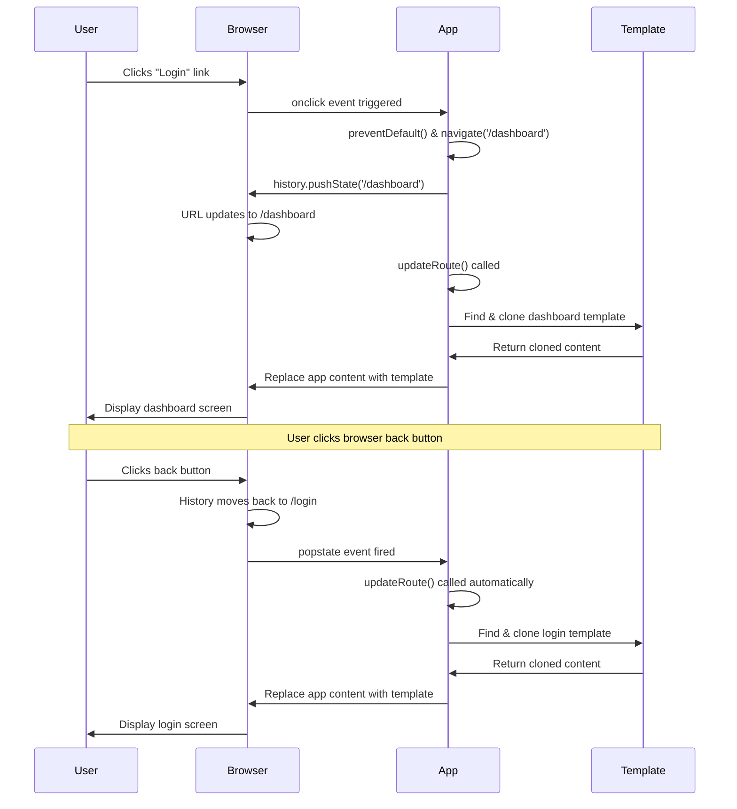
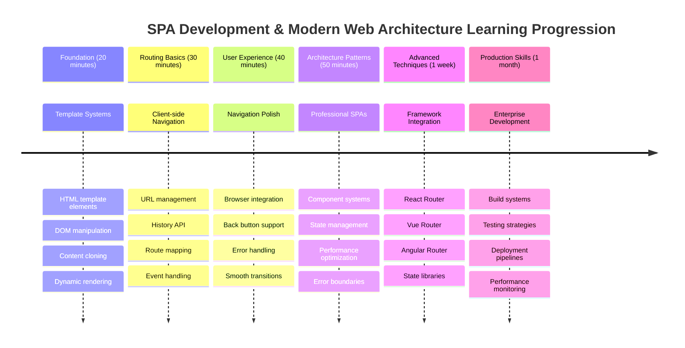

<!--
CO_OP_TRANSLATOR_METADATA:
{
  "original_hash": "351678bece18f07d9daa987a881fb062",
  "translation_date": "2025-11-03T12:40:11+00:00",
  "source_file": "7-bank-project/1-template-route/README.md",
  "language_code": "ar"
}
-->
# بناء تطبيق مصرفي الجزء الأول: قوالب HTML والمسارات في تطبيق ويب



عندما قامت حاسوب التوجيه الخاص بـ Apollo 11 بالتنقل إلى القمر في عام 1969، كان عليه التبديل بين برامج مختلفة دون إعادة تشغيل النظام بالكامل. تعمل تطبيقات الويب الحديثة بطريقة مشابهة - فهي تغير ما تراه دون إعادة تحميل كل شيء من البداية. هذا يخلق تجربة سلسة وسريعة يتوقعها المستخدمون اليوم.

على عكس المواقع التقليدية التي تعيد تحميل الصفحات بالكامل مع كل تفاعل، تقوم تطبيقات الويب الحديثة بتحديث الأجزاء التي تحتاج إلى تغيير فقط. هذا النهج، مثلما يقوم مركز التحكم بالتبديل بين شاشات مختلفة مع الحفاظ على التواصل المستمر، يخلق تلك التجربة السلسة التي اعتدنا عليها.

إليك ما يجعل الفرق كبيرًا:

| التطبيقات التقليدية متعددة الصفحات | التطبيقات الحديثة ذات الصفحة الواحدة |
|----------------------------|-------------------------|
| **التنقل** | إعادة تحميل الصفحة بالكامل لكل شاشة | تبديل المحتوى الفوري |
| **الأداء** | أبطأ بسبب تنزيل HTML بالكامل | أسرع مع التحديثات الجزئية |
| **تجربة المستخدم** | وميض الصفحات المزعج | انتقالات سلسة تشبه التطبيقات |
| **مشاركة البيانات** | صعوبة بين الصفحات | إدارة الحالة بسهولة |
| **التطوير** | ملفات HTML متعددة للصيانة | HTML واحد مع قوالب ديناميكية |

**فهم التطور:**
- **التطبيقات التقليدية** تتطلب طلبات خادم لكل إجراء تنقل
- **التطبيقات الحديثة ذات الصفحة الواحدة (SPAs)** يتم تحميلها مرة واحدة وتحديث المحتوى ديناميكيًا باستخدام JavaScript
- **توقعات المستخدمين** الآن تفضل التفاعلات الفورية والسلسة
- **فوائد الأداء** تشمل تقليل عرض النطاق الترددي واستجابات أسرع

في هذا الدرس، سنقوم ببناء تطبيق مصرفي يحتوي على شاشات متعددة تتدفق بسلاسة معًا. مثلما يستخدم العلماء أدوات معيارية يمكن إعادة تكوينها لتجارب مختلفة، سنستخدم قوالب HTML كعناصر قابلة لإعادة الاستخدام يمكن عرضها حسب الحاجة.

ستعمل مع قوالب HTML (مخططات قابلة لإعادة الاستخدام لشاشات مختلفة)، توجيه JavaScript (النظام الذي يبدل بين الشاشات)، وواجهة برمجة تطبيقات تاريخ المتصفح (التي تحافظ على عمل زر الرجوع كما هو متوقع). هذه هي نفس التقنيات الأساسية التي تستخدمها أطر العمل مثل React، Vue، وAngular.

بحلول النهاية، سيكون لديك تطبيق مصرفي يعمل يوضح مبادئ تطبيقات الصفحة الواحدة الاحترافية.



## اختبار ما قبل المحاضرة

[اختبار ما قبل المحاضرة](https://ff-quizzes.netlify.app/web/quiz/41)

### ما الذي ستحتاجه

سنحتاج إلى خادم ويب محلي لاختبار تطبيقنا المصرفي - لا تقلق، الأمر أسهل مما يبدو! إذا لم يكن لديك واحد مثبت بالفعل، فقط قم بتثبيت [Node.js](https://nodejs.org) وقم بتشغيل `npx lite-server` من مجلد المشروع الخاص بك. هذا الأمر المفيد يقوم بتشغيل خادم محلي ويفتح تطبيقك تلقائيًا في المتصفح.

### التحضير

على جهاز الكمبيوتر الخاص بك، قم بإنشاء مجلد باسم `bank` مع ملف باسم `index.html` بداخله. سنبدأ من هذا [القالب الأساسي](https://en.wikipedia.org/wiki/Boilerplate_code):

```html
<!DOCTYPE html>
<html lang="en">
  <head>
    <meta charset="UTF-8">
    <meta name="viewport" content="width=device-width, initial-scale=1.0">
    <title>Bank App</title>
  </head>
  <body>
    <!-- This is where you'll work -->
  </body>
</html>
```

**إليك ما يوفره هذا القالب الأساسي:**
- **يحدد** هيكل مستند HTML5 مع إعلان DOCTYPE المناسب
- **يهيئ** ترميز الأحرف كـ UTF-8 لدعم النصوص الدولية
- **يمكن** التصميم المتجاوب مع علامة meta الخاصة بالعرض لتوافق الأجهزة المحمولة
- **يضع** عنوانًا وصفيًا يظهر في علامة تبويب المتصفح
- **ينشئ** قسمًا نظيفًا للجسم حيث سنبني تطبيقنا

> 📁 **معاينة هيكل المشروع**
> 
> **بحلول نهاية هذا الدرس، سيحتوي مشروعك على:**
> ```
> bank/
> ├── index.html      <!-- Main HTML with templates -->
> ├── app.js          <!-- Routing and navigation logic -->
> └── style.css       <!-- (Optional for future lessons) -->
> ```
> 
> **مسؤوليات الملفات:**
> - **index.html**: يحتوي على جميع القوالب ويوفر هيكل التطبيق
> - **app.js**: يتعامل مع التوجيه، التنقل، وإدارة القوالب
> - **القوالب**: تحدد واجهة المستخدم لتسجيل الدخول، لوحة التحكم، والشاشات الأخرى

---

## قوالب HTML

تحل القوالب مشكلة أساسية في تطوير الويب. عندما اخترع غوتنبرغ الطباعة بالحروف المتحركة في الأربعينيات من القرن الخامس عشر، أدرك أنه بدلاً من نحت صفحات كاملة، يمكنه إنشاء كتل حروف قابلة لإعادة الاستخدام وترتيبها حسب الحاجة. تعمل قوالب HTML على نفس المبدأ - بدلاً من إنشاء ملفات HTML منفصلة لكل شاشة، تقوم بتحديد هياكل قابلة لإعادة الاستخدام يمكن عرضها عند الحاجة.



فكر في القوالب كمخططات لأجزاء مختلفة من تطبيقك. تمامًا كما يقوم المهندس المعماري بإنشاء مخطط واحد ويستخدمه عدة مرات بدلاً من إعادة رسم غرف متطابقة، نقوم بإنشاء القوالب مرة واحدة ونستخدمها عند الحاجة. يحتفظ المتصفح بهذه القوالب مخفية حتى يقوم JavaScript بتنشيطها.

إذا كنت تريد إنشاء شاشات متعددة لصفحة ويب، فإن أحد الحلول هو إنشاء ملف HTML لكل شاشة تريد عرضها. ومع ذلك، يأتي هذا الحل مع بعض الإزعاج:

- يجب عليك إعادة تحميل HTML بالكامل عند تبديل الشاشة، مما قد يكون بطيئًا.
- من الصعب مشاركة البيانات بين الشاشات المختلفة.

نهج آخر هو وجود ملف HTML واحد فقط، وتحديد قوالب [HTML](https://developer.mozilla.org/docs/Web/HTML/Element/template) متعددة باستخدام عنصر `<template>`. القالب هو كتلة HTML قابلة لإعادة الاستخدام لا يتم عرضها بواسطة المتصفح، ويجب أن يتم تفعيلها أثناء وقت التشغيل باستخدام JavaScript.

### لنقم ببنائه

سنقوم بإنشاء تطبيق مصرفي يحتوي على شاشتين رئيسيتين: صفحة تسجيل الدخول ولوحة التحكم. أولاً، دعنا نضيف عنصرًا نائبًا إلى جسم HTML الخاص بنا - هذا هو المكان الذي ستظهر فيه جميع شاشاتنا المختلفة:

```html
<div id="app">Loading...</div>
```

**فهم هذا العنصر النائب:**
- **ينشئ** حاوية مع المعرف "app" حيث سيتم عرض جميع الشاشات
- **يعرض** رسالة تحميل حتى يقوم JavaScript بتشغيل الشاشة الأولى
- **يوفر** نقطة تركيب واحدة لمحتوانا الديناميكي
- **يمكن** استهدافه بسهولة من JavaScript باستخدام `document.getElementById()`

> 💡 **نصيحة احترافية**: نظرًا لأن محتوى هذا العنصر سيتم استبداله، يمكننا وضع رسالة تحميل أو مؤشر يتم عرضه أثناء تحميل التطبيق.

بعد ذلك، دعنا نضيف أسفل القالب HTML لصفحة تسجيل الدخول. في الوقت الحالي، سنضع فقط عنوانًا وقسمًا يحتوي على رابط سنستخدمه للتنقل.

```html
<template id="login">
  <h1>Bank App</h1>
  <section>
    <a href="/dashboard">Login</a>
  </section>
</template>
```

**تفصيل هذا القالب لتسجيل الدخول:**
- **يحدد** قالبًا بمعرف فريد "login" لاستهدافه بواسطة JavaScript
- **يتضمن** عنوانًا رئيسيًا يحدد العلامة التجارية للتطبيق
- **يحتوي** على عنصر `<section>` دلالي لتجميع المحتوى ذي الصلة
- **يوفر** رابط تنقل ينقل المستخدمين إلى لوحة التحكم

ثم سنضيف قالب HTML آخر لصفحة لوحة التحكم. ستحتوي هذه الصفحة على أقسام مختلفة:

- رأس يحتوي على عنوان ورابط تسجيل الخروج
- الرصيد الحالي لحساب البنك
- قائمة المعاملات، معروضة في جدول

```html
<template id="dashboard">
  <header>
    <h1>Bank App</h1>
    <a href="/login">Logout</a>
  </header>
  <section>
    Balance: 100$
  </section>
  <section>
    <h2>Transactions</h2>
    <table>
      <thead>
        <tr>
          <th>Date</th>
          <th>Object</th>
          <th>Amount</th>
        </tr>
      </thead>
      <tbody></tbody>
    </table>
  </section>
</template>
```

**لنقم بفهم كل جزء من هذه اللوحة:**
- **يهيكل** الصفحة بعنصر `<header>` دلالي يحتوي على التنقل
- **يعرض** عنوان التطبيق بشكل متسق عبر الشاشات للعلامة التجارية
- **يوفر** رابط تسجيل الخروج الذي يعيد التوجيه إلى شاشة تسجيل الدخول
- **يعرض** الرصيد الحالي للحساب في قسم مخصص
- **ينظم** بيانات المعاملات باستخدام جدول HTML منظم بشكل صحيح
- **يحدد** رؤوس الجدول لأعمدة التاريخ، الموضوع، والمبلغ
- **يترك** جسم الجدول فارغًا لحقن المحتوى الديناميكي لاحقًا

> 💡 **نصيحة احترافية**: عند إنشاء قوالب HTML، إذا كنت تريد رؤية كيف ستبدو، يمكنك تعليق سطور `<template>` و`</template>` عن طريق إحاطتها بـ `<!-- -->`.

### 🔄 **تسجيل تربوي**
**فهم نظام القوالب**: قبل تنفيذ JavaScript، تأكد من فهمك:
- ✅ كيف تختلف القوالب عن عناصر HTML العادية
- ✅ لماذا تبقى القوالب مخفية حتى يتم تفعيلها بواسطة JavaScript
- ✅ أهمية هيكل HTML الدلالي في القوالب
- ✅ كيف تمكن القوالب مكونات واجهة المستخدم القابلة لإعادة الاستخدام

**اختبار سريع ذاتي**: ماذا يحدث إذا قمت بإزالة علامات `<template>` من حول HTML الخاص بك؟
*الإجابة: يصبح المحتوى مرئيًا فورًا ويفقد وظيفته كقالب*

**فوائد الهيكلية**: توفر القوالب:
- **إعادة الاستخدام**: تعريف واحد، حالات متعددة
- **الأداء**: لا تحليل HTML مكرر
- **سهولة الصيانة**: هيكل واجهة المستخدم المركزي
- **المرونة**: تبديل المحتوى الديناميكي

✅ لماذا تعتقد أننا نستخدم سمات `id` على القوالب؟ هل يمكننا استخدام شيء آخر مثل الفئات؟

## إحياء القوالب باستخدام JavaScript

الآن نحتاج إلى جعل قوالبنا وظيفية. مثلما تأخذ الطابعة ثلاثية الأبعاد مخططًا رقميًا وتخلق كائنًا ماديًا، يأخذ JavaScript قوالبنا المخفية ويخلق عناصر مرئية وتفاعلية يمكن للمستخدمين رؤيتها واستخدامها.

تتبع العملية ثلاث خطوات متسقة تشكل أساس تطوير الويب الحديث. بمجرد فهمك لهذا النمط، ستتعرف عليه عبر العديد من الأطر والمكتبات.

إذا جربت ملف HTML الحالي الخاص بك في المتصفح، سترى أنه يتوقف عند عرض `Loading...`. هذا لأننا بحاجة إلى إضافة بعض كود JavaScript لتفعيل وعرض قوالب HTML.

عادةً ما يتم تفعيل القالب في 3 خطوات:

1. استرجاع عنصر القالب في DOM، على سبيل المثال باستخدام [`document.getElementById`](https://developer.mozilla.org/docs/Web/API/Document/getElementById).
2. نسخ عنصر القالب، باستخدام [`cloneNode`](https://developer.mozilla.org/docs/Web/API/Node/cloneNode).
3. إرفاقه بـ DOM تحت عنصر مرئي، على سبيل المثال باستخدام [`appendChild`](https://developer.mozilla.org/docs/Web/API/Node/appendChild).



**تفصيل مرئي للعملية:**
- **الخطوة 1** تحدد موقع القالب المخفي في هيكل DOM
- **الخطوة 2** تنشئ نسخة عمل يمكن تعديلها بأمان
- **الخطوة 3** تدخل النسخة في منطقة الصفحة المرئية
- **النتيجة** هي شاشة وظيفية يمكن للمستخدمين التفاعل معها

✅ لماذا نحتاج إلى نسخ القالب قبل إرفاقه بـ DOM؟ ماذا تعتقد سيحدث إذا تخطينا هذه الخطوة؟

### المهمة

قم بإنشاء ملف جديد باسم `app.js` في مجلد المشروع الخاص بك وقم باستيراد هذا الملف في قسم `<head>` من HTML الخاص بك:

```html
<script src="app.js" defer></script>
```

**فهم استيراد هذا السكربت:**
- **يربط** ملف JavaScript بمستند HTML الخاص بنا
- **يستخدم** سمة `defer` لضمان تشغيل السكربت بعد اكتمال تحليل HTML
- **يمكن** الوصول إلى جميع عناصر DOM لأنها محملة بالكامل قبل تنفيذ السكربت
- **يتبع** أفضل الممارسات الحديثة لتحميل السكربت والأداء

الآن في `app.js`، سنقوم بإنشاء وظيفة جديدة `updateRoute`:

```js
function updateRoute(templateId) {
  const template = document.getElementById(templateId);
  const view = template.content.cloneNode(true);
  const app = document.getElementById('app');
  app.innerHTML = '';
  app.appendChild(view);
}
```

**خطوة بخطوة، إليك ما يحدث:**
- **يحدد** عنصر القالب باستخدام معرفه الفريد
- **ينشئ** نسخة عميقة من محتوى القالب باستخدام `cloneNode(true)`
- **يجد** حاوية التطبيق حيث سيتم عرض المحتوى
- **يمسح** أي محتوى موجود من حاوية التطبيق
- **يدخل** محتوى القالب المنسوخ في DOM المرئي

الآن قم باستدعاء هذه الوظيفة مع أحد القوالب وانظر إلى النتيجة.

```js
updateRoute('login');
```

**ما الذي تحققه هذه المكالمة الوظيفية:**
- **يفعل** قالب تسجيل الدخول عن طريق تمرير معرفه كمعامل
- **يوضح** كيفية التبديل برمجيًا بين شاشات التطبيق المختلفة
- **يعرض** شاشة تسجيل الدخول بدلاً من رسالة "Loading..."

✅ ما الغرض من هذا الكود `app.innerHTML = '';`؟ ماذا يحدث بدونه؟

## إنشاء المسارات

التوجيه يتعلق أساسًا بربط عناوين URL بالمحتوى الصحيح. فكر في كيفية استخدام مشغلي الهاتف الأوائل لوحات التبديل لتوصيل المكالمات - كانوا يأخذون طلبًا واردًا ويوجهونه إلى الوجهة الصحيحة. يعمل توجيه الويب بطريقة مشابهة، حيث يأخذ طلب عنوان URL ويحدد المحتوى الذي سيتم عرضه.



تقليديًا، كانت الخوادم تقوم بذلك عن طريق تقديم ملفات HTML مختلفة لعناوين URL مختلفة. نظرًا لأننا نبني تطبيق صفحة واحدة، نحتاج إلى التعامل مع هذا التوجيه بأنفسنا باستخدام JavaScript. هذا النهج يمنحنا مزيدًا من التحكم في تجربة المستخدم والأداء.


**فهم تدفق التوجيه:**
- **تغييرات URL** تؤدي إلى البحث في تكوين المسارات لدينا
- **المسارات الصالحة** ترتبط بمعرفات قوالب محددة للعرض
- **المسارات غير الصالحة** تؤدي إلى سلوك احتياطي لمنع الحالات المعطلة
- **عرض القالب** يتبع عملية الخطوات الثلاث التي تعلمناها سابقًا

عند الحديث عن تطبيق ويب، نسمي *التوجيه* النية لرسم **عناوين URL** لشاشات محددة يجب عرضها. في موقع ويب يحتوي على ملفات HTML متعددة، يتم ذلك تلقائيًا حيث تنعكس مسارات الملفات على عنوان URL. على سبيل المثال، مع هذه الملفات في مجلد المشروع الخاص بك:

```
mywebsite/index.html
mywebsite/login.html
mywebsite/admin/index.html
```

إذا قمت بإنشاء خادم ويب مع `mywebsite` كالجذر، سيكون تعيين عنوان URL:

```
https://site.com            --> mywebsite/index.html
https://site.com/login.html --> mywebsite/login.html
https://site.com/admin/     --> mywebsite/admin/index.html
```

ومع ذلك، بالنسبة لتطبيق الويب الخاص بنا، نحن نستخدم ملف HTML واحد يحتوي على جميع الشاشات لذا لن يساعدنا هذا السلوك الافتراضي. علينا إنشاء هذا التعيين يدويًا وتحديث القالب المعروض باستخدام JavaScript.

### المهمة

سنستخدم كائنًا بسيطًا لتنفيذ [خريطة](https://en.wikipedia.org/wiki/Associative_array) بين مسارات URL وقوالبنا. أضف هذا الكائن في أعلى ملف `app.js` الخاص بك.

```js
const routes = {
  '/login': { templateId: 'login' },
  '/dashboard': { templateId: 'dashboard' },
};
```

**فهم تكوين المسارات هذا:**
- **يحدد** تعيينًا بين مسارات URL ومعرفات القوالب
- **يستخدم** صيغة الكائن حيث تكون المفاتيح مسارات URL والقيم تحتوي على معلومات القالب
- **يمكن** البحث بسهولة عن القالب الذي سيتم عرضه لأي عنوان URL معين
- **يوفر** هيكلًا قابلًا للتوسع لإضافة مسارات جديدة في المستقبل
الآن دعونا نعدل قليلاً وظيفة `updateRoute`. بدلاً من تمرير `templateId` مباشرة كمعامل، نريد استرجاعه أولاً من خلال النظر إلى عنوان URL الحالي، ثم استخدام الخريطة الخاصة بنا للحصول على قيمة معرف القالب المقابلة. يمكننا استخدام [`window.location.pathname`](https://developer.mozilla.org/docs/Web/API/Location/pathname) للحصول فقط على قسم المسار من عنوان URL.

```js
function updateRoute() {
  const path = window.location.pathname;
  const route = routes[path];

  const template = document.getElementById(route.templateId);
  const view = template.content.cloneNode(true);
  const app = document.getElementById('app');
  app.innerHTML = '';
  app.appendChild(view);
}
```

**تفصيل ما يحدث هنا:**
- **يستخرج** المسار الحالي من عنوان URL الخاص بالمتصفح باستخدام `window.location.pathname`
- **يبحث** عن تكوين المسار المقابل في كائن المسارات الخاص بنا
- **يسترجع** معرف القالب من تكوين المسار
- **يتبع** نفس عملية عرض القالب كما كان من قبل
- **ينشئ** نظامًا ديناميكيًا يستجيب لتغييرات عنوان URL

هنا قمنا بربط المسارات التي أعلنا عنها بالقالب المقابل. يمكنك تجربته للتأكد من أنه يعمل بشكل صحيح عن طريق تغيير عنوان URL يدويًا في متصفحك.

✅ ماذا يحدث إذا أدخلت مسارًا غير معروف في عنوان URL؟ كيف يمكننا حل هذه المشكلة؟

## إضافة التنقل

مع إنشاء التوجيه، يحتاج المستخدمون إلى طريقة للتنقل عبر التطبيق. تعيد المواقع التقليدية تحميل الصفحات بالكامل عند النقر على الروابط، لكننا نريد تحديث كل من عنوان URL والمحتوى دون إعادة تحميل الصفحات. هذا يخلق تجربة أكثر سلاسة تشبه كيفية تبديل التطبيقات المكتبية بين وجهات النظر المختلفة.

نحتاج إلى تنسيق شيئين: تحديث عنوان URL الخاص بالمتصفح حتى يتمكن المستخدمون من وضع إشارات مرجعية للصفحات ومشاركة الروابط، وعرض المحتوى المناسب. عندما يتم تنفيذ ذلك بشكل صحيح، فإنه يخلق التنقل السلس الذي يتوقعه المستخدمون من التطبيقات الحديثة.



### 🔄 **مراجعة تعليمية**
**هيكلية تطبيق الصفحة الواحدة**: تحقق من فهمك للنظام الكامل:
- ✅ كيف يختلف التوجيه على جانب العميل عن التوجيه التقليدي على جانب الخادم؟
- ✅ لماذا تعتبر واجهة برمجة التطبيقات History ضرورية للتنقل الصحيح في تطبيق الصفحة الواحدة؟
- ✅ كيف تمكن القوالب المحتوى الديناميكي دون إعادة تحميل الصفحات؟
- ✅ ما هو دور معالجة الأحداث في اعتراض التنقل؟

**تكامل النظام**: يوضح تطبيق الصفحة الواحدة الخاص بك:
- **إدارة القوالب**: مكونات واجهة مستخدم قابلة لإعادة الاستخدام مع محتوى ديناميكي
- **التوجيه على جانب العميل**: إدارة عنوان URL دون طلبات الخادم
- **هيكلية تعتمد على الأحداث**: التنقل التفاعلي وتفاعلات المستخدم
- **تكامل المتصفح**: دعم صحيح لأزرار الرجوع/التقدم
- **تحسين الأداء**: انتقالات سريعة وتقليل تحميل الخادم

**أنماط احترافية**: لقد قمت بتنفيذ:
- **فصل النموذج والعرض**: فصل القوالب عن منطق التطبيق
- **إدارة الحالة**: مزامنة حالة عنوان URL مع المحتوى المعروض
- **تحسين تدريجي**: تعزيز JavaScript لوظائف HTML الأساسية
- **تجربة المستخدم**: تنقل سلس يشبه التطبيقات دون إعادة تحميل الصفحات

> � **رؤية هيكلية**: مكونات نظام التنقل
>
> **ما تقوم ببنائه:**
> - **🔄 إدارة عنوان URL**: تحديث شريط عنوان المتصفح دون إعادة تحميل الصفحات
> - **📋 نظام القوالب**: تبديل المحتوى ديناميكيًا بناءً على المسار الحالي  
> - **📚 تكامل التاريخ**: الحفاظ على وظيفة أزرار الرجوع/التقدم في المتصفح
> - **🛡️ معالجة الأخطاء**: حلول مرنة للمسارات غير الصالحة أو المفقودة
>
> **كيف تعمل المكونات معًا:**
> - **يستمع** لأحداث التنقل (النقرات، تغييرات التاريخ)
> - **يحدث** عنوان URL باستخدام واجهة برمجة التطبيقات History
> - **يعرض** القالب المناسب للمسار الجديد
> - **يحافظ** على تجربة مستخدم سلسة طوال الوقت

الخطوة التالية لتطبيقنا هي إضافة إمكانية التنقل بين الصفحات دون الحاجة إلى تغيير عنوان URL يدويًا. يتطلب ذلك شيئين:

  1. تحديث عنوان URL الحالي
  2. تحديث القالب المعروض بناءً على عنوان URL الجديد

لقد قمنا بالفعل بمعالجة الجزء الثاني باستخدام وظيفة `updateRoute`، لذا علينا معرفة كيفية تحديث عنوان URL الحالي.

سنحتاج إلى استخدام JavaScript وبشكل أكثر تحديدًا [`history.pushState`](https://developer.mozilla.org/docs/Web/API/History/pushState) الذي يسمح بتحديث عنوان URL وإنشاء إدخال جديد في سجل التصفح، دون إعادة تحميل HTML.

> ⚠️ **ملاحظة مهمة**: بينما يمكن استخدام عنصر HTML الرابط [`<a href>`](https://developer.mozilla.org/docs/Web/HTML/Element/a) بمفرده لإنشاء روابط تشعبية لعناوين URL مختلفة، فإنه سيجعل المتصفح يعيد تحميل HTML افتراضيًا. من الضروري منع هذا السلوك عند التعامل مع التوجيه باستخدام JavaScript مخصص، باستخدام وظيفة preventDefault() على حدث النقر.

### المهمة

دعونا ننشئ وظيفة جديدة يمكننا استخدامها للتنقل في تطبيقنا:

```js
function navigate(path) {
  window.history.pushState({}, path, path);
  updateRoute();
}
```

**فهم وظيفة التنقل هذه:**
- **يحدث** عنوان URL الخاص بالمتصفح إلى المسار الجديد باستخدام `history.pushState`
- **يضيف** إدخالًا جديدًا إلى سجل التصفح الخاص بالمتصفح لدعم أزرار الرجوع/التقدم بشكل صحيح
- **يحفز** وظيفة `updateRoute()` لعرض القالب المقابل
- **يحافظ** على تجربة تطبيق الصفحة الواحدة دون إعادة تحميل الصفحات

تقوم هذه الطريقة أولاً بتحديث عنوان URL الحالي بناءً على المسار المعطى، ثم تحديث القالب. الخاصية `window.location.origin` تعيد جذر عنوان URL، مما يسمح لنا بإعادة بناء عنوان URL كامل من مسار معين.

الآن بعد أن لدينا هذه الوظيفة، يمكننا معالجة المشكلة التي لدينا إذا لم يتطابق مسار مع أي مسار محدد. سنقوم بتعديل وظيفة `updateRoute` بإضافة حل احتياطي إلى أحد المسارات الموجودة إذا لم نتمكن من العثور على تطابق.

```js
function updateRoute() {
  const path = window.location.pathname;
  const route = routes[path];

  if (!route) {
    return navigate('/login');
  }

  const template = document.getElementById(route.templateId);
  const view = template.content.cloneNode(true);
  const app = document.getElementById('app');
  app.innerHTML = '';
  app.appendChild(view);
}
```

**نقاط رئيسية يجب تذكرها:**
- **يتحقق** مما إذا كان هناك مسار موجود للمسار الحالي
- **يعيد التوجيه** إلى صفحة تسجيل الدخول عند الوصول إلى مسار غير صالح
- **يوفر** آلية احتياطية تمنع التنقل المعطل
- **يضمن** أن المستخدمين دائمًا يرون شاشة صالحة، حتى مع عناوين URL غير صحيحة

إذا لم يتم العثور على مسار، سنقوم الآن بإعادة التوجيه إلى صفحة `login`.

الآن دعونا ننشئ وظيفة للحصول على عنوان URL عند النقر على رابط، ولمنع السلوك الافتراضي للرابط في المتصفح:

```js
function onLinkClick(event) {
  event.preventDefault();
  navigate(event.target.href);
}
```

**تفصيل معالج النقر هذا:**
- **يمنع** السلوك الافتراضي للرابط في المتصفح باستخدام `preventDefault()`
- **يستخرج** عنوان URL الوجهة من عنصر الرابط الذي تم النقر عليه
- **يستدعي** وظيفة التنقل المخصصة لدينا بدلاً من إعادة تحميل الصفحة
- **يحافظ** على تجربة تطبيق الصفحة الواحدة السلسة

```html
<a href="/dashboard" onclick="onLinkClick(event)">Login</a>
...
<a href="/login" onclick="onLinkClick(event)">Logout</a>
```

**ما يحققه هذا الربط باستخدام onclick:**
- **يربط** كل رابط بنظام التنقل المخصص لدينا
- **يمرر** حدث النقر إلى وظيفة `onLinkClick` الخاصة بنا للمعالجة
- **يمكن** التنقل السلس دون إعادة تحميل الصفحات
- **يحافظ** على هيكل عنوان URL الصحيح الذي يمكن للمستخدمين وضع إشارات مرجعية له أو مشاركته

تربط خاصية [`onclick`](https://developer.mozilla.org/docs/Web/API/GlobalEventHandlers/onclick) حدث النقر بكود JavaScript، هنا استدعاء وظيفة `navigate()`.

جرب النقر على هذه الروابط، يجب أن تكون الآن قادرًا على التنقل بين الشاشات المختلفة لتطبيقك.

✅ طريقة `history.pushState` هي جزء من معيار HTML5 ومطبقة في [جميع المتصفحات الحديثة](https://caniuse.com/?search=pushState). إذا كنت تقوم ببناء تطبيق ويب للمتصفحات القديمة، هناك حيلة يمكنك استخدامها بدلاً من هذه الواجهة البرمجية: باستخدام [علامة التجزئة (`#`)](https://en.wikipedia.org/wiki/URI_fragment) قبل المسار يمكنك تنفيذ التوجيه الذي يعمل مع التنقل العادي للروابط ولا يعيد تحميل الصفحة، حيث كان الغرض منها إنشاء روابط داخلية داخل الصفحة.

## جعل أزرار الرجوع والتقدم تعمل

أزرار الرجوع والتقدم أساسية لتصفح الويب، تمامًا مثل كيفية مراجعة مراقبي المهمات في ناسا حالات النظام السابقة أثناء المهمات الفضائية. يتوقع المستخدمون أن تعمل هذه الأزرار، وعندما لا تعمل، فإنها تكسر تجربة التصفح المتوقعة.

يحتاج تطبيق الصفحة الواحدة الخاص بنا إلى تكوين إضافي لدعم ذلك. يحتفظ المتصفح بسجل التنقل (الذي كنا نضيف إليه باستخدام `history.pushState`)، ولكن عندما يتنقل المستخدمون عبر هذا السجل، يحتاج تطبيقنا إلى الاستجابة عن طريق تحديث المحتوى المعروض وفقًا لذلك.


**نقاط التفاعل الرئيسية:**
- **إجراءات المستخدم** تحفز التنقل من خلال النقرات أو أزرار المتصفح
- **التطبيق يعترض** النقرات على الروابط لمنع إعادة تحميل الصفحات
- **واجهة برمجة التطبيقات History** تدير تغييرات عنوان URL وسجل التنقل في المتصفح
- **القوالب** توفر هيكل المحتوى لكل شاشة
- **مستمعو الأحداث** يضمنون استجابة التطبيق لجميع أنواع التنقل

استخدام `history.pushState` ينشئ إدخالات جديدة في سجل التنقل الخاص بالمتصفح. يمكنك التحقق من ذلك عن طريق الضغط على *زر الرجوع* في متصفحك، يجب أن يعرض شيئًا مثل هذا:


إذا حاولت النقر على زر الرجوع عدة مرات، سترى أن عنوان URL الحالي يتغير ويتم تحديث السجل، لكن نفس القالب يستمر في العرض.

ذلك لأن التطبيق لا يعرف أننا بحاجة إلى استدعاء `updateRoute()` في كل مرة يتغير السجل. إذا نظرت إلى [وثائق `history.pushState`](https://developer.mozilla.org/docs/Web/API/History/pushState)، يمكنك أن ترى أنه إذا تغيرت الحالة - مما يعني أننا انتقلنا إلى عنوان URL مختلف - يتم تحفيز حدث [`popstate`](https://developer.mozilla.org/docs/Web/API/Window/popstate_event). سنستخدم ذلك لإصلاح هذه المشكلة.

### المهمة

للتأكد من تحديث القالب المعروض عندما يتغير سجل المتصفح، سنرفق وظيفة جديدة تستدعي `updateRoute()`. سنقوم بذلك في أسفل ملف `app.js` الخاص بنا:

```js
window.onpopstate = () => updateRoute();
updateRoute();
```

**فهم هذا التكامل مع السجل:**
- **يستمع** لأحداث `popstate` التي تحدث عندما يتنقل المستخدمون باستخدام أزرار المتصفح
- **يستخدم** وظيفة سهمية لكتابة مختصرة لمعالج الحدث
- **يستدعي** `updateRoute()` تلقائيًا كلما تغيرت حالة السجل
- **يبدأ** التطبيق عن طريق استدعاء `updateRoute()` عند تحميل الصفحة لأول مرة
- **يضمن** عرض القالب الصحيح بغض النظر عن كيفية تنقل المستخدمين

> 💡 **نصيحة احترافية**: استخدمنا [وظيفة سهمية](https://developer.mozilla.org/docs/Web/JavaScript/Reference/Functions/Arrow_functions) هنا لإعلان معالج حدث `popstate` لدينا بشكل مختصر، ولكن وظيفة عادية ستعمل بنفس الطريقة.

إليك فيديو تذكيري عن وظائف السهم:

[](https://youtube.com/watch?v=OP6eEbOj2sc "وظائف السهم")

> 🎥 انقر على الصورة أعلاه لمشاهدة فيديو عن وظائف السهم.

الآن حاول استخدام أزرار الرجوع والتقدم في متصفحك، وتأكد من أن المسار المعروض يتم تحديثه بشكل صحيح هذه المرة.

### ⚡ **ما يمكنك القيام به في الدقائق الخمس القادمة**
- [ ] اختبر التنقل في تطبيقك البنكي باستخدام أزرار الرجوع/التقدم في المتصفح
- [ ] جرب كتابة عناوين URL مختلفة يدويًا في شريط العنوان لاختبار التوجيه
- [ ] افتح أدوات المطور في المتصفح وتحقق من كيفية استنساخ القوالب إلى DOM
- [ ] جرب إضافة عبارات console.log لتتبع تدفق التوجيه

### 🎯 **ما يمكنك تحقيقه خلال الساعة القادمة**
- [ ] أكمل اختبار ما بعد الدرس وافهم مفاهيم هيكلية تطبيق الصفحة الواحدة
- [ ] أضف تنسيقات CSS لجعل قوالب تطبيقك البنكي تبدو احترافية
- [ ] نفذ تحدي صفحة خطأ 404 مع معالجة الأخطاء بشكل صحيح
- [ ] أنشئ تحدي صفحة الاعتمادات مع وظيفة توجيه إضافية
- [ ] أضف حالات التحميل والانتقالات بين تبديلات القوالب

### 📅 **رحلة تطوير تطبيق الصفحة الواحدة الخاصة بك لمدة أسبوع**
- [ ] أكمل التطبيق البنكي بالكامل مع النماذج، إدارة البيانات، والاستمرارية
- [ ] أضف ميزات توجيه متقدمة مثل معلمات المسار والمسارات المتداخلة
- [ ] نفذ حراس التنقل والتوجيه القائم على المصادقة
- [ ] أنشئ مكونات قوالب قابلة لإعادة الاستخدام ومكتبة مكونات
- [ ] أضف الرسوم المتحركة والانتقالات لتجربة مستخدم أكثر سلاسة
- [ ] انشر تطبيق الصفحة الواحدة الخاص بك على منصة استضافة وقم بتكوين التوجيه بشكل صحيح

### 🌟 **رحلة إتقان هيكلية الواجهة الأمامية الخاصة بك لمدة شهر**
- [ ] قم ببناء تطبيقات صفحة واحدة معقدة باستخدام أطر عمل حديثة مثل React، Vue، أو Angular
- [ ] تعلم أنماط إدارة الحالة المتقدمة والمكتبات
- [ ] أتقن أدوات البناء وسير العمل التطويري لتطوير تطبيقات الصفحة الواحدة
- [ ] نفذ ميزات تطبيقات الويب التقدمية والوظائف غير المتصلة بالإنترنت
- [ ] ادرس تقنيات تحسين الأداء لتطبيقات الصفحة الواحدة واسعة النطاق
- [ ] ساهم في مشاريع تطبيقات الصفحة الواحدة مفتوحة المصدر وشارك معرفتك

## 🎯 جدول زمني لإتقان تطبيق الصفحة الواحدة الخاص بك



### 🛠️ ملخص أدوات تطوير تطبيق الصفحة الواحدة الخاص بك

بعد إكمال هذا الدرس، أصبحت الآن متقنًا:
- **هيكلية القوالب**: مكونات HTML قابلة لإعادة الاستخدام مع عرض محتوى ديناميكي
- **التوجيه على جانب العميل**: إدارة عنوان URL والتنقل دون إعادة تحميل الصفحات
- **تكامل المتصفح**: استخدام واجهة برمجة التطبيقات History ودعم أزرار الرجوع/التقدم
- **أنظمة تعتمد على الأحداث**: معالجة التنقل وتفاعلات المستخدم
- **التعامل مع DOM**: استنساخ القوالب، تبديل المحتوى، وإدارة العناصر
- **معالجة الأخطاء**: حلول مرنة للمسارات غير الصالحة والمحتوى المفقود
- **أنماط الأداء**: استراتيجيات تحميل المحتوى وعرضه بكفاءة

**تطبيقات العالم الحقيقي**: مهارات تطوير تطبيق الصفحة الواحدة الخاصة بك تنطبق مباشرة على:
- **تطبيقات الويب الحديثة**: تطوير باستخدام React، Vue، Angular، وغيرها من الأطر
- **تطبيقات الويب التقدمية**: تطبيقات قادرة على العمل دون اتصال مع تجارب تشبه التطبيقات
- **لوحات التحكم المؤسسية**: تطبيقات الأعمال المعقدة مع وجهات نظر متعددة
- **منصات التجارة الإلكترونية**: كتالوجات المنتجات، عربات التسوق، وتدفقات الدفع
- **إدارة المحتوى**: إنشاء وتحرير المحتوى الديناميكي
- **تطوير المحمول**: تطبيقات هجينة باستخدام تقنيات الويب

**المهارات المهنية المكتسبة**: يمكنك الآن:
- **تصميم** تطبيقات صفحة واحدة مع فصل واضح للمكونات
- **تنفيذ** أنظمة التوجيه على الجانب العميل التي تتناسب مع تعقيد التطبيق
- **تصحيح الأخطاء** في تدفقات التنقل المعقدة باستخدام أدوات المطور في المتصفح
- **تحسين** أداء التطبيق من خلال إدارة القوالب بكفاءة
- **تصميم** تجارب مستخدم تبدو طبيعية وسريعة الاستجابة

**مفاهيم تطوير الواجهة الأمامية المتقنة**:
- **هندسة المكونات**: أنماط واجهة مستخدم قابلة لإعادة الاستخدام وأنظمة القوالب
- **مزامنة الحالة**: إدارة حالة URL وسجل المتصفح
- **البرمجة القائمة على الأحداث**: التعامل مع تفاعلات المستخدم والتنقل
- **تحسين الأداء**: التلاعب الفعال بـ DOM وتحميل المحتوى
- **تصميم تجربة المستخدم**: انتقالات سلسة وتنقل بديهي

**المرحلة التالية**: أنت جاهز لاستكشاف أطر عمل الواجهة الأمامية الحديثة، إدارة الحالة المتقدمة، أو بناء تطبيقات مؤسسية معقدة!

🌟 **إنجاز محقق**: لقد بنيت أساسًا احترافيًا لتطبيق صفحة واحدة باستخدام أنماط هندسة الويب الحديثة!

---

## تحدي GitHub Copilot Agent 🚀

استخدم وضع الوكيل لإكمال التحدي التالي:

**الوصف:** قم بتحسين تطبيق البنك من خلال تنفيذ معالجة الأخطاء وقالب صفحة 404 للمسارات غير الصالحة، مما يحسن تجربة المستخدم عند التنقل إلى صفحات غير موجودة.

**المهمة:** قم بإنشاء قالب HTML جديد مع المعرف "not-found" يعرض صفحة خطأ 404 ودية مع تصميم. ثم قم بتعديل منطق التوجيه في JavaScript لعرض هذا القالب عندما يتنقل المستخدمون إلى عناوين URL غير صالحة، وأضف زر "العودة إلى الصفحة الرئيسية" الذي يعيد المستخدم إلى صفحة تسجيل الدخول.

تعرف أكثر على [وضع الوكيل](https://code.visualstudio.com/blogs/2025/02/24/introducing-copilot-agent-mode) هنا.

## 🚀 التحدي

أضف قالبًا ومسارًا جديدًا لصفحة ثالثة تعرض معلومات عن فريق العمل الذي أنشأ هذا التطبيق.

**أهداف التحدي**:
- **إنشاء** قالب HTML جديد مع هيكل محتوى مناسب
- **إضافة** المسار الجديد إلى كائن تكوين المسارات الخاص بك
- **تضمين** روابط تنقل إلى ومن صفحة الاعتمادات
- **اختبار** أن جميع التنقلات تعمل بشكل صحيح مع سجل المتصفح

## اختبار ما بعد المحاضرة

[اختبار ما بعد المحاضرة](https://ff-quizzes.netlify.app/web/quiz/42)

## المراجعة والدراسة الذاتية

التوجيه هو أحد الأجزاء التي قد تكون معقدة بشكل مفاجئ في تطوير الويب، خاصة مع انتقال الويب من سلوكيات تحديث الصفحة إلى تحديثات صفحة تطبيقات الصفحة الواحدة. اقرأ قليلاً عن [كيفية تعامل خدمة Azure Static Web App](https://docs.microsoft.com/azure/static-web-apps/routes/?WT.mc_id=academic-77807-sagibbon) مع التوجيه. هل يمكنك شرح سبب ضرورة بعض القرارات الموضحة في هذا المستند؟

**موارد تعليمية إضافية**:
- **استكشاف** كيفية تنفيذ أطر العمل الشهيرة مثل React Router و Vue Router للتوجيه على الجانب العميل
- **البحث** في الفروقات بين التوجيه القائم على التجزئة وتوجيه واجهة برمجة التطبيقات التاريخية
- **التعلم** عن العرض على الجانب الخادم (SSR) وكيف يؤثر على استراتيجيات التوجيه
- **التحقيق** في كيفية تعامل تطبيقات الويب التقدمية (PWAs) مع التوجيه والتنقل

## الواجب

[تحسين التوجيه](assignment.md)

---

**إخلاء المسؤولية**:  
تم ترجمة هذا المستند باستخدام خدمة الترجمة بالذكاء الاصطناعي [Co-op Translator](https://github.com/Azure/co-op-translator). بينما نسعى لتحقيق الدقة، يرجى العلم أن الترجمات الآلية قد تحتوي على أخطاء أو عدم دقة. يجب اعتبار المستند الأصلي بلغته الأصلية المصدر الرسمي. للحصول على معلومات حاسمة، يُوصى بالترجمة البشرية الاحترافية. نحن غير مسؤولين عن أي سوء فهم أو تفسيرات خاطئة تنشأ عن استخدام هذه الترجمة.