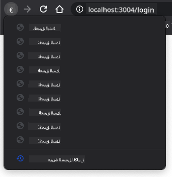

<!--
CO_OP_TRANSLATOR_METADATA:
{
  "original_hash": "8da1b5e2c63f749808858c53f37b8ce7",
  "translation_date": "2025-08-26T00:29:52+00:00",
  "source_file": "7-bank-project/1-template-route/README.md",
  "language_code": "ar"
}
-->
# بناء تطبيق مصرفي الجزء الأول: قوالب HTML والمسارات في تطبيق ويب

## اختبار ما قبل المحاضرة

[اختبار ما قبل المحاضرة](https://ashy-river-0debb7803.1.azurestaticapps.net/quiz/41)

### المقدمة

منذ ظهور JavaScript في المتصفحات، أصبحت المواقع أكثر تفاعلية وتعقيدًا من أي وقت مضى. تُستخدم تقنيات الويب الآن بشكل شائع لإنشاء تطبيقات وظيفية بالكامل تعمل مباشرة داخل المتصفح، والتي نسميها [تطبيقات الويب](https://en.wikipedia.org/wiki/Web_application). نظرًا لأن تطبيقات الويب تفاعلية للغاية، لا يرغب المستخدمون في انتظار إعادة تحميل الصفحة بالكامل في كل مرة يتم فيها تنفيذ إجراء. لهذا السبب يتم استخدام JavaScript لتحديث HTML مباشرة باستخدام DOM، لتوفير تجربة مستخدم أكثر سلاسة.

في هذه الدرس، سنضع الأسس لإنشاء تطبيق مصرفي على الويب، باستخدام قوالب HTML لإنشاء شاشات متعددة يمكن عرضها وتحديثها دون الحاجة إلى إعادة تحميل الصفحة بالكامل.

### المتطلبات الأساسية

تحتاج إلى خادم ويب محلي لاختبار تطبيق الويب الذي سنقوم ببنائه في هذا الدرس. إذا لم يكن لديك واحد، يمكنك تثبيت [Node.js](https://nodejs.org) واستخدام الأمر `npx lite-server` من مجلد المشروع الخاص بك. سيقوم بإنشاء خادم ويب محلي وفتح تطبيقك في المتصفح.

### التحضير

على جهاز الكمبيوتر الخاص بك، قم بإنشاء مجلد باسم `bank` مع ملف باسم `index.html` بداخله. سنبدأ من هذا [القالب الأساسي](https://en.wikipedia.org/wiki/Boilerplate_code):

```html
<!DOCTYPE html>
<html lang="en">
  <head>
    <meta charset="UTF-8">
    <meta name="viewport" content="width=device-width, initial-scale=1.0">
    <title>Bank App</title>
  </head>
  <body>
    <!-- This is where you'll work -->
  </body>
</html>
```

---

## قوالب HTML

إذا كنت ترغب في إنشاء شاشات متعددة لصفحة ويب، فإن إحدى الحلول هي إنشاء ملف HTML لكل شاشة تريد عرضها. ومع ذلك، تأتي هذه الطريقة مع بعض العيوب:

- يجب إعادة تحميل HTML بالكامل عند تبديل الشاشة، مما قد يكون بطيئًا.
- من الصعب مشاركة البيانات بين الشاشات المختلفة.

نهج آخر هو استخدام ملف HTML واحد فقط، وتعريف عدة [قوالب HTML](https://developer.mozilla.org/docs/Web/HTML/Element/template) باستخدام عنصر `<template>`. القالب هو كتلة HTML قابلة لإعادة الاستخدام لا يتم عرضها بواسطة المتصفح، ويجب تهيئتها أثناء وقت التشغيل باستخدام JavaScript.

### المهمة

سنقوم بإنشاء تطبيق مصرفي يحتوي على شاشتين: صفحة تسجيل الدخول ولوحة التحكم. أولاً، دعنا نضيف في جسم HTML عنصرًا فارغًا سنستخدمه لتهيئة الشاشات المختلفة لتطبيقنا:

```html
<div id="app">Loading...</div>
```

قمنا بإعطائه معرفًا لجعل العثور عليه أسهل باستخدام JavaScript لاحقًا.

> نصيحة: نظرًا لأن محتوى هذا العنصر سيتم استبداله، يمكننا وضع رسالة تحميل أو مؤشر يتم عرضه أثناء تحميل التطبيق.

بعد ذلك، دعنا نضيف أسفل القالب HTML الخاص بصفحة تسجيل الدخول. في الوقت الحالي، سنضع فقط عنوانًا وقسمًا يحتوي على رابط سنستخدمه للتنقل.

```html
<template id="login">
  <h1>Bank App</h1>
  <section>
    <a href="/dashboard">Login</a>
  </section>
</template>
```

ثم سنضيف قالب HTML آخر لصفحة لوحة التحكم. تحتوي هذه الصفحة على أقسام مختلفة:

- رأس يحتوي على عنوان ورابط تسجيل الخروج
- الرصيد الحالي لحساب البنك
- قائمة المعاملات، معروضة في جدول

```html
<template id="dashboard">
  <header>
    <h1>Bank App</h1>
    <a href="/login">Logout</a>
  </header>
  <section>
    Balance: 100$
  </section>
  <section>
    <h2>Transactions</h2>
    <table>
      <thead>
        <tr>
          <th>Date</th>
          <th>Object</th>
          <th>Amount</th>
        </tr>
      </thead>
      <tbody></tbody>
    </table>
  </section>
</template>
```

> نصيحة: عند إنشاء قوالب HTML، إذا كنت تريد رؤية كيف ستبدو، يمكنك تعليق سطور `<template>` و `</template>` عن طريق إحاطتها بـ `<!-- -->`.

✅ لماذا تعتقد أننا نستخدم سمات `id` على القوالب؟ هل يمكننا استخدام شيء آخر مثل الفئات؟

## عرض القوالب باستخدام JavaScript

إذا جربت ملف HTML الحالي في المتصفح، سترى أنه يبقى عالقًا في عرض `Loading...`. هذا لأننا بحاجة إلى إضافة بعض أكواد JavaScript لتهيئة وعرض قوالب HTML.

عادةً ما يتم تهيئة القالب في 3 خطوات:

1. استرجاع عنصر القالب في DOM، على سبيل المثال باستخدام [`document.getElementById`](https://developer.mozilla.org/docs/Web/API/Document/getElementById).
2. نسخ عنصر القالب، باستخدام [`cloneNode`](https://developer.mozilla.org/docs/Web/API/Node/cloneNode).
3. إرفاقه بـ DOM تحت عنصر مرئي، على سبيل المثال باستخدام [`appendChild`](https://developer.mozilla.org/docs/Web/API/Node/appendChild).

✅ لماذا نحتاج إلى نسخ القالب قبل إرفاقه بـ DOM؟ ماذا تعتقد سيحدث إذا تخطينا هذه الخطوة؟

### المهمة

قم بإنشاء ملف جديد باسم `app.js` في مجلد المشروع الخاص بك واستورد هذا الملف في قسم `<head>` من HTML:

```html
<script src="app.js" defer></script>
```

الآن في `app.js`، سنقوم بإنشاء وظيفة جديدة باسم `updateRoute`:

```js
function updateRoute(templateId) {
  const template = document.getElementById(templateId);
  const view = template.content.cloneNode(true);
  const app = document.getElementById('app');
  app.innerHTML = '';
  app.appendChild(view);
}
```

ما نقوم به هنا هو بالضبط الخطوات الثلاثة الموضحة أعلاه. نقوم بتهيئة القالب باستخدام المعرف `templateId`، ونضع محتواه المنسوخ داخل العنصر الفارغ لتطبيقنا. لاحظ أننا نحتاج إلى استخدام `cloneNode(true)` لنسخ الشجرة الكاملة للقالب.

الآن قم باستدعاء هذه الوظيفة مع أحد القوالب وانظر إلى النتيجة.

```js
updateRoute('login');
```

✅ ما هو الغرض من هذا الكود `app.innerHTML = '';`؟ ماذا يحدث بدونه؟

## إنشاء المسارات

عند الحديث عن تطبيق ويب، نسمي *التوجيه* النية في ربط **عناوين URL** بشاشات محددة يجب عرضها. في موقع ويب يحتوي على ملفات HTML متعددة، يتم ذلك تلقائيًا حيث تنعكس مسارات الملفات على عنوان URL. على سبيل المثال، مع هذه الملفات في مجلد المشروع الخاص بك:

```
mywebsite/index.html
mywebsite/login.html
mywebsite/admin/index.html
```

إذا قمت بإنشاء خادم ويب مع `mywebsite` كالجذر، ستكون خريطة URL:

```
https://site.com            --> mywebsite/index.html
https://site.com/login.html --> mywebsite/login.html
https://site.com/admin/     --> mywebsite/admin/index.html
```

ومع ذلك، بالنسبة لتطبيق الويب الخاص بنا، نحن نستخدم ملف HTML واحد يحتوي على جميع الشاشات، لذا لن يساعدنا هذا السلوك الافتراضي. علينا إنشاء هذه الخريطة يدويًا وتحديث القالب المعروض باستخدام JavaScript.

### المهمة

سنستخدم كائنًا بسيطًا لتنفيذ [خريطة](https://en.wikipedia.org/wiki/Associative_array) بين مسارات URL وقوالبنا. أضف هذا الكائن في أعلى ملف `app.js`.

```js
const routes = {
  '/login': { templateId: 'login' },
  '/dashboard': { templateId: 'dashboard' },
};
```

الآن دعنا نعدل قليلاً وظيفة `updateRoute`. بدلاً من تمرير `templateId` مباشرة كوسيطة، نريد استرجاعه أولاً بالنظر إلى عنوان URL الحالي، ثم استخدام خريطتنا للحصول على قيمة معرف القالب المقابلة. يمكننا استخدام [`window.location.pathname`](https://developer.mozilla.org/docs/Web/API/Location/pathname) للحصول على قسم المسار فقط من عنوان URL.

```js
function updateRoute() {
  const path = window.location.pathname;
  const route = routes[path];

  const template = document.getElementById(route.templateId);
  const view = template.content.cloneNode(true);
  const app = document.getElementById('app');
  app.innerHTML = '';
  app.appendChild(view);
}
```

هنا قمنا بربط المسارات التي أعلناها بالقالب المقابل. يمكنك تجربتها للتأكد من أنها تعمل بشكل صحيح عن طريق تغيير عنوان URL يدويًا في المتصفح.

✅ ماذا يحدث إذا أدخلت مسارًا غير معروف في عنوان URL؟ كيف يمكننا حل هذه المشكلة؟

## إضافة التنقل

الخطوة التالية لتطبيقنا هي إضافة إمكانية التنقل بين الصفحات دون الحاجة إلى تغيير عنوان URL يدويًا. يتضمن ذلك شيئين:

1. تحديث عنوان URL الحالي
2. تحديث القالب المعروض بناءً على عنوان URL الجديد

لقد قمنا بالفعل بمعالجة الجزء الثاني باستخدام وظيفة `updateRoute`، لذا علينا معرفة كيفية تحديث عنوان URL الحالي.

سنحتاج إلى استخدام JavaScript وبشكل أكثر تحديدًا [`history.pushState`](https://developer.mozilla.org/docs/Web/API/History/pushState) الذي يسمح بتحديث عنوان URL وإنشاء إدخال جديد في سجل التصفح، دون إعادة تحميل HTML.

> ملاحظة: بينما يمكن استخدام عنصر HTML الرابط [`<a href>`](https://developer.mozilla.org/docs/Web/HTML/Element/a) بمفرده لإنشاء روابط لعناوين URL مختلفة، فإنه سيجعل المتصفح يعيد تحميل HTML افتراضيًا. من الضروري منع هذا السلوك عند التعامل مع التوجيه باستخدام JavaScript مخصص، باستخدام وظيفة preventDefault() على حدث النقر.

### المهمة

دعنا ننشئ وظيفة جديدة يمكننا استخدامها للتنقل في تطبيقنا:

```js
function navigate(path) {
  window.history.pushState({}, path, path);
  updateRoute();
}
```

تقوم هذه الطريقة أولاً بتحديث عنوان URL الحالي بناءً على المسار المعطى، ثم تحديث القالب. الخاصية `window.location.origin` تُرجع جذر عنوان URL، مما يسمح لنا بإعادة بناء عنوان URL كامل من مسار معين.

الآن بعد أن لدينا هذه الوظيفة، يمكننا معالجة المشكلة التي لدينا إذا لم يتطابق المسار مع أي مسار محدد. سنقوم بتعديل وظيفة `updateRoute` بإضافة مسار احتياطي إلى أحد المسارات الموجودة إذا لم نتمكن من العثور على تطابق.

```js
function updateRoute() {
  const path = window.location.pathname;
  const route = routes[path];

  if (!route) {
    return navigate('/login');
  }

  ...
```

إذا لم يتم العثور على مسار، سنقوم الآن بإعادة التوجيه إلى صفحة `login`.

الآن دعنا ننشئ وظيفة للحصول على عنوان URL عند النقر على رابط، ولمنع السلوك الافتراضي للرابط في المتصفح:

```js
function onLinkClick(event) {
  event.preventDefault();
  navigate(event.target.href);
}
```

دعنا نكمل نظام التنقل بإضافة روابط إلى روابط *تسجيل الدخول* و *تسجيل الخروج* في HTML.

```html
<a href="/dashboard" onclick="onLinkClick(event)">Login</a>
...
<a href="/login" onclick="onLinkClick(event)">Logout</a>
```

الكائن `event` أعلاه، يلتقط حدث `click` ويمرره إلى وظيفة `onLinkClick`.

باستخدام خاصية [`onclick`](https://developer.mozilla.org/docs/Web/API/GlobalEventHandlers/onclick) قم بربط حدث `click` بكود JavaScript، هنا استدعاء وظيفة `navigate()`.

جرب النقر على هذه الروابط، يجب أن تكون الآن قادرًا على التنقل بين الشاشات المختلفة لتطبيقك.

✅ طريقة `history.pushState` هي جزء من معيار HTML5 ومُنفذة في [جميع المتصفحات الحديثة](https://caniuse.com/?search=pushState). إذا كنت تقوم ببناء تطبيق ويب للمتصفحات القديمة، هناك حيلة يمكنك استخدامها بدلاً من هذه API: باستخدام [الهاش (`#`)](https://en.wikipedia.org/wiki/URI_fragment) قبل المسار يمكنك تنفيذ التوجيه الذي يعمل مع التنقل العادي للروابط ولا يعيد تحميل الصفحة، حيث كان الغرض منه إنشاء روابط داخلية داخل الصفحة.

## التعامل مع أزرار الرجوع والتقدم في المتصفح

استخدام `history.pushState` يُنشئ إدخالات جديدة في سجل التنقل في المتصفح. يمكنك التحقق من ذلك بالضغط على *زر الرجوع* في المتصفح، يجب أن يعرض شيئًا مثل هذا:



إذا حاولت النقر على زر الرجوع عدة مرات، سترى أن عنوان URL الحالي يتغير ويتم تحديث السجل، لكن نفس القالب يستمر في العرض.

هذا لأن التطبيق لا يعرف أننا بحاجة إلى استدعاء `updateRoute()` في كل مرة يتغير السجل. إذا نظرت إلى [توثيق `history.pushState`](https://developer.mozilla.org/docs/Web/API/History/pushState)، يمكنك أن ترى أنه إذا تغيرت الحالة - بمعنى أننا انتقلنا إلى عنوان URL مختلف - يتم تشغيل حدث [`popstate`](https://developer.mozilla.org/docs/Web/API/Window/popstate_event). سنستخدم ذلك لإصلاح هذه المشكلة.

### المهمة

للتأكد من تحديث القالب المعروض عندما يتغير سجل المتصفح، سنرفق وظيفة جديدة تستدعي `updateRoute()`. سنقوم بذلك في أسفل ملف `app.js`:

```js
window.onpopstate = () => updateRoute();
updateRoute();
```

> ملاحظة: استخدمنا [وظيفة السهم](https://developer.mozilla.org/docs/Web/JavaScript/Reference/Functions/Arrow_functions) هنا لإعلان معالج حدث `popstate` للتوضيح، ولكن وظيفة عادية ستعمل بنفس الطريقة.

إليك فيديو تذكيري عن وظائف السهم:

[](https://youtube.com/watch?v=OP6eEbOj2sc "وظائف السهم")

> 🎥 انقر على الصورة أعلاه لمشاهدة فيديو عن وظائف السهم.

الآن حاول استخدام أزرار الرجوع والتقدم في المتصفح، وتأكد من أن المسار المعروض يتم تحديثه بشكل صحيح هذه المرة.

---

## 🚀 التحدي

أضف قالبًا جديدًا ومسارًا لصفحة ثالثة تعرض معلومات عن مطوري هذا التطبيق.

## اختبار ما بعد المحاضرة

[اختبار ما بعد المحاضرة](https://ashy-river-0debb7803.1.azurestaticapps.net/quiz/42)

## المراجعة والدراسة الذاتية

التوجيه هو أحد الأجزاء التي تبدو معقدة في تطوير الويب، خاصة مع انتقال الويب من سلوكيات تحديث الصفحة إلى تحديثات صفحة تطبيقات الويب ذات الصفحة الواحدة. اقرأ قليلاً عن [كيفية تعامل خدمة Azure Static Web App](https://docs.microsoft.com/azure/static-web-apps/routes/?WT.mc_id=academic-77807-sagibbon) مع التوجيه. هل يمكنك شرح سبب ضرورة بعض القرارات الموضحة في هذا المستند؟

## الواجب

[تحسين التوجيه](assignment.md)

**إخلاء المسؤولية**:  
تم ترجمة هذا المستند باستخدام خدمة الترجمة بالذكاء الاصطناعي [Co-op Translator](https://github.com/Azure/co-op-translator). بينما نسعى لتحقيق الدقة، يرجى العلم أن الترجمات الآلية قد تحتوي على أخطاء أو معلومات غير دقيقة. يجب اعتبار المستند الأصلي بلغته الأصلية المصدر الموثوق. للحصول على معلومات حاسمة، يُوصى بالاستعانة بترجمة بشرية احترافية. نحن غير مسؤولين عن أي سوء فهم أو تفسيرات خاطئة تنشأ عن استخدام هذه الترجمة.