<!--
CO_OP_TRANSLATOR_METADATA:
{
  "original_hash": "7cbdbd132d39a2bb493e85bc2a9387cc",
  "translation_date": "2025-11-03T12:41:08+00:00",
  "source_file": "7-bank-project/2-forms/README.md",
  "language_code": "ar"
}
-->
# بناء تطبيق مصرفي الجزء الثاني: إنشاء نموذج تسجيل الدخول والتسجيل

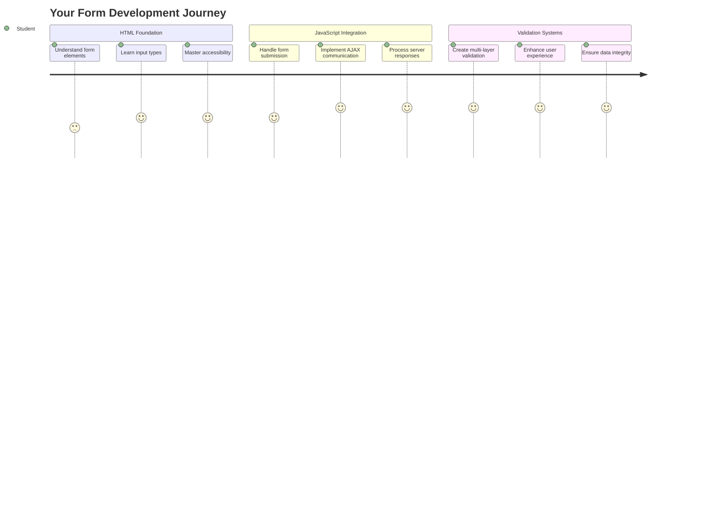

## اختبار ما قبل المحاضرة

[اختبار ما قبل المحاضرة](https://ff-quizzes.netlify.app/web/quiz/43)

هل سبق لك أن ملأت نموذجًا عبر الإنترنت وتم رفض تنسيق بريدك الإلكتروني؟ أو فقدت كل معلوماتك عند النقر على زر الإرسال؟ لقد واجهنا جميعًا هذه التجارب المحبطة.

النماذج هي الجسر بين المستخدمين ووظائف تطبيقك. مثل البروتوكولات الدقيقة التي يستخدمها مراقبو الحركة الجوية لتوجيه الطائرات بأمان إلى وجهاتها، توفر النماذج المصممة جيدًا ردود فعل واضحة وتمنع الأخطاء المكلفة. أما النماذج السيئة، من ناحية أخرى، يمكن أن تبعد المستخدمين بسرعة أكبر من سوء التواصل في مطار مزدحم.

في هذه الدرس، سنحول تطبيقك المصرفي الثابت إلى تطبيق تفاعلي. ستتعلم كيفية إنشاء نماذج تتحقق من صحة إدخال المستخدم، تتواصل مع الخوادم، وتوفر ردود فعل مفيدة. فكر في الأمر كإنشاء واجهة التحكم التي تتيح للمستخدمين التنقل في ميزات تطبيقك.

بحلول النهاية، سيكون لديك نظام تسجيل دخول وتسجيل كامل مع التحقق الذي يوجه المستخدمين نحو النجاح بدلاً من الإحباط.

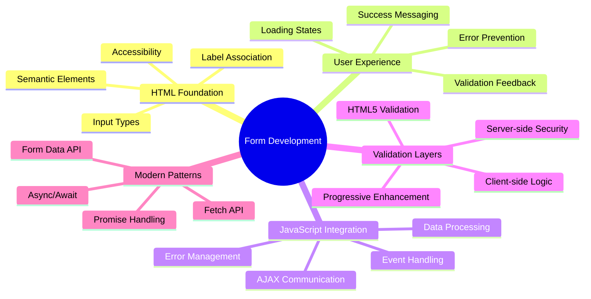

## المتطلبات الأساسية

قبل أن نبدأ في إنشاء النماذج، دعنا نتأكد من أن كل شيء معد بشكل صحيح. هذا الدرس يستكمل ما بدأناه في الدرس السابق، لذا إذا قفزت إلى الأمام، قد ترغب في العودة والتأكد من أن الأساسيات تعمل أولاً.

### الإعداد المطلوب

| المكون | الحالة | الوصف |
|--------|--------|-------|
| [قوالب HTML](../1-template-route/README.md) | ✅ مطلوب | هيكل تطبيقك المصرفي الأساسي |
| [Node.js](https://nodejs.org) | ✅ مطلوب | بيئة تشغيل JavaScript للخادم |
| [خادم API المصرفي](../api/README.md) | ✅ مطلوب | خدمة خلفية لتخزين البيانات |

> 💡 **نصيحة تطوير**: ستقوم بتشغيل خادمين منفصلين في نفس الوقت – واحد لتطبيقك المصرفي الأمامي وآخر لخادم API الخلفي. هذا الإعداد يعكس تطوير العالم الحقيقي حيث تعمل خدمات الواجهة الأمامية والخلفية بشكل مستقل.

### إعداد الخادم

**بيئة التطوير الخاصة بك ستشمل:**
- **خادم الواجهة الأمامية**: يقدم تطبيقك المصرفي (عادةً على المنفذ `3000`)
- **خادم API الخلفي**: يتعامل مع تخزين البيانات واسترجاعها (المنفذ `5000`)
- **كلا الخادمين** يمكن تشغيلهما في نفس الوقت دون تعارض

**اختبار اتصال API الخاص بك:**
```bash
curl http://localhost:5000/api
# Expected response: "Bank API v1.0.0"
```

**إذا رأيت استجابة إصدار API، فأنت جاهز للمتابعة!**

---

## فهم نماذج HTML وعناصر التحكم

نماذج HTML هي الطريقة التي يتواصل بها المستخدمون مع تطبيق الويب الخاص بك. فكر فيها كنظام التلغراف الذي ربط الأماكن البعيدة في القرن التاسع عشر – إنها بروتوكول الاتصال بين نية المستخدم واستجابة التطبيق. عندما يتم تصميمها بعناية، فإنها تلتقط الأخطاء، توجه تنسيق الإدخال، وتوفر اقتراحات مفيدة.

النماذج الحديثة أكثر تطورًا بكثير من إدخالات النص الأساسية. قدم HTML5 أنواع إدخال متخصصة تتعامل مع التحقق من البريد الإلكتروني، تنسيق الأرقام، واختيار التواريخ تلقائيًا. هذه التحسينات تفيد كل من إمكانية الوصول وتجارب المستخدمين على الأجهزة المحمولة.

### عناصر النموذج الأساسية

**اللبنات الأساسية التي يحتاجها كل نموذج:**

```html
<!-- Basic form structure -->
<form id="userForm" method="POST">
  <label for="username">Username</label>
  <input id="username" name="username" type="text" required>
  
  <button type="submit">Submit</button>
</form>
```

**ما يفعله هذا الكود:**
- **ينشئ** حاوية نموذج بمعرف فريد
- **يحدد** طريقة HTTP لإرسال البيانات
- **يربط** التسميات بالإدخالات لتحسين إمكانية الوصول
- **يحدد** زر إرسال لمعالجة النموذج

### أنواع الإدخال الحديثة والسمات

| نوع الإدخال | الغرض | مثال الاستخدام |
|-------------|-------|----------------|
| `text` | إدخال نص عام | `<input type="text" name="username">` |
| `email` | التحقق من البريد الإلكتروني | `<input type="email" name="email">` |
| `password` | إدخال نص مخفي | `<input type="password" name="password">` |
| `number` | إدخال رقمي | `<input type="number" name="balance" min="0">` |
| `tel` | أرقام الهاتف | `<input type="tel" name="phone">` |

> 💡 **ميزة HTML5 الحديثة**: استخدام أنواع الإدخال المحددة يوفر التحقق التلقائي، لوحات مفاتيح مناسبة للأجهزة المحمولة، ودعم أفضل لإمكانية الوصول دون الحاجة إلى JavaScript إضافي!

### أنواع الأزرار وسلوكها

```html
<!-- Different button behaviors -->
<button type="submit">Save Data</button>     <!-- Submits the form -->
<button type="reset">Clear Form</button>    <!-- Resets all fields -->
<button type="button">Custom Action</button> <!-- No default behavior -->
```

**ما يفعله كل نوع من الأزرار:**
- **أزرار الإرسال**: تُشغل إرسال النموذج وترسل البيانات إلى نقطة النهاية المحددة
- **أزرار إعادة التعيين**: تعيد جميع حقول النموذج إلى حالتها الأولية
- **الأزرار العادية**: لا توفر سلوكًا افتراضيًا، وتتطلب JavaScript مخصصًا للوظائف

> ⚠️ **ملاحظة مهمة**: عنصر `<input>` يغلق نفسه ولا يتطلب علامة إغلاق. الممارسة الحديثة الأفضل هي كتابة `<input>` بدون الشريط.

### إنشاء نموذج تسجيل الدخول الخاص بك

الآن دعونا ننشئ نموذج تسجيل دخول عملي يوضح ممارسات نماذج HTML الحديثة. سنبدأ بهيكل أساسي ونقوم بتحسينه تدريجيًا بميزات إمكانية الوصول والتحقق.

```html
<template id="login">
  <h1>Bank App</h1>
  <section>
    <h2>Login</h2>
    <form id="loginForm" novalidate>
      <div class="form-group">
        <label for="username">Username</label>
        <input id="username" name="user" type="text" required 
               autocomplete="username" placeholder="Enter your username">
      </div>
      <button type="submit">Login</button>
    </form>
  </section>
</template>
```

**تفصيل ما يحدث هنا:**
- **يهيكل** النموذج بعناصر HTML5 دلالية
- **يجمع** العناصر ذات الصلة باستخدام حاويات `div` مع فئات ذات معنى
- **يربط** التسميات بالإدخالات باستخدام سمات `for` و `id`
- **يتضمن** سمات حديثة مثل `autocomplete` و `placeholder` لتحسين تجربة المستخدم
- **يضيف** `novalidate` للتعامل مع التحقق باستخدام JavaScript بدلاً من الإعدادات الافتراضية للمتصفح

### قوة التسميات المناسبة

**لماذا التسميات مهمة لتطوير الويب الحديث:**

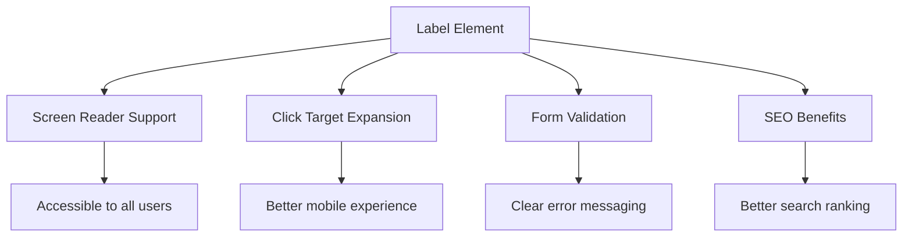

**ما تحققه التسميات المناسبة:**
- **تمكن** قارئات الشاشة من الإعلان عن حقول النموذج بوضوح
- **توسع** منطقة النقر (النقر على التسمية يركز على الإدخال)
- **تحسن** قابلية الاستخدام على الأجهزة المحمولة مع أهداف لمس أكبر
- **تدعم** التحقق من النموذج برسائل خطأ ذات معنى
- **تعزز** تحسين محركات البحث من خلال توفير معنى دلالي لعناصر النموذج

> 🎯 **هدف إمكانية الوصول**: يجب أن يكون لكل إدخال نموذج تسمية مرتبطة. هذه الممارسة البسيطة تجعل نماذجك قابلة للاستخدام من قبل الجميع، بما في ذلك المستخدمين ذوي الإعاقة، وتحسن التجربة لجميع المستخدمين.

### إنشاء نموذج التسجيل

يتطلب نموذج التسجيل معلومات أكثر تفصيلًا لإنشاء حساب مستخدم كامل. دعونا نبنيه بميزات HTML5 الحديثة وإمكانية وصول محسنة.

```html
<hr/>
<h2>Register</h2>
<form id="registerForm" novalidate>
  <div class="form-group">
    <label for="user">Username</label>
    <input id="user" name="user" type="text" required 
           autocomplete="username" placeholder="Choose a username">
  </div>
  
  <div class="form-group">
    <label for="currency">Currency</label>
    <input id="currency" name="currency" type="text" value="$" 
           required maxlength="3" placeholder="USD, EUR, etc.">
  </div>
  
  <div class="form-group">
    <label for="description">Account Description</label>
    <input id="description" name="description" type="text" 
           maxlength="100" placeholder="Personal savings, checking, etc.">
  </div>
  
  <div class="form-group">
    <label for="balance">Starting Balance</label>
    <input id="balance" name="balance" type="number" value="0" 
           min="0" step="0.01" placeholder="0.00">
  </div>
  
  <button type="submit">Create Account</button>
</form>
```

**في الأعلى، قمنا بـ:**
- **تنظيم** كل حقل في حاويات div لتحسين التصميم والتنسيق
- **إضافة** سمات `autocomplete` المناسبة لدعم الملء التلقائي للمتصفح
- **تضمين** نص توضيحي مفيد لتوجيه إدخال المستخدم
- **تعيين** قيم افتراضية منطقية باستخدام سمة `value`
- **تطبيق** سمات التحقق مثل `required`، `maxlength`، و `min`
- **استخدام** `type="number"` لحقل الرصيد مع دعم الأرقام العشرية

### استكشاف أنواع الإدخال والسلوك

**توفر أنواع الإدخال الحديثة وظائف محسنة:**

| الميزة | الفائدة | المثال |
|--------|---------|--------|
| `type="number"` | لوحة مفاتيح رقمية على الأجهزة المحمولة | إدخال الرصيد بسهولة |
| `step="0.01"` | التحكم في دقة الأرقام العشرية | يسمح بالكسور في العملات |
| `autocomplete` | الملء التلقائي للمتصفح | إكمال النموذج بسرعة |
| `placeholder` | تلميحات سياقية | توجه توقعات المستخدم |

> 🎯 **تحدي إمكانية الوصول**: حاول التنقل في النماذج باستخدام لوحة المفاتيح فقط! استخدم `Tab` للتنقل بين الحقول، `Space` لتحديد الخيارات، و`Enter` للإرسال. هذه التجربة تساعدك على فهم كيفية تفاعل مستخدمي قارئات الشاشة مع نماذجك.

### 🔄 **مراجعة تربوية**
**فهم أساسيات النموذج**: قبل تنفيذ JavaScript، تأكد من فهمك:
- ✅ كيف ينشئ HTML الدلالي هياكل نماذج قابلة للوصول
- ✅ لماذا أنواع الإدخال مهمة للوحات المفاتيح المحمولة والتحقق
- ✅ العلاقة بين التسميات وعناصر التحكم في النموذج
- ✅ كيف تؤثر سمات النموذج على سلوك المتصفح الافتراضي

**اختبار سريع ذاتي**: ماذا يحدث إذا أرسلت نموذجًا دون معالجة JavaScript؟
*الإجابة: يقوم المتصفح بالإرسال الافتراضي، عادةً بإعادة التوجيه إلى عنوان URL الخاص بالإجراء*

**فوائد نماذج HTML5**: توفر النماذج الحديثة:
- **التحقق المدمج**: التحقق التلقائي من البريد الإلكتروني وتنسيق الأرقام
- **تحسين الأجهزة المحمولة**: لوحات مفاتيح مناسبة لأنواع الإدخال المختلفة
- **إمكانية الوصول**: دعم قارئات الشاشة والتنقل باستخدام لوحة المفاتيح
- **تحسين تدريجي**: تعمل حتى عند تعطيل JavaScript

## فهم طرق إرسال النموذج

عندما يملأ شخص ما النموذج الخاص بك وينقر على إرسال، يجب أن تذهب تلك البيانات إلى مكان ما – عادةً إلى خادم يمكنه حفظها. هناك عدة طرق يمكن أن يحدث بها ذلك، ومعرفة الطريقة المناسبة يمكن أن يوفر عليك بعض المتاعب لاحقًا.

دعونا نلقي نظرة على ما يحدث فعليًا عندما ينقر شخص ما على زر الإرسال.

### سلوك النموذج الافتراضي

أولاً، دعونا نلاحظ ما يحدث مع إرسال النموذج الأساسي:

**اختبر النماذج الحالية الخاصة بك:**
1. انقر على زر *التسجيل* في النموذج الخاص بك
2. لاحظ التغييرات في شريط عنوان المتصفح الخاص بك
3. لاحظ كيف يتم إعادة تحميل الصفحة وتظهر البيانات في عنوان URL


### مقارنة طرق HTTP

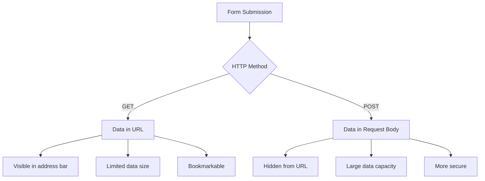

**فهم الاختلافات:**

| الطريقة | حالة الاستخدام | موقع البيانات | مستوى الأمان | حد الحجم |
|---------|----------------|---------------|--------------|----------|
| `GET` | استعلامات البحث، الفلاتر | معلمات URL | منخفض (مرئي) | ~2000 حرف |
| `POST` | حسابات المستخدمين، البيانات الحساسة | جسم الطلب | أعلى (مخفي) | لا يوجد حد عملي |

**فهم الاختلافات الأساسية:**
- **GET**: يضيف بيانات النموذج إلى عنوان URL كمعلمات استعلام (مناسب لعمليات البحث)
- **POST**: يتضمن البيانات في جسم الطلب (ضروري للمعلومات الحساسة)
- **قيود GET**: قيود الحجم، البيانات المرئية، تاريخ المتصفح المستمر
- **مزايا POST**: سعة بيانات كبيرة، حماية الخصوصية، دعم تحميل الملفات

> 💡 **أفضل ممارسة**: استخدم `GET` للنماذج البحثية والفلاتر (استرجاع البيانات)، واستخدم `POST` لتسجيل المستخدمين، تسجيل الدخول، وإنشاء البيانات.

### إعداد إرسال النموذج

دعونا نعد نموذج التسجيل الخاص بك للتواصل بشكل صحيح مع API الخلفي باستخدام طريقة POST:

```html
<form id="registerForm" action="//localhost:5000/api/accounts" 
      method="POST" novalidate>
```

**ما يفعله هذا الإعداد:**
- **يوجه** إرسال النموذج إلى نقطة نهاية API الخاصة بك
- **يستخدم** طريقة POST لنقل البيانات بشكل آمن
- **يتضمن** `novalidate` للتعامل مع التحقق باستخدام JavaScript

### اختبار إرسال النموذج

**اتبع هذه الخطوات لاختبار النموذج الخاص بك:**
1. **املأ** نموذج التسجيل بمعلوماتك
2. **انقر** على زر "إنشاء حساب"
3. **لاحظ** استجابة الخادم في متصفحك

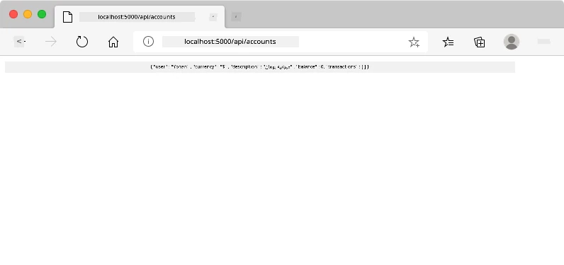

**ما يجب أن تراه:**
- **إعادة توجيه المتصفح** إلى عنوان URL لنقطة نهاية API
- **استجابة JSON** تحتوي على بيانات حسابك الجديد
- **تأكيد الخادم** أن الحساب تم إنشاؤه بنجاح

> 🧪 **وقت التجربة**: حاول التسجيل مرة أخرى بنفس اسم المستخدم. ما الاستجابة التي تحصل عليها؟ هذا يساعدك على فهم كيفية تعامل الخادم مع البيانات المكررة وظروف الخطأ.

### فهم استجابات JSON

**عندما يعالج الخادم النموذج الخاص بك بنجاح:**
```json
{
  "user": "john_doe",
  "currency": "$",
  "description": "Personal savings",
  "balance": 100,
  "id": "unique_account_id"
}
```

**تؤكد هذه الاستجابة:**
- **إنشاء** حساب جديد بالبيانات التي حددتها
- **تعيين** معرف فريد للرجوع إليه في المستقبل
- **إرجاع** جميع معلومات الحساب للتحقق
- **الإشارة** إلى تخزين قاعدة البيانات بنجاح

## التعامل الحديث مع النماذج باستخدام JavaScript

تسبب عمليات إرسال النموذج التقليدية إعادة تحميل الصفحة بالكامل، مثلما كانت مهمات الفضاء المبكرة تتطلب إعادة ضبط النظام بالكامل لتصحيح المسار. هذا النهج يعطل تجربة المستخدم ويفقد حالة التطبيق.

يعمل التعامل مع النماذج باستخدام JavaScript مثل أنظمة التوجيه المستمرة المستخدمة بواسطة المركبات الفضائية الحديثة – إجراء تعديلات في الوقت الفعلي دون فقدان سياق التنقل. يمكننا اعتراض عمليات إرسال النموذج، تقديم ردود فعل فورية، التعامل مع الأخطاء بسلاسة، وتحديث الواجهة بناءً على استجابات الخادم مع الحفاظ على موقع المستخدم في التطبيق.

### لماذا نتجنب إعادة تحميل الصفحة؟

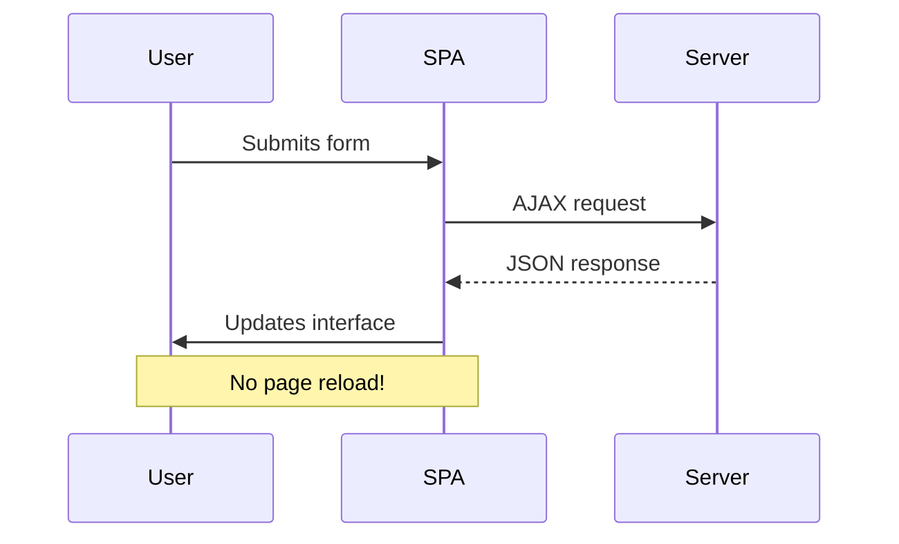

**فوائد التعامل مع النماذج باستخدام JavaScript:**
- **يحافظ** على حالة التطبيق وسياق المستخدم
- **يوفر** ردود فعل فورية ومؤشرات تحميل
- **يمكن** من التعامل الديناميكي مع الأخطاء والتحقق
- **يخلق** تجارب مستخدم سلسة تشبه التطبيقات
- **يسمح** بالمنطق الشرطي بناءً على استجابات الخادم

### الانتقال من النماذج التقليدية إلى الحديثة

**تحديات النهج التقليدي:**
- **إعادة توجيه** المستخدمين بعيدًا عن تطبيقك
- **فقدان** حالة التطبيق الحالية والسياق
- **يتطلب** إعادة تحميل الصفحة بالكامل للعمليات البسيطة
- **يوفر** تحكمًا محدودًا في ردود فعل المستخدم

**مزايا النهج الحديث باستخدام JavaScript:**
- **يحافظ** على المستخدمين داخل تطبيقك
- **يحافظ** على جميع حالة التطبيق والبيانات
- **يمكن** من التحقق وردود الفعل في الوقت الفعلي
- **يدعم** التحسين التدريجي وإمكانية الوصول

### تنفيذ التعامل مع النماذج باستخدام JavaScript

دعونا نستبدل إرسال النموذج التقليدي بمعالجة أحداث JavaScript الحديثة:

```html
<!-- Remove the action attribute and add event handling -->
<form id="registerForm" method="POST" novalidate>
```

**أضف منطق التسجيل إلى ملف `app.js` الخاص بك:**

```javascript
// Modern event-driven form handling
function register() {
  const registerForm = document.getElementById('registerForm');
  const formData = new FormData(registerForm);
  const data = Object.fromEntries(formData);
  const jsonData = JSON.stringify(data);
  
  console.log('Form data prepared:', data);
}

// Attach event listener when the page loads
document.addEventListener('DOMContentLoaded', () => {
  const registerForm = document.getElementById('registerForm');
  registerForm.addEventListener('submit', (event) => {
    event.preventDefault(); // Prevent default form submission
    register();
  });
});
```

**تفصيل ما يحدث هنا:**
- **يمنع** إرسال النموذج الافتراضي باستخدام `event.preventDefault()`
- **يستخرج** عنصر النموذج باستخدام اختيار DOM الحديث
- **يستخرج** بيانات النموذج باستخدام واجهة برمجة التطبيقات القوية `FormData`
- **يحول** FormData إلى كائن عادي باستخدام `Object.fromEntries()`
- **يسلسل** البيانات إلى تنسيق JSON للتواصل مع الخادم
- **يسجل** البيانات المعالجة لأغراض التصحيح والتحقق

### فهم واجهة برمجة التطبيقات FormData

**توفر واجهة برمجة التطبيقات FormData معالجة قوية للنماذج:**
```javascript
// Example of what FormData captures
const formData = new FormData(registerForm);

// FormData automatically captures:
// {
//   "user": "john_doe",
//   "currency": "$", 
//   "description": "Personal account",
//   "balance": "100"
// }
```

**مزايا واجهة برمجة التطبيقات FormData:**
- **جمع شامل**: يلتقط جميع عناصر النموذج بما في ذلك النصوص، الملفات، والمدخلات المعقدة
- **وعي بالنوع**: يتعامل تلقائيًا مع أنواع المدخلات المختلفة دون الحاجة إلى كتابة كود مخصص
- **الكفاءة**: يلغي الحاجة لجمع الحقول يدويًا من خلال استدعاء واحد لواجهة برمجة التطبيقات
- **التكيف**: يحافظ على الوظائف مع تطور هيكل النموذج

### إنشاء وظيفة الاتصال بالخادم

الآن دعونا نبني وظيفة قوية للتواصل مع خادم واجهة برمجة التطبيقات باستخدام أنماط JavaScript الحديثة:

```javascript
async function createAccount(account) {
  try {
    const response = await fetch('//localhost:5000/api/accounts', {
      method: 'POST',
      headers: { 
        'Content-Type': 'application/json',
        'Accept': 'application/json'
      },
      body: account
    });
    
    // Check if the response was successful
    if (!response.ok) {
      throw new Error(`HTTP error! status: ${response.status}`);
    }
    
    return await response.json();
  } catch (error) {
    console.error('Account creation failed:', error);
    return { error: error.message || 'Network error occurred' };
  }
}
```

**فهم JavaScript غير المتزامن:**

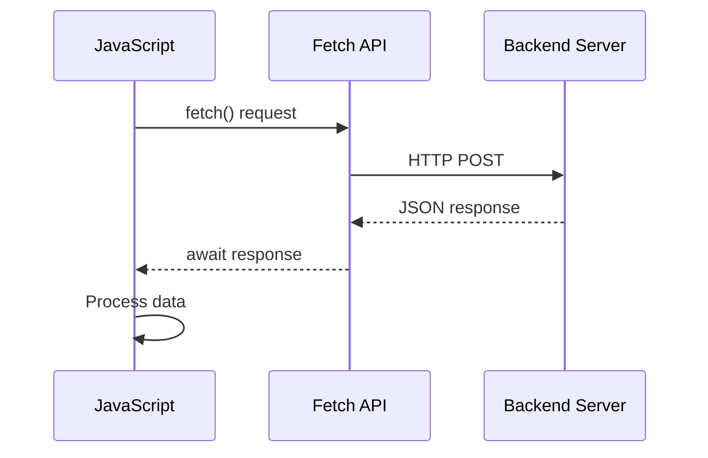

**ما يحققه هذا التنفيذ الحديث:**
- **يستخدم** `async/await` لكتابة كود غير متزامن قابل للقراءة
- **يتضمن** معالجة الأخطاء بشكل صحيح باستخدام كتل try/catch
- **يتحقق** من حالة الاستجابة قبل معالجة البيانات
- **يحدد** رؤوس مناسبة للتواصل عبر JSON
- **يوفر** رسائل خطأ مفصلة لتسهيل التصحيح
- **يعيد** هيكل بيانات متسق لحالات النجاح والخطأ

### قوة واجهة برمجة التطبيقات Fetch الحديثة

**مزايا Fetch API مقارنة بالطرق القديمة:**

| الميزة | الفائدة | التنفيذ |
|--------|---------|---------|
| قائم على الوعد | كود غير متزامن نظيف | `await fetch()` |
| تخصيص الطلب | تحكم كامل في HTTP | الرؤوس، الطرق، الجسم |
| معالجة الاستجابة | تحليل بيانات مرن | `.json()`, `.text()`, `.blob()` |
| معالجة الأخطاء | التقاط شامل للأخطاء | كتل try/catch |

> 🎥 **تعلم المزيد**: [دليل Async/Await](https://youtube.com/watch?v=YwmlRkrxvkk) - فهم أنماط JavaScript غير المتزامنة لتطوير الويب الحديث.

**المفاهيم الأساسية للتواصل مع الخادم:**
- **الوظائف غير المتزامنة** تسمح بإيقاف التنفيذ لانتظار استجابات الخادم
- **الكلمة المفتاحية Await** تجعل الكود غير المتزامن يبدو كأنه متزامن
- **Fetch API** يوفر طلبات HTTP حديثة قائمة على الوعد
- **معالجة الأخطاء** تضمن استجابة التطبيق بشكل جيد لمشاكل الشبكة

### إكمال وظيفة التسجيل

دعونا نجمع كل شيء معًا لإنشاء وظيفة تسجيل كاملة وجاهزة للإنتاج:

```javascript
async function register() {
  const registerForm = document.getElementById('registerForm');
  const submitButton = registerForm.querySelector('button[type="submit"]');
  
  try {
    // Show loading state
    submitButton.disabled = true;
    submitButton.textContent = 'Creating Account...';
    
    // Process form data
    const formData = new FormData(registerForm);
    const jsonData = JSON.stringify(Object.fromEntries(formData));
    
    // Send to server
    const result = await createAccount(jsonData);
    
    if (result.error) {
      console.error('Registration failed:', result.error);
      alert(`Registration failed: ${result.error}`);
      return;
    }
    
    console.log('Account created successfully!', result);
    alert(`Welcome, ${result.user}! Your account has been created.`);
    
    // Reset form after successful registration
    registerForm.reset();
    
  } catch (error) {
    console.error('Unexpected error:', error);
    alert('An unexpected error occurred. Please try again.');
  } finally {
    // Restore button state
    submitButton.disabled = false;
    submitButton.textContent = 'Create Account';
  }
}
```

**يتضمن هذا التنفيذ المحسن:**
- **يوفر** ملاحظات مرئية أثناء إرسال النموذج
- **يعطل** زر الإرسال لمنع الإرسال المكرر
- **يتعامل** مع الأخطاء المتوقعة وغير المتوقعة بشكل جيد
- **يعرض** رسائل نجاح وخطأ سهلة الاستخدام
- **يعيد ضبط** النموذج بعد التسجيل الناجح
- **يعيد** حالة واجهة المستخدم بغض النظر عن النتيجة

### اختبار التنفيذ الخاص بك

**افتح أدوات المطور في المتصفح واختبر التسجيل:**

1. **افتح** وحدة التحكم في المتصفح (F12 → علامة تبويب Console)
2. **املأ** نموذج التسجيل
3. **انقر** على "إنشاء حساب"
4. **لاحظ** رسائل وحدة التحكم وملاحظات المستخدم

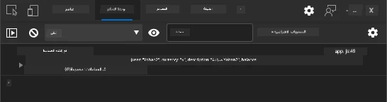

**ما يجب أن تراه:**
- **حالة التحميل** تظهر على زر الإرسال
- **سجلات وحدة التحكم** تعرض معلومات مفصلة عن العملية
- **رسالة النجاح** تظهر عند نجاح إنشاء الحساب
- **النموذج يعيد ضبط نفسه** تلقائيًا بعد الإرسال الناجح

> 🔒 **اعتبارات الأمان**: حاليًا، البيانات تنتقل عبر HTTP، وهو غير آمن للإنتاج. في التطبيقات الحقيقية، استخدم دائمًا HTTPS لتشفير نقل البيانات. تعرف على المزيد حول [أمان HTTPS](https://en.wikipedia.org/wiki/HTTPS) ولماذا هو ضروري لحماية بيانات المستخدم.

### 🔄 **مراجعة تعليمية**
**دمج JavaScript الحديث**: تحقق من فهمك لمعالجة النماذج غير المتزامنة:
- ✅ كيف يغير `event.preventDefault()` سلوك النموذج الافتراضي؟
- ✅ لماذا تعتبر واجهة برمجة التطبيقات FormData أكثر كفاءة من جمع الحقول يدويًا؟
- ✅ كيف تحسن أنماط async/await قابلية قراءة الكود؟
- ✅ ما هو دور معالجة الأخطاء في تجربة المستخدم؟

**هيكل النظام**: معالجة النموذج الخاص بك تظهر:
- **برمجة مدفوعة بالأحداث**: النماذج تستجيب لإجراءات المستخدم دون إعادة تحميل الصفحة
- **تواصل غير متزامن**: طلبات الخادم لا تعيق واجهة المستخدم
- **معالجة الأخطاء**: تدهور سلس عند فشل طلبات الشبكة
- **إدارة الحالة**: تحديثات واجهة المستخدم تعكس استجابات الخادم بشكل مناسب
- **تحسين تدريجي**: الوظائف الأساسية تعمل، JavaScript يعززها

**أنماط احترافية**: لقد نفذت:
- **مسؤولية واحدة**: الوظائف لها أغراض واضحة ومركزة
- **حدود الأخطاء**: كتل try/catch تمنع تعطل التطبيق
- **ملاحظات المستخدم**: حالات التحميل ورسائل النجاح/الخطأ
- **تحويل البيانات**: FormData إلى JSON للتواصل مع الخادم

## التحقق الشامل من النموذج

التحقق من النموذج يمنع تجربة الإحباط الناتجة عن اكتشاف الأخطاء فقط بعد الإرسال. مثل الأنظمة المتعددة الزائدة على محطة الفضاء الدولية، يستخدم التحقق الفعال طبقات متعددة من الفحوصات الأمنية.

النهج الأمثل يجمع بين التحقق على مستوى المتصفح للحصول على ملاحظات فورية، والتحقق باستخدام JavaScript لتحسين تجربة المستخدم، والتحقق على مستوى الخادم لضمان الأمان وسلامة البيانات. هذه الطبقات الزائدة تضمن رضا المستخدم وحماية النظام.

### فهم طبقات التحقق

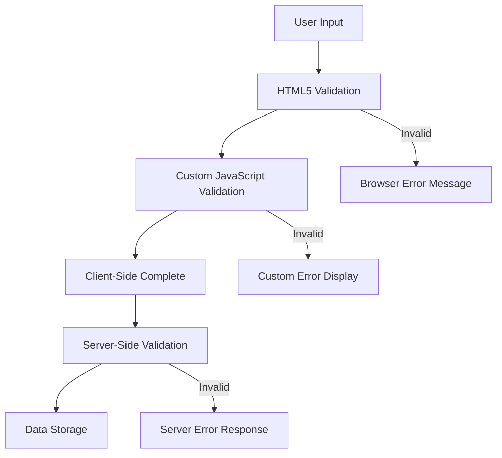

**استراتيجية التحقق متعددة الطبقات:**
- **التحقق باستخدام HTML5**: فحوصات فورية تعتمد على المتصفح
- **التحقق باستخدام JavaScript**: منطق مخصص وتجربة مستخدم محسنة
- **التحقق على مستوى الخادم**: فحوصات نهائية للأمان وسلامة البيانات
- **تحسين تدريجي**: يعمل حتى إذا تم تعطيل JavaScript

### خصائص التحقق باستخدام HTML5

**أدوات التحقق الحديثة المتاحة لديك:**

| الخاصية | الغرض | مثال الاستخدام | سلوك المتصفح |
|---------|-------|----------------|--------------|
| `required` | الحقول الإلزامية | `<input required>` | يمنع الإرسال الفارغ |
| `minlength`/`maxlength` | حدود طول النص | `<input maxlength="20">` | يفرض حدود الأحرف |
| `min`/`max` | نطاقات رقمية | `<input min="0" max="1000">` | يتحقق من حدود الأرقام |
| `pattern` | قواعد regex مخصصة | `<input pattern="[A-Za-z]+">` | يطابق تنسيقات محددة |
| `type` | التحقق من نوع البيانات | `<input type="email">` | تحقق خاص بالتنسيق |

### تنسيق التحقق باستخدام CSS

**إنشاء ملاحظات مرئية لحالات التحقق:**

```css
/* Valid input styling */
input:valid {
  border-color: #28a745;
  background-color: #f8fff9;
}

/* Invalid input styling */
input:invalid {
  border-color: #dc3545;
  background-color: #fff5f5;
}

/* Focus states for better accessibility */
input:focus:valid {
  box-shadow: 0 0 0 0.2rem rgba(40, 167, 69, 0.25);
}

input:focus:invalid {
  box-shadow: 0 0 0 0.2rem rgba(220, 53, 69, 0.25);
}
```

**ما تحققه هذه الإشارات المرئية:**
- **حدود خضراء**: تشير إلى نجاح التحقق، مثل الأضواء الخضراء في مركز التحكم
- **حدود حمراء**: تشير إلى أخطاء التحقق التي تحتاج إلى اهتمام
- **تسليط الضوء على التركيز**: يوفر سياقًا مرئيًا واضحًا لموقع الإدخال الحالي
- **تنسيق متسق**: يحدد أنماط واجهة يمكن للمستخدمين تعلمها

> 💡 **نصيحة احترافية**: استخدم الفئات الزائفة `:valid` و `:invalid` في CSS لتوفير ملاحظات مرئية فورية أثناء الكتابة، مما يخلق واجهة تفاعلية ومفيدة.

### تنفيذ التحقق الشامل

دعونا نحسن نموذج التسجيل الخاص بك مع التحقق القوي الذي يوفر تجربة مستخدم ممتازة وجودة بيانات عالية:

```html
<form id="registerForm" method="POST" novalidate>
  <div class="form-group">
    <label for="user">Username <span class="required">*</span></label>
    <input id="user" name="user" type="text" required 
           minlength="3" maxlength="20" 
           pattern="[a-zA-Z0-9_]+" 
           autocomplete="username"
           title="Username must be 3-20 characters, letters, numbers, and underscores only">
    <small class="form-text">Choose a unique username (3-20 characters)</small>
  </div>
  
  <div class="form-group">
    <label for="currency">Currency <span class="required">*</span></label>
    <input id="currency" name="currency" type="text" required 
           value="$" maxlength="3" 
           pattern="[A-Z$€£¥₹]+" 
           title="Enter a valid currency symbol or code">
    <small class="form-text">Currency symbol (e.g., $, €, £)</small>
  </div>
  
  <div class="form-group">
    <label for="description">Account Description</label>
    <input id="description" name="description" type="text" 
           maxlength="100" 
           placeholder="Personal savings, checking, etc.">
    <small class="form-text">Optional description (up to 100 characters)</small>
  </div>
  
  <div class="form-group">
    <label for="balance">Starting Balance</label>
    <input id="balance" name="balance" type="number" 
           value="0" min="0" step="0.01" 
           title="Enter a positive number for your starting balance">
    <small class="form-text">Initial account balance (minimum $0.00)</small>
  </div>
  
  <button type="submit">Create Account</button>
</form>
```

**فهم التحقق المحسن:**
- **يجمع** مؤشرات الحقول المطلوبة مع أوصاف مفيدة
- **يتضمن** خصائص `pattern` للتحقق من التنسيق
- **يوفر** خصائص `title` لتحسين الوصول والنصوص التوضيحية
- **يضيف** نصوص مساعدة لتوجيه إدخال المستخدم
- **يستخدم** هيكل HTML دلالي لتحسين الوصول

### قواعد التحقق المتقدمة

**ما تحققه كل قاعدة تحقق:**

| الحقل | قواعد التحقق | فائدة المستخدم |
|-------|-------------|----------------|
| اسم المستخدم | `required`, `minlength="3"`, `maxlength="20"`, `pattern="[a-zA-Z0-9_]+"` | يضمن معرفات صالحة وفريدة |
| العملة | `required`, `maxlength="3"`, `pattern="[A-Z$€£¥₹]+"` | يقبل رموز العملات الشائعة |
| الرصيد | `min="0"`, `step="0.01"`, `type="number"` | يمنع الأرصدة السلبية |
| الوصف | `maxlength="100"` | حدود طول معقولة |

### اختبار سلوك التحقق

**جرب هذه السيناريوهات للتحقق:**
1. **أرسل** النموذج مع الحقول المطلوبة فارغة
2. **أدخل** اسم مستخدم أقصر من 3 أحرف
3. **جرب** أحرف خاصة في حقل اسم المستخدم
4. **أدخل** مبلغ رصيد سلبي

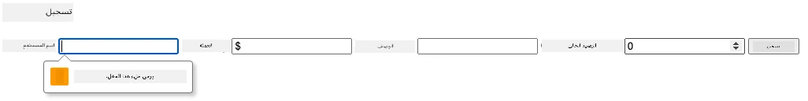

**ما ستلاحظه:**
- **المتصفح يعرض** رسائل التحقق الأصلية
- **تغييرات التنسيق** بناءً على حالات `:valid` و `:invalid`
- **يتم منع إرسال النموذج** حتى يتم اجتياز جميع عمليات التحقق
- **التركيز ينتقل تلقائيًا** إلى أول حقل غير صالح

### التحقق على مستوى العميل مقابل التحقق على مستوى الخادم

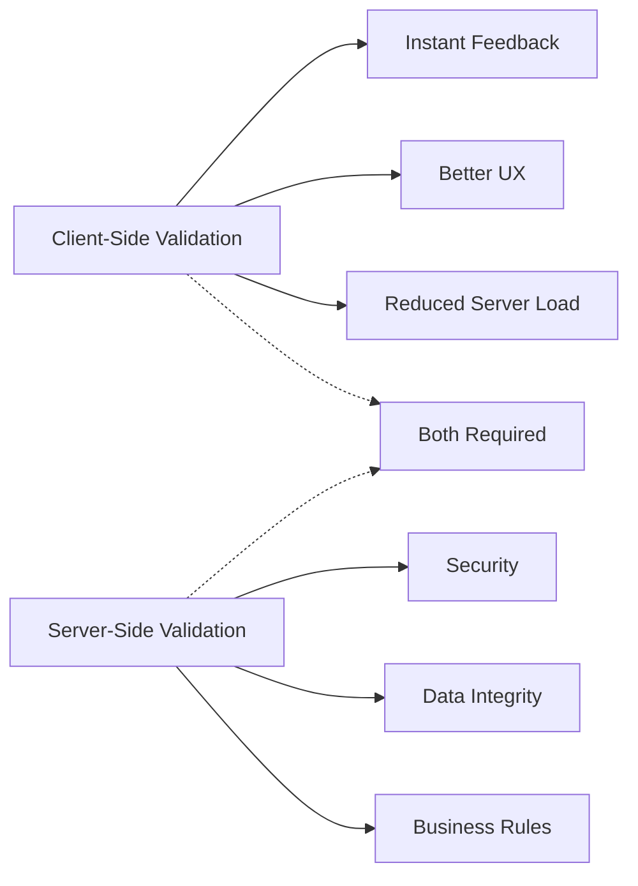

**لماذا تحتاج إلى كلا الطبقتين:**
- **التحقق على مستوى العميل**: يوفر ملاحظات فورية ويحسن تجربة المستخدم
- **التحقق على مستوى الخادم**: يضمن الأمان ويتعامل مع قواعد العمل المعقدة
- **النهج المشترك**: يخلق تطبيقات قوية وسهلة الاستخدام وآمنة
- **تحسين تدريجي**: يعمل حتى عندما يتم تعطيل JavaScript

> 🛡️ **تذكير أمني**: لا تثق أبدًا في التحقق على مستوى العميل فقط! يمكن للمستخدمين الضارين تجاوز الفحوصات على مستوى العميل، لذا فإن التحقق على مستوى الخادم ضروري للأمان وسلامة البيانات.

### ⚡ **ما يمكنك القيام به في الدقائق الخمس القادمة**
- [ ] اختبر النموذج الخاص بك باستخدام بيانات غير صالحة لرؤية رسائل التحقق
- [ ] جرب إرسال النموذج مع تعطيل JavaScript لرؤية التحقق باستخدام HTML5
- [ ] افتح أدوات المطور في المتصفح وافحص البيانات المرسلة إلى الخادم
- [ ] جرب أنواع إدخال مختلفة لرؤية تغييرات لوحة المفاتيح على الأجهزة المحمولة

### 🎯 **ما يمكنك تحقيقه خلال هذه الساعة**
- [ ] أكمل اختبار ما بعد الدرس لفهم مفاهيم معالجة النماذج
- [ ] نفذ تحدي التحقق الشامل مع ملاحظات فورية
- [ ] أضف تنسيق CSS لإنشاء نماذج ذات مظهر احترافي
- [ ] أنشئ معالجة الأخطاء لأسماء المستخدمين المكررة وأخطاء الخادم
- [ ] أضف حقول تأكيد كلمة المرور مع التحقق من المطابقة

### 📅 **رحلة إتقان النماذج الخاصة بك لمدة أسبوع**
- [ ] أكمل تطبيق البنك الكامل مع ميزات النماذج المتقدمة
- [ ] نفذ قدرات تحميل الملفات للصور الشخصية أو المستندات
- [ ] أضف نماذج متعددة الخطوات مع مؤشرات التقدم وإدارة الحالة
- [ ] أنشئ نماذج ديناميكية تتكيف بناءً على اختيارات المستخدم
- [ ] نفذ الحفظ التلقائي للنماذج والاسترداد لتحسين تجربة المستخدم
- [ ] أضف التحقق المتقدم مثل التحقق من البريد الإلكتروني وتنسيق أرقام الهواتف

### 🌟 **إتقان تطوير الواجهة الأمامية الخاص بك لمدة شهر**
- [ ] قم ببناء تطبيقات نماذج معقدة مع منطق شرطي وسير العمل
- [ ] تعلم مكتبات النماذج وأطر العمل للتطوير السريع
- [ ] أتقن إرشادات الوصول ومبادئ التصميم الشامل
- [ ] نفذ التدويل والتوطين للنماذج العالمية
- [ ] أنشئ مكتبات مكونات النماذج القابلة لإعادة الاستخدام وأنظمة التصميم
- [ ] ساهم في مشاريع النماذج مفتوحة المصدر وشارك أفضل الممارسات

## 🎯 جدول زمني لإتقان تطوير النماذج الخاصة بك

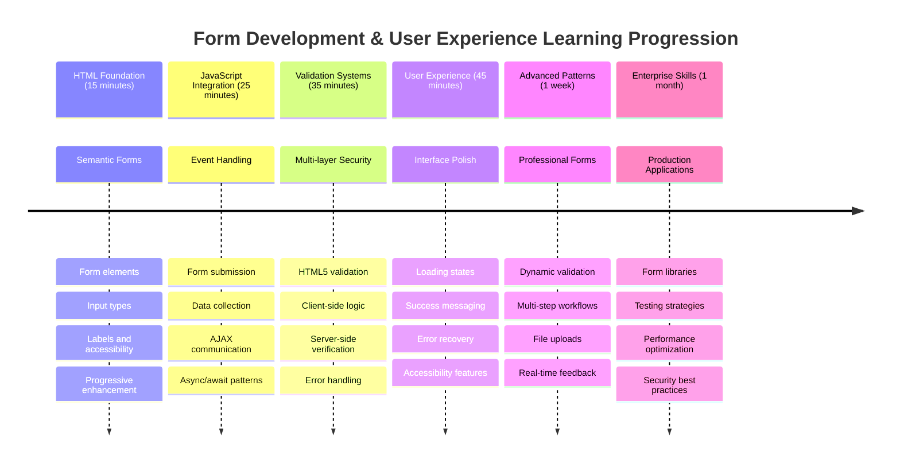

### 🛠️ ملخص أدوات تطوير النماذج الخاصة بك

بعد إكمال هذا الدرس، أصبحت الآن متقنًا:
- **نماذج HTML5**: الهيكل الدلالي، أنواع الإدخال، وميزات الوصول
- **معالجة النماذج باستخدام JavaScript**: إدارة الأحداث، جمع البيانات، والتواصل عبر AJAX
- **هيكل التحقق**: التحقق متعدد الطبقات للأمان وتجربة المستخدم
- **البرمجة غير المتزامنة**: واجهة برمجة التطبيقات Fetch الحديثة وأنماط async/await
- **إدارة الأخطاء**: معالجة الأخطاء الشاملة وأنظمة ملاحظات المستخدم
- **تصميم تجربة المستخدم**: حالات التحميل، رسائل النجاح، واسترداد الأخطاء
- **تحسين تدريجي**: نماذج تعمل عبر جميع المتصفحات والإمكانيات

**تطبيقات العالم الحقيقي**: مهارات تطوير النماذج الخاصة بك تنطبق مباشرة على:
- **تطبيقات التجارة الإلكترونية**: عمليات الدفع، تسجيل الحسابات، ونماذج الدفع
- **برامج المؤسسات**: أنظمة إدخال البيانات، واجهات التقارير، وتطبيقات سير العمل
- **إدارة المحتوى**: منصات النشر، المحتوى الذي ينشئه المستخدم، وواجهات الإدارة
- **التطبيقات المالية**: واجهات البنوك، منصات الاستثمار، وأنظمة المعاملات
- **أنظمة الرعاية الصحية**: بوابات المرضى، جدولة المواعيد، ونماذج السجلات الطبية
- **منصات التعليم**: تسجيل الدورات، أدوات التقييم، وأنظمة إدارة التعلم

**المهارات المهنية المكتسبة**: يمكنك الآن:
- **تصميم** نماذج قابلة للوصول تعمل لجميع المستخدمين بما في ذلك ذوي الإعاقة
- **تنفيذ** تحقق آمن للنماذج يمنع تلف البيانات والثغرات الأمنية
- **إنشاء** واجهات مستخدم استجابية توفر ملاحظات وتوجيهات واضحة
- **تصحيح** تفاعلات النماذج المعقدة باستخدام أدوات المطور في المتصفح وتحليل الشبكة
- **تحسين** أداء النماذج من خلال معالجة البيانات واستراتيجيات التحقق الفعالة

**مفاهيم تطوير الواجهة الأمامية المتقنة**:
- **هيكل مدفوع بالأحداث**: معالجة تفاعلات المستخدم وأنظمة الاستجابة
- **البرمجة غير المتزامنة**: التواصل مع الخادم دون حجب واجهة المستخدم ومعالجة الأخطاء
- **التحقق من البيانات**: فحوصات الأمان وسلامة البيانات على مستوى العميل والخادم
- **تصميم تجربة المستخدم**: واجهات بديهية توجه المستخدمين نحو النجاح
- **هندسة الوصول**: تصميم شامل يعمل لاحتياجات المستخدمين المتنوعة

**المستوى التالي**: أنت جاهز لاستكشاف مكتبات النماذج المتقدمة، تنفيذ قواعد التحقق المعقدة، أو بناء أنظمة جمع بيانات على مستوى المؤسسات!

🌟 **إنجاز محقق**: لقد أنشأت نظام معالجة نماذج كامل مع التحقق الاحترافي، معالجة الأخطاء، وأنماط تجربة المستخدم!
**المطالبة:** قم بإنشاء نظام تحقق كامل لنموذج التسجيل يتضمن: 1) تقديم ملاحظات التحقق في الوقت الفعلي لكل حقل أثناء الكتابة، 2) رسائل تحقق مخصصة تظهر أسفل كل حقل إدخال، 3) حقل تأكيد كلمة المرور مع تحقق من التطابق، 4) مؤشرات مرئية (مثل علامات خضراء للحقل الصحيح وتحذيرات حمراء للحقل غير الصحيح)، 5) زر إرسال يصبح مفعلاً فقط عندما يتم اجتياز جميع عمليات التحقق. استخدم سمات التحقق في HTML5، وCSS لتنسيق حالات التحقق، وJavaScript للسلوك التفاعلي.

تعرف على المزيد حول [وضع الوكيل](https://code.visualstudio.com/blogs/2025/02/24/introducing-copilot-agent-mode) هنا.

## 🚀 التحدي

اعرض رسالة خطأ في HTML إذا كان المستخدم موجودًا بالفعل.

إليك مثال لما يمكن أن يبدو عليه صفحة تسجيل الدخول النهائية بعد إضافة بعض أنماط CSS:

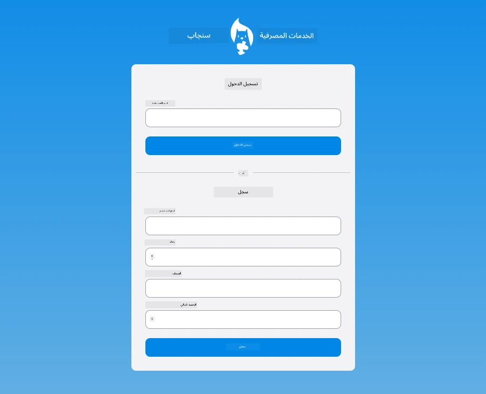

## اختبار ما بعد المحاضرة

[اختبار ما بعد المحاضرة](https://ff-quizzes.netlify.app/web/quiz/44)

## المراجعة والدراسة الذاتية

لقد أصبح المطورون مبدعين للغاية في جهودهم لبناء النماذج، خاصة فيما يتعلق باستراتيجيات التحقق. تعرف على تدفقات النماذج المختلفة من خلال تصفح [CodePen](https://codepen.com)؛ هل يمكنك العثور على نماذج مثيرة ومُلهمة؟

## الواجب

[قم بتنسيق تطبيق البنك الخاص بك](assignment.md)

---

**إخلاء المسؤولية**:  
تم ترجمة هذا المستند باستخدام خدمة الترجمة بالذكاء الاصطناعي [Co-op Translator](https://github.com/Azure/co-op-translator). بينما نسعى لتحقيق الدقة، يرجى العلم أن الترجمات الآلية قد تحتوي على أخطاء أو عدم دقة. يجب اعتبار المستند الأصلي بلغته الأصلية المصدر الرسمي. للحصول على معلومات حاسمة، يُوصى بالترجمة البشرية الاحترافية. نحن غير مسؤولين عن أي سوء فهم أو تفسيرات خاطئة تنشأ عن استخدام هذه الترجمة.