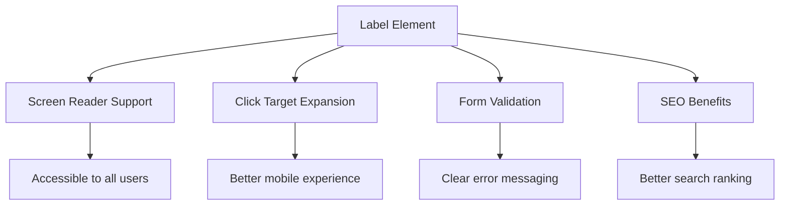
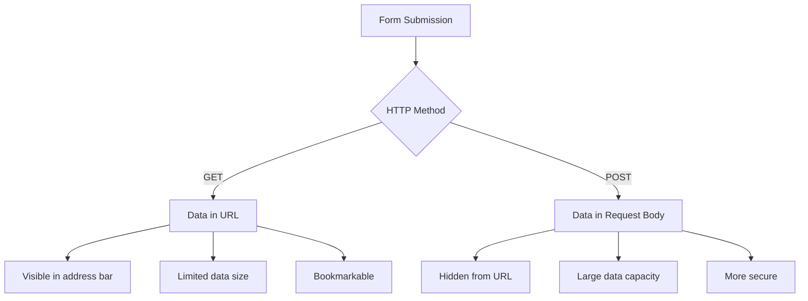
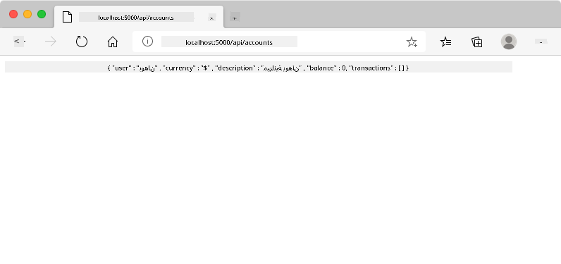
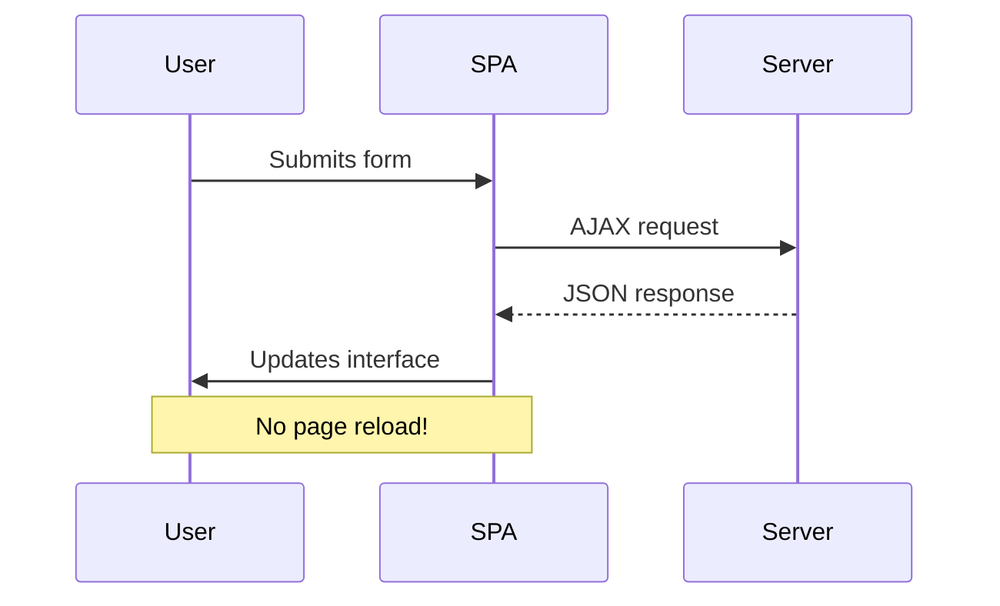
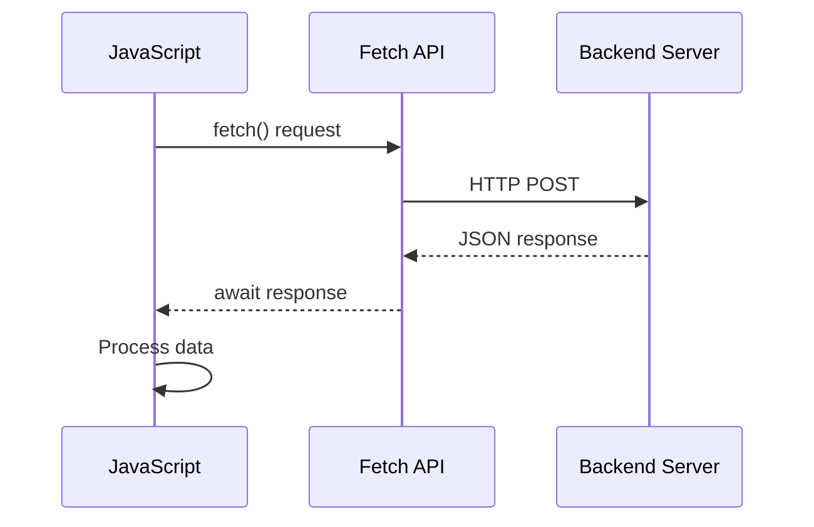
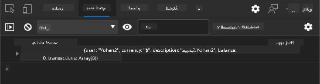
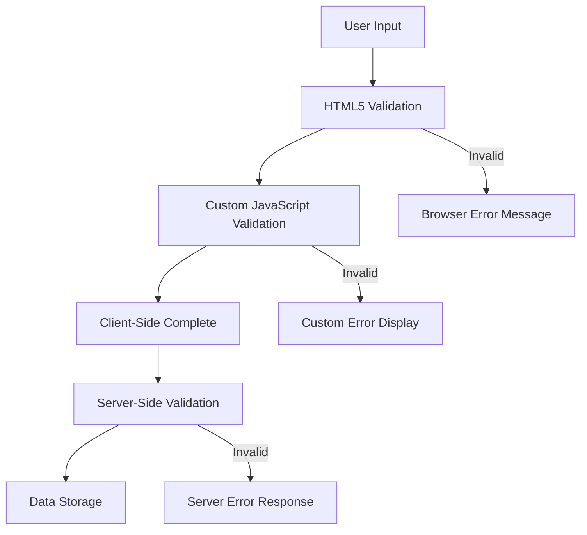
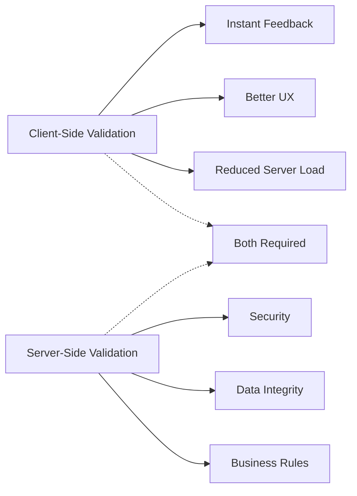

<!--
CO_OP_TRANSLATOR_METADATA:
{
  "original_hash": "b24f28fc46dd473aa9080f174182adde",
  "translation_date": "2025-10-22T14:22:42+00:00",
  "source_file": "7-bank-project/2-forms/README.md",
  "language_code": "ar"
}
-->
# بناء تطبيق مصرفي الجزء الثاني: إنشاء نموذج تسجيل الدخول والتسجيل

## اختبار ما قبل المحاضرة

[اختبار ما قبل المحاضرة](https://ff-quizzes.netlify.app/web/quiz/43)

هل سبق لك أن ملأت نموذجًا عبر الإنترنت وتم رفض تنسيق بريدك الإلكتروني؟ أو فقدت جميع معلوماتك عند النقر على زر الإرسال؟ لقد واجهنا جميعًا هذه التجارب المحبطة.

النماذج هي الجسر بين المستخدمين ووظائف تطبيقك. مثل البروتوكولات الدقيقة التي يستخدمها مراقبو الحركة الجوية لتوجيه الطائرات بأمان إلى وجهاتها، توفر النماذج المصممة جيدًا ردود فعل واضحة وتمنع الأخطاء المكلفة. أما النماذج السيئة، فقد تدفع المستخدمين بعيدًا بسرعة أكبر من سوء التواصل في مطار مزدحم.

في هذه الدرس، سنحول تطبيقك المصرفي الثابت إلى تطبيق تفاعلي. ستتعلم كيفية إنشاء نماذج تتحقق من صحة إدخال المستخدم، وتتواصل مع الخوادم، وتوفر ردود فعل مفيدة. فكر في الأمر كإنشاء واجهة التحكم التي تتيح للمستخدمين التنقل في ميزات تطبيقك.

في النهاية، سيكون لديك نظام تسجيل دخول وتسجيل كامل مع التحقق من الصحة الذي يوجه المستخدمين نحو النجاح بدلاً من الإحباط.

## المتطلبات الأساسية

قبل أن نبدأ في إنشاء النماذج، دعنا نتأكد من أن كل شيء معد بشكل صحيح. يبدأ هذا الدرس من حيث انتهينا في الدرس السابق، لذا إذا تخطيت، قد ترغب في العودة أولاً للحصول على الأساسيات.

### الإعداد المطلوب

| المكون | الحالة | الوصف |
|--------|--------|-------|
| [قوالب HTML](../1-template-route/README.md) | ✅ مطلوب | هيكل تطبيقك المصرفي الأساسي |
| [Node.js](https://nodejs.org) | ✅ مطلوب | بيئة تشغيل JavaScript للخادم |
| [خادم API المصرفي](../api/README.md) | ✅ مطلوب | خدمة خلفية لتخزين البيانات |

> 💡 **نصيحة تطوير**: ستقوم بتشغيل خادمين منفصلين في نفس الوقت – واحد لتطبيقك المصرفي الأمامي وآخر لخادم API الخلفي. هذا الإعداد يعكس تطوير العالم الحقيقي حيث تعمل خدمات الواجهة الأمامية والخلفية بشكل مستقل.

### إعداد الخادم

**بيئة التطوير الخاصة بك ستشمل:**
- **خادم الواجهة الأمامية**: يقدم تطبيقك المصرفي (عادةً على المنفذ `3000`)
- **خادم API الخلفي**: يتعامل مع تخزين البيانات واسترجاعها (المنفذ `5000`)
- **كلا الخادمين** يمكن تشغيلهما في نفس الوقت دون تعارضات

**اختبار اتصالك بـ API:**
```bash
curl http://localhost:5000/api
# Expected response: "Bank API v1.0.0"
```

**إذا رأيت استجابة إصدار API، فأنت جاهز للمتابعة!**

---

## فهم نماذج HTML وعناصر التحكم

نماذج HTML هي الطريقة التي يتواصل بها المستخدمون مع تطبيق الويب الخاص بك. فكر فيها كنظام التلغراف الذي ربط الأماكن البعيدة في القرن التاسع عشر – إنها بروتوكول الاتصال بين نية المستخدم واستجابة التطبيق. عندما يتم تصميمها بعناية، فإنها تلتقط الأخطاء، توجه تنسيق الإدخال، وتوفر اقتراحات مفيدة.

النماذج الحديثة أكثر تطورًا بكثير من إدخالات النص الأساسية. قدم HTML5 أنواع إدخال متخصصة تتعامل تلقائيًا مع التحقق من البريد الإلكتروني، تنسيق الأرقام، واختيار التواريخ. هذه التحسينات تفيد كل من إمكانية الوصول وتجربة المستخدمين على الأجهزة المحمولة.

### عناصر النموذج الأساسية

**اللبنات الأساسية التي يحتاجها كل نموذج:**

```html
<!-- Basic form structure -->
<form id="userForm" method="POST">
  <label for="username">Username</label>
  <input id="username" name="username" type="text" required>
  
  <button type="submit">Submit</button>
</form>
```

**ما يفعله هذا الكود:**
- **ينشئ** حاوية نموذج بمعرف فريد
- **يحدد** طريقة HTTP لإرسال البيانات
- **يربط** التسميات بالإدخالات لتحسين إمكانية الوصول
- **يعرف** زر إرسال لمعالجة النموذج

### أنواع الإدخال الحديثة والسمات

| نوع الإدخال | الغرض | مثال الاستخدام |
|-------------|-------|----------------|
| `text` | إدخال نص عام | `<input type="text" name="username">` |
| `email` | التحقق من البريد الإلكتروني | `<input type="email" name="email">` |
| `password` | إدخال نص مخفي | `<input type="password" name="password">` |
| `number` | إدخال رقمي | `<input type="number" name="balance" min="0">` |
| `tel` | أرقام الهاتف | `<input type="tel" name="phone">` |

> 💡 **ميزة HTML5 الحديثة**: استخدام أنواع الإدخال المحددة يوفر التحقق التلقائي، لوحات مفاتيح مناسبة للأجهزة المحمولة، ودعم أفضل لإمكانية الوصول دون الحاجة إلى JavaScript إضافي!

### أنواع الأزرار وسلوكها

```html
<!-- Different button behaviors -->
<button type="submit">Save Data</button>     <!-- Submits the form -->
<button type="reset">Clear Form</button>    <!-- Resets all fields -->
<button type="button">Custom Action</button> <!-- No default behavior -->
```

**ما يفعله كل نوع من الأزرار:**
- **أزرار الإرسال**: تُشغل إرسال النموذج وترسل البيانات إلى نقطة النهاية المحددة
- **أزرار إعادة التعيين**: تعيد جميع حقول النموذج إلى حالتها الأولية
- **الأزرار العادية**: لا توفر سلوكًا افتراضيًا، وتتطلب JavaScript مخصصًا للوظائف

> ⚠️ **ملاحظة مهمة**: عنصر `<input>` يغلق نفسه ولا يتطلب علامة إغلاق. الممارسة الحديثة هي كتابة `<input>` بدون الشريط.

### إنشاء نموذج تسجيل الدخول

الآن دعونا ننشئ نموذج تسجيل دخول عمليًا يوضح ممارسات نماذج HTML الحديثة. سنبدأ بهيكل أساسي ونقوم بتحسينه تدريجيًا بميزات إمكانية الوصول والتحقق من الصحة.

```html
<template id="login">
  <h1>Bank App</h1>
  <section>
    <h2>Login</h2>
    <form id="loginForm" novalidate>
      <div class="form-group">
        <label for="username">Username</label>
        <input id="username" name="user" type="text" required 
               autocomplete="username" placeholder="Enter your username">
      </div>
      <button type="submit">Login</button>
    </form>
  </section>
</template>
```

**تفصيل ما يحدث هنا:**
- **يهيكل** النموذج باستخدام عناصر HTML5 دلالية
- **يجمع** العناصر ذات الصلة باستخدام حاويات `div` ذات فئات ذات معنى
- **يربط** التسميات بالإدخالات باستخدام سمات `for` و`id`
- **يتضمن** سمات حديثة مثل `autocomplete` و`placeholder` لتحسين تجربة المستخدم
- **يضيف** `novalidate` للتعامل مع التحقق من الصحة باستخدام JavaScript بدلاً من الإعدادات الافتراضية للمتصفح

### قوة التسميات المناسبة

**لماذا التسميات مهمة لتطوير الويب الحديث:**



**ما تحققه التسميات المناسبة:**
- **تمكن** قارئات الشاشة من الإعلان عن حقول النموذج بوضوح
- **توسع** المنطقة القابلة للنقر (النقر على التسمية يركز على الإدخال)
- **تحسن** قابلية الاستخدام على الأجهزة المحمولة مع أهداف لمس أكبر
- **تدعم** التحقق من صحة النموذج برسائل خطأ ذات معنى
- **تعزز** تحسين محركات البحث من خلال توفير معنى دلالي لعناصر النموذج

> 🎯 **هدف إمكانية الوصول**: يجب أن يكون لكل إدخال نموذج تسمية مرتبطة. هذه الممارسة البسيطة تجعل نماذجك قابلة للاستخدام للجميع، بما في ذلك المستخدمين ذوي الإعاقة، وتحسن التجربة لجميع المستخدمين.

### إنشاء نموذج التسجيل

يتطلب نموذج التسجيل معلومات أكثر تفصيلًا لإنشاء حساب مستخدم كامل. دعونا نبنيه باستخدام ميزات HTML5 الحديثة وإمكانية الوصول المحسنة.

```html
<hr/>
<h2>Register</h2>
<form id="registerForm" novalidate>
  <div class="form-group">
    <label for="user">Username</label>
    <input id="user" name="user" type="text" required 
           autocomplete="username" placeholder="Choose a username">
  </div>
  
  <div class="form-group">
    <label for="currency">Currency</label>
    <input id="currency" name="currency" type="text" value="$" 
           required maxlength="3" placeholder="USD, EUR, etc.">
  </div>
  
  <div class="form-group">
    <label for="description">Account Description</label>
    <input id="description" name="description" type="text" 
           maxlength="100" placeholder="Personal savings, checking, etc.">
  </div>
  
  <div class="form-group">
    <label for="balance">Starting Balance</label>
    <input id="balance" name="balance" type="number" value="0" 
           min="0" step="0.01" placeholder="0.00">
  </div>
  
  <button type="submit">Create Account</button>
</form>
```

**في ما سبق، قمنا بـ:**
- **تنظيم** كل حقل في حاويات div لتحسين التصميم والتخطيط
- **إضافة** سمات `autocomplete` المناسبة لدعم الملء التلقائي للمتصفح
- **تضمين** نصوص إرشادية مفيدة لتوجيه إدخال المستخدم
- **تعيين** قيم افتراضية منطقية باستخدام سمة `value`
- **تطبيق** سمات التحقق مثل `required`، `maxlength`، و`min`
- **استخدام** `type="number"` لحقل الرصيد مع دعم الأرقام العشرية

### استكشاف أنواع الإدخال وسلوكها

**توفر أنواع الإدخال الحديثة وظائف محسنة:**

| الميزة | الفائدة | المثال |
|--------|---------|--------|
| `type="number"` | لوحة مفاتيح رقمية على الأجهزة المحمولة | إدخال الرصيد بسهولة |
| `step="0.01"` | التحكم في الدقة العشرية | يسمح بالسنتات في العملة |
| `autocomplete` | الملء التلقائي للمتصفح | إكمال النموذج بسرعة |
| `placeholder` | تلميحات سياقية | توجه توقعات المستخدم |

> 🎯 **تحدي إمكانية الوصول**: حاول التنقل في النماذج باستخدام لوحة المفاتيح فقط! استخدم `Tab` للانتقال بين الحقول، و`Space` لتحديد المربعات، و`Enter` للإرسال. هذه التجربة تساعدك على فهم كيفية تفاعل مستخدمي قارئات الشاشة مع نماذجك.

## فهم طرق إرسال النموذج

عندما يملأ شخص ما النموذج وينقر على زر الإرسال، يجب أن تذهب تلك البيانات إلى مكان ما – عادةً إلى خادم يمكنه حفظها. هناك عدة طرق يمكن أن يحدث بها ذلك، ومعرفة الطريقة المناسبة يمكن أن توفر عليك بعض الصداع لاحقًا.

دعونا نلقي نظرة على ما يحدث فعليًا عندما ينقر شخص ما على زر الإرسال.

### سلوك النموذج الافتراضي

أولاً، دعونا نلاحظ ما يحدث مع إرسال النموذج الأساسي:

**اختبر النماذج الحالية:**
1. انقر على زر *التسجيل* في النموذج الخاص بك
2. لاحظ التغييرات في شريط عنوان المتصفح الخاص بك
3. لاحظ كيف يتم إعادة تحميل الصفحة وتظهر البيانات في عنوان URL


### مقارنة طرق HTTP



**فهم الاختلافات:**

| الطريقة | حالة الاستخدام | موقع البيانات | مستوى الأمان | حد الحجم |
|---------|----------------|---------------|--------------|----------|
| `GET` | استعلامات البحث، الفلاتر | معلمات URL | منخفض (مرئي) | ~2000 حرف |
| `POST` | حسابات المستخدمين، البيانات الحساسة | جسم الطلب | أعلى (مخفي) | لا يوجد حد عملي |

**فهم الاختلافات الأساسية:**
- **GET**: يضيف بيانات النموذج إلى عنوان URL كمعلمات استعلام (مناسب لعمليات البحث)
- **POST**: يتضمن البيانات في جسم الطلب (ضروري للمعلومات الحساسة)
- **قيود GET**: قيود الحجم، البيانات المرئية، تاريخ المتصفح المستمر
- **مزايا POST**: سعة بيانات كبيرة، حماية الخصوصية، دعم تحميل الملفات

> 💡 **أفضل ممارسة**: استخدم `GET` لنماذج البحث والفلاتر (استرجاع البيانات)، واستخدم `POST` لتسجيل المستخدمين، تسجيل الدخول، وإنشاء البيانات.

### إعداد إرسال النموذج

دعونا نعد نموذج التسجيل الخاص بك للتواصل بشكل صحيح مع API الخلفي باستخدام طريقة POST:

```html
<form id="registerForm" action="//localhost:5000/api/accounts" 
      method="POST" novalidate>
```

**ما يفعله هذا الإعداد:**
- **يوجه** إرسال النموذج إلى نقطة نهاية API الخاصة بك
- **يستخدم** طريقة POST لنقل البيانات بأمان
- **يتضمن** `novalidate` للتعامل مع التحقق باستخدام JavaScript

### اختبار إرسال النموذج

**اتبع هذه الخطوات لاختبار النموذج الخاص بك:**
1. **املأ** نموذج التسجيل بمعلوماتك
2. **انقر** على زر "إنشاء حساب"
3. **لاحظ** استجابة الخادم في متصفحك



**ما يجب أن تراه:**
- **إعادة توجيه المتصفح** إلى عنوان URL لنقطة نهاية API
- **استجابة JSON** تحتوي على بيانات حسابك الجديد
- **تأكيد الخادم** أن الحساب تم إنشاؤه بنجاح

> 🧪 **وقت التجربة**: حاول التسجيل مرة أخرى بنفس اسم المستخدم. ما الاستجابة التي تحصل عليها؟ يساعدك هذا على فهم كيفية تعامل الخادم مع البيانات المكررة وظروف الخطأ.

### فهم استجابات JSON

**عندما يعالج الخادم النموذج الخاص بك بنجاح:**
```json
{
  "user": "john_doe",
  "currency": "$",
  "description": "Personal savings",
  "balance": 100,
  "id": "unique_account_id"
}
```

**تؤكد هذه الاستجابة:**
- **إنشاء** حساب جديد بالبيانات التي حددتها
- **تعيين** معرف فريد للإشارة المستقبلية
- **إرجاع** جميع معلومات الحساب للتحقق
- **الإشارة** إلى تخزين قاعدة البيانات بنجاح

## التعامل الحديث مع النماذج باستخدام JavaScript

تسبب عمليات إرسال النموذج التقليدية إعادة تحميل الصفحة بالكامل، مثلما كانت المهمات الفضائية المبكرة تتطلب إعادة ضبط النظام بالكامل لتصحيح المسار. هذا النهج يعطل تجربة المستخدم ويفقد حالة التطبيق.

يعمل التعامل مع النماذج باستخدام JavaScript مثل أنظمة التوجيه المستمرة المستخدمة في المركبات الفضائية الحديثة – إجراء تعديلات في الوقت الفعلي دون فقدان سياق التنقل. يمكننا اعتراض عمليات إرسال النموذج، تقديم ردود فعل فورية، التعامل مع الأخطاء برشاقة، وتحديث الواجهة بناءً على استجابات الخادم مع الحفاظ على موقع المستخدم في التطبيق.

### لماذا نتجنب إعادة تحميل الصفحة؟



**فوائد التعامل مع النماذج باستخدام JavaScript:**
- **يحافظ** على حالة التطبيق وسياق المستخدم
- **يوفر** ردود فعل فورية ومؤشرات تحميل
- **يمكن** من التعامل الديناميكي مع الأخطاء والتحقق
- **يخلق** تجارب مستخدم سلسة تشبه التطبيقات
- **يسمح** بالمنطق الشرطي بناءً على استجابات الخادم

### الانتقال من النماذج التقليدية إلى الحديثة

**تحديات النهج التقليدي:**
- **إعادة توجيه** المستخدمين بعيدًا عن تطبيقك
- **فقدان** حالة التطبيق الحالية والسياق
- **يتطلب** إعادة تحميل الصفحة بالكامل للعمليات البسيطة
- **يوفر** تحكمًا محدودًا في ردود فعل المستخدم

**مزايا النهج الحديث باستخدام JavaScript:**
- **يحافظ** على المستخدمين داخل تطبيقك
- **يحافظ** على جميع حالة التطبيق والبيانات
- **يمكن** من التحقق وردود الفعل في الوقت الفعلي
- **يدعم** التحسين التدريجي وإمكانية الوصول

### تنفيذ التعامل مع النماذج باستخدام JavaScript

دعونا نستبدل إرسال النموذج التقليدي بمعالجة أحداث JavaScript الحديثة:

```html
<!-- Remove the action attribute and add event handling -->
<form id="registerForm" method="POST" novalidate>
```

**أضف منطق التسجيل إلى ملف `app.js` الخاص بك:**

```javascript
// Modern event-driven form handling
function register() {
  const registerForm = document.getElementById('registerForm');
  const formData = new FormData(registerForm);
  const data = Object.fromEntries(formData);
  const jsonData = JSON.stringify(data);
  
  console.log('Form data prepared:', data);
}

// Attach event listener when the page loads
document.addEventListener('DOMContentLoaded', () => {
  const registerForm = document.getElementById('registerForm');
  registerForm.addEventListener('submit', (event) => {
    event.preventDefault(); // Prevent default form submission
    register();
  });
});
```

**تفصيل ما يحدث هنا:**
- **يمنع** إرسال النموذج الافتراضي باستخدام `event.preventDefault()`
- **يستخرج** عنصر النموذج باستخدام اختيار DOM الحديث
- **يستخرج** بيانات النموذج باستخدام واجهة برمجة التطبيقات القوية `FormData`
- **يحول** FormData إلى كائن عادي باستخدام `Object.fromEntries()`
- **يسلسل** البيانات إلى تنسيق JSON للتواصل مع الخادم
- **يسجل** البيانات المعالجة لأغراض التصحيح والتحقق

### فهم واجهة برمجة التطبيقات FormData

**توفر واجهة برمجة التطبيقات FormData معالجة قوية للنماذج:**

```javascript
// Example of what FormData captures
const formData = new FormData(registerForm);

// FormData automatically captures:
// {
//   "user": "john_doe",
//   "currency": "$", 
//   "description": "Personal account",
//   "balance": "100"
// }
```

**مزايا واجهة برمجة التطبيقات FormData:**
- **جمع شامل**: يلتقط جميع عناصر النموذج بما في ذلك النصوص، الملفات، والإدخالات المعقدة
- **وعي النوع**: يتعامل تلقائيًا مع أنواع الإدخال المختلفة دون الحاجة إلى ترميز مخصص
- **كفاءة**: يلغي جمع الحقول يدويًا باستخدام استدعاء واجهة برمجة التطبيقات الواحد
- **قابلية التكيف**: يحافظ على الوظائف مع تطور هيكل النموذج

### إنشاء وظيفة التواصل مع الخادم

الآن دعونا نبني وظيفة قوية للتواصل مع خادم API الخاص بك باستخدام أنماط JavaScript الحديثة:

```javascript
async function createAccount(account) {
  try {
    const response = await fetch('//localhost:5000/api/accounts', {
      method: 'POST',
      headers: { 
        'Content-Type': 'application/json',
        'Accept': 'application/json'
      },
      body: account
    });
    
    // Check if the response was successful
    if (!response.ok) {
      throw new Error(`HTTP error! status: ${response.status}`);
    }
    
    return await response.json();
  } catch (error) {
    console.error('Account creation failed:', error);
    return { error: error.message || 'Network error occurred' };
  }
}
```

**فهم JavaScript غير المتزامن:**



**ما يحققه هذا التنفيذ الحديث:**
- **يستخدم** `async/await` لكتابة كود غير متزامن قابل للقراءة
- **يتضمن** معالجة الأخطاء المناسبة باستخدام كتل try/catch
- **يتحقق** من حالة الاستجابة قبل معالجة البيانات
- **يحدد** رؤوس مناسبة للتواصل باستخدام JSON
- **يوفر** رسائل خطأ مفصلة لتسهيل تصحيح الأخطاء  
- **يعيد** هيكل بيانات متسق لحالات النجاح والخطأ  

### قوة واجهة Fetch API الحديثة  

**مزايا Fetch API مقارنة بالطرق القديمة:**  

| الميزة | الفائدة | التنفيذ |  
|--------|---------|---------|  
| يعتمد على الوعد | كود غير متزامن نظيف | `await fetch()` |  
| تخصيص الطلب | تحكم كامل في HTTP | الرؤوس، الطرق، الجسم |  
| معالجة الاستجابة | تحليل بيانات مرن | `.json()`, `.text()`, `.blob()` |  
| معالجة الأخطاء | التقاط شامل للأخطاء | كتل Try/catch |  

> 🎥 **تعلم المزيد**: [دليل Async/Await](https://youtube.com/watch?v=YwmlRkrxvkk) - فهم أنماط JavaScript غير المتزامنة لتطوير الويب الحديث.  

**مفاهيم رئيسية للتواصل مع الخادم:**  
- **الدوال غير المتزامنة** تسمح بإيقاف التنفيذ لانتظار استجابات الخادم  
- **الكلمة المفتاحية Await** تجعل الكود غير المتزامن يبدو كأنه متزامن  
- **Fetch API** توفر طلبات HTTP حديثة تعتمد على الوعد  
- **معالجة الأخطاء** تضمن استجابة التطبيق بشكل سلس لمشاكل الشبكة  

### إكمال وظيفة التسجيل  

لنقم بتجميع كل شيء معًا لإنشاء وظيفة تسجيل جاهزة للإنتاج:  

```javascript
async function register() {
  const registerForm = document.getElementById('registerForm');
  const submitButton = registerForm.querySelector('button[type="submit"]');
  
  try {
    // Show loading state
    submitButton.disabled = true;
    submitButton.textContent = 'Creating Account...';
    
    // Process form data
    const formData = new FormData(registerForm);
    const jsonData = JSON.stringify(Object.fromEntries(formData));
    
    // Send to server
    const result = await createAccount(jsonData);
    
    if (result.error) {
      console.error('Registration failed:', result.error);
      alert(`Registration failed: ${result.error}`);
      return;
    }
    
    console.log('Account created successfully!', result);
    alert(`Welcome, ${result.user}! Your account has been created.`);
    
    // Reset form after successful registration
    registerForm.reset();
    
  } catch (error) {
    console.error('Unexpected error:', error);
    alert('An unexpected error occurred. Please try again.');
  } finally {
    // Restore button state
    submitButton.disabled = false;
    submitButton.textContent = 'Create Account';
  }
}
```
  
**هذا التنفيذ المحسن يشمل:**  
- **يوفر** ردود فعل مرئية أثناء إرسال النموذج  
- **يعطل** زر الإرسال لمنع الإرسال المكرر  
- **يتعامل** مع الأخطاء المتوقعة وغير المتوقعة بسلاسة  
- **يعرض** رسائل نجاح وخطأ سهلة الاستخدام  
- **يعيد ضبط** النموذج بعد التسجيل الناجح  
- **يستعيد** حالة واجهة المستخدم بغض النظر عن النتيجة  

### اختبار التنفيذ الخاص بك  

**افتح أدوات المطور في المتصفح واختبر التسجيل:**  

1. **افتح** وحدة التحكم في المتصفح (F12 → علامة تبويب Console)  
2. **املأ** نموذج التسجيل  
3. **اضغط** على "إنشاء حساب"  
4. **لاحظ** رسائل وحدة التحكم وردود فعل المستخدم  

  

**ما يجب أن تراه:**  
- **حالة التحميل** تظهر على زر الإرسال  
- **سجلات وحدة التحكم** تعرض معلومات تفصيلية عن العملية  
- **رسالة نجاح** تظهر عند نجاح إنشاء الحساب  
- **النموذج يعيد ضبط نفسه** تلقائيًا بعد الإرسال الناجح  

> 🔒 **اعتبارات الأمان**: حاليًا، البيانات تنتقل عبر HTTP، وهو غير آمن للإنتاج. في التطبيقات الحقيقية، استخدم دائمًا HTTPS لتشفير نقل البيانات. تعرف على المزيد حول [أمان HTTPS](https://en.wikipedia.org/wiki/HTTPS) ولماذا هو ضروري لحماية بيانات المستخدم.  

## التحقق الشامل للنماذج  

التحقق من النموذج يمنع تجربة محبطة لاكتشاف الأخطاء بعد الإرسال فقط. مثل الأنظمة المتعددة الزائدة على محطة الفضاء الدولية، يستخدم التحقق الفعال طبقات متعددة من الفحوصات الأمنية.  

النهج الأمثل يجمع بين التحقق على مستوى المتصفح للحصول على ردود فعل فورية، والتحقق باستخدام JavaScript لتحسين تجربة المستخدم، والتحقق على مستوى الخادم لضمان الأمان وسلامة البيانات. هذه الطبقات الزائدة تضمن رضا المستخدم وحماية النظام.  

### فهم طبقات التحقق  


  
**استراتيجية التحقق متعددة الطبقات:**  
- **التحقق باستخدام HTML5**: فحوصات فورية تعتمد على المتصفح  
- **التحقق باستخدام JavaScript**: منطق مخصص وتجربة مستخدم محسنة  
- **التحقق على مستوى الخادم**: فحوصات نهائية للأمان وسلامة البيانات  
- **التعزيز التدريجي**: يعمل حتى إذا تم تعطيل JavaScript  

### خصائص التحقق باستخدام HTML5  

**أدوات التحقق الحديثة المتاحة لديك:**  

| الخاصية | الغرض | مثال الاستخدام | سلوك المتصفح |  
|---------|-------|----------------|--------------|  
| `required` | الحقول الإلزامية | `<input required>` | يمنع الإرسال الفارغ |  
| `minlength`/`maxlength` | حدود طول النص | `<input maxlength="20">` | يفرض حدود الأحرف |  
| `min`/`max` | نطاقات رقمية | `<input min="0" max="1000">` | يتحقق من حدود الأرقام |  
| `pattern` | قواعد regex مخصصة | `<input pattern="[A-Za-z]+">` | يطابق تنسيقات محددة |  
| `type` | التحقق من نوع البيانات | `<input type="email">` | تحقق خاص بالتنسيق |  

### تنسيق التحقق باستخدام CSS  

**إنشاء ردود فعل مرئية لحالات التحقق:**  

```css
/* Valid input styling */
input:valid {
  border-color: #28a745;
  background-color: #f8fff9;
}

/* Invalid input styling */
input:invalid {
  border-color: #dc3545;
  background-color: #fff5f5;
}

/* Focus states for better accessibility */
input:focus:valid {
  box-shadow: 0 0 0 0.2rem rgba(40, 167, 69, 0.25);
}

input:focus:invalid {
  box-shadow: 0 0 0 0.2rem rgba(220, 53, 69, 0.25);
}
```
  
**ما تحققه هذه الإشارات البصرية:**  
- **حدود خضراء**: تشير إلى نجاح التحقق، مثل الأضواء الخضراء في مركز التحكم  
- **حدود حمراء**: تشير إلى أخطاء التحقق التي تحتاج إلى انتباه  
- **تسليط الضوء على التركيز**: يوفر سياقًا بصريًا واضحًا لموقع الإدخال الحالي  
- **تنسيق متسق**: يثبت أنماط واجهة يمكن للمستخدمين تعلمها  

> 💡 **نصيحة احترافية**: استخدم الفئات الزائفة `:valid` و `:invalid` في CSS لتوفير ردود فعل مرئية فورية أثناء الكتابة، مما يخلق واجهة تفاعلية ومفيدة.  

### تنفيذ التحقق الشامل  

لنقم بتحسين نموذج التسجيل الخاص بك باستخدام التحقق القوي الذي يوفر تجربة مستخدم ممتازة وجودة بيانات عالية:  

```html
<form id="registerForm" method="POST" novalidate>
  <div class="form-group">
    <label for="user">Username <span class="required">*</span></label>
    <input id="user" name="user" type="text" required 
           minlength="3" maxlength="20" 
           pattern="[a-zA-Z0-9_]+" 
           autocomplete="username"
           title="Username must be 3-20 characters, letters, numbers, and underscores only">
    <small class="form-text">Choose a unique username (3-20 characters)</small>
  </div>
  
  <div class="form-group">
    <label for="currency">Currency <span class="required">*</span></label>
    <input id="currency" name="currency" type="text" required 
           value="$" maxlength="3" 
           pattern="[A-Z$€£¥₹]+" 
           title="Enter a valid currency symbol or code">
    <small class="form-text">Currency symbol (e.g., $, €, £)</small>
  </div>
  
  <div class="form-group">
    <label for="description">Account Description</label>
    <input id="description" name="description" type="text" 
           maxlength="100" 
           placeholder="Personal savings, checking, etc.">
    <small class="form-text">Optional description (up to 100 characters)</small>
  </div>
  
  <div class="form-group">
    <label for="balance">Starting Balance</label>
    <input id="balance" name="balance" type="number" 
           value="0" min="0" step="0.01" 
           title="Enter a positive number for your starting balance">
    <small class="form-text">Initial account balance (minimum $0.00)</small>
  </div>
  
  <button type="submit">Create Account</button>
</form>
```
  
**فهم التحقق المحسن:**  
- **يجمع** مؤشرات الحقول المطلوبة مع أوصاف مفيدة  
- **يتضمن** خصائص `pattern` للتحقق من التنسيق  
- **يوفر** خصائص `title` لتحسين الوصول وتقديم النصائح  
- **يضيف** نصوص مساعدة لتوجيه إدخال المستخدم  
- **يستخدم** هيكل HTML دلالي لتحسين الوصول  

### قواعد التحقق المتقدمة  

**ما تحققه كل قاعدة تحقق:**  

| الحقل | قواعد التحقق | فائدة المستخدم |  
|-------|--------------|----------------|  
| اسم المستخدم | `required`, `minlength="3"`, `maxlength="20"`, `pattern="[a-zA-Z0-9_]+"` | يضمن معرفات صالحة وفريدة |  
| العملة | `required`, `maxlength="3"`, `pattern="[A-Z$€£¥₹]+"` | يقبل رموز العملات الشائعة |  
| الرصيد | `min="0"`, `step="0.01"`, `type="number"` | يمنع الأرصدة السلبية |  
| الوصف | `maxlength="100"` | حدود طول معقولة |  

### اختبار سلوك التحقق  

**جرب سيناريوهات التحقق التالية:**  
1. **أرسل** النموذج مع الحقول المطلوبة فارغة  
2. **أدخل** اسم مستخدم أقصر من 3 أحرف  
3. **جرب** إدخال رموز خاصة في حقل اسم المستخدم  
4. **أدخل** مبلغ رصيد سلبي  

  

**ما ستلاحظه:**  
- **المتصفح يعرض** رسائل التحقق الأصلية  
- **تغييرات التنسيق** بناءً على حالات `:valid` و `:invalid`  
- **يتم منع إرسال النموذج** حتى يتم اجتياز جميع عمليات التحقق  
- **التركيز ينتقل تلقائيًا** إلى أول حقل غير صالح  

### التحقق من جانب العميل مقابل التحقق من جانب الخادم  


  
**لماذا تحتاج كلا الطبقتين:**  
- **التحقق من جانب العميل**: يوفر ردود فعل فورية ويحسن تجربة المستخدم  
- **التحقق من جانب الخادم**: يضمن الأمان ويتعامل مع قواعد العمل المعقدة  
- **النهج المشترك**: يخلق تطبيقات قوية وسهلة الاستخدام وآمنة  
- **التعزيز التدريجي**: يعمل حتى عندما يتم تعطيل JavaScript  

> 🛡️ **تذكير أمني**: لا تثق أبدًا في التحقق من جانب العميل فقط! يمكن للمستخدمين الضارين تجاوز الفحوصات على جانب العميل، لذا فإن التحقق من جانب الخادم ضروري للأمان وسلامة البيانات.  

---

---

## تحدي وكيل GitHub Copilot 🚀  

استخدم وضع الوكيل لإكمال التحدي التالي:  

**الوصف:** قم بتحسين نموذج التسجيل باستخدام التحقق الشامل من جانب العميل وردود فعل المستخدم. سيساعدك هذا التحدي على ممارسة التحقق من النموذج، معالجة الأخطاء، وتحسين تجربة المستخدم مع ردود فعل تفاعلية.  

**المهمة:** قم بإنشاء نظام تحقق كامل لنموذج التسجيل يتضمن: 1) ردود فعل التحقق الفوري لكل حقل أثناء الكتابة، 2) رسائل تحقق مخصصة تظهر أسفل كل حقل إدخال، 3) حقل تأكيد كلمة المرور مع التحقق من المطابقة، 4) مؤشرات بصرية (مثل علامات خضراء للحقول الصالحة وتحذيرات حمراء للحقول غير الصالحة)، 5) زر إرسال يصبح مفعلاً فقط عندما يتم اجتياز جميع عمليات التحقق. استخدم خصائص التحقق في HTML5، CSS لتنسيق حالات التحقق، وJavaScript للسلوك التفاعلي.  

تعرف على المزيد حول [وضع الوكيل](https://code.visualstudio.com/blogs/2025/02/24/introducing-copilot-agent-mode) هنا.  

## 🚀 التحدي  

اعرض رسالة خطأ في HTML إذا كان المستخدم موجودًا بالفعل.  

إليك مثال لما يمكن أن يبدو عليه صفحة تسجيل الدخول النهائية بعد إضافة بعض التنسيقات:  

  

## اختبار ما بعد المحاضرة  

[اختبار ما بعد المحاضرة](https://ff-quizzes.netlify.app/web/quiz/44)  

## المراجعة والدراسة الذاتية  

أصبح المطورون مبدعين للغاية في جهود بناء النماذج الخاصة بهم، خاصة فيما يتعلق باستراتيجيات التحقق. تعرف على تدفقات النماذج المختلفة من خلال تصفح [CodePen](https://codepen.com)؛ هل يمكنك العثور على نماذج مثيرة ومُلهمة؟  

## الواجب  

[صمم تطبيق البنك الخاص بك](assignment.md)  

---

**إخلاء المسؤولية**:  
تم ترجمة هذا المستند باستخدام خدمة الترجمة بالذكاء الاصطناعي [Co-op Translator](https://github.com/Azure/co-op-translator). بينما نسعى لتحقيق الدقة، يرجى العلم أن الترجمات الآلية قد تحتوي على أخطاء أو عدم دقة. يجب اعتبار المستند الأصلي بلغته الأصلية المصدر الرسمي. للحصول على معلومات حاسمة، يُوصى بالترجمة البشرية الاحترافية. نحن غير مسؤولين عن أي سوء فهم أو تفسير خاطئ ينشأ عن استخدام هذه الترجمة.