<!--
CO_OP_TRANSLATOR_METADATA:
{
  "original_hash": "86ee5069f27ea3151389d8687c95fac9",
  "translation_date": "2025-11-03T12:39:08+00:00",
  "source_file": "7-bank-project/3-data/README.md",
  "language_code": "ar"
}
-->
# بناء تطبيق مصرفي الجزء 3: طرق جلب البيانات واستخدامها

تخيل حاسوب السفينة في مسلسل ستار تريك - عندما يسأل الكابتن بيكار عن حالة السفينة، تظهر المعلومات فورًا دون أن يتوقف النظام أو يعيد بناء نفسه. هذا التدفق السلس للمعلومات هو بالضبط ما نسعى لبنائه هنا من خلال جلب البيانات الديناميكي.

في الوقت الحالي، تطبيقك المصرفي يشبه الصحيفة المطبوعة - مفيد ولكنه ثابت. سنقوم بتحويله إلى شيء يشبه مركز التحكم في ناسا، حيث تتدفق البيانات باستمرار وتُحدث في الوقت الفعلي دون أن تقاطع سير عمل المستخدم.

ستتعلم كيفية التواصل مع الخوادم بشكل غير متزامن، وكيفية التعامل مع البيانات التي تصل في أوقات مختلفة، وكيفية تحويل المعلومات الخام إلى شيء ذو معنى لمستخدميك. هذا هو الفرق بين العرض التوضيحي والبرمجيات الجاهزة للإنتاج.

## ⚡ ما يمكنك القيام به في الـ 5 دقائق القادمة

**مسار البداية السريعة للمطورين المشغولين**

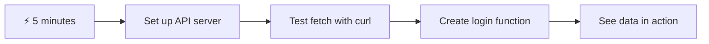

- **الدقيقة 1-2**: قم بتشغيل خادم API الخاص بك (`cd api && npm start`) واختبر الاتصال
- **الدقيقة 3**: أنشئ وظيفة `getAccount()` الأساسية باستخدام fetch
- **الدقيقة 4**: قم بتوصيل نموذج تسجيل الدخول بـ `action="javascript:login()"`
- **الدقيقة 5**: اختبر تسجيل الدخول وشاهد بيانات الحساب تظهر في وحدة التحكم

**أوامر الاختبار السريع**:
```bash
# Verify API is running
curl http://localhost:5000/api

# Test account data fetch
curl http://localhost:5000/api/accounts/test
```

**لماذا هذا مهم**: في 5 دقائق، ستشاهد سحر جلب البيانات غير المتزامن الذي يدعم كل تطبيق ويب حديث. هذا هو الأساس الذي يجعل التطبيقات تبدو مستجيبة وحيوية.

## 🗺️ رحلتك التعليمية عبر تطبيقات الويب المعتمدة على البيانات

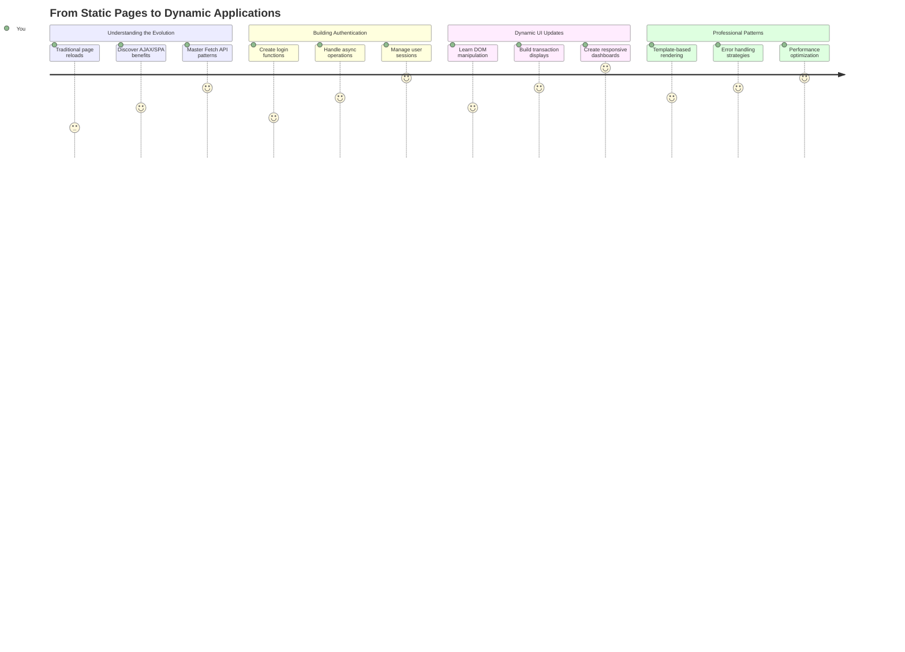

**وجهة رحلتك**: بنهاية هذا الدرس، ستفهم كيف تقوم تطبيقات الويب الحديثة بجلب ومعالجة وعرض البيانات ديناميكيًا، مما يخلق تجارب مستخدم سلسة نتوقعها من التطبيقات الاحترافية.

## اختبار ما قبل المحاضرة

[اختبار ما قبل المحاضرة](https://ff-quizzes.netlify.app/web/quiz/45)

### المتطلبات الأساسية

قبل الغوص في جلب البيانات، تأكد من أن لديك هذه المكونات جاهزة:

- **الدرس السابق**: أكمل [نموذج تسجيل الدخول والتسجيل](../2-forms/README.md) - سنبني على هذا الأساس
- **الخادم المحلي**: قم بتثبيت [Node.js](https://nodejs.org) و[تشغيل خادم API](../api/README.md) لتوفير بيانات الحساب
- **اتصال API**: اختبر اتصال الخادم الخاص بك باستخدام هذا الأمر:

```bash
curl http://localhost:5000/api
# Expected response: "Bank API v1.0.0"
```

هذا الاختبار السريع يضمن أن جميع المكونات تتواصل بشكل صحيح:
- يتحقق من أن Node.js يعمل بشكل صحيح على نظامك
- يؤكد أن خادم API الخاص بك نشط ويستجيب
- يتحقق من أن تطبيقك يمكنه الوصول إلى الخادم (مثل التحقق من الاتصال اللاسلكي قبل بدء المهمة)

## 🧠 نظرة عامة على نظام إدارة البيانات

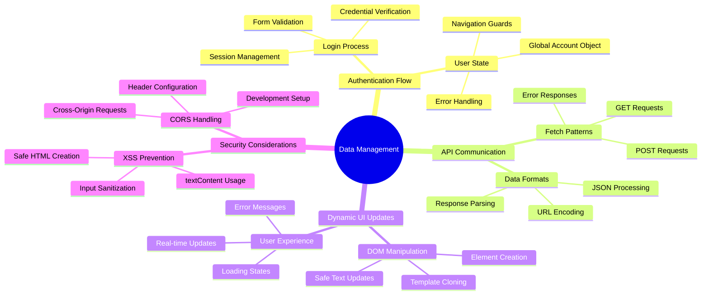

**المبدأ الأساسي**: تطبيقات الويب الحديثة هي أنظمة تنسيق البيانات - تنسق بين واجهات المستخدم وواجهات برمجة التطبيقات للخادم ونماذج أمان المتصفح لإنشاء تجارب سلسة ومستجيبة.

---

## فهم جلب البيانات في تطبيقات الويب الحديثة

طريقة تعامل تطبيقات الويب مع البيانات تطورت بشكل كبير على مدار العقدين الماضيين. فهم هذا التطور سيساعدك على تقدير قوة التقنيات الحديثة مثل AJAX وFetch API ولماذا أصبحت أدوات أساسية لمطوري الويب.

دعونا نستكشف كيف كانت تعمل المواقع التقليدية مقارنة بالتطبيقات الديناميكية المستجيبة التي نبنيها اليوم.

### التطبيقات متعددة الصفحات التقليدية (MPA)

في الأيام الأولى للويب، كان كل نقرة تشبه تغيير القنوات على تلفزيون قديم - الشاشة تصبح فارغة، ثم تبدأ في عرض المحتوى الجديد ببطء. كانت هذه هي حقيقة التطبيقات الويب القديمة، حيث كانت كل تفاعل يعني إعادة بناء الصفحة بالكامل من البداية.

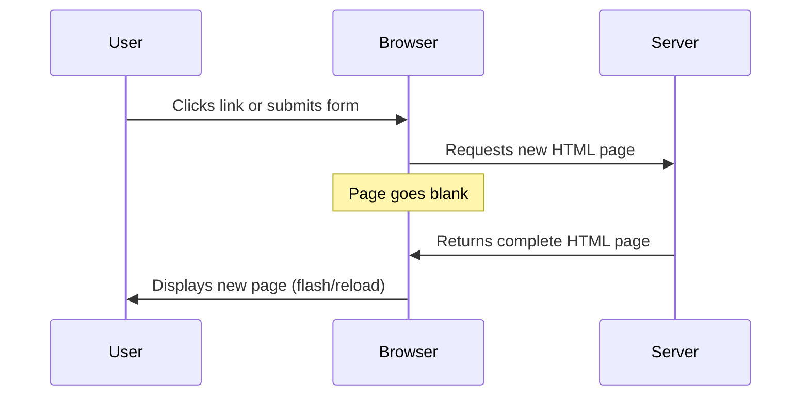


**لماذا كان هذا النهج يبدو غير سلس:**
- كل نقرة تعني إعادة بناء الصفحة بالكامل من البداية
- كان المستخدمون يتعرضون لانقطاع في التفكير بسبب تلك الومضات المزعجة للصفحة
- كان اتصال الإنترنت يعمل بجهد إضافي لتحميل نفس الرأس والتذييل مرارًا وتكرارًا
- كانت التطبيقات تبدو وكأنها تصفح ملفات بدلاً من استخدام البرمجيات

### التطبيقات أحادية الصفحة الحديثة (SPA)

غيرت تقنية AJAX (JavaScript وXML غير المتزامن) هذا النموذج تمامًا. مثل التصميم المعياري لمحطة الفضاء الدولية، حيث يمكن لرواد الفضاء استبدال المكونات الفردية دون إعادة بناء الهيكل بالكامل، يسمح لنا AJAX بتحديث أجزاء محددة من صفحة الويب دون إعادة تحميل كل شيء. على الرغم من أن الاسم يشير إلى XML، إلا أننا نستخدم JSON في الغالب اليوم، لكن المبدأ الأساسي يبقى كما هو: تحديث ما يحتاج إلى التغيير فقط.

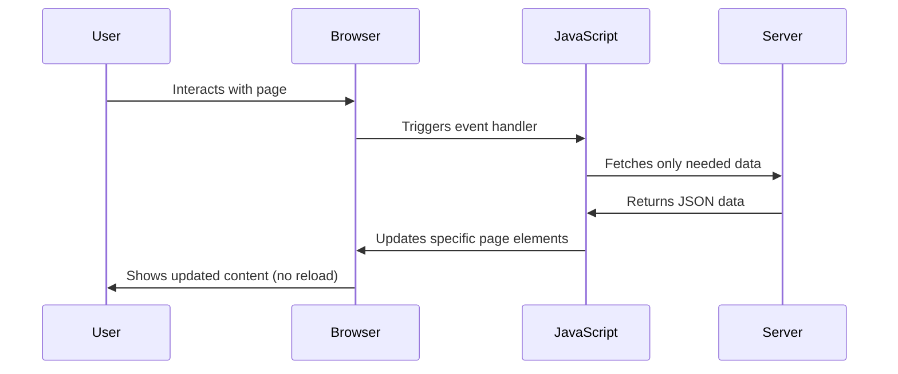


**لماذا التطبيقات أحادية الصفحة تبدو أفضل بكثير:**
- يتم تحديث الأجزاء التي تغيرت فقط (ذكي، أليس كذلك؟)
- لا مزيد من الانقطاعات المزعجة - يبقى المستخدمون في تدفقهم
- بيانات أقل تنتقل عبر الشبكة تعني تحميل أسرع
- كل شيء يبدو سريعًا ومستجيبًا، مثل التطبيقات على هاتفك

### التطور إلى Fetch API الحديث

توفر المتصفحات الحديثة [`Fetch` API](https://developer.mozilla.org/docs/Web/API/Fetch_API)، الذي يحل محل [`XMLHttpRequest`](https://developer.mozilla.org/docs/Web/API/XMLHttpRequest/Using_XMLHttpRequest) القديم. مثل الفرق بين تشغيل التلغراف واستخدام البريد الإلكتروني، يستخدم Fetch API الوعود لكتابة كود غير متزامن أنظف ويتعامل مع JSON بشكل طبيعي.

| الميزة | XMLHttpRequest | Fetch API |
|---------|----------------|----------|
| **الصياغة** | معقدة تعتمد على الاستدعاءات | تعتمد على الوعود النظيفة |
| **التعامل مع JSON** | يتطلب التحليل اليدوي | طريقة `.json()` مدمجة |
| **التعامل مع الأخطاء** | معلومات محدودة عن الأخطاء | تفاصيل شاملة عن الأخطاء |
| **الدعم الحديث** | توافق مع الإصدارات القديمة | وعود ES6+ وasync/await |

> 💡 **توافق المتصفح**: أخبار جيدة - يعمل Fetch API في جميع المتصفحات الحديثة! إذا كنت فضوليًا بشأن الإصدارات المحددة، [caniuse.com](https://caniuse.com/fetch) يحتوي على القصة الكاملة للتوافق.
> 
**الخلاصة:**
- يعمل بشكل رائع في Chrome وFirefox وSafari وEdge (بشكل أساسي في كل مكان يتواجد فيه المستخدمون)
- فقط Internet Explorer يحتاج إلى مساعدة إضافية (وبصراحة، حان الوقت للتخلي عن IE)
- يجهزك تمامًا لأنماط async/await الأنيقة التي سنستخدمها لاحقًا

### تنفيذ تسجيل الدخول وجلب البيانات

الآن دعونا ننفذ نظام تسجيل الدخول الذي يحول تطبيقك المصرفي من عرض ثابت إلى تطبيق وظيفي. مثل بروتوكولات المصادقة المستخدمة في المنشآت العسكرية الآمنة، سنقوم بالتحقق من بيانات المستخدم ثم توفير الوصول إلى بياناته المحددة.

سنقوم ببناء هذا تدريجيًا، بدءًا من المصادقة الأساسية ثم إضافة قدرات جلب البيانات.

#### الخطوة 1: إنشاء أساس وظيفة تسجيل الدخول

افتح ملف `app.js` الخاص بك وأضف وظيفة `login` جديدة. ستتعامل هذه الوظيفة مع عملية مصادقة المستخدم:

```javascript
async function login() {
  const loginForm = document.getElementById('loginForm');
  const user = loginForm.user.value;
}
```

**لنقم بتفصيل هذا:**
- الكلمة المفتاحية `async`؟ تخبر JavaScript "مرحبًا، هذه الوظيفة قد تحتاج إلى الانتظار لبعض الأشياء"
- نحن نحصل على النموذج الخاص بنا من الصفحة (لا شيء فاخر، فقط العثور عليه بواسطة معرفه)
- ثم نقوم بسحب ما كتبه المستخدم كاسم مستخدم
- إليك خدعة رائعة: يمكنك الوصول إلى أي إدخال نموذج بواسطة خاصية `name` - لا حاجة لاستدعاءات إضافية لـ getElementById!

> 💡 **نمط الوصول إلى النموذج**: يمكن الوصول إلى كل عنصر تحكم في النموذج بواسطة اسمه (المحدد في HTML باستخدام خاصية `name`) كخاصية لعنصر النموذج. يوفر هذا طريقة نظيفة وسهلة للحصول على بيانات النموذج.

#### الخطوة 2: إنشاء وظيفة جلب بيانات الحساب

بعد ذلك، سنقوم بإنشاء وظيفة مخصصة لجلب بيانات الحساب من الخادم. يتبع هذا نفس النمط مثل وظيفة التسجيل الخاصة بك ولكنه يركز على جلب البيانات:

```javascript
async function getAccount(user) {
  try {
    const response = await fetch('//localhost:5000/api/accounts/' + encodeURIComponent(user));
    return await response.json();
  } catch (error) {
    return { error: error.message || 'Unknown error' };
  }
}
```

**ما يحققه هذا الكود:**
- **يستخدم** Fetch API الحديث لطلب البيانات بشكل غير متزامن
- **يبني** عنوان URL لطلب GET مع معلمة اسم المستخدم
- **يطبق** `encodeURIComponent()` للتعامل بأمان مع الأحرف الخاصة في عناوين URL
- **يحول** الاستجابة إلى صيغة JSON لتسهيل معالجة البيانات
- **يتعامل** مع الأخطاء بشكل جيد عن طريق إرجاع كائن خطأ بدلاً من التعطل

> ⚠️ **ملاحظة أمان**: وظيفة `encodeURIComponent()` تتعامل مع الأحرف الخاصة في عناوين URL. مثل أنظمة التشفير المستخدمة في الاتصالات البحرية، تضمن وصول رسالتك بالضبط كما هو مقصود، مما يمنع الأحرف مثل "#" أو "&" من أن يتم تفسيرها بشكل خاطئ.
> 
**لماذا هذا مهم:**
- يمنع الأحرف الخاصة من كسر عناوين URL
- يحمي من هجمات التلاعب بعناوين URL
- يضمن أن الخادم يتلقى البيانات المقصودة
- يتبع ممارسات البرمجة الآمنة

#### فهم طلبات HTTP GET

إليك شيء قد يفاجئك: عندما تستخدم `fetch` بدون أي خيارات إضافية، فإنه ينشئ تلقائيًا طلب [`GET`](https://developer.mozilla.org/docs/Web/HTTP/Methods/GET). هذا مثالي لما نقوم به - طلب من الخادم "مرحبًا، هل يمكنني رؤية بيانات حساب هذا المستخدم؟"

فكر في طلبات GET كطلب استعارة كتاب من المكتبة - تطلب رؤية شيء موجود بالفعل. طلبات POST (التي استخدمناها للتسجيل) تشبه أكثر تقديم كتاب جديد ليتم إضافته إلى المجموعة.

| طلب GET | طلب POST |
|-------------|-------------|
| **الغرض** | استرجاع البيانات الموجودة | إرسال بيانات جديدة إلى الخادم |
| **المعلمات** | في مسار/سلسلة استعلام URL | في جسم الطلب |
| **التخزين المؤقت** | يمكن تخزينها مؤقتًا بواسطة المتصفحات | لا يتم تخزينها مؤقتًا عادةً |
| **الأمان** | مرئية في عنوان URL/السجلات | مخفية في جسم الطلب |

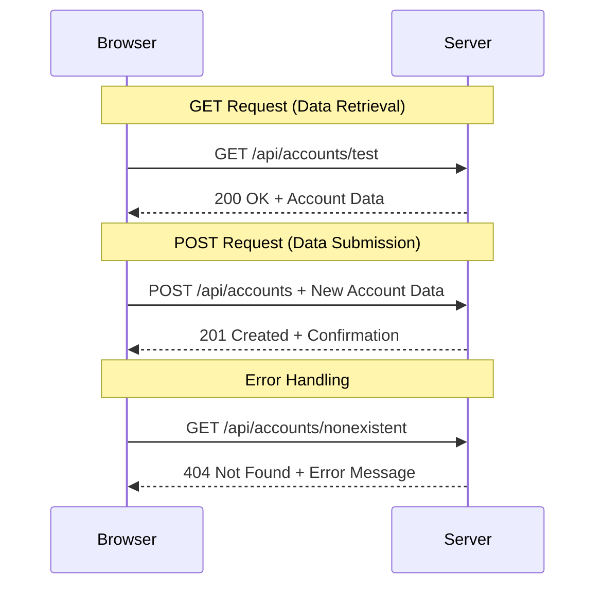

#### الخطوة 3: جمع كل شيء معًا

الآن الجزء الممتع - دعونا نربط وظيفة جلب بيانات الحساب بعملية تسجيل الدخول. هنا حيث كل شيء يتكامل:

```javascript
async function login() {
  const loginForm = document.getElementById('loginForm');
  const user = loginForm.user.value;
  const data = await getAccount(user);

  if (data.error) {
    return console.log('loginError', data.error);
  }

  account = data;
  navigate('/dashboard');
}
```

تتبع هذه الوظيفة تسلسلًا واضحًا:
- استخراج اسم المستخدم من إدخال النموذج
- طلب بيانات حساب المستخدم من الخادم
- التعامل مع أي أخطاء تحدث أثناء العملية
- تخزين بيانات الحساب والانتقال إلى لوحة التحكم عند النجاح

> 🎯 **نمط Async/Await**: بما أن `getAccount` هي وظيفة غير متزامنة، نستخدم الكلمة المفتاحية `await` لإيقاف التنفيذ حتى يستجيب الخادم. هذا يمنع الكود من الاستمرار مع بيانات غير معرفة.

#### الخطوة 4: إنشاء مكان لبياناتك

تطبيقك يحتاج إلى مكان لتذكر معلومات الحساب بمجرد تحميلها. فكر في هذا كمكان ذاكرة قصيرة المدى لتطبيقك - مكان للحفاظ على بيانات المستخدم الحالي في متناول اليد. أضف هذا السطر في أعلى ملف `app.js` الخاص بك:

```javascript
// This holds the current user's account data
let account = null;
```

**لماذا نحتاج هذا:**
- يحافظ على بيانات الحساب متاحة من أي مكان في تطبيقك
- البدء بـ `null` يعني "لا أحد مسجل الدخول بعد"
- يتم تحديثه عندما يسجل شخص ما الدخول أو التسجيل بنجاح
- يعمل كمصدر واحد للحقيقة - لا يوجد ارتباك حول من هو مسجل الدخول

#### الخطوة 5: توصيل النموذج الخاص بك

الآن دعونا نربط وظيفة تسجيل الدخول الجديدة الخاصة بك بنموذج HTML الخاص بك. قم بتحديث علامة النموذج الخاصة بك على هذا النحو:

```html
<form id="loginForm" action="javascript:login()">
  <!-- Your existing form inputs -->
</form>
```

**ما يفعله هذا التغيير الصغير:**
- يوقف النموذج من القيام بسلوك "إعادة تحميل الصفحة بالكامل" الافتراضي
- يستدعي وظيفة JavaScript المخصصة الخاصة بك بدلاً من ذلك
- يحافظ على كل شيء سلسًا ومشابهًا لتطبيق الصفحة الواحدة
- يمنحك التحكم الكامل في ما يحدث عندما يضغط المستخدمون على "تسجيل الدخول"

#### الخطوة 6: تحسين وظيفة التسجيل الخاصة بك

للحفاظ على التناسق، قم بتحديث وظيفة `register` الخاصة بك لتخزين بيانات الحساب أيضًا والانتقال إلى لوحة التحكم:

```javascript
// Add these lines at the end of your register function
account = result;
navigate('/dashboard');
```

**يوفر هذا التحسين:**
- **انتقال سلس** من التسجيل إلى لوحة التحكم
- **تجربة مستخدم متسقة** بين تدفقات تسجيل الدخول والتسجيل
- **وصول فوري** إلى بيانات الحساب بعد التسجيل الناجح

#### اختبار التنفيذ الخاص بك

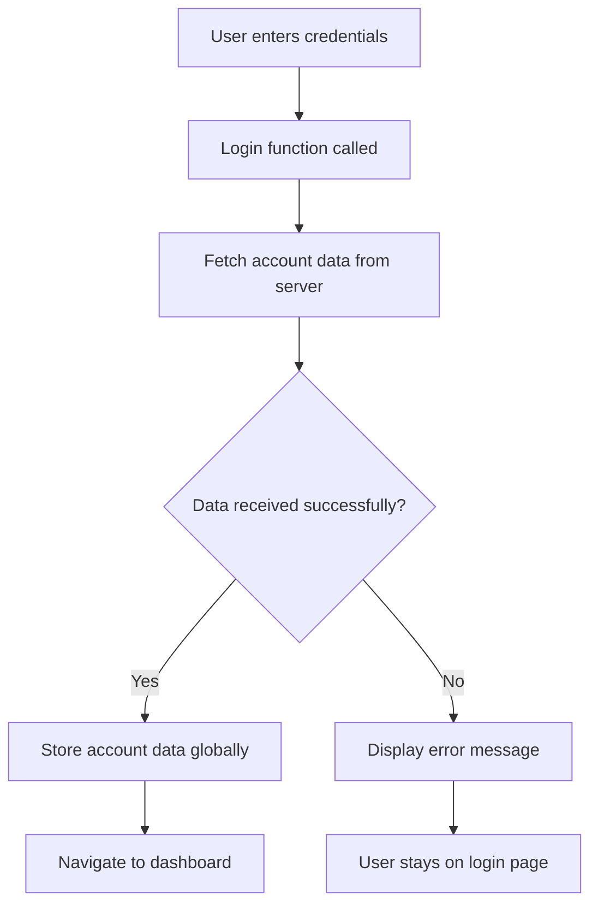

**حان الوقت لتجربته:**
1. أنشئ حسابًا جديدًا للتأكد من أن كل شيء يعمل
2. حاول تسجيل الدخول باستخدام نفس بيانات الاعتماد
3. ألقِ نظرة على وحدة التحكم في المتصفح الخاص بك (F12) إذا كان هناك أي شيء يبدو غير صحيح
4. تأكد من أنك تصل إلى لوحة التحكم بعد تسجيل الدخول بنجاح

إذا كان هناك شيء لا يعمل، لا داعي للذعر! معظم المشاكل يمكن حلها بسهولة مثل الأخطاء الإملائية أو نسيان تشغيل خادم API.

#### كلمة سريعة عن السحر عبر الأصل

قد تتساءل: "كيف يتحدث تطبيق الويب الخاص بي إلى خادم API هذا بينما يعملان على منافذ مختلفة؟" سؤال رائع! هذا يتعلق بشيء يواجهه كل مطور ويب في النهاية.

> 🔒 **أمان عبر الأصل**: المتصفحات تفرض "سياسة الأصل نفسه" لمنع الاتصالات غير المصرح بها بين المجالات المختلفة. مثل نظام نقاط التفتيش في البنتاغون، يتحققون من أن الاتصال مصرح به قبل السماح بنقل البيانات.
> 
**في إعدادنا:**
- تطبيق الويب الخاص بك يعمل على `localhost:3000` (خادم التطوير)
- خادم API الخاص بك يعمل على `localhost:5000` (الخادم الخلفي)
- يتضمن خادم API [رؤوس CORS](https://developer.mozilla.org/docs/Web/HTTP/CORS) التي تسمح صراحةً بالاتصال من تطبيق الويب الخاص بك

هذا التكوين يعكس تطوير العالم الحقيقي حيث تعمل التطبيقات الأمامية والخلفية عادةً على خوادم منفصلة.

> 📚 **تعلم المزيد**: تعمق في واجهات برمجة التطبيقات وجلب البيانات مع هذا [الوحدة التعليمية الشاملة من Microsoft Learn حول واجهات برمجة التطبيقات](https://docs.microsoft.com/learn/modules/use-apis-discover-museum-art/?WT.mc_id=academic-77807-sagibbon).

## إحياء بياناتك في HTML

الآن سنجعل البيانات التي تم جلبها مرئية للمستخدمين من خلال التلاعب بـ DOM. مثل عملية تطوير الصور في غرفة مظلمة، نحن نحول البيانات غير المرئية إلى شيء يمكن للمستخدمين رؤيته والتفاعل معه.
التعامل مع DOM هو التقنية التي تحول صفحات الويب الثابتة إلى تطبيقات ديناميكية تقوم بتحديث محتواها بناءً على تفاعلات المستخدم واستجابات الخادم.

### اختيار الأداة المناسبة للعمل

عندما يتعلق الأمر بتحديث HTML باستخدام JavaScript، لديك عدة خيارات. فكر في هذه الخيارات كأدوات مختلفة في صندوق الأدوات - كل واحدة مثالية لمهام معينة:

| الطريقة | ما هي ممتازة له | متى تستخدمها | مستوى الأمان |
|--------|---------------------|----------------|--------------|
| `textContent` | عرض بيانات المستخدم بأمان | في أي وقت تعرض فيه نصًا | ✅ موثوق للغاية |
| `createElement()` + `append()` | إنشاء تخطيطات معقدة | إنشاء أقسام/قوائم جديدة | ✅ آمن تمامًا |
| `innerHTML` | إعداد محتوى HTML | ⚠️ حاول تجنب هذه الطريقة | ❌ محفوفة بالمخاطر |

#### الطريقة الآمنة لعرض النص: textContent

خاصية [`textContent`](https://developer.mozilla.org/docs/Web/API/Node/textContent) هي أفضل صديق لك عند عرض بيانات المستخدم. إنها مثل الحارس الشخصي لصفحتك على الويب - لا شيء ضار يمكن أن يمر:

```javascript
// The safe, reliable way to update text
const balanceElement = document.getElementById('balance');
balanceElement.textContent = account.balance;
```

**فوائد textContent:**
- تعامل كل شيء كنص عادي (تمنع تنفيذ السكربتات)
- تقوم بمسح المحتوى الموجود تلقائيًا
- فعالة لتحديث النصوص البسيطة
- توفر أمانًا مدمجًا ضد المحتوى الضار

#### إنشاء عناصر HTML ديناميكية

للحصول على محتوى أكثر تعقيدًا، اجمع بين [`document.createElement()`](https://developer.mozilla.org/docs/Web/API/Document/createElement) وطريقة [`append()`](https://developer.mozilla.org/docs/Web/API/ParentNode/append):

```javascript
// Safe way to create new elements
const transactionItem = document.createElement('div');
transactionItem.className = 'transaction-item';
transactionItem.textContent = `${transaction.date}: ${transaction.description}`;
container.append(transactionItem);
```

**فهم هذا النهج:**
- **ينشئ** عناصر DOM جديدة برمجيًا
- **يحافظ** على التحكم الكامل في سمات العنصر ومحتواه
- **يسمح** بإنشاء هياكل عناصر متداخلة ومعقدة
- **يحافظ** على الأمان بفصل الهيكل عن المحتوى

> ⚠️ **اعتبارات الأمان**: بينما تظهر خاصية [`innerHTML`](https://developer.mozilla.org/docs/Web/API/Element/innerHTML) في العديد من الدروس، يمكنها تنفيذ السكربتات المضمنة. مثل بروتوكولات الأمان في CERN التي تمنع تنفيذ الأكواد غير المصرح بها، استخدام `textContent` و `createElement` يوفر بدائل أكثر أمانًا.
> 
**مخاطر innerHTML:**
- تنفذ أي علامات `<script>` في بيانات المستخدم
- عرضة لهجمات حقن الأكواد
- تخلق ثغرات أمنية محتملة
- البدائل الأكثر أمانًا التي نستخدمها توفر نفس الوظائف

### جعل الأخطاء سهلة الفهم للمستخدمين

حاليًا، تظهر أخطاء تسجيل الدخول فقط في وحدة التحكم بالمتصفح، مما يجعلها غير مرئية للمستخدمين. مثل الفرق بين التشخيصات الداخلية للطيار ونظام معلومات الركاب، نحتاج إلى التواصل بالمعلومات المهمة من خلال القناة المناسبة.

تنفيذ رسائل خطأ مرئية يوفر للمستخدمين ردود فعل فورية حول ما حدث وكيفية المتابعة.

#### الخطوة 1: إضافة مكان لرسائل الخطأ

أولاً، لنمنح رسائل الخطأ مكانًا في HTML الخاص بك. أضف هذا مباشرةً قبل زر تسجيل الدخول حتى يراه المستخدمون بشكل طبيعي:

```html
<!-- This is where error messages will appear -->
<div id="loginError" role="alert"></div>
<button>Login</button>
```

**ما يحدث هنا:**
- نقوم بإنشاء حاوية فارغة تبقى غير مرئية حتى الحاجة إليها
- يتم وضعها في مكان طبيعي ينظر إليه المستخدمون بعد النقر على "تسجيل الدخول"
- تلك الخاصية `role="alert"` هي لمسة لطيفة لقراء الشاشة - تخبر التكنولوجيا المساعدة "مرحبًا، هذا مهم!"
- المعرف الفريد `id` يمنح JavaScript هدفًا سهلاً

#### الخطوة 2: إنشاء وظيفة مساعدة مفيدة

لنقم بإنشاء وظيفة صغيرة يمكنها تحديث نص أي عنصر. هذه واحدة من تلك الوظائف "اكتبها مرة واحدة، واستخدمها في كل مكان" التي ستوفر لك الوقت:

```javascript
function updateElement(id, text) {
  const element = document.getElementById(id);
  element.textContent = text;
}
```

**فوائد الوظيفة:**
- واجهة بسيطة تتطلب فقط معرف العنصر ومحتوى النص
- تحدد وتحدث عناصر DOM بأمان
- نمط قابل لإعادة الاستخدام يقلل من تكرار الكود
- يحافظ على سلوك التحديث المتسق عبر التطبيق

#### الخطوة 3: عرض الأخطاء حيث يمكن للمستخدمين رؤيتها

الآن لنستبدل رسالة وحدة التحكم المخفية بشيء يمكن للمستخدمين رؤيته بالفعل. قم بتحديث وظيفة تسجيل الدخول الخاصة بك:

```javascript
// Instead of just logging to console, show the user what's wrong
if (data.error) {
  return updateElement('loginError', data.error);
}
```

**هذا التغيير الصغير يحدث فرقًا كبيرًا:**
- تظهر رسائل الخطأ في المكان الذي ينظر إليه المستخدمون
- لا مزيد من الفشل الصامت الغامض
- يحصل المستخدمون على ردود فعل فورية وقابلة للتنفيذ
- يبدأ تطبيقك في الشعور بالاحترافية والاهتمام

الآن عند الاختبار باستخدام حساب غير صالح، سترى رسالة خطأ مفيدة مباشرةً على الصفحة!


#### الخطوة 4: أن تكون شاملًا مع إمكانية الوصول

هناك شيء رائع حول الخاصية `role="alert"` التي أضفناها سابقًا - إنها ليست مجرد زخرفة! هذه الخاصية الصغيرة تخلق ما يسمى [منطقة حية](https://developer.mozilla.org/docs/Web/Accessibility/ARIA/ARIA_Live_Regions) التي تعلن التغييرات فورًا لقراء الشاشة:

```html
<div id="loginError" role="alert"></div>
```

**لماذا هذا مهم:**
- يسمع مستخدمو قارئ الشاشة رسالة الخطأ بمجرد ظهورها
- يحصل الجميع على نفس المعلومات المهمة، بغض النظر عن كيفية التنقل
- إنها طريقة بسيطة لجعل تطبيقك يعمل لمزيد من الأشخاص
- يظهر أنك تهتم بخلق تجارب شاملة

لمسات صغيرة كهذه تميز المطورين الجيدين عن العظماء!

### 🎯 مراجعة تعليمية: أنماط المصادقة

**توقف وفكر**: لقد قمت للتو بتنفيذ تدفق مصادقة كامل. هذا نمط أساسي في تطوير الويب.

**تقييم ذاتي سريع**:
- هل يمكنك شرح لماذا نستخدم async/await لاستدعاءات API؟
- ماذا سيحدث إذا نسينا وظيفة `encodeURIComponent()`؟
- كيف يحسن التعامل مع الأخطاء تجربة المستخدم؟

**اتصال بالعالم الحقيقي**: الأنماط التي تعلمتها هنا (جلب البيانات بشكل غير متزامن، التعامل مع الأخطاء، ردود فعل المستخدم) تُستخدم في كل تطبيق ويب رئيسي من منصات التواصل الاجتماعي إلى مواقع التجارة الإلكترونية. أنت تبني مهارات على مستوى الإنتاج!

**سؤال التحدي**: كيف يمكنك تعديل نظام المصادقة هذا للتعامل مع أدوار المستخدم المتعددة (عميل، مدير، صراف)؟ فكر في هيكل البيانات والتغييرات المطلوبة في واجهة المستخدم.

#### الخطوة 5: تطبيق نفس النمط على التسجيل

للحفاظ على التناسق، قم بتنفيذ نفس التعامل مع الأخطاء في نموذج التسجيل الخاص بك:

1. **أضف** عنصر عرض الخطأ إلى HTML الخاص بالتسجيل:
```html
<div id="registerError" role="alert"></div>
```

2. **قم بتحديث** وظيفة التسجيل لاستخدام نفس نمط عرض الخطأ:
```javascript
if (data.error) {
  return updateElement('registerError', data.error);
}
```

**فوائد التعامل المتسق مع الأخطاء:**
- **يوفر** تجربة مستخدم موحدة عبر جميع النماذج
- **يقلل** العبء المعرفي باستخدام أنماط مألوفة
- **يبسط** الصيانة باستخدام كود قابل لإعادة الاستخدام
- **يضمن** تلبية معايير إمكانية الوصول في جميع أنحاء التطبيق

## إنشاء لوحة تحكم ديناميكية

الآن سنحول لوحة التحكم الثابتة الخاصة بك إلى واجهة ديناميكية تعرض بيانات الحساب الحقيقية. مثل الفرق بين جدول الرحلات المطبوع ولوحات المغادرة الحية في المطارات، نحن ننتقل من المعلومات الثابتة إلى العروض التفاعلية في الوقت الفعلي.

باستخدام تقنيات التعامل مع DOM التي تعلمتها، سنقوم بإنشاء لوحة تحكم يتم تحديثها تلقائيًا بمعلومات الحساب الحالية.

### التعرف على بياناتك

قبل أن نبدأ في البناء، لنلقي نظرة على نوع البيانات التي يرسلها الخادم الخاص بك. عندما يقوم شخص ما بتسجيل الدخول بنجاح، إليك الكنز الذي تحصل عليه للعمل معه:

```json
{
  "user": "test",
  "currency": "$",
  "description": "Test account",
  "balance": 75,
  "transactions": [
    { "id": "1", "date": "2020-10-01", "object": "Pocket money", "amount": 50 },
    { "id": "2", "date": "2020-10-03", "object": "Book", "amount": -10 },
    { "id": "3", "date": "2020-10-04", "object": "Sandwich", "amount": -5 }
  ]
}
```

**يوفر هيكل البيانات هذا:**
- **`user`**: مثالي لتخصيص التجربة ("مرحبًا بعودتك، سارة!")
- **`currency`**: يضمن عرض المبالغ المالية بشكل صحيح
- **`description`**: اسم ودي للحساب
- **`balance`**: الرصيد الحالي المهم للغاية
- **`transactions`**: سجل المعاملات الكامل بجميع التفاصيل

كل ما تحتاجه لإنشاء لوحة تحكم مصرفية بمظهر احترافي!

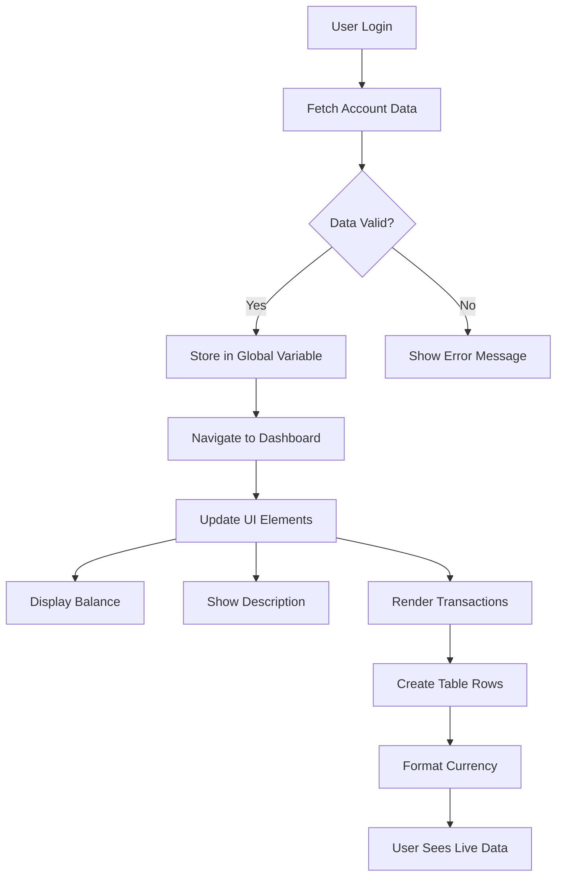

> 💡 **نصيحة احترافية**: هل تريد رؤية لوحة التحكم الخاصة بك تعمل على الفور؟ استخدم اسم المستخدم `test` عند تسجيل الدخول - يأتي محملاً مسبقًا ببيانات نموذجية حتى تتمكن من رؤية كل شيء يعمل دون الحاجة إلى إنشاء معاملات أولاً.
> 
**لماذا الحساب التجريبي مفيد:**
- يأتي مع بيانات نموذجية واقعية محملة مسبقًا
- مثالي لرؤية كيفية عرض المعاملات
- رائع لاختبار ميزات لوحة التحكم الخاصة بك
- يوفر عليك عناء إنشاء بيانات وهمية يدويًا

### إنشاء عناصر عرض لوحة التحكم

لنقم ببناء واجهة لوحة التحكم خطوة بخطوة، بدءًا من معلومات ملخص الحساب ثم الانتقال إلى ميزات أكثر تعقيدًا مثل قوائم المعاملات.

#### الخطوة 1: تحديث هيكل HTML الخاص بك

أولاً، استبدل قسم "الرصيد" الثابت بعناصر نائبة ديناميكية يمكن لـ JavaScript ملؤها:

```html
<section>
  Balance: <span id="balance"></span><span id="currency"></span>
</section>
```

بعد ذلك، أضف قسمًا لوصف الحساب. بما أن هذا يعمل كعنوان لمحتوى لوحة التحكم، استخدم HTML دلالي:

```html
<h2 id="description"></h2>
```

**فهم هيكل HTML:**
- **يستخدم** عناصر `<span>` منفصلة للرصيد والعملة للتحكم الفردي
- **يطبق** معرفات فريدة لكل عنصر لاستهداف JavaScript
- **يتبع** HTML الدلالي باستخدام `<h2>` لوصف الحساب
- **ينشئ** تسلسلًا منطقيًا لقراء الشاشة وتحسين محركات البحث

> ✅ **رؤية إمكانية الوصول**: يعمل وصف الحساب كعنوان لمحتوى لوحة التحكم، لذا يتم ترميزه دلاليًا كعنوان. تعرف على المزيد حول كيفية تأثير [هيكل العناوين](https://www.nomensa.com/blog/2017/how-structure-headings-web-accessibility) على إمكانية الوصول. هل يمكنك تحديد عناصر أخرى على صفحتك قد تستفيد من علامات العناوين؟

#### الخطوة 2: إنشاء وظيفة تحديث لوحة التحكم

الآن قم بإنشاء وظيفة تقوم بملء لوحة التحكم ببيانات الحساب الحقيقية:

```javascript
function updateDashboard() {
  if (!account) {
    return navigate('/login');
  }

  updateElement('description', account.description);
  updateElement('balance', account.balance.toFixed(2));
  updateElement('currency', account.currency);
}
```

**خطوة بخطوة، إليك ما تفعله هذه الوظيفة:**
- **تتحقق** من وجود بيانات الحساب قبل المتابعة
- **تعيد توجيه** المستخدمين غير المصادقين إلى صفحة تسجيل الدخول
- **تحدث** وصف الحساب باستخدام وظيفة `updateElement` القابلة لإعادة الاستخدام
- **تنسق** الرصيد ليظهر دائمًا برقم عشريين
- **تعرض** رمز العملة المناسب

> 💰 **تنسيق الأموال**: تلك الطريقة [`toFixed(2)`](https://developer.mozilla.org/docs/Web/JavaScript/Reference/Global_Objects/Number/toFixed) هي منقذ! إنها تضمن أن الرصيد يبدو دائمًا كأموال حقيقية - "75.00" بدلًا من مجرد "75". سيقدر المستخدمون رؤية تنسيق العملة المألوف.

#### الخطوة 3: التأكد من تحديث لوحة التحكم الخاصة بك

لضمان تحديث لوحة التحكم الخاصة بك مع البيانات الحالية في كل مرة يزورها شخص ما، نحتاج إلى الربط بنظام التنقل الخاص بك. إذا كنت قد أكملت [مهمة الدرس الأول](../1-template-route/assignment.md)، يجب أن يكون هذا مألوفًا. إذا لم يكن كذلك، لا تقلق - إليك ما تحتاجه:

أضف هذا إلى نهاية وظيفة `updateRoute()` الخاصة بك:

```javascript
if (typeof route.init === 'function') {
  route.init();
}
```

ثم قم بتحديث مساراتك لتشمل تهيئة لوحة التحكم:

```javascript
const routes = {
  '/login': { templateId: 'login' },
  '/dashboard': { templateId: 'dashboard', init: updateDashboard }
};
```

**ما الذي يفعله هذا الإعداد الذكي:**
- يتحقق مما إذا كان للمسار كود تهيئة خاص
- يشغل هذا الكود تلقائيًا عند تحميل المسار
- يضمن أن لوحة التحكم الخاصة بك تعرض دائمًا بيانات جديدة وحالية
- يحافظ على منطق التوجيه نظيفًا ومنظمًا

#### اختبار لوحة التحكم الخاصة بك

بعد تنفيذ هذه التغييرات، اختبر لوحة التحكم الخاصة بك:

1. **قم بتسجيل الدخول** باستخدام حساب تجريبي
2. **تحقق** من أنك تم إعادة توجيهك إلى لوحة التحكم
3. **تأكد** من أن وصف الحساب، الرصيد، ورمز العملة يتم عرضهم بشكل صحيح
4. **حاول تسجيل الخروج ثم تسجيل الدخول مرة أخرى** للتأكد من تحديث البيانات بشكل صحيح

يجب أن تعرض لوحة التحكم الخاصة بك الآن معلومات الحساب الديناميكية التي يتم تحديثها بناءً على بيانات المستخدم المسجل!

## إنشاء قوائم معاملات ذكية باستخدام القوالب

بدلاً من إنشاء HTML يدويًا لكل معاملة، سنستخدم القوالب لتوليد تنسيق متسق تلقائيًا. مثل المكونات الموحدة المستخدمة في تصنيع المركبات الفضائية، تضمن القوالب أن كل صف معاملة يتبع نفس الهيكل والمظهر.

هذه التقنية تتوسع بكفاءة من عدد قليل من المعاملات إلى الآلاف، مع الحفاظ على الأداء والعرض المتسق.

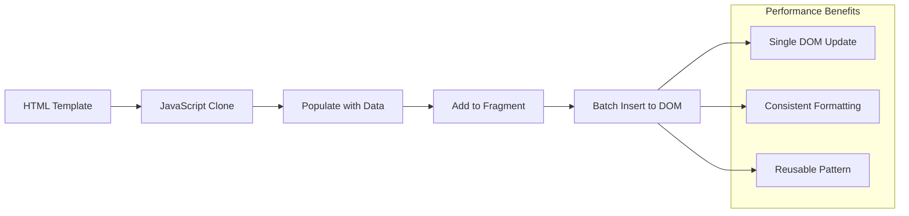

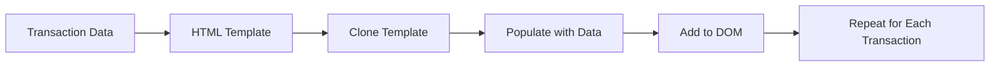

### الخطوة 1: إنشاء قالب المعاملة

أولاً، أضف قالبًا قابلًا لإعادة الاستخدام لصفوف المعاملات في HTML `<body>`:

```html
<template id="transaction">
  <tr>
    <td></td>
    <td></td>
    <td></td>
  </tr>
</template>
```

**فهم قوالب HTML:**
- **تعرف** الهيكل لصف جدول واحد
- **تبقى** غير مرئية حتى يتم نسخها وملؤها باستخدام JavaScript
- **تتضمن** ثلاث خلايا للتاريخ، الوصف، والمبلغ
- **توفر** نمطًا قابلاً لإعادة الاستخدام لتنسيق متسق

### الخطوة 2: تجهيز الجدول للمحتوى الديناميكي

بعد ذلك، أضف معرفًا إلى جسم الجدول حتى يتمكن JavaScript من استهدافه بسهولة:

```html
<tbody id="transactions"></tbody>
```

**ما الذي يحققه هذا:**
- **ينشئ** هدفًا واضحًا لإدخال صفوف المعاملات
- **يفصل** هيكل الجدول عن المحتوى الديناميكي
- **يمكن** من مسح وإعادة ملء بيانات المعاملات بسهولة

### الخطوة 3: بناء وظيفة مصنع صف المعاملة

الآن قم بإنشاء وظيفة تحول بيانات المعاملة إلى عناصر HTML:

```javascript
function createTransactionRow(transaction) {
  const template = document.getElementById('transaction');
  const transactionRow = template.content.cloneNode(true);
  const tr = transactionRow.querySelector('tr');
  tr.children[0].textContent = transaction.date;
  tr.children[1].textContent = transaction.object;
  tr.children[2].textContent = transaction.amount.toFixed(2);
  return transactionRow;
}
```

**تفصيل وظيفة المصنع هذه:**
- **تسترجع** عنصر القالب بواسطة معرفه
- **تنسخ** محتوى القالب للتلاعب الآمن
- **تحدد** صف الجدول داخل المحتوى المنسوخ
- **تملأ** كل خلية ببيانات المعاملة
- **تنسيق** المبلغ ليظهر بشكل عشري صحيح
- **تعيد** الصف المكتمل جاهزًا للإدراج

### الخطوة 4: إنشاء صفوف معاملات متعددة بكفاءة

أضف هذا الكود إلى وظيفة `updateDashboard()` لعرض جميع المعاملات:

```javascript
const transactionsRows = document.createDocumentFragment();
for (const transaction of account.transactions) {
  const transactionRow = createTransactionRow(transaction);
  transactionsRows.appendChild(transactionRow);
}
updateElement('transactions', transactionsRows);
```

**فهم هذا النهج الفعال:**
- **ينشئ** جزءًا من المستند لتجميع عمليات DOM
- **يكرر** جميع المعاملات في بيانات الحساب
- **ينشئ** صفًا لكل معاملة باستخدام وظيفة المصنع
- **يجمع** جميع الصفوف في الجزء قبل إضافتها إلى DOM
- **يجري** تحديثًا واحدًا لـ DOM بدلًا من إدخالات فردية متعددة
> ⚡ **تحسين الأداء**: [`document.createDocumentFragment()`](https://developer.mozilla.org/docs/Web/API/Document/createDocumentFragment) يعمل مثل عملية التجميع في شركة بوينغ - يتم إعداد المكونات خارج الخط الرئيسي، ثم يتم تثبيتها كوحدة كاملة. هذا النهج التجميعي يقلل من إعادة تدفق DOM عن طريق إجراء إدخال واحد بدلاً من عمليات فردية متعددة.

### الخطوة 5: تحسين وظيفة التحديث للمحتوى المختلط

وظيفة `updateElement()` الخاصة بك حالياً تتعامل فقط مع محتوى النصوص. قم بتحديثها لتعمل مع النصوص وعقد DOM:

```javascript
function updateElement(id, textOrNode) {
  const element = document.getElementById(id);
  element.textContent = ''; // Removes all children
  element.append(textOrNode);
}
```

**التحسينات الرئيسية في هذا التحديث:**
- **إزالة** المحتوى الحالي قبل إضافة محتوى جديد
- **قبول** سلاسل النصوص أو عقد DOM كمعلمات
- **استخدام** طريقة [`append()`](https://developer.mozilla.org/docs/Web/API/ParentNode/append) للمرونة
- **الحفاظ** على التوافق مع الاستخدام النصي الحالي

### تجربة لوحة التحكم الخاصة بك

حان وقت الحقيقة! دعنا نرى لوحة التحكم الديناميكية الخاصة بك قيد العمل:

1. قم بتسجيل الدخول باستخدام حساب `test` (يحتوي على بيانات تجريبية جاهزة)
2. انتقل إلى لوحة التحكم الخاصة بك
3. تحقق من ظهور صفوف المعاملات بتنسيق صحيح
4. تأكد من أن التواريخ، الأوصاف، والمبالغ تبدو جيدة

إذا كان كل شيء يعمل، يجب أن ترى قائمة معاملات وظيفية بالكامل على لوحة التحكم الخاصة بك! 🎉

**ما الذي أنجزته:**
- بناء لوحة تحكم تتكيف مع أي كمية من البيانات
- إنشاء قوالب قابلة لإعادة الاستخدام لتنسيق متسق
- تنفيذ تقنيات فعالة لمعالجة DOM
- تطوير وظائف تضاهي تطبيقات البنوك الإنتاجية

لقد نجحت في تحويل صفحة ويب ثابتة إلى تطبيق ويب ديناميكي.

### 🎯 مراجعة تعليمية: إنشاء محتوى ديناميكي

**فهم الهيكلية**: لقد قمت بتنفيذ خط أنابيب بيانات إلى واجهة المستخدم يعكس الأنماط المستخدمة في أطر العمل مثل React، Vue، و Angular.

**المفاهيم الرئيسية التي أتقنتها**:
- **التنسيق القائم على القوالب**: إنشاء مكونات واجهة مستخدم قابلة لإعادة الاستخدام
- **مقاطع المستندات**: تحسين أداء DOM
- **معالجة DOM الآمنة**: منع الثغرات الأمنية
- **تحويل البيانات**: تحويل بيانات الخادم إلى واجهات المستخدم

**صلة بالصناعة**: هذه التقنيات تشكل أساس أطر العمل الأمامية الحديثة. يعتمد DOM الافتراضي في React، ونظام القوالب في Vue، وهيكل المكونات في Angular على هذه المفاهيم الأساسية.

**سؤال للتفكير**: كيف يمكنك توسيع هذا النظام للتعامل مع التحديثات في الوقت الفعلي (مثل ظهور معاملات جديدة تلقائياً)؟ فكر في WebSockets أو Server-Sent Events.

---

## 📈 جدول زمني لإتقان إدارة البيانات

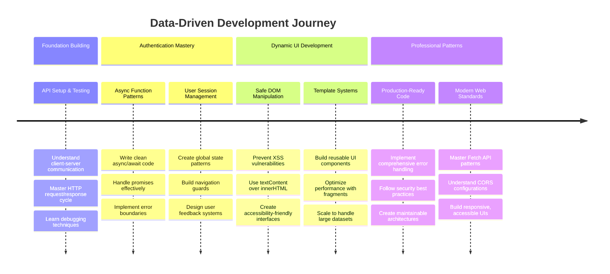

**🎓 مرحلة التخرج**: لقد نجحت في بناء تطبيق ويب كامل يعتمد على البيانات باستخدام أنماط JavaScript الحديثة. هذه المهارات تُترجم مباشرة للعمل مع أطر العمل مثل React، Vue، أو Angular.

**🔄 قدرات المستوى التالي**:
- جاهز لاستكشاف أطر العمل الأمامية التي تعتمد على هذه المفاهيم
- مستعد لتنفيذ ميزات الوقت الفعلي باستخدام WebSockets
- مجهز لبناء تطبيقات ويب تقدمية مع قدرات العمل دون اتصال
- تم إعداد الأساس لتعلم أنماط إدارة الحالة المتقدمة

## تحدي وكيل GitHub Copilot 🚀

استخدم وضع الوكيل لإكمال التحدي التالي:

**الوصف:** تحسين تطبيق البنك عن طريق تنفيذ ميزة البحث والتصفية للمعاملات التي تسمح للمستخدمين بالعثور على معاملات محددة حسب نطاق التاريخ، المبلغ، أو كلمات وصف المعاملة.

**المهمة:** قم بإنشاء وظيفة بحث لتطبيق البنك تتضمن: 1) نموذج بحث يحتوي على حقول إدخال لنطاق التاريخ (من/إلى)، الحد الأدنى/الأقصى للمبلغ، وكلمات وصف المعاملة، 2) وظيفة `filterTransactions()` التي تقوم بتصفية مصفوفة account.transactions بناءً على معايير البحث، 3) تحديث وظيفة `updateDashboard()` لعرض النتائج المصفاة، و 4) إضافة زر "إعادة تعيين الفلاتر" لإعادة العرض. استخدم طرق مصفوفة JavaScript الحديثة مثل `filter()` وتعامل مع الحالات الخاصة بمعايير البحث الفارغة.

تعرف على المزيد حول [وضع الوكيل](https://code.visualstudio.com/blogs/2025/02/24/introducing-copilot-agent-mode) هنا.

## 🚀 التحدي

هل أنت مستعد لنقل تطبيق البنك الخاص بك إلى المستوى التالي؟ دعنا نجعله يبدو ويشعر وكأنه شيء ترغب فعلاً في استخدامه. إليك بعض الأفكار لتحفيز إبداعك:

**اجعله جميلاً**: أضف تنسيق CSS لتحويل لوحة التحكم الوظيفية إلى شيء جذاب بصرياً. فكر في خطوط نظيفة، تباعد جيد، وربما حتى بعض الحركات البسيطة.

**اجعله متجاوباً**: حاول استخدام [استعلامات الوسائط](https://developer.mozilla.org/docs/Web/CSS/Media_Queries) لإنشاء [تصميم متجاوب](https://developer.mozilla.org/docs/Web/Progressive_web_apps/Responsive/responsive_design_building_blocks) يعمل بشكل رائع على الهواتف، الأجهزة اللوحية، وأجهزة الكمبيوتر المكتبية. سيشكرك المستخدمون!

**أضف بعض اللمسات**: فكر في تلوين المعاملات (الأخضر للدخل، الأحمر للنفقات)، إضافة أيقونات، أو إنشاء تأثيرات عند التمرير تجعل الواجهة تبدو تفاعلية.

إليك ما يمكن أن تبدو عليه لوحة التحكم المصقولة:


لا تشعر بأن عليك مطابقة هذا بالضبط - استخدمه كمصدر إلهام واجعلها خاصة بك!

## اختبار ما بعد المحاضرة

[اختبار ما بعد المحاضرة](https://ff-quizzes.netlify.app/web/quiz/46)

## المهمة

[إعادة صياغة وتعليق الكود الخاص بك](assignment.md)

---

**إخلاء المسؤولية**:  
تم ترجمة هذا المستند باستخدام خدمة الترجمة بالذكاء الاصطناعي [Co-op Translator](https://github.com/Azure/co-op-translator). بينما نسعى لتحقيق الدقة، يرجى العلم أن الترجمات الآلية قد تحتوي على أخطاء أو عدم دقة. يجب اعتبار المستند الأصلي بلغته الأصلية المصدر الرسمي. للحصول على معلومات حاسمة، يُوصى بالترجمة البشرية الاحترافية. نحن غير مسؤولين عن أي سوء فهم أو تفسيرات خاطئة تنشأ عن استخدام هذه الترجمة.