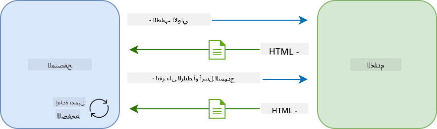
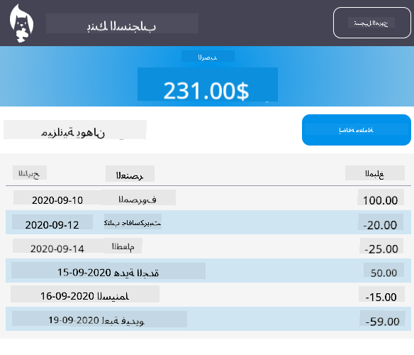

<!--
CO_OP_TRANSLATOR_METADATA:
{
  "original_hash": "f587e913e3f7c0b1c549a05dd74ee8e5",
  "translation_date": "2025-08-26T00:18:42+00:00",
  "source_file": "7-bank-project/3-data/README.md",
  "language_code": "ar"
}
-->
# بناء تطبيق مصرفي الجزء 3: طرق جلب واستخدام البيانات

## اختبار ما قبل المحاضرة

[اختبار ما قبل المحاضرة](https://ff-quizzes.netlify.app/web/quiz/45)

### المقدمة

في جوهر كل تطبيق ويب توجد *البيانات*. يمكن أن تأخذ البيانات أشكالًا متعددة، ولكن الغرض الرئيسي منها دائمًا هو عرض المعلومات للمستخدم. مع تزايد تفاعلية وتعقيد تطبيقات الويب، أصبحت كيفية وصول المستخدم إلى المعلومات والتفاعل معها جزءًا أساسيًا من تطوير الويب.

في هذا الدرس، سنتعلم كيفية جلب البيانات من الخادم بشكل غير متزامن، واستخدام هذه البيانات لعرض المعلومات على صفحة ويب دون إعادة تحميل HTML.

### المتطلبات الأساسية

يجب أن تكون قد أنشأت [نموذج تسجيل الدخول والتسجيل](../2-forms/README.md) كجزء من تطبيق الويب لهذا الدرس. كما تحتاج إلى تثبيت [Node.js](https://nodejs.org) وتشغيل [واجهة برمجة التطبيقات للخادم](../api/README.md) محليًا للحصول على بيانات الحساب.

يمكنك اختبار ما إذا كان الخادم يعمل بشكل صحيح عن طريق تنفيذ هذا الأمر في الطرفية:

```sh
curl http://localhost:5000/api
# -> should return "Bank API v1.0.0" as a result
```

---

## AJAX وجلب البيانات

تقوم مواقع الويب التقليدية بتحديث المحتوى المعروض عندما يختار المستخدم رابطًا أو يرسل بيانات باستخدام نموذج، عن طريق إعادة تحميل صفحة HTML بالكامل. في كل مرة تحتاج إلى تحميل بيانات جديدة، يقوم خادم الويب بإرجاع صفحة HTML جديدة تمامًا تحتاج إلى معالجتها بواسطة المتصفح، مما يقطع الإجراء الحالي للمستخدم ويحد من التفاعلات أثناء إعادة التحميل. يُطلق على هذا التدفق أيضًا اسم *تطبيق متعدد الصفحات* أو *MPA*.



عندما بدأت تطبيقات الويب تصبح أكثر تعقيدًا وتفاعلية، ظهرت تقنية جديدة تُسمى [AJAX (JavaScript غير المتزامن وXML)](https://en.wikipedia.org/wiki/Ajax_(programming)). تتيح هذه التقنية لتطبيقات الويب إرسال واسترجاع البيانات من الخادم بشكل غير متزامن باستخدام JavaScript، دون الحاجة إلى إعادة تحميل صفحة HTML، مما يؤدي إلى تحديثات أسرع وتفاعلات أكثر سلاسة. عند استلام بيانات جديدة من الخادم، يمكن أيضًا تحديث صفحة HTML الحالية باستخدام واجهة برمجة التطبيقات [DOM](https://developer.mozilla.org/docs/Web/API/Document_Object_Model). مع مرور الوقت، تطورت هذه الطريقة إلى ما يُعرف الآن باسم [*تطبيق الصفحة الواحدة* أو *SPA*](https://en.wikipedia.org/wiki/Single-page_application).


عندما تم تقديم AJAX لأول مرة، كانت واجهة برمجة التطبيقات الوحيدة المتاحة لجلب البيانات بشكل غير متزامن هي [`XMLHttpRequest`](https://developer.mozilla.org/docs/Web/API/XMLHttpRequest/Using_XMLHttpRequest). ولكن المتصفحات الحديثة تدعم الآن واجهة برمجة التطبيقات الأكثر ملاءمة وقوة [`Fetch API`](https://developer.mozilla.org/docs/Web/API/Fetch_API)، التي تستخدم الوعود (Promises) وتناسب بشكل أفضل التعامل مع بيانات JSON.

> على الرغم من أن جميع المتصفحات الحديثة تدعم `Fetch API`، إذا كنت تريد أن يعمل تطبيق الويب الخاص بك على المتصفحات القديمة، فمن الجيد دائمًا التحقق من [جدول التوافق على caniuse.com](https://caniuse.com/fetch) أولاً.

### المهمة

في [الدرس السابق](../2-forms/README.md) قمنا بتنفيذ نموذج التسجيل لإنشاء حساب. الآن سنضيف كودًا لتسجيل الدخول باستخدام حساب موجود، وجلب بياناته. افتح ملف `app.js` وأضف وظيفة `login` جديدة:

```js
async function login() {
  const loginForm = document.getElementById('loginForm')
  const user = loginForm.user.value;
}
```

نبدأ هنا باسترجاع عنصر النموذج باستخدام `getElementById()`، ثم نحصل على اسم المستخدم من الإدخال باستخدام `loginForm.user.value`. يمكن الوصول إلى كل عنصر تحكم في النموذج من خلال اسمه (المحدد في HTML باستخدام خاصية `name`) كخاصية للنموذج.

على غرار ما فعلناه للتسجيل، سننشئ وظيفة أخرى لإجراء طلب إلى الخادم، ولكن هذه المرة لاسترجاع بيانات الحساب:

```js
async function getAccount(user) {
  try {
    const response = await fetch('//localhost:5000/api/accounts/' + encodeURIComponent(user));
    return await response.json();
  } catch (error) {
    return { error: error.message || 'Unknown error' };
  }
}
```

نستخدم واجهة `fetch` لجلب البيانات بشكل غير متزامن من الخادم، ولكن هذه المرة لا نحتاج إلى أي معلمات إضافية بخلاف عنوان URL، حيث إننا نستعلم فقط عن البيانات. بشكل افتراضي، ينشئ `fetch` طلب HTTP من النوع [`GET`](https://developer.mozilla.org/docs/Web/HTTP/Methods/GET)، وهو ما نحتاجه هنا.

✅ `encodeURIComponent()` هي وظيفة تقوم بترميز الأحرف الخاصة لعناوين URL. ما هي المشكلات التي قد نواجهها إذا لم نستدعِ هذه الوظيفة واستخدمنا قيمة `user` مباشرة في عنوان URL؟

الآن لنقم بتحديث وظيفة `login` لاستخدام `getAccount`:

```js
async function login() {
  const loginForm = document.getElementById('loginForm')
  const user = loginForm.user.value;
  const data = await getAccount(user);

  if (data.error) {
    return console.log('loginError', data.error);
  }

  account = data;
  navigate('/dashboard');
}
```

أولاً، بما أن `getAccount` هي وظيفة غير متزامنة، نحتاج إلى استخدام الكلمة المفتاحية `await` لانتظار نتيجة الخادم. كما هو الحال مع أي طلب إلى الخادم، علينا أيضًا التعامل مع حالات الخطأ. في الوقت الحالي، سنضيف فقط رسالة سجل لعرض الخطأ، وسنعود إليها لاحقًا.

ثم علينا تخزين البيانات في مكان ما حتى نتمكن من استخدامها لاحقًا لعرض معلومات لوحة التحكم. بما أن المتغير `account` غير موجود بعد، سننشئ متغيرًا عامًا له في أعلى ملفنا:

```js
let account = null;
```

بعد حفظ بيانات المستخدم في متغير، يمكننا الانتقال من صفحة *تسجيل الدخول* إلى *لوحة التحكم* باستخدام وظيفة `navigate()` التي لدينا بالفعل.

أخيرًا، نحتاج إلى استدعاء وظيفة `login` عند إرسال نموذج تسجيل الدخول، عن طريق تعديل HTML:

```html
<form id="loginForm" action="javascript:login()">
```

اختبر أن كل شيء يعمل بشكل صحيح عن طريق تسجيل حساب جديد ومحاولة تسجيل الدخول باستخدام نفس الحساب.

قبل الانتقال إلى الجزء التالي، يمكننا أيضًا إكمال وظيفة `register` بإضافة هذا في نهاية الوظيفة:

```js
account = result;
navigate('/dashboard');
```

✅ هل تعلم أنه بشكل افتراضي، يمكنك فقط استدعاء واجهات برمجة التطبيقات للخادم من *نفس النطاق والمنفذ* الذي تشاهد منه صفحة الويب؟ هذا هو آلية الأمان التي تفرضها المتصفحات. ولكن انتظر، تطبيق الويب الخاص بنا يعمل على `localhost:3000` بينما واجهة برمجة التطبيقات للخادم تعمل على `localhost:5000`، لماذا يعمل ذلك؟ باستخدام تقنية تُسمى [مشاركة الموارد عبر المصادر (CORS)](https://developer.mozilla.org/docs/Web/HTTP/CORS)، يمكن إجراء طلبات HTTP عبر المصادر إذا أضاف الخادم رؤوسًا خاصة إلى الاستجابة، مما يسمح باستثناءات لنطاقات محددة.

> تعرف على المزيد حول واجهات برمجة التطبيقات من خلال أخذ [هذا الدرس](https://docs.microsoft.com/learn/modules/use-apis-discover-museum-art/?WT.mc_id=academic-77807-sagibbon)

## تحديث HTML لعرض البيانات

الآن بعد أن حصلنا على بيانات المستخدم، علينا تحديث HTML الحالي لعرضها. نحن نعرف بالفعل كيفية استرجاع عنصر من DOM باستخدام مثلاً `document.getElementById()`. بعد الحصول على عنصر أساسي، هنا بعض واجهات برمجة التطبيقات التي يمكنك استخدامها لتعديله أو إضافة عناصر فرعية له:

- باستخدام خاصية [`textContent`](https://developer.mozilla.org/docs/Web/API/Node/textContent) يمكنك تغيير نص العنصر. لاحظ أن تغيير هذه القيمة يزيل جميع العناصر الفرعية للعنصر (إذا كانت موجودة) ويستبدلها بالنص المقدم. وبالتالي، فهي أيضًا طريقة فعالة لإزالة جميع العناصر الفرعية لعنصر معين عن طريق تعيين سلسلة فارغة `''` له.

- باستخدام [`document.createElement()`](https://developer.mozilla.org/docs/Web/API/Document/createElement) مع طريقة [`append()`](https://developer.mozilla.org/docs/Web/API/ParentNode/append) يمكنك إنشاء وإرفاق عنصر أو أكثر كعناصر فرعية جديدة.

✅ باستخدام خاصية [`innerHTML`](https://developer.mozilla.org/docs/Web/API/Element/innerHTML) للعنصر، من الممكن أيضًا تغيير محتويات HTML الخاصة به، ولكن يجب تجنب ذلك لأنها عرضة لهجمات [XSS](https://developer.mozilla.org/docs/Glossary/Cross-site_scripting).

### المهمة

قبل الانتقال إلى شاشة لوحة التحكم، هناك شيء آخر يجب أن نقوم به في صفحة *تسجيل الدخول*. حاليًا، إذا حاولت تسجيل الدخول باستخدام اسم مستخدم غير موجود، تظهر رسالة في وحدة التحكم ولكن بالنسبة للمستخدم العادي لا يتغير شيء ولا يعرف ما الذي يحدث.

لنضف عنصرًا نائبًا في نموذج تسجيل الدخول حيث يمكننا عرض رسالة خطأ إذا لزم الأمر. مكان جيد سيكون قبل زر `<button>` الخاص بتسجيل الدخول:

```html
...
<div id="loginError"></div>
<button>Login</button>
...
```

هذا العنصر `<div>` فارغ، مما يعني أنه لن يتم عرض أي شيء على الشاشة حتى نضيف محتوى له. كما نعطيه `id` حتى نتمكن من استرجاعه بسهولة باستخدام JavaScript.

ارجع إلى ملف `app.js` وأنشئ وظيفة مساعدة جديدة `updateElement`:

```js
function updateElement(id, text) {
  const element = document.getElementById(id);
  element.textContent = text;
}
```

هذه الوظيفة بسيطة جدًا: بالنظر إلى *معرف العنصر* و*النص*، ستقوم بتحديث محتوى النص الخاص بعنصر DOM الذي يتطابق مع `id`. لنستخدم هذه الطريقة بدلاً من رسالة الخطأ السابقة في وظيفة `login`:

```js
if (data.error) {
  return updateElement('loginError', data.error);
}
```

الآن إذا حاولت تسجيل الدخول باستخدام حساب غير صالح، يجب أن ترى شيئًا مثل هذا:


الآن لدينا نص خطأ يظهر بصريًا، ولكن إذا جربته باستخدام قارئ شاشة ستلاحظ أنه لا يتم الإعلان عن أي شيء. لكي يتم الإعلان عن النص الذي يتم إضافته ديناميكيًا إلى الصفحة بواسطة قارئات الشاشة، يجب أن يستخدم شيئًا يسمى [منطقة حية (Live Region)](https://developer.mozilla.org/docs/Web/Accessibility/ARIA/ARIA_Live_Regions). هنا سنستخدم نوعًا معينًا من المناطق الحية يسمى تنبيه:

```html
<div id="loginError" role="alert"></div>
```

قم بتنفيذ نفس السلوك لأخطاء وظيفة `register` (لا تنسَ تحديث HTML).

## عرض المعلومات على لوحة التحكم

باستخدام نفس التقنيات التي رأيناها للتو، سنتولى أيضًا عرض معلومات الحساب على صفحة لوحة التحكم.

هذا هو شكل كائن الحساب الذي يتم استلامه من الخادم:

```json
{
  "user": "test",
  "currency": "$",
  "description": "Test account",
  "balance": 75,
  "transactions": [
    { "id": "1", "date": "2020-10-01", "object": "Pocket money", "amount": 50 },
    { "id": "2", "date": "2020-10-03", "object": "Book", "amount": -10 },
    { "id": "3", "date": "2020-10-04", "object": "Sandwich", "amount": -5 }
  ],
}
```

> ملاحظة: لتسهيل حياتك، يمكنك استخدام حساب `test` الموجود مسبقًا والمليء بالبيانات.

### المهمة

لنبدأ باستبدال قسم "الرصيد" في HTML لإضافة عناصر نائبة:

```html
<section>
  Balance: <span id="balance"></span><span id="currency"></span>
</section>
```

سنضيف أيضًا قسمًا جديدًا أسفل ذلك لعرض وصف الحساب:

```html
<h2 id="description"></h2>
```

✅ بما أن وصف الحساب يعمل كعنوان للمحتوى الموجود تحته، يتم ترميزه دلاليًا كعنوان. تعرف على المزيد حول كيفية أهمية [هيكل العناوين](https://www.nomensa.com/blog/2017/how-structure-headings-web-accessibility) لإمكانية الوصول، وألقِ نظرة نقدية على الصفحة لتحديد ما يمكن أن يكون عنوانًا أيضًا.

بعد ذلك، سننشئ وظيفة جديدة في `app.js` لملء العناصر النائبة:

```js
function updateDashboard() {
  if (!account) {
    return navigate('/login');
  }

  updateElement('description', account.description);
  updateElement('balance', account.balance.toFixed(2));
  updateElement('currency', account.currency);
}
```

أولاً، نتحقق من أن لدينا بيانات الحساب التي نحتاجها قبل المتابعة. ثم نستخدم وظيفة `updateElement()` التي أنشأناها سابقًا لتحديث HTML.

> لجعل عرض الرصيد أكثر جمالية، نستخدم الطريقة [`toFixed(2)`](https://developer.mozilla.org/docs/Web/JavaScript/Reference/Global_Objects/Number/toFixed) لعرض القيمة مع رقمين عشريين بعد النقطة.

الآن نحتاج إلى استدعاء وظيفة `updateDashboard()` الخاصة بنا في كل مرة يتم فيها تحميل لوحة التحكم. إذا كنت قد أكملت [مهمة الدرس الأول](../1-template-route/assignment.md) بالفعل، يجب أن يكون هذا بسيطًا، وإلا يمكنك استخدام التنفيذ التالي.

أضف هذا الكود إلى نهاية وظيفة `updateRoute()`:

```js
if (typeof route.init === 'function') {
  route.init();
}
```

وقم بتحديث تعريفات المسارات باستخدام:

```js
const routes = {
  '/login': { templateId: 'login' },
  '/dashboard': { templateId: 'dashboard', init: updateDashboard }
};
```

مع هذا التغيير، في كل مرة يتم فيها عرض صفحة لوحة التحكم، يتم استدعاء وظيفة `updateDashboard()`. بعد تسجيل الدخول، يجب أن تكون قادرًا على رؤية الرصيد، العملة والوصف الخاص بالحساب.

## إنشاء صفوف الجدول ديناميكيًا باستخدام قوالب HTML

في [الدرس الأول](../1-template-route/README.md) استخدمنا قوالب HTML مع طريقة [`appendChild()`](https://developer.mozilla.org/docs/Web/API/Node/appendChild) لتنفيذ التنقل في تطبيقنا. يمكن أن تكون القوالب أصغر وتُستخدم أيضًا لملء الأجزاء المتكررة من الصفحة ديناميكيًا.

سنستخدم نهجًا مشابهًا لعرض قائمة المعاملات في جدول HTML.

### المهمة

أضف قالبًا جديدًا في `<body>` الخاص بـ HTML:

```html
<template id="transaction">
  <tr>
    <td></td>
    <td></td>
    <td></td>
  </tr>
</template>
```

يمثل هذا القالب صفًا واحدًا في الجدول، مع الأعمدة الثلاثة التي نريد ملؤها: *التاريخ*، *العنصر* و*المبلغ* للمعاملة.

ثم، أضف خاصية `id` إلى عنصر `<tbody>` الخاص بالجدول داخل قالب لوحة التحكم لجعل العثور عليه أسهل باستخدام JavaScript:

```html
<tbody id="transactions"></tbody>
```

HTML الخاص بنا جاهز، لننتقل إلى كود JavaScript وننشئ وظيفة جديدة `createTransactionRow`:

```js
function createTransactionRow(transaction) {
  const template = document.getElementById('transaction');
  const transactionRow = template.content.cloneNode(true);
  const tr = transactionRow.querySelector('tr');
  tr.children[0].textContent = transaction.date;
  tr.children[1].textContent = transaction.object;
  tr.children[2].textContent = transaction.amount.toFixed(2);
  return transactionRow;
}
```

تقوم هذه الوظيفة بما يوحي به اسمها: باستخدام القالب الذي أنشأناه سابقًا، تقوم بإنشاء صف جدول جديد وتملأ محتوياته باستخدام بيانات المعاملة. سنستخدم هذا في وظيفة `updateDashboard()` لملء الجدول:

```js
const transactionsRows = document.createDocumentFragment();
for (const transaction of account.transactions) {
  const transactionRow = createTransactionRow(transaction);
  transactionsRows.appendChild(transactionRow);
}
updateElement('transactions', transactionsRows);
```

هنا نستخدم الطريقة [`document.createDocumentFragment()`](https://developer.mozilla.org/docs/Web/API/Document/createDocumentFragment) التي تنشئ جزءًا جديدًا من DOM يمكننا العمل عليه، قبل إرفاقه أخيرًا بجدول HTML الخاص بنا.

لا يزال هناك شيء واحد علينا القيام به قبل أن يعمل هذا الكود، حيث إن وظيفة `updateElement()` الخاصة بنا تدعم حاليًا محتوى النص فقط. لنقم بتغيير كودها قليلاً:

```js
function updateElement(id, textOrNode) {
  const element = document.getElementById(id);
  element.textContent = ''; // Removes all children
  element.append(textOrNode);
}
```

نستخدم طريقة [`append()`](https://developer.mozilla.org/docs/Web/API/ParentNode/append) لأنها تتيح إرفاق نص أو [عقد DOM](https://developer.mozilla.org/docs/Web/API/Node) إلى عنصر رئيسي، وهو ما يناسب جميع حالات الاستخدام الخاصة بنا.
إذا حاولت استخدام حساب `test` لتسجيل الدخول، يجب أن ترى الآن قائمة المعاملات على لوحة التحكم 🎉.

---

## 🚀 التحدي

اعملوا معًا لجعل صفحة لوحة التحكم تبدو كأنها تطبيق مصرفي حقيقي. إذا كنت قد قمت بالفعل بتنسيق تطبيقك، حاول استخدام [media queries](https://developer.mozilla.org/docs/Web/CSS/Media_Queries) لإنشاء [تصميم متجاوب](https://developer.mozilla.org/docs/Web/Progressive_web_apps/Responsive/responsive_design_building_blocks) يعمل بشكل جيد على كل من أجهزة الكمبيوتر المكتبية والأجهزة المحمولة.

إليك مثال على صفحة لوحة تحكم منسقة:



## اختبار ما بعد المحاضرة

[اختبار ما بعد المحاضرة](https://ff-quizzes.netlify.app/web/quiz/46)

## الواجب

[إعادة هيكلة وتعليق الكود الخاص بك](assignment.md)

**إخلاء المسؤولية**:  
تم ترجمة هذا المستند باستخدام خدمة الترجمة بالذكاء الاصطناعي [Co-op Translator](https://github.com/Azure/co-op-translator). بينما نسعى لتحقيق الدقة، يرجى العلم أن الترجمات الآلية قد تحتوي على أخطاء أو معلومات غير دقيقة. يجب اعتبار المستند الأصلي بلغته الأصلية المصدر الرسمي. للحصول على معلومات حاسمة، يُوصى بالاستعانة بترجمة بشرية احترافية. نحن غير مسؤولين عن أي سوء فهم أو تفسيرات خاطئة تنشأ عن استخدام هذه الترجمة.