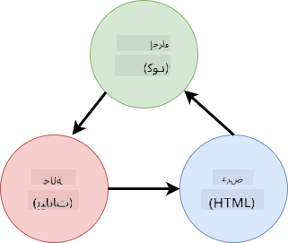

<!--
CO_OP_TRANSLATOR_METADATA:
{
  "original_hash": "923d32d2c405b709ef18e20d096f4200",
  "translation_date": "2025-10-20T20:36:48+00:00",
  "source_file": "7-bank-project/4-state-management/README.md",
  "language_code": "ar"
}
-->
# بناء تطبيق مصرفي الجزء الرابع: مفاهيم إدارة الحالة

## اختبار ما قبل المحاضرة

[اختبار ما قبل المحاضرة](https://ff-quizzes.netlify.app/web/quiz/47)

### المقدمة

مع نمو تطبيقات الويب، يصبح من الصعب تتبع تدفقات البيانات. أي كود يحصل على البيانات، أي صفحة تستهلكها، أين ومتى تحتاج إلى التحديث... من السهل أن ينتهي بك الأمر بكود فوضوي يصعب صيانته. هذا صحيح بشكل خاص عندما تحتاج إلى مشاركة البيانات بين صفحات مختلفة في تطبيقك، مثل بيانات المستخدم. مفهوم *إدارة الحالة* كان موجودًا دائمًا في جميع أنواع البرامج، ولكن مع استمرار نمو تطبيقات الويب في التعقيد أصبح الآن نقطة رئيسية يجب التفكير فيها أثناء التطوير.

في هذا الجزء الأخير، سنراجع التطبيق الذي قمنا ببنائه لإعادة التفكير في كيفية إدارة الحالة، مما يسمح بدعم تحديث المتصفح في أي وقت، والحفاظ على البيانات عبر جلسات المستخدم.

### المتطلبات الأساسية

يجب أن تكون قد أكملت جزء [جلب البيانات](../3-data/README.md) من تطبيق الويب لهذه الدرس. تحتاج أيضًا إلى تثبيت [Node.js](https://nodejs.org) و[تشغيل واجهة برمجة التطبيقات للخادم](../api/README.md) محليًا حتى تتمكن من إدارة بيانات الحساب.

يمكنك اختبار أن الخادم يعمل بشكل صحيح عن طريق تنفيذ هذا الأمر في الطرفية:

```sh
curl http://localhost:5000/api
# -> should return "Bank API v1.0.0" as a result
```

---

## إعادة التفكير في إدارة الحالة

في [الدرس السابق](../3-data/README.md)، قدمنا مفهومًا أساسيًا للحالة في تطبيقنا باستخدام المتغير العام `account` الذي يحتوي على بيانات البنك للمستخدم الذي قام بتسجيل الدخول حاليًا. ومع ذلك، فإن التنفيذ الحالي لدينا به بعض العيوب. حاول تحديث الصفحة عندما تكون في لوحة التحكم. ماذا يحدث؟

هناك 3 مشاكل في الكود الحالي:

- الحالة غير محفوظة، حيث يؤدي تحديث المتصفح إلى إعادتك إلى صفحة تسجيل الدخول.
- هناك وظائف متعددة تعدل الحالة. ومع نمو التطبيق، قد يصبح من الصعب تتبع التغييرات ومن السهل نسيان تحديث واحدة.
- الحالة غير مُنظفة، لذا عندما تنقر على *تسجيل الخروج* تبقى بيانات الحساب موجودة حتى وأنت في صفحة تسجيل الدخول.

يمكننا تحديث الكود لمعالجة هذه المشكلات واحدة تلو الأخرى، ولكن ذلك سيؤدي إلى تكرار الكود وجعل التطبيق أكثر تعقيدًا وصعوبة في الصيانة. أو يمكننا التوقف لبضع دقائق وإعادة التفكير في استراتيجيتنا.

> ما هي المشاكل التي نحاول حلها هنا؟

[إدارة الحالة](https://en.wikipedia.org/wiki/State_management) تتعلق بإيجاد نهج جيد لحل هاتين المشكلتين بالتحديد:

- كيف يمكن الحفاظ على تدفقات البيانات في التطبيق بشكل مفهوم؟
- كيف يمكن الحفاظ على بيانات الحالة دائمًا متزامنة مع واجهة المستخدم (والعكس صحيح)؟

بمجرد أن تعتني بهذه الأمور، قد يتم حل أي مشاكل أخرى قد تواجهها بالفعل أو تصبح أسهل في الحل. هناك العديد من النهج الممكنة لحل هذه المشاكل، لكننا سنختار حلاً شائعًا يتكون من **مركزية البيانات وطرق تغييرها**. ستتدفق البيانات على النحو التالي:



> لن نغطي هنا الجزء الذي يتم فيه تحديث العرض تلقائيًا بواسطة البيانات، حيث يرتبط بمفاهيم أكثر تقدمًا في [البرمجة التفاعلية](https://en.wikipedia.org/wiki/Reactive_programming). إنه موضوع متابعة جيد إذا كنت ترغب في التعمق.

✅ هناك العديد من المكتبات التي تقدم نهجًا مختلفًا لإدارة الحالة، مثل [Redux](https://redux.js.org) الذي يعتبر خيارًا شائعًا. ألقِ نظرة على المفاهيم والأنماط المستخدمة حيث إنها غالبًا ما تكون طريقة جيدة لتعلم المشكلات المحتملة التي قد تواجهها في تطبيقات الويب الكبيرة وكيف يمكن حلها.

### المهمة

سنبدأ ببعض إعادة الهيكلة. استبدل تعريف `account` بـ:

```js
let account = null;
```

بـ:

```js
let state = {
  account: null
};
```

الفكرة هي *مركزية* جميع بيانات التطبيق في كائن حالة واحد. لدينا فقط `account` في الحالة الآن لذا لا يتغير الكثير، ولكنه يخلق مسارًا للتطورات.

علينا أيضًا تحديث الوظائف التي تستخدمه. في وظائف `register()` و`login()`، استبدل `account = ...` بـ `state.account = ...`;

في بداية وظيفة `updateDashboard()`، أضف هذا السطر:

```js
const account = state.account;
```

لم تجلب هذه إعادة الهيكلة تحسينات كبيرة بحد ذاتها، ولكن الفكرة كانت وضع الأساس للتغييرات القادمة.

## تتبع تغييرات البيانات

الآن بعد أن وضعنا كائن `state` لتخزين بياناتنا، فإن الخطوة التالية هي مركزية التحديثات. الهدف هو تسهيل تتبع أي تغييرات ومتى تحدث.

لتجنب إجراء تغييرات على كائن `state`، من الجيد أيضًا اعتباره [*غير قابل للتغيير*](https://en.wikipedia.org/wiki/Immutable_object)، مما يعني أنه لا يمكن تعديله على الإطلاق. كما يعني أنه يجب عليك إنشاء كائن حالة جديد إذا كنت تريد تغيير أي شيء فيه. من خلال القيام بذلك، تبني حماية ضد [الآثار الجانبية غير المرغوب فيها](https://en.wikipedia.org/wiki/Side_effect_(computer_science))، وتفتح إمكانيات لميزات جديدة في تطبيقك مثل تنفيذ التراجع/الإعادة، مع تسهيل عملية تصحيح الأخطاء. على سبيل المثال، يمكنك تسجيل كل تغيير يتم إجراؤه على الحالة والاحتفاظ بسجل للتغييرات لفهم مصدر الخطأ.

في JavaScript، يمكنك استخدام [`Object.freeze()`](https://developer.mozilla.org/docs/Web/JavaScript/Reference/Global_Objects/Object/freeze) لإنشاء نسخة غير قابلة للتغيير من الكائن. إذا حاولت إجراء تغييرات على كائن غير قابل للتغيير، فسيتم رفع استثناء.

✅ هل تعرف الفرق بين الكائن غير القابل للتغيير *السطحي* و*العميق*؟ يمكنك قراءة المزيد عنه [هنا](https://developer.mozilla.org/docs/Web/JavaScript/Reference/Global_Objects/Object/freeze#What_is_shallow_freeze).

### المهمة

لنقم بإنشاء وظيفة جديدة `updateState()`:

```js
function updateState(property, newData) {
  state = Object.freeze({
    ...state,
    [property]: newData
  });
}
```

في هذه الوظيفة، نقوم بإنشاء كائن حالة جديد ونسخ البيانات من الحالة السابقة باستخدام [عامل الانتشار (`...`)](https://developer.mozilla.org/docs/Web/JavaScript/Reference/Operators/Spread_syntax#Spread_in_object_literals). ثم نقوم بتجاوز خاصية معينة من كائن الحالة بالبيانات الجديدة باستخدام [صيغة الأقواس](https://developer.mozilla.org/docs/Web/JavaScript/Guide/Working_with_Objects#Objects_and_properties) `[property]` للتعيين. وأخيرًا، نقوم بتجميد الكائن لمنع التعديلات باستخدام `Object.freeze()`. لدينا فقط خاصية `account` مخزنة في الحالة الآن، ولكن مع هذا النهج يمكنك إضافة العديد من الخصائص كما تحتاج في الحالة.

سنقوم أيضًا بتحديث تهيئة `state` للتأكد من أن الحالة الأولية مجمدة أيضًا:

```js
let state = Object.freeze({
  account: null
});
```

بعد ذلك، قم بتحديث وظيفة `register` عن طريق استبدال التعيين `state.account = result;` بـ:

```js
updateState('account', result);
```

افعل الشيء نفسه مع وظيفة `login`، استبدل `state.account = data;` بـ:

```js
updateState('account', data);
```

سنستغل هذه الفرصة لإصلاح مشكلة عدم تنظيف بيانات الحساب عندما ينقر المستخدم على *تسجيل الخروج*.

قم بإنشاء وظيفة جديدة `logout()`:

```js
function logout() {
  updateState('account', null);
  navigate('/login');
}
```

في `updateDashboard()`، استبدل إعادة التوجيه `return navigate('/login');` بـ `return logout()`;

حاول تسجيل حساب جديد، تسجيل الخروج ثم تسجيل الدخول مرة أخرى للتحقق من أن كل شيء لا يزال يعمل بشكل صحيح.

> نصيحة: يمكنك الاطلاع على جميع تغييرات الحالة عن طريق إضافة `console.log(state)` في أسفل `updateState()` وفتح وحدة التحكم في أدوات تطوير المتصفح.

## الحفاظ على الحالة

تحتاج معظم تطبيقات الويب إلى الحفاظ على البيانات لتتمكن من العمل بشكل صحيح. يتم عادةً تخزين جميع البيانات الحرجة في قاعدة بيانات ويتم الوصول إليها عبر واجهة برمجة التطبيقات للخادم، مثل بيانات حساب المستخدم في حالتنا. ولكن في بعض الأحيان، من المثير للاهتمام أيضًا الحفاظ على بعض البيانات في تطبيق العميل الذي يعمل في متصفحك، لتحسين تجربة المستخدم أو لتحسين أداء التحميل.

عندما تريد الحفاظ على البيانات في متصفحك، هناك بعض الأسئلة المهمة التي يجب أن تسألها لنفسك:

- *هل البيانات حساسة؟* يجب تجنب تخزين أي بيانات حساسة على العميل، مثل كلمات مرور المستخدم.
- *إلى متى تحتاج إلى الاحتفاظ بهذه البيانات؟* هل تخطط للوصول إلى هذه البيانات فقط للجلسة الحالية أم تريد أن يتم تخزينها إلى الأبد؟

هناك طرق متعددة لتخزين المعلومات داخل تطبيق ويب، اعتمادًا على ما تريد تحقيقه. على سبيل المثال، يمكنك استخدام عناوين URL لتخزين استعلام البحث، وجعله قابلاً للمشاركة بين المستخدمين. يمكنك أيضًا استخدام [ملفات تعريف الارتباط HTTP](https://developer.mozilla.org/docs/Web/HTTP/Cookies) إذا كانت البيانات تحتاج إلى المشاركة مع الخادم، مثل معلومات [المصادقة](https://en.wikipedia.org/wiki/Authentication).

خيار آخر هو استخدام واحدة من العديد من واجهات برمجة التطبيقات للمتصفح لتخزين البيانات. اثنتان منها مثيرتان للاهتمام بشكل خاص:

- [`localStorage`](https://developer.mozilla.org/docs/Web/API/Window/localStorage): مخزن [مفتاح/قيمة](https://en.wikipedia.org/wiki/Key%E2%80%93value_database) يسمح بالحفاظ على البيانات الخاصة بموقع الويب الحالي عبر جلسات مختلفة. البيانات المحفوظة فيه لا تنتهي صلاحيتها أبدًا.
- [`sessionStorage`](https://developer.mozilla.org/docs/Web/API/Window/sessionStorage): يعمل هذا بنفس طريقة `localStorage` باستثناء أن البيانات المخزنة فيه يتم مسحها عند انتهاء الجلسة (عند إغلاق المتصفح).

لاحظ أن كلا واجهتي برمجة التطبيقات تسمح فقط بتخزين [النصوص](https://developer.mozilla.org/docs/Web/JavaScript/Reference/Global_Objects/String). إذا كنت تريد تخزين كائنات معقدة، ستحتاج إلى تسلسلها إلى صيغة [JSON](https://developer.mozilla.org/docs/Web/JavaScript/Reference/Global_Objects/JSON) باستخدام [`JSON.stringify()`](https://developer.mozilla.org/docs/Web/JavaScript/Reference/Global_Objects/JSON/stringify).

✅ إذا كنت تريد إنشاء تطبيق ويب لا يعمل مع خادم، فمن الممكن أيضًا إنشاء قاعدة بيانات على العميل باستخدام واجهة برمجة التطبيقات [`IndexedDB`](https://developer.mozilla.org/docs/Web/API/IndexedDB_API). هذا مخصص لحالات الاستخدام المتقدمة أو إذا كنت بحاجة إلى تخزين كمية كبيرة من البيانات، حيث إنه أكثر تعقيدًا في الاستخدام.

### المهمة

نريد أن يبقى مستخدمونا مسجلين الدخول حتى ينقروا صراحةً على زر *تسجيل الخروج*، لذا سنستخدم `localStorage` لتخزين بيانات الحساب. أولاً، دعنا نحدد مفتاحًا سنستخدمه لتخزين بياناتنا.

```js
const storageKey = 'savedAccount';
```

ثم أضف هذا السطر في نهاية وظيفة `updateState()`:

```js
localStorage.setItem(storageKey, JSON.stringify(state.account));
```

بهذا، سيتم الحفاظ على بيانات حساب المستخدم وتحديثها دائمًا كما قمنا بمركزية جميع تحديثات الحالة سابقًا. هذا هو المكان الذي نبدأ فيه الاستفادة من جميع عمليات إعادة الهيكلة السابقة 🙂.

نظرًا لأن البيانات محفوظة، علينا أيضًا أن نهتم باستعادتها عند تحميل التطبيق. نظرًا لأننا سنبدأ في الحصول على المزيد من كود التهيئة، قد يكون من الجيد إنشاء وظيفة جديدة `init`، والتي تتضمن أيضًا الكود السابق في أسفل `app.js`:

```js
function init() {
  const savedAccount = localStorage.getItem(storageKey);
  if (savedAccount) {
    updateState('account', JSON.parse(savedAccount));
  }

  // Our previous initialization code
  window.onpopstate = () => updateRoute();
  updateRoute();
}

init();
```

هنا نسترجع البيانات المحفوظة، وإذا كان هناك أي بيانات نقوم بتحديث الحالة وفقًا لذلك. من المهم القيام بذلك *قبل* تحديث المسار، حيث قد يكون هناك كود يعتمد على الحالة أثناء تحديث الصفحة.

يمكننا أيضًا جعل صفحة *لوحة التحكم* الصفحة الافتراضية لتطبيقنا، حيث إننا نحافظ الآن على بيانات الحساب. إذا لم يتم العثور على أي بيانات، فإن لوحة التحكم تتولى إعادة التوجيه إلى صفحة *تسجيل الدخول* على أي حال. في `updateRoute()`، استبدل الخيار الافتراضي `return navigate('/login');` بـ `return navigate('/dashboard');`.

الآن قم بتسجيل الدخول إلى التطبيق وحاول تحديث الصفحة. يجب أن تبقى في لوحة التحكم. مع هذا التحديث، قمنا بمعالجة جميع مشاكلنا الأولية...

## تحديث البيانات

...لكن قد نكون قد أنشأنا مشكلة جديدة. أوه!

انتقل إلى لوحة التحكم باستخدام حساب `test`، ثم قم بتشغيل هذا الأمر في الطرفية لإنشاء معاملة جديدة:

```sh
curl --request POST \
     --header "Content-Type: application/json" \
     --data "{ \"date\": \"2020-07-24\", \"object\": \"Bought book\", \"amount\": -20 }" \
     http://localhost:5000/api/accounts/test/transactions
```

حاول تحديث صفحة لوحة التحكم في المتصفح الآن. ماذا يحدث؟ هل ترى المعاملة الجديدة؟

الحالة محفوظة إلى أجل غير مسمى بفضل `localStorage`، ولكن هذا يعني أيضًا أنها لا يتم تحديثها أبدًا حتى تقوم بتسجيل الخروج من التطبيق وتسجيل الدخول مرة أخرى!

إحدى الاستراتيجيات الممكنة لحل ذلك هي إعادة تحميل بيانات الحساب في كل مرة يتم فيها تحميل لوحة التحكم، لتجنب البيانات القديمة.

### المهمة

قم بإنشاء وظيفة جديدة `updateAccountData`:

```js
async function updateAccountData() {
  const account = state.account;
  if (!account) {
    return logout();
  }

  const data = await getAccount(account.user);
  if (data.error) {
    return logout();
  }

  updateState('account', data);
}
```

تتحقق هذه الطريقة من أننا مسجلون الدخول حاليًا ثم تعيد تحميل بيانات الحساب من الخادم.

قم بإنشاء وظيفة أخرى باسم `refresh`:

```js
async function refresh() {
  await updateAccountData();
  updateDashboard();
}
```

تقوم هذه الوظيفة بتحديث بيانات الحساب، ثم تهتم بتحديث HTML الخاص بصفحة لوحة التحكم. هذا ما نحتاج إلى استدعائه عند تحميل مسار لوحة التحكم. قم بتحديث تعريف المسار بـ:

```js
const routes = {
  '/login': { templateId: 'login' },
  '/dashboard': { templateId: 'dashboard', init: refresh }
};
```

حاول تحديث لوحة التحكم الآن، يجب أن تعرض بيانات الحساب المحدثة.

## تحدي GitHub Copilot Agent 🚀

استخدم وضع الوكيل لإكمال التحدي التالي:

**الوصف:** قم بتنفيذ نظام شامل لإدارة الحالة مع وظيفة التراجع/الإعادة لتطبيق البنك. سيساعدك هذا التحدي على ممارسة مفاهيم إدارة الحالة المتقدمة بما في ذلك تتبع تاريخ الحالة، التحديثات غير القابلة للتغيير، ومزامنة واجهة المستخدم.
**المهمة:** قم بإنشاء نظام إدارة حالة متقدم يتضمن: 1) مصفوفة تاريخ الحالة التي تتبع جميع الحالات السابقة، 2) وظائف التراجع والإعادة التي يمكنها العودة إلى الحالات السابقة، 3) أزرار واجهة المستخدم لعمليات التراجع/الإعادة على لوحة التحكم، 4) حد أقصى لتاريخ الحالة يبلغ 10 حالات لتجنب مشاكل الذاكرة، و5) تنظيف صحيح للتاريخ عند تسجيل خروج المستخدم. تأكد من أن وظيفة التراجع/الإعادة تعمل مع تغييرات رصيد الحساب وتستمر عبر تحديثات المتصفح.

## 🚀 التحدي

الآن بعد أن نقوم بإعادة تحميل بيانات الحساب في كل مرة يتم فيها تحميل لوحة التحكم، هل تعتقد أننا ما زلنا بحاجة إلى حفظ *كل بيانات الحساب*؟

حاول العمل معًا لتغيير ما يتم حفظه وتحميله من `localStorage` ليشمل فقط ما هو ضروري تمامًا لعمل التطبيق.

## اختبار ما بعد المحاضرة

[اختبار ما بعد المحاضرة](https://ff-quizzes.netlify.app/web/quiz/48)

## الواجب

[تنفيذ مربع حوار "إضافة معاملة"](assignment.md)

إليك مثال للنتيجة بعد إكمال الواجب:


---

**إخلاء المسؤولية**:  
تم ترجمة هذا المستند باستخدام خدمة الترجمة بالذكاء الاصطناعي [Co-op Translator](https://github.com/Azure/co-op-translator). بينما نسعى لتحقيق الدقة، يرجى العلم أن الترجمات الآلية قد تحتوي على أخطاء أو عدم دقة. يجب اعتبار المستند الأصلي بلغته الأصلية المصدر الموثوق. للحصول على معلومات حاسمة، يُوصى بالترجمة البشرية الاحترافية. نحن غير مسؤولين عن أي سوء فهم أو تفسيرات خاطئة تنشأ عن استخدام هذه الترجمة.