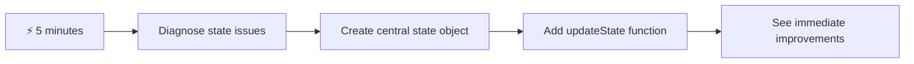
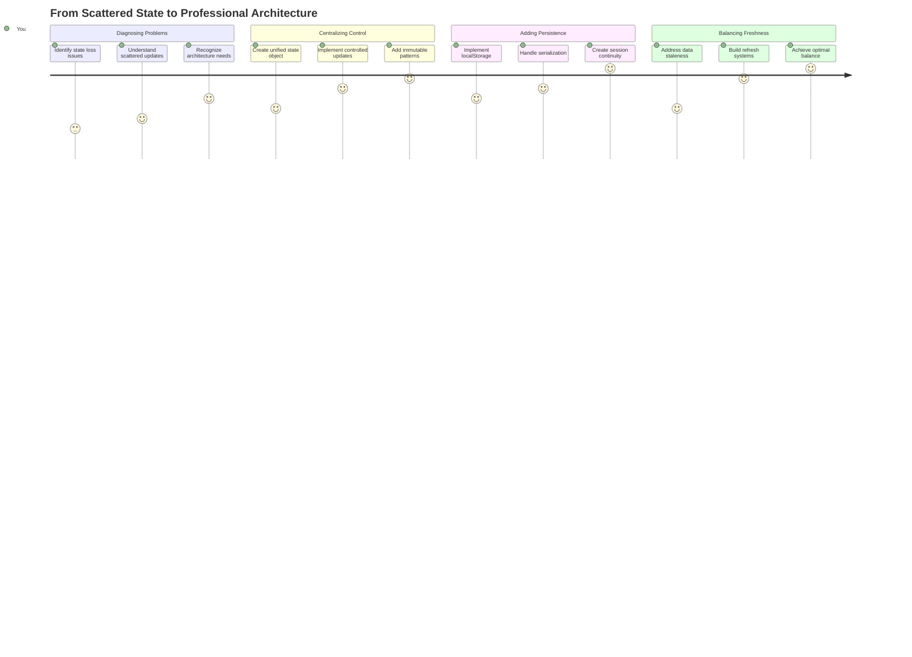
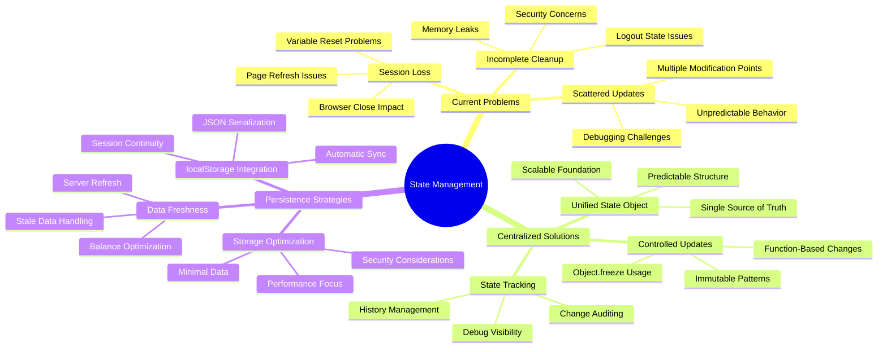
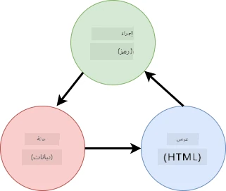
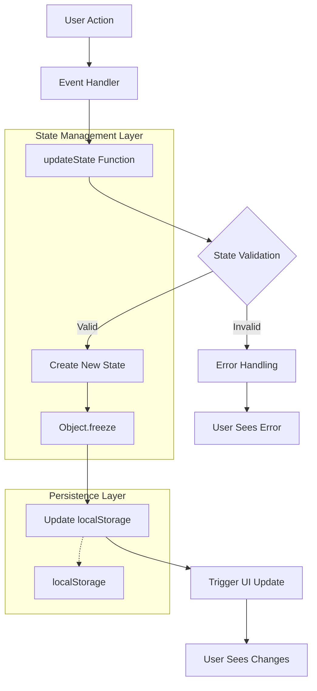
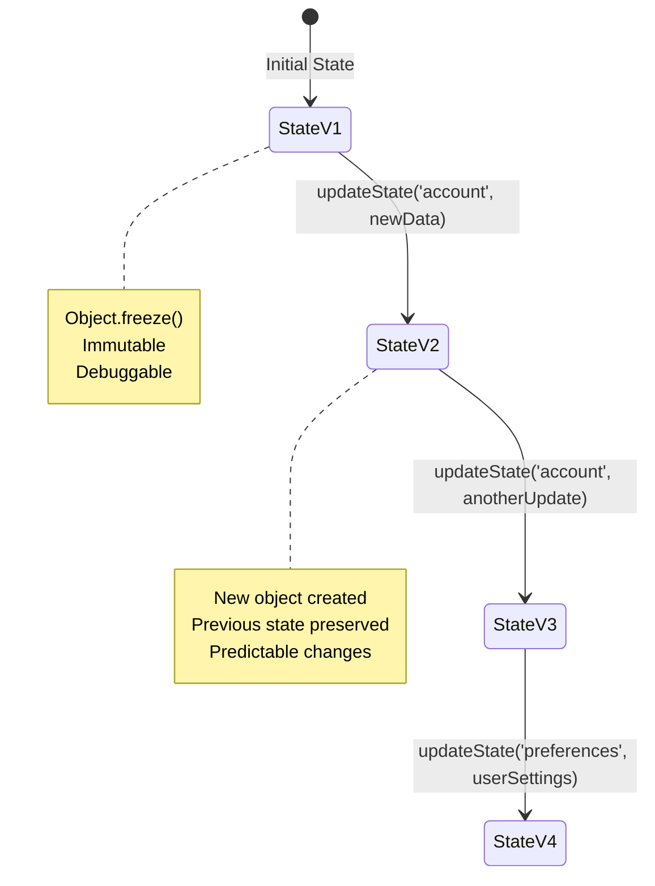
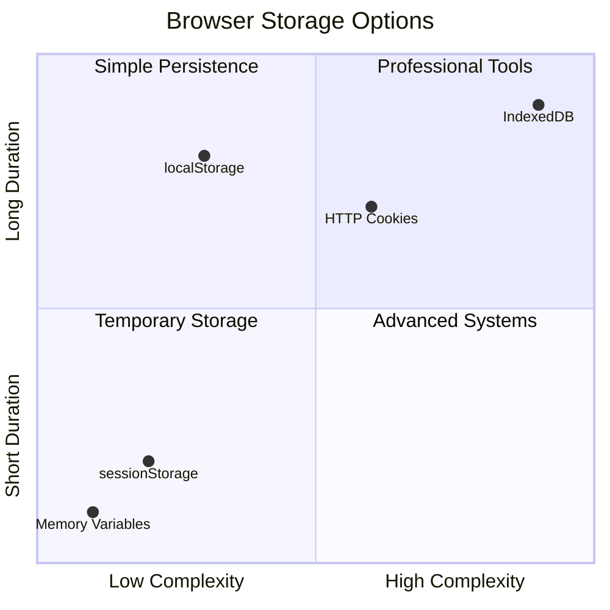
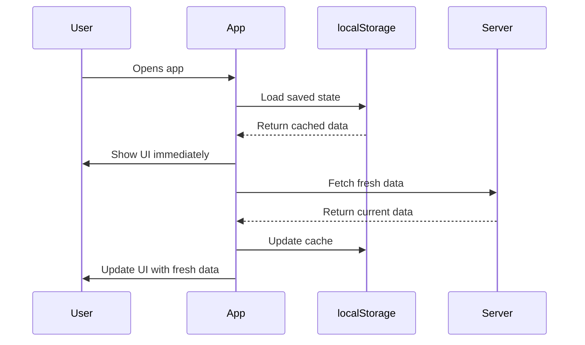
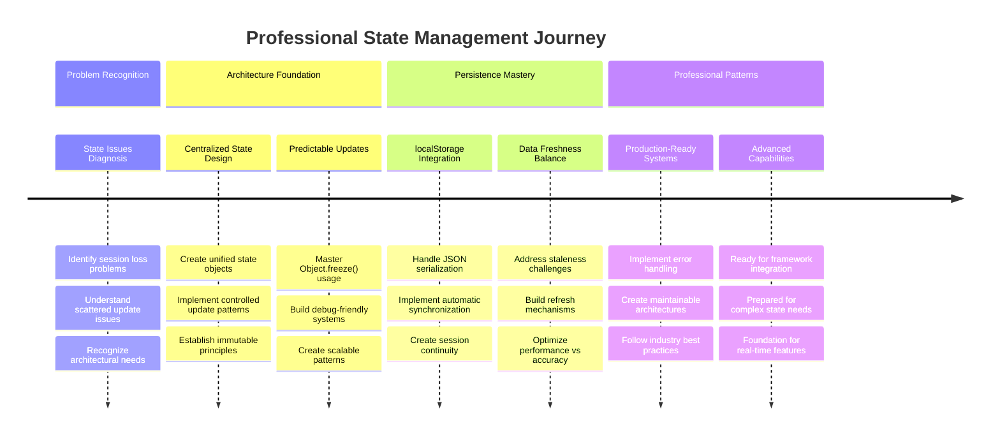

# بناء تطبيق مصرفي الجزء الرابع: مفاهيم إدارة الحالة

## ⚡ ما يمكنك القيام به في الدقائق الخمس القادمة

**مسار البداية السريعة للمطورين المشغولين**



- **الدقيقة الأولى**: اختبر مشكلة الحالة الحالية - قم بتسجيل الدخول، تحديث الصفحة، لاحظ تسجيل الخروج
- **الدقيقة الثانية**: استبدل `let account = null` بـ `let state = { account: null }`
- **الدقيقة الثالثة**: أنشئ وظيفة بسيطة `updateState()` لتحديثات محكومة
- **الدقيقة الرابعة**: قم بتحديث وظيفة واحدة لاستخدام النمط الجديد
- **الدقيقة الخامسة**: اختبر تحسين القدرة على التنبؤ وإمكانية تصحيح الأخطاء

**اختبار تشخيص سريع**:
```javascript
// Before: Scattered state
let account = null; // Lost on refresh!

// After: Centralized state
let state = Object.freeze({ account: null }); // Controlled and trackable!
```

**لماذا هذا مهم**: في غضون خمس دقائق، ستختبر التحول من إدارة حالة فوضوية إلى أنماط قابلة للتنبؤ والتصحيح. هذا هو الأساس الذي يجعل التطبيقات المعقدة قابلة للصيانة.

## 🗺️ رحلتك التعليمية نحو إتقان إدارة الحالة



**وجهة رحلتك**: بنهاية هذا الدرس، ستكون قد أنشأت نظام إدارة حالة احترافي يتعامل مع الاستمرارية، تحديث البيانات، وتحديثات قابلة للتنبؤ - نفس الأنماط المستخدمة في التطبيقات الإنتاجية.

## اختبار ما قبل المحاضرة

[اختبار ما قبل المحاضرة](https://ff-quizzes.netlify.app/web/quiz/47)

## المقدمة

إدارة الحالة تشبه نظام الملاحة في مركبة الفضاء فوياجر – عندما تسير الأمور بسلاسة، بالكاد تلاحظ وجودها. ولكن عندما تسوء الأمور، تصبح الفرق بين الوصول إلى الفضاء بين النجوم والانجراف في الفراغ الكوني. في تطوير الويب، تمثل الحالة كل ما يحتاجه تطبيقك لتذكره: حالة تسجيل دخول المستخدم، بيانات النماذج، تاريخ التنقل، وحالات الواجهة المؤقتة.

مع تطور تطبيقك المصرفي من نموذج تسجيل دخول بسيط إلى تطبيق أكثر تعقيدًا، ربما واجهت بعض التحديات الشائعة. قم بتحديث الصفحة وسيتم تسجيل خروج المستخدمين بشكل غير متوقع. أغلق المتصفح وستختفي كل التقدم. قم بتصحيح مشكلة وستجد نفسك تبحث في وظائف متعددة تعدل نفس البيانات بطرق مختلفة.

هذه ليست علامات على البرمجة السيئة – إنها آلام النمو الطبيعية التي تحدث عندما تصل التطبيقات إلى مستوى معين من التعقيد. يواجه كل مطور هذه التحديات عندما تنتقل تطبيقاتهم من "إثبات المفهوم" إلى "جاهز للإنتاج".

في هذا الدرس، سنقوم بتنفيذ نظام إدارة حالة مركزي يحول تطبيقك المصرفي إلى تطبيق موثوق واحترافي. ستتعلم كيفية إدارة تدفقات البيانات بشكل قابل للتنبؤ، الحفاظ على جلسات المستخدم بشكل مناسب، وإنشاء تجربة مستخدم سلسة تتطلبها تطبيقات الويب الحديثة.

## المتطلبات الأساسية

قبل الغوص في مفاهيم إدارة الحالة، ستحتاج إلى إعداد بيئة التطوير الخاصة بك ووضع أساس تطبيقك المصرفي. يعتمد هذا الدرس مباشرة على المفاهيم والكود من الأجزاء السابقة من هذه السلسلة.

تأكد من أن لديك المكونات التالية جاهزة قبل المتابعة:

**الإعداد المطلوب:**
- أكمل درس [جلب البيانات](../3-data/README.md) - يجب أن يقوم تطبيقك بتحميل وعرض بيانات الحساب بنجاح
- قم بتثبيت [Node.js](https://nodejs.org) على نظامك لتشغيل واجهة برمجة التطبيقات الخلفية
- قم بتشغيل [واجهة برمجة التطبيقات للخادم](../api/README.md) محليًا للتعامل مع عمليات بيانات الحساب

**اختبار بيئتك:**

تحقق من تشغيل خادم واجهة برمجة التطبيقات بشكل صحيح عن طريق تنفيذ هذا الأمر في الطرفية:

```sh
curl http://localhost:5000/api
# -> should return "Bank API v1.0.0" as a result
```

**ما يفعله هذا الأمر:**
- **يرسل** طلب GET إلى خادم واجهة برمجة التطبيقات المحلي
- **يختبر** الاتصال ويتحقق من استجابة الخادم
- **يعيد** معلومات إصدار واجهة برمجة التطبيقات إذا كان كل شيء يعمل بشكل صحيح

## 🧠 نظرة عامة على بنية إدارة الحالة



**المبدأ الأساسي**: توازن إدارة الحالة الاحترافية بين القابلية للتنبؤ، الاستمرارية، والأداء لإنشاء تجارب مستخدم موثوقة تتوسع من التفاعلات البسيطة إلى تدفقات العمل المعقدة للتطبيق.

---

## تشخيص مشاكل الحالة الحالية

مثل شيرلوك هولمز الذي يفحص مسرح الجريمة، نحتاج إلى فهم ما يحدث بالضبط في تنفيذنا الحالي قبل أن نتمكن من حل لغز جلسات المستخدم المفقودة.

لنقم بإجراء تجربة بسيطة تكشف عن تحديات إدارة الحالة الأساسية:

**🧪 جرب هذا الاختبار التشخيصي:**
1. قم بتسجيل الدخول إلى تطبيقك المصرفي وانتقل إلى لوحة التحكم
2. قم بتحديث صفحة المتصفح
3. لاحظ ما يحدث لحالة تسجيل الدخول الخاصة بك

إذا تمت إعادة توجيهك إلى شاشة تسجيل الدخول، فقد اكتشفت مشكلة استمرارية الحالة الكلاسيكية. يحدث هذا السلوك لأن تنفيذنا الحالي يخزن بيانات المستخدم في متغيرات JavaScript التي يتم إعادة تعيينها مع كل تحميل للصفحة.

**مشاكل التنفيذ الحالي:**

المتغير البسيط `account` من [الدرس السابق](../3-data/README.md) يخلق ثلاث مشاكل كبيرة تؤثر على تجربة المستخدم وصيانة الكود:

| المشكلة | السبب الفني | تأثير المستخدم |
|---------|-------------|----------------|
| **فقدان الجلسة** | تحديث الصفحة يمسح متغيرات JavaScript | يجب على المستخدمين إعادة المصادقة بشكل متكرر |
| **تحديثات متفرقة** | وظائف متعددة تعدل الحالة مباشرة | يصبح التصحيح أكثر صعوبة |
| **تنظيف غير مكتمل** | تسجيل الخروج لا يمسح جميع مراجع الحالة | مخاوف محتملة تتعلق بالأمان والخصوصية |

**التحدي المعماري:**

مثل تصميم تيتانيك المقسم الذي بدا قويًا حتى غمرت المياه عدة أقسام في وقت واحد، فإن إصلاح هذه المشاكل بشكل فردي لن يعالج المشكلة المعمارية الأساسية. نحن بحاجة إلى حل شامل لإدارة الحالة.

> 💡 **ما الذي نحاول تحقيقه هنا بالفعل؟**

[إدارة الحالة](https://en.wikipedia.org/wiki/State_management) تتعلق حقًا بحل لغزين أساسيين:

1. **أين بياناتي؟**: تتبع المعلومات التي لدينا ومن أين تأتي
2. **هل الجميع على نفس الصفحة؟**: التأكد من أن ما يراه المستخدمون يتطابق مع ما يحدث بالفعل

**خطة لعبتنا:**

بدلاً من مطاردة ذيولنا، سنقوم بإنشاء نظام **إدارة حالة مركزي**. فكر في الأمر كأن لديك شخصًا منظمًا جدًا مسؤولًا عن كل الأمور المهمة:





**فهم تدفق البيانات هذا:**
- **مركزي** جميع حالات التطبيق في مكان واحد
- **يوجه** جميع تغييرات الحالة من خلال وظائف محكومة
- **يضمن** أن تظل واجهة المستخدم متزامنة مع الحالة الحالية
- **يوفر** نمطًا واضحًا وقابلًا للتنبؤ لإدارة البيانات

> 💡 **رؤية احترافية**: يركز هذا الدرس على المفاهيم الأساسية. بالنسبة للتطبيقات المعقدة، توفر مكتبات مثل [Redux](https://redux.js.org) ميزات إدارة حالة أكثر تقدمًا. فهم هذه المبادئ الأساسية سيساعدك على إتقان أي مكتبة لإدارة الحالة.

> ⚠️ **موضوع متقدم**: لن نغطي التحديثات التلقائية للواجهة التي يتم تشغيلها بواسطة تغييرات الحالة، حيث يتضمن ذلك مفاهيم [البرمجة التفاعلية](https://en.wikipedia.org/wiki/Reactive_programming). اعتبر هذا خطوة ممتازة تالية لرحلتك التعليمية!

### المهمة: مركزية هيكل الحالة

لنبدأ بتحويل إدارة الحالة المتفرقة إلى نظام مركزي. هذه الخطوة الأولى تؤسس الأساس لجميع التحسينات التي تليها.

**الخطوة 1: إنشاء كائن حالة مركزي**

استبدل إعلان `account` البسيط:

```js
let account = null;
```

بكائن حالة منظم:

```js
let state = {
  account: null
};
```

**لماذا يهم هذا التغيير:**
- **مركزي** جميع بيانات التطبيق في مكان واحد
- **يجهز** الهيكل لإضافة المزيد من خصائص الحالة لاحقًا
- **يخلق** حدودًا واضحة بين الحالة والمتغيرات الأخرى
- **يؤسس** نمطًا يتوسع مع نمو تطبيقك

**الخطوة 2: تحديث أنماط الوصول إلى الحالة**

قم بتحديث وظائفك لاستخدام الهيكل الجديد للحالة:

**في وظائف `register()` و `login()`**، استبدل:
```js
account = ...
```

بـ:
```js
state.account = ...
```

**في وظيفة `updateDashboard()`**، أضف هذا السطر في الأعلى:
```js
const account = state.account;
```

**ما الذي تحققه هذه التحديثات:**
- **يحافظ** على الوظائف الحالية مع تحسين الهيكل
- **يجهز** الكود الخاص بك لإدارة حالة أكثر تطورًا
- **يخلق** أنماطًا متسقة للوصول إلى بيانات الحالة
- **يؤسس** الأساس لتحديثات الحالة المركزية

> 💡 **ملاحظة**: هذا التغيير لا يحل مشاكلنا على الفور، لكنه يخلق الأساس الضروري للتحسينات القوية القادمة!

### 🎯 التحقق التربوي: مبادئ المركزية

**توقف وتأمل**: لقد قمت للتو بتنفيذ أساس إدارة الحالة المركزية. هذه خطوة معمارية حاسمة.

**تقييم ذاتي سريع**:
- هل يمكنك شرح لماذا يعتبر مركزية الحالة في كائن واحد أفضل من المتغيرات المتفرقة؟
- ماذا سيحدث إذا نسيت تحديث وظيفة لاستخدام `state.account`؟
- كيف يجهز هذا النمط الكود الخاص بك لميزات أكثر تقدمًا؟

**اتصال بالعالم الحقيقي**: النمط المركزي الذي تعلمته هو الأساس للأطر الحديثة مثل Redux، Vuex، وReact Context. أنت تبني نفس التفكير المعماري المستخدم في التطبيقات الكبرى.

**سؤال التحدي**: إذا كنت بحاجة إلى إضافة تفضيلات المستخدم (مثل السمة، اللغة) إلى تطبيقك، أين ستضيفها في هيكل الحالة؟ كيف يمكن أن يتوسع هذا؟

## تنفيذ تحديثات الحالة المحكومة

مع مركزية حالتنا، تتضمن الخطوة التالية إنشاء آليات محكومة لتعديلات البيانات. يضمن هذا النهج تغييرات حالة قابلة للتنبؤ وسهولة التصحيح.

المبدأ الأساسي يشبه التحكم في حركة الطيران: بدلاً من السماح للوظائف المتعددة بتعديل الحالة بشكل مستقل، سنوجه جميع التغييرات من خلال وظيفة واحدة محكومة. يوفر هذا النمط إشرافًا واضحًا على متى وكيف تحدث تغييرات البيانات.

**إدارة الحالة غير القابلة للتغيير:**

سنعامل كائن `state` الخاص بنا ككائن [*غير قابل للتغيير*](https://en.wikipedia.org/wiki/Immutable_object)، مما يعني أننا لن نقوم بتعديله مباشرة. بدلاً من ذلك، كل تغيير ينشئ كائن حالة جديدًا مع البيانات المحدثة.

على الرغم من أن هذا النهج قد يبدو غير فعال في البداية مقارنة بالتعديلات المباشرة، إلا أنه يوفر مزايا كبيرة للتصحيح، الاختبار، والحفاظ على قابلية التنبؤ بالتطبيق.

**فوائد إدارة الحالة غير القابلة للتغيير:**

| الفائدة | الوصف | التأثير |
|---------|-------------|--------|
| **القابلية للتنبؤ** | تحدث التغييرات فقط من خلال وظائف محكومة | أسهل للتصحيح والاختبار |
| **تتبع التاريخ** | كل تغيير في الحالة ينشئ كائنًا جديدًا | يمكن التراجع/الإعادة |
| **منع الآثار الجانبية** | لا تعديلات عرضية | يمنع الأخطاء الغامضة |
| **تحسين الأداء** | سهل اكتشاف متى تغيرت الحالة بالفعل | يتيح تحديثات واجهة المستخدم بكفاءة |

**عدم قابلية التغيير في JavaScript باستخدام `Object.freeze()`:**

يوفر JavaScript [`Object.freeze()`](https://developer.mozilla.org/docs/Web/JavaScript/Reference/Global_Objects/Object/freeze) لمنع تعديلات الكائن:

```js
const immutableState = Object.freeze({ account: userData });
// Any attempt to modify immutableState will throw an error
```

**تفصيل ما يحدث هنا:**
- **يمنع** تعيين الخصائص أو حذفها مباشرة
- **يرمي** استثناءات إذا تم محاولة التعديل
- **يضمن** أن تغييرات الحالة يجب أن تمر عبر وظائف محكومة
- **يخلق** عقدًا واضحًا لكيفية تحديث الحالة

> 💡 **استكشاف عميق**: تعرف على الفرق بين الكائنات غير القابلة للتغيير *السطحية* و*العميقة* في [وثائق MDN](https://developer.mozilla.org/docs/Web/JavaScript/Reference/Global_Objects/Object/freeze#What_is_shallow_freeze). فهم هذا التمييز ضروري للهياكل المعقدة للحالة.



### المهمة

لنقم بإنشاء وظيفة جديدة `updateState()`:

```js
function updateState(property, newData) {
  state = Object.freeze({
    ...state,
    [property]: newData
  });
}
```

في هذه الوظيفة، نقوم بإنشاء كائن حالة جديد وننسخ البيانات من الحالة السابقة باستخدام [عامل الانتشار (`...`)](https://developer.mozilla.org/docs/Web/JavaScript/Reference/Operators/Spread_syntax#Spread_in_object_literals). ثم نقوم بتجاوز خاصية معينة من كائن الحالة بالبيانات الجديدة باستخدام [ترميز الأقواس](https://developer.mozilla.org/docs/Web/JavaScript/Guide/Working_with_Objects#Objects_and_properties) `[property]` للتعيين. وأخيرًا، نقوم بتجميد الكائن لمنع التعديلات باستخدام `Object.freeze()`. لدينا فقط خاصية `account` مخزنة في الحالة الآن، ولكن مع هذا النهج يمكنك إضافة العديد من الخصائص كما تحتاج في الحالة.

سنقوم أيضًا بتحديث تهيئة `state` للتأكد من أن الحالة الأولية مجمدة أيضًا:

```js
let state = Object.freeze({
  account: null
});
```

بعد ذلك، قم بتحديث وظيفة `register` عن طريق استبدال التعيين `state.account = result;` بـ:

```js
updateState('account', result);
```

قم بنفس الشيء مع وظيفة `login`، استبدل `state.account = data;` بـ:

```js
updateState('account', data);
```

سنستغل الفرصة الآن لإصلاح مشكلة عدم مسح بيانات الحساب عندما ينقر المستخدم على *تسجيل الخروج*.

قم بإنشاء وظيفة جديدة `logout()`:

```js
function logout() {
  updateState('account', null);
  navigate('/login');
}
```

في `updateDashboard()`، استبدل إعادة التوجيه `return navigate('/login');` بـ `return logout()`;

جرب تسجيل حساب جديد، تسجيل الخروج ثم تسجيل الدخول مرة أخرى للتحقق من أن كل شيء لا يزال يعمل بشكل صحيح.

> نصيحة: يمكنك إلقاء نظرة على جميع تغييرات الحالة عن طريق إضافة `console.log(state)` في أسفل `updateState()` وفتح وحدة التحكم في أدوات تطوير المتصفح.

## تنفيذ استمرارية البيانات

تتطلب مشكلة فقدان الجلسة التي حددناها سابقًا حلاً للاستمرارية يحافظ على حالة المستخدم عبر جلسات المتصفح. هذا يحول تطبيقنا من تجربة مؤقتة إلى أداة موثوقة واحترافية.

فكر في كيفية احتفاظ الساعات الذرية بالوقت الدقيق حتى أثناء انقطاع الطاقة عن طريق تخزين الحالة الحرجة في ذاكرة غير متطايرة. وبالمثل، تحتاج تطبيقات الويب إلى آليات تخزين مستمرة للحفاظ على بيانات المستخدم الأساسية عبر جلسات المتصفح وتحديثات الصفحة.

**أسئلة استراتيجية لاستمرارية البيانات:**

قبل تنفيذ الاستمرارية، فكر في هذه العوامل الحرجة:

| السؤال | سياق التطبيق المصرفي | تأثير القرار |
|----------|-------------------|----------------|
| **هل البيانات حساسة؟** | رصيد الحساب، تاريخ المعاملات | اختر طرق تخزين آمنة |
| **كم يجب أن يستمر؟** | حالة تسجيل الدخول مقابل تفضيلات واجهة المستخدم المؤقتة | اختر مدة التخزين المناسبة |
| **هل يحتاج الخادم إليها؟** | رموز المصادقة مقابل إعدادات واجهة المستخدم | حدد متطلبات المشاركة |

**خيارات تخزين المتصفح:**

توفر المتصفحات الحديثة عدة آليات تخزين، كل منها مصمم لحالات استخدام مختلفة:

**واجهات برمجة التطبيقات الأساسية للتخزين:**

1. **[`localStorage`](https://developer.mozilla.org/docs/Web/API/Window/localStorage)**: تخزين دائم [مفتاح/قيمة](https://en.wikipedia.org/wiki/Key%E2%80%93value_database)
   - **يحتفظ** بالبيانات عبر جلسات المتصفح إلى أجل غير مسمى  
   - **يبقى** بعد إعادة تشغيل المتصفح وإعادة تشغيل الكمبيوتر
   - **محدد** لنطاق موقع الويب المحدد
   - **مثالي** لتفضيلات المستخدم وحالات تسجيل الدخول

2. **[`sessionStorage`](https://developer.mozilla.org/docs/Web/API/Window/sessionStorage)**: تخزين مؤقت للجلسة
   - **يعمل** بنفس طريقة localStorage أثناء الجلسات النشطة
   - **يُمسح** تلقائيًا عند إغلاق علامة تبويب المتصفح
   - **مثالي** للبيانات المؤقتة التي لا يجب أن تستمر

3. **[ملفات تعريف الارتباط HTTP](https://developer.mozilla.org/docs/Web/HTTP/Cookies)**: تخزين مشترك مع الخادم
   - **يُرسل تلقائيًا** مع كل طلب للخادم
   - **مثالي** لـ [رموز المصادقة](https://en.wikipedia.org/wiki/Authentication)
   - **محدود** الحجم ويمكن أن يؤثر على الأداء

**متطلبات تسلسل البيانات:**

يخزن كل من `localStorage` و`sessionStorage` فقط [سلاسل نصية](https://developer.mozilla.org/docs/Web/JavaScript/Reference/Global_Objects/String):

```js
// Convert objects to JSON strings for storage
const accountData = { user: 'john', balance: 150 };
localStorage.setItem('account', JSON.stringify(accountData));

// Parse JSON strings back to objects when retrieving
const savedAccount = JSON.parse(localStorage.getItem('account'));
```

**فهم التسلسل:**
- **يحول** كائنات JavaScript إلى سلاسل JSON باستخدام [`JSON.stringify()`](https://developer.mozilla.org/docs/Web/JavaScript/Reference/Global_Objects/JSON/stringify)
- **يعيد بناء** الكائنات من JSON باستخدام [`JSON.parse()`](https://developer.mozilla.org/docs/Web/JavaScript/Reference/Global_Objects/JSON/parse)
- **يتعامل** تلقائيًا مع الكائنات المتداخلة والمصفوفات المعقدة
- **يفشل** مع الوظائف والقيم غير المعرفة والمرجع الدائري

> 💡 **خيار متقدم**: بالنسبة للتطبيقات غير المتصلة بالإنترنت التي تحتوي على مجموعات بيانات كبيرة، فكر في استخدام واجهة برمجة التطبيقات [`IndexedDB`](https://developer.mozilla.org/docs/Web/API/IndexedDB_API). توفر قاعدة بيانات كاملة على جانب العميل ولكن تتطلب تنفيذًا أكثر تعقيدًا.



### المهمة: تنفيذ تخزين دائم باستخدام localStorage

لنقم بتنفيذ تخزين دائم بحيث يبقى المستخدمون مسجلين الدخول حتى يقوموا بتسجيل الخروج بشكل صريح. سنستخدم `localStorage` لتخزين بيانات الحساب عبر جلسات المتصفح.

**الخطوة 1: تعريف إعدادات التخزين**

```js
const storageKey = 'savedAccount';
```

**ما الذي يوفره هذا الثابت:**
- **ينشئ** معرفًا ثابتًا للبيانات المخزنة
- **يمنع** الأخطاء الإملائية في مراجع مفتاح التخزين
- **يجعل** من السهل تغيير مفتاح التخزين إذا لزم الأمر
- **يتبع** أفضل الممارسات لكتابة كود قابل للصيانة

**الخطوة 2: إضافة التخزين التلقائي**

أضف هذا السطر في نهاية وظيفة `updateState()`:

```js
localStorage.setItem(storageKey, JSON.stringify(state.account));
```

**تفصيل ما يحدث هنا:**
- **يحول** كائن الحساب إلى سلسلة JSON للتخزين
- **يحفظ** البيانات باستخدام مفتاح التخزين الثابت
- **يُنفذ** تلقائيًا عند حدوث تغييرات في الحالة
- **يضمن** أن البيانات المخزنة متزامنة دائمًا مع الحالة الحالية

> 💡 **فائدة معمارية**: نظرًا لأننا قمنا بتجميع جميع تحديثات الحالة من خلال `updateState()`، فإن إضافة التخزين استغرق سطرًا واحدًا فقط من الكود. هذا يوضح قوة القرارات المعمارية الجيدة!

**الخطوة 3: استعادة الحالة عند تحميل التطبيق**

قم بإنشاء وظيفة تهيئة لاستعادة البيانات المحفوظة:

```js
function init() {
  const savedAccount = localStorage.getItem(storageKey);
  if (savedAccount) {
    updateState('account', JSON.parse(savedAccount));
  }

  // Our previous initialization code
  window.onpopstate = () => updateRoute();
  updateRoute();
}

init();
```

**فهم عملية التهيئة:**
- **يسترجع** أي بيانات حساب محفوظة مسبقًا من localStorage
- **يحلل** سلسلة JSON مرة أخرى إلى كائن JavaScript
- **يحدث** الحالة باستخدام وظيفة التحديث المراقبة
- **يستعيد** جلسة المستخدم تلقائيًا عند تحميل الصفحة
- **يُنفذ** قبل تحديث المسارات لضمان توفر الحالة

**الخطوة 4: تحسين المسار الافتراضي**

قم بتحديث المسار الافتراضي للاستفادة من التخزين الدائم:

في `updateRoute()`، استبدل:
```js
// Replace: return navigate('/login');
return navigate('/dashboard');
```

**لماذا هذا التغيير منطقي:**
- **يستفيد** من نظام التخزين الجديد بشكل فعال
- **يسمح** للوحة التحكم بمعالجة فحوصات المصادقة
- **يُعيد التوجيه** إلى تسجيل الدخول تلقائيًا إذا لم تكن هناك جلسة محفوظة
- **يُنشئ** تجربة مستخدم أكثر سلاسة

**اختبار تنفيذك:**

1. قم بتسجيل الدخول إلى تطبيقك البنكي
2. قم بتحديث صفحة المتصفح
3. تحقق من أنك ما زلت مسجل الدخول وعلى لوحة التحكم
4. أغلق وأعد فتح المتصفح
5. عد إلى تطبيقك وتأكد من أنك ما زلت مسجل الدخول

🎉 **إنجاز محقق**: لقد قمت بتنفيذ إدارة حالة دائمة بنجاح! الآن يتصرف تطبيقك مثل تطبيق ويب احترافي.

### 🎯 مراجعة تربوية: هندسة التخزين الدائم

**فهم الهندسة**: لقد قمت بتنفيذ طبقة تخزين دائمة متقدمة توازن بين تجربة المستخدم وتعقيد إدارة البيانات.

**المفاهيم الرئيسية التي تم إتقانها**:
- **تسلسل JSON**: تحويل الكائنات المعقدة إلى سلاسل قابلة للتخزين
- **المزامنة التلقائية**: تغييرات الحالة تؤدي إلى تخزين دائم
- **استعادة الجلسة**: يمكن للتطبيقات استعادة سياق المستخدم بعد الانقطاعات
- **التخزين المركزي**: وظيفة تحديث واحدة تتعامل مع جميع عمليات التخزين

**اتصال بالصناعة**: هذا النمط من التخزين الدائم أساسي لتطبيقات الويب التقدمية (PWAs)، التطبيقات التي تعمل بدون اتصال، وتجارب الويب الحديثة. أنت تبني قدرات على مستوى الإنتاج.

**سؤال للتفكير**: كيف يمكنك تعديل هذا النظام للتعامل مع حسابات متعددة على نفس الجهاز؟ فكر في الخصوصية وآثار الأمان.

## موازنة التخزين الدائم مع حداثة البيانات

نظام التخزين الدائم الخاص بنا يحافظ بنجاح على جلسات المستخدم، لكنه يقدم تحديًا جديدًا: البيانات القديمة. عندما يقوم مستخدمون أو تطبيقات متعددة بتعديل نفس بيانات الخادم، تصبح المعلومات المخزنة محليًا قديمة.

تشبه هذه الحالة الملاحين الفايكنغ الذين اعتمدوا على خرائط النجوم المخزنة والملاحظات السماوية الحالية. توفر الخرائط الاتساق، لكن الملاحين يحتاجون إلى ملاحظات جديدة لمواكبة الظروف المتغيرة. وبالمثل، يحتاج تطبيقنا إلى حالة مستخدم دائمة وبيانات خادم حديثة.

**🧪 اكتشاف مشكلة حداثة البيانات:**

1. قم بتسجيل الدخول إلى لوحة التحكم باستخدام حساب `test`
2. قم بتشغيل هذا الأمر في الطرفية لمحاكاة معاملة من مصدر آخر:

```sh
curl --request POST \
     --header "Content-Type: application/json" \
     --data "{ \"date\": \"2020-07-24\", \"object\": \"Bought book\", \"amount\": -20 }" \
     http://localhost:5000/api/accounts/test/transactions
```

3. قم بتحديث صفحة لوحة التحكم في المتصفح
4. لاحظ ما إذا كنت ترى المعاملة الجديدة

**ما الذي يظهره هذا الاختبار:**
- **يوضح** كيف يمكن أن يصبح التخزين المحلي "قديمًا" (غير محدث)
- **يحاكي** سيناريوهات العالم الحقيقي حيث تحدث تغييرات البيانات خارج تطبيقك
- **يكشف** التوتر بين التخزين الدائم وحداثة البيانات

**تحدي حداثة البيانات:**

| المشكلة | السبب | تأثير المستخدم |
|---------|-------|----------------|
| **البيانات القديمة** | لا تنتهي صلاحية localStorage تلقائيًا | يرى المستخدمون معلومات غير محدثة |
| **تغييرات الخادم** | تعديلات من تطبيقات/مستخدمين آخرين على نفس البيانات | وجهات نظر غير متسقة عبر المنصات |
| **التخزين المؤقت مقابل الواقع** | التخزين المؤقت المحلي لا يتطابق مع حالة الخادم | تجربة مستخدم سيئة وارتباك |

**استراتيجية الحل:**

سنقوم بتنفيذ نمط "التحديث عند التحميل" الذي يوازن بين فوائد التخزين الدائم والحاجة إلى البيانات الحديثة. يضمن هذا النهج تجربة مستخدم سلسة مع الحفاظ على دقة البيانات.



### المهمة: تنفيذ نظام تحديث البيانات

سنقوم بإنشاء نظام يقوم تلقائيًا بجلب بيانات جديدة من الخادم مع الحفاظ على فوائد إدارة الحالة الدائمة.

**الخطوة 1: إنشاء محدّث بيانات الحساب**

```js
async function updateAccountData() {
  const account = state.account;
  if (!account) {
    return logout();
  }

  const data = await getAccount(account.user);
  if (data.error) {
    return logout();
  }

  updateState('account', data);
}
```

**فهم منطق هذه الوظيفة:**
- **يتحقق** مما إذا كان المستخدم مسجلًا الدخول حاليًا (state.account موجود)
- **يُعيد التوجيه** إلى تسجيل الخروج إذا لم تكن هناك جلسة صالحة
- **يجلب** بيانات الحساب الجديدة من الخادم باستخدام وظيفة `getAccount()` الحالية
- **يتعامل** مع أخطاء الخادم برشاقة عن طريق تسجيل الخروج من الجلسات غير الصالحة
- **يُحدث** الحالة ببيانات جديدة باستخدام نظام التحديث المراقب
- **يُشغل** التخزين الدائم تلقائيًا من خلال وظيفة `updateState()`

**الخطوة 2: إنشاء معالج تحديث لوحة التحكم**

```js
async function refresh() {
  await updateAccountData();
  updateDashboard();
}
```

**ما الذي يحققه هذا المعالج:**
- **ينسق** عملية تحديث البيانات وتحديث واجهة المستخدم
- **ينتظر** تحميل البيانات الجديدة قبل تحديث العرض
- **يضمن** أن لوحة التحكم تعرض المعلومات الأكثر حداثة
- **يحافظ** على فصل نظيف بين إدارة البيانات وتحديث واجهة المستخدم

**الخطوة 3: التكامل مع نظام المسارات**

قم بتحديث تكوين المسار لتشغيل التحديث تلقائيًا:

```js
const routes = {
  '/login': { templateId: 'login' },
  '/dashboard': { templateId: 'dashboard', init: refresh }
};
```

**كيف يعمل هذا التكامل:**
- **يُنفذ** وظيفة التحديث في كل مرة يتم تحميل مسار لوحة التحكم
- **يضمن** عرض البيانات الجديدة دائمًا عند تنقل المستخدمين إلى لوحة التحكم
- **يحافظ** على هيكل المسار الحالي مع إضافة حداثة البيانات
- **يوفر** نمطًا ثابتًا لتهيئة المسارات الخاصة

**اختبار نظام تحديث البيانات الخاص بك:**

1. قم بتسجيل الدخول إلى تطبيقك البنكي
2. قم بتشغيل أمر curl السابق لإنشاء معاملة جديدة
3. قم بتحديث صفحة لوحة التحكم أو التنقل بعيدًا ثم العودة
4. تحقق من ظهور المعاملة الجديدة فورًا

🎉 **توازن مثالي محقق**: يجمع تطبيقك الآن بين تجربة التخزين الدائم السلسة ودقة بيانات الخادم الحديثة!

## 📈 جدول زمني لإتقان إدارة الحالة الخاصة بك



**🎓 مرحلة التخرج**: لقد قمت ببناء نظام إدارة حالة كامل باستخدام نفس المبادئ التي تدعم Redux، Vuex، وغيرها من مكتبات الحالة الاحترافية. هذه الأنماط قابلة للتوسع من التطبيقات البسيطة إلى التطبيقات المؤسسية.

**🔄 قدرات المستوى التالي**:
- جاهز لإتقان أطر إدارة الحالة (Redux، Zustand، Pinia)
- مستعد لتنفيذ ميزات الوقت الفعلي باستخدام WebSockets
- مجهز لبناء تطبيقات ويب تقدمية تعمل بدون اتصال
- أساس قوي لأنماط متقدمة مثل آلات الحالة والمراقبين

## تحدي وكيل GitHub Copilot 🚀

استخدم وضع الوكيل لإكمال التحدي التالي:

**الوصف:** قم بتنفيذ نظام إدارة حالة شامل مع وظيفة التراجع/الإعادة لتطبيقك البنكي. سيساعدك هذا التحدي على ممارسة مفاهيم إدارة الحالة المتقدمة بما في ذلك تتبع تاريخ الحالة، التحديثات غير القابلة للتغيير، ومزامنة واجهة المستخدم.

**المهمة:** قم بإنشاء نظام إدارة حالة محسّن يتضمن: 1) مصفوفة تاريخ الحالة التي تتبع جميع الحالات السابقة، 2) وظائف التراجع والإعادة التي يمكنها العودة إلى الحالات السابقة، 3) أزرار واجهة المستخدم لعمليات التراجع/الإعادة على لوحة التحكم، 4) حد أقصى لتاريخ الحالة يبلغ 10 حالات لمنع مشاكل الذاكرة، و5) تنظيف مناسب للتاريخ عند تسجيل خروج المستخدم. تأكد من أن وظيفة التراجع/الإعادة تعمل مع تغييرات رصيد الحساب وتستمر عبر تحديثات المتصفح.

تعرف على المزيد حول [وضع الوكيل](https://code.visualstudio.com/blogs/2025/02/24/introducing-copilot-agent-mode) هنا.

## 🚀 تحدي: تحسين التخزين

تنفيذك الآن يتعامل مع جلسات المستخدم، تحديث البيانات، وإدارة الحالة بشكل فعال. ومع ذلك، فكر فيما إذا كان نهجنا الحالي يوازن بشكل مثالي بين كفاءة التخزين والوظائف.

مثل أساتذة الشطرنج الذين يميزون بين القطع الأساسية والبيادق القابلة للتضحية، تتطلب إدارة الحالة الفعالة تحديد البيانات التي يجب أن تستمر مقابل تلك التي يجب أن تكون دائمًا جديدة من الخادم.

**تحليل التحسين:**

قم بتقييم تنفيذ localStorage الحالي الخاص بك وفكر في هذه الأسئلة الاستراتيجية:
- ما هي المعلومات الدنيا المطلوبة للحفاظ على مصادقة المستخدم؟
- أي البيانات تتغير بشكل متكرر بحيث يوفر التخزين المحلي فائدة قليلة؟
- كيف يمكن أن يحسن تحسين التخزين الأداء دون التأثير على تجربة المستخدم؟

**استراتيجية التنفيذ:**
- **حدد** البيانات الأساسية التي يجب أن تستمر (على الأرجح فقط تعريف المستخدم)
- **عدل** تنفيذ localStorage لتخزين بيانات الجلسة الأساسية فقط
- **تأكد** من تحميل البيانات الجديدة دائمًا من الخادم عند زيارات لوحة التحكم
- **اختبر** أن النهج المحسن يحافظ على نفس تجربة المستخدم

**اعتبار متقدم:**
- **قارن** بين التوازن بين تخزين بيانات الحساب الكاملة مقابل رموز المصادقة فقط
- **وثق** قراراتك وأسبابها لأعضاء الفريق في المستقبل

سيساعدك هذا التحدي على التفكير كمطور محترف يأخذ في الاعتبار كلًا من تجربة المستخدم وكفاءة التطبيق. خذ وقتك لتجربة طرق مختلفة!

## اختبار ما بعد المحاضرة

[اختبار ما بعد المحاضرة](https://ff-quizzes.netlify.app/web/quiz/48)

## المهمة

[تنفيذ مربع حوار "إضافة معاملة"](assignment.md)

إليك مثال على النتيجة بعد إكمال المهمة:


---

**إخلاء المسؤولية**:  
تم ترجمة هذا المستند باستخدام خدمة الترجمة بالذكاء الاصطناعي [Co-op Translator](https://github.com/Azure/co-op-translator). بينما نسعى لتحقيق الدقة، يرجى العلم أن الترجمات الآلية قد تحتوي على أخطاء أو عدم دقة. يجب اعتبار المستند الأصلي بلغته الأصلية المصدر الرسمي. للحصول على معلومات حاسمة، يُوصى بالترجمة البشرية الاحترافية. نحن غير مسؤولين عن أي سوء فهم أو تفسيرات خاطئة تنشأ عن استخدام هذه الترجمة.