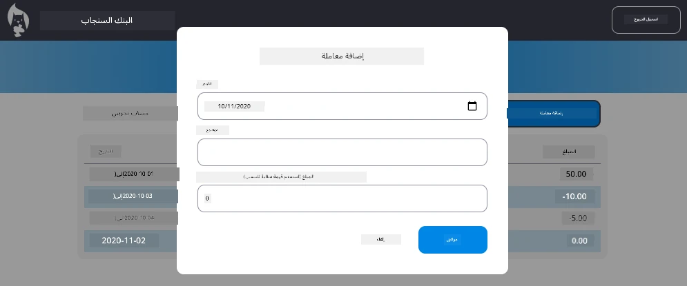

<!--
CO_OP_TRANSLATOR_METADATA:
{
  "original_hash": "50a7783473b39a2e0f133e271a102231",
  "translation_date": "2025-10-22T14:19:28+00:00",
  "source_file": "7-bank-project/4-state-management/assignment.md",
  "language_code": "ar"
}
-->
# تنفيذ مربع حوار "إضافة معاملة"

## نظرة عامة

تطبيقك البنكي الآن يتمتع بإدارة حالة قوية وحفظ البيانات، لكنه يفتقد ميزة أساسية تحتاجها التطبيقات البنكية الحقيقية: القدرة على السماح للمستخدمين بإضافة معاملاتهم الخاصة. في هذه المهمة، ستقوم بتنفيذ مربع حوار "إضافة معاملة" متكامل يتماشى بسلاسة مع نظام إدارة الحالة الحالي لديك.

تجمع هذه المهمة بين كل ما تعلمته في الدروس الأربعة الخاصة بالتطبيق البنكي: إنشاء قوالب HTML، التعامل مع النماذج، التكامل مع واجهات برمجة التطبيقات (API)، وإدارة الحالة.

## أهداف التعلم

عند إكمال هذه المهمة، ستتمكن من:
- **إنشاء** واجهة مربع حوار سهلة الاستخدام لإدخال البيانات
- **تنفيذ** تصميم نموذج يمكن الوصول إليه باستخدام لوحة المفاتيح ودعم قارئ الشاشة
- **دمج** الميزات الجديدة مع نظام إدارة الحالة الحالي لديك
- **ممارسة** التواصل مع واجهات برمجة التطبيقات ومعالجة الأخطاء
- **تطبيق** أنماط تطوير الويب الحديثة على ميزة واقعية

## التعليمات

### الخطوة 1: زر إضافة معاملة

**قم بإنشاء** زر "إضافة معاملة" في صفحة لوحة التحكم بحيث يمكن للمستخدمين العثور عليه بسهولة واستخدامه.

**المتطلبات:**
- **ضع** الزر في مكان منطقي في لوحة التحكم
- **استخدم** نصًا واضحًا وموجهًا للإجراء على الزر
- **صمم** الزر ليتماشى مع تصميم واجهة المستخدم الحالية لديك
- **تأكد** من أن الزر يمكن الوصول إليه باستخدام لوحة المفاتيح

### الخطوة 2: تنفيذ مربع الحوار

اختر أحد النهجين التاليين لتنفيذ مربع الحوار:

**الخيار أ: صفحة منفصلة**
- **قم بإنشاء** قالب HTML جديد لنموذج المعاملة
- **أضف** مسارًا جديدًا إلى نظام التوجيه الخاص بك
- **نفذ** التنقل إلى ومن صفحة النموذج

**الخيار ب: مربع حوار (موصى به)**
- **استخدم** JavaScript لإظهار/إخفاء مربع الحوار دون مغادرة لوحة التحكم
- **نفذ** باستخدام خاصية [`hidden`](https://developer.mozilla.org/docs/Web/HTML/Global_attributes/hidden) أو فئات CSS
- **قم بإنشاء** تجربة مستخدم سلسة مع إدارة تركيز مناسبة

### الخطوة 3: تنفيذ إمكانية الوصول

**تأكد** من أن مربع الحوار يفي بمعايير [إمكانية الوصول لمربعات الحوار](https://developer.paciellogroup.com/blog/2018/06/the-current-state-of-modal-dialog-accessibility/):

**التنقل باستخدام لوحة المفاتيح:**
- **دعم** مفتاح Escape لإغلاق مربع الحوار
- **حبس** التركيز داخل مربع الحوار عند فتحه
- **إعادة** التركيز إلى زر التشغيل عند إغلاقه

**دعم قارئ الشاشة:**
- **أضف** تسميات وأدوار ARIA المناسبة
- **أعلن** عن فتح/إغلاق مربع الحوار لقارئات الشاشة
- **وفر** تسميات واضحة لحقول النموذج ورسائل الخطأ

### الخطوة 4: إنشاء النموذج

**صمم** نموذج HTML لجمع بيانات المعاملة:

**الحقول المطلوبة:**
- **التاريخ**: وقت حدوث المعاملة
- **الوصف**: سبب المعاملة
- **المبلغ**: قيمة المعاملة (إيجابي للدخل، سلبي للنفقات)

**ميزات النموذج:**
- **تحقق** من صحة إدخال المستخدم قبل الإرسال
- **وفر** رسائل خطأ واضحة للبيانات غير الصالحة
- **قم بتضمين** نصوص توضيحية وعلامات مساعدة
- **صمم** النموذج بما يتماشى مع التصميم الحالي لديك

### الخطوة 5: التكامل مع واجهة برمجة التطبيقات

**قم بتوصيل** النموذج بواجهة برمجة التطبيقات الخلفية:

**خطوات التنفيذ:**
- **راجع** [مواصفات واجهة برمجة التطبيقات](../api/README.md) للحصول على نقطة النهاية الصحيحة وتنسيق البيانات
- **قم بإنشاء** بيانات JSON من مدخلات النموذج
- **أرسل** البيانات إلى واجهة برمجة التطبيقات مع معالجة الأخطاء المناسبة
- **اعرض** رسائل النجاح/الفشل للمستخدم
- **تعامل** مع أخطاء الشبكة بشكل جيد

### الخطوة 6: التكامل مع إدارة الحالة

**قم بتحديث** لوحة التحكم مع المعاملة الجديدة:

**متطلبات التكامل:**
- **قم بتحديث** بيانات الحساب بعد إضافة المعاملة بنجاح
- **قم بتحديث** عرض لوحة التحكم دون الحاجة إلى إعادة تحميل الصفحة
- **تأكد** من ظهور المعاملة الجديدة فورًا
- **حافظ** على تناسق الحالة بشكل صحيح طوال العملية

## المواصفات التقنية

**تفاصيل نقطة النهاية لواجهة برمجة التطبيقات:**
راجع [وثائق واجهة برمجة التطبيقات](../api/README.md) للحصول على:
- تنسيق JSON المطلوب لبيانات المعاملة
- طريقة HTTP وعنوان URL لنقطة النهاية
- تنسيق الاستجابة المتوقع
- معالجة استجابات الأخطاء

**النتيجة المتوقعة:**
بعد إكمال هذه المهمة، يجب أن يحتوي تطبيقك البنكي على ميزة "إضافة معاملة" كاملة الوظائف تبدو وتعمل بشكل احترافي:

## اختبار التنفيذ الخاص بك

**اختبار الوظائف:**
1. **تحقق** من أن زر "إضافة معاملة" واضح ويمكن الوصول إليه
2. **اختبر** أن مربع الحوار يفتح ويغلق بشكل صحيح
3. **أكد** أن التحقق من صحة النموذج يعمل لجميع الحقول المطلوبة
4. **تحقق** من أن المعاملات الناجحة تظهر فورًا في لوحة التحكم
5. **تأكد** من أن معالجة الأخطاء تعمل للبيانات غير الصالحة ومشاكل الشبكة

**اختبار إمكانية الوصول:**
1. **تنقل** عبر العملية بأكملها باستخدام لوحة المفاتيح فقط
2. **اختبر** باستخدام قارئ الشاشة للتأكد من الإعلانات المناسبة
3. **تحقق** من أن إدارة التركيز تعمل بشكل صحيح
4. **تأكد** من أن جميع عناصر النموذج تحتوي على تسميات مناسبة

## جدول التقييم

| المعايير | ممتاز | مقبول | يحتاج إلى تحسين |
| -------- | ------ | ------ | --------------- |
| **الوظائف** | ميزة إضافة المعاملة تعمل بشكل مثالي مع تجربة مستخدم ممتازة وتتبع جميع أفضل الممارسات من الدروس | ميزة إضافة المعاملة تعمل بشكل صحيح ولكن قد لا تتبع بعض أفضل الممارسات أو تحتوي على مشاكل بسيطة في سهولة الاستخدام | ميزة إضافة المعاملة تعمل جزئيًا أو تحتوي على مشاكل كبيرة في سهولة الاستخدام |
| **جودة الكود** | الكود منظم جيدًا، يتبع الأنماط المعتمدة، يتضمن معالجة الأخطاء بشكل صحيح، ويتكامل بسلاسة مع إدارة الحالة الحالية | الكود يعمل ولكن قد يحتوي على بعض مشاكل التنظيم أو أنماط غير متناسقة مع قاعدة الكود الحالية | الكود يحتوي على مشاكل هيكلية كبيرة أو لا يتكامل جيدًا مع الأنماط الحالية |
| **إمكانية الوصول** | دعم كامل للتنقل باستخدام لوحة المفاتيح، توافق مع قارئ الشاشة، ويتبع إرشادات WCAG مع إدارة تركيز ممتازة | تم تنفيذ ميزات إمكانية الوصول الأساسية ولكن قد تكون هناك بعض الميزات المفقودة للتنقل باستخدام لوحة المفاتيح أو قارئ الشاشة | لم يتم تنفيذ اعتبارات إمكانية الوصول أو تم تنفيذها بشكل محدود |
| **تجربة المستخدم** | واجهة بديهية ومصقولة مع ردود فعل واضحة، تفاعلات سلسة، ومظهر احترافي | تجربة مستخدم جيدة مع بعض المجالات التي تحتاج إلى تحسين في ردود الفعل أو التصميم البصري | تجربة مستخدم ضعيفة مع واجهة مربكة أو نقص في ردود الفعل للمستخدم |

## تحديات إضافية (اختياري)

بعد إكمال المتطلبات الأساسية، فكر في هذه التحسينات:

**ميزات محسنة:**
- **أضف** فئات للمعاملات (طعام، مواصلات، ترفيه، إلخ)
- **نفذ** التحقق من صحة الإدخال مع ردود فعل في الوقت الفعلي
- **قم بإنشاء** اختصارات لوحة المفاتيح للمستخدمين المحترفين
- **أضف** إمكانية تعديل وحذف المعاملات

**تكامل متقدم:**
- **نفذ** وظيفة التراجع للمعاملات التي تمت إضافتها مؤخرًا
- **أضف** استيراد معاملات بالجملة من ملفات CSV
- **قم بإنشاء** بحث وتصنيف للمعاملات
- **نفذ** وظيفة تصدير البيانات

ستساعدك هذه الميزات الاختيارية على ممارسة مفاهيم تطوير الويب المتقدمة وإنشاء تطبيق بنكي أكثر اكتمالًا!

---

**إخلاء المسؤولية**:  
تم ترجمة هذا المستند باستخدام خدمة الترجمة بالذكاء الاصطناعي [Co-op Translator](https://github.com/Azure/co-op-translator). بينما نسعى لتحقيق الدقة، يرجى العلم أن الترجمات الآلية قد تحتوي على أخطاء أو عدم دقة. يجب اعتبار المستند الأصلي بلغته الأصلية المصدر الموثوق. للحصول على معلومات حاسمة، يُوصى بالترجمة البشرية الاحترافية. نحن غير مسؤولين عن أي سوء فهم أو تفسيرات خاطئة تنشأ عن استخدام هذه الترجمة.