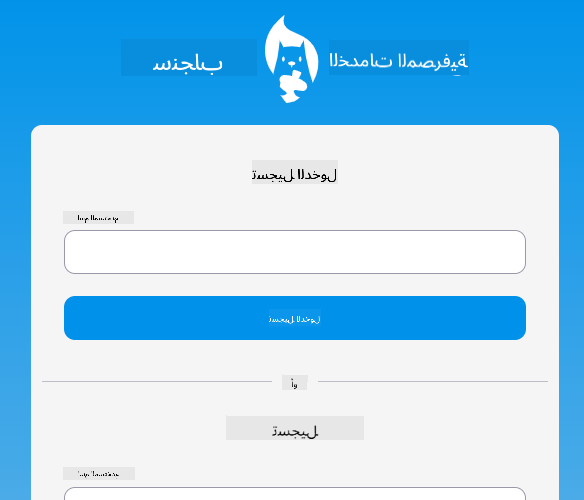

<!--
CO_OP_TRANSLATOR_METADATA:
{
  "original_hash": "830359535306594b448db6575ce5cdee",
  "translation_date": "2025-08-26T00:02:35+00:00",
  "source_file": "7-bank-project/README.md",
  "language_code": "ar"
}
-->
# :dollar: بناء بنك

في هذا المشروع، ستتعلم كيفية بناء بنك خيالي. تتضمن هذه الدروس تعليمات حول كيفية تصميم تطبيق ويب وتوفير المسارات، بناء النماذج، إدارة الحالة، وجلب البيانات من واجهة برمجية (API) يمكنك من خلالها الحصول على بيانات البنك.

|  |  |
|--------------------------------|--------------------------------|

## الدروس

1. [قوالب HTML والمسارات في تطبيق ويب](1-template-route/README.md)
2. [بناء نموذج تسجيل الدخول والتسجيل](2-forms/README.md)
3. [طرق جلب واستخدام البيانات](3-data/README.md)
4. [مفاهيم إدارة الحالة](4-state-management/README.md)

### الشكر والتقدير

تم كتابة هذه الدروس بكل :hearts: بواسطة [يوهان لاسورسا](https://twitter.com/sinedied).

إذا كنت مهتمًا بتعلم كيفية بناء [واجهة برمجية للخادم](/7-bank-project/api/README.md) المستخدمة في هذه الدروس، يمكنك متابعة [هذه السلسلة من الفيديوهات](https://aka.ms/NodeBeginner) (خصوصًا الفيديوهات من 17 إلى 21).

يمكنك أيضًا إلقاء نظرة على [هذا الدرس التفاعلي في Learn](https://aka.ms/learn/express-api).

**إخلاء المسؤولية**:  
تم ترجمة هذا المستند باستخدام خدمة الترجمة بالذكاء الاصطناعي [Co-op Translator](https://github.com/Azure/co-op-translator). بينما نسعى لتحقيق الدقة، يرجى العلم أن الترجمات الآلية قد تحتوي على أخطاء أو معلومات غير دقيقة. يجب اعتبار المستند الأصلي بلغته الأصلية المصدر الموثوق. للحصول على معلومات حاسمة، يُوصى بالاستعانة بترجمة بشرية احترافية. نحن غير مسؤولين عن أي سوء فهم أو تفسيرات خاطئة تنشأ عن استخدام هذه الترجمة.