<!--
CO_OP_TRANSLATOR_METADATA:
{
  "original_hash": "a9a3bcc037a447e2d8994d99e871cd9f",
  "translation_date": "2025-11-03T12:27:54+00:00",
  "source_file": "8-code-editor/1-using-a-code-editor/README.md",
  "language_code": "ar"
}
-->
# استخدام محرر الأكواد: إتقان VSCode.dev

تذكر في *The Matrix* عندما كان على نيو الاتصال بجهاز كمبيوتر ضخم للوصول إلى العالم الرقمي؟ أدوات تطوير الويب اليوم هي القصة المعاكسة - قدرات قوية للغاية يمكن الوصول إليها من أي مكان. VSCode.dev هو محرر أكواد يعمل عبر المتصفح ويقدم أدوات تطوير احترافية لأي جهاز متصل بالإنترنت.

تمامًا كما جعلت الطباعة الكتب متاحة للجميع وليس فقط للكتّاب في الأديرة، فإن VSCode.dev يدمقرط البرمجة. يمكنك العمل على المشاريع من جهاز كمبيوتر في المكتبة، أو مختبر المدرسة، أو أي مكان يمكنك الوصول فيه إلى المتصفح. لا حاجة للتثبيت، ولا قيود "أحتاج إلى إعداد معين".

بنهاية هذا الدرس، ستفهم كيفية التنقل في VSCode.dev، فتح مستودعات GitHub مباشرة في المتصفح، واستخدام Git للتحكم في الإصدارات - مهارات يعتمد عليها المطورون المحترفون يوميًا.

## ⚡ ما يمكنك القيام به في الـ 5 دقائق القادمة

**مسار البداية السريع للمطورين المشغولين**


- **الدقيقة الأولى**: انتقل إلى [vscode.dev](https://vscode.dev) - لا حاجة للتثبيت
- **الدقيقة الثانية**: قم بتسجيل الدخول باستخدام GitHub لربط مستودعاتك
- **الدقيقة الثالثة**: جرب خدعة الرابط: قم بتغيير `github.com` إلى `vscode.dev/github` في أي رابط مستودع
- **الدقيقة الرابعة**: أنشئ ملفًا جديدًا وشاهد تمييز بناء الجملة يعمل تلقائيًا
- **الدقيقة الخامسة**: قم بإجراء تغيير وقم بتثبيته من خلال لوحة التحكم في المصدر

**رابط اختبار سريع**:
```
# Transform this:
github.com/microsoft/Web-Dev-For-Beginners

# Into this:
vscode.dev/github/microsoft/Web-Dev-For-Beginners
```

**لماذا هذا مهم**: في 5 دقائق، ستختبر حرية البرمجة في أي مكان باستخدام أدوات احترافية. هذا يمثل مستقبل التطوير - الوصول السهل، القوة، والفورية.

## 🗺️ رحلتك التعليمية عبر تطوير السحابة

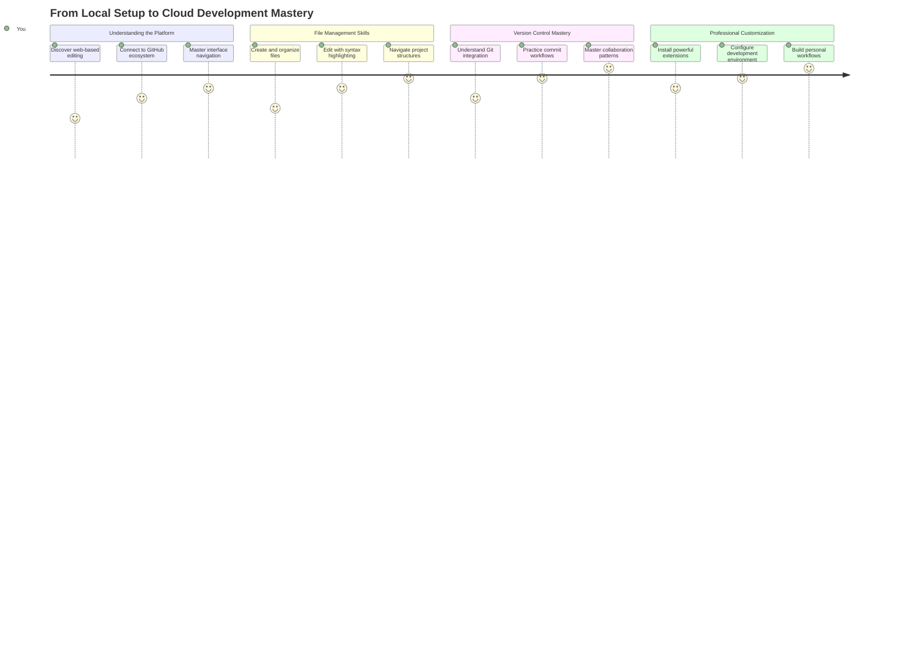

**وجهة رحلتك**: بنهاية هذا الدرس، ستكون قد أتقنت بيئة تطوير سحابية احترافية تعمل من أي جهاز، مما يتيح لك البرمجة باستخدام نفس الأدوات التي يستخدمها المطورون في شركات التكنولوجيا الكبرى.

## ما ستتعلمه

بعد أن نمر بهذا معًا، ستتمكن من:

- التنقل في VSCode.dev وكأنه منزلك الثاني - العثور على كل ما تحتاجه دون أن تضيع
- فتح أي مستودع GitHub في المتصفح والبدء في التحرير فورًا (هذا سحري جدًا!)
- استخدام Git لتتبع تغييراتك وحفظ تقدمك كمحترف
- تعزيز محررك بالإضافات التي تجعل البرمجة أسرع وأكثر متعة
- إنشاء وتنظيم ملفات المشاريع بثقة

## ما ستحتاجه

المتطلبات بسيطة:

- حساب مجاني على [GitHub](https://github.com) (سنرشدك خلال عملية الإنشاء إذا لزم الأمر)
- معرفة أساسية بمتصفحات الويب
- درس أساسيات GitHub يوفر خلفية مفيدة، رغم أنه ليس ضروريًا

> 💡 **جديد على GitHub؟** إنشاء حساب مجاني ويستغرق دقائق. مثلما تمنحك بطاقة المكتبة الوصول إلى الكتب في جميع أنحاء العالم، يفتح حساب GitHub أبوابًا لمستودعات الأكواد عبر الإنترنت.

## 🧠 نظرة عامة على نظام تطوير السحابة

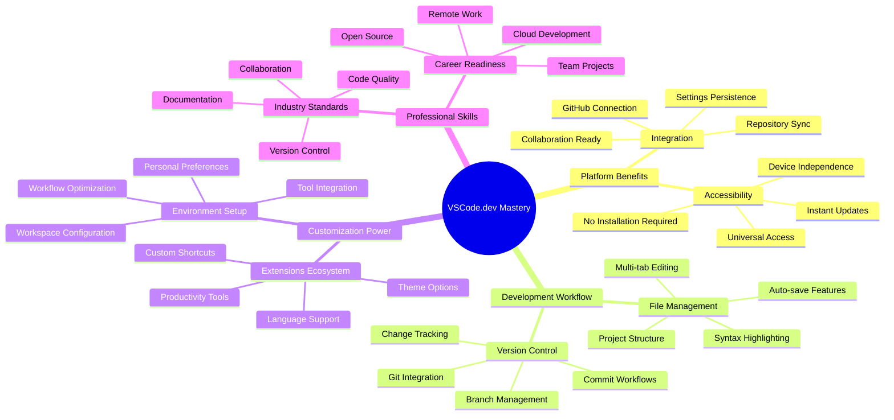

**المبدأ الأساسي**: تمثل بيئات التطوير السحابية مستقبل البرمجة - حيث توفر أدوات احترافية يمكن الوصول إليها، تعاونية، ومستقلة عن المنصة.

## لماذا تهم محررات الأكواد عبر الإنترنت

قبل الإنترنت، لم يكن بإمكان العلماء في الجامعات المختلفة مشاركة الأبحاث بسهولة. ثم جاء ARPANET في الستينيات، وربط أجهزة الكمبيوتر عبر المسافات. محررات الأكواد عبر الإنترنت تتبع نفس المبدأ - جعل الأدوات القوية متاحة بغض النظر عن موقعك الجغرافي أو جهازك.

محرر الأكواد هو مساحة عمل التطوير الخاصة بك، حيث تكتب، تعدل، وتنظم ملفات الأكواد. على عكس محررات النصوص البسيطة، توفر محررات الأكواد الاحترافية تمييز بناء الجملة، اكتشاف الأخطاء، وميزات إدارة المشاريع.

VSCode.dev يجلب هذه القدرات إلى متصفحك:

**مزايا التحرير عبر الإنترنت:**

| الميزة | الوصف | الفائدة العملية |
|---------|-------------|----------|
| **استقلالية المنصة** | يعمل على أي جهاز يحتوي على متصفح | العمل بسلاسة من أجهزة مختلفة |
| **لا حاجة للتثبيت** | الوصول عبر رابط ويب | تجاوز قيود تثبيت البرامج |
| **التحديثات التلقائية** | يعمل دائمًا بأحدث إصدار | الوصول إلى الميزات الجديدة دون تحديثات يدوية |
| **تكامل المستودعات** | اتصال مباشر بـ GitHub | تحرير الأكواد دون إدارة الملفات المحلية |

**التطبيقات العملية:**
- استمرارية العمل عبر بيئات مختلفة
- واجهة متسقة بغض النظر عن نظام التشغيل
- إمكانيات التعاون الفورية
- تقليل متطلبات التخزين المحلي

## استكشاف VSCode.dev

تمامًا كما احتوى مختبر ماري كوري على معدات متطورة في مساحة بسيطة نسبيًا، يضم VSCode.dev أدوات تطوير احترافية في واجهة متصفح. يقدم هذا التطبيق الويب نفس الوظائف الأساسية لمحررات الأكواد المكتبية.

ابدأ بالتوجه إلى [vscode.dev](https://vscode.dev) في متصفحك. يتم تحميل الواجهة دون تنزيلات أو تثبيتات نظام - تطبيق مباشر لمبادئ الحوسبة السحابية.

### ربط حساب GitHub الخاص بك

مثلما ربط هاتف ألكسندر جراهام بيل المواقع البعيدة، فإن ربط حساب GitHub الخاص بك يربط VSCode.dev بمستودعات الأكواد الخاصة بك. عند مطالبتك بتسجيل الدخول باستخدام GitHub، يُوصى بقبول هذا الاتصال.

**يوفر تكامل GitHub:**
- الوصول المباشر إلى مستودعاتك داخل المحرر
- إعدادات ومكونات إضافية متزامنة عبر الأجهزة
- سير عمل حفظ مبسط إلى GitHub
- بيئة تطوير مخصصة

### التعرف على مساحة العمل الجديدة الخاصة بك

بمجرد تحميل كل شيء، سترى مساحة عمل نظيفة مصممة لتبقيك مركزًا على ما يهم - الأكواد الخاصة بك!

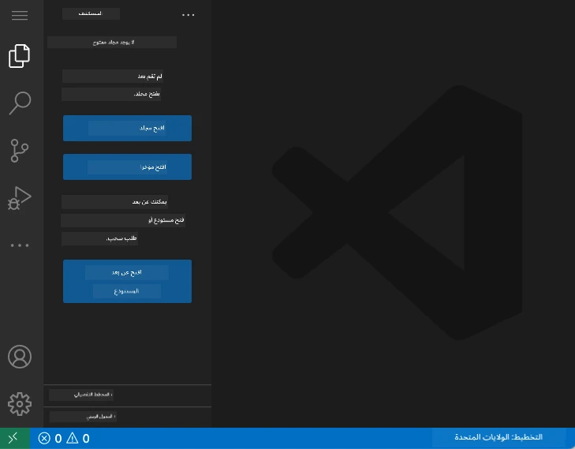

**إليك جولة في الحي:**
- **شريط النشاط** (الشريط الموجود على اليسار): التنقل الرئيسي الخاص بك مع المستكشف 📁، البحث 🔍، التحكم في المصدر 🌿، الإضافات 🧩، والإعدادات ⚙️
- **الشريط الجانبي** (اللوحة المجاورة له): يتغير ليعرض لك معلومات ذات صلة بناءً على ما اخترته
- **منطقة التحرير** (المساحة الكبيرة في المنتصف): هنا يحدث السحر - منطقة البرمجة الرئيسية الخاصة بك

**خذ لحظة لاستكشاف:**
- انقر حول أيقونات شريط النشاط وشاهد ما يفعله كل منها
- لاحظ كيف يقوم الشريط الجانبي بتحديث المعلومات المختلفة - رائع، أليس كذلك؟
- عرض المستكشف (📁) هو المكان الذي ستقضي فيه معظم وقتك، لذا كن مرتاحًا معه

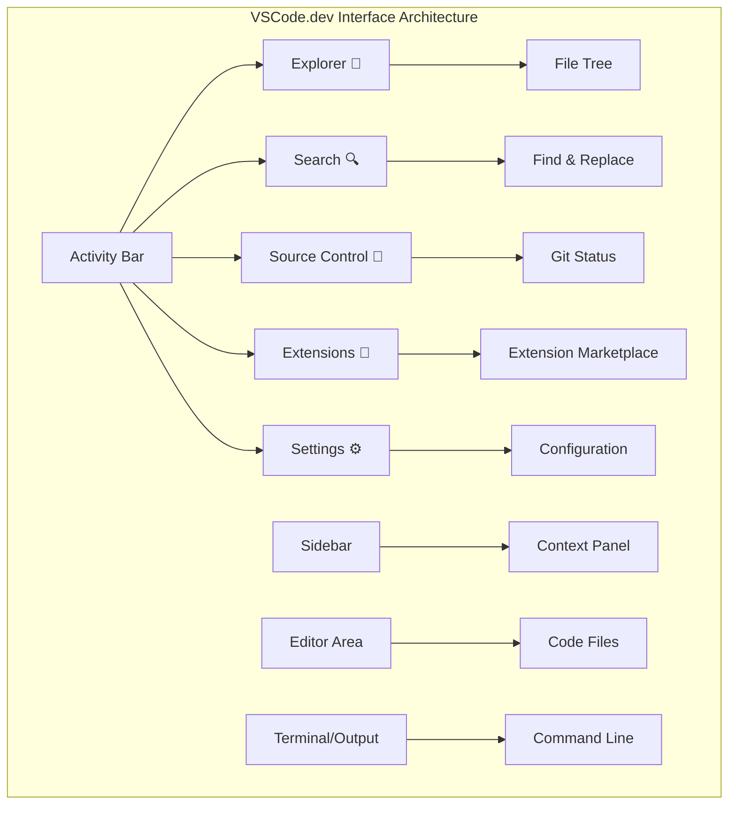

## فتح مستودعات GitHub

قبل الإنترنت، كان الباحثون يضطرون للسفر فعليًا إلى المكتبات للوصول إلى الوثائق. تعمل مستودعات GitHub بشكل مشابه - فهي مجموعات من الأكواد المخزنة عن بُعد. يلغي VSCode.dev الخطوة التقليدية لتنزيل المستودعات إلى جهازك المحلي قبل التحرير.

تتيح هذه القدرة الوصول الفوري إلى أي مستودع عام للعرض، التحرير، أو المساهمة. إليك طريقتين لفتح المستودعات:

### الطريقة الأولى: الطريقة السهلة بالنقر

هذه الطريقة مثالية عندما تبدأ جديدًا في VSCode.dev وترغب في فتح مستودع معين. إنها مباشرة وسهلة للمبتدئين:

**إليك كيفية القيام بذلك:**

1. توجه إلى [vscode.dev](https://vscode.dev) إذا لم تكن هناك بالفعل
2. ابحث عن زر "فتح مستودع عن بُعد" على شاشة الترحيب وانقر عليه

   

3. قم بلصق أي رابط مستودع GitHub (جرب هذا: `https://github.com/microsoft/Web-Dev-For-Beginners`)
4. اضغط على Enter وشاهد السحر يحدث!

**نصيحة احترافية - اختصار لوحة الأوامر:**

هل تريد أن تشعر وكأنك ساحر برمجة؟ جرب هذا الاختصار: Ctrl+Shift+P (أو Cmd+Shift+P على Mac) لفتح لوحة الأوامر:

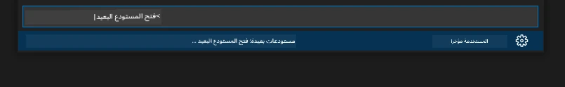

**لوحة الأوامر تشبه وجود محرك بحث لكل ما يمكنك القيام به:**
- اكتب "فتح عن بُعد" وستجد أداة فتح المستودعات
- تتذكر المستودعات التي فتحتها مؤخرًا (مفيد جدًا!)
- بمجرد أن تعتاد عليها، ستشعر وكأنك تبرمج بسرعة البرق
- إنها أساسًا نسخة VSCode.dev من "Hey Siri، ولكن للبرمجة"

### الطريقة الثانية: تقنية تعديل الرابط

مثلما تستخدم HTTP و HTTPS بروتوكولات مختلفة مع الحفاظ على نفس هيكل النطاق، يستخدم VSCode.dev نمط رابط يعكس نظام عناوين GitHub. يمكن تعديل أي رابط مستودع GitHub ليفتح مباشرة في VSCode.dev.

**نمط تحويل الرابط:**

| نوع المستودع | رابط GitHub | رابط VSCode.dev |
|----------------|---------------------|----------------|
| **مستودع عام** | `github.com/microsoft/Web-Dev-For-Beginners` | `vscode.dev/github/microsoft/Web-Dev-For-Beginners` |
| **مشروع شخصي** | `github.com/your-username/my-project` | `vscode.dev/github/your-username/my-project` |
| **أي مستودع يمكن الوصول إليه** | `github.com/their-username/awesome-repo` | `vscode.dev/github/their-username/awesome-repo` |

**التنفيذ:**
- استبدل `github.com` بـ `vscode.dev/github`
- حافظ على جميع مكونات الرابط الأخرى دون تغيير
- يعمل مع أي مستودع يمكن الوصول إليه علنًا
- يوفر الوصول الفوري للتحرير

> 💡 **نصيحة تغير الحياة**: قم بوضع إشارات مرجعية لإصدارات VSCode.dev من مستودعاتك المفضلة. لدي إشارات مرجعية مثل "تحرير ملفي الشخصي" و "إصلاح الوثائق" التي تأخذني مباشرة إلى وضع التحرير!

**أي طريقة يجب أن تستخدم؟**
- **الطريقة عبر الواجهة**: رائعة عندما تستكشف أو لا تتذكر أسماء المستودعات بالضبط
- **خدعة الرابط**: مثالية للوصول السريع عندما تعرف بالضبط إلى أين تذهب

### 🎯 التحقق التربوي: الوصول إلى تطوير السحابة

**توقف وتأمل**: لقد تعلمت للتو طريقتين للوصول إلى مستودعات الأكواد عبر متصفح الويب. هذا يمثل تحولًا أساسيًا في كيفية عمل التطوير.

**تقييم ذاتي سريع**:
- هل يمكنك شرح لماذا يلغي التحرير عبر الإنترنت إعداد "بيئة التطوير التقليدية"؟
- ما المزايا التي توفرها تقنية تعديل الرابط مقارنة باستنساخ git المحلي؟
- كيف يغير هذا النهج الطريقة التي قد تساهم بها في مشاريع المصدر المفتوح؟

**اتصال بالعالم الحقيقي**: شركات كبرى مثل GitHub، GitLab، و Replit قامت ببناء منصات التطوير الخاصة بها حول هذه المبادئ السحابية أولاً. أنت تتعلم نفس سير العمل الذي تستخدمه فرق التطوير الاحترافية في جميع أنحاء العالم.

**سؤال التحدي**: كيف يمكن أن يغير التطوير السحابي الطريقة التي يتم بها تعليم البرمجة في المدارس؟ فكر في متطلبات الأجهزة، إدارة البرامج، وإمكانيات التعاون.

## العمل مع الملفات والمشاريع

الآن بعد أن فتحت مستودعًا، دعنا نبدأ البناء! يوفر لك VSCode.dev كل ما تحتاجه لإنشاء، تحرير، وتنظيم ملفات الأكواد الخاصة بك. فكر فيه كأنه ورشة عمل رقمية - كل أداة موجودة حيث تحتاجها.

دعونا نتعمق في المهام اليومية التي ستشكل معظم سير عمل البرمجة الخاص بك.

### إنشاء ملفات جديدة

مثل تنظيم المخططات في مكتب المهندس المعماري، يتبع إنشاء الملفات في VSCode.dev نهجًا منظمًا. يدعم النظام جميع أنواع ملفات تطوير الويب القياسية.

**عملية إنشاء الملفات:**

1. انتقل إلى المجلد الهدف في الشريط الجانبي للمستكشف
2. قم بالتحويم فوق اسم المجلد للكشف عن أيقونة "ملف جديد" (📄+)
3. أدخل اسم الملف بما في ذلك الامتداد المناسب (`style.css`, `script.js`, `index.html`)
4. اضغط على Enter لإنشاء الملف

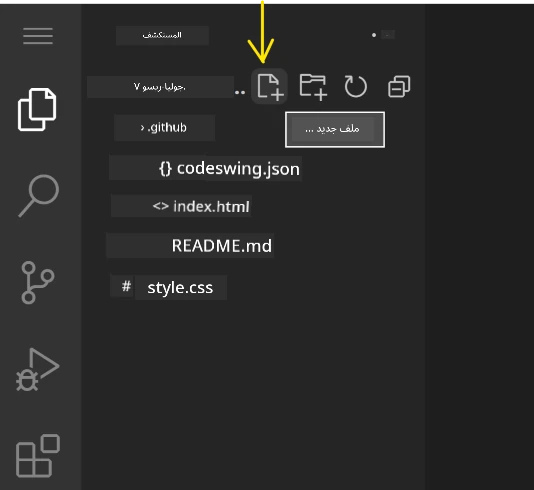

**اتفاقيات التسمية:**
- استخدم أسماء وصفية تشير إلى غرض الملف
- قم بتضمين الامتدادات للحصول على تمييز بناء الجملة المناسب
- اتبع أنماط تسمية متسقة في جميع المشاريع
- استخدم الأحرف الصغيرة والشرطات بدلاً من المسافات

### تحرير الملفات وحفظها

هنا تبدأ المتعة الحقيقية! محرر VSCode.dev مليء بالميزات المفيدة التي تجعل البرمجة سلسة وبديهية. إنه مثل وجود مساعد كتابة ذكي جدًا، ولكن للأكواد.

**سير عمل التحرير الخاص بك:**

1. انقر على أي ملف في المستكشف لفتحه في المنطقة الرئيسية
2. ابدأ الكتابة وشاهد VSCode.dev يساعدك بالألوان، الاقتراحات، واكتشاف الأخطاء
3. احفظ عملك باستخدام Ctrl+S (Windows/Linux) أو Cmd+S (Mac) - رغم أنه يحفظ تلقائيًا أيضًا!

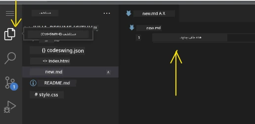

**الأشياء الرائعة التي تحدث أثناء البرمجة:**
- يتم تلوين الأكواد بشكل جميل بحيث يسهل قراءتها
- يقترح VSCode.dev إكمالات أثناء الكتابة (مثل التصحيح التلقائي، ولكن أكثر ذكاءً)
- يكتشف الأخطاء والأخطاء قبل أن تحفظ حتى
- يمكنك فتح ملفات متعددة في علامات تبويب، تمامًا مثل المتصفح
- يتم حفظ كل شيء تلقائيًا في الخلفية

> ⚠️ **نصيحة سريعة**: رغم أن الحفظ التلقائي يدعمك، فإن الضغط على Ctrl+S أو Cmd+S لا يزال عادة جيدة. يحفظ كل شيء فورًا ويشغل بعض الميزات الإضافية المفيدة مثل التحقق من الأخطاء.

### التحكم في الإصدارات باستخدام Git

مثلما يقوم علماء الآثار بإنشاء سجلات مفصلة لطبقات الحفريات، يتتبع Git التغييرات في الأكواد الخاصة بك بمرور الوقت. يحافظ هذا النظام على تاريخ المشروع ويمكنك من العودة إلى الإصدارات السابقة عند الحاجة. يتضمن VSCode.dev وظائف Git مدمجة.

**واجهة التحكم في المصدر:**

1. الوصول إلى لوحة التحكم في المصدر عبر أيقونة 🌿 في شريط النشاط
2. تظهر الملفات المعدلة في قسم "التغييرات"
3. يشير الترميز اللوني إلى أنواع التغييرات: الأخضر للإضافات، الأحمر للحذف

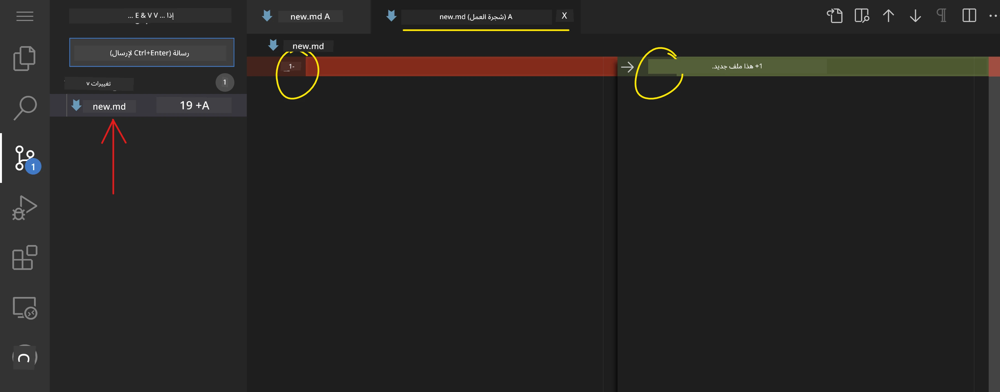

**حفظ عملك (سير عمل التثبيت):**

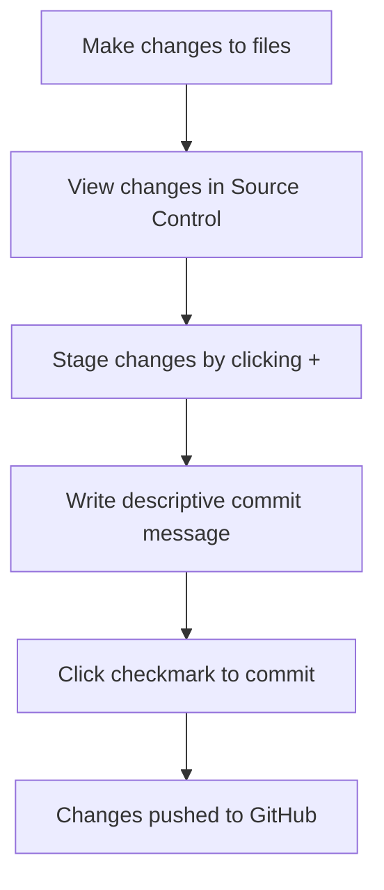

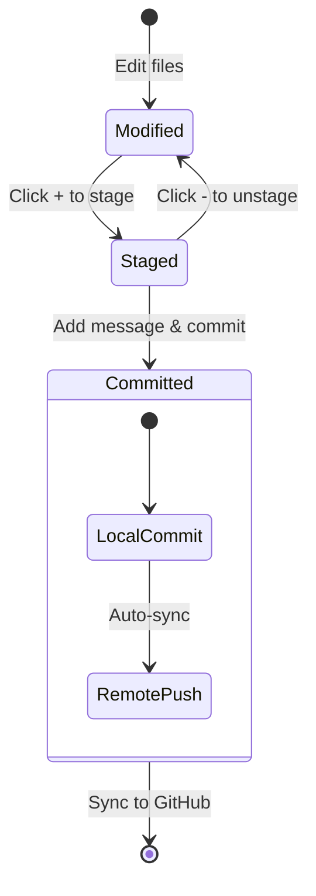

**إليك العملية خطوة بخطوة:**
- انقر على أيقونة "+" بجانب الملفات التي تريد حفظها (هذا "يجهزها")
- تحقق جيدًا من أنك راضٍ عن جميع التغييرات التي قمت بتجهيزها
- اكتب ملاحظة قصيرة تشرح ما قمت به (هذه هي "رسالة الالتزام")
- انقر على زر علامة الاختيار لحفظ كل شيء على GitHub
- إذا غيرت رأيك بشأن شيء ما، فإن رمز التراجع يتيح لك التخلص من التغييرات

**كتابة رسائل الالتزام الجيدة (أسهل مما تعتقد!):**
- فقط صف ما قمت به، مثل "إضافة نموذج اتصال" أو "إصلاح التنقل المعطل"
- اجعلها قصيرة وبسيطة – فكر في طول تغريدة، وليس مقال
- ابدأ بكلمات فعلية مثل "إضافة"، "إصلاح"، "تحديث"، أو "إزالة"
- **أمثلة جيدة**: "إضافة قائمة تنقل متجاوبة"، "إصلاح مشاكل تخطيط الهاتف المحمول"، "تحديث الألوان لتحسين إمكانية الوصول"

> 💡 **نصيحة للتنقل السريع**: استخدم قائمة الهامبرغر (☰) في أعلى اليسار للعودة إلى مستودع GitHub الخاص بك ورؤية التغييرات التي قمت بحفظها عبر الإنترنت. إنها مثل بوابة بين بيئة التحرير الخاصة بك وموطن مشروعك على GitHub!

## تحسين الوظائف باستخدام الإضافات

كما يحتوي ورشة الحرفي على أدوات متخصصة لمهام مختلفة، يمكن تخصيص VSCode.dev باستخدام الإضافات التي تضيف قدرات محددة. تعالج هذه الإضافات التي طورها المجتمع احتياجات التطوير الشائعة مثل تنسيق الكود، العرض المباشر، وتعزيز تكامل Git.

يستضيف سوق الإضافات آلاف الأدوات المجانية التي أنشأها المطورون حول العالم. كل إضافة تحل تحديات سير العمل المحددة، مما يتيح لك بناء بيئة تطوير مخصصة تناسب احتياجاتك وتفضيلاتك الخاصة.

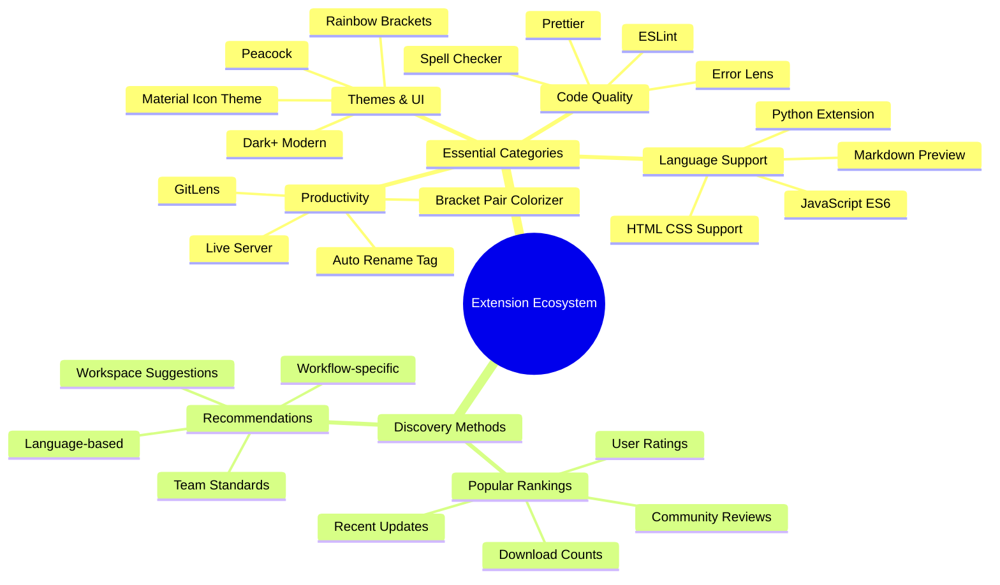

### العثور على الإضافات المثالية

سوق الإضافات منظم بشكل جيد للغاية، لذا لن تضيع أثناء البحث عما تحتاجه. تم تصميمه لمساعدتك في اكتشاف الأدوات المحددة وأشياء رائعة لم تكن تعرف بوجودها!

**الوصول إلى السوق:**

1. انقر على رمز الإضافات (🧩) في شريط النشاط
2. تصفح أو ابحث عن شيء محدد
3. انقر على أي شيء يبدو مثيرًا للاهتمام لمعرفة المزيد عنه

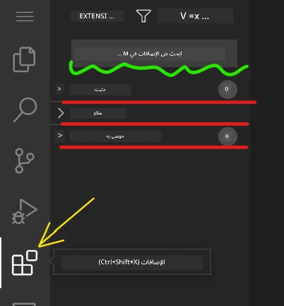

**ما ستراه هناك:**

| القسم | ما بداخله | لماذا هو مفيد |
|----------|---------|----------|
| **المثبتة** | الإضافات التي قمت بإضافتها بالفعل | مجموعة أدوات البرمجة الشخصية الخاصة بك |
| **الشائعة** | المفضلة لدى الجميع | ما يوصي به معظم المطورين |
| **الموصى بها** | اقتراحات ذكية لمشروعك | توصيات مفيدة من VSCode.dev |

**ما يجعل التصفح سهلاً:**
- كل إضافة تعرض التقييمات، عدد التنزيلات، ومراجعات المستخدمين الحقيقية
- تحصل على لقطات شاشة ووصف واضح لما تقوم به كل واحدة
- كل شيء محدد بوضوح بمعلومات التوافق
- يتم اقتراح إضافات مشابهة لتتمكن من مقارنة الخيارات

### تثبيت الإضافات (سهل للغاية!)

إضافة قدرات جديدة إلى محررك بسيطة مثل النقر على زر. تثبت الإضافات في ثوانٍ وتبدأ العمل فورًا – لا حاجة لإعادة التشغيل أو الانتظار.

**كل ما عليك فعله:**

1. ابحث عما تريد (جرب البحث عن "live server" أو "prettier")
2. انقر على واحدة تبدو جيدة لرؤية المزيد من التفاصيل
3. اقرأ ما تقوم به وتحقق من التقييمات
4. اضغط على زر "تثبيت" الأزرق وانتهى الأمر!


**ما يحدث خلف الكواليس:**
- يتم تنزيل الإضافة وتثبيتها تلقائيًا
- تظهر الميزات الجديدة في واجهتك فورًا
- يبدأ كل شيء بالعمل فورًا (بجدية، إنه سريع جدًا!)
- إذا كنت مسجلًا، يتم مزامنة الإضافة مع جميع أجهزتك

**بعض الإضافات التي أوصي بالبدء بها:**
- **Live Server**: شاهد تحديث موقعك في الوقت الحقيقي أثناء البرمجة (هذه مذهلة!)
- **Prettier**: يجعل الكود الخاص بك يبدو نظيفًا واحترافيًا تلقائيًا
- **Auto Rename Tag**: قم بتغيير علامة HTML واحدة وسيتم تحديث شريكها أيضًا
- **Bracket Pair Colorizer**: يلون الأقواس بحيث لا تضيع أبدًا
- **GitLens**: يعزز ميزات Git الخاصة بك بمعلومات مفيدة كثيرة

### تخصيص الإضافات الخاصة بك

تأتي معظم الإضافات مع إعدادات يمكنك تعديلها لجعلها تعمل بالطريقة التي تفضلها. فكر في الأمر مثل ضبط المقعد والمرايا في السيارة – لكل شخص تفضيلاته!

**تعديل إعدادات الإضافات:**

1. ابحث عن الإضافة المثبتة في لوحة الإضافات
2. ابحث عن رمز الترس الصغير (⚙️) بجانب اسمها وانقر عليه
3. اختر "إعدادات الإضافة" من القائمة المنسدلة
4. قم بتعديل الأمور حتى تشعر أنها مناسبة لسير عملك

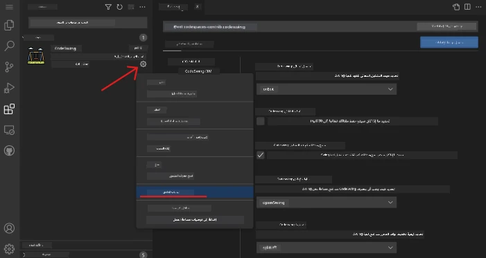

**الأشياء الشائعة التي قد ترغب في تعديلها:**
- كيفية تنسيق الكود الخاص بك (علامات التبويب مقابل المسافات، طول السطر، إلخ)
- اختصارات لوحة المفاتيح التي تشغل إجراءات مختلفة
- أنواع الملفات التي يجب أن تعمل معها الإضافة
- تشغيل ميزات محددة أو إيقافها للحفاظ على الأمور بسيطة

### تنظيم الإضافات الخاصة بك

عندما تكتشف المزيد من الإضافات الرائعة، سترغب في الحفاظ على مجموعتك مرتبة وتعمل بسلاسة. يجعل VSCode.dev هذا الأمر سهلًا للغاية للإدارة.

**خيارات إدارة الإضافات الخاصة بك:**

| ما يمكنك فعله | متى يكون مفيدًا | نصيحة احترافية |
|--------|---------|----------|
| **تعطيل** | اختبار ما إذا كانت الإضافة تسبب مشاكل | أفضل من إلغاء التثبيت إذا كنت قد تحتاجها مرة أخرى |
| **إلغاء التثبيت** | إزالة الإضافات التي لا تحتاجها تمامًا | يحافظ على بيئتك نظيفة وسريعة |
| **تحديث** | الحصول على أحدث الميزات وإصلاحات الأخطاء | يحدث عادةً تلقائيًا، ولكن يستحق التحقق |

**كيف أحب إدارة الإضافات:**
- كل بضعة أشهر، أراجع ما قمت بتثبيته وأزيل أي شيء لا أستخدمه
- أحافظ على تحديث الإضافات للحصول على أحدث التحسينات وإصلاحات الأمان
- إذا بدا شيء بطيئًا، أقوم بتعطيل الإضافات مؤقتًا لمعرفة ما إذا كانت واحدة منها هي السبب
- أقرأ ملاحظات التحديث عندما تحصل الإضافات على تحديثات كبيرة – أحيانًا تكون هناك ميزات جديدة رائعة!

> ⚠️ **نصيحة الأداء**: الإضافات رائعة، ولكن وجود الكثير منها يمكن أن يبطئ الأمور. ركز على تلك التي تجعل حياتك أسهل حقًا ولا تخف من إلغاء تثبيت تلك التي لا تستخدمها أبدًا.

### 🎯 مراجعة تربوية: تخصيص بيئة التطوير

**فهم الهيكلية**: تعلمت كيفية تخصيص بيئة تطوير احترافية باستخدام إضافات تم إنشاؤها بواسطة المجتمع. هذا يعكس كيف تبني فرق التطوير في المؤسسات سلاسل أدوات موحدة.

**المفاهيم الرئيسية التي تم إتقانها**:
- **اكتشاف الإضافات**: العثور على أدوات تحل تحديات التطوير المحددة
- **تكوين البيئة**: تخصيص الأدوات لتناسب التفضيلات الشخصية أو الفريق
- **تحسين الأداء**: تحقيق التوازن بين الوظائف وأداء النظام
- **التعاون المجتمعي**: الاستفادة من الأدوات التي أنشأها مجتمع المطورين العالمي

**الاتصال بالصناعة**: أنظمة الإضافات تدعم منصات التطوير الرئيسية مثل VS Code، Chrome DevTools، و IDEs الحديثة. فهم كيفية تقييم، تثبيت، وتكوين الإضافات أمر ضروري لعمليات التطوير الاحترافية.

**سؤال للتفكير**: كيف ستتعامل مع إعداد بيئة تطوير موحدة لفريق من 10 مطورين؟ ضع في اعتبارك التناسق، الأداء، والتفضيلات الفردية.

## 📈 جدول زمني لإتقان تطوير السحابة

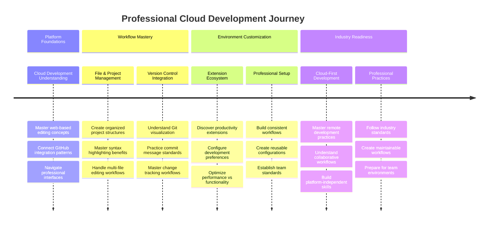

**🎓 علامة التخرج**: لقد أتقنت بنجاح تطوير السحابة باستخدام نفس الأدوات وسير العمل الذي يستخدمه المطورون المحترفون في شركات التكنولوجيا الكبرى. تمثل هذه المهارات مستقبل تطوير البرمجيات.

**🔄 قدرات المستوى التالي**:
- جاهز لاستكشاف منصات تطوير السحابة المتقدمة (Codespaces، GitPod)
- مستعد للعمل في فرق تطوير موزعة
- مجهز للمساهمة في مشاريع مفتوحة المصدر عالميًا
- تم إعداد الأساس لممارسات DevOps الحديثة والتكامل المستمر

## تحدي وكيل GitHub Copilot 🚀

مثل النهج المنظم الذي تستخدمه ناسا للمهام الفضائية، يتضمن هذا التحدي تطبيقًا منهجيًا لمهارات VSCode.dev في سيناريو سير عمل كامل.

**الهدف:** إثبات الكفاءة مع VSCode.dev من خلال إنشاء سير عمل تطوير ويب شامل.

**متطلبات المشروع:** باستخدام وضع الوكيل، أكمل هذه المهام:
1. قم بتفريع مستودع موجود أو أنشئ واحدًا جديدًا
2. قم بإنشاء هيكل مشروع وظيفي مع ملفات HTML، CSS، و JavaScript
3. قم بتثبيت وتكوين ثلاث إضافات تعزز التطوير
4. مارس التحكم في الإصدار مع رسائل الالتزام الوصفية
5. جرب إنشاء وتعديل فروع الميزات
6. وثق العملية والتعلم في ملف README.md

يعمل هذا التمرين على دمج جميع مفاهيم VSCode.dev في سير عمل عملي يمكن تطبيقه على مشاريع التطوير المستقبلية.

تعرف على المزيد حول [وضع الوكيل](https://code.visualstudio.com/blogs/2025/02/24/introducing-copilot-agent-mode) هنا.

## المهمة

حان الوقت لتجربة هذه المهارات في مشروع عملي! لدي مشروع عملي يتيح لك ممارسة كل ما غطيناه: [إنشاء موقع ويب للسيرة الذاتية باستخدام VSCode.dev](./assignment.md)

تأخذك هذه المهمة خطوة بخطوة لبناء موقع ويب احترافي للسيرة الذاتية بالكامل في متصفحك. ستستخدم جميع ميزات VSCode.dev التي استكشفناها، وبنهاية الأمر، سيكون لديك موقع ويب رائع وثقة قوية في سير العمل الجديد الخاص بك.

## استمر في الاستكشاف وتنمية مهاراتك

لديك الآن أساس قوي، ولكن هناك الكثير من الأشياء الرائعة لاستكشافها! إليك بعض الموارد والأفكار للارتقاء بمهاراتك في VSCode.dev إلى المستوى التالي:

**وثائق رسمية تستحق الإشارة إليها:**
- [وثائق VSCode Web](https://code.visualstudio.com/docs/editor/vscode-web?WT.mc_id=academic-0000-alfredodeza) – الدليل الكامل للتحرير المستند إلى المتصفح
- [GitHub Codespaces](https://docs.github.com/en/codespaces) – عندما تريد المزيد من القوة في السحابة

**ميزات رائعة لتجربتها بعد ذلك:**
- **اختصارات لوحة المفاتيح**: تعلم تركيبات المفاتيح التي ستجعلك تشعر وكأنك نينجا برمجي
- **إعدادات مساحة العمل**: قم بإعداد بيئات مختلفة لأنواع مختلفة من المشاريع
- **مساحات العمل متعددة الجذور**: العمل على مستودعات متعددة في نفس الوقت (مفيد جدًا!)
- **تكامل الطرفية**: الوصول إلى أدوات سطر الأوامر مباشرة في متصفحك

**أفكار للممارسة:**
- انضم إلى بعض المشاريع مفتوحة المصدر وساهم باستخدام VSCode.dev – إنها طريقة رائعة للعطاء!
- جرب إضافات مختلفة للعثور على الإعداد المثالي
- قم بإنشاء قوالب مشاريع لأنواع المواقع التي تبنيها غالبًا
- مارس سير عمل Git مثل إنشاء الفروع والدمج – هذه المهارات ذهبية في المشاريع الجماعية

---

**لقد أتقنت تطوير البرمجيات المستندة إلى المتصفح!** 🎉 مثلما سمحت اختراع الأدوات المحمولة للعلماء بإجراء أبحاث في مواقع نائية، يتيح VSCode.dev البرمجة الاحترافية من أي جهاز متصل بالإنترنت.

تعكس هذه المهارات ممارسات الصناعة الحالية – يستخدم العديد من المطورين المحترفين بيئات تطوير قائمة على السحابة لمرونتها وسهولة الوصول إليها. لقد تعلمت سير عمل يتوسع من المشاريع الفردية إلى التعاون الجماعي الكبير.

طبق هذه التقنيات في مشروع التطوير القادم الخاص بك! 🚀

---

**إخلاء المسؤولية**:  
تم ترجمة هذا المستند باستخدام خدمة الترجمة بالذكاء الاصطناعي [Co-op Translator](https://github.com/Azure/co-op-translator). بينما نسعى لتحقيق الدقة، يرجى العلم أن الترجمات الآلية قد تحتوي على أخطاء أو عدم دقة. يجب اعتبار المستند الأصلي بلغته الأصلية المصدر الرسمي. للحصول على معلومات حاسمة، يُوصى بالترجمة البشرية الاحترافية. نحن غير مسؤولين عن أي سوء فهم أو تفسيرات خاطئة ناتجة عن استخدام هذه الترجمة.