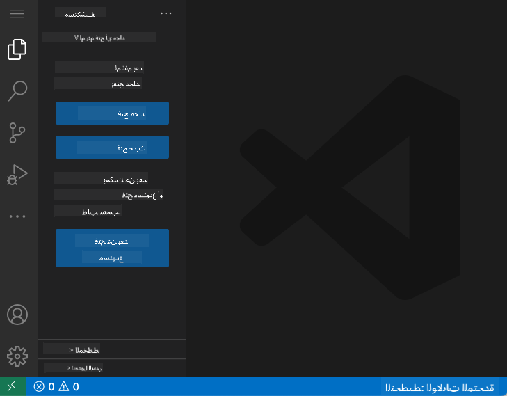
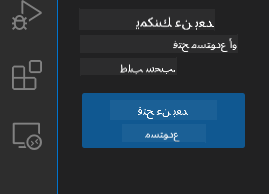
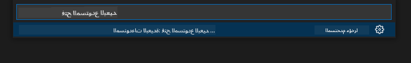
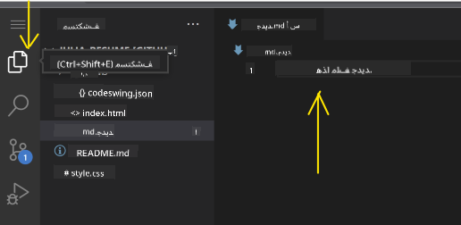
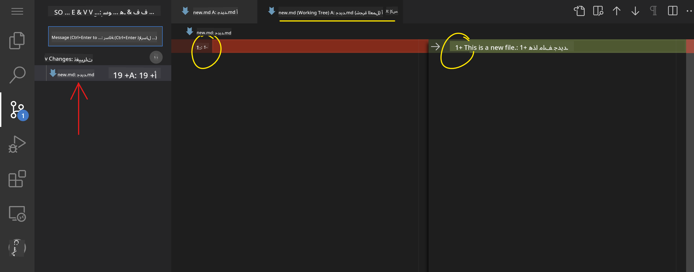
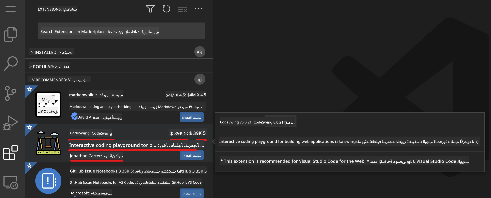

<!--
CO_OP_TRANSLATOR_METADATA:
{
  "original_hash": "7aa6e4f270d38d9cb17f2b5bd86b863d",
  "translation_date": "2025-08-25T23:15:32+00:00",
  "source_file": "8-code-editor/1-using-a-code-editor/README.md",
  "language_code": "ar"
}
-->
# استخدام محرر الأكواد

تتناول هذه الدرس أساسيات استخدام [VSCode.dev](https://vscode.dev)، وهو محرر أكواد يعتمد على الويب، بحيث يمكنك إجراء تغييرات على الكود والمساهمة في مشروع دون الحاجة إلى تثبيت أي شيء على جهاز الكمبيوتر الخاص بك.

## أهداف التعلم

في هذا الدرس، ستتعلم كيفية:

- استخدام محرر الأكواد في مشروع برمجي
- متابعة التغييرات باستخدام التحكم في الإصدارات
- تخصيص المحرر لتطوير البرمجيات

### المتطلبات الأساسية

قبل البدء، ستحتاج إلى إنشاء حساب على [GitHub](https://github.com). انتقل إلى [GitHub](https://github.com/) وقم بإنشاء حساب إذا لم يكن لديك حساب بالفعل.

### المقدمة

محرر الأكواد هو أداة أساسية لكتابة البرامج والتعاون في المشاريع البرمجية القائمة. بمجرد أن تفهم أساسيات المحرر وكيفية استخدام ميزاته، ستتمكن من تطبيقها عند كتابة الأكواد.

## البدء مع VSCode.dev

[VSCode.dev](https://vscode.dev) هو محرر أكواد يعمل عبر الإنترنت. لا تحتاج إلى تثبيت أي شيء لاستخدامه، تمامًا مثل فتح أي موقع ويب. للبدء باستخدام المحرر، افتح الرابط التالي: [https://vscode.dev](https://vscode.dev). إذا لم تكن مسجلًا الدخول إلى [GitHub](https://github.com/)، اتبع التعليمات لتسجيل الدخول أو إنشاء حساب جديد ثم تسجيل الدخول.

بمجرد تحميله، يجب أن يبدو مشابهًا لهذه الصورة:



هناك ثلاثة أقسام رئيسية، بدءًا من اليسار إلى اليمين:

1. شريط النشاط الذي يتضمن بعض الأيقونات، مثل العدسة المكبرة 🔎، الترس ⚙️، وبعض الأيقونات الأخرى.
2. شريط النشاط الموسع الذي يكون افتراضيًا على _المستكشف_، ويُسمى _الشريط الجانبي_.
3. وأخيرًا، منطقة الكود على اليمين.

انقر على كل أيقونة لعرض قائمة مختلفة. بمجرد الانتهاء، انقر على _المستكشف_ لتعود إلى حيث بدأت.

عندما تبدأ بإنشاء الأكواد أو تعديل الأكواد الموجودة، سيتم ذلك في أكبر منطقة على اليمين. ستستخدم هذه المنطقة أيضًا لعرض الأكواد الموجودة، وهو ما ستفعله لاحقًا.

## فتح مستودع GitHub

أول شيء ستحتاج إليه هو فتح مستودع GitHub. هناك طرق متعددة لفتح مستودع. في هذا القسم، سترى طريقتين مختلفتين يمكنك من خلالهما فتح مستودع والبدء في العمل على التغييرات.

### 1. باستخدام المحرر

استخدم المحرر نفسه لفتح مستودع عن بُعد. إذا ذهبت إلى [VSCode.dev](https://vscode.dev)، سترى زر _"فتح مستودع عن بُعد"_:



يمكنك أيضًا استخدام لوحة الأوامر. لوحة الأوامر هي مربع إدخال يمكنك كتابة أي كلمة فيه تكون جزءًا من أمر أو إجراء للعثور على الأمر المناسب لتنفيذه. استخدم القائمة في أعلى اليسار، ثم اختر _عرض_، ثم اختر _لوحة الأوامر_، أو استخدم الاختصار التالي: Ctrl-Shift-P (على نظام MacOS سيكون Command-Shift-P).



بمجرد فتح القائمة، اكتب _فتح مستودع عن بُعد_، ثم اختر الخيار الأول. ستظهر لك مستودعات متعددة أنت جزء منها أو فتحتها مؤخرًا. يمكنك أيضًا استخدام عنوان URL كامل لـ GitHub لتحديد واحد. استخدم عنوان URL التالي والصقه في المربع:

```
https://github.com/microsoft/Web-Dev-For-Beginners
```

✅ إذا نجحت، سترى جميع الملفات الخاصة بهذا المستودع محملة في محرر النصوص.

### 2. باستخدام عنوان URL

يمكنك أيضًا استخدام عنوان URL مباشرة لتحميل مستودع. على سبيل المثال، عنوان URL الكامل للمستودع الحالي هو [https://github.com/microsoft/Web-Dev-For-Beginners](https://github.com/microsoft/Web-Dev-For-Beginners)، ولكن يمكنك استبدال نطاق GitHub بـ `VSCode.dev/github` وتحميل المستودع مباشرة. سيكون عنوان URL الناتج هو [https://vscode.dev/github/microsoft/Web-Dev-For-Beginners](https://vscode.dev/github/microsoft/Web-Dev-For-Beginners).

## تعديل الملفات

بمجرد فتح المستودع في المتصفح/ vscode.dev، ستكون الخطوة التالية هي إجراء تحديثات أو تغييرات على المشروع.

### 1. إنشاء ملف جديد

يمكنك إنشاء ملف داخل مجلد موجود أو إنشاؤه في الدليل/المجلد الرئيسي. لإنشاء ملف جديد، افتح الموقع/الدليل الذي تريد حفظ الملف فيه واختر أيقونة _'ملف جديد ...'_ على شريط النشاط _(يسار)_، أعطه اسمًا واضغط على Enter.


### 2. تعديل وحفظ ملف في المستودع

استخدام vscode.dev مفيد عندما تريد إجراء تحديثات سريعة على مشروعك دون الحاجة إلى تحميل أي برامج محليًا. لتحديث الكود الخاص بك، انقر على أيقونة 'المستكشف'، الموجودة أيضًا على شريط النشاط لعرض الملفات والمجلدات في المستودع. اختر ملفًا لفتحه في منطقة الكود، قم بإجراء التغييرات واحفظها.



بمجرد الانتهاء من تحديث مشروعك، اختر أيقونة _`التحكم في المصدر`_ التي تحتوي على جميع التغييرات الجديدة التي أجريتها على المستودع.

لعرض التغييرات التي أجريتها على مشروعك، اختر الملف(الملفات) في مجلد `التغييرات` في الشريط الجانبي الموسع. سيؤدي ذلك إلى فتح 'شجرة العمل' لتتمكن من رؤية التغييرات التي أجريتها على الملف بصريًا. اللون الأحمر يظهر حذفًا من المشروع، بينما اللون الأخضر يشير إلى إضافة.



إذا كنت راضيًا عن التغييرات التي أجريتها، قم بالتحويم على مجلد `التغييرات` وانقر على زر `+` لتجهيز التغييرات. التجهيز يعني ببساطة إعداد التغييرات لتأكيدها على GitHub.

إذا لم تكن مرتاحًا لبعض التغييرات وترغب في تجاهلها، قم بالتحويم على مجلد `التغييرات` واختر أيقونة `التراجع`.

ثم، اكتب رسالة `تأكيد` _(وصف للتغيير الذي أجريته على المشروع)_, انقر على أيقونة `التحقق` لتأكيد ودفع التغييرات.

بمجرد الانتهاء من العمل على مشروعك، اختر أيقونة `القائمة الهامبرغر` في أعلى اليسار للعودة إلى المستودع على github.com.


## استخدام الإضافات

تثبيت الإضافات على VSCode يسمح لك بإضافة ميزات جديدة وخيارات تخصيص بيئة التطوير على المحرر لتحسين سير العمل الخاص بك. تساعد هذه الإضافات أيضًا في دعم لغات البرمجة المتعددة وغالبًا ما تكون إما إضافات عامة أو إضافات خاصة باللغات.

لتصفح قائمة جميع الإضافات المتاحة، انقر على أيقونة _`الإضافات`_ على شريط النشاط وابدأ بكتابة اسم الإضافة في حقل النص المسمى _'البحث عن إضافات في السوق'_.

سترى قائمة بالإضافات، كل واحدة تحتوي على **اسم الإضافة، اسم الناشر، وصف من جملة واحدة، عدد التنزيلات** و **تقييم النجوم**.



يمكنك أيضًا عرض جميع الإضافات المثبتة مسبقًا من خلال توسيع مجلد _`المثبتة`_، الإضافات الشائعة المستخدمة من قبل معظم المطورين في مجلد _`الشائعة`_ والإضافات الموصى بها لك إما من قبل المستخدمين في نفس مساحة العمل أو بناءً على الملفات التي فتحتها مؤخرًا في مجلد _`الموصى بها`_.


### 1. تثبيت الإضافات

لتثبيت إضافة، اكتب اسم الإضافة في حقل البحث وانقر عليها لعرض معلومات إضافية حول الإضافة في منطقة الكود بمجرد ظهورها في الشريط الجانبي الموسع.

يمكنك إما النقر على _زر التثبيت الأزرق_ في الشريط الجانبي الموسع لتثبيت الإضافة أو استخدام زر التثبيت الذي يظهر في منطقة الكود بمجرد اختيار الإضافة لتحميل معلومات إضافية.


### 2. تخصيص الإضافات

بعد تثبيت الإضافة، قد تحتاج إلى تعديل سلوكها وتخصيصها بناءً على تفضيلاتك. للقيام بذلك، اختر أيقونة الإضافات، وهذه المرة ستظهر الإضافة الخاصة بك في مجلد _المثبتة_، انقر على _**أيقونة الترس**_ وانتقل إلى _إعدادات الإضافات_.


### 3. إدارة الإضافات

بعد تثبيت واستخدام الإضافة، يوفر vscode.dev خيارات لإدارة الإضافة بناءً على احتياجات مختلفة. على سبيل المثال، يمكنك اختيار:

- **تعطيل:** _(يمكنك تعطيل الإضافة مؤقتًا عندما لا تحتاج إليها ولكن لا تريد إلغاء تثبيتها تمامًا)_

    اختر الإضافة المثبتة في الشريط الجانبي الموسع > انقر على أيقونة الترس > اختر 'تعطيل' أو 'تعطيل (مساحة العمل)' **أو** افتح الإضافة في منطقة الكود وانقر على زر التعطيل الأزرق.

- **إلغاء التثبيت:** اختر الإضافة المثبتة في الشريط الجانبي الموسع > انقر على أيقونة الترس > اختر 'إلغاء التثبيت' **أو** افتح الإضافة في منطقة الكود وانقر على زر إلغاء التثبيت الأزرق.

---

## المهمة

[إنشاء موقع ويب للسيرة الذاتية باستخدام vscode.dev](https://github.com/microsoft/Web-Dev-For-Beginners/blob/main/8-code-editor/1-using-a-code-editor/assignment.md)

## المراجعة والدراسة الذاتية

اقرأ المزيد عن [VSCode.dev](https://code.visualstudio.com/docs/editor/vscode-web?WT.mc_id=academic-0000-alfredodeza) وبعض ميزاته الأخرى.

**إخلاء المسؤولية**:  
تم ترجمة هذا المستند باستخدام خدمة الترجمة بالذكاء الاصطناعي [Co-op Translator](https://github.com/Azure/co-op-translator). بينما نسعى لتحقيق الدقة، يرجى العلم أن الترجمات الآلية قد تحتوي على أخطاء أو معلومات غير دقيقة. يجب اعتبار المستند الأصلي بلغته الأصلية المصدر الرسمي. للحصول على معلومات حاسمة، يُوصى بالاستعانة بترجمة بشرية احترافية. نحن غير مسؤولين عن أي سوء فهم أو تفسيرات خاطئة تنشأ عن استخدام هذه الترجمة.