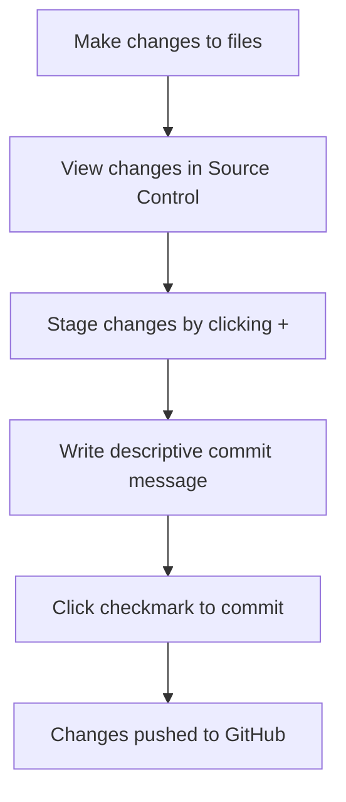

<!--
CO_OP_TRANSLATOR_METADATA:
{
  "original_hash": "cfd4a15974168ca426d50c67682ab9d4",
  "translation_date": "2025-10-22T14:06:50+00:00",
  "source_file": "8-code-editor/1-using-a-code-editor/README.md",
  "language_code": "ar"
}
-->
# استخدام محرر الأكواد: إتقان VSCode.dev

تذكر في فيلم *The Matrix* عندما كان نيو بحاجة إلى الاتصال بجهاز كمبيوتر ضخم للوصول إلى العالم الرقمي؟ أدوات تطوير الويب اليوم هي القصة المعاكسة تمامًا – قدرات قوية للغاية يمكن الوصول إليها من أي مكان. VSCode.dev هو محرر أكواد يعمل عبر المتصفح ويقدم أدوات تطوير احترافية لأي جهاز متصل بالإنترنت.

تمامًا كما جعلت آلة الطباعة الكتب متاحة للجميع وليس فقط للكتّاب في الأديرة، فإن VSCode.dev يتيح البرمجة للجميع. يمكنك العمل على المشاريع من جهاز كمبيوتر في المكتبة، أو مختبر المدرسة، أو أي مكان يمكنك الوصول فيه إلى المتصفح. لا حاجة للتثبيت، ولا قيود "أحتاج إلى إعداد معين".

بنهاية هذا الدرس، ستفهم كيفية التنقل في VSCode.dev، فتح مستودعات GitHub مباشرة في المتصفح، واستخدام Git للتحكم في الإصدارات – وهي مهارات يعتمد عليها المطورون المحترفون يوميًا.

## ما ستتعلمه

بعد أن نمر بهذا معًا، ستكون قادرًا على:

- التنقل في VSCode.dev وكأنه منزلك الثاني – العثور على كل ما تحتاجه دون أن تضيع
- فتح أي مستودع GitHub في المتصفح والبدء في التعديل فورًا (هذا مذهل حقًا!)
- استخدام Git لتتبع تغييراتك وحفظ تقدمك كمحترف
- تعزيز محرر الأكواد باستخدام الإضافات التي تجعل البرمجة أسرع وأكثر متعة
- إنشاء وتنظيم ملفات المشاريع بثقة

## ما ستحتاج إليه

المتطلبات بسيطة:

- حساب مجاني على [GitHub](https://github.com) (سنرشدك خلال عملية الإنشاء إذا لزم الأمر)
- معرفة أساسية بمتصفحات الويب
- درس أساسيات GitHub يقدم خلفية مفيدة، لكنه ليس ضروريًا

> 💡 **جديد على GitHub؟** إنشاء حساب مجاني ويستغرق دقائق. مثلما تمنحك بطاقة المكتبة الوصول إلى الكتب في جميع أنحاء العالم، يفتح حساب GitHub أبوابًا لمستودعات الأكواد عبر الإنترنت.

## لماذا تهم محررات الأكواد عبر الإنترنت؟

قبل الإنترنت، لم يكن العلماء في الجامعات المختلفة قادرين على مشاركة الأبحاث بسهولة. ثم جاء ARPANET في الستينيات، وربط أجهزة الكمبيوتر عبر المسافات. محررات الأكواد عبر الإنترنت تتبع نفس المبدأ – جعل الأدوات القوية متاحة بغض النظر عن موقعك أو جهازك.

محرر الأكواد هو مساحة عمل التطوير الخاصة بك، حيث تكتب وتعدل وتنظم ملفات الأكواد. على عكس محررات النصوص البسيطة، توفر محررات الأكواد الاحترافية ميزات مثل تمييز الصيغة، واكتشاف الأخطاء، وإدارة المشاريع.

VSCode.dev يجلب هذه القدرات إلى متصفحك:

**مزايا التحرير عبر الإنترنت:**

| الميزة | الوصف | الفائدة العملية |
|---------|-------------|----------|
| **الاستقلالية عن المنصة** | يعمل على أي جهاز يحتوي على متصفح | العمل بسلاسة من أجهزة مختلفة |
| **لا حاجة للتثبيت** | الوصول عبر رابط ويب | تجاوز قيود تثبيت البرامج |
| **التحديثات التلقائية** | يعمل دائمًا بأحدث إصدار | الوصول إلى الميزات الجديدة دون تحديث يدوي |
| **تكامل المستودعات** | اتصال مباشر بـ GitHub | تعديل الأكواد دون إدارة الملفات محليًا |

**التطبيقات العملية:**
- استمرارية العمل عبر بيئات مختلفة
- واجهة متسقة بغض النظر عن نظام التشغيل
- إمكانيات التعاون الفوري
- تقليل متطلبات التخزين المحلي

## استكشاف VSCode.dev

تمامًا كما احتوى مختبر ماري كوري على معدات متطورة في مساحة بسيطة نسبيًا، يضم VSCode.dev أدوات تطوير احترافية في واجهة المتصفح. يوفر هذا التطبيق نفس الوظائف الأساسية لمحررات الأكواد المكتبية.

ابدأ بالتوجه إلى [vscode.dev](https://vscode.dev) في متصفحك. يتم تحميل الواجهة دون الحاجة إلى تنزيلات أو تثبيتات – تطبيق مباشر لمبادئ الحوسبة السحابية.

### ربط حساب GitHub الخاص بك

مثلما ربط هاتف ألكسندر غراهام بيل المواقع البعيدة، فإن ربط حساب GitHub الخاص بك يربط VSCode.dev بمستودعات الأكواد الخاصة بك. عند مطالبتك بتسجيل الدخول إلى GitHub، يُوصى بقبول هذا الاتصال.

**يوفر تكامل GitHub:**
- الوصول المباشر إلى مستودعاتك داخل المحرر
- إعدادات ومكونات إضافية متزامنة عبر الأجهزة
- سير عمل حفظ مبسط إلى GitHub
- بيئة تطوير مخصصة

### التعرف على مساحة العمل الجديدة الخاصة بك

بمجرد تحميل كل شيء، سترى مساحة عمل نظيفة وجميلة مصممة لتبقيك مركزًا على ما يهم – الأكواد الخاصة بك!

**إليك جولة في الحي:**
- **شريط النشاط** (الشريط الموجود على اليسار): التنقل الرئيسي الخاص بك مع المستكشف 📁، البحث 🔍، التحكم في المصدر 🌿، الإضافات 🧩، والإعدادات ⚙️
- **الشريط الجانبي** (اللوحة المجاورة له): يتغير ليعرض لك معلومات ذات صلة بناءً على ما اخترته
- **منطقة المحرر** (المساحة الكبيرة في المنتصف): هنا يحدث السحر – منطقة البرمجة الرئيسية الخاصة بك

**خذ لحظة لاستكشاف:**
- انقر على أيقونات شريط النشاط وشاهد ما يفعله كل منها
- لاحظ كيف يقوم الشريط الجانبي بتحديث المعلومات – رائع، أليس كذلك؟
- عرض المستكشف (📁) هو المكان الذي ستقضي فيه معظم وقتك، لذا كن مرتاحًا معه

## فتح مستودعات GitHub

قبل الإنترنت، كان الباحثون بحاجة إلى السفر فعليًا إلى المكتبات للوصول إلى الوثائق. تعمل مستودعات GitHub بطريقة مشابهة – فهي مجموعات من الأكواد المخزنة عن بُعد. يلغي VSCode.dev الخطوة التقليدية لتنزيل المستودعات إلى جهازك المحلي قبل التعديل.

تتيح هذه الميزة الوصول الفوري إلى أي مستودع عام لعرضه أو تعديله أو المساهمة فيه. إليك طريقتان لفتح المستودعات:

### الطريقة الأولى: الطريقة السهلة بالنقر

هذه الطريقة مثالية عندما تبدأ من جديد في VSCode.dev وترغب في فتح مستودع معين. إنها مباشرة وسهلة للمبتدئين:

**إليك كيفية القيام بذلك:**

1. توجه إلى [vscode.dev](https://vscode.dev) إذا لم تكن هناك بالفعل
2. ابحث عن زر "فتح مستودع عن بُعد" على شاشة الترحيب وانقر عليه

   

3. الصق أي رابط لمستودع GitHub (جرب هذا: `https://github.com/microsoft/Web-Dev-For-Beginners`)
4. اضغط على Enter وشاهد السحر يحدث!

**نصيحة احترافية - اختصار لوحة الأوامر:**

هل تريد أن تشعر وكأنك ساحر برمجي؟ جرب هذا الاختصار: Ctrl+Shift+P (أو Cmd+Shift+P على Mac) لفتح لوحة الأوامر:

**لوحة الأوامر تشبه محرك بحث لكل ما يمكنك القيام به:**
- اكتب "فتح عن بُعد" وستجد أداة فتح المستودعات
- تتذكر المستودعات التي فتحتها مؤخرًا (مفيد جدًا!)
- بمجرد أن تعتاد عليها، ستشعر وكأنك تبرمج بسرعة البرق
- إنها بمثابة "مرحبًا سيري، ولكن للبرمجة"

### الطريقة الثانية: تقنية تعديل الرابط

مثلما تستخدم HTTP وHTTPS بروتوكولات مختلفة مع الحفاظ على نفس هيكل النطاق، يستخدم VSCode.dev نمط رابط يعكس نظام عناوين GitHub. يمكن تعديل أي رابط مستودع GitHub ليفتح مباشرة في VSCode.dev.

**نمط تحويل الرابط:**

| نوع المستودع | رابط GitHub | رابط VSCode.dev |
|----------------|---------------------|----------------|
| **مستودع عام** | `github.com/microsoft/Web-Dev-For-Beginners` | `vscode.dev/github/microsoft/Web-Dev-For-Beginners` |
| **مشروع شخصي** | `github.com/your-username/my-project` | `vscode.dev/github/your-username/my-project` |
| **أي مستودع متاح** | `github.com/their-username/awesome-repo` | `vscode.dev/github/their-username/awesome-repo` |

**التنفيذ:**
- استبدل `github.com` بـ `vscode.dev/github`
- حافظ على جميع مكونات الرابط الأخرى دون تغيير
- يعمل مع أي مستودع متاح للجمهور
- يوفر الوصول الفوري للتعديل

> 💡 **نصيحة تغير الحياة**: ضع إشارات مرجعية لإصدارات VSCode.dev من مستودعاتك المفضلة. لدي إشارات مرجعية مثل "تعديل ملفي الشخصي" و"إصلاح التوثيق" التي تأخذني مباشرة إلى وضع التعديل!

**أي طريقة يجب أن تستخدم؟**
- **الطريقة عبر الواجهة**: رائعة عندما تستكشف أو لا تتذكر أسماء المستودعات بالضبط
- **حيلة الرابط**: مثالية للوصول السريع عندما تعرف بالضبط إلى أين تذهب

## العمل مع الملفات والمشاريع

الآن بعد أن فتحت مستودعًا، دعنا نبدأ البناء! يوفر لك VSCode.dev كل ما تحتاجه لإنشاء وتعديل وتنظيم ملفات الأكواد. فكر فيه كأنه ورشة عمل رقمية – كل أداة في مكانها الصحيح.

دعنا نتعمق في المهام اليومية التي ستشكل معظم سير عمل البرمجة الخاص بك.

### إنشاء ملفات جديدة

مثل تنظيم المخططات في مكتب المهندس المعماري، يتبع إنشاء الملفات في VSCode.dev نهجًا منظمًا. يدعم النظام جميع أنواع ملفات تطوير الويب القياسية.

**عملية إنشاء الملفات:**

1. انتقل إلى المجلد المستهدف في الشريط الجانبي للمستكشف
2. مرر فوق اسم المجلد للكشف عن أيقونة "ملف جديد" (📄+)
3. أدخل اسم الملف بما في ذلك الامتداد المناسب (`style.css`, `script.js`, `index.html`)
4. اضغط على Enter لإنشاء الملف

**اتفاقيات التسمية:**
- استخدم أسماء وصفية تشير إلى غرض الملف
- قم بتضمين امتدادات الملفات لتحديد الصيغة بشكل صحيح
- اتبع أنماط تسمية متسقة في جميع المشاريع
- استخدم الأحرف الصغيرة والشرطات بدلاً من المسافات

### تعديل وحفظ الملفات

هنا تبدأ المتعة الحقيقية! محرر VSCode.dev مليء بالميزات المفيدة التي تجعل البرمجة سلسة وبديهية. إنه مثل وجود مساعد كتابة ذكي، ولكن للأكواد.

**سير عمل التعديل الخاص بك:**

1. انقر على أي ملف في المستكشف لفتحه في المنطقة الرئيسية
2. ابدأ الكتابة وشاهد VSCode.dev يساعدك بالألوان والاقتراحات واكتشاف الأخطاء
3. احفظ عملك باستخدام Ctrl+S (Windows/Linux) أو Cmd+S (Mac) – على الرغم من أنه يحفظ تلقائيًا أيضًا!

**الأشياء الرائعة التي تحدث أثناء البرمجة:**
- يتم تلوين الأكواد بشكل جميل لتكون سهلة القراءة
- يقترح VSCode.dev إكمالات أثناء الكتابة (مثل التصحيح التلقائي، ولكن أكثر ذكاءً)
- يكتشف الأخطاء قبل أن تحفظ حتى
- يمكنك فتح ملفات متعددة في علامات تبويب، تمامًا مثل المتصفح
- يتم حفظ كل شيء تلقائيًا في الخلفية

> ⚠️ **نصيحة سريعة**: على الرغم من أن الحفظ التلقائي يدعمك، فإن الضغط على Ctrl+S أو Cmd+S لا يزال عادة جيدة. يحفظ كل شيء فورًا ويشغل بعض الميزات الإضافية المفيدة مثل التحقق من الأخطاء.

### التحكم في الإصدارات باستخدام Git

مثلما ينشئ علماء الآثار سجلات مفصلة لطبقات الحفريات، يتتبع Git التغييرات في الأكواد الخاصة بك بمرور الوقت. يحافظ هذا النظام على تاريخ المشروع ويتيح لك العودة إلى الإصدارات السابقة عند الحاجة. يتضمن VSCode.dev وظائف Git مدمجة.

**واجهة التحكم في المصدر:**

1. الوصول إلى لوحة التحكم في المصدر عبر أيقونة 🌿 في شريط النشاط
2. تظهر الملفات المعدلة في قسم "التغييرات"
3. يشير الترميز اللوني إلى أنواع التغييرات: الأخضر للإضافات، الأحمر للحذف

**حفظ عملك (سير عمل الالتزام):**

**إليك العملية خطوة بخطوة:**
- انقر على أيقونة "+" بجانب الملفات التي تريد حفظها (هذا يعني "تجهيزها")
- تحقق من أنك راضٍ عن جميع التغييرات التي تم تجهيزها
- اكتب ملاحظة قصيرة تشرح ما قمت به (هذه هي "رسالة الالتزام")
- انقر على زر علامة الاختيار لحفظ كل شيء إلى GitHub
- إذا غيرت رأيك بشأن شيء ما، فإن أيقونة التراجع تتيح لك تجاهل التغييرات

**كتابة رسائل الالتزام الجيدة (هذا أسهل مما تعتقد!):**
- فقط صف ما قمت به، مثل "إضافة نموذج الاتصال" أو "إصلاح التنقل المعطل"
- اجعلها قصيرة وموجزة – فكر في طول التغريدة، وليس المقال
- ابدأ بكلمات عمل مثل "إضافة"، "إصلاح"، "تحديث"، أو "إزالة"
- **أمثلة جيدة**: "إضافة قائمة تنقل متجاوبة"، "إصلاح مشاكل تخطيط الهاتف المحمول"، "تحديث الألوان لتحسين الوصول"

> 💡 **نصيحة التنقل السريع**: استخدم قائمة الهامبرغر (☰) في أعلى اليسار للعودة إلى مستودع GitHub الخاص بك ورؤية التغييرات التي قمت بحفظها عبر الإنترنت. إنها مثل بوابة بين بيئة التحرير الخاصة بك وموطن مشروعك على GitHub!

## تعزيز الوظائف باستخدام الإضافات

تمامًا كما تحتوي ورشة العمل الخاصة بالحرفي على أدوات متخصصة للمهام المختلفة، يمكن تخصيص VSCode.dev باستخدام الإضافات التي تضيف قدرات محددة. تعالج هذه الإضافات التي طورها المجتمع احتياجات التطوير الشائعة مثل تنسيق الأكواد، المعاينة المباشرة، وتعزيز تكامل Git.

يستضيف سوق الإضافات آلاف الأدوات المجانية التي أنشأها المطورون حول العالم. تحل كل إضافة تحديات سير العمل الشائعة، مما يتيح لك بناء بيئة تطوير مخصصة تناسب احتياجاتك وتفضيلاتك الخاصة.

### العثور على الإضافات المثالية

سوق الإضافات منظم بشكل جيد، لذا لن تضيع أثناء البحث عما تحتاجه. إنه مصمم لمساعدتك في اكتشاف الأدوات المحددة وأشياء رائعة لم تكن تعرف بوجودها!

**الوصول إلى السوق:**

1. انقر على أيقونة الإضافات (🧩) في شريط النشاط
2. تصفح أو ابحث عن شيء محدد
3. انقر على أي شيء يبدو مثيرًا للاهتمام لمعرفة المزيد عنه

**ما الذي ستجده هناك:**

| القسم | ما بداخله | لماذا هو مفيد |
|----------|---------|----------|
| **المثبتة** | الإضافات التي قمت بإضافتها بالفعل | مجموعة أدوات البرمجة الخاصة بك |
| **الشائعة** | المفضلة لدى الجميع | ما يوصي به معظم المطورين |
| **الموصى بها** | اقتراحات ذكية لمشروعك | توصيات مفيدة من VSCode.dev |

**ما يجعل التصفح سهلاً:**
- كل إضافة تعرض التقييمات، عدد التنزيلات، ومراجعات المستخدمين الحقيقيين  
- تحصل على لقطات شاشة ووصف واضح لما تقوم به كل إضافة  
- كل شيء مُحدد بوضوح مع معلومات التوافق  
- يتم اقتراح إضافات مشابهة لتتمكن من مقارنة الخيارات  

### تثبيت الإضافات (سهل جدًا!)

إضافة ميزات جديدة لمحررك بسيطة مثل الضغط على زر. تثبيت الإضافات يتم في ثوانٍ ويبدأ العمل فورًا – لا حاجة لإعادة التشغيل أو الانتظار.

**كل ما عليك فعله:**

1. ابحث عما تحتاجه (جرب البحث عن "live server" أو "prettier")  
2. اضغط على الإضافة التي تبدو جيدة لمعرفة المزيد من التفاصيل  
3. اقرأ ما تقوم به وتحقق من التقييمات  
4. اضغط على الزر الأزرق "تثبيت" وانتهى الأمر!  

**ما يحدث خلف الكواليس:**
- يتم تنزيل الإضافة وإعدادها تلقائيًا  
- تظهر الميزات الجديدة في واجهتك فورًا  
- كل شيء يبدأ العمل فورًا (بجدية، بهذه السرعة!)  
- إذا كنت مسجلًا الدخول، يتم مزامنة الإضافة مع جميع أجهزتك  

**بعض الإضافات التي أوصي بالبدء بها:**
- **Live Server**: شاهد تحديث موقعك في الوقت الفعلي أثناء البرمجة (هذه الإضافة مذهلة!)  
- **Prettier**: تجعل الكود يبدو نظيفًا واحترافيًا تلقائيًا  
- **Auto Rename Tag**: عند تغيير علامة HTML، يتم تحديث شريكها أيضًا  
- **Bracket Pair Colorizer**: تُلون الأقواس بحيث لا تضيع أبدًا  
- **GitLens**: تعزز ميزات Git الخاصة بك بمعلومات مفيدة كثيرة  

### تخصيص الإضافات الخاصة بك

معظم الإضافات تأتي مع إعدادات يمكنك تعديلها لتعمل بالطريقة التي تناسبك. فكر في الأمر كضبط المقعد والمرايا في السيارة – لكل شخص تفضيلاته!

**تعديل إعدادات الإضافات:**

1. ابحث عن الإضافة المثبتة في لوحة الإضافات  
2. ابحث عن رمز الترس الصغير (⚙️) بجانب اسمها واضغط عليه  
3. اختر "إعدادات الإضافة" من القائمة المنسدلة  
4. قم بتعديل الأمور حتى تشعر أنها مناسبة لأسلوب عملك  

**أشياء شائعة قد ترغب في تعديلها:**
- كيفية تنسيق الكود الخاص بك (التبويبات مقابل المسافات، طول السطر، إلخ)  
- اختصارات لوحة المفاتيح التي تُشغل إجراءات مختلفة  
- أنواع الملفات التي يجب أن تعمل معها الإضافة  
- تشغيل أو إيقاف ميزات محددة للحفاظ على الأمور بسيطة  

### تنظيم الإضافات الخاصة بك

مع اكتشاف المزيد من الإضافات الرائعة، سترغب في الحفاظ على مجموعتك مرتبة وتعمل بسلاسة. VSCode.dev يجعل إدارة هذا الأمر سهلًا للغاية.

**خيارات إدارة الإضافات الخاصة بك:**

| ما يمكنك فعله | متى يكون مفيدًا | نصيحة احترافية |
|--------|---------|----------|
| **تعطيل** | اختبار ما إذا كانت الإضافة تسبب مشاكل | أفضل من إلغاء التثبيت إذا كنت قد تحتاجها لاحقًا |
| **إلغاء التثبيت** | إزالة الإضافات التي لا تحتاجها تمامًا | يحافظ على بيئتك نظيفة وسريعة |
| **التحديث** | الحصول على أحدث الميزات وإصلاحات الأخطاء | يحدث عادةً تلقائيًا، لكن يستحق التحقق |

**كيف أحب إدارة الإضافات:**
- كل بضعة أشهر، أراجع ما قمت بتثبيته وأزيل أي شيء لا أستخدمه  
- أحافظ على تحديث الإضافات للحصول على أحدث التحسينات وإصلاحات الأمان  
- إذا بدا شيء بطيئًا، أقوم بتعطيل الإضافات مؤقتًا لمعرفة ما إذا كانت أحدها السبب  
- أقرأ ملاحظات التحديث عندما تحصل الإضافات على تحديثات كبيرة – أحيانًا تكون هناك ميزات جديدة رائعة!  

> ⚠️ **نصيحة الأداء**: الإضافات رائعة، لكن وجود الكثير منها يمكن أن يبطئ الأمور. ركز على تلك التي تجعل حياتك أسهل حقًا ولا تخف من إلغاء تثبيت تلك التي لا تستخدمها أبدًا.

## تحدي GitHub Copilot Agent 🚀

مثل النهج المنظم الذي تستخدمه ناسا للمهام الفضائية، يتضمن هذا التحدي تطبيقًا منهجيًا لمهارات VSCode.dev في سيناريو سير عمل كامل.

**الهدف:** إثبات الكفاءة مع VSCode.dev من خلال إنشاء سير عمل شامل لتطوير الويب.

**متطلبات المشروع:** باستخدام وضع Agent، أكمل هذه المهام:
1. قم بتفريع مستودع موجود أو أنشئ واحدًا جديدًا  
2. قم بإنشاء هيكل مشروع وظيفي مع ملفات HTML وCSS وJavaScript  
3. قم بتثبيت وتكوين ثلاث إضافات تعزز التطوير  
4. مارس التحكم في الإصدارات مع رسائل الالتزام الوصفية  
5. جرب إنشاء وتعديل فروع الميزات  
6. وثق العملية والتعلم في ملف README.md  

هذا التمرين يجمع كل مفاهيم VSCode.dev في سير عمل عملي يمكن تطبيقه على مشاريع التطوير المستقبلية.

تعرف على المزيد حول [وضع Agent](https://code.visualstudio.com/blogs/2025/02/24/introducing-copilot-agent-mode) هنا.

## المهمة

حان الوقت لتجربة هذه المهارات عمليًا! لدي مشروع عملي يتيح لك ممارسة كل ما غطيناه: [إنشاء موقع ويب للسيرة الذاتية باستخدام VSCode.dev](./assignment.md)

هذا التمرين يرشدك خلال بناء موقع ويب احترافي للسيرة الذاتية بالكامل في متصفحك. ستستخدم جميع ميزات VSCode.dev التي استكشفناها، وبنهاية الأمر، سيكون لديك موقع ويب رائع وثقة قوية في سير العمل الجديد الخاص بك.

## استمر في الاستكشاف وتنمية مهاراتك

لديك الآن أساس قوي، لكن هناك الكثير من الأشياء الرائعة لاستكشافها! إليك بعض الموارد والأفكار لتطوير مهاراتك مع VSCode.dev:

**وثائق رسمية تستحق الإشارة إليها:**
- [وثائق VSCode Web](https://code.visualstudio.com/docs/editor/vscode-web?WT.mc_id=academic-0000-alfredodeza) – الدليل الكامل للتحرير المستند إلى المتصفح  
- [GitHub Codespaces](https://docs.github.com/en/codespaces) – عندما تريد المزيد من القوة في السحابة  

**ميزات رائعة لتجربتها بعد ذلك:**
- **اختصارات لوحة المفاتيح**: تعلم تركيبات المفاتيح التي ستجعلك تشعر وكأنك نينجا البرمجة  
- **إعدادات مساحة العمل**: قم بإعداد بيئات مختلفة لأنواع مختلفة من المشاريع  
- **مساحات العمل متعددة الجذور**: العمل على مستودعات متعددة في نفس الوقت (مفيد جدًا!)  
- **تكامل الطرفية**: الوصول إلى أدوات سطر الأوامر مباشرة في متصفحك  

**أفكار للتدريب:**
- انضم إلى بعض المشاريع مفتوحة المصدر وساهم باستخدام VSCode.dev – إنها طريقة رائعة للعطاء!  
- جرب إضافات مختلفة للعثور على الإعداد المثالي الخاص بك  
- أنشئ قوالب مشاريع لأنواع المواقع التي تبنيها غالبًا  
- مارس سير عمل Git مثل إنشاء الفروع والدمج – هذه المهارات ذهبية في المشاريع الجماعية  

---

**لقد أتقنت تطوير البرمجيات المستند إلى المتصفح!** 🎉 مثلما سمحت الأدوات المحمولة للعلماء بإجراء أبحاث في مواقع نائية، يتيح لك VSCode.dev البرمجة الاحترافية من أي جهاز متصل بالإنترنت.

تعكس هذه المهارات ممارسات الصناعة الحالية – العديد من المطورين المحترفين يستخدمون بيئات تطوير قائمة على السحابة لمرونتها وسهولة الوصول إليها. لقد تعلمت سير عمل يتناسب مع المشاريع الفردية والتعاون الجماعي الكبير.

طبق هذه التقنيات في مشروع التطوير القادم الخاص بك! 🚀

---

**إخلاء المسؤولية**:  
تم ترجمة هذا المستند باستخدام خدمة الترجمة بالذكاء الاصطناعي [Co-op Translator](https://github.com/Azure/co-op-translator). بينما نسعى لتحقيق الدقة، يرجى العلم أن الترجمات الآلية قد تحتوي على أخطاء أو عدم دقة. يجب اعتبار المستند الأصلي بلغته الأصلية المصدر الرسمي. للحصول على معلومات حاسمة، يُوصى بالترجمة البشرية الاحترافية. نحن غير مسؤولين عن أي سوء فهم أو تفسيرات خاطئة تنشأ عن استخدام هذه الترجمة.