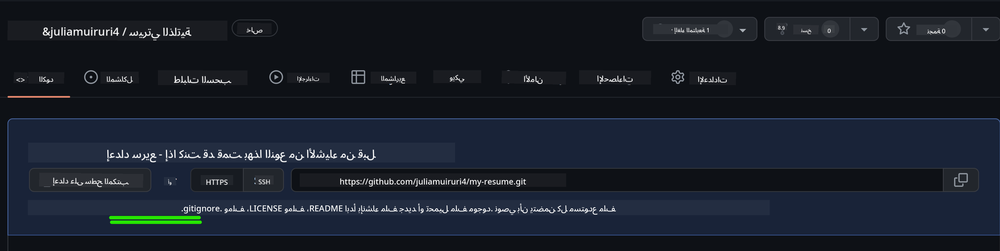
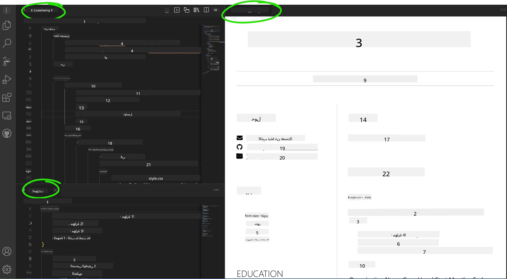

<!--
CO_OP_TRANSLATOR_METADATA:
{
  "original_hash": "effe56ba51c38d7bdfad1ea38288666b",
  "translation_date": "2025-10-22T14:07:33+00:00",
  "source_file": "8-code-editor/1-using-a-code-editor/assignment.md",
  "language_code": "ar"
}
-->
# إنشاء موقع ويب للسيرة الذاتية باستخدام VSCode.dev

قم بتحويل فرصك المهنية من خلال بناء موقع ويب احترافي للسيرة الذاتية يعرض مهاراتك وخبراتك بطريقة تفاعلية وعصرية. بدلاً من إرسال ملفات PDF التقليدية، تخيل تقديم موقع ويب أنيق ومتجاوب للمسؤولين عن التوظيف يعرض مؤهلاتك وقدراتك في تطوير الويب.

هذا التمرين العملي يضع جميع مهاراتك في VSCode.dev موضع التنفيذ أثناء إنشاء شيء مفيد حقًا لمسارك المهني. ستختبر سير العمل الكامل لتطوير الويب - بدءًا من إنشاء المستودع وحتى النشر - وكل ذلك من خلال متصفحك.

عند إكمال هذا المشروع، سيكون لديك حضور احترافي عبر الإنترنت يمكن مشاركته بسهولة مع أصحاب العمل المحتملين، وتحديثه مع نمو مهاراتك، وتخصيصه ليتناسب مع علامتك الشخصية. هذا هو النوع العملي من المشاريع الذي يظهر مهارات تطوير الويب في العالم الحقيقي.

## أهداف التعلم

بعد إكمال هذا التمرين، ستكون قادرًا على:

- **إنشاء** وإدارة مشروع تطوير ويب كامل باستخدام VSCode.dev
- **هيكلة** موقع ويب احترافي باستخدام عناصر HTML الدلالية
- **تصميم** تخطيطات متجاوبة باستخدام تقنيات CSS الحديثة
- **تنفيذ** ميزات تفاعلية باستخدام تقنيات الويب الأساسية
- **نشر** موقع ويب مباشر يمكن الوصول إليه عبر رابط قابل للمشاركة
- **إظهار** أفضل ممارسات التحكم في الإصدارات طوال عملية التطوير

## المتطلبات الأساسية

قبل البدء في هذا التمرين، تأكد من أن لديك:

- حساب GitHub (قم بإنشاء واحد على [github.com](https://github.com/) إذا لزم الأمر)
- إكمال درس VSCode.dev الذي يغطي التنقل في الواجهة والعمليات الأساسية
- فهم أساسي لهيكل HTML ومفاهيم تصميم CSS

## إعداد المشروع وإنشاء المستودع

لنبدأ بإعداد أساس مشروعك. هذه العملية تعكس سير العمل في تطوير المشاريع في العالم الحقيقي حيث تبدأ المشاريع بالتخطيط الصحيح لهيكل المستودع.

### الخطوة 1: إنشاء مستودع GitHub الخاص بك

إعداد مستودع مخصص يضمن تنظيم مشروعك والتحكم في الإصدارات بشكل صحيح منذ البداية.

1. **انتقل** إلى [GitHub.com](https://github.com) وقم بتسجيل الدخول إلى حسابك
2. **انقر** على الزر الأخضر "New" أو رمز "+" في الزاوية العلوية اليمنى
3. **قم بتسمية** مستودعك `my-resume` (أو اختر اسمًا شخصيًا مثل `john-smith-resume`)
4. **أضف** وصفًا موجزًا: "موقع ويب للسيرة الذاتية الاحترافية مبني باستخدام HTML وCSS"
5. **اختر** "Public" لجعل سيرتك الذاتية متاحة لأصحاب العمل المحتملين
6. **حدد** "Add a README file" لإنشاء وصف أولي للمشروع
7. **انقر** على "Create repository" لإكمال الإعداد

> 💡 **نصيحة لتسمية المستودع**: استخدم أسماء وصفية واحترافية تشير بوضوح إلى هدف المشروع. هذا يساعد عند مشاركته مع أصحاب العمل أو أثناء مراجعات الحافظة.

### الخطوة 2: تهيئة هيكل المشروع

نظرًا لأن VSCode.dev يتطلب وجود ملف واحد على الأقل لفتح المستودع، سنقوم بإنشاء ملف HTML الرئيسي مباشرة على GitHub قبل الانتقال إلى محرر الويب.

1. **انقر** على رابط "creating a new file" في مستودعك الجديد
2. **اكتب** `index.html` كاسم الملف
3. **أضف** هيكل HTML الأولي التالي:

```html
<!DOCTYPE html>
<html lang="en">
<head>
    <meta charset="UTF-8">
    <meta name="viewport" content="width=device-width, initial-scale=1.0">
    <title>Your Name - Professional Resume</title>
</head>
<body>
    <h1>Your Name</h1>
    <p>Professional Resume Website</p>
</body>
</html>
```

4. **اكتب** رسالة الالتزام: "إضافة هيكل HTML الأولي"
5. **انقر** على "Commit new file" لحفظ التغييرات



**ما الذي يحققه هذا الإعداد الأولي:**
- **يؤسس** هيكل مستند HTML5 الصحيح باستخدام العناصر الدلالية
- **يتضمن** علامة meta الخاصة بالعرض لتوافق التصميم المتجاوب
- **يحدد** عنوان صفحة وصفي يظهر في علامات تبويب المتصفح
- **يخلق** الأساس لتنظيم المحتوى الاحترافي

## العمل في VSCode.dev

الآن بعد أن تم إنشاء أساس مستودعك، دعنا ننتقل إلى VSCode.dev للعمل الرئيسي في التطوير. يوفر هذا المحرر المستند إلى الويب جميع الأدوات اللازمة لتطوير الويب الاحترافي.

### الخطوة 3: افتح مشروعك في VSCode.dev

1. **انتقل** إلى [vscode.dev](https://vscode.dev) في علامة تبويب جديدة في المتصفح
2. **انقر** على "Open Remote Repository" في شاشة الترحيب
3. **انسخ** رابط مستودعك من GitHub والصقه في حقل الإدخال

   الصيغة: `https://github.com/your-username/my-resume`
   
   *استبدل `your-username` باسم المستخدم الفعلي الخاص بك على GitHub*

4. **اضغط** Enter لتحميل مشروعك

✅ **مؤشر النجاح**: يجب أن ترى ملفات مشروعك في الشريط الجانبي للمستكشف و`index.html` متاحًا للتحرير في منطقة المحرر الرئيسية.


**ما ستراه في الواجهة:**
- **الشريط الجانبي للمستكشف**: **يعرض** ملفات المستودع وهيكل المجلدات
- **منطقة المحرر**: **تظهر** محتوى الملفات المحددة للتحرير
- **شريط النشاط**: **يوفر** الوصول إلى ميزات مثل التحكم في المصدر والإضافات
- **شريط الحالة**: **يشير** إلى حالة الاتصال ومعلومات الفرع الحالي

### الخطوة 4: بناء محتوى السيرة الذاتية الخاص بك

استبدل محتوى العنصر النائب في `index.html` بهيكل شامل للسيرة الذاتية. يوفر هذا HTML الأساس لعرض احترافي لمؤهلاتك.

<details>
<summary><b>هيكل السيرة الذاتية الكامل بلغة HTML</b></summary>

```html
<!DOCTYPE html>
<html lang="en">
<head>
    <meta charset="UTF-8">
    <meta name="viewport" content="width=device-width, initial-scale=1.0">
    <link href="style.css" rel="stylesheet">
    <link rel="stylesheet" href="https://cdnjs.cloudflare.com/ajax/libs/font-awesome/5.15.4/css/all.min.css">
    <title>Your Name - Professional Resume</title>
</head>
<body>
    <header id="header">
        <h1>Your Full Name</h1>
        <hr>
        <p class="role">Your Professional Title</p>
        <hr>
    </header>
    
    <main>
        <article id="mainLeft">
            <section>
                <h2>CONTACT</h2>
                <p>
                    <i class="fa fa-envelope" aria-hidden="true"></i>
                    <a href="mailto:your.email@domain.com">your.email@domain.com</a>
                </p>
                <p>
                    <i class="fab fa-github" aria-hidden="true"></i>
                    <a href="https://github.com/your-username">github.com/your-username</a>
                </p>
                <p>
                    <i class="fab fa-linkedin" aria-hidden="true"></i>
                    <a href="https://linkedin.com/in/your-profile">linkedin.com/in/your-profile</a>
                </p>
            </section>
            
            <section>
                <h2>SKILLS</h2>
                <ul>
                    <li>HTML5 & CSS3</li>
                    <li>JavaScript (ES6+)</li>
                    <li>Responsive Web Design</li>
                    <li>Version Control (Git)</li>
                    <li>Problem Solving</li>
                </ul>
            </section>
            
            <section>
                <h2>EDUCATION</h2>
                <h3>Your Degree or Certification</h3>
                <p>Institution Name</p>
                <p>Start Date - End Date</p>
            </section>
        </article>
        
        <article id="mainRight">
            <section>
                <h2>ABOUT</h2>
                <p>Write a compelling summary that highlights your passion for web development, key achievements, and career goals. This section should give employers insight into your personality and professional approach.</p>
            </section>
            
            <section>
                <h2>WORK EXPERIENCE</h2>
                <div class="job">
                    <h3>Job Title</h3>
                    <p class="company">Company Name | Start Date – End Date</p>
                    <ul>
                        <li>Describe a key accomplishment or responsibility</li>
                        <li>Highlight specific skills or technologies used</li>
                        <li>Quantify impact where possible (e.g., "Improved efficiency by 25%")</li>
                    </ul>
                </div>
                
                <div class="job">
                    <h3>Previous Job Title</h3>
                    <p class="company">Previous Company | Start Date – End Date</p>
                    <ul>
                        <li>Focus on transferable skills and achievements</li>
                        <li>Demonstrate growth and learning progression</li>
                        <li>Include any leadership or collaboration experiences</li>
                    </ul>
                </div>
            </section>
            
            <section>
                <h2>PROJECTS</h2>
                <div class="project">
                    <h3>Project Name</h3>
                    <p>Brief description of what the project accomplishes and technologies used.</p>
                    <a href="#" target="_blank">View Project</a>
                </div>
            </section>
        </article>
    </main>
</body>
</html>
```
</details>

**إرشادات التخصيص:**
- **استبدل** كل النصوص النموذجية بمعلوماتك الفعلية
- **عدل** الأقسام بناءً على مستوى خبرتك وتركيزك المهني
- **أضف** أو احذف الأقسام حسب الحاجة (مثل الشهادات، العمل التطوعي، اللغات)
- **قم بتضمين** روابط لملفاتك الشخصية ومشاريعك الفعلية

### الخطوة 5: إنشاء ملفات داعمة

تتطلب المواقع الاحترافية هياكل ملفات منظمة. قم بإنشاء ورقة أنماط CSS وملفات التكوين اللازمة لمشروع كامل.

1. **مرر** فوق اسم مجلد مشروعك في الشريط الجانبي للمستكشف
2. **انقر** على رمز "ملف جديد" (📄+) الذي يظهر
3. **قم بإنشاء** هذه الملفات واحدًا تلو الآخر:
   - `style.css` (للتصميم والتخطيط)
   - `codeswing.json` (لتكوين امتداد المعاينة)

**إنشاء ملف CSS (`style.css`):**

<details>
<summary><b>تصميم CSS احترافي</b></summary>

```css
/* Modern Resume Styling */
body {
    font-family: 'Segoe UI', Tahoma, Geneva, Verdana, sans-serif;
    font-size: 16px;
    line-height: 1.6;
    max-width: 960px;
    margin: 0 auto;
    padding: 20px;
    color: #333;
    background-color: #f9f9f9;
}

/* Header Styling */
header {
    text-align: center;
    margin-bottom: 3em;
    padding: 2em;
    background: linear-gradient(135deg, #667eea 0%, #764ba2 100%);
    color: white;
    border-radius: 10px;
    box-shadow: 0 4px 6px rgba(0, 0, 0, 0.1);
}

h1 {
    font-size: 3em;
    letter-spacing: 0.1em;
    margin-bottom: 0.2em;
    font-weight: 300;
}

.role {
    font-size: 1.3em;
    font-weight: 300;
    margin: 1em 0;
}

/* Main Content Layout */
main {
    display: grid;
    grid-template-columns: 35% 65%;
    gap: 3em;
    margin-top: 3em;
    background: white;
    padding: 2em;
    border-radius: 10px;
    box-shadow: 0 2px 10px rgba(0, 0, 0, 0.1);
}

/* Typography */
h2 {
    font-size: 1.4em;
    font-weight: 600;
    margin-bottom: 1em;
    color: #667eea;
    border-bottom: 2px solid #667eea;
    padding-bottom: 0.3em;
}

h3 {
    font-size: 1.1em;
    font-weight: 600;
    margin-bottom: 0.5em;
    color: #444;
}

/* Section Styling */
section {
    margin-bottom: 2.5em;
}

#mainLeft {
    border-right: 1px solid #e0e0e0;
    padding-right: 2em;
}

/* Contact Links */
section a {
    color: #667eea;
    text-decoration: none;
    transition: color 0.3s ease;
}

section a:hover {
    color: #764ba2;
    text-decoration: underline;
}

/* Icons */
i {
    margin-right: 0.8em;
    width: 20px;
    text-align: center;
    color: #667eea;
}

/* Lists */
ul {
    list-style: none;
    padding-left: 0;
}

li {
    margin: 0.5em 0;
    padding: 0.3em 0;
    position: relative;
}

li:before {
    content: "▸";
    color: #667eea;
    margin-right: 0.5em;
}

/* Work Experience */
.job, .project {
    margin-bottom: 2em;
    padding-bottom: 1.5em;
    border-bottom: 1px solid #f0f0f0;
}

.company {
    font-style: italic;
    color: #666;
    margin-bottom: 0.5em;
}

/* Responsive Design */
@media (max-width: 768px) {
    main {
        grid-template-columns: 1fr;
        gap: 2em;
    }
    
    #mainLeft {
        border-right: none;
        border-bottom: 1px solid #e0e0e0;
        padding-right: 0;
        padding-bottom: 2em;
    }
    
    h1 {
        font-size: 2.2em;
    }
    
    body {
        padding: 10px;
    }
}

/* Print Styles */
@media print {
    body {
        background: white;
        color: black;
        font-size: 12pt;
    }
    
    header {
        background: none;
        color: black;
        box-shadow: none;
    }
    
    main {
        box-shadow: none;
    }
}
```
</details>

**إنشاء ملف التكوين (`codeswing.json`):**

```json
{
    "scripts": [],
    "styles": []
}
```

**فهم ميزات CSS:**
- **يستخدم** CSS Grid لتخطيط هيكل متجاوب واحترافي
- **ينفذ** مخططات ألوان حديثة مع رؤوس متدرجة
- **يتضمن** تأثيرات التمرير والانتقالات السلسة للتفاعل
- **يوفر** تصميمًا متجاوبًا يعمل على جميع أحجام الأجهزة
- **يضيف** أنماطًا صديقة للطباعة لتوليد ملفات PDF

### الخطوة 6: تثبيت وتكوين الإضافات

تعزز الإضافات تجربة التطوير الخاصة بك من خلال توفير قدرات معاينة مباشرة وأدوات سير عمل محسنة. يعد امتداد CodeSwing مفيدًا بشكل خاص لمشاريع تطوير الويب.

**تثبيت امتداد CodeSwing:**

1. **انقر** على رمز الإضافات (🧩) في شريط النشاط
2. **ابحث** عن "CodeSwing" في مربع البحث في السوق
3. **حدد** امتداد CodeSwing من نتائج البحث
4. **انقر** على الزر الأزرق "Install"


**ما يوفره CodeSwing:**
- **يمكنك** من معاينة مباشرة لموقعك أثناء التحرير
- **يعرض** التغييرات في الوقت الفعلي دون تحديث يدوي
- **يدعم** أنواع ملفات متعددة بما في ذلك HTML وCSS وJavaScript
- **يوفر** تجربة بيئة تطوير متكاملة

**النتائج الفورية بعد التثبيت:**
بمجرد تثبيت CodeSwing، سترى معاينة مباشرة لموقع السيرة الذاتية الخاص بك تظهر في المحرر. يتيح لك ذلك رؤية كيف يبدو موقعك بالضبط أثناء إجراء التغييرات.



**فهم الواجهة المحسنة:**
- **عرض مقسم**: **يعرض** الكود على جانب واحد والمعاينة المباشرة على الجانب الآخر
- **تحديثات في الوقت الفعلي**: **تعكس** التغييرات فورًا أثناء الكتابة
- **معاينة تفاعلية**: **تتيح** لك اختبار الروابط والتفاعلات
- **محاكاة الهاتف المحمول**: **توفر** قدرات اختبار التصميم المتجاوب

### الخطوة 7: التحكم في الإصدارات والنشر

الآن بعد أن اكتملت موقع السيرة الذاتية الخاص بك، استخدم Git لحفظ عملك وجعله متاحًا عبر الإنترنت.

**التزام تغييراتك:**

1. **انقر** على رمز التحكم في المصدر (🌿) في شريط النشاط
2. **راجع** جميع الملفات التي أنشأتها وعدلتها في قسم "التغييرات"
3. **قم بمرحلة** تغييراتك بالنقر على رمز "+" بجانب كل ملف
4. **اكتب** رسالة التزام وصفية، مثل:
   - "إضافة موقع ويب كامل للسيرة الذاتية مع تصميم متجاوب"
   - "تنفيذ تصميم احترافي وهيكل محتوى"
5. **انقر** على علامة الاختيار (✓) للالتزام ودفع تغييراتك

**أمثلة على رسائل الالتزام الفعالة:**
- "إضافة محتوى وتصميم احترافي للسيرة الذاتية"
- "تنفيذ تصميم متجاوب لتوافق الهاتف المحمول"
- "تحديث معلومات الاتصال وروابط المشاريع"

> 💡 **نصيحة احترافية**: تساعد رسائل الالتزام الجيدة في تتبع تطور مشروعك وتظهر الاهتمام بالتفاصيل - وهي صفات يقدرها أصحاب العمل.

**الوصول إلى موقعك المنشور:**
بمجرد الالتزام، يمكنك العودة إلى مستودع GitHub الخاص بك باستخدام قائمة الهامبرغر (☰) في الزاوية العلوية اليسرى. أصبح موقع السيرة الذاتية الخاص بك الآن تحت التحكم في الإصدارات وجاهز للنشر أو المشاركة.

## النتائج والخطوات التالية

**تهانينا! 🎉** لقد نجحت في إنشاء موقع ويب احترافي للسيرة الذاتية باستخدام VSCode.dev. مشروعك يظهر:
**المهارات التقنية التي تم إظهارها:**
- **إدارة المستودعات**: إنشاء وتنظيم هيكل مشروع كامل
- **تطوير الويب**: بناء موقع ويب متجاوب باستخدام HTML5 وCSS3 الحديث
- **التحكم في الإصدارات**: تنفيذ سير عمل Git الصحيح مع التزامات ذات معنى
- **إتقان الأدوات**: استخدام واجهة VSCode.dev ونظام الإضافات بفعالية

**النتائج المهنية المحققة:**
- **حضور عبر الإنترنت**: رابط قابل للمشاركة يعرض مؤهلاتك
- **تنسيق حديث**: بديل تفاعلي للسير الذاتية التقليدية بصيغة PDF
- **مهارات قابلة للإثبات**: دليل ملموس على قدراتك في تطوير الويب
- **تحديثات سهلة**: أساس يمكنك تحسينه وتخصيصه باستمرار

### خيارات النشر

لجعل سيرتك الذاتية متاحة لأصحاب العمل، فكر في خيارات الاستضافة التالية:

**GitHub Pages (موصى به):**
1. انتقل إلى إعدادات مستودعك على GitHub
2. قم بالتمرير إلى قسم "Pages"
3. اختر "Deploy from a branch" وحدد "main"
4. سيكون موقعك متاحًا على `https://your-username.github.io/my-resume`

**منصات بديلة:**
- **Netlify**: نشر تلقائي مع نطاقات مخصصة
- **Vercel**: نشر سريع مع ميزات استضافة حديثة
- **GitHub Codespaces**: بيئة تطوير مع معاينة مدمجة

### اقتراحات التحسين

واصل تطوير مهاراتك بإضافة هذه الميزات:

**تحسينات تقنية:**
- **تفاعل JavaScript**: أضف تمريرًا سلسًا أو عناصر تفاعلية
- **تبديل الوضع الداكن**: نفذ تبديل الثيمات لتفضيلات المستخدم
- **نموذج الاتصال**: تمكين التواصل المباشر من أصحاب العمل المحتملين
- **تحسين SEO**: أضف علامات meta وبيانات منظمة لتحسين الرؤية في البحث

**تحسينات المحتوى:**
- **حافظة المشاريع**: روابط إلى مستودعات GitHub وعروض حية
- **تصور المهارات**: إنشاء أشرطة تقدم أو أنظمة تقييم المهارات
- **قسم التوصيات**: تضمين توصيات من زملاء أو مدربين
- **دمج المدونة**: أضف قسم مدونة لعرض رحلتك التعليمية

## تحدي GitHub Copilot Agent 🚀

استخدم وضع Agent لإكمال التحدي التالي:

**الوصف:** قم بتحسين موقع السيرة الذاتية الخاص بك بميزات متقدمة تظهر قدرات تطوير الويب الاحترافية ومبادئ التصميم الحديثة.

**المهمة:** بناءً على موقع السيرة الذاتية الحالي الخاص بك، قم بتنفيذ الميزات المتقدمة التالية:
1. أضف تبديل الثيمات الداكنة/الخفيفة مع انتقالات سلسة
2. أنشئ قسم مهارات تفاعلي مع أشرطة تقدم متحركة
3. نفذ نموذج اتصال مع تحقق من صحة النموذج
4. أضف قسم حافظة المشاريع مع تأثيرات التمرير والنوافذ المنبثقة
5. قم بتضمين قسم مدونة مع 3 منشورات نموذجية على الأقل حول رحلتك التعليمية
6. تحسين SEO باستخدام علامات meta المناسبة، البيانات المنظمة، والأداء
7. نشر الموقع المحسن باستخدام GitHub Pages أو Netlify
8. وثق جميع الميزات الجديدة في README.md مع لقطات شاشة

يجب أن يظهر موقعك المحسن إتقان ممارسات تطوير الويب الحديثة بما في ذلك التصميم المتجاوب، التفاعل باستخدام JavaScript، وسير عمل النشر الاحترافي.

## تمديد التحدي

هل أنت مستعد لتطوير مهاراتك أكثر؟ جرب هذه التحديات المتقدمة:

**📱 إعادة تصميم موجهة للجوال:** قم بإعادة بناء موقعك بالكامل باستخدام نهج موجه للجوال مع CSS Grid وFlexbox

**🔍 تحسين SEO:** نفذ تحسين SEO شامل بما في ذلك علامات meta، البيانات المنظمة، وتحسين الأداء

**🌐 دعم متعدد اللغات:** أضف ميزات التدويل لدعم لغات متعددة

**📊 دمج التحليلات:** أضف Google Analytics لتتبع تفاعل الزوار وتحسين المحتوى الخاص بك

**🚀 تحسين الأداء:** حقق درجات مثالية في Lighthouse عبر جميع الفئات

## المراجعة والدراسة الذاتية

وسع معرفتك باستخدام هذه الموارد:

**ميزات VSCode.dev المتقدمة:**
- [وثائق VSCode.dev](https://code.visualstudio.com/docs/editor/vscode-web?WT.mc_id=academic-0000-alfredodeza) - دليل كامل للتحرير المستند إلى الويب
- [GitHub Codespaces](https://docs.github.com/en/codespaces) - بيئات تطوير سحابية

**أفضل ممارسات تطوير الويب:**
- **التصميم المتجاوب**: دراسة CSS Grid وFlexbox للحصول على تخطيطات حديثة
- **الوصولية**: تعرّف على إرشادات WCAG لتصميم ويب شامل
- **الأداء**: استكشف أدوات مثل Lighthouse لتحسين الأداء
- **تحسين محركات البحث (SEO)**: فهم أساسيات تحسين محركات البحث

**التطوير المهني:**
- **بناء ملف الأعمال**: أنشئ مشاريع إضافية لعرض مهارات متنوعة
- **المصدر المفتوح**: ساهم في مشاريع قائمة لاكتساب خبرة في التعاون
- **التواصل**: شارك موقع سيرتك الذاتية في مجتمعات المطورين للحصول على تعليقات
- **التعلم المستمر**: ابقَ على اطلاع بأحدث اتجاهات وتقنيات تطوير الويب

---

**خطواتك القادمة:** شارك موقع سيرتك الذاتية مع الأصدقاء أو العائلة أو المرشدين للحصول على تعليقات. استخدم اقتراحاتهم لتحسين التصميم وتطويره. تذكر، هذا المشروع ليس مجرد سيرة ذاتية – إنه عرض لنموك كمطور ويب!

---

**إخلاء المسؤولية**:  
تم ترجمة هذا المستند باستخدام خدمة الترجمة بالذكاء الاصطناعي [Co-op Translator](https://github.com/Azure/co-op-translator). بينما نسعى لتحقيق الدقة، يرجى العلم أن الترجمات الآلية قد تحتوي على أخطاء أو عدم دقة. يجب اعتبار المستند الأصلي بلغته الأصلية المصدر الموثوق. للحصول على معلومات حاسمة، يُوصى بالترجمة البشرية الاحترافية. نحن غير مسؤولين عن أي سوء فهم أو تفسيرات خاطئة تنشأ عن استخدام هذه الترجمة.