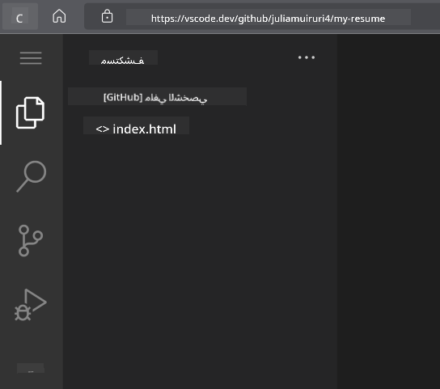

<!--
CO_OP_TRANSLATOR_METADATA:
{
  "original_hash": "2fcb983b8dbadadb1bc2e97f8c12dac5",
  "translation_date": "2025-08-25T23:21:12+00:00",
  "source_file": "8-code-editor/1-using-a-code-editor/assignment.md",
  "language_code": "ar"
}
-->
# إنشاء موقع للسيرة الذاتية باستخدام vscode.dev

_كم سيكون رائعًا أن يطلب منك مسؤول التوظيف سيرتك الذاتية وترسل له رابطًا؟_ 😎

## الأهداف

بعد هذا التمرين، ستتعلم كيفية:

- إنشاء موقع لعرض سيرتك الذاتية

### المتطلبات الأساسية

1. حساب على GitHub. انتقل إلى [GitHub](https://github.com/) وقم بإنشاء حساب إذا لم يكن لديك بالفعل.

## الخطوات

**الخطوة 1:** قم بإنشاء مستودع جديد على GitHub وأعطه اسم `my-resume`

**الخطوة 2:** قم بإنشاء ملف `index.html` في المستودع الخاص بك. سنضيف ملفًا واحدًا على الأقل أثناء العمل على github.com لأنك لا تستطيع فتح مستودع فارغ على vscode.dev.

انقر على رابط `creating a new file`، اكتب اسم الملف `index.html`، ثم اختر زر `Commit new file`.


**الخطوة 3:** افتح [VSCode.dev](https://vscode.dev) واختر زر `Open Remote Repository`.

انسخ رابط المستودع الذي أنشأته للتو لموقع سيرتك الذاتية والصقه في مربع الإدخال:

_استبدل `your-username` باسم المستخدم الخاص بك على GitHub_

```
https://github.com/your-username/my-resume
```

✅ إذا نجحت العملية، سترى مشروعك وملف index.html مفتوحين في محرر النصوص على المتصفح.



**الخطوة 4:** افتح ملف `index.html`، الصق الكود أدناه في منطقة الكود واحفظه.

<details>
    <summary><b>كود HTML المسؤول عن محتوى موقع سيرتك الذاتية.</b></summary>
    
        <html>

            <head>
                <link href="style.css" rel="stylesheet">
                <link rel="stylesheet" href="https://cdnjs.cloudflare.com/ajax/libs/font-awesome/5.15.4/css/all.min.css">
                <title>ضع اسمك هنا!</title>
            </head>
            <body>
                <header id="header">
                    <!-- رأس السيرة الذاتية مع اسمك ولقبك -->
                    <h1>ضع اسمك هنا!</h1>
                    <hr>
                    دورك الوظيفي!
                    <hr>
                </header>
                <main>
                    <article id="mainLeft">
                        <section>
                            <h2>التواصل</h2>
                            <!-- معلومات التواصل بما في ذلك وسائل التواصل الاجتماعي -->
                            <p>
                                <i class="fa fa-envelope" aria-hidden="true"></i>
                                <a href="mailto:username@domain.top-level domain">اكتب بريدك الإلكتروني هنا</a>
                            </p>
                            <p>
                                <i class="fab fa-github" aria-hidden="true"></i>
                                <a href="github.com/yourGitHubUsername">اكتب اسم المستخدم الخاص بك هنا!</a>
                            </p>
                            <p>
                                <i class="fab fa-linkedin" aria-hidden="true"></i>
                                <a href="linkedin.com/yourLinkedInUsername">اكتب اسم المستخدم الخاص بك هنا!</a>
                            </p>
                        </section>
                        <section>
                            <h2>المهارات</h2>
                            <!-- مهاراتك -->
                            <ul>
                                <li>المهارة الأولى!</li>
                                <li>المهارة الثانية!</li>
                                <li>المهارة الثالثة!</li>
                                <li>المهارة الرابعة!</li>
                            </ul>
                        </section>
                        <section>
                            <h2>التعليم</h2>
                            <!-- تعليمك -->
                            <h3>اكتب تخصصك هنا!</h3>
                            <p>
                                اكتب اسم المؤسسة التعليمية هنا!
                            </p>
                            <p>
                                تاريخ البدء - تاريخ الانتهاء
                            </p>
                        </section>            
                    </article>
                    <article id="mainRight">
                        <section>
                            <h2>نبذة عنك</h2>
                            <!-- نبذة عنك -->
                            <p>اكتب فقرة قصيرة عن نفسك!</p>
                        </section>
                        <section>
                            <h2>الخبرة العملية</h2>
                            <!-- خبرتك العملية -->
                            <h3>المسمى الوظيفي</h3>
                            <p>
                                اسم المنظمة هنا | شهر البدء – شهر الانتهاء
                            </p>
                            <ul>
                                    <li>المهمة الأولى - اكتب ما قمت به!</li>
                                    <li>المهمة الثانية - اكتب ما قمت به!</li>
                                    <li>اكتب النتائج/الأثر الذي حققته</li>
                                    
                            </ul>
                            <h3>المسمى الوظيفي الثاني</h3>
                            <p>
                                اسم المنظمة هنا | شهر البدء – شهر الانتهاء
                            </p>
                            <ul>
                                    <li>المهمة الأولى - اكتب ما قمت به!</li>
                                    <li>المهمة الثانية - اكتب ما قمت به!</li>
                                    <li>اكتب النتائج/الأثر الذي حققته</li>
                                    
                            </ul>
                        </section>
                    </article>
                </main>
            </body>
        </html>
</details>

قم بإضافة تفاصيل سيرتك الذاتية لاستبدال _النصوص المؤقتة_ في كود HTML.

**الخطوة 5:** قم بالتحويم على مجلد My-Resume، انقر على أيقونة `New File ...` وقم بإنشاء ملفين جديدين في مشروعك: `style.css` و `codeswing.json`.

**الخطوة 6:** افتح ملف `style.css`، الصق الكود أدناه واحفظه.

<details>
        <summary><b>كود CSS لتنسيق تخطيط الموقع.</b></summary>
            
            body {
                font-family: 'Segoe UI', Tahoma, Geneva, Verdana, sans-serif;
                font-size: 16px;
                max-width: 960px;
                margin: auto;
            }
            h1 {
                font-size: 3em;
                letter-spacing: .6em;
                padding-top: 1em;
                padding-bottom: 1em;
            }

            h2 {
                font-size: 1.5em;
                padding-bottom: 1em;
            }

            h3 {
                font-size: 1em;
                padding-bottom: 1em;
            }
            main { 
                display: grid;
                grid-template-columns: 40% 60%;
                margin-top: 3em;
            }
            header {
                text-align: center;
                margin: auto 2em;
            }

            section {
                margin: auto 1em 4em 2em;
            }

            i {
                margin-right: .5em;
            }

            p {
                margin: .2em auto
            }

            hr {
                border: none;
                background-color: lightgray;
                height: 1px;
            }

            h1, h2, h3 {
                font-weight: 100;
                margin-bottom: 0;
            }
            #mainLeft {
                border-right: 1px solid lightgray;
            }
            
</details>

**الخطوة 6:** افتح ملف `codeswing.json`، الصق الكود أدناه واحفظه.

    {
    "scripts": [],
    "styles": []
    }

**الخطوة 7:** قم بتثبيت إضافة `Codeswing` لعرض موقع السيرة الذاتية في منطقة الكود.

انقر على أيقونة _`Extensions`_ في شريط النشاط واكتب Codeswing. إما انقر على زر _التثبيت الأزرق_ في شريط النشاط الموسع لتثبيت الإضافة أو استخدم زر التثبيت الذي يظهر في منطقة الكود بمجرد اختيار الإضافة لتحميل معلومات إضافية. مباشرة بعد تثبيت الإضافة، لاحظ التغييرات التي طرأت على مشروعك 😃.


هذا ما ستراه على شاشتك بعد تثبيت الإضافة.


إذا كنت راضيًا عن التغييرات التي أجريتها، قم بالتحويم على مجلد `Changes` وانقر على زر `+` لتحديد التغييرات.

اكتب رسالة الالتزام _(وصف للتغيير الذي أجريته على المشروع)_ وقم بتأكيد التغييرات بالنقر على علامة `check`. بمجرد الانتهاء من العمل على مشروعك، اختر أيقونة القائمة في أعلى اليسار للعودة إلى المستودع على GitHub.

تهانينا 🎉 لقد أنشأت للتو موقع سيرتك الذاتية باستخدام vscode.dev في خطوات قليلة.

## 🚀 التحدي

افتح مستودعًا عن بُعد لديك صلاحيات لإجراء تغييرات عليه وقم بتحديث بعض الملفات. بعد ذلك، حاول إنشاء فرع جديد مع تغييراتك وقم بإنشاء طلب دمج.

## المراجعة والدراسة الذاتية

اقرأ المزيد عن [VSCode.dev](https://code.visualstudio.com/docs/editor/vscode-web?WT.mc_id=academic-0000-alfredodeza) وبعض ميزاته الأخرى.

**إخلاء المسؤولية**:  
تم ترجمة هذا المستند باستخدام خدمة الترجمة بالذكاء الاصطناعي [Co-op Translator](https://github.com/Azure/co-op-translator). بينما نسعى لتحقيق الدقة، يرجى العلم أن الترجمات الآلية قد تحتوي على أخطاء أو معلومات غير دقيقة. يجب اعتبار المستند الأصلي بلغته الأصلية المصدر الرسمي. للحصول على معلومات حاسمة، يُوصى بالاستعانة بترجمة بشرية احترافية. نحن غير مسؤولين عن أي سوء فهم أو تفسيرات خاطئة ناتجة عن استخدام هذه الترجمة.