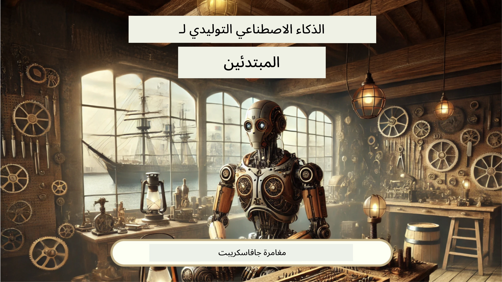
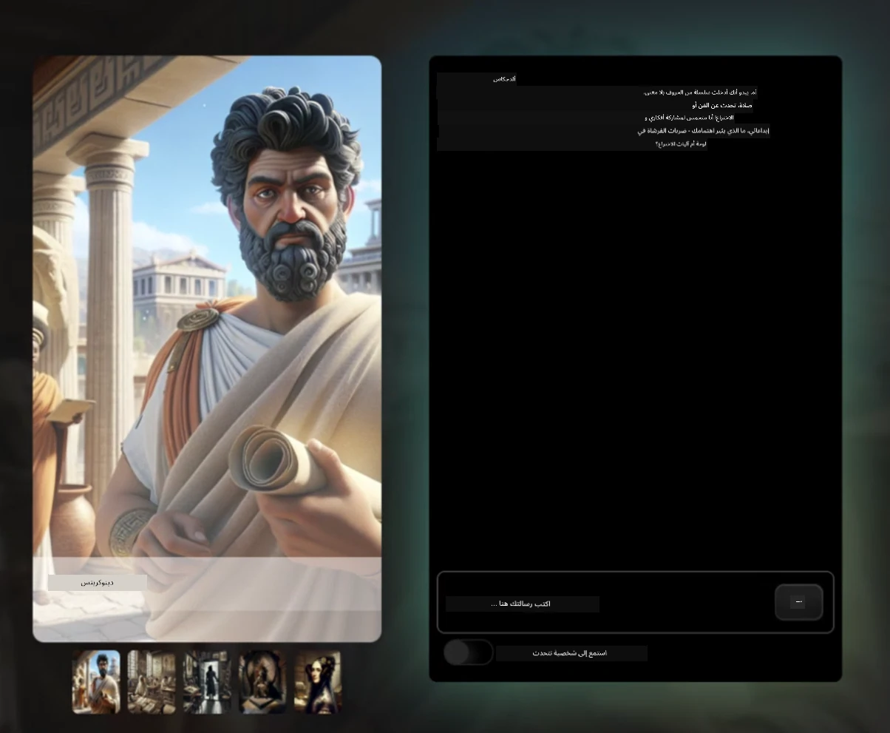
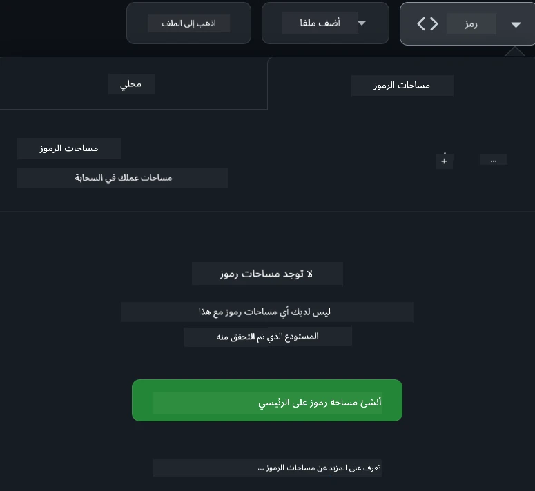

<!--
CO_OP_TRANSLATOR_METADATA:
{
  "original_hash": "fea3a0fceb8ad86fd640c09cf63a2aac",
  "translation_date": "2026-01-06T09:32:35+00:00",
  "source_file": "README.md",
  "language_code": "ar"
}
-->
[](https://github.com/microsoft/Web-Dev-For-Beginners/blob/master/LICENSE)
[](https://GitHub.com/microsoft/Web-Dev-For-Beginners/graphs/contributors/)
[](https://GitHub.com/microsoft/Web-Dev-For-Beginners/issues/)
[](https://GitHub.com/microsoft/Web-Dev-For-Beginners/pulls/)
[](http://makeapullrequest.com)

[](https://GitHub.com/microsoft/Web-Dev-For-Beginners/watchers/)
[](https://GitHub.com/microsoft/Web-Dev-For-Beginners/network/)
[](https://GitHub.com/microsoft/Web-Dev-For-Beginners/stargazers/)

[](https://discord.gg/nTYy5BXMWG)

# تطوير الويب للمبتدئين - منهج دراسي

تعلم أساسيات تطوير الويب مع دورتنا الشاملة التي تمتد 12 أسبوعًا بقيادة Microsoft Cloud Advocates. كل درس من الدروس الـ 24 يغوص في JavaScript و CSS و HTML من خلال مشاريع عملية مثل التيراريومز، إضافات المتصفح، وألعاب الفضاء. شارك في الاختبارات، المناقشات، والواجبات العملية. عزز مهاراتك وحقق أفضل استفادة من معرفتك من خلال منهجنا الفعال القائم على المشاريع. ابدأ رحلتك في البرمجة اليوم!

انضم إلى مجتمع Azure AI Foundry على ديسكورد

[](https://discord.gg/nTYy5BXMWG)

اتبع هذه الخطوات لتبدأ باستخدام هذه الموارد:
1. **إنشاء فرع من المستودع**: انقر [](https://GitHub.com/microsoft/Web-Dev-For-Beginners/fork)
2. **استنساخ المستودع**:   `git clone https://github.com/microsoft/Web-Dev-For-Beginners.git`
3. [**انضم إلى Azure AI Foundry Discord وقابل الخبراء والمطورين الآخرين**](https://discord.com/invite/ByRwuEEgH4)

### 🌐 دعم متعدد اللغات

#### مدعوم عبر GitHub Action (آلي & محدث دائمًا)

<!-- CO-OP TRANSLATOR LANGUAGES TABLE START -->
[العربية](./README.md) | [البنغالية](../bn/README.md) | [البلغارية](../bg/README.md) | [البورمية (ميانمار)](../my/README.md) | [الصينية (المبسطة)](../zh/README.md) | [الصينية (التقليدية، هونغ كونغ)](../hk/README.md) | [الصينية (التقليدية، ماكاو)](../mo/README.md) | [الصينية (التقليدية، تايوان)](../tw/README.md) | [الكرواتية](../hr/README.md) | [التشيكية](../cs/README.md) | [الدنماركية](../da/README.md) | [الهولندية](../nl/README.md) | [الإستونية](../et/README.md) | [الفنلندية](../fi/README.md) | [الفرنسية](../fr/README.md) | [الألمانية](../de/README.md) | [اليونانية](../el/README.md) | [العبرية](../he/README.md) | [الهندية](../hi/README.md) | [الهنغارية](../hu/README.md) | [الإندونيسية](../id/README.md) | [الإيطالية](../it/README.md) | [اليابانية](../ja/README.md) | [الكنادية](../kn/README.md) | [الكورية](../ko/README.md) | [الليتوانية](../lt/README.md) | [الماليزية](../ms/README.md) | [المالايالامية](../ml/README.md) | [الماراثية](../mr/README.md) | [النيبالية](../ne/README.md) | [النيجيرية بيدجين](../pcm/README.md) | [النرويجية](../no/README.md) | [الفارسية (الفارسية)](../fa/README.md) | [البولندية](../pl/README.md) | [البرتغالية (البرازيل)](../br/README.md) | [البرتغالية (البرتغال)](../pt/README.md) | [البنجابية (جيرموخي)](../pa/README.md) | [الرومانية](../ro/README.md) | [الروسية](../ru/README.md) | [الصربية (السيريلية)](../sr/README.md) | [السلوفاكية](../sk/README.md) | [السلوفينية](../sl/README.md) | [الإسبانية](../es/README.md) | [السواحيلية](../sw/README.md) | [السويدية](../sv/README.md) | [التاغالوغ (الفلبينية)](../tl/README.md) | [التاميل](../ta/README.md) | [التيلوجو](../te/README.md) | [التايلندية](../th/README.md) | [التركية](../tr/README.md) | [الأوكرانية](../uk/README.md) | [الأردية](../ur/README.md) | [الفيتنامية](../vi/README.md)

> **هل تفضل الاستنساخ محليًا؟**

> يحتوي هذا المستودع على أكثر من 50 ترجمة لغوية مما يزيد بشكل كبير حجم التنزيل. للاستنساخ بدون الترجمات، استخدم sparse checkout:
> ```bash
> git clone --filter=blob:none --sparse https://github.com/microsoft/Web-Dev-For-Beginners.git
> cd Web-Dev-For-Beginners
> git sparse-checkout set --no-cone '/*' '!translations' '!translated_images'
> ```
> هذا يمنحك كل ما تحتاجه لإكمال الدورة مع تحميل أسرع بكثير.
<!-- CO-OP TRANSLATOR LANGUAGES TABLE END -->

**إذا كنت ترغب في دعم المزيد من اللغات، قائمة اللغات المدعومة موجودة [هنا](https://github.com/Azure/co-op-translator/blob/main/getting_started/supported-languages.md)**

[](https://open.vscode.dev/microsoft/Web-Dev-For-Beginners)

#### 🧑‍🎓 _هل أنت طالب؟_

قم بزيارة [**صفحة مركز الطلاب**](https://docs.microsoft.com/learn/student-hub/?WT.mc_id=academic-77807-sagibbon) حيث ستجد موارد للمبتدئين، حزم الطلاب وحتى طرق للحصول على قسيمة شهادة مجانية. هذه هي الصفحة التي يجب عليك وضعها في المفضلة والتحقق منها من وقت لآخر حيث نقوم بتحديث المحتوى شهريًا.

### 📣 إعلان - تحديات وضع وكيل GitHub Copilot الجديد لإكمالها!

تمت إضافة تحدي جديد، ابحث عن "تحدي وكيل GitHub Copilot 🚀" في معظم الفصول. هذا تحدي جديد لك لتكملته باستخدام GitHub Copilot ووضع الوكيل. إذا لم تستخدم وضع الوكيل من قبل، فهو قادر ليس فقط على توليد النصوص بل يمكنه أيضًا إنشاء وتحرير الملفات، تنفيذ الأوامر والمزيد.

### 📣 إعلان - _مشروع جديد للبناء باستخدام الذكاء الاصطناعي التوليدي_

تمت إضافة مشروع مساعد الذكاء الاصطناعي الجديد، تفقده [المشروع](./9-chat-project/README.md)

### 📣 إعلان - _منهج جديد_ عن الذكاء الاصطناعي التوليدي للـ JavaScript تم إصداره للتو

لا تفوت منهج الذكاء الاصطناعي التوليدي الجديد!

قم بزيارة [https://aka.ms/genai-js-course](https://aka.ms/genai-js-course) للبدء!



- دروس تغطي كل شيء من الأساسيات إلى RAG.
- تفاعل مع شخصيات تاريخية باستخدام GenAI وتطبيقنا المصاحب.
- سرد ممتع وجذاب، ستسافر عبر الزمن!




كل درس يتضمن مهمة يجب إتمامها، اختبار معرفة، وتحدي لتوجيهك في تعلم موضوعات مثل:
- التهيئة و هندسة التهيئة
- إنشاء تطبيقات النصوص والصور
- تطبيقات البحث

قم بزيارة [https://aka.ms/genai-js-course](https://aka.ms/genai-js-course) للبدء!


## 🌱 البدء

> **أيها المعلمون**، لقد قمنا بتضمين [بعض الاقتراحات](for-teachers.md) حول كيفية استخدام هذا المنهج الدراسي. نود الحصول على ملاحظاتكم [في منتدى المناقشة الخاص بنا](https://github.com/microsoft/Web-Dev-For-Beginners/discussions/categories/teacher-corner)!

**[المتعلمون](https://aka.ms/student-page/?WT.mc_id=academic-77807-sagibbon)**، لكل درس، ابدأ باختبار قبل المحاضرة، ثم اقرأ المادة، أكمل الأنشطة المختلفة، وتحقق من فهمك باستخدام اختبار بعدها.

لتعزيز تجربتك التعليمية، تواصل مع زملائك للعمل معًا على المشاريع! نرحب بالنقاشات في [منتدى المناقشة](https://github.com/microsoft/Web-Dev-For-Beginners/discussions) حيث سيكون فريق المشرفين متاحًا للرد على أسئلتك.

لتعزيز تعليمك، نوصي بشدة استكشاف [Microsoft Learn](https://learn.microsoft.com/users/wirelesslife/collections/p1ddcy5jwy0jkm?WT.mc_id=academic-77807-sagibbon) لمواد دراسية إضافية.

### 📋 إعداد بيئتك

هذا المنهج يحتوي على بيئة تطوير جاهزة للاستخدام! عند البدء يمكنك الاختيار لتشغيل المنهج في [Codespace](https://github.com/features/codespaces/) (_بيئة قائمة على المتصفح لا تحتاج للتثبيت_), أو محليًا على جهازك باستخدام محرر نصوص مثل [Visual Studio Code](https://code.visualstudio.com/?WT.mc_id=academic-77807-sagibbon).

#### إنشاء مستودعك
لتسهيل حفظ عملك، يُنصح بإنشاء نسخة خاصة بك من هذا المستودع. يمكنك فعل ذلك بالنقر على زر **Use this template** في أعلى الصفحة. سيُنشئ هذا مستودعًا جديدًا في حساب GitHub الخاص بك مع نسخة من المنهج.

اتبع هذه الخطوات:
1. **إنشاء فرع من المستودع**: انقر على زر "Fork" في أعلى يمين هذه الصفحة.
2. **استنساخ المستودع**:   `git clone https://github.com/microsoft/Web-Dev-For-Beginners.git`

#### تشغيل المنهج في Codespace

في نسختك من هذا المستودع التي أنشأتها، انقر على زر **Code** واختر **Open with Codespaces**. سيُنشئ هذا Codespace جديدًا لتعمل فيه.



#### تشغيل المنهج محليًا على جهازك

لتشغيل هذا المنهج محليًا على جهازك، ستحتاج إلى محرر نصوص، متصفح، وأداة سطر أوامر. درسك الأول، [مقدمة إلى لغات البرمجة وأدوات المهنة](../../1-getting-started-lessons/1-intro-to-programming-languages)، سيرشدك إلى الخيارات المتنوعة لكل من هذه الأدوات لتختار الأنسب لك.

توصيتنا هي استخدام [Visual Studio Code](https://code.visualstudio.com/?WT.mc_id=academic-77807-sagibbon) كمحرر، والذي يحتوي أيضًا على [طرفية مدمجة](https://code.visualstudio.com/docs/terminal/basics/?WT.mc_id=academic-77807-sagibbon). يمكنك تحميل Visual Studio Code من [هنا](https://code.visualstudio.com/?WT.mc_id=academic-77807-sagibbon).


1. استنسخ المستودع إلى جهازك. يمكنك ذلك بالنقر على زر **Code** ونسخ الرابط:

    [CodeSpace](./images/createcodespace.png)
ثم، افتح [Terminal](https://code.visualstudio.com/docs/terminal/basics/?WT.mc_id=academic-77807-sagibbon) داخل [Visual Studio Code](https://code.visualstudio.com/?WT.mc_id=academic-77807-sagibbon) وقم بتشغيل الأمر التالي، مع استبدال `<your-repository-url>` بالرابط الذي نسخته للتو:

    ```bash 
    git clone <your-repository-url>
    ```

2. افتح المجلد في Visual Studio Code. يمكنك القيام بذلك بالنقر على **ملف** > **فتح مجلد** واختيار المجلد الذي قمت باستنساخه للتو.

>  الإضافات الموصى بها لـ Visual Studio Code:
>
> * [Live Server](https://marketplace.visualstudio.com/items?itemName=ritwickdey.LiveServer&WT.mc_id=academic-77807-sagibbon) - لمعاينة صفحات HTML داخل Visual Studio Code
> * [Copilot](https://marketplace.visualstudio.com/items?itemName=GitHub.copilot&WT.mc_id=academic-77807-sagibbon) - لمساعدتك على كتابة الكود بشكل أسرع

## 📂 تتضمن كل درس:

- مذكرة تخطيطية اختيارية
- فيديو داعم اختياري
- اختبار إحماء قبل الدرس
- الدرس المكتوب
- لدروس المشروع، إرشادات خطوة بخطوة حول كيفية بناء المشروع
- اختبارات معرفة
- تحدي
- قراءة داعمة
- مهمة
- [اختبار بعد الدرس](https://ff-quizzes.netlify.app/web/)

> **ملاحظة حول الاختبارات**: جميع الاختبارات موجودة في مجلد Quiz-app، مجموع 48 اختبارًا يحتوي كل منها على ثلاث أسئلة. وهي متاحة [هنا](https://ff-quizzes.netlify.app/web/) ويمكن تشغيل تطبيق الاختبارات محليًا أو نشره على Azure؛ اتبع التعليمات في مجلد `quiz-app`.

## 🗃️ الدروس

|     |                       اسم المشروع                       |                            المفاهيم التي يتم تعليمها                             | الأهداف التعليمية                                                                                                                 |                                                         الدرس المرتبط                                                          |         المؤلف          |
| :-: | :------------------------------------------------------: | :--------------------------------------------------------------------: | ----------------------------------------------------------------------------------------------------------------------------------- | :----------------------------------------------------------------------------------------------------------------------------: | :---------------------: |
| 01  |                     البدء                               |           مقدمة في البرمجة وأدوات العمل           | تعلم الأسس الأساسية التي تقوم عليها معظم لغات البرمجة وعن البرامج التي تساعد المطورين المحترفين في أداء مهامهم | [مقدمة في لغات البرمجة وأدوات العمل](./1-getting-started-lessons/1-intro-to-programming-languages/README.md) |         Jasmine         |
| 02  |                     البدء                               |             أساسيات GitHub، تتضمن العمل ضمن فريق             | كيفية استخدام GitHub في مشروعك وكيفية التعاون مع الآخرين على قاعدة الكود                                                    |                            [مقدمة إلى GitHub](./1-getting-started-lessons/2-github-basics/README.md)                             |          Floor          |
| 03  |                     البدء                               |                             الوصولية                              | تعلم أساسيات الوصولية على الويب                                                                                               |                       [أساسيات الوصولية](./1-getting-started-lessons/3-accessibility/README.md)                       |       Christopher       |
| 04  |                        أساسيات JS                      |                         أنواع بيانات JavaScript                          | أساسيات أنواع بيانات JavaScript                                                                                                 |                                       [أنواع البيانات](./2-js-basics/1-data-types/README.md)                                        |         Jasmine         |
| 05  |                        أساسيات JS                      |                         الدوال والطرق                          | تعلم عن الدوال والطرق لإدارة تدفق منطق التطبيق                                                             |                              [الدوال والطرق](./2-js-basics/2-functions-methods/README.md)                               | Jasmine and Christopher |
| 06  |                        أساسيات JS                      |                        اتخاذ القرارات باستخدام JS                        | تعلم كيفية إنشاء شروط في كودك باستخدام طرق اتخاذ القرار                                                           |                                 [اتخاذ القرارات](./2-js-basics/3-making-decisions/README.md)                                  |         Jasmine         |
| 07  |                        أساسيات JS                      |                            المصفوفات والحلقات                            | العمل مع البيانات باستخدام المصفوفات والحلقات في JavaScript                                                                                 |                                   [المصفوفات والحلقات](./2-js-basics/4-arrays-loops/README.md)                                    |         Jasmine         |
| 08  |       [Terrarium](./3-terrarium/solution/README.md)       |                            HTML في التطبيق العملي                            | بناء HTML لإنشاء تيراريوم على الإنترنت مع التركيز على بناء التخطيط                                                         |                                 [مقدمة إلى HTML](./3-terrarium/1-intro-to-html/README.md)                                 |           Jen           |
| 09  |       [Terrarium](./3-terrarium/solution/README.md)       |                            CSS في التطبيق العملي                             | بناء CSS لتنسيق التيراريوم على الإنترنت مع التركيز على أساسيات CSS تشمل جعل الصفحة متجاوبة                     |                                  [مقدمة إلى CSS](./3-terrarium/2-intro-to-css/README.md)                                  |           Jen           |
| 10  |            [Terrarium](./3-terrarium/solution/README.md)            |                 إغلاق جافاسكريبت، والتلاعب بالـ DOM                  | بناء كود JavaScript لجعل التيراريوم يعمل كواجهة سحب وإفلات، مع التركيز على الإغلاقات والتلاعب بـ DOM             |                  [إغلاقات JavaScript، والتلاعب بالـ DOM](./3-terrarium/3-intro-to-DOM-and-closures/README.md)                   |           Jen           |
| 11  |          [Typing Game](./4-typing-game/solution/README.md)          |                          بناء لعبة كتابة                           | تعلم كيفية استخدام أحداث لوحة المفاتيح لتشغيل منطق تطبيق JavaScript الخاص بك                                                          |                                [البرمجة المعتمدة على الأحداث](./4-typing-game/typing-game/README.md)                                |       Christopher       |
| 12  | [Green Browser Extension](./5-browser-extension/solution/README.md) |                         العمل مع المتصفحات                          | تعلم كيف تعمل المتصفحات، تاريخها وكيفية وضع الهيكل الأول لعناصر ملحق المتصفح                               |                               [عن المتصفحات](./5-browser-extension/1-about-browsers/README.md)                                |           Jen           |
| 13  | [Green Browser Extension](./5-browser-extension/solution/README.md) | بناء نموذج، استدعاء API وتخزين المتغيرات محليًا | بناء عناصر JavaScript لملحق متصفحك لاستدعاء API باستخدام متغيرات مخزنة في التخزين المحلي                      |                [APIs، النماذج، والتخزين المحلي](./5-browser-extension/2-forms-browsers-local-storage/README.md)                 |           Jen           |
| 14  | [Green Browser Extension](./5-browser-extension/solution/README.md) |          العمليات الخلفية في المتصفح، أداء الويب          | استخدم العمليات الخلفية للمتصفح لإدارة أيقونة الإضافة؛ تعرف على أداء الويب وبعض التحسينات لتحقيق أفضل أداء   |             [المهام الخلفية والأداء](./5-browser-extension/3-background-tasks-and-performance/README.md)              |           Jen           |
| 15  |           [Space Game](./6-space-game/solution/README.md)           |             تطوير ألعاب أكثر تقدمًا مع JavaScript             | تعلم عن الوراثة باستخدام كل من الصفوف والتكوين ونمط النشر والاشتراك، استعدادًا لبناء لعبة              |                      [مقدمة لتطوير الألعاب المتقدم](./6-space-game/1-introduction/README.md)                       |          Chris          |
| 16  |           [Space Game](./6-space-game/solution/README.md)           |                           الرسم على اللوحة                            | تعلم عن Canvas API، المستخدمة لرسم العناصر على الشاشة                                                                       |                                [الرسم على اللوحة](./6-space-game/2-drawing-to-canvas/README.md)                                |          Chris          |
| 17  |           [Space Game](./6-space-game/solution/README.md)           |                   تحريك العناصر حول الشاشة                    | اكتشف كيف تكسب العناصر حركة باستخدام الإحداثيات الكارتيزية وCanvas API                                            |                           [تحريك العناصر](./6-space-game/3-moving-elements-around/README.md)                           |          Chris          |
| 18  |           [Space Game](./6-space-game/solution/README.md)           |                          اكتشاف التصادم                           | جعل العناصر تصطدم وتتفاعل مع بعضها باستخدام ضغطات المفاتيح وتوفير دالة تبريد لضمان أداء اللعبة    |                              [اكتشاف التصادم](./6-space-game/4-collision-detection/README.md)                              |          Chris          |
| 19  |           [Space Game](./6-space-game/solution/README.md)           |                             الاحتفاظ بالنتيجة                              | إجراء حسابات رياضية بناءً على حالة اللعبة وأدائها                                                                |                                    [الاحتفاظ بالنتيجة](./6-space-game/5-keeping-score/README.md)                                    |          Chris          |
| 20  |           [Space Game](./6-space-game/solution/README.md)           |                     إنهاء اللعبة وإعادة تشغيلها                     | تعلم عن إنهاء اللعبة وإعادة تشغيلها، بما في ذلك تنظيف الموارد وإعادة ضبط قيم المتغيرات                              |                                [شرط النهاية](./6-space-game/6-end-condition/README.md)                                 |          Chris          |
| 21  |         [Banking App](./7-bank-project/solution/README.md)          |                 قوالب HTML والمسارات في تطبيق ويب                 | تعلم كيفية إنشاء هيكل موقع متعدد الصفحات باستخدام التوجيه وقوالب HTML                             |                            [قوالب HTML والمسارات](./7-bank-project/1-template-route/README.md)                             |          Yohan          |
| 22  |         [Banking App](./7-bank-project/solution/README.md)          |                  بناء نموذج تسجيل الدخول والتسجيل                   | تعلم عن بناء النماذج والتعامل مع روتين التحقق                                                                          |                                           [النماذج](./7-bank-project/2-forms/README.md)                                           |          Yohan          |
| 23  |         [Banking App](./7-bank-project/solution/README.md)          |                   طرق جلب البيانات واستخدامها                   | كيف تتدفق البيانات داخل وخارج تطبيقك، كيفية جلبها وتخزينها والتخلص منها                                                 |                                            [البيانات](./7-bank-project/3-data/README.md)                                            |          Yohan          |
| 24  |         [Banking App](./7-bank-project/solution/README.md)          |                      مفاهيم إدارة الحالة                      | تعلم كيف يحتفظ تطبيقك بالحالة وكيفية إدارتها برمجياً                                                              |                                [إدارة الحالة](./7-bank-project/4-state-management/README.md)                                |          Yohan          |
| 25 | [Browser/VScode Code](../../8-code-editor) | العمل مع VScode | تعلم كيفية استخدام محرر الأكواد| [استخدام محرر الأكواد VScode](./8-code-editor/1-using-a-code-editor/README.md) | Chris |
| 26 | [AI Assistants](./9-chat-project/README.md) | العمل مع الذكاء الاصطناعي | تعلم كيف تبني مساعدك الذكي الخاص | [مشروع مساعد ذكي](./9-chat-project/README.md) | Chris |

## 🏫 المنهجية التعليمية

تم تصميم منهجنا الدراسي استنادًا إلى مبدئين تربويين رئيسيين:
* التعلم القائم على المشاريع
* الاختبارات المتكررة

البرنامج يعلّم أساسيات JavaScript وHTML وCSS، بالإضافة إلى أحدث الأدوات والتقنيات التي يستخدمها مطورو الويب اليوم. سيحصل الطلاب على فرصة لتطوير خبرة عملية من خلال بناء لعبة كتابة، وتيراريوم افتراضي، وامتداد متصفح صديق للبيئة، ولعبة على شكل غزو الفضاء، وتطبيق مصرفي للأعمال. بنهاية السلسلة، سيكون لدى الطلاب فهم قوي لتطوير الويب.

> 🎓 يمكنك أخذ الدروس القليلة الأولى في هذا المنهج كـ [مسار تعلّم](https://docs.microsoft.com/learn/paths/web-development-101/?WT.mc_id=academic-77807-sagibbon) على Microsoft Learn!

من خلال ضمان توافق المحتوى مع المشاريع، يصبح التعلم أكثر تشويقًا للطلاب ويزيد من الاحتفاظ بالمفاهيم. كتبنا أيضًا عدة دروس تمهيدية في أساسيات JavaScript لتعريف المفاهيم، مقترنة بفيديو من مجموعة "[سلسلة للمبتدئين إلى: JavaScript](https://channel9.msdn.com/Series/Beginners-Series-to-JavaScript/?WT.mc_id=academic-77807-sagibbon)"، بعض مؤلفيها ساهموا في هذا المنهج.

بالإضافة إلى ذلك، يحدد اختبار منخفض المخاطر قبل الصف نية الطالب نحو تعلم موضوع معين، بينما يضمن اختبار آخر بعد الصف مزيدًا من الاحتفاظ بالمفاهيم. تم تصميم هذا المنهج ليكون مرنًا وممتعًا ويمكن أخذه بالكامل أو جزئيًا. تبدأ المشاريع صغيرة وتصبح أكثر تعقيدًا في نهاية دورة الـ 12 أسبوعًا.

بينما تجنبنا عمدًا تقديم أطر عمل JavaScript للتركيز على المهارات الأساسية التي يحتاجها مطور الويب قبل اعتماد إطار عمل، تكون الخطوة التالية الجيدة بعد إتمام هذا المنهج هي تعلم Node.js عبر مجموعة أخرى من الفيديوهات: "[السلسلة للمبتدئين إلى: Node.js](https://channel9.msdn.com/Series/Beginners-Series-to-Nodejs/?WT.mc_id=academic-77807-sagibbon)".

> زر إرشاداتنا في [مدونة السلوك](CODE_OF_CONDUCT.md) و[المساهمة](CONTRIBUTING.md). نرحب بتعليقاتك البناءة!

## 🧭 الوصول دون اتصال

يمكنك تشغيل هذه الوثائق دون اتصال باستخدام [Docsify](https://docsify.js.org/#/). قم بنسخ هذا المستودع، [ثبت Docsify](https://docsify.js.org/#/quickstart) على جهازك المحلي، ثم في المجلد الجذر لهذا المستودع، اكتب `docsify serve`. سيتم تقديم الموقع على المنفذ 3000 على مضيفك المحلي: `localhost:3000`.

## 📘 ملف PDF

يمكن العثور على ملف PDF لجميع الدروس [هنا](https://microsoft.github.io/Web-Dev-For-Beginners/pdf/readme.pdf).

## 🎒 دورات أخرى
فريقنا ينتج دورات أخرى! اطلع على:

<!-- CO-OP TRANSLATOR OTHER COURSES START -->
### LangChain
[](https://aka.ms/langchain4j-for-beginners)
[](https://aka.ms/langchainjs-for-beginners?WT.mc_id=m365-94501-dwahlin)

---

### Azure / Edge / MCP / Agents
[](https://github.com/microsoft/AZD-for-beginners?WT.mc_id=academic-105485-koreyst)
[](https://github.com/microsoft/edgeai-for-beginners?WT.mc_id=academic-105485-koreyst)
[](https://github.com/microsoft/mcp-for-beginners?WT.mc_id=academic-105485-koreyst)
[](https://github.com/microsoft/ai-agents-for-beginners?WT.mc_id=academic-105485-koreyst)

---
 
### سلسلة الذكاء الاصطناعي التوليدي
[](https://github.com/microsoft/generative-ai-for-beginners?WT.mc_id=academic-105485-koreyst)
[-9333EA?style=for-the-badge&labelColor=E5E7EB&color=9333EA)](https://github.com/microsoft/Generative-AI-for-beginners-dotnet?WT.mc_id=academic-105485-koreyst)
[-C084FC?style=for-the-badge&labelColor=E5E7EB&color=C084FC)](https://github.com/microsoft/generative-ai-for-beginners-java?WT.mc_id=academic-105485-koreyst)
[-E879F9?style=for-the-badge&labelColor=E5E7EB&color=E879F9)](https://github.com/microsoft/generative-ai-with-javascript?WT.mc_id=academic-105485-koreyst)

---
 
### التعلم الأساسي
[](https://aka.ms/ml-beginners?WT.mc_id=academic-105485-koreyst)
[](https://aka.ms/datascience-beginners?WT.mc_id=academic-105485-koreyst)
[](https://aka.ms/ai-beginners?WT.mc_id=academic-105485-koreyst)
[](https://github.com/microsoft/Security-101?WT.mc_id=academic-96948-sayoung)
[](https://aka.ms/webdev-beginners?WT.mc_id=academic-105485-koreyst)
[](https://aka.ms/iot-beginners?WT.mc_id=academic-105485-koreyst)
[](https://github.com/microsoft/xr-development-for-beginners?WT.mc_id=academic-105485-koreyst)

---
 
### سلسلة كوبايلوت
[](https://aka.ms/GitHubCopilotAI?WT.mc_id=academic-105485-koreyst)
[](https://github.com/microsoft/mastering-github-copilot-for-dotnet-csharp-developers?WT.mc_id=academic-105485-koreyst)
[](https://github.com/microsoft/CopilotAdventures?WT.mc_id=academic-105485-koreyst)
<!-- CO-OP TRANSLATOR OTHER COURSES END -->

## الحصول على المساعدة

إذا واجهت مشاكل أو كان لديك أي أسئلة حول بناء تطبيقات الذكاء الاصطناعي. انضم إلى المتعلمين الآخرين والمطورين ذوي الخبرة في مناقشات حول MCP. إنها مجتمع داعم حيث تُرحب بالأسئلة ويُشارك المعرفة بحرية.

[](https://discord.gg/nTYy5BXMWG)

إذا كان لديك ملاحظات على المنتج أو أخطاء أثناء البناء، قم بزيارة:

[](https://aka.ms/foundry/forum)

## الترخيص

هذا المستودع مرخص بموجب رخصة MIT. انظر ملف [LICENSE](../../LICENSE) للمزيد من المعلومات.

---

<!-- CO-OP TRANSLATOR DISCLAIMER START -->
**إخلاء مسؤولية**:
تمت ترجمة هذا المستند باستخدام خدمة الترجمة الآلية [Co-op Translator](https://github.com/Azure/co-op-translator). وبينما نسعى لتحقيق الدقة، يرجى العلم أن الترجمات الآلية قد تحتوي على أخطاء أو عدم دقة. يجب اعتبار المستند الأصلي بلغته الأصلية المصدر الموثوق به. للمعلومات الهامة، يُنصح بالاعتماد على الترجمة البشرية المهنية. نحن غير مسؤولين عن أي سوء فهم أو تفسير ناتج عن استخدام هذه الترجمة.
<!-- CO-OP TRANSLATOR DISCLAIMER END -->