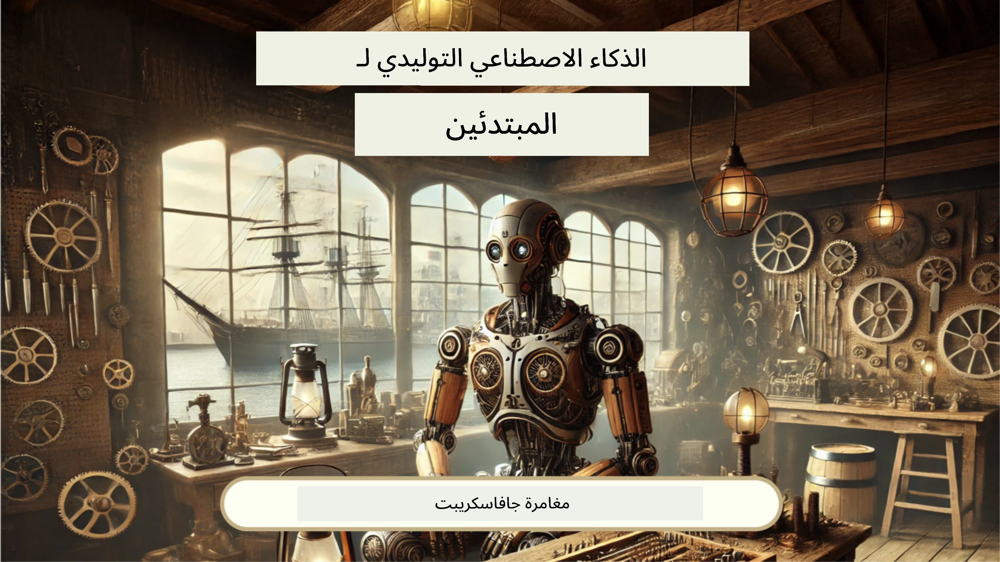
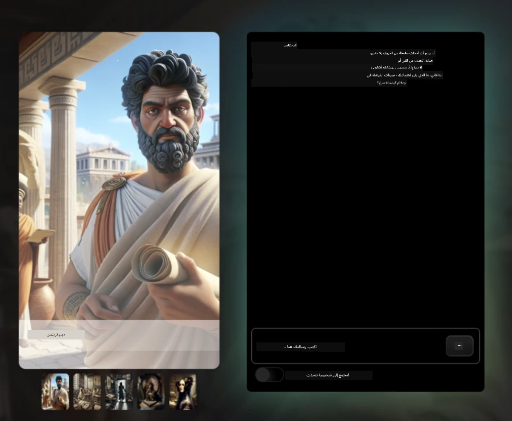
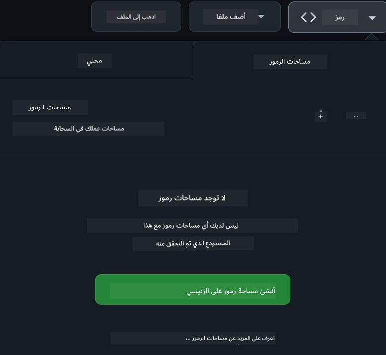

[](https://github.com/microsoft/Web-Dev-For-Beginners/blob/master/LICENSE)
[](https://GitHub.com/microsoft/Web-Dev-For-Beginners/graphs/contributors/)
[](https://GitHub.com/microsoft/Web-Dev-For-Beginners/issues/)
[](https://GitHub.com/microsoft/Web-Dev-For-Beginners/pulls/)
[](http://makeapullrequest.com) 

[](https://GitHub.com/microsoft/Web-Dev-For-Beginners/watchers/)
[](https://GitHub.com/microsoft/Web-Dev-For-Beginners/network/)
[](https://GitHub.com/microsoft/Web-Dev-For-Beginners/stargazers/)

[](https://discord.gg/nTYy5BXMWG)

# تطوير الويب للمبتدئين - منهج دراسي

تعلم أساسيات تطوير الويب مع دورتنا الشاملة التي تستمر 12 أسبوعًا من قِبل دعاة السحابة في مايكروسوفت. كل درس من الدروس الـ 24 يغوص في JavaScript و CSS و HTML من خلال مشاريع تطبيقية مثل التيراريومات، امتدادات المتصفح، وألعاب الفضاء. شارك في اختبارات، مناقشات، وواجبات عملية. حسن مهاراتك وعزز احتفاظك بالمعرفة من خلال منهجنا الفعال المبني على المشاريع. ابدأ رحلتك في الترميز اليوم!

انضم إلى مجتمع Azure AI Foundry على ديسكورد

[](https://discord.gg/nTYy5BXMWG)

اتبع هذه الخطوات للبدء باستخدام هذه الموارد:
1. **فرع المستودع**: انقر على [](https://GitHub.com/microsoft/Web-Dev-For-Beginners/fork)
2. **انسخ المستودع محليًا**:   `git clone https://github.com/microsoft/Web-Dev-For-Beginners.git`
3. [**انضم إلى Azure AI Foundry على ديسكورد والتقِ بالخبراء والمطورين الآخرين**](https://discord.com/invite/ByRwuEEgH4)

### 🌐 دعم متعدد اللغات

#### مدعوم عبر إجراء GitHub (آلي ومحدث دائمًا)

<!-- CO-OP TRANSLATOR LANGUAGES TABLE START -->
[العربية](./README.md) | [البنغالية](../bn/README.md) | [البلغارية](../bg/README.md) | [البورمية (ميانمار)](../my/README.md) | [الصينية (المبسطة)](../zh-CN/README.md) | [الصينية (التقليدية، هونغ كونغ)](../zh-HK/README.md) | [الصينية (التقليدية، ماكاو)](../zh-MO/README.md) | [الصينية (التقليدية، تايوان)](../zh-TW/README.md) | [الكرواتية](../hr/README.md) | [التشيكية](../cs/README.md) | [الدانماركية](../da/README.md) | [الهولندية](../nl/README.md) | [الإستونية](../et/README.md) | [الفنلندية](../fi/README.md) | [الفرنسية](../fr/README.md) | [الألمانية](../de/README.md) | [اليونانية](../el/README.md) | [العبرية](../he/README.md) | [الهندية](../hi/README.md) | [الهنغارية](../hu/README.md) | [الإندونيسية](../id/README.md) | [الإيطالية](../it/README.md) | [اليابانية](../ja/README.md) | [الكانتادية](../kn/README.md) | [الكورية](../ko/README.md) | [الليتوانية](../lt/README.md) | [الماليزية](../ms/README.md) | [المالايالامية](../ml/README.md) | [الماراثية](../mr/README.md) | [النيبالية](../ne/README.md) | [النيجيرية بيدجن](../pcm/README.md) | [النرويجية](../no/README.md) | [الفارسية (اللغة الفارسية)](../fa/README.md) | [البولندية](../pl/README.md) | [البرتغالية (البرازيل)](../pt-BR/README.md) | [البرتغالية (البرتغال)](../pt-PT/README.md) | [البنجابية (غورموخي)](../pa/README.md) | [الرومانية](../ro/README.md) | [الروسية](../ru/README.md) | [الصربية (السيريلية)](../sr/README.md) | [السلوفاكية](../sk/README.md) | [السلوفينية](../sl/README.md) | [الإسبانية](../es/README.md) | [السواحيلية](../sw/README.md) | [السويدية](../sv/README.md) | [التاغالوغ (الفلبينية)](../tl/README.md) | [التاميلية](../ta/README.md) | [التيلجو](../te/README.md) | [التايلاندية](../th/README.md) | [التركية](../tr/README.md) | [الأوكرانية](../uk/README.md) | [الأردية](../ur/README.md) | [الفيتنامية](../vi/README.md)

> **تفضل النسخ محليًا؟**
>
> يحتوي هذا المستودع على أكثر من 50 ترجمة للغات مما يزيادة حجم التنزيل بشكل كبير. للنسخ بدون الترجمات، استخدم السحب المتفرق:
>
> **Bash / macOS / Linux:**
> ```bash
> git clone --filter=blob:none --sparse https://github.com/microsoft/Web-Dev-For-Beginners.git
> cd Web-Dev-For-Beginners
> git sparse-checkout set --no-cone '/*' '!translations' '!translated_images'
> ```
>
> **CMD (Windows):**
> ```cmd
> git clone --filter=blob:none --sparse https://github.com/microsoft/Web-Dev-For-Beginners.git
> cd Web-Dev-For-Beginners
> git sparse-checkout set --no-cone "/*" "!translations" "!translated_images"
> ```
>
> هذا يمنحك كل ما تحتاجه لإتمام الدورة بسرعة تنزيل أعلى.
<!-- CO-OP TRANSLATOR LANGUAGES TABLE END -->

**إذا رغبت بدعم لغات ترجمة إضافية فهي مدرجة [هنا](https://github.com/Azure/co-op-translator/blob/main/getting_started/supported-languages.md)**

[](https://open.vscode.dev/microsoft/Web-Dev-For-Beginners)

#### 🧑‍🎓 _هل أنت طالب؟_

قم بزيارة [**صفحة مركز الطلاب**](https://docs.microsoft.com/learn/student-hub/?WT.mc_id=academic-77807-sagibbon) حيث ستجد موارد للمبتدئين، حقائب طلابية وحتى طرق الحصول على قسيمة شهادة مجانية. هذه الصفحة هي التي ترغب في إضافتها للمفضلة والتحقق منها بين الحين والآخر مع تحديث المحتوى شهريًا.

### 📣 إعلان - تحديات وضع GitHub Copilot Agent جديدة لإكمالها!

تمت إضافة تحدي جديد، ابحث عن "تحدي GitHub Copilot Agent 🚀" في معظم الفصول. إنه تحدٍ جديد لك لتنجزه باستخدام GitHub Copilot ووضع Agent. إذا لم تستخدم وضع Agent من قبل، هو قادر ليس فقط على إنشاء النصوص بل يمكنه أيضًا إنشاء وتحرير الملفات، تشغيل الأوامر والمزيد.

### 📣 إعلان - _مشروع جديد للبناء باستخدام الذكاء الاصطناعي التوليدي_ 

تمت إضافة مشروع مساعد الذكاء الاصطناعي الجديد، تحقق منه [المشروع](./9-chat-project/README.md)

### 📣 إعلان - _منهج جديد_ عن الذكاء الاصطناعي التوليدي لجافا سكريبت تم إصداره للتو

لا تفوت منهجنا الجديد عن الذكاء الاصطناعي التوليدي!

زر [https://aka.ms/genai-js-course](https://aka.ms/genai-js-course) للبدء!



- دروس تغطي كل شيء من الأساسيات إلى RAG.
- تفاعل مع شخصيات تاريخية باستخدام GenAI وتطبيقنا المرافق.
- سرد ممتع وجذاب، ستسافر عبر الزمن!




كل درس يتضمن واجبًا لإكماله، اختبار معرفة وتحديًا لترشدك على تعلم مواضيع مثل:
- الإرشاد والهندسة الموجهة للنصوص
- إنشاء تطبيقات نصية وصورية
- تطبيقات البحث

زر [https://aka.ms/genai-js-course](https://aka.ms/genai-js-course) للبدء!


## 🌱 بداية العمل

> **أيها المعلمون**، لقد قمنا [بإدراج بعض الاقتراحات](for-teachers.md) حول كيفية استخدام هذا المنهج. نحب سماع ملاحظاتكم [في منتدى النقاش الخاص بنا](https://github.com/microsoft/Web-Dev-For-Beginners/discussions/categories/teacher-corner)!

**[المتعلمون](https://aka.ms/student-page/?WT.mc_id=academic-77807-sagibbon)**، لكل درس، ابدأ باختبار قبلي ثم تابع بقراءة مادة المحاضرة، إكمال الأنشطة المختلفة، وفحص فهمك باختبار بعد المحاضرة.

لتعزيز تجربتك التعليمية، تواصل مع زملائك للعمل معًا على المشاريع! ينصح بالمناقشات في [منتدى النقاش](https://github.com/microsoft/Web-Dev-For-Beginners/discussions) حيث سيكون فريق المشرفين لدينا متاحًا للرد على أسئلتك.

لتطوير تعليمك أكثر، نوصي بشدة باستكشاف [مايكروسوفت ليرن](https://learn.microsoft.com/users/wirelesslife/collections/p1ddcy5jwy0jkm?WT.mc_id=academic-77807-sagibbon) للمزيد من مواد الدراسة.

### 📋 إعداد بيئتك

هذا المنهج يحتوي على بيئة تطوير جاهزة للعمل! أثناء البدء يمكنك اختيار تشغيل المنهج في [Codespace](https://github.com/features/codespaces/) (_بيئة متصفح لا تحتاج تثبيتات_)، أو محليًا على جهاز الكمبيوتر الخاص بك باستخدام محرر نصوص مثل [Visual Studio Code](https://code.visualstudio.com/?WT.mc_id=academic-77807-sagibbon).

#### أنشئ مستودعك الخاص
لتمكينك من حفظ عملك بسهولة، يُنصح بأن تنشئ نسختك الخاصة من هذا المستودع. يمكنك فعل ذلك بالنقر على زر **Use this template** في أعلى الصفحة. هذا سينشئ مستودعًا جديدًا في حساب GitHub الخاص بك مع نسخة من المنهج.

اتبع هذه الخطوات:
1. **فرع المستودع**: انقر على زر "Fork" في أعلى يمين هذه الصفحة.
2. **انسخ المستودع محليًا**:   `git clone https://github.com/microsoft/Web-Dev-For-Beginners.git`

#### تشغيل المنهج في Codespace

في نسختك من هذا المستودع التي أنشأتها، انقر زر **Code** واختر **Open with Codespaces**. سيُنشئ هذا مساحة عمل جديدة للعمل فيها.



#### تشغيل المنهج محليًا على جهاز الكمبيوتر الخاص بك

لتشغيل هذا المنهج محليًا على جهاز الكمبيوتر الخاص بك ستحتاج إلى محرر نصوص، متصفح أويب وأداة سطر الأوامر. درسنا الأول، [مقدمة إلى لغات البرمجة وأدوات التجارة](../../1-getting-started-lessons/1-intro-to-programming-languages)، سيرشدك عبر خيارات مختلفة لكل من هذه الأدوات لتختار الأنسب لك.

توصيتنا هي استخدام [Visual Studio Code](https://code.visualstudio.com/?WT.mc_id=academic-77807-sagibbon) كمحرر، والذي يحتوي أيضًا على [طرفية مدمجة](https://code.visualstudio.com/docs/terminal/basics/?WT.mc_id=academic-77807-sagibbon). يمكنك تنزيل Visual Studio Code من [هنا](https://code.visualstudio.com/?WT.mc_id=academic-77807-sagibbon).
1. قم باستنساخ مستودعك على جهاز الكمبيوتر الخاص بك. يمكنك القيام بذلك بالنقر على زر **Code** ونسخ عنوان URL:

    [CodeSpace](./images/createcodespace.png)

    ثم، افتح [Terminal](https://code.visualstudio.com/docs/terminal/basics/?WT.mc_id=academic-77807-sagibbon) داخل [Visual Studio Code](https://code.visualstudio.com/?WT.mc_id=academic-77807-sagibbon) وشغّل الأمر التالي، مستبدلاً `<your-repository-url>` بعنوان URL الذي قمت بنسخه للتو:

    ```bash 
    git clone <your-repository-url>
    ```

2. افتح المجلد في Visual Studio Code. يمكنك القيام بذلك بالنقر على **File** > **Open Folder** واختيار المجلد الذي قمت باستنساخه للتو.


>  التوصيات الخاصة بالامتدادات في Visual Studio Code:
>
> * [Live Server](https://marketplace.visualstudio.com/items?itemName=ritwickdey.LiveServer&WT.mc_id=academic-77807-sagibbon) - لمعاينة صفحات HTML داخل Visual Studio Code
> * [Copilot](https://marketplace.visualstudio.com/items?itemName=GitHub.copilot&WT.mc_id=academic-77807-sagibbon) - لمساعدتك في كتابة الشيفرة بسرعة أكبر

## 📂 كل درس يشمل:

- ملاحظات تخطيطية اختيارية
- فيديو تكميلي اختياري
- اختبار تمهيدي قبل الدرس
- درس مكتوب
- للدروس المبنية على المشاريع، إرشادات خطوة بخطوة لبناء المشروع
- اختبار معرفة
- تحدي
- قراءة تكملية
- واجب
- [اختبار بعد الدرس](https://ff-quizzes.netlify.app/web/)

> **ملاحظة حول الاختبارات**: جميع الاختبارات موجودة في مجلد Quiz-app، هناك 48 اختبارًا بإجمالي ثلاث أسئلة لكل اختبار. متاحة [هنا](https://ff-quizzes.netlify.app/web/) كما يمكن تشغيل تطبيق الاختبار محلياً أو نشره على Azure؛ اتبع التعليمات في مجلد `quiz-app`.

## 🗃️ الدروس

|     |                       اسم المشروع                        |                            المفاهيم التي يتم تدريسها                             | الأهداف التعليمية                                                                                                                 |                                                         الدرس المرتبط                                                          |         المؤلف          |
| :-: | :------------------------------------------------------: | :--------------------------------------------------------------------: | ----------------------------------------------------------------------------------------------------------------------------------- | :----------------------------------------------------------------------------------------------------------------------------: | :---------------------: |
| 01  |                     البداية                              |           مقدمة في البرمجة وأدوات المهنة           | تعلم الأساسيات التي تقوم عليها معظم لغات البرمجة وبرامج تساعد المطورين المحترفين في عملهم                                         | [مقدمة إلى لغات البرمجة وأدوات المهنة](./1-getting-started-lessons/1-intro-to-programming-languages/README.md) |         Jasmine         |
| 02  |                     البداية                              |             أساسيات GitHub، تتضمن العمل مع فريق             | كيفية استخدام GitHub في مشروعك وكيفية التعاون مع الآخرين في قاعدة الشيفرة                                                           |                            [مقدمة إلى GitHub](./1-getting-started-lessons/2-github-basics/README.md)                             |          Floor          |
| 03  |                     البداية                              |                             إمكانية الوصول                              | تعلم أساسيات إمكانية الوصول على الويب                                                                                               |                       [أساسيات إمكانية الوصول](./1-getting-started-lessons/3-accessibility/README.md)                       |       Christopher       |
| 04  |                        أساسيات JS                        |                         أنواع بيانات JavaScript                          | أساسيات أنواع بيانات JavaScript                                                                                                 |                                       [أنواع البيانات](./2-js-basics/1-data-types/README.md)                                        |         Jasmine         |
| 05  |                        أساسيات JS                        |                         الدوال والأساليب                          | تعلم عن الدوال والأساليب لإدارة تدفق منطق التطبيق                                                                                                                             |                              [الدوال والأساليب](./2-js-basics/2-functions-methods/README.md)                               | Jasmine and Christopher |
| 06  |                        أساسيات JS                        |                        اتخاذ القرارات بـ JS                        | تعلم كيفية إنشاء الشروط في الشيفرة باستخدام أساليب اتخاذ القرار                                                           |                                 [اتخاذ القرارات](./2-js-basics/3-making-decisions/README.md)                                  |         Jasmine         |
| 07  |                        أساسيات JS                        |                            المصفوفات والحلقات                            | العمل مع البيانات باستخدام المصفوفات والحلقات في JavaScript                                                                                 |                                   [المصفوفات والحلقات](./2-js-basics/4-arrays-loops/README.md)                                    |         Jasmine         |
| 08  |       [التيراريوم](./3-terrarium/solution/README.md)       |                            HTML في التطبيق                            | بناء HTML لإنشاء تيراريوم إلكتروني، مع التركيز على بناء التخطيط                                                         |                                 [مقدمة إلى HTML](./3-terrarium/1-intro-to-html/README.md)                                 |           Jen           |
| 09  |       [التيراريوم](./3-terrarium/solution/README.md)       |                            CSS في التطبيق                             | بناء CSS لتنسيق التيراريوم الإلكتروني، مع التركيز على أساسيات CSS بما في ذلك جعل الصفحة متجاوبة                     |                                  [مقدمة إلى CSS](./3-terrarium/2-intro-to-css/README.md)                                  |           Jen           |
| 10  |            [التيراريوم](./3-terrarium/solution/README.md)            |                 إغلاق جافا سكريبت، التلاعب بـ DOM                  | بناء شيفرة JavaScript لجعل التيراريوم يعمل كواجهة سحب وإفلات، مع التركيز على الإغلاق والتلاعب بـ DOM             |                  [إغلاق JavaScript، التلاعب بـ DOM](./3-terrarium/3-intro-to-DOM-and-closures/README.md)                   |           Jen           |
| 11  |          [لعبة الطباعة](./4-typing-game/solution/README.md)          |                          بناء لعبة الطباعة                           | تعلم كيفية استخدام أحداث لوحة المفاتيح لتحريك منطق تطبيق JavaScript                                                          |                                [البرمجة المعتمدة على الأحداث](./4-typing-game/typing-game/README.md)                                |       Christopher       |
| 12  | [امتداد المتصفح الأخضر](./5-browser-extension/solution/README.md) |                         العمل مع المتصفحات                          | تعلم كيف تعمل المتصفحات، تاريخها، وكيفية إنشاء العناصر الأولى لامتداد متصفح                               |                               [حول المتصفحات](./5-browser-extension/1-about-browsers/README.md)                                |           Jen           |
| 13  | [امتداد المتصفح الأخضر](./5-browser-extension/solution/README.md) | بناء نموذج، استدعاء API وتخزين المتغيرات في التخزين المحلي | بناء عناصر JavaScript لامتداد المتصفح لاستدعاء API باستخدام المتغيرات المخزنة في التخزين المحلي                      |                [APIs، النماذج، والتخزين المحلي](./5-browser-extension/2-forms-browsers-local-storage/README.md)                 |           Jen           |
| 14  | [امتداد المتصفح الأخضر](./5-browser-extension/solution/README.md) |          العمليات الخلفية في المتصفح، أداء الويب          | استخدام عمليات المتصفح الخلفية لإدارة أيقونة الامتداد؛ تعلّم عن أداء الويب وبعض التحسينات لتحقيق أداء أفضل   |             [المهام الخلفية والأداء](./5-browser-extension/3-background-tasks-and-performance/README.md)              |           Jen           |
| 15  |           [لعبة الفضاء](./6-space-game/solution/README.md)           |             تطوير ألعاب متقدم أكثر باستخدام JavaScript             | تعلّم عن الوراثة باستخدام الفئات والتكوين ونمط النشر/الاشتراك، استعدادًا لبناء لعبة              |                      [مقدمة لتطوير الألعاب المتقدم](./6-space-game/1-introduction/README.md)                       |          Chris          |
| 16  |           [لعبة الفضاء](./6-space-game/solution/README.md)           |                           الرسم على اللوحة                            | تعلّم عن واجهة برمجة تطبيق Canvas، المستخدمة للرسم على الشاشة                                                                       |                                [الرسم على اللوحة](./6-space-game/2-drawing-to-canvas/README.md)                                |          Chris          |
| 17  |           [لعبة الفضاء](./6-space-game/solution/README.md)           |                   تحريك العناصر حول الشاشة                    | اكتشف كيف يمكن للعناصر أن تكتسب الحركة باستخدام الإحداثيات الديكارتية وواجهة برمجة Canvas                                            |                           [تحريك العناصر](./6-space-game/3-moving-elements-around/README.md)                           |          Chris          |
| 18  |           [لعبة الفضاء](./6-space-game/solution/README.md)           |                          كشف التصادم                           | جعل العناصر تتصادم وتتفاعل مع بعضها باستخدام ضغطات المفاتيح وتوفير وظيفة تبريد لضمان أداء اللعبة    |                              [كشف التصادم](./6-space-game/4-collision-detection/README.md)                              |          Chris          |
| 19  |           [لعبة الفضاء](./6-space-game/solution/README.md)           |                             حساب النقاط                              | إجراء حسابات رياضية بناءً على حالة اللعبة وأدائها                                                                |                                    [حساب النقاط](./6-space-game/5-keeping-score/README.md)                                    |          Chris          |
| 20  |           [لعبة الفضاء](./6-space-game/solution/README.md)           |                     إنهاء وإعادة تشغيل اللعبة                     | تعلم عن إنهاء اللعبة وإعادة تشغيلها، بما في ذلك تنظيف الموارد وإعادة تعيين قيم المتغيرات                              |                                [شرط النهاية](./6-space-game/6-end-condition/README.md)                                 |          Chris          |
| 21  |         [تطبيق البنك](./7-bank-project/solution/README.md)          |                 قوالب HTML والمسارات في تطبيق ويب                 | تعلم كيفية إنشاء هيكل موقع متعدد الصفحات باستخدام التوجيه وقوالب HTML                             |                            [قوالب HTML والمسارات](./7-bank-project/1-template-route/README.md)                             |          Yohan          |
| 22  |         [تطبيق البنك](./7-bank-project/solution/README.md)          |                  بناء نموذج تسجيل دخول وتسجيل مستخدم                   | تعلم بناء النماذج وتعامل مع عمليات التحقق من الصحة                                                                          |                                           [النماذج](./7-bank-project/2-forms/README.md)                                           |          Yohan          |
| 23  |         [تطبيق البنك](./7-bank-project/solution/README.md)          |                   طرق جلب واستخدام البيانات                   | كيف تتدفق البيانات داخل وخارج تطبيقك، وكيفية جلبها وتخزينها والتخلص منها                                                 |                                            [البيانات](./7-bank-project/3-data/README.md)                                            |          Yohan          |
| 24  |         [تطبيق البنك](./7-bank-project/solution/README.md)          |                      مفاهيم إدارة الحالة                      | تعلم كيف يحتفظ تطبيقك بالحالة وكيفية إدارتها برمجياً                                                              |                                [إدارة الحالة](./7-bank-project/4-state-management/README.md)                                |          Yohan          |
| 25 | [متصفح/محرر VScode](../../8-code-editor) | العمل مع VScode | تعلم كيفية استخدام محرر الشيفرة| [استخدام محرر VScode](./8-code-editor/1-using-a-code-editor/README.md) | Chris |
| 26 | [مساعدي الذكاء الاصطناعي](./9-chat-project/README.md) | العمل مع الذكاء الاصطناعي | تعلم كيفية بناء مساعد الذكاء الاصطناعي الخاص بك | [مشروع مساعد الذكاء الاصطناعي](./9-chat-project/README.md) | Chris |

## 🏫 المنهجية التربوية

تم تصميم منهجنا الدراسي باستخدام مبدأين تربويين رئيسيين في الاعتبار:
* التعلم المبني على المشاريع
* الاختبارات المتكررة

يقوم البرنامج بتدريس أساسيات JavaScript و HTML و CSS، بالإضافة إلى أحدث الأدوات والتقنيات التي يستخدمها مطورو الويب اليوم. سوف تتاح للطلاب الفرصة لاكتساب خبرة عملية من خلال بناء لعبة طباعة، تيراريوم افتراضي، امتداد متصفح صديق للبيئة، لعبة بأسلوب غزاة الفضاء، وتطبيق بنكي للأعمال. مع نهاية السلسلة، سيكون لدى الطلاب فهم قوي لتطوير الويب.

> 🎓 يمكنك أخذ الدروس القليلة الأولى في هذا المنهج كـ [مسار تعلّم](https://docs.microsoft.com/learn/paths/web-development-101/?WT.mc_id=academic-77807-sagibbon) على منصة Microsoft Learn!

من خلال ضمان أن المحتوى يتماشى مع المشاريع، يصبح التعلم أكثر جاذبية للطلاب ويزيد من ترسيخ المفاهيم. لقد كتبنا أيضًا عدة دروس تمهيدية في أساسيات JavaScript لتقديم المفاهيم، مرفقة بفيديو من سلسلة "[سلسلة للمبتدئين إلى: JavaScript](https://channel9.msdn.com/Series/Beginners-Series-to-JavaScript/?WT.mc_id=academic-77807-sagibbon)" لتعليم الفيديو، ساهم بعض مؤلفيها في هذا المنهج.

بالإضافة إلى ذلك، يحدد اختبار منخفض المخاطر قبل الدرس نية الطالب نحو تعلم موضوع ما، بينما يضمن اختبار ثاني بعد الدرس المزيد من الاحتفاظ بالمعلومات. تم تصميم هذا المنهج ليكون مرنًا وممتعًا ويمكن أخذه بالكامل أو جزئيًا. تبدأ المشاريع صغيرة وتزداد تعقيدًا تدريجياً بنهاية دورة الـ 12 أسبوعًا.

بينما تجنبنا عمدًا إدخال أُطُر JavaScript للتركيز على المهارات الأساسية المطلوبة كمطور ويب قبل اعتماد إطار عمل، فإن الخطوة التالية الجيدة لإكمال هذا المنهج هي تعلم عن Node.js عبر مجموعة أخرى من مقاطع الفيديو: "[سلسلة للمبتدئين إلى: Node.js](https://channel9.msdn.com/Series/Beginners-Series-to-Nodejs/?WT.mc_id=academic-77807-sagibbon)".

> قم بزيارة [مدونة السلوك](CODE_OF_CONDUCT.md) وإرشادات [المساهمة](CONTRIBUTING.md) الخاصة بنا. نحن نرحب بتعليقاتك البناءة!


## 🧭 الوصول دون اتصال

يمكنك تشغيل هذه الوثائق دون اتصال بالإنترنت باستخدام [Docsify](https://docsify.js.org/#/). قم بتفريع هذا المستودع، [تثبيت Docsify](https://docsify.js.org/#/quickstart) على جهازك المحلي، ثم في المجلد الجذري لهذا المستودع، اكتب `docsify serve`. سيتم تقديم الموقع على المنفذ 3000 على جهازك المحلي: `localhost:3000`.

## 📘 PDF
يمكن العثور على ملف PDF لجميع الدروس [هنا](https://microsoft.github.io/Web-Dev-For-Beginners/pdf/readme.pdf).

## 🎒 دورات أخرى

يقوم فريقنا بإنتاج دورات أخرى! تحقق من:

<!-- CO-OP TRANSLATOR OTHER COURSES START -->
### LangChain
[](https://aka.ms/langchain4j-for-beginners)
[](https://aka.ms/langchainjs-for-beginners?WT.mc_id=m365-94501-dwahlin)
[](https://github.com/microsoft/langchain-for-beginners?WT.mc_id=m365-94501-dwahlin)
---

### Azure / Edge / MCP / Agents
[](https://github.com/microsoft/AZD-for-beginners?WT.mc_id=academic-105485-koreyst)
[](https://github.com/microsoft/edgeai-for-beginners?WT.mc_id=academic-105485-koreyst)
[](https://github.com/microsoft/mcp-for-beginners?WT.mc_id=academic-105485-koreyst)
[](https://github.com/microsoft/ai-agents-for-beginners?WT.mc_id=academic-105485-koreyst)

---
 
### سلسلة الذكاء الاصطناعي التوليدي
[](https://github.com/microsoft/generative-ai-for-beginners?WT.mc_id=academic-105485-koreyst)
[-9333EA?style=for-the-badge&labelColor=E5E7EB&color=9333EA)](https://github.com/microsoft/Generative-AI-for-beginners-dotnet?WT.mc_id=academic-105485-koreyst)
[-C084FC?style=for-the-badge&labelColor=E5E7EB&color=C084FC)](https://github.com/microsoft/generative-ai-for-beginners-java?WT.mc_id=academic-105485-koreyst)
[-E879F9?style=for-the-badge&labelColor=E5E7EB&color=E879F9)](https://github.com/microsoft/generative-ai-with-javascript?WT.mc_id=academic-105485-koreyst)

---
 
### التعليم الأساسي
[](https://aka.ms/ml-beginners?WT.mc_id=academic-105485-koreyst)
[](https://aka.ms/datascience-beginners?WT.mc_id=academic-105485-koreyst)
[](https://aka.ms/ai-beginners?WT.mc_id=academic-105485-koreyst)
[](https://github.com/microsoft/Security-101?WT.mc_id=academic-96948-sayoung)
[](https://aka.ms/webdev-beginners?WT.mc_id=academic-105485-koreyst)
[](https://aka.ms/iot-beginners?WT.mc_id=academic-105485-koreyst)
[](https://github.com/microsoft/xr-development-for-beginners?WT.mc_id=academic-105485-koreyst)

---
 
### سلسلة الكوبيلوت
[](https://aka.ms/GitHubCopilotAI?WT.mc_id=academic-105485-koreyst)
[](https://github.com/microsoft/mastering-github-copilot-for-dotnet-csharp-developers?WT.mc_id=academic-105485-koreyst)
[](https://github.com/microsoft/CopilotAdventures?WT.mc_id=academic-105485-koreyst)
<!-- CO-OP TRANSLATOR OTHER COURSES END -->

## الحصول على المساعدة

إذا واجهت صعوبة أو كان لديك أي أسئلة حول بناء تطبيقات الذكاء الاصطناعي. انضم إلى المتعلمين والمطورين ذوي الخبرة في مناقشات حول MCP. إنها مجتمع داعم حيث الأسئلة مرحب بها والمعرفة تُشارك بحرية.

[](https://discord.gg/nTYy5BXMWG)

إذا كان لديك ملاحظات على المنتج أو أخطاء أثناء البناء، قم بزيارة:

[](https://aka.ms/foundry/forum)

## الترخيص

يتم ترخيص هذا المستودع بموجب ترخيص MIT. راجع ملف [LICENSE](../../LICENSE) لمزيد من المعلومات.

---

<!-- CO-OP TRANSLATOR DISCLAIMER START -->
**إخلاء المسؤولية**:  
تمت ترجمة هذا المستند باستخدام خدمة الترجمة الآلية [Co-op Translator](https://github.com/Azure/co-op-translator). بينما نسعى لتحقيق الدقة، يرجى العلم أن الترجمات الآلية قد تحتوي على أخطاء أو عدم دقة. يجب اعتبار المستند الأصلي بلغته الأصلية المصدر الرسمي والمعتمد. للمعلومات الحرجة، يُنصح بالترجمة المهنية البشرية. نحن غير مسؤولين عن أي سوء فهم أو تفسير ناتج عن استخدام هذه الترجمة.
<!-- CO-OP TRANSLATOR DISCLAIMER END -->