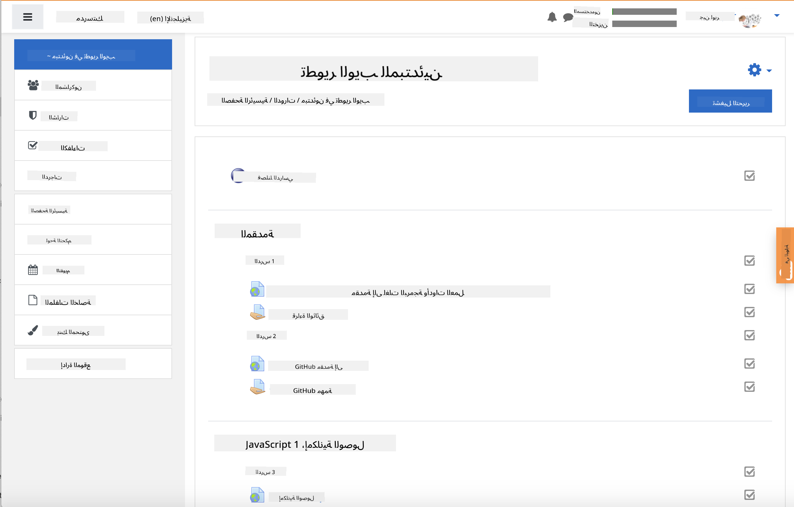

<!--
CO_OP_TRANSLATOR_METADATA:
{
  "original_hash": "75cb51f7ca9ea0b097ef4a1287e9290c",
  "translation_date": "2025-08-25T20:55:29+00:00",
  "source_file": "for-teachers.md",
  "language_code": "ar"
}
-->
## للمعلمين

هل ترغب في استخدام هذا المنهج في صفك الدراسي؟ لا تتردد في ذلك!

في الواقع، يمكنك استخدامه مباشرةً على GitHub من خلال GitHub Classroom.

للقيام بذلك، قم بعمل fork لهذا المستودع. ستحتاج إلى إنشاء مستودع لكل درس، لذا ستحتاج إلى استخراج كل مجلد إلى مستودع منفصل. بهذه الطريقة، يمكن لـ [GitHub Classroom](https://classroom.github.com/classrooms) التعامل مع كل درس بشكل منفصل.

هذه [التعليمات الكاملة](https://github.blog/2020-03-18-set-up-your-digital-classroom-with-github-classroom/) ستعطيك فكرة عن كيفية إعداد صفك الدراسي.

## استخدامه في Moodle أو Canvas أو Blackboard

هذا المنهج يعمل بشكل جيد مع أنظمة إدارة التعلم! استخدم [ملف التحميل الخاص بـ Moodle](../../../../../../../teaching-files/webdev-moodle.mbz) للحصول على المحتوى الكامل، أو جرّب [ملف Common Cartridge](../../../../../../../teaching-files/webdev-common-cartridge.imscc) الذي يحتوي على جزء من المحتوى. لا يدعم Moodle Cloud تصدير Common Cartridge بالكامل، لذا يُفضل استخدام ملف التحميل الخاص بـ Moodle الذي يمكن رفعه إلى Canvas. يرجى إبلاغنا بكيفية تحسين هذه التجربة.

  
> المنهج في صف Moodle

  
> المنهج في Canvas

## استخدام المستودع كما هو

إذا كنت ترغب في استخدام هذا المستودع كما هو حاليًا، دون استخدام GitHub Classroom، فهذا ممكن أيضًا. ستحتاج إلى التواصل مع طلابك لتحديد الدرس الذي ستعملون عليه معًا.

في صيغة التعليم عبر الإنترنت (Zoom، Teams، أو غيرها)، يمكنك إنشاء غرف نقاش فرعية للاختبارات، وتوجيه الطلاب لمساعدتهم على الاستعداد للتعلم. ثم قم بدعوة الطلاب للاختبارات واطلب منهم إرسال إجاباتهم كـ "issues" في وقت محدد. يمكنك القيام بنفس الشيء مع الواجبات إذا كنت تريد من الطلاب العمل بشكل تعاوني في العلن.

إذا كنت تفضل صيغة أكثر خصوصية، اطلب من طلابك عمل fork للمنهج، درسًا بدرس، إلى مستودعاتهم الخاصة على GitHub كمستودعات خاصة، ومنحك حق الوصول. بعد ذلك، يمكنهم إكمال الاختبارات والواجبات بشكل خاص وإرسالها إليك عبر "issues" في مستودع صفك الدراسي.

هناك العديد من الطرق لجعل هذا يعمل في صيغة التعليم عبر الإنترنت. يرجى إبلاغنا بما يناسبك أكثر!

## نرجو أن تشاركنا أفكارك!

نرغب في جعل هذا المنهج مناسبًا لك ولطلابك. تواصل معنا في [ركن المعلمين](https://github.com/microsoft/Web-Dev-For-Beginners/discussions/categories/teacher-corner) وافتح [**issue جديد**](https://github.com/microsoft/Web-Dev-For-Beginners/issues/new/choose) لأي طلبات أو أخطاء أو ملاحظات.

**إخلاء المسؤولية**:  
تم ترجمة هذا المستند باستخدام خدمة الترجمة بالذكاء الاصطناعي [Co-op Translator](https://github.com/Azure/co-op-translator). بينما نسعى لتحقيق الدقة، يرجى العلم أن الترجمات الآلية قد تحتوي على أخطاء أو معلومات غير دقيقة. يجب اعتبار المستند الأصلي بلغته الأصلية المصدر الرسمي. للحصول على معلومات حاسمة، يُوصى بالاستعانة بترجمة بشرية احترافية. نحن غير مسؤولين عن أي سوء فهم أو تفسيرات خاطئة تنشأ عن استخدام هذه الترجمة.