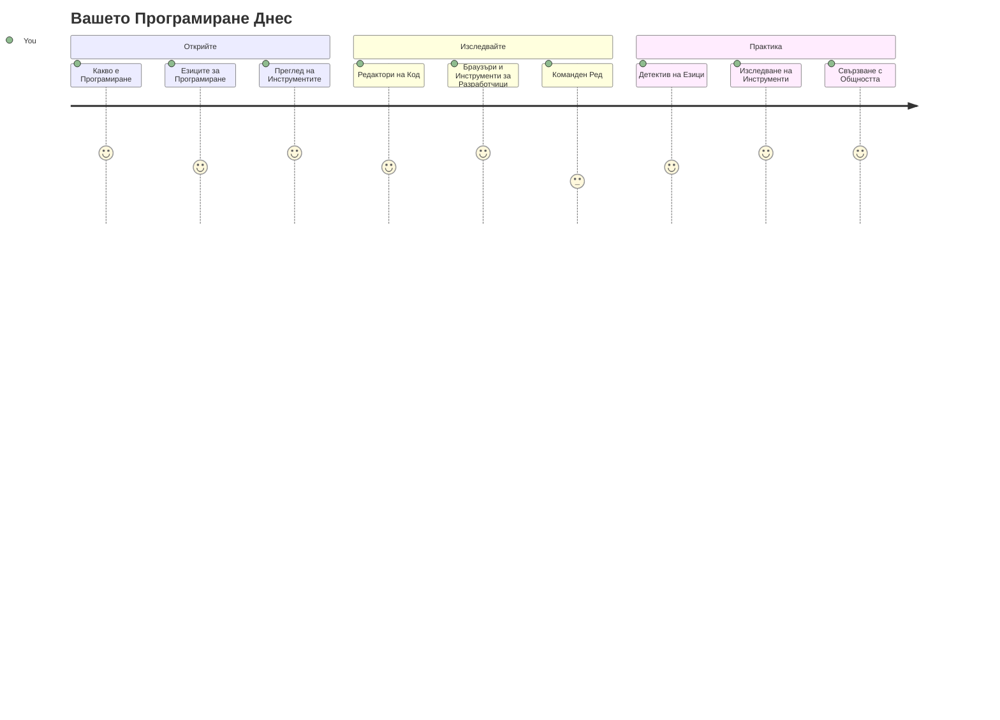
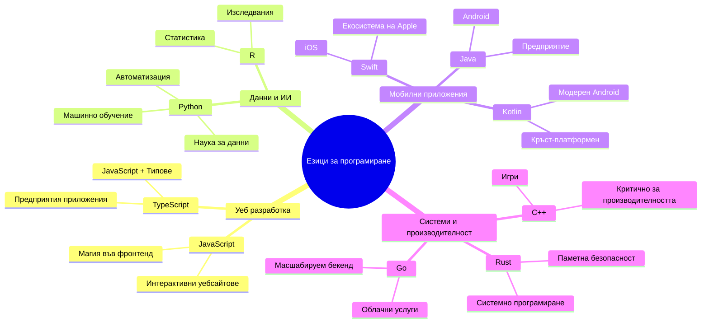
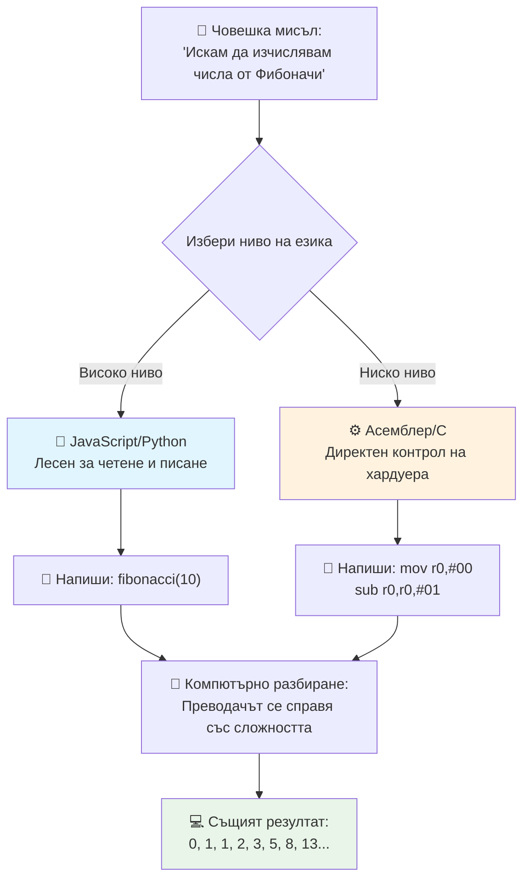
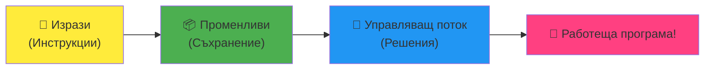
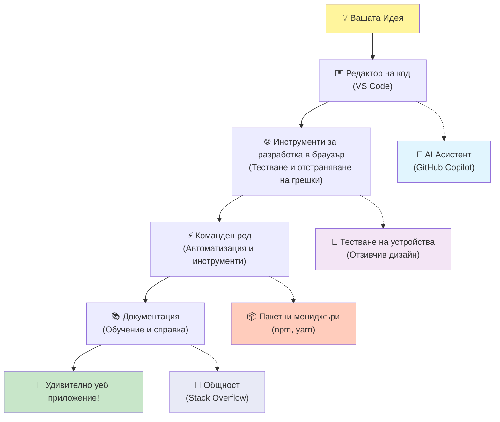
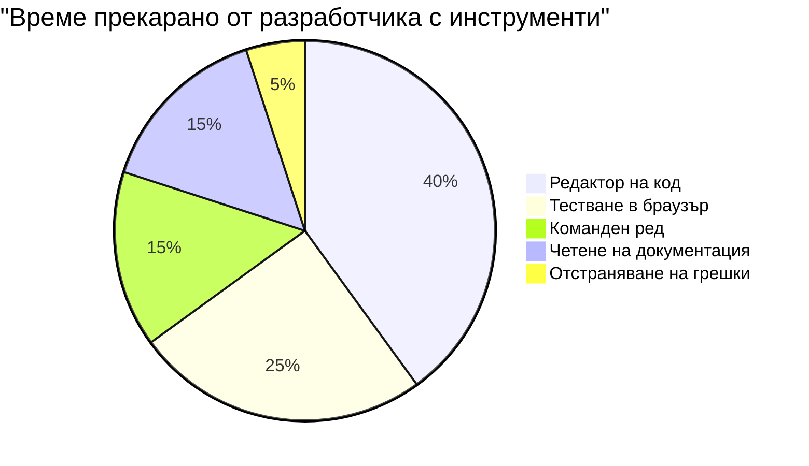
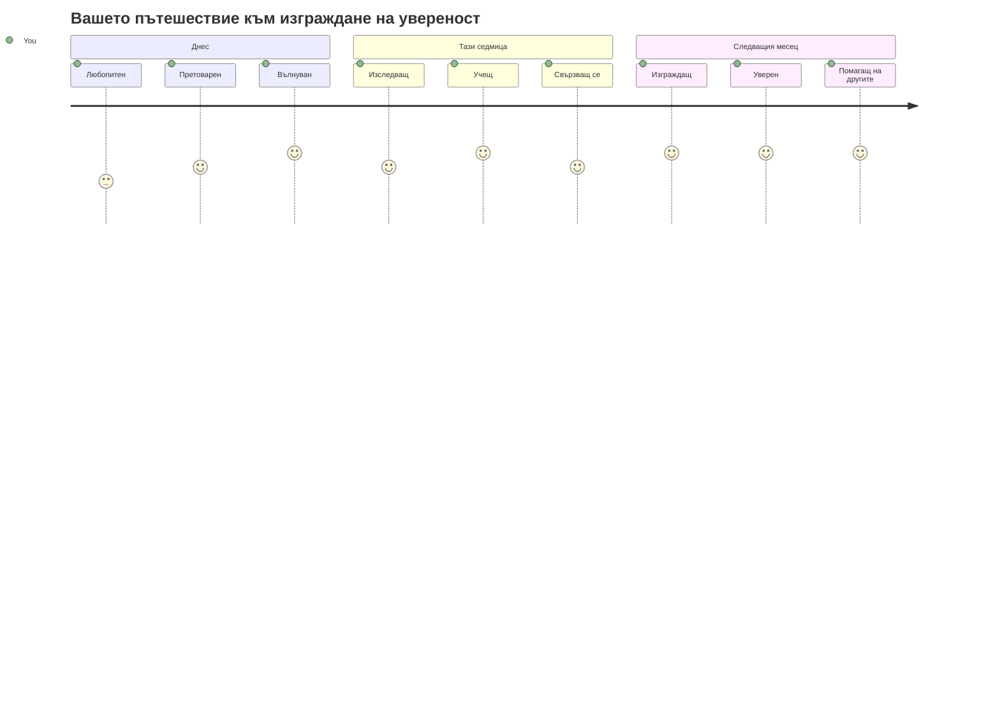

<!--
CO_OP_TRANSLATOR_METADATA:
{
  "original_hash": "d45ddcc54eb9232a76d08328b09d792e",
  "translation_date": "2026-01-07T07:25:11+00:00",
  "source_file": "1-getting-started-lessons/1-intro-to-programming-languages/README.md",
  "language_code": "bg"
}
-->
# Въведение в програмен език и съвременни инструменти за разработчици

Здрасти, бъдещ разработчик! 👋 Мога ли да ти разкажа нещо, което всеки ден ми надава тръпки? Ти си на прага да откриеш, че програмирането не е просто за компютри – то е за това да имаш истински суперсили, с които да оживяваш най-дивите си идеи!

Знаеш ли онзи момент, когато използваш любимото си приложение и всичко просто пасва перфектно? Когато натиснеш бутон и се случва нещо абсолютно магическо, което те кара да се чудиш: "Уау, как ТЕ го направиха?" Е, някой точно като теб – вероятно седнал в любимото си кафе в 2 през нощта с третото си еспресо – е написал кода, който създаде тази магия. И ето какво ще те изуми: в края на този урок не само ще разбереш как са го направили, но и ще гориш от желание да пробваш сам!

Виж, разбирам напълно, ако програмирането ти изглежда страшно сега. Когато започвах, честно казано си мислех, че трябва да си някакъв математически гений или да си кодил от петгодишен. Но ето какво напълно промени гледната ми точка: програмирането е точно като да се научиш да водиш разговор на нов език. Започваш с "здравей" и "благодаря", после стигаш до поръчване на кафе, а преди да се усетиш вече водиш дълбоки философски дискусии! Освен че в този случай разговаряш с компютри, и честно? Те са най-търпеливите събеседници, които някога ще срещнеш – никога не съдят грешките ти и винаги с ентусиазъм приемат да опитат отново!

Днес ще разгледаме невероятните инструменти, които правят съвременното уеб разработване не само възможно, но и наистина пристрастяващо. Говоря за същите редактори, браузъри и работни процеси, които разработчиците в Netflix, Spotify и любимото ти инди студио използват всеки ден. И ето и частта, която ще те накара да се зарадваш: повечето от тези професионални, индустриални инструменти са напълно безплатни!


> Скетчноут от [Tomomi Imura](https://twitter.com/girlie_mac)


## Да видим какво вече знаеш!

Преди да се хвърлим в забавните неща, любопитно ми е – какво вече знаеш за този програмен свят? И слушай, ако гледаш тези въпроси и мислиш "Аз нямам абсолютно никаква представа за нищо от това," това не е просто окей, а направо перфектно! Значи си на правилното място. Помисли за този тест като за разтягане преди тренировка – едва загряваме мозъчните мускули!

[Вземи теста преди урока](https://forms.office.com/r/dru4TE0U9n?origin=lprLink)

## Приключението, на което ще тръгнем заедно

Окей, сериозно съм супер развълнуван от това, което ще изследваме днес! Наистина, искам да видя лицето ти, когато някои от тези концепции изведнъж "кликнат". Ето какво невероятно пътешествие ни очаква заедно:

- **Какво всъщност е програмирането (и защо е най-готиното нещо някога!)** – Ще разберем как кодът буквално е невидимата магия, която движи всичко около теб – от алармата, която някак разбира, че е понеделник сутрин, до алгоритъма, който перфектно селектира препоръките ти в Netflix
- **Програмен език и техните удивителни личности** – Представи си, че влизаш на парти, където всеки човек има съвсем различни суперсили и начини да решава проблеми. Това е светът на програмните езици, и ти ще обикнеш да ги срещаш!
- **Основните градивни блокчета, които правят дигиталната магия възможна** – Мисли ги като най-ултимативния креативен комплект LEGO. След като разбереш как се съчетават тези части, осъзнаваш, че можеш буквално да построиш всичко, за което мечтае въображението ти
- **Професионални инструменти, които ще те накарат да се чувстваш сякаш току-що са ти дали вълшебна пръчка** – Не преувеличавам – тези инструменти наистина ще те накарат да се почувстваш като че имаш суперсили, а най-хубавото? Това са същите, които професионалистите използват!

> 💡 **Ето нещо:** Не мисли въобще да се опитваш да запомниш всичко днес! Сега искам просто да усетиш искрата на вълнението за това, което е възможно. Детайлите ще се залепят естествено, докато практикуваме заедно – така се случва истинското учене!

> Можеш да направиш този урок и на [Microsoft Learn](https://docs.microsoft.com/learn/modules/web-development-101/introduction-programming/?WT.mc_id=academic-77807-sagibbon)!

## Какво всъщност *е* програмирането?

Добре, нека се заемем с въпроса за милиони долари: какво всъщност е програмирането?

Ще ти разкажа история, която напълно промени гледната ми точка. Миналата седмица се опитвах да обясня на майка си как да използва дистанционното на нашия нов умен телевизор. Хванах се как казвам неща като "Натисни червения бутон, но не големия червен бутон, а малкия червен бутон отляво... не, другата ти лява... окей, сега го задръж за две секунди, не за една, не за три..." Звучи ли ти познато? 😅

Това е програмиране! То е изкуството да даваш изключително подробни, стъпка по стъпка инструкции на нещо много мощно, но което трябва всичко да му се изясни много точно. Освен че вместо да обясняваш на майка си (която може да попита "кой червен бутон?!"), ти обясняваш на компютър (който просто прави точно това, което му кажеш, дори и да не е съвсем това, което си имал предвид).

Ето какво ме изуми, когато за първи път научих това: компютрите са всъщност доста прости по своята същност. Те разбират буквално само две неща – 1 и 0, което е просто "да" и "не" или "вкл." и "изкл." Това е! Но тук идва магията – не трябва да говорим само на 1 и 0, като в Матрицата. Тук на помощ идват **програмените езици**. Те са като най-добрия преводач в света, който взема твоите напълно нормални човешки мисли и ги превръща в компютърен език.

И ето какво все още ми дава истински тръпки всяка сутрин, когато се събудя: буквално *всичко* цифрово в живота ти е започнало с някой като теб, вероятно в пижама с чаша кафе, клавиатурно кодиращ на лаптопа си. Този Instagram филтър, който те кара да изглеждаш безупречен? Някой го е програмирал. Препоръката, която те доведе до новата ти любима песен? Алгоритъм, създаден от разработчик. Приложението, което ти помага да делите сметките с приятели? Да, някой е казал "Това е дразнещо, сигурен съм, че мога да го оправя" и го е направил!

Когато научиш програмиране, не просто придобиваш ново умение – ти ставаш част от тази невероятна общност от решавачи на проблеми, които прекарват дните си, питащи се: "Какво ще стане, ако мога да създам нещо, което прави нечий ден малко по-добър?" Честно казано, има ли нещо по-готино от това?

✅ **Забавно търсене на факт:** Ето нещо супер интересно, което да провериш, когато имаш време – кой мислиш, че е първият програмист в света? Ще ти дам подсказка: може да не е този, когото очакваш! Историята за този човек е абсолютно завладяваща и показва, че програмирането винаги е било за креативно решаване на проблеми и мислене извън рамките.

### 🧠 **Време за проверка: Как се чувстваш?**

**Отдели момент за размисъл:**
- Стана ли ти ясно какво значи "даваш инструкции на компютрите"?
- Можеш ли да се сетиш за ежедневна задача, която би искал да автоматизираш с програмиране?
- Какви въпроси ти идват на ум за цялата тази работа с програмирането?

> **Помни:** Напълно нормално е някои концепции да ти изглеждат размити в момента. Учението на програмиране е като учене на нов език – отнема време на мозъка да изгради тези невронни пътеки. Ти се справяш страхотно!

## Програмен език е като различни вкусове магия

Окей, това ще ти прозвучи странно, но остани с мен – програмените езици са много като различни музикални стилове. Помисли: имаш джаз, който е плавен и импровизационен, рок, който е мощен и директен, класическа музика, която е елегантна и структурирана, и хип-хоп, който е креативен и експресивен. Всеки стил има своя вибрация, своя общност от страстни фенове, и всеки е идеален за различни настроения и случаи.

Програмените езици работят по същия начин! Не би използвал един и същ език да създадеш забавна мобилна игра, който би използвал за обработка на огромни количества климатични данни, точно както не би пускал дет метъл на йога клас (поне повечето йога класове! 😄).

Но ето какво винаги ме изумява: тези езици са като да имаш най-търпеливия, гениален преводач в света, който седи точно до теб. Можеш да изразяваш идеите си по начин, който е естествен за мозъка ти, а те се грижат за целия сложен превод в 1 и 0, на които компютрите всъщност говорят. Просто имаш приятел, който е напълно владеещ и на "човешкото творчество", и на "компютърната логика" – и никога не се уморява, не му трябват почивки за кафе и никога не те съди, ако попиташ два пъти едно и също!

### Популярни програмни езици и употреби


| Език | Най-добър за | Защо е популярен |
|----------|----------|------------------|
| **JavaScript** | Уеб разработка, потребителски интерфейси | Работи в браузъри и захранва интерактивни уебсайтове |
| **Python** | Наука за данни, автоматизация, ИИ | Лесен за четене и учене, мощни библиотеки |
| **Java** | Предприятия, Android приложения | Независим от платформа, стабилен за големи системи |
| **C#** | Windows приложения, разработка на игри | Силна поддръжка на Microsoft екосистема |
| **Go** | Облачни услуги, бекенд системи | Бърз, прост, създаден за модерни изчисления |

### Езици от високо ниво срещу ниско ниво

Окей, това честно беше концепцията, която ми "счупи" мозъка, когато започнах да уча, затова ще ти споделя аналогията, която най-накрая ми помогна да я разбера – и се надявам да помогне и на теб!

Представи си, че посещаваш страна, в която не говориш езика и отчаяно трябва да намериш най-близката тоалетна (сигурно сме били там, нали? 😅):

- **Програмиране на ниско ниво** е като да научиш местния диалект толкова добре, че можеш да говориш с бабата, която продава плодове на ъгъла, използвайки културни препратки, местен жаргон и вътрешни шеги, които само някой, израснал там, би разбрал. Супер впечатляващо и невероятно ефективно... ако случайно си владеещ езика! Но доста объркващо, когато просто търсиш тоалетна.

- **Програмиране на високо ниво** е като да имаш този невероятен местен приятел, който просто те разбира. Можеш да кажеш "Наистина трябва да намеря тоалетна" на чист английски, а той се занимава с цялата културна интерпретация и ти дава упътвания по начин, който напълно има смисъл за твоя чуждоземен мозък.

В програмирането:
- **Езици от ниско ниво** (като Assembly или C) ти позволяват да провеждаш много детайлни разговори с хардуера на компютъра, но трябва да мислиш като машина, което е... добре, голям умствен преход!
- **Езици от високо ниво** (като JavaScript, Python, или C#) ти позволяват да мислиш като човек, докато те вършат цялата машинна работа зад кулисите. Освен това имат толкова приветливи общности, пълни с хора, които помнят какво е да си нов и искрено искат да помогнат!

Познай с кои ще ти предложа да започнеш? 😉 Езици от високо ниво са като помощните колелца на колело, които никога всъщност не искаш да свалиш, защото правят цялото изживяване толкова по-приятно!


### Позволи ми да ти покажа защо езици от високо ниво са толкова по-приятелски настроени

Добре, ще ти покажа нещо, което перфектно демонстрира защо се влюбих в езиците от високо ниво, но първо – трябва да ми обещаеш нещо. Когато видиш първия пример за код, не се паникьосвай! Той трябва да изглежда страшен. Това е точното послание, което искам да ти предам!

Ще видим един и същи проблем решен по два коренно различни начина. И двата създават така наречената Фибоначи последователност – красива математическа поредица, при която всяко число е сумата от двете предишни: 0, 1, 1, 2, 3, 5, 8, 13... (Забавно: този модел го срещаш буквално навсякъде в природата – спирали на семена от слънчоглед, модели на шишарки, дори начина, по който се образуват галактики!)

Готов ли си да видиш разликата? Хайде!

**Език от високо ниво (JavaScript) – Човешки приятелски:**

```javascript
// Стъпка 1: Основна настройка на Фибоначи
const fibonacciCount = 10;
let current = 0;
let next = 1;

console.log('Fibonacci sequence:');
```

**Ето какво прави този код:**
- **Декларира** константа, която задава колко Фибоначи числа искаме да генерираме
- **Инициализира** две променливи, които следят текущото и следващото число в последователността
- **Задава** началните стойности (0 и 1), които дефинират модела Фибоначи
- **Показва** заглавно съобщение, което идентифицира резултата ни

```javascript
// Стъпка 2: Генерирайте последователността с цикъл
for (let i = 0; i < fibonacciCount; i++) {
  console.log(`Position ${i + 1}: ${current}`);
  
  // Изчислете следващото число в последователността
  const sum = current + next;
  current = next;
  next = sum;
}
```

**Разбивка на това, което се случва тук:**
- **Обхожда** всяка позиция в последователността с помощта на `for` цикъл
- **Показва** всяко число заедно с позицията му, използвайки шаблонно форматиране
- **Изчислява** следващото число във Фибоначи като събира текущото и следващото
- **Обновява** променливите, за да премине към следващата итерация

```javascript
// Стъпка 3: Модерен функционален подход
const generateFibonacci = (count) => {
  const sequence = [0, 1];
  
  for (let i = 2; i < count; i++) {
    sequence[i] = sequence[i - 1] + sequence[i - 2];
  }
  
  return sequence;
};

// Пример за употреба
const fibSequence = generateFibonacci(10);
console.log(fibSequence);
```

**В горния пример ние:**
- **Създадохме** многократно използваща се функция с модерен синтаксис за стрелкови функции
- **Построихме** масив, за да съхраним цялата последователност вместо да показваме числата поединично
- **Използвахме** индексиране на масиви, за да изчислим всяко ново число от предишните стойности
- **Върнахме** цялата последователност за гъвкава употреба в други части на програмата

**Език от ниско ниво (ARM Assembly) – Компютърно приятелски:**

```assembly
 area ascen,code,readonly
 entry
 code32
 adr r0,thumb+1
 bx r0
 code16
thumb
 mov r0,#00
 sub r0,r0,#01
 mov r1,#01
 mov r4,#10
 ldr r2,=0x40000000
back add r0,r1
 str r0,[r2]
 add r2,#04
 mov r3,r0
 mov r0,r1
 mov r1,r3
 sub r4,#01
 cmp r4,#00
 bne back
 end
```

Обърни внимание как версията на JavaScript изглежда почти като инструкции на английски, докато версията на Assembly използва загадъчни команди, които директно контролират процесора на компютъра. И двата изпълняват точно същата задача, но езикът от високо ниво е много по-лесен за разбиране, писане и поддръжка от хората.

**Основните разлики, които ще забележиш:**
- **Четливост**: JavaScript използва описателни имена като `fibonacciCount`, докато Assembly използва тайни означения като `r0`, `r1`
- **Коментари**: Високо нивото на езиците насърчава обяснителни коментари, които правят кода самодокументиращ се  
- **Структура**: Логическата последователност на JavaScript съвпада с начина, по който хората мислят стъпка по стъпка за проблемите  
- **Поддръжка**: Актуализирането на версията на JavaScript за различни изисквания е лесно и ясно  

✅ **За последователността на Фибоначи**: Този абсолютно прекрасен числов модел (където всяко число е равно на сумата на двете предишни: 0, 1, 1, 2, 3, 5, 8...) се среща буквално *навсякъде* в природата! Ще го откриете в спиралите на слънчогледите, в моделите на шишарки, начина, по който се извиват мидите на наутилуса и дори в начина, по който растат клоните на дърветата. Наистина е удивително как математиката и кодът ни помагат да разберем и възпроизведем моделите, които природата използва, за да създаде красота!

## Строителните елементи, които правят магията възможна

Добре, сега след като видяхте как изглеждат програмните езици в действие, нека разгледаме основните части, които съставляват буквално всяка написана програма. Можете да ги мислите като незаменимите съставки в любимата ви рецепта – след като разберете какво прави всяка една, ще можете да четете и пишете код на почти всеки език!

Това е нещо като изучаването на граматиката на програмирането. Спомняте ли си уроците в училище за съществителните, глаголите и как се съставят изречения? Програмирането има своя собствена граматика и честно казано, тя е много по-логична и по-прощаваща от английската граматика някога! 😄

### Изрази: Стъпка по стъпка инструкции

Нека започнем с **изразите** – те са като отделни изречения в разговор с вашия компютър. Всеки израз казва на компютъра да направи нещо конкретно, почти като даване на указания: „Завий наляво тук“, „Спри на червената светлина“, „Паркирай на това място“.

Обичам изразите, защото обикновено са много четими. Вижте това:

```javascript
// Основни изявления, които изпълняват единични действия
const userName = "Alex";                    
console.log("Hello, world!");              
const sum = 5 + 3;                         
```
  
**Ето какво прави този код:**  
- **Декларира** константна променлива за съхранение на име на потребител  
- **Показва** поздравително съобщение в конзолата  
- **Изчислява** и съхранява резултат от математическа операция  

```javascript
// Изявления, които взаимодействат с уеб страници
document.title = "My Awesome Website";      
document.body.style.backgroundColor = "lightblue";
```
  
**Стъпка по стъпка, ето какво се случва:**  
- **Променя** заглавието на уеб страницата, което се показва в таба на браузъра  
- **Променя** цвета на фона на цялото тяло на страницата  

### Променливи: Паметната система на вашата програма

Добре, **променливите** са честно казано една от любимите ми концепции за преподаване, защото са толкова подобни на неща, които вече използвате всеки ден!

Помислете за контактите на телефона си за момент. Не запаметявате телефонните номера на всички – вместо това записвате „Мама“, „Най-добър приятел“ или „Пицарията, която доставя до 2 сутринта“ и оставяте телефона да запомни числата. Променливите работят по абсолютно същия начин! Те са като надписани контейнери, в които вашата програма може да съхранява информация и да я извлича по-късно, използвайки име, което има смисъл.

Ето кое е истински готино: променливите могат да се променят докато вашата програма работи (оттук и името „променлива“ – вижте какво са направили?). Точно както бихте обновили контакта на пицарията, когато намерите още по-добро място, променливите могат да се обновяват, докато програмата научава нова информация или когато се променят обстоятелствата!

Нека ви покажа колко красиво просто може да бъде това:

```javascript
// Стъпка 1: Създаване на основни променливи
const siteName = "Weather Dashboard";        
let currentWeather = "sunny";               
let temperature = 75;                       
let isRaining = false;                      
```
  
**Разбиране на тези концепции:**  
- **Съхраняване** на неизменяеми стойности в `const` променливи (като името на сайта)  
- **Използване** на `let` за стойности, които могат да се променят през програмата  
- **Присвояване** на различни типове данни: низове (текст), числа и булеви стойности (true/false)  
- **Избор** на описателни имена, обясняващи какво съдържа всяка променлива  

```javascript
// Стъпка 2: Работа с обекти за групиране на свързани данни
const weatherData = {                       
  location: "San Francisco",
  humidity: 65,
  windSpeed: 12
};
```
  
**В горното сме:**  
- **Създали** обект за групиране на свързана информация за времето  
- **Организирали** множество данни под едно име на променлива  
- **Използвали** ключ-стойност двойки, за да надпишем всяка информация ясно  

```javascript
// Стъпка 3: Използване и актуализиране на променливи
console.log(`${siteName}: Today is ${currentWeather} and ${temperature}°F`);
console.log(`Wind speed: ${weatherData.windSpeed} mph`);

// Актуализиране на променливи, които могат да се променят
currentWeather = "cloudy";                  
temperature = 68;                          
```
  
**Нека разберем всяка част:**  
- **Показване** на информация с помощта на шаблонни литерали с `${}` синтаксис  
- **Достъп** до свойства на обекти с точкова нотация (`weatherData.windSpeed`)  
- **Обновяване** на променливи, декларирани с `let`, за да се отразят променящите се условия  
- **Комбиниране** на няколко променливи за създаване на смислени съобщения  

```javascript
// Стъпка 4: Модерен деструктуриране за по-чист код
const { location, humidity } = weatherData; 
console.log(`${location} humidity: ${humidity}%`);
```
  
**Какво трябва да знаете:**  
- **Извличане** на специфични свойства от обекти чрез деструктуриращо присвояване  
- **Създаване** на нови променливи автоматично с имената на ключовете на обекта  
- **Опрощаване** на кода чрез избягване на повтарящата се точкова нотация  

### Контролен поток: Учите вашата програма да мисли

Добре, тук програмирането става абсолютно удивително! **Контролният поток** е на практика начин да научите програмата си да взема умни решения, точно както вие го правите всеки ден без да се замисляте.

Представете си: тази сутрин вероятно сте минали през нещо като „Ако вали, ще взема чадър. Ако е студено, ще нося якето. Ако закъснявам, ще пропусна закуската и ще взема кафе по пътя.“ Вашият мозък естествено следва тази логика „ако-тогава“ десетки пъти на ден!

Това прави програмите да изглеждат интелигентни и живи, а не просто да следват някакъв скучен, предсказуем скрипт. Те всъщност могат да анализират ситуацията, да оценят какво се случва и да отговорят адекватно. Това е като да дадете на програмата си мозък, който се адаптира и прави избори!

Искате ли да видите колко красиво работи това? Нека ви покажа:

```javascript
// Стъпка 1: Основна условна логика
const userAge = 17;

if (userAge >= 18) {
  console.log("You can vote!");
} else {
  const yearsToWait = 18 - userAge;
  console.log(`You'll be able to vote in ${yearsToWait} year(s).`);
}
```
  
**Ето какво прави този код:**  
- **Проверява** дали възрастта на потребителя отговаря на изискванията за гласуване  
- **Изпълнява** различни блокове код в зависимост от резултата на условието  
- **Изчислява** и показва колко остава до достигане на право на глас, ако е под 18  
- **Дава** конкретна, полезна обратна връзка за всяка ситуация  

```javascript
// Стъпка 2: Множество условия с логически оператори
const userAge = 17;
const hasPermission = true;

if (userAge >= 18 && hasPermission) {
  console.log("Access granted: You can enter the venue.");
} else if (userAge >= 16) {
  console.log("You need parent permission to enter.");
} else {
  console.log("Sorry, you must be at least 16 years old.");
}
```
  
**Разбивка на случващото се тук:**  
- **Комбинира** няколко условия с оператора `&&` (и)  
- **Създава** йерархия от условия с `else if` за множество сценарии  
- **Обработва** всички възможни случаи с крайно `else` изявление  
- **Дава** ясна, приложима обратна връзка за всяка различна ситуация  

```javascript
// Стъпка 3: Кратко условие с тернарен оператор
const votingStatus = userAge >= 18 ? "Can vote" : "Cannot vote yet";
console.log(`Status: ${votingStatus}`);
```
  
**Какво трябва да запомните:**  
- **Използвайте** тернарния оператор (`? :`) за прости двоични условия  
- **Пишете** условието първо, следвано от `?`, после истинския резултат, после `:`, после фалшивия резултат  
- **Прилагайте** този модел когато трябва да присвоите стойности според условия  

```javascript
// Стъпка 4: Обработка на множество конкретни случаи
const dayOfWeek = "Tuesday";

switch (dayOfWeek) {
  case "Monday":
  case "Tuesday":
  case "Wednesday":
  case "Thursday":
  case "Friday":
    console.log("It's a weekday - time to work!");
    break;
  case "Saturday":
  case "Sunday":
    console.log("It's the weekend - time to relax!");
    break;
  default:
    console.log("Invalid day of the week");
}
```
  
**Този код постига следното:**  
- **Сравнява** стойността на променливата с няколко конкретни случая  
- **Групира** подобни случаи (делници срещу уикенди)  
- **Изпълнява** подходящия блок код при намерено съвпадение  
- **Включва** `default` случай за обработка на неочаквани стойности  
- **Използва** `break` изрази, за да предотврати изпълнение на следващите случаи  

> 💡 **Аналогия от реалния свят**: Мислете за контролния поток като най-търпеливата GPS навигация на света, която ви дава указания. Може да каже „Ако има трафик по Главната улица, вземи магистралата. Ако строителство блокира магистралата, опитай живописния маршрут.“ Програмите използват същия вид условна логика, за да реагират интелигентно на различни ситуации и винаги да предоставят най-доброто възможно изживяване на потребителите.

### 🎯 **Проверка на концепциите: Владение на строителните елементи**

**Нека видим как се справяте с основите:**  
- Можете ли да обясните с ваши думи разликата между променлива и израз?  
- Помислете за реален пример, в който бихте използвали if-then решение (като нашия пример с гласуването)  
- Кое е нещо в логиката на програмирането, което ви изненада?  

**Бързо уверяване:**  

✅ **Какво предстои:** Ще се забавляваме да навлезем по-дълбоко в тези концепции, докато продължаваме това невероятно пътешествие заедно! Засега се съсредоточете просто върху това да почувствате вълнението за всичките удивителни възможности пред вас. Конкретните умения и техники ще се запечатат естествено, докато практикуваме заедно – обещавам, че ще бъде много по-забавно, отколкото предполагате!

## Инструментите на занаята

Добре, честно казано сега се вълнувам толкова, че едва се сдържам! 🚀 Ще говорим за невероятните инструменти, които ще ви накарат да се почувствате така, сякаш току-що са ви дали ключовете на цифров космически кораб.

Знаете как готвачът има перфектно балансирани ножове, които се чувстват като продължения на ръцете му? Или как музикантът има онзи китара, която сякаш пее в момента, в който я докосне? Е, разработчиците имаме нашата версия на тези магически инструменти и ето какво ще ви пометне главата – повечето от тях са напълно безплатни!

Почти скачам на стола, докато мисля да ви ги покажа, защото напълно революционизираха начина, по който изграждаме софтуер. Говорим за AI-подсилени асистенти, които могат да помагат да пишете код (и не се шегувам!), облачни среди, в които можете да изграждате цели приложения от буквално всяко място с Wi-Fi, и инструменти за отстраняване на грешки толкова сложни, че са като да имате рентгеново зрение за вашите програми.

И ето частта, която все още ме кара да настръхвам: това не са „начинаещи инструменти“, които ще ви омръзнат бързо. Това са точно същите професионални инструменти, които разработчиците в Google, Netflix и онова инди студио за приложения, което обичате, използват точно в този момент. Ще се почувствате като истински професионалист, ползвайки ги!


### Редактори на код и IDE: Вашите нови цифрови най-добри приятели

Нека поговорим за редакторите на код – тези наистина ще станат вашето ново любимо място за престой! Мислете за тях като за вашето лично убежище за кодиране, където ще прекарвате по-голямата част от времето си, създавайки и усъвършенствайки цифровите си творения.

Но ето кое е абсолютно магическо в съвременните редактори: те не са просто обикновени текстови редактори. Те са като най-блестящият, подкрепящ ментор по кодиране, седнал точно до вас 24/7. Хващат правописните ви грешки преди да ги забележите, предлагат подобрения, които ви карат да изглеждате като гений, помагат ви да разберете какво прави всеки ред код, а някои дори могат да предвидят какво ще напишете и да предложат да довършат мислите ви!

Спомням си първия път, когато открих автоматичното допълване – буквално се почувствах като в бъдещето. Започвате да пишете нещо, а редакторът казва: „Хей, мислехте ли за тази функция, която прави точно това, което ви трябва?“ Като да имате читател на мисли за кодиране!

**Какво прави тези редактори толкова невероятни?**

Модерните редактори предлагат впечатляващо множество функции, проектирани да увеличат продуктивността ви:

| Функция | Какво прави | Защо помага |
|---------|--------------|--------------|
| **Оцветяване на синтаксис** | Оцветява различни части от кода | Прави кода по-лесен за четене и откриване на грешки |
| **Автоматично допълване** | Предлага код докато пишете | Ускорява писането на код и намалява правописните грешки |
| **Инструменти за отстраняване на грешки** | Помагат да намерите и поправите грешки | Спестяват часове за отстраняване на проблеми |
| **Разширения** | Добавят специализирани функции | Персонализират редактора за всяка технология |
| **AI асистенти** | Предлагат код и обяснения | Ускоряват ученето и продуктивността |

> 🎥 **Видео ресурс**: Искате да видите тези инструменти в действие? Вижте това [Видео за Инструментите на занаята](https://youtube.com/watch?v=69WJeXGBdxg) за изчерпателен преглед.

#### Препоръчани редактори за уеб разработка

**[Visual Studio Code](https://code.visualstudio.com/?WT.mc_id=academic-77807-sagibbon)** (Безплатен)  
- Най-популярен сред уеб разработчиците  
- Отлична екосистема от разширения  
- Вграден терминал и интеграция с Git  
- **Задължителни разширения**:  
  - [GitHub Copilot](https://marketplace.visualstudio.com/items?itemName=GitHub.copilot) - AI-подсилени подсказки за код  
  - [Live Share](https://marketplace.visualstudio.com/items?itemName=MS-vsliveshare.vsliveshare) - Съвместна работа в реално време  
  - [Prettier](https://marketplace.visualstudio.com/items?itemName=esbenp.prettier-vscode) - Автоматично форматиране на код  
  - [Code Spell Checker](https://marketplace.visualstudio.com/items?itemName=streetsidesoftware.code-spell-checker) - Хваща правописни грешки в кода  

**[JetBrains WebStorm](https://www.jetbrains.com/webstorm/)** (Платен, безплатен за студенти)  
- Напреднали инструменти за отстраняване на грешки и тестване  
- Интелигентно допълване на кода  
- Вграден контрол на версиите  

**Облачни IDE-та** (Различна ценова политика)  
- [GitHub Codespaces](https://github.com/features/codespaces) - Пълен VS Code в браузъра ви  
- [Replit](https://replit.com/) - Отличен за учене и споделяне на код  
- [StackBlitz](https://stackblitz.com/) - Мигновено, пълноценна уеб разработка  

> 💡 **Съвет за начало**: Започнете с Visual Studio Code – безплатен е, широко използван в индустрията и има огромна общност, създаваща полезни уроци и разширения.

### Уеб браузъри: Вашата тайна лаборатория за разработка

Добре, пригответе се умът ви да бъде напълно изумен! Знаете как сте използвали браузърите, за да превъртате социалните медии и да гледате видеа? Оказва се, че те са крили тази невероятна тайна лаборатория за разработчици през цялото време, само чакайки да я откриете!

Всеки път, когато щракнете с десен бутон върху уеб страница и изберете „Inspect Element“ (Инспектиране на елемент), отваряте скрит свят на инструменти за разработчици, които са истински по-мощни от някои скъпи софтуери, за които някога съм плащал стотици долари. Това е като да откриете, че обикновената ви кухня крие професионална готварска лаборатория зад тайна врата!
Първия път, когато някой ми показа DevTools на браузъра, прекарах около три часа просто кликайки наоколо и казвайки си "ЧАКАЙ, ТО МОЖЕ И ТОВА ТАКА?!". Можеш буквално да редактираш всеки уебсайт в реално време, да видиш колко бързо всичко се зарежда, да тестваш как изглежда сайта ти на различни устройства и дори да дебъгваш JavaScript като пълен професионалист. Абсолютно удивително е!

**Ето защо браузърите са твоето тайно оръжие:**

Когато създаваш уебсайт или уеб приложение, трябва да видиш как изглежда и се държи в реалния свят. Браузърите не само показват твоята работа, но и предоставят детайлна обратна връзка за производителността, достъпността и потенциални проблеми.

#### Инструменти за разработчици в браузъра (DevTools)

Модерните браузъри включват пълни комплекти за разработка:

| Категория на инструмента | Какво прави | Примерна употреба |
|--------------------------|-------------|-------------------|
| **Инспектор на елементи** | Преглед и редакция на HTML/CSS в реално време | Регулиране на стила за мигновени резултати |
| **Конзола** | Преглед на съобщения за грешки и тест на JavaScript | Дебъгване на проблеми и експериментиране с код |
| **Монитор на мрежата** | Следене на зареждането на ресурси | Оптимизиране на производителността и времето за зареждане |
| **Проверка на достъпността** | Тестване за приобщаващ дизайн | Осигуряване, че сайтът работи за всички потребители |
| **Симулатор на устройства** | Преглед на различни размери на екрана | Тест на адаптивен дизайн без нужда от няколко устройства |

#### Препоръчани браузъри за разработка

- **[Chrome](https://developers.google.com/web/tools/chrome-devtools/)** - Стандарт в индустрията с изчерпателна документация
- **[Firefox](https://developer.mozilla.org/docs/Tools)** - Отлични инструменти за CSS Grid и достъпност
- **[Edge](https://docs.microsoft.com/microsoft-edge/devtools-guide-chromium/?WT.mc_id=academic-77807-sagibbon)** - Изграден върху Chromium с ресурси от Microsoft за разработчици

> ⚠️ **Важно съвет за тестване**: Винаги тествай уебсайтовете си в няколко браузъра! Това, което работи перфектно в Chrome, може да изглежда различно в Safari или Firefox. Професионалните разработчици тестват в основните браузъри, за да осигурят постоянен потребителски опит.


### Инструменти на командния ред: Твоят портал към суперсили за разработчици

Добре, нека бъдем напълно честни за командния ред, защото искам да чуеш това от човек, който наистина го разбира. Когато го видях за първи път – просто този страшен черен екран с мигащ текст – буквално си помислих: "Не, абсолютно не! Това изглежда като нещо от хакерски филм от 80-те и аз определено не съм достатъчно умен за това!" 😅

Но ето какво бих искал някой да ми е казал тогава, и което ти казвам сега: командният ред не е страшен – той е като директен разговор с компютъра ти. Представи си го като разликата между поръчване на храна чрез лъскаво приложение със снимки и менюта (което е лесно и удобно) и влизане в любимия ти местен ресторант, където готвачът знае точно какво обичаш и може да ти приготви нещо перфектно само като кажеш "изненадай ме с нещо невероятно."

Командният ред е мястото, където разработчиците се чувстват като истински магьосници. Въвеждаш няколко на пръв поглед магически думи (добре, просто команди, но звучат магически!), натискаш enter и БАМ – създал си цели проектни структури, инсталирал си мощни инструменти от цял свят или публикувал приложението си в интернет, за да го видят милиони хора. След първия вкус на тази сила, честно казано, става доста пристрастяващо!

**Защо командният ред ще стане любимият ти инструмент:**

Докато графичните интерфейси са страхотни за много задачи, командният ред превъзхожда в автоматизацията, прецизността и бързината. Много инструменти за разработка работят основно чрез команден ред и да се научиш да ги използваш ефективно може драстично да подобри продуктивността ти.

```bash
# Стъпка 1: Създайте и отидете в директорията на проекта
mkdir my-awesome-website
cd my-awesome-website
```

**Ето какво прави този код:**
- **Създава** нова директория с името "my-awesome-website" за проекта ти
- **Влиза** в новосъздадената директория, за да започне работа

```bash
# Стъпка 2: Инициализирайте проекта с package.json
npm init -y

# Инсталирайте съвременни инструменти за разработка
npm install --save-dev vite prettier eslint
npm install --save-dev @eslint/js
```

**Стъпка по стъпка, ето какво се случва:**
- **Инициализира** нов Node.js проект с настройки по подразбиране чрез `npm init -y`
- **Инсталира** Vite като модерен инструмент за бърза разработка и продукционни сборки
- **Добавя** Prettier за автоматично форматиране на кода и ESLint за проверки на качеството на кода
- **Използва** флага `--save-dev`, за да маркира тези зависимости като само за разработка

```bash
# Стъпка 3: Създаване на структура на проекта и файлове
mkdir src assets
echo '<!DOCTYPE html><html><head><title>My Site</title></head><body><h1>Hello World</h1></body></html>' > index.html

# Стартиране на сървър за разработка
npx vite
```

**В горното ние:**
- **Организирахме** проекта чрез създаване на отделни папки за сорс кода и активите
- **Генерирахме** основен HTML файл с правилна структура на документа
- **Стартирахме** Vite сървър за разработка с опция за live reloading и hot module replacement

#### Основни инструменти на командния ред за уеб разработка

| Инструмент | Цел | Защо ти трябва |
|------------|-----|----------------|
| **[Git](https://git-scm.com/)** | Контрол на версиите | Следи промените, сътрудничество с други, резервно копие на работата |
| **[Node.js & npm](https://nodejs.org/)** | JavaScript изпълнителна среда и управление на пакети | Стартирай JavaScript извън браузъра, инсталирай модерни инструменти за разработка |
| **[Vite](https://vitejs.dev/)** | Инструмент за сборка и dev сървър | Светкавично бърза разработка с hot module replacement |
| **[ESLint](https://eslint.org/)** | Качество на кода | Автоматично намиране и поправяне на проблеми в JavaScript кода |
| **[Prettier](https://prettier.io/)** | Форматиране на кода | Поддържай кода си последователно форматиран и четим |

#### Платформено-зависими опции

**Windows:**
- **[Windows Terminal](https://docs.microsoft.com/windows/terminal/?WT.mc_id=academic-77807-sagibbon)** - Модерен терминал с богати функции
- **[PowerShell](https://docs.microsoft.com/powershell/?WT.mc_id=academic-77807-sagibbon)** 💻 - Мощна среда за скриптове
- **[Command Prompt](https://docs.microsoft.com/windows-server/administration/windows-commands/?WT.mc_id=academic-77807-sagibbon)** 💻 - Традиционен Windows команден ред

**macOS:**
- **[Terminal](https://support.apple.com/guide/terminal/)** 💻 - Вградено терминално приложение
- **[iTerm2](https://iterm2.com/)** - Подобрен терминал с допълнителни функции

**Linux:**
- **[Bash](https://www.gnu.org/software/bash/)** 💻 - Стандартна Linux обвивка
- **[KDE Konsole](https://docs.kde.org/trunk5/en/konsole/konsole/index.html)** - Модерен емулатор на терминал

> 💻 = Предварително инсталиран в операционната система

> 🎯 **Път за учене**: Започни с основни команди като `cd` (смяна на директория), `ls` или `dir` (преглед на файлове) и `mkdir` (създаване на папка). Практикувай с модерни команди от работния процес като `npm install`, `git status` и `code .` (отваря текущата папка във VS Code). С времето естествено ще усвоиш по-сложни команди и техники за автоматизация.


### Документация: Твоят винаги на разположение ментор за учене

Добре, нека ти споделя една малка тайна, която ще те накара да се чувстваш много по-добре като начинаещ: дори най-опитните разработчици прекарват голяма част от времето си в четене на документация. И не е защото не знаят какво правят – всъщност това е признак на мъдрост!

Помисли за документацията като достъп до най-търпеливите и най-знаещи учители по света, на които можеш да разчиташ по всяко време, ден и нощ. Заклещен си в проблем в 2 през нощта? Документацията е там с топла виртуална прегръдка и точно отговора, от който имаш нужда. Искаш да научиш за някоя нова функция, за която всички говорят? Документацията те подкрепя с подробни примери стъпка по стъпка. Опитваш се да разбереш защо нещо работи по определен начин? Позна – документацията е готова да го обясни така, че най-накрая да ти щракне!

Ето нещо, което напълно промени гледната ми точка: светът на уеб разработката се развива изключително бързо и никой (абсолютно никой!) не помни всичко. Гледал съм старши разработчици с над 15 години опит да търсят основен синтаксис и знаеш ли какво? Това не е срамно – това е умно! Не става дума за перфектна памет, а за това да знаеш къде да намериш надеждни отговори бързо и как да ги прилагаш.

**Ето къде става истинската магия:**

Професионалните разработчици прекарват значителна част от времето си в четене на документация – не защото не знаят какво правят, а защото уеб разработката се развива толкова бързо, че да си в крак изисква постоянно учене. Добрата документация ти помага да разбереш не само *как* да използваш нещо, но и *защо* и *кога* да го използваш.

#### Основни източници на документация

**[Mozilla Developer Network (MDN)](https://developer.mozilla.org/docs/Web)**
- Златният стандарт за документиране на уеб технологии
- Изчерпателни ръководства за HTML, CSS и JavaScript
- Съдържа информация за съвместимост с браузъри
- Включва практични примери и интерактивни демонстрации

**[Web.dev](https://web.dev)** (от Google)
- Най-добри практики за съвременна уеб разработка
- Ръководства за оптимизация на производителността
- Принципи за достъпност и приобщаващ дизайн
- Казуси от реални проекти

**[Microsoft Developer Documentation](https://docs.microsoft.com/microsoft-edge/#microsoft-edge-for-developers)**
- Ресурси за разработка на Edge браузър
- Ръководства за Progressive Web Apps
- Инсайти за кросплатформена разработка

**[Frontend Masters Learning Paths](https://frontendmasters.com/learn/)**
- Структурирани учебни курикулуми
- Видеокурсове от експерти в индустрията
- Практически упражнения по програмиране

> 📚 **Стратегия за учене**: Не се опитвай да запаметяваш документацията – вместо това се научи да я навигираш ефективно. Добавяй в отметки често използвани справки и практикувай използването на търсачката, за да намираш специфична информация бързо.

### 🔧 **Проверка на умения: Кое ти допада най-много?**

**Отдели момент да помислиш:**
- Кой инструмент се вълнуваш най-много да изпробваш първо? (Няма грешен отговор!)
- Все още ли ти се струва страшен командният ред, или вече си любопитен?
- Можеш ли да си представиш да използваш браузърните DevTools, за да надникнеш зад кулисите на любимите сайтове?


> **Забавен факт**: Повечето разработчици прекарват около 40% от времето в редактора на кода, но забележи колко време отделят за тестване, учене и решаване на проблеми. Програмирането не е само писане на код – то е създаване на преживявания!

✅ **Храна за размисъл**: Ето нещо интересно за обмисляне – мислиш ли, че инструментите за създаване на уебсайтове (разработка) могат да се различават от инструментите за дизайна им (визуален дизайн)? Това е като разликата между архитект, който проектира красива къща, и изпълнител, който я строи. И двете са важни, но имат различни инструменти! Такъв тип мислене ще ти помогне да видиш по-голямата картина за това как уебсайтовете оживяват.

## GitHub Copilot Agent Challenge 🚀

Използвай Agent режима за да изпълниш следната задача:

**Описание:** Изследвай функциите на модерен редактор на код или IDE и демонстрирай как той може да подобри работния ти процес като уеб разработчик.

**Подсказка:** Избери редактор на код или IDE (като Visual Studio Code, WebStorm или облачен IDE). Изброи три функции или разширения, които ти помагат да пишеш, дебъгваш или поддържаш кода по-ефективно. За всяка дай кратко обяснение как подобрява работния ти поток.

---

## 🚀 Предизвикателство

**Добре, детективе, готов ли си за първото си дело?**

Сега, когато имаш тази страхотна основа, имам приключение, което ще ти помогне да видиш колко невероятно разнообразен и завладяващ е светът на програмирането. И слушай – това не е за писане на код още, така че няма напрежение! Помисли си за себе си като детектив на програмни езици в първото си вълнуващо разследване!

**Твоята мисия, ако решиш да я приемеш:**
1. **Стани изследовател на езици**: Избери три програмни езика от напълно различни светове – може би един, който създава уебсайтове, един за мобилни приложения и един за обработка на данни за учени. Намери примери за една и съща проста задача, написана на всеки език. Обещавам ти, че ще се удивиш колко различно могат да изглеждат те, правейки точно същото нещо!

2. **Разкрий техните истории на произход**: Какво прави всеки език специален? Ето един интересен факт – всеки един програмен език е създаден, защото някой си е казал „Знаеш ли какво? Трябва да има по-добър начин да се реши точно този проблем.“ Можеш ли да разбираш кои са били тези проблеми? Някои от тези истории са наистина възхитителни!

3. **Срещни общностите**: Разгледай колко гостоприемни и страстни са общностите около всеки език. Някои имат милиони разработчици, които споделят знания и си помагат, други са по-малки, но невероятно сплотени и подкрепящи. Ще ти хареса да видиш различните личности, които имат тези общности!

4. **Следвай инстинкта си**: Кой език ти се струва най-достъпен сега? Не се притеснявай за „перфектния“ избор – просто слушай интуицията си! Наистина няма грешен отговор и винаги можеш да изследваш други по-късно.

**Бонус детективска работа**: Опитай се да откриеш кои големи уебсайтове или приложения са изградени с всеки от езиците. Гарантирам, че ще си шокиран да научиш какво захранва Instagram, Netflix или онази мобилна игра, която не можеш да спреш да играеш!

> 💡 **Помни**: Не опитваш да станеш експерт в тези езици днес. Просто опознаваш квартала, преди да решиш къде искаш да се заселиш. Отдели си време, забавлявай се и нека любопитството ти бъде водач!

## Нека отпразнуваме какво откри!

Боже, погълнал си толкова много невероятна информация днес! Истински се вълнувам да видя колко от това страхотно пътешествие ти е останало в главата. И помни – това не е тест, в който трябва да си перфектен. Това е по-скоро празнуване на всичко интересно, което си научил за този завладяващ свят, в който си на път да се потопиш!

[Вземи теста след урока](https://ff-quizzes.netlify.app/web/)
## Преглед и Самообучение

**Отделете си време да изследвате и да се забавлявате с това!**

Днес преминахте през много нови неща и това е нещо, с което да се гордеете! Сега идва забавната част – да изследвате темите, които разпалиха вашето любопитство. Запомнете, това не е домашно – това е приключение!

**Задълбайте се в нещата, които ви вълнуват:**

**Практикувайте с програмни езици:**
- Посетете официалните сайтове на 2-3 езика, които са привлечели вниманието ви. Всеки има своя личност и история!
- Опитайте някои онлайн програмиращи площадки като [CodePen](https://codepen.io/), [JSFiddle](https://jsfiddle.net/), или [Replit](https://replit.com/). Не се страхувайте да експериментирате – няма да счупите нищо!
- Прочетете за това как е възникнал любимият ви език. Сериозно, някои от тези истории за произхода са завладяващи и ще ви помогнат да разберете защо езиците работят така, както работят.

**Запознайте се с новите си инструменти:**
- Свалете Visual Studio Code, ако още не сте го направили – безплатен е и ще ви хареса!
- Отделете няколко минути, за да разгледате Marketplace за разширения. Това е като магазин за приложения за вашия кодов редактор!
- Отворете Developer Tools на браузъра си и просто кликнете из тях. Не се притеснявайте да разберете всичко веднага – просто свиквайте с наличното.

**Присъединете се към общността:**
- Последвайте някои технически общности в [Dev.to](https://dev.to/), [Stack Overflow](https://stackoverflow.com/), или [GitHub](https://github.com/). Програмистката общност е изключително приветлива към новодошлите!
- Гледайте видео уроци за начинаещи в YouTube. Има толкова много страхотни създатели на съдържание, които помнят какво е да започнеш.
- Помислете за участие в местни срещи или онлайн групи. Повярвайте ми, програмистите обичат да помагат на новаците!

> 🎯 **Слушайте, ето какво искам да запомните**: Не се очаква да станете програмен магьосник за една нощ! В момента просто се запознавате с тази удивителна нова вселена, към която ще принадлежите. Отделете си време, насладете се на пътешествието и запомнете – всеки един програмист, когото уважавате, някога е седял точно там, където сте вие сега, чувствайки се развълнуван и може би малко претоварен. Това е съвсем нормално и означава, че вървите в правилната посока!


## Задача

[Reading the Docs](assignment.md)

> 💡 **Малък тласък за задачата:** Много бих искал да видя как изследвате някои инструменти, които още не сме разглеждали! Прескочете редакторите, браузърите и командните инструменти, за които вече говорихме – има цяла невероятна вселена от страхотни инструменти за разработка, която само чака да бъде открита. Потърсете такива, които са активно поддържани и имат оживени, подкрепящи общности (те обикновено имат най-добрите уроци и най-подкрепящите хора, когато някога се затрудните и имате нужда от приятелска помощ).

---

## 🚀 Вашата Програмираща Пътеводителна Линия

### ⚡ **Какво можете да направите следващите 5 минути**
- [ ] Запазете като отметки 2-3 уебсайта на програмни езици, които са ви направили впечатление
- [ ] Изтеглете Visual Studio Code, ако все още не сте го направили
- [ ] Отворете Developer Tools на браузъра си (F12) и кликнете из който и да е сайт
- [ ] Присъединете се към някоя програмираща общност (Dev.to, Reddit r/webdev, или Stack Overflow)

### ⏰ **Какво можете да постигнете през този час**
- [ ] Попълнете теста след урока и обмислете отговорите си
- [ ] Настройте VS Code с разширението GitHub Copilot
- [ ] Опитайте упражнение „Hello World“ на 2 различни програмни езика онлайн
- [ ] Гледайте видео „Един ден в живота на програмиста“ в YouTube
- [ ] Започнете детективската си работа с програмните езици (от предизвикателството)

### 📅 **Вашето приключение за една седмица**
- [ ] Завършете задачата и изследвайте 3 нови инструмента за разработка
- [ ] Последвайте 5 програмисти или програмни акаунти в социалните мрежи
- [ ] Опитайте да създадете нещо малко в CodePen или Replit (дори само „Hello, [Вашето име]!”)
- [ ] Прочетете един блог пост на програмист за неговото програмиращо пътешествие
- [ ] Присъединете се към виртуална среща или гледайте презентация по програмиране
- [ ] Започнете да учите избрания език с онлайн уроци

### 🗓️ **Вашата месечна трансформация**
- [ ] Създайте първия си малък проект (дори и проста уеб страница се брои!)
- [ ] Допринасяйте за проект с отворен код (започнете с поправки на документация)
- [ ] Наставлявайте някого, който тепърва започва с програмирането
- [ ] Създайте своя уебсайт портфолио за разработчик
- [ ] Свържете се с местни общности на разработчици или учебни групи
- [ ] Започнете да планирате следващата си образователна цел

### 🎯 **Финален рефлективен чек-ин**

**Преди да продължите, отделете момент да отпразнувате:**
- Кое е едно нещо в програмирането, което ви развълнува днес?
- Кой инструмент или концепция искате да изследвате първо?
- Как се чувствате, започвайки това програмиращо пътешествие?
- Кой е един въпрос, който бихте искали да зададете на разработчик точно сега?


> 🌟 **Запомнете**: Всеки експерт някога е бил начинаещ. Всеки старши разработчик някога се е чувствал точно както вие сега – развълнуван, може би малко претоварен и определено любопитен какво е възможно. Вие сте в удивителна компания и това пътешествие ще бъде невероятно. Добре дошли в прекрасния свят на програмирането! 🎉

---

<!-- CO-OP TRANSLATOR DISCLAIMER START -->
**Отказ от отговорност**:  
Този документ е преведен с използване на AI преводаческа услуга [Co-op Translator](https://github.com/Azure/co-op-translator). Въпреки че се стремим към точност, моля имайте предвид, че автоматизираните преводи може да съдържат грешки или неточности. Оригиналният документ на неговия роден език трябва да се счита за авторитетен източник. За критична информация се препоръчва професионален превод от човек. Ние не носим отговорност за каквито и да е недоразумения или неправилни тълкувания, произтичащи от използването на този превод.
<!-- CO-OP TRANSLATOR DISCLAIMER END -->