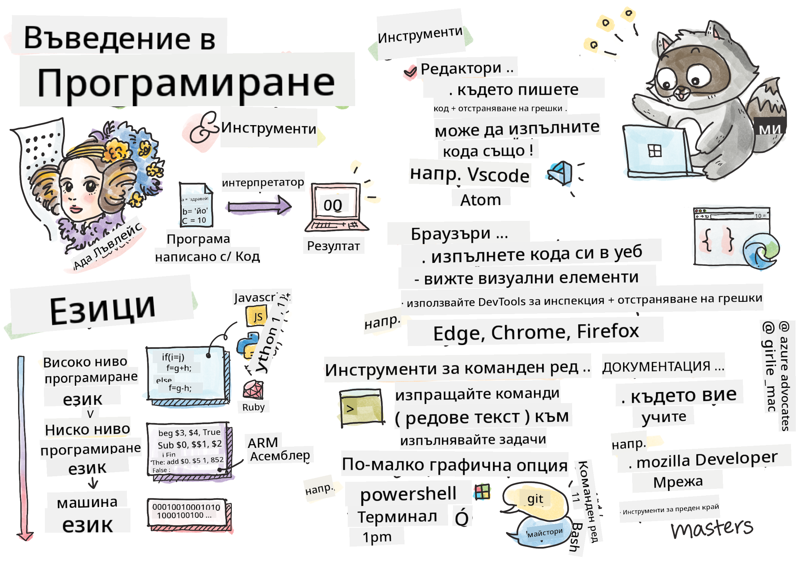

<!--
CO_OP_TRANSLATOR_METADATA:
{
  "original_hash": "2581528206a2a01c3a0b9c88e039b7bc",
  "translation_date": "2025-10-03T10:49:11+00:00",
  "source_file": "1-getting-started-lessons/1-intro-to-programming-languages/README.md",
  "language_code": "bg"
}
-->
# Въведение в програмните езици и инструменти за разработка

Този урок обхваща основите на програмните езици. Темите, разгледани тук, се отнасят за повечето съвременни програмни езици. В секцията „Инструменти за разработка“ ще научите за полезен софтуер, който помага на разработчиците.


> Скетч от [Tomomi Imura](https://twitter.com/girlie_mac)

## Предварителен тест
[Предварителен тест](https://forms.office.com/r/dru4TE0U9n?origin=lprLink)

## Въведение

В този урок ще разгледаме:

- Какво е програмиране?
- Видове програмни езици
- Основни елементи на програмата
- Полезен софтуер и инструменти за професионалния разработчик

> Можете да преминете този урок на [Microsoft Learn](https://docs.microsoft.com/learn/modules/web-development-101/introduction-programming/?WT.mc_id=academic-77807-sagibbon)!

## Какво е програмиране?

Програмирането (известно още като кодиране) е процесът на писане на инструкции за устройство като компютър или мобилно устройство. Пишем тези инструкции с програмни езици, които след това се интерпретират от устройството. Тези набори от инструкции могат да бъдат наричани с различни имена, но *програма*, *компютърна програма*, *приложение (app)* и *изпълним файл* са някои от популярните термини.

*Програма* може да бъде всичко, което е написано с код: уебсайтове, игри и приложения за телефони са програми. Въпреки че е възможно да се създаде програма без писане на код, основната логика се интерпретира от устройството и тази логика най-вероятно е написана с код. Програма, която *работи* или *изпълнява* код, изпълнява инструкции. Устройството, с което четете този урок, изпълнява програма, за да го покаже на екрана ви.

✅ Направете малко проучване: Кой се счита за първия компютърен програмист в света?

## Програмни езици

Програмните езици позволяват на разработчиците да пишат инструкции за устройство. Устройствата могат да разбират само двоичен код (1 и 0), а за *повечето* разработчици това не е много ефективен начин за комуникация. Програмните езици са средство за комуникация между хората и компютрите.

Програмните езици се предлагат в различни формати и могат да служат за различни цели. Например, JavaScript се използва основно за уеб приложения, докато Bash се използва предимно за операционни системи.

*Ниските нива на езиците* обикновено изискват по-малко стъпки за интерпретиране на инструкции от устройството в сравнение с *високите нива на езиците*. Въпреки това, високите нива на езиците са популярни заради тяхната четимост и поддръжка. JavaScript се счита за език от високо ниво.

Следният код илюстрира разликата между език от високо ниво (JavaScript) и език от ниско ниво (ARM асемблерен код).

```javascript
let number = 10
let n1 = 0, n2 = 1, nextTerm;

for (let i = 1; i <= number; i++) {
    console.log(n1);
    nextTerm = n1 + n2;
    n1 = n2;
    n2 = nextTerm;
}
```

```c
 area ascen,code,readonly
 entry
 code32
 adr r0,thumb+1
 bx r0
 code16
thumb
 mov r0,#00
 sub r0,r0,#01
 mov r1,#01
 mov r4,#10
 ldr r2,=0x40000000
back add r0,r1
 str r0,[r2]
 add r2,#04
 mov r3,r0
 mov r0,r1
 mov r1,r3
 sub r4,#01
 cmp r4,#00
 bne back
 end
```

Повярвайте или не, *и двата правят едно и също*: отпечатват последователност на Фибоначи до 10.

✅ Последователността на Фибоначи е [дефинирана](https://en.wikipedia.org/wiki/Fibonacci_number) като набор от числа, при които всяко число е сумата от двете предходни, започвайки от 0 и 1. Първите 10 числа в последователността на Фибоначи са 0, 1, 1, 2, 3, 5, 8, 13, 21 и 34.

## Елементи на програмата

Една инструкция в програмата се нарича *изявление* и обикновено има символ или разстояние, което маркира къде завършва инструкцията, или *се прекратява*. Начинът, по който програмата се прекратява, варира за всеки език.

Изявленията в програмата могат да разчитат на данни, предоставени от потребител или друг източник, за да изпълнят инструкции. Данните могат да променят поведението на програмата, затова програмните езици предлагат начин за временно съхраняване на данни, за да могат да се използват по-късно. Това са *променливи*. Променливите са изявления, които инструктират устройството да запази данни в паметта си. Променливите в програмите са подобни на променливите в алгебрата, където имат уникално име и стойността им може да се променя с времето.

Има вероятност някои изявления да не бъдат изпълнени от устройството. Това обикновено е по дизайн, когато е написано от разработчика, или случайно, когато възникне неочаквана грешка. Този тип контрол върху приложението го прави по-устойчиво и поддържаемо. Обикновено тези промени в контрола се случват, когато са изпълнени определени условия. Често използвано изявление в съвременното програмиране за контрол на начина, по който програмата работи, е `if..else`.

✅ Ще научите повече за този тип изявления в следващите уроци.

## Инструменти за разработка

[](https://youtube.com/watch?v=69WJeXGBdxg "Инструменти за разработка")

> 🎥 Кликнете върху изображението по-горе за видео за инструментите

В тази секция ще научите за някои софтуери, които може да намерите за много полезни, когато започнете професионалното си развитие.

**Среда за разработка** е уникален набор от инструменти и функции, които разработчикът използва често при писане на софтуер. Някои от тези инструменти са персонализирани според специфичните нужди на разработчика и могат да се променят с времето, ако разработчикът промени приоритетите си в работата, личните проекти или когато използва различен програмен език. Средите за разработка са толкова уникални, колкото и разработчиците, които ги използват.

### Редактори

Един от най-важните инструменти за разработка на софтуер е редакторът. Редакторите са мястото, където пишете кода си и понякога го изпълнявате.

Разработчиците разчитат на редакторите по няколко допълнителни причини:

- *Дебъгинг* помага за откриване на грешки, като преминава през кода, ред по ред. Някои редактори имат възможности за дебъгинг; те могат да бъдат персонализирани и добавени за специфични програмни езици.
- *Оцветяване на синтаксиса* добавя цветове и форматиране на текста в кода, което го прави по-лесен за четене. Повечето редактори позволяват персонализирано оцветяване на синтаксиса.
- *Разширения и интеграции* са специализирани инструменти за разработчици, създадени от разработчици. Тези инструменти не са включени в основния редактор. Например, много разработчици документират кода си, за да обяснят как работи. Те могат да инсталират разширение за проверка на правописа, за да откриват грешки в документацията. Повечето разширения са предназначени за използване в конкретен редактор, а повечето редактори имат начин за търсене на налични разширения.
- *Персонализация* позволява на разработчиците да създадат уникална среда за разработка, която да отговаря на техните нужди. Повечето редактори са изключително персонализируеми и могат също така да позволят на разработчиците да създават собствени разширения.

#### Популярни редактори и разширения за уеб разработка

- [Visual Studio Code](https://code.visualstudio.com/?WT.mc_id=academic-77807-sagibbon)
  - [Code Spell Checker](https://marketplace.visualstudio.com/items?itemName=streetsidesoftware.code-spell-checker)
  - [Live Share](https://marketplace.visualstudio.com/items?itemName=MS-vsliveshare.vsliveshare)
  - [Prettier - Code formatter](https://marketplace.visualstudio.com/items?itemName=esbenp.prettier-vscode)
- [Atom](https://atom.io/)
  - [spell-check](https://atom.io/packages/spell-check)
  - [teletype](https://atom.io/packages/teletype)
  - [atom-beautify](https://atom.io/packages/atom-beautify)
  
- [Sublimetext](https://www.sublimetext.com/)
  - [emmet](https://emmet.io/)
  - [SublimeLinter](http://www.sublimelinter.com/en/stable/)

### Браузъри

Друг важен инструмент е браузърът. Уеб разработчиците разчитат на браузъра, за да видят как техният код работи в уеб пространството. Той също така се използва за показване на визуалните елементи на уеб страница, които са написани в редактора, като HTML.

Много браузъри идват с *инструменти за разработчици* (DevTools), които съдържат набор от полезни функции и информация, за да помогнат на разработчиците да събират и улавят важна информация за своето приложение. Например: Ако уеб страница има грешки, понякога е полезно да се знае кога са възникнали. DevTools в браузъра могат да бъдат конфигурирани да улавят тази информация.

#### Популярни браузъри и DevTools

- [Edge](https://docs.microsoft.com/microsoft-edge/devtools-guide-chromium/?WT.mc_id=academic-77807-sagibbon)
- [Chrome](https://developers.google.com/web/tools/chrome-devtools/)
- [Firefox](https://developer.mozilla.org/docs/Tools)

### Инструменти за команден ред

Някои разработчици предпочитат по-малко графичен изглед за ежедневните си задачи и разчитат на командния ред, за да го постигнат. Писането на код изисква значително количество писане, и някои разработчици предпочитат да не прекъсват потока си на клавиатурата. Те използват клавишни комбинации, за да превключват между прозорци на работния плот, работят върху различни файлове и използват инструменти. Повечето задачи могат да бъдат изпълнени с мишка, но едно от предимствата на командния ред е, че много неща могат да се направят с инструменти за команден ред, без да се налага превключване между мишката и клавиатурата. Друго предимство на командния ред е, че той е конфигурируем и можете да запазите персонализирана конфигурация, да я промените по-късно и да я импортирате на други машини за разработка. Тъй като средите за разработка са толкова уникални за всеки разработчик, някои избягват използването на командния ред, други разчитат изцяло на него, а трети предпочитат комбинация от двете.

### Популярни опции за команден ред

Опциите за команден ред се различават в зависимост от операционната система, която използвате.

*💻 = предварително инсталиран на операционната система.*

#### Windows

- [Powershell](https://docs.microsoft.com/powershell/scripting/overview?view=powershell-7/?WT.mc_id=academic-77807-sagibbon) 💻
- [Command Line](https://docs.microsoft.com/windows-server/administration/windows-commands/windows-commands/?WT.mc_id=academic-77807-sagibbon) (известен още като CMD) 💻
- [Windows Terminal](https://docs.microsoft.com/windows/terminal/?WT.mc_id=academic-77807-sagibbon)
- [mintty](https://mintty.github.io/)
  
#### MacOS

- [Terminal](https://support.apple.com/guide/terminal/open-or-quit-terminal-apd5265185d-f365-44cb-8b09-71a064a42125/mac) 💻
- [iTerm](https://iterm2.com/)
- [Powershell](https://docs.microsoft.com/powershell/scripting/install/installing-powershell-core-on-macos?view=powershell-7/?WT.mc_id=academic-77807-sagibbon)

#### Linux

- [Bash](https://www.gnu.org/software/bash/manual/html_node/index.html) 💻
- [KDE Konsole](https://docs.kde.org/trunk5/en/konsole/konsole/index.html)
- [Powershell](https://docs.microsoft.com/powershell/scripting/install/installing-powershell-core-on-linux?view=powershell-7/?WT.mc_id=academic-77807-sagibbon)

#### Популярни инструменти за команден ред

- [Git](https://git-scm.com/) (💻 на повечето операционни системи)
- [NPM](https://www.npmjs.com/)
- [Yarn](https://classic.yarnpkg.com/en/docs/cli/)

### Документация

Когато разработчик иска да научи нещо ново, най-вероятно ще се обърне към документацията, за да научи как да го използва. Разработчиците често разчитат на документацията, за да ги насочи как правилно да използват инструменти и езици, както и за да придобият по-дълбоки знания за това как работят.

#### Популярна документация за уеб разработка

- [Mozilla Developer Network (MDN)](https://developer.mozilla.org/docs/Web), от Mozilla, издателите на браузъра [Firefox](https://www.mozilla.org/firefox/)
- [Frontend Masters](https://frontendmasters.com/learn/)
- [Web.dev](https://web.dev), от Google, издателите на [Chrome](https://www.google.com/chrome/)
- [Документация на Microsoft за разработчици](https://docs.microsoft.com/microsoft-edge/#microsoft-edge-for-developers), за [Microsoft Edge](https://www.microsoft.com/edge)
- [W3 Schools](https://www.w3schools.com/where_to_start.asp)

✅ Направете проучване: Сега, когато знаете основите на средата на уеб разработчика, сравнете и контрастирайте с тази на уеб дизайнера.

---

## 🚀 Предизвикателство

Сравнете някои програмни езици. Какви са уникалните характеристики на JavaScript спрямо Java? А какво ще кажете за COBOL спрямо Go?

## Тест след урока
[Тест след урока](https://ff-quizzes.netlify.app/web/)

## Преглед и самостоятелно обучение

Проучете различните езици, достъпни за програмиста. Опитайте да напишете един ред код на един език и след това го пренапишете на два други. Какво научихте?

## Задание

[Четене на документация](assignment.md)

> Забележка: Когато избирате инструменти за вашето задание, не избирайте редактори, браузъри или инструменти за команден ред, които вече са изброени по-горе.

---

**Отказ от отговорност**:  
Този документ е преведен с помощта на AI услуга за превод [Co-op Translator](https://github.com/Azure/co-op-translator). Въпреки че се стремим към точност, моля, имайте предвид, че автоматизираните преводи може да съдържат грешки или неточности. Оригиналният документ на неговия роден език трябва да се счита за авторитетен източник. За критична информация се препоръчва професионален човешки превод. Ние не носим отговорност за недоразумения или погрешни интерпретации, произтичащи от използването на този превод.