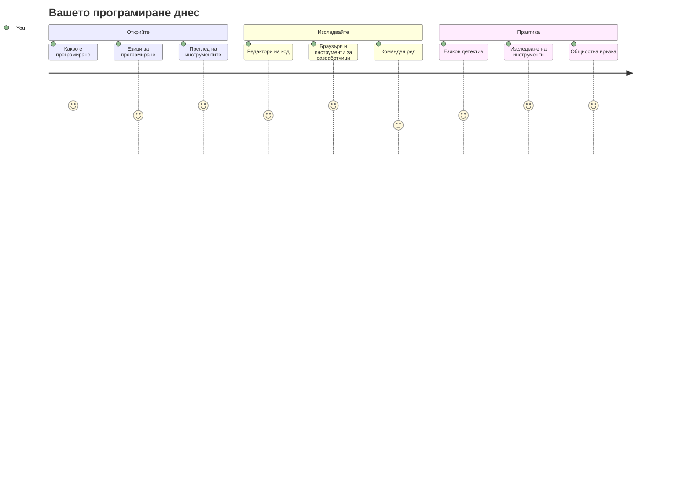
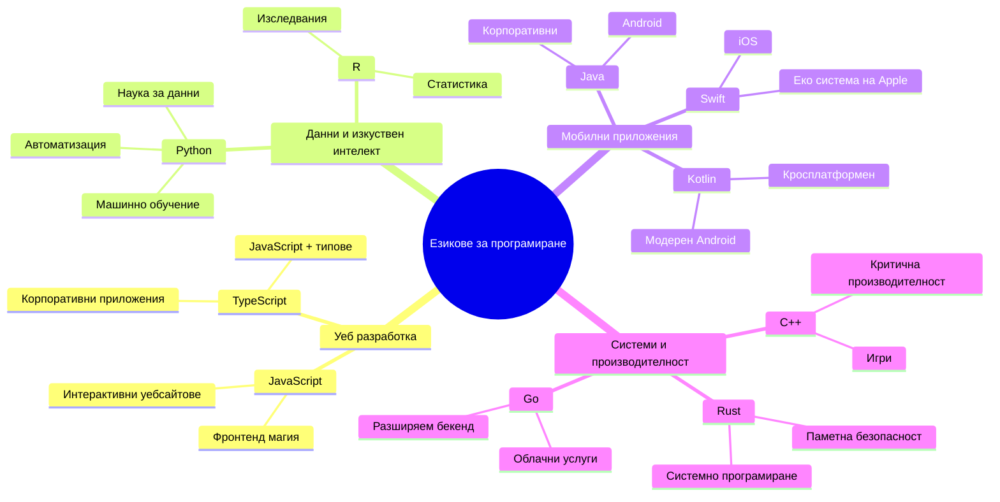
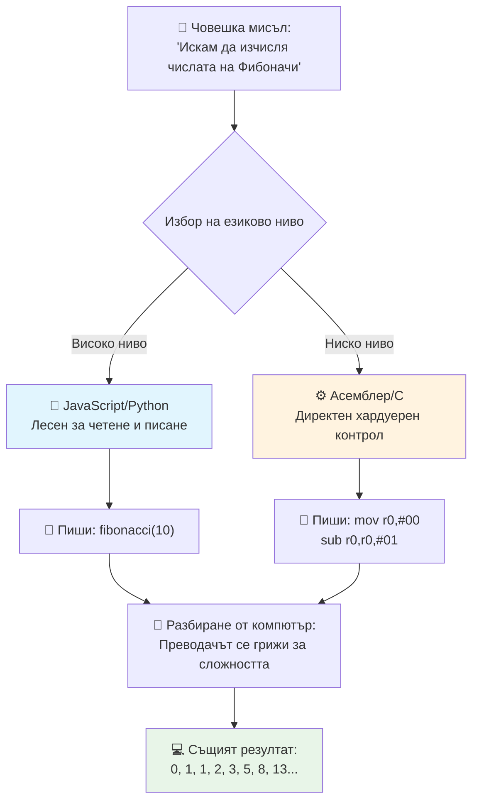
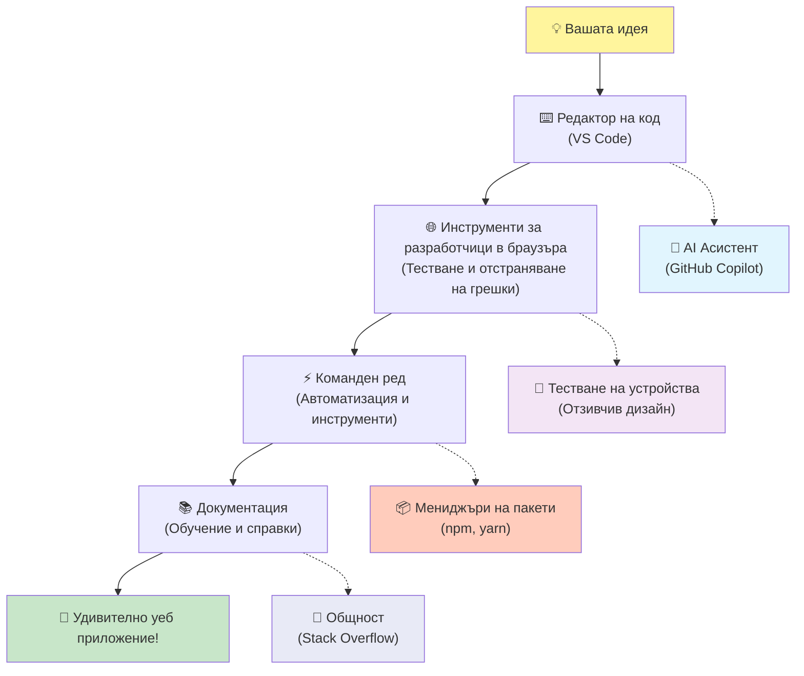
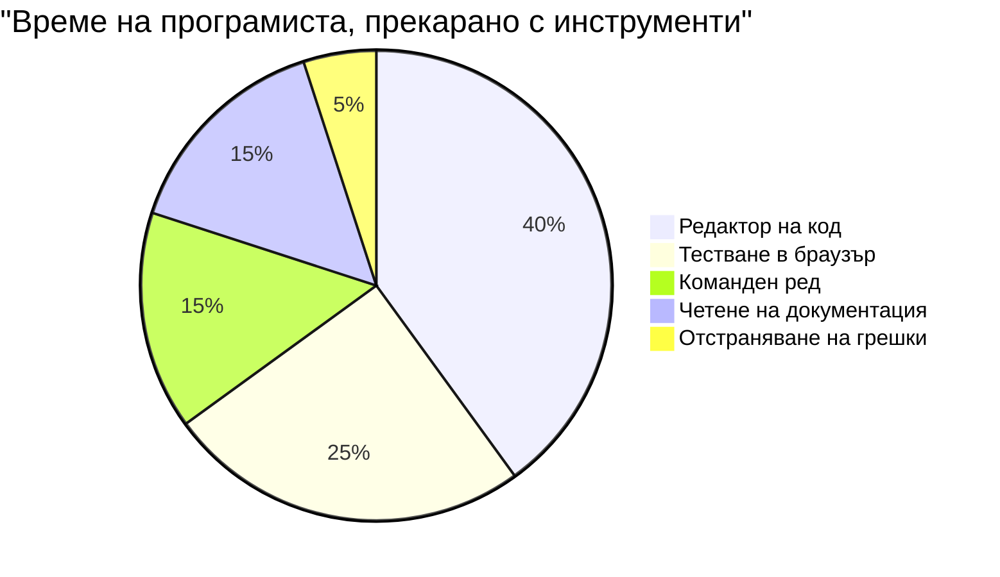
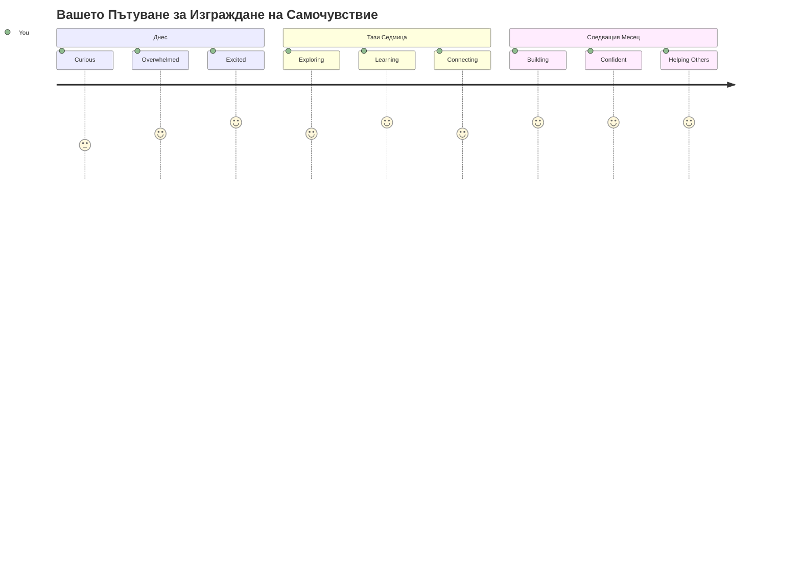

# Въведение в програмирането и съвременните инструменти за разработчици

Здравей, бъдещ разработчик! 👋 Мога ли да ти кажа нещо, което всеки ден ме кара да се възхищавам? Ти си на път да откриеш, че програмирането не е просто за компютри – то е истинска суперсила, с която можеш да оживиш най-смелите си идеи!

Знаеш ли онзи момент, когато използваш любимото си приложение и всичко просто се нарежда перфектно? Когато натиснеш бутон и се случва нещо напълно магично, което те кара да кажеш "уау, как го направиха?" Е, някой точно като теб – вероятно седнал в любимо кафене в 2 сутринта с третото си еспресо – е написал кода, който е създал тази магия. И ето кое ще те удиви: в края на този урок не само ще разбереш как го направиха, а и ще умираш от желание да опиташ сам!

Разбирам те напълно, ако програмирането ти се струва страшно сега. Когато започвах, честно си мислех, че трябва да си някакъв математически гений или да кодиш от 5-годишен. Но ето кое изцяло промени гледната ми точка: програмирането е точно като учене да водиш разговор на нов език. Започваш с "здравей" и "благодаря", после поръчваш кафе, и преди да осъзнаеш, водиш дълбоки философски дискусии! Само че в този случай разговаряш с компютри, и честно? Те са най-търпеливите събеседници, които някога ще срещнеш – никога не те осъждат за грешките и винаги са готови да опитат отново!

Днес ще разгледаме невероятните инструменти, които правят съвременното уеб разработване не просто възможно, а направо пристрастяващо. Говоря за точно същите редактори, браузъри и работни процеси, които използват разработчиците в Netflix, Spotify и любимите ти независими студиа всеки ден. И ето какво ще те зарадва: повечето от тези професионални, индустриални инструменти са напълно безплатни!


> Скетчноут от [Tomomi Imura](https://twitter.com/girlie_mac)


```mermaid
journey
    title Вашето програмиране днес
    section Открийте
      Какво е програмиране: 5: You
      Езици за програмиране: 4: You
      Преглед на инструментите: 5: You
    section Изследвайте
      Редактори на код: 4: You
      Браузъри и инструменти за разработчици: 5: You
      Команден ред: 3: You
    section Практика
      Езиков детектив: 4: You
      Изследване на инструменти: 5: You
      Общностна връзка: 5: You
```
## Нека видим какво вече знаеш!

Преди да се потопим в забавните неща, любопитен съм – какво вече знаеш за този свят на програмирането? И слушай, ако гледаш тези въпроси и си мислиш "Честно нямам никаква идея за това," това не само че е окей, това е перфектно! Това означава, че си на точното място. Помисли за този тест като за разтягане преди тренировка – просто затопляме мозъчните си мускули!

[Направи предварителния тест](https://ff-quizzes.netlify.app/web/)

## Приключението, на което сме се отправили заедно

Добре, истински се вълнувам от това, което ще изследваме днес! Сериозно, искам да видя лицето ти, когато някои от тези концепции ти „светнат“. Ето невероятното пътуване, на което сме заедно:

- **Какво всъщност е програмирането (и защо е най-якото нещо на света!)** – Ще открием как кодът е невидимата магия, която управлява всичко около теб, от алармата, която някак си знае, че е понеделник сутрин, до алгоритъма, който перфектно съставя препоръките ти в Netflix
- **Програмените езици и техните страхотни индивидуалности** – Представи си парти, където всеки човек има различни суперсили и начини за решаване на проблеми. Това е светът на програмените езици и ти ще се влюбиш в тях!
- **Основните градивни блокове, които създават цифровата магия** – Помисли за тях като за върховния творчески комплект LEGO. След като разбереш как тези части се съчетават, ще осъзнаеш, че можеш да построиш буквално всичко, което въображението ти пожелае
- **Професионални инструменти, които ще те накарат да се почувстваш като магьосник с пръчка** – Не преувеличавам – тези инструменти наистина ще ти дадат усещането за суперсили, а най-хубавото? Те са същите, които професионалистите използват!

> 💡 **Ето нещо важно**: Не мисли днес да запаметяваш всичко! Сега искам просто да усетиш искрата на възможностите. Подробностите ще дойдат естествено с практиката – така става истинското учене!

> Можеш да преминеш този урок и в [Microsoft Learn](https://learn.microsoft.com/en-us/learn/modules/web-development-101/introduction-programming/?WT.mc_id=academic-77807-sagibbon)!

## Така, какво точно е *програмирането*?

Добре, нека се заемем с милионния въпрос: какво всъщност е програмирането?

Ще ти разкажа история, която напълно промени начина, по който мисля за това. Миналата седмица се опитвах да обясня на мама как да използва новото дистанционно на умния ни телевизор. Хванах се да казвам неща като „Натисни червения бутон, но не големия червен бутон, а малкия червен отляво... не, другото ти ляво... добре, сега задръж го за две секунди, не за една, не за три..." Звучи ли ти познато? 😅

Ето това е програмиране! Изкуството да даваш изключително подробни, стъпка по стъпка инструкции на нещо много мощно, но което трябва всичко да му се обясни перфектно. Само че вместо да обясняваш на мама (която може да попита "кой червен бутон?!"), ти обясняваш на компютър (който просто прави точно това, което му кажеш, дори и да не е точно това, което си имал предвид).

Това, което ме порази, когато научих това за първи път: компютрите всъщност са сравнително прости по своята същност. Те разбират буквално две неща – 1 и 0, което е просто „да“ и „не“ или „включено“ и „изключено“. Това е всичко! Но тук идва магията – не е нужно да говорим на 1 и 0 като в Матрицата. Тогава на помощ идват **програмените езици**. Те са като най-добрия преводач в света, който взима твоите нормални човешки мисли и ги превръща в компютърен език.

И ето кое все още ме кара да се възхищавам всяка сутрин, когато се събудя: буквално *всичко* цифрово в живота ти е започнало от някой като теб, вероятно седнал в пижамата си с чаша кафе и пишещ код на лаптопа си. Онзи филтър в Instagram, който те прави безупречен? Някой го е кодирал. Препоръката, която те доведе до новата ти любима песен? Разработчик е създал този алгоритъм. Приложението, което ти помага да разделиш сметката за вечерята с приятели? Да, някой е мислел „колко дразнещо е това, мога ли да го оправя?“ и го е направил!

Когато научиш как да програмираш, ти не просто придобиваш ново умение – ставаш част от невероятна общност от решаващи проблеми, които посвещават дните си на мисълта „Ами ако мога да създам нещо, което прави деня на някого малко по-добър?“ Честно, има ли нещо по-яко от това?

✅ **Забавен факт:** Ето нещо супер интересно, което можеш да потърсиш, когато имаш свободно време – кой мислиш, че е бил първият компютърен програмист в света? Ще ти дам намек: може би не е този, когото очакваш! Историята зад този човек е абсолютно завладяваща и показва, че програмирането винаги е било за творческо решаване на проблеми и мислене извън рамките.

### 🧠 **Време за проверка: Как се чувстваш?**

**Отдели малко време за размисъл:**
- Сега разбра ли идеята за „даване на инструкции на компютри“?
- Можеш ли да се сетиш за ежедневна задача, която би искал да автоматизираш с програмиране?
- Какви въпроси ти се въртят в главата за цялото това програмиране?

> **Запомни**: Напълно нормално е някои концепции да ти се струват размити сега. Учението на програмиране е като учене на нов език – отнема време мозъкът ти да изгражда тези невронни връзки. Правиш го страхотно!

## Програмените езици са като различни вкусове магия

Добре, това може да звучи странно, но остани с мен – програмените езици са като различните видове музика. Помисли: има джаз, който е плавен и импровизационен, рок – мощен и директен, класическа музика – елегантна и структурирана, и хип-хоп – креативен и изразителен. Всяко течение има своя атмосфера, своя общност от страстни фенове и всяко е идеално за различни настроения и поводи.

Програмените езици работят по същия начин! Не би използвал същия език, за да направиш забавна мобилна игра, която би използвал, за да обработваш огромни масиви климатични данни – точно както не би пускал дет метъл в занятие по йога (поне повечето йога занятия! 😄).

Но ето кое ме учудва всеки път, когато го мисля: тези езици са като най-търпеливия, блестящ преводач в света, който седи до теб. Можеш да изразиш идеите си по начин, който е естествен за човешкия ти мозък, а те се грижат за цялата сложна работа по превръщането им в 1 и 0, на които компютрите говорят. Като приятел, който е безупречно владеещ и „човешко творчество“, и „компютърна логика“ – и никога не се уморява, не пие кафе и не се дразни, ако попиташ същото нещо два пъти!

### Популярни програмни езици и тяхното приложение


```mermaid
mindmap
  root((Езикове за програмиране))
    Уеб разработка
      JavaScript
        Фронтенд магия
        Интерактивни уебсайтове
      TypeScript
        JavaScript + типове
        Корпоративни приложения
    Данни и изкуствен интелект
      Python
        Наука за данни
        Машинно обучение
        Автоматизация
      R
        Статистика
        Изследвания
    Мобилни приложения
      Java
        Android
        Корпоративни
      Swift
        iOS
        Еко система на Apple
      Kotlin
        Модерен Android
        Кросплатформен
    Системи и производителност
      C++
        Игри
        Критична производителност
      Rust
        Паметна безопасност
        Системно програмиране
      Go
        Облачни услуги
        Разширяем бекенд
```
| Език | Най-добър за | Защо е популярен |
|----------|----------|------------------|
| **JavaScript** | Уеб разработка, потребителски интерфейси | Работи в браузърите и задвижва интерактивни сайтове |
| **Python** | Данни, автоматизация, изкуствен интелект | Лесен за четене и учене, мощни библиотеки |
| **Java** | Корпоративни приложения, Android приложения | Платформено независим, стабилен за големи системи |
| **C#** | Windows приложения, разработка на игри | Силна подкрепа от Microsoft екосистема |
| **Go** | Облачни услуги, бекенд системи | Бърз, прост, създаден за съвременните изчисления |

### Езици от високо ниво срещу езици от ниско ниво

Добре, това беше честно казано концепцията, която ми разбиваше мозъка, когато започвах, затова ще ти разкажа аналогията, която най-накрая го направи ясно – и истински се надявам да ти помогне и на теб!

Представи си, че си в държава, в която не говориш езика, и отчаяно трябва да намериш най-близката тоалетна (сигурно сме били в тази ситуация, нали? 😅):

- **Програмирането на ниско ниво** е като да научиш местния диалект толкова добре, че да разговаряш с бабата, която продава плодове на ъгъла, използвайки културни препратки, жаргон и вътрешни вицове, които само местните разбират. Супер впечатляващо и много ефикасно... ако тъкмо говориш езика! Но доста объркващо, когато просто търсиш тоалетна.

- **Програмирането на високо ниво** е като да имаш този невероятен местен приятел, който те разбира. Можеш да кажеш "наистина ми трябва баня" на прост английски, а той превежда всичко и ти дава насока, която ти е ясна, макар и да не говориш местния език.

В термини на програмиране:
- **Езиците от ниско ниво** (като Assembly или C) ти позволяват да имаш невероятно подробни разговори със самия хардуер на компютъра, но трябва да мислиш като машина, което... скажем просто, голяма е умствената промяна!
- **Езиците от високо ниво** (като JavaScript, Python или C#) ти позволяват да мислиш като човек, а те се грижат за всички машинни инструкции зад кулисите. Освен това имат невероятно приветливи общности, пълни с хора, които помнят какво е да си начинаещи и искрено искат да помогнат!

Угаси се кой ти предлагам да започнеш с? 😉 Езиците от високо ниво са като помощни колелца, които никога наистина не искаш да махнеш, защото целият процес е много по-приятен!


```mermaid
flowchart TB
    A["👤 Човешка мисъл:<br/>'Искам да изчисля числата на Фибоначи'"] --> B{Избор на езиково ниво}
    
    B -->|Високо ниво| C["🌟 JavaScript/Python<br/>Лесен за четене и писане"]
    B -->|Ниско ниво| D["⚙️ Асемблер/C<br/>Директен хардуерен контрол"]
    
    C --> E["📝 Пиши: fibonacci(10)"]
    D --> F["📝 Пиши: mov r0,#00<br/>sub r0,r0,#01"]
    
    E --> G["🤖 Разбиране от компютър:<br/>Преводачът се грижи за сложността"]
    F --> G
    
    G --> H["💻 Същият резултат:<br/>0, 1, 1, 2, 3, 5, 8, 13..."]
    
    style C fill:#e1f5fe
    style D fill:#fff3e0
    style H fill:#e8f5e8
```
### Нека ти покажа защо езиците от високо ниво са толкова по-приятелски

Добре, ще ти покажа нещо, което перфектно демонстрира защо се влюбих в езиците от високо ниво, но първо – обещай ми нещо. Когато видиш първия пример с код, не изпадай в паника! Той е предназначен да изглежда страшен. Точно това е точката ми!

Ще разгледаме една и съща задача, написана в два напълно различни стила. И двете създават това, което се нарича Фибоначи последователност – това е този красив математически модел, където всяко число е сумата на предходните две: 0, 1, 1, 2, 3, 5, 8, 13... (Забавен факт: този модел е буквално навсякъде в природата – спирали на слънчогледови семена, модели на шишарки, дори как се формират галактики!)

Готов ли си да видиш разликата? Да тръгваме!

**Език от високо ниво (JavaScript) – Човеколюбив:**

```javascript
// Стъпка 1: Основна настройка на Фибоначи
const fibonacciCount = 10;
let current = 0;
let next = 1;

console.log('Fibonacci sequence:');
```

**Ето какво прави този код:**
- **Декларира** константа, която определя колко числа от Фибоначи искаме да генерираме
- **Инициализира** две променливи, които следят текущото и следващото число в последователността
- **Задава** началните стойности (0 и 1), които определят Фибоначи модела
- **Показва** заглавно съобщение, за да идентифицира изхода

```javascript
// Стъпка 2: Генерирайте последователността с цикъл
for (let i = 0; i < fibonacciCount; i++) {
  console.log(`Position ${i + 1}: ${current}`);
  
  // Изчислете следващото число в последователността
  const sum = current + next;
  current = next;
  next = sum;
}
```

**Разбивка на случващото се тук:**
- **Обхожда** всяка позиция в последователността чрез цикъл `for`
- **Показва** всяко число с неговата позиция, използвайки шаблонно форматиране
- **Изчислява** следващото число от Фибоначи чрез събирането на текущото и следващото
- **Актуализира** проследяващите променливи, за да премине към следващата итерация

```javascript
// Стъпка 3: Модерен функционален подход
const generateFibonacci = (count) => {
  const sequence = [0, 1];
  
  for (let i = 2; i < count; i++) {
    sequence[i] = sequence[i - 1] + sequence[i - 2];
  }
  
  return sequence;
};

// Пример за използване
const fibSequence = generateFibonacci(10);
console.log(fibSequence);
```

**В горния код:**
- **Създадохме** многократно използваща се функция с помощта на модерния синтаксис на стрелкова функция
- **Построихме** масив, който съхранява цялата последователност, вместо да показваме числата поотделно
- **Използвахме** индексиране в масива, за да изчислим всяко ново число от предходните стойности
- **Върнахме** цялата последователност за по-гъвкаво използване в други части на програмата

**Език от ниско ниво (ARM Assembly) – Подходящ за компютъра:**

```assembly
 area ascen,code,readonly
 entry
 code32
 adr r0,thumb+1
 bx r0
 code16
thumb
 mov r0,#00
 sub r0,r0,#01
 mov r1,#01
 mov r4,#10
 ldr r2,=0x40000000
back add r0,r1
 str r0,[r2]
 add r2,#04
 mov r3,r0
 mov r0,r1
 mov r1,r3
 sub r4,#01
 cmp r4,#00
 bne back
 end
```

Забележи как версията на JavaScript се чете почти като инструкции на английски, докато Assembly версията използва криптични команди, които директно контролират процесора на компютъра. И двете изпълняват същата задача, но езикът от високо ниво е много по-лесен за разбиране, писане и поддръжка от човека.

**Ключови разлики, които ще забележиш:**
- **Четимост**: JavaScript използва описателни имена като `fibonacciCount`, докато Assembly използва криптични етикети като `r0`, `r1`
- **Коментари**: Високо ниво езици насърчават обяснителни коментари, които правят кода самодокументиращ се
- **Структура**: Логическият поток на JavaScript съответства на начина, по който хората мислят за проблемите стъпка по стъпка
- **Поддръжка**: Актуализирането на версията на JavaScript за различни изисквания е лесно и ясно

✅ **За числовата редица на Фибоначи**: Този абсолютно прекрасен числов модел (където всяко число е равна на сумата на двете предишни: 0, 1, 1, 2, 3, 5, 8...) се появява буквално *навсякъде* в природата! Ще го откриете в спиралите на слънчогледите, моделите на шишарки, начина по който се навиват черупките на наутилуса и дори в начина, по който растат клоните на дърветата. Доста е удивително как математиката и кода ни помагат да разберем и пресъздадем моделите, които природата използва, за да създаде красота!


## Строителните блокове, които правят магията възможна

Добре, сега когато видяхте как изглеждат програмните езици в действие, нека разгледаме основните части, които изграждат буквално всяка програма някога написана. Представете си ги като съществените съставки във вашата любима рецепта – след като разберете какво прави всяка от тях, ще можете да четете и пишете код почти на всеки език!

Това е като да научите граматиката на програмирането. Помните ли, когато в училище учехте за съществителните, глаголите и как се строят изречения? Програмирането има своя версия на граматиката и, честно казано, тя е много по-логична и прощаваща отколкото английската граматика някога е била! 😄

### Изрази: Инструкции стъпка по стъпка

Нека започнем с **изрази** – те са като отделни изречения в разговор с вашия компютър. Всеки израз казва на компютъра да направи конкретно нещо, нещо като указания: "Завий наляво тук," "Спри на червената светлина," "Паркирай на това място."

Това, което обичам в изразите, е колко четими обикновено са. Вижте това:

```javascript
// Основни оператори, които изпълняват единични действия
const userName = "Alex";                    
console.log("Hello, world!");              
const sum = 5 + 3;                         
```

**Ето какво прави този код:**
- **Декларира** константна променлива, за да съхрани името на потребителя
- **Показва** приветствено съобщение в конзолния изход
- **Изчислява** и съхранява резултата от математическа операция

```javascript
// Изявления, които взаимодействат с уеб страници
document.title = "My Awesome Website";      
document.body.style.backgroundColor = "lightblue";
```

**Стъпка по стъпка, ето какво се случва:**
- **Променя** заглавието на уебстраницата, което се показва в раздела на браузъра
- **Променя** цвета на фона на цялото тяло на страницата

### Променливи: Системата за памет на вашата програма

Добре, **променливите** са честно казано една от любимите ми концепции за обучение, защото са толкова подобни на неща, които вече използвате всеки ден!

Помислете за списъка с контакти на телефона си за секунда. Не запомняте телефонните номера на всички – вместо това запазвате "Мама," "Най-добър приятел" или "Пицария, която доставя до 2 сутринта" и оставяте телефона да запомни реалните номера. Променливите работят по същия начин! Те са като етикетирани контейнери, където вашата програма може да съхранява информация и да я извлича по-късно с име, което всъщност има смисъл.

Ето какво е наистина страхотно: променливите могат да се променят, докато вашата програма работи (оттук идва името "променлива" – вижте как са се сетили!). Точно както бихте обновили контакта на пицарията, когато откриете нещо по-добро, променливите могат да се актуализират, докато програмата научава нова информация или когато обстоятелствата се променят!

Нека ви покажа колко красиво просто може да бъде това:

```javascript
// Стъпка 1: Създаване на основни променливи
const siteName = "Weather Dashboard";        
let currentWeather = "sunny";               
let temperature = 75;                       
let isRaining = false;                      
```

**Разбиране на тези концепции:**
- **Съхранявайте** непроменящи се стойности в `const` променливи (като името на сайта)
- **Използвайте** `let` за стойности, които могат да се променят през изпълнението на програмата
- **Присвоявайте** различни типове данни: низове (текст), числа и булеви стойности (true/false)
- **Избирайте** описателни имена, които обясняват какво съдържа всяка променлива

```javascript
// Стъпка 2: Работа с обекти за групиране на свързани данни
const weatherData = {                       
  location: "San Francisco",
  humidity: 65,
  windSpeed: 12
};
```

**В горния пример:**
- **Създадохме** обект за групиране на свързана метеорологична информация
- **Организирахме** множество данни под едно име на променлива
- **Използвахме** двойки ключ-стойност за ясно обозначаване на всяка част от информацията

```javascript
// Стъпка 3: Използване и актуализиране на променливи
console.log(`${siteName}: Today is ${currentWeather} and ${temperature}°F`);
console.log(`Wind speed: ${weatherData.windSpeed} mph`);

// Актуализиране на променливи, които могат да се променят
currentWeather = "cloudy";                  
temperature = 68;                          
```

**Нека разберем всяка част:**
- **Показвайте** информация с използване на шаблонни низове със синтаксис `${}`
- **Достъпвайте** свойства на обекта с точкова нотация (`weatherData.windSpeed`)
- **Актуализирайте** променливи, декларирани с `let`, за да отразят променящи се условия
- **Комбинирайте** множество променливи, за да създадете смислени съобщения

```javascript
// Стъпка 4: Модерен деструктуриране за по-чист код
const { location, humidity } = weatherData; 
console.log(`${location} humidity: ${humidity}%`);
```

**Какво трябва да знаете:**
- **Извличайте** конкретни свойства от обекти с помощта на деструктуриращо присвояване
- **Създавайте** нови променливи автоматично със същите имена като ключовете в обекта
- **Оптимизирайте** кода, като избягвате повтаряща се точкова нотация

### Контролен поток: Обучаване на вашата програма да мисли

Добре, тук програмирането става абсолютно удивително! **Контролният поток** е всъщност обучението на вашата програма да взема умни решения, точно както вие правите всеки ден без изобщо да се замисляте.

Представете си това: тази сутрин вероятно сте преминали през нещо като "Ако вали, ще взема чадър. Ако е студено, ще облека яке. Ако закъснявам, ще прескоча закуската и ще взема кафе по пътя." Вашият мозък естествено следва тази if-then логика десетки пъти всеки ден!

Това е, което прави програмите да изглеждат интелигентни и живи, вместо просто да следват скучен, предсказуем скрипт. Те всъщност могат да анализират ситуацията, да оценят какво се случва и да реагират адекватно. Това е като да дадете на програмата си мозък, който може да се адаптира и да прави избори!

Искате ли да видите колко красиво работи това? Нека ви покажа:

```javascript
// Стъпка 1: Основна условна логика
const userAge = 17;

if (userAge >= 18) {
  console.log("You can vote!");
} else {
  const yearsToWait = 18 - userAge;
  console.log(`You'll be able to vote in ${yearsToWait} year(s).`);
}
```

**Ето какво прави този код:**
- **Проверява** дали възрастта на потребителя отговаря на изискването за гласуване
- **Изпълнява** различни блокове код въз основа на резултата от условието
- **Изчислява** и показва колко време остава до пълнолетие за гласуване, ако е под 18
- **Предоставя** конкретна, полезна обратна връзка за всеки случай

```javascript
// Стъпка 2: Множество условия с логически оператори
const userAge = 17;
const hasPermission = true;

if (userAge >= 18 && hasPermission) {
  console.log("Access granted: You can enter the venue.");
} else if (userAge >= 16) {
  console.log("You need parent permission to enter.");
} else {
  console.log("Sorry, you must be at least 16 years old.");
}
```

**Анализ на случващото се тук:**
- **Комбинира** няколко условия с оператора `&&` (и)
- **Създава** йерархия от условия с помощта на `else if` за множество ситуации
- **Обхваща** всички възможни случаи с краен `else` израз
- **Осигурява** ясна, директна обратна връзка за всяка различна ситуация

```javascript
// Стъпка 3: Кратко условие с тернарен оператор
const votingStatus = userAge >= 18 ? "Can vote" : "Cannot vote yet";
console.log(`Status: ${votingStatus}`);
```

**Това, което трябва да запомните:**
- **Използвайте** тернарния оператор (`? :`) за прости условия с две опции
- **Пишете** условието първо, последвано от `?`, след това резултат при вярно условие, `:`, и резултат при невярно условие
- **Прилагайте** този модел, когато трябва да зададете стойности според условия

```javascript
// Стъпка 4: Обработка на множество специфични случаи
const dayOfWeek = "Tuesday";

switch (dayOfWeek) {
  case "Monday":
  case "Tuesday":
  case "Wednesday":
  case "Thursday":
  case "Friday":
    console.log("It's a weekday - time to work!");
    break;
  case "Saturday":
  case "Sunday":
    console.log("It's the weekend - time to relax!");
    break;
  default:
    console.log("Invalid day of the week");
}
```

**Този код изпълнява следното:**
- **Сравнява** стойността на променливата с няколко конкретни случая
- **Групира** подобни случаи заедно (работни дни срещу почивни)
- **Изпълнява** подходящия кодов блок при намерена съвпадение
- **Включва** `default` случай за обработка на неочаквани стойности
- **Използва** `break` изрази, за да предотврати продължаване към следващия случай

> 💡 **Реален пример**: Представете си контрола на потока като най-търпеливата GPS навигация в света. Тя може да каже: „Ако има задръстване по Главната улица, използвай магистралата. Ако строеж блокира магистралата, пробвай по живописния път.“ Програмите използват същия тип условна логика, за да реагират интелигентно в различни ситуации и винаги да предоставят на потребителите най-доброто преживяване.

### 🎯 **Проверка на концепциите: Майсторство в строителните блокове**

**Нека проверим как се справяте с основите:**
- Можете ли да обясните разликата между променлива и израз със собствени думи?
- Помислете за реален случай, в който бихте използвали if-then решение (като нашия пример с гласуването)
- Какво ви изненада най-много в логиката при програмирането?

**Бърз стимул за увереност:**

```mermaid
flowchart LR
    A["📝 Изявления<br/>(Команди)"] --> B["📦 Променливи<br/>(Памет)"] --> C["🔀 Контрол на потока<br/>(Решения)"] --> D["🎉 Работеща програма!"]
    
    style A fill:#ffeb3b
    style B fill:#4caf50
    style C fill:#2196f3
    style D fill:#ff4081
```
✅ **Какво следва:** Предстои ни невероятно забавление, докато навлизаме по-дълбоко в тези концепции заедно! Засега се съсредоточете само върху това да почувствате вълнението от всички удивителни възможности пред вас. Конкретните умения и техники ще се усвояват естествено с практиката – уверявам ви, че това ще е много по-забавно от колкото очаквате!

## Инструментите на занаята

Добре, честно казано това е моментът, в който се вълнувам толкова, че едва се сдържам! 🚀 Ще говорим за невероятните инструменти, които ще ви накарат да се почувствате сякаш току-що са ви дали ключовете за цифров космически кораб.

Знаете ли как готвачът има тези перфектно балансирани ножове, които се усещат като продължение на ръцете му? Или как музикантът има онзи китар, който сякаш пее точно в момента, в който я докосне? Е, разработчиците имаме своя версия на тези магически инструменти и тук идва онова, което ще ви изуми – повечето от тях са безплатни!

Почти скачам на стола си, докато мисля да ги споделя с вас, защото те напълно промениха начина, по който създаваме софтуер. Говорим за асистенти за кодиране с изкуствен интелект, които могат да помогнат да пишете кода си (и не се шегувам!), облачни среди, в които можете да изграждате цели приложения буквално от всяко място с Wi-Fi, и инструменти за отстраняване на грешки толкова сложни, че са като рентгеново зрение за вашите програми.

И сега частта, която все още ми дава тръпки: това не са „начинаещи инструменти“, които ще надраснете. Това са същите професионални инструменти, които разработчиците в Google, Netflix и онази малка интерактивна студия, която обичате, използват в момента. Ще се чувствате като истински професионалист, докато ги ползвате!


```mermaid
graph TD
    A["💡 Вашата идея"] --> B["⌨️ Редактор на код<br/>(VS Code)"] 
    B --> C["🌐 Инструменти за разработчици в браузъра<br/>(Тестване и отстраняване на грешки)"]
    C --> D["⚡ Команден ред<br/>(Автоматизация и инструменти)"]
    D --> E["📚 Документация<br/>(Обучение и справки)"]
    E --> F["🚀 Удивително уеб приложение!"]
    
    B -.-> G["🤖 AI Асистент<br/>(GitHub Copilot)"]
    C -.-> H["📱 Тестване на устройства<br/>(Отзивчив дизайн)"]
    D -.-> I["📦 Мениджъри на пакети<br/>(npm, yarn)"]
    E -.-> J["👥 Общност<br/>(Stack Overflow)"]
    
    style A fill:#fff59d
    style F fill:#c8e6c9
    style G fill:#e1f5fe
    style H fill:#f3e5f5
    style I fill:#ffccbc
    style J fill:#e8eaf6
```
### Редактори на код и IDE: Вашите нови цифрови най-добри приятели

Нека поговорим за редакторите на код – те сериозно ще станат вашите любими места за творчество! Мислете за тях като за вашето лично святилище за кодиране, където ще прекарвате по-голямата част от времето си, изграждайки и усъвършенствайки дигиталните си творения.

Но ето кое е абсолютно магичното при съвременните редактори: те не са просто изящни текстови редактори. Те са като най-блестящият, подкрепящ ментор, който винаги седи до вас 24/7. Хващат печатни грешки, преди да ги забележите, предлагат подобрения, които ви правят да изглеждате като гений, помагат ви да разберете какво прави всяка част от кода, а някои дори могат да предвидят какво ще напишете и да завършат мислите ви!

Спомням си първия път, когато открих автоматично допълване – сякаш живеех в бъдещето. Започвате да пишете нещо и редакторът казва: „Хей, не искаш ли да използваш тази функция, която прави точно това, което ти трябва?“ Това е като да имаш читател на мисли за кодиране!

**Какво прави тези редактори толкова невероятни?**

Съвременните редактори на код предлагат впечатляващ набор от функции за повишаване на продуктивността:

| Функция | Какво прави | Защо помага |
|---------|--------------|--------------|
| **Оцветяване на синтаксиса** | Оцветява различни части на кода | Прави кода по-лесен за четене и намиране на грешки |
| **Автоматично допълване** | Предлага код, докато пишете | Ускорява писането на код и намалява грешки |
| **Инструменти за отстраняване на грешки** | Помага да намерите и коригирате грешки | Спестява часове в търсене на проблеми |
| **Разширения** | Добавят специализирани функции | Персонализира редактора за всяка технология |
| **Асистенти с ИИ** | Предлагат код и обяснения | Ускорява ученето и производителността |

> 🎥 **Видео ресурс**: Искате ли да видите тези инструменти в действие? Вижте това [Видео „Инструментите на занаята“](https://youtube.com/watch?v=69WJeXGBdxg) за цялостен преглед.

#### Препоръчителни редактори за уеб разработка

**[Visual Studio Code](https://code.visualstudio.com/?WT.mc_id=academic-77807-sagibbon)** (Безплатен)
- Най-популярен сред уеб разработчиците
- Отлична екосистема от разширения
- Вграден терминал и интеграция с Git
- **Задължителни разширения**:
  - [GitHub Copilot](https://marketplace.visualstudio.com/items?itemName=GitHub.copilot) - AI базирани предложения за код
  - [Live Share](https://marketplace.visualstudio.com/items?itemName=MS-vsliveshare.vsliveshare) - Сътрудничество в реално време
  - [Prettier](https://marketplace.visualstudio.com/items?itemName=esbenp.prettier-vscode) - Автоматично форматиране на кода
  - [Code Spell Checker](https://marketplace.visualstudio.com/items?itemName=streetsidesoftware.code-spell-checker) - Засича правописни грешки в кода

**[JetBrains WebStorm](https://www.jetbrains.com/webstorm/)** (Платен, безплатен за студенти)
- Разширени инструменти за отстраняване на грешки и тестване
- Интелигентно допълване на кода
- Вградена система за контрол на версиите

**Облачни IDE** (Различни цени)
- [GitHub Codespaces](https://github.com/features/codespaces) - Пълен VS Code във вашия браузър
- [Replit](https://replit.com/) - Отличен за учене и споделяне на код
- [StackBlitz](https://stackblitz.com/) - Моментално, пълностекова уеб разработка

> 💡 **Съвет за започване**: Започнете с Visual Studio Code – безплатен е, широко използван в индустрията и има огромна общност, която създава полезни уроци и разширения.


### Уеб браузъри: Вашата тайна лаборатория за разработка

Добре, пригответе се за пълно умуващо изживяване! Знаете как използвате браузърите, за да разглеждате социални мрежи и гледате видеа? Оказва се, че те са крили цяло невероятно тайно лабораторно пространство за разработчици през цялото това време, просто чакайки да го откриете!

Всеки път, когато кликнете с десния бутон върху уебстраница и изберете „Inspect Element“ (Инспектиране на елемент), отваряте скрит свят на инструменти за разработчици, които всъщност са по-мощни от някои скъпи софтуери, за които преди съм плащал стотици долари. Това е като да откриете, че вашата обикновена кухня крие професионална готварска лаборатория зад секретен панел!
Първия път, когато някой ми показа браузър DevTools, прекарах около три часа просто кликайки насам-натам и казвах „ЧАКАЙ, ТОЙ МОЖЕ И ТОВА?!“ Можеш буквално да редактираш всеки уебсайт в реално време, да видиш точно колко бързо се зарежда всичко, да тестваш как изглежда твоя сайт на различни устройства и дори да дебъгваш JavaScript като истински професионалист. Абсолютно поразително е!

**Ето защо браузърите са твоето тайно оръжие:**

Когато създаваш уебсайт или уеб приложение, трябва да видиш как изглежда и как се държи в реалния свят. Браузърите не само показват твоята работа, но и предоставят подробна обратна връзка за производителността, достъпността и потенциалните проблеми.

#### Инструменти за разработчици в браузъри (DevTools)

Съвременните браузъри включват всеобхватни комплекти за разработка:

| Категория инструмент | Какво прави | Примерна употреба |
|---------------------|-------------|-------------------|
| **Преглед на елементи** | Преглежда и редактира HTML/CSS в реално време | Настройване на стила с моментален резултат |
| **Конзола** | Показва съобщения за грешки и тестове на JavaScript | Дебъгване на проблеми и експериментиране с код |
| **Мрежови инструменти** | Следи как се зареждат ресурсите | Оптимизиране на производителност и време за зареждане |
| **Проверка за достъпност** | Тества за приобщаващ дизайн | Осигурява, че сайтът работи за всички потребители |
| **Емулятор на устройства** | Преглед на различни размери на екрана | Тества отзивчив дизайн без множество устройства |

#### Препоръчани браузъри за разработка

- **[Chrome](https://developers.google.com/web/tools/chrome-devtools/)** - Индустриален стандарт за DevTools с обширна документация  
- **[Firefox](https://developer.mozilla.org/docs/Tools)** - Отлични инструменти за CSS Grid и достъпност  
- **[Edge](https://docs.microsoft.com/microsoft-edge/devtools-guide-chromium/?WT.mc_id=academic-77807-sagibbon)** - Изграден на Chromium с ресурси на Microsoft за разработчици  

> ⚠️ **Важно за тестване**: Винаги тествай уебсайтовете си в няколко браузъра! Това, което работи перфектно в Chrome, може да изглежда различно в Safari или Firefox. Професионалните разработчици тестват в големите браузъри, за да осигурят последователно преживяване на потребителите.

### Инструменти от командния ред: Вход към суперсилите на разработчика

Добре, нека бъдем напълно честни тук за командния ред, защото искам да чуеш това от някой, който наистина го разбира. Когато го видях за първи път – този страшен черен екран с мигащ текст – буквално си помислих: „Не, в никакъв случай! Това изглежда като сцена от хакерски филм от 80-те, и със сигурност не съм достатъчно умен за това!“ 😅

Но ето какво искам някой да ми беше казал тогава, и което ти казвам сега: командният ред не е страшен – той всъщност е като директен разговор с компютъра ти. Мисли за него като за разликата между поръчването на храна през стилно приложение с картинки и меню (което е лесно и приятно) и влизането в любимия ти местен ресторант, където готвачът знае точно какво обичаш и може да ти сътвори нещо перфектно само с думите „изненадай ме с нещо невероятно“.

Командният ред е мястото, където разработчиците се чувстват като абсолютни магьосници. Въвеждаш няколко на пръв поглед магически думи (окей, команди са, но наистина звучат магически!), натискаш enter и БАМ – създаваш цели проекти, инсталираш мощни инструменти от цял свят или пускаш приложението си в интернет, за да го видят милиони. След като усетиш тази сила за първи път, наистина е доста пристрастяващо!

**Защо командният ред ще стане любимият ти инструмент:**

Докато графичните интерфейси са чудесни за много задачи, командният ред изпреварва при автоматизация, прецизност и скорост. Много инструменти за разработка са основно на базата на команден интерфейс, а усвояването им ще повиши значително продуктивността ти.

```bash
# Стъпка 1: Създайте и навигирайте до директорията на проекта
mkdir my-awesome-website
cd my-awesome-website
```
  
**Ето какво прави този код:**  
- **Създава** нова папка с името "my-awesome-website" за твоя проект  
- **Влиза** в новосъздадената папка, за да започне работа  

```bash
# Стъпка 2: Инициализирайте проекта с package.json
npm init -y

# Инсталирайте модерни инструменти за разработка
npm install --save-dev vite prettier eslint
npm install --save-dev @eslint/js
```
  
**Стъпка по стъпка, ето какво става:**  
- **Инициализира** нов проект Node.js с настройки по подразбиране чрез `npm init -y`  
- **Инсталира** Vite като модерен билд инструмент за бърза разработка и продукционни сборки  
- **Добавя** Prettier за автоматично форматиране на кода и ESLint за проверка на качеството му  
- **Използва** флага `--save-dev`, за да маркира тези зависимости като само за разработка  

```bash
# Стъпка 3: Създаване на структурата на проекта и файловете
mkdir src assets
echo '<!DOCTYPE html><html><head><title>My Site</title></head><body><h1>Hello World</h1></body></html>' > index.html

# Стартиране на сървъра за разработка
npx vite
```
  
**По-горе ние:**  
- **Организирахме** проекта като създадохме отделни папки за изходния код и ресурсите  
- **Генерирахме** базов HTML файл с правилната документна структура  
- **Стартирахме** dev сървъра на Vite за живо презареждане и подмяна на модули "на горещо"  

#### Основни инструменти от командния ред за уеб разработка

| Инструмент | Цел | Защо ти трябва |
|------------|-----|----------------|
| **[Git](https://git-scm.com/)** | Контрол на версиите | Следене на промени, сътрудничество, архивиране на работата |
| **[Node.js & npm](https://nodejs.org/)** | JavaScript среда & пакетен мениджър | Стартиране на JS извън браузъра, инсталация на модерни инструменти |
| **[Vite](https://vitejs.dev/)** | Билд инструмент & dev сървър | Молниеносна разработка с гореща подмяна на модули |
| **[ESLint](https://eslint.org/)** | Качество на кода | Автоматично откриване и коригиране на проблеми с JS кода |
| **[Prettier](https://prettier.io/)** | Форматиране на код | Поддържане на консистентен и четим код |

#### Платформено специфични опции

**Windows:**  
- **[Windows Terminal](https://docs.microsoft.com/windows/terminal/?WT.mc_id=academic-77807-sagibbon)** - Модерен, с много функции терминал  
- **[PowerShell](https://docs.microsoft.com/powershell/?WT.mc_id=academic-77807-sagibbon)** 💻 - Мощна среда за скриптове  
- **[Command Prompt](https://docs.microsoft.com/windows-server/administration/windows-commands/?WT.mc_id=academic-77807-sagibbon)** 💻 - Традиционен Windows команден ред  

**macOS:**  
- **[Terminal](https://support.apple.com/guide/terminal/)** 💻 - Вградена терминална програма  
- **[iTerm2](https://iterm2.com/)** - Разширен терминал с допълнителни функции  

**Linux:**  
- **[Bash](https://www.gnu.org/software/bash/)** 💻 - Стандартна Linux обвивка  
- **[KDE Konsole](https://docs.kde.org/trunk5/en/konsole/konsole/index.html)** - Разширен емулатор на терминал  

> 💻 = Предварително инсталирани на операционната система

> 🎯 **Път на обучение**: Започни с основни команди като `cd` (смяна на директория), `ls` или `dir` (списък с файлове) и `mkdir` (създаване на папка). Практикувай с командите за съвременен работен процес като `npm install`, `git status` и `code .` (отваря текущата директория във VS Code). С времето ще усвояваш по-сложни команди и автоматизации.

### Документация: Твоят винаги достъпен ментор за учене

Добре, нека ти споделя една малка тайна, която ще те накара да се чувстваш много по-комфортно, че си начинаещ: дори най-опитните разработчици прекарват огромна част от времето си в четене на документация. И причината не е, че не знаят какво правят – всъщност това е признак за мъдрост!

Мисли за документацията като за най-търпеливите и знаещи учители на света, които са на разположение 24/7. Заплеснал си се в проблем в 2 сутринта? Документацията е там с топла виртуална прегръдка и точно отговора, който ти трябва. Искаш да научиш за някоя нова интересна функция, за която всички говорят? Документацията ще ти я покаже с примери стъпка по стъпка. Опитваш се да разбереш защо нещо работи така, както работи? Позна – документацията е там, за да ти обясни, докато най-накрая не проумееш!

Ето нещо, което напълно промени гледната ми точка: светът на уеб разработката се движи невероятно бързо и никой (мисля че наистина никой!) не помни всичко наизуст. Виждал съм старши разработчици с над 15 години опит да търсят основен синтаксис, и знаеш ли какво? Това не е срамно – това е умно! Не е въпрос на съвършена памет, а на това да знаеш къде бързо да намериш надеждни отговори и как да ги приложиш.

**Ето къде се случва истинската магия:**

Професионалните разработчици прекарват значителна част от времето си в четене на документация – не защото не знаят какво правят, а защото уеб разработката се променя толкова бързо, че постоянното учене е необходимо. Добрата документация ти помага да разбереш не само *как* да използваш нещо, но и *защо* и *кога* да го използваш.

#### Основни ресурси за документация

**[Mozilla Developer Network (MDN)](https://developer.mozilla.org/docs/Web)**  
- Златният стандарт за документация на уеб технологии  
- Изчерпателни ръководства за HTML, CSS и JavaScript  
- Включва информация за съвместимост с браузъри  
- Предлага практични примери и интерактивни демонстрации  

**[Web.dev](https://web.dev)** (на Google)  
- Модерни практики за уеб разработка  
- Ръководства за оптимизация на производителността  
- Принципи на достъпност и приобщаващ дизайн  
- Казуси от реални проекти  

**[Microsoft Developer Documentation](https://docs.microsoft.com/microsoft-edge/#microsoft-edge-for-developers)**  
- Ресурси за разработка на браузър Edge  
- Ръководства за прогресивни уеб приложения  
- Информация за кросплатформена разработка  

**[Frontend Masters Learning Paths](https://frontendmasters.com/learn/)**  
- Структурирани учебни курсове  
- Видеокурсове от експерти в индустрията  
- Практически упражнения с код  

> 📚 **Учебна стратегия**: Не се опитвай да запаметяваш документацията – вместо това научи се как да я навигираш ефективно. Запазвай често използвани ресурси в отметки и упражнявай търсене, за да намираш конкретна информация бързо.

### 🔧 **Проверка на овладяване на инструментите: Какво ти харесва най-много?**

**Отдели момент да помислиш:**  
- Кой инструмент най-много искаш да пробваш първи? (Няма грешен отговор!)  
- Още ли командният ред те плаши, или си любопитен към него?  
- Можеш ли да си представиш да използваш browser DevTools, за да надникнеш зад завесата на любимите си сайтове?  


```mermaid
pie title "Време на програмиста, прекарано с инструменти"
    "Редактор на код" : 40
    "Тестване в браузър" : 25
    "Команден ред" : 15
    "Четене на документация" : 15
    "Отстраняване на грешки" : 5
```  
> **Забавен факт**: Повечето разработчици прекарват около 40% от времето си в кода си, но забележи колко време отива за тестване, учене и решаване на проблеми. Програмирането не е само писане на код – това е създаване на преживявания!

✅ **Храна за размисъл**: Ето нещо интересно за размисъл – как мислиш, че инструментите за създаване на уебсайтове (разработка) се различават от тези за проектиране на тяхната визия (дизайн)? Това е като разликата между архитект, който проектира красива къща, и предприемач, който я построява. И двамата са важни, но имат различни инструменти! Този подход ще ти помогне да видиш по-широката картина как уебсайтовете оживяват.

## Предизвикателство на GitHub Copilot Agent 🚀

Използвай Agent режима, за да изпълниш следното предизвикателство:

**Описание:** Изследвай функциите на модерен кодов редактор или IDE и демонстрирай как може да подобри работния ти процес като уеб разработчик.

**Подканяне:** Избери кодов редактор или IDE (като Visual Studio Code, WebStorm или облачно IDE). Изброи три функции или разширения, които ти помагат да пишеш, дебъгваш или поддържаш кода по-ефективно. За всяка дай кратко обяснение как тя подобрява работния ти процес.

---

## 🚀 Предизвикателство

**Добре, детективе, готов ли си за първото си дело?**

Сега, когато си изградил страхотна основа, имам за теб приключение, което ще ти помогне да видиш колко изключително разнообразен и вълнуващ е светът на програмирането. И слушай – това не е все още писане на код, така че без напрежение! Представи се като детектив на програмни езици на първото си вълнуващо разследване!

**Твоята мисия, ако решиш да я приемеш:**  
1. **Станете изследовател на езици**: Избери три програмни езика от съвсем различни светове – например един за уебсайтове, един за мобилни приложения и един за обработка на данни за учени. Намери примери за една и съща проста задача, написани на всеки език. Обещавам, че ще се удивиш колко различни могат да изглеждат, докато вършат същото нещо!  

2. **Открийте техните истории на произход**: Какво прави всеки език специален? Тук има един готин факт – всеки един програмен език е създаден, защото някой си е помислил: „Знаеш ли, трябва да има по-добър начин да се реши този конкретен проблем.“ Можеш ли да разбереш кои са били тези проблеми? Някои от историите са наистина интересни!  

3. **Запознай се с общностите**: Провери колко гостоприемни и страстни са общностите около всеки език. Някои имат милиони разработчици, които споделят знания и си помагат, други са по-малки, но изключително сплотени и подкрепящи. Ще ти хареса да видиш различните характери на тези общности!  

4. **Следвай инстинкта си**: Кой език ти се струва най-достъпен в момента? Не се притеснявай да направиш "перфектния" избор – просто слушай интуицията си! Наистина няма грешен отговор и винаги можеш да разгледаш и други по-късно.  

**Бонус детективска задача**: Опитай се да откриеш какви големи уебсайтове или приложения са изградени с всеки език. Гарантирам, че ще се учудиш да научиш с какво е направен Instagram, Netflix или онзи мобилен играч, от която не можеш да се откъснеш!

> 💡 **Помни**: Не се опитваш да станеш експерт в нито един от тези езици днес. Просто се запознаваш с квартала, преди да решиш къде искаш да се установиш. Не бързай, забавлявай се и остави любопитството си да те води!

## Нека отпразнуваме това, което откри!

О, Боже, толкова много невероятна информация усвои днес! Наистина съм развълнуван да видя колко от това страхотно пътешествие е останало в теб. И помни – това не е тест, където трябва всичко да е перфектно. Това е по-скоро празник на всичко готино, което научи за този вълнуващ свят, в който се готвиш да влезеш!

[Направи тест след урока](https://ff-quizzes.netlify.app/web/)

## Преглед и самостоятелно учене

**Отдели време да разгледаш и се забавлявай!**
Вече обхванахте много неща днес и това е нещо, с което можете да се гордеете! Сега идва забавната част – да изследвате темите, които събудиха любопитството ви. Помнете, че това не е домашна работа – това е приключение!

**Потопете се по-дълбоко в това, което ви вълнува:**

**Запознайте се на практика с програмните езици:**
- Посетете официалните уебсайтове на 2-3 езика, които са привлекли вниманието ви. Всеки от тях има своя собствена личност и история!
- Изпробвайте онлайн “детски площадки” за кодиране като [CodePen](https://codepen.io/), [JSFiddle](https://jsfiddle.net/), или [Replit](https://replit.com/). Не се страхувайте да експериментирате – няма как да счупите нищо!
- Прочетете за това как любимият ви език е възникнал. Сериозно, някои от тези истории за произхода са завладяващи и ще ви помогнат да разберете защо езиците работят така, както работят.

**Запознайте се с новите си инструменти:**
- Изтеглете Visual Studio Code, ако още не сте го направили – той е безплатен и ще ви хареса!
- Прекарайте няколко минути, разглеждайки Extensions marketplace. Това е като магазин за приложения за вашия редактор на код!
- Отворете Developer Tools на браузъра си и просто кликнете наоколо. Не се притеснявайте, ако не разбирате всичко – просто се запознайте с това, което има там.

**Присъединете се към общността:**
- Последвайте някои developer общности в [Dev.to](https://dev.to/), [Stack Overflow](https://stackoverflow.com/), или [GitHub](https://github.com/). Програмистката общност е изключително гостоприемна към новодошлите!
- Гледайте някои видеа за начинаещи по програмиране в YouTube. Има толкова много страхотни създатели, които помнят какво е да започваш.
- Помислете да се присъедините към местни срещи или онлайн общности. Повярвайте ми, разработчиците обичат да помагат на новите!

> 🎯 **Слушайте, ето какво искам да запомните**: Не се очаква да станете програмен магьосник за една нощ! В момента вие просто опознавате този удивителен нов свят, част от който предстои да станете. Отделете си време, наслаждавайте се на пътешествието и помнете – всеки един разработчик, когото уважавате, е бил някога на точно това място, където сте вие сега, усещайки вълнение и може би малко объркване. Това е напълно нормално и означава, че вървите по правилния път!


## Задача

[Reading the Docs](assignment.md)

> 💡 **Малко подбутване за вашата задача**: Наистина бих искал да ви видя да изследвате някои инструменти, които още не сме покривали! Прескочете редакторите, браузърите и командните инструменти, за които вече говорихме – има цяла невероятна вселена от удивителни инструменти за разработка, които чакат да бъдат открити. Търсете такива, които се поддържат активно и имат живи, полезни общности (те обикновено имат най-добрите уроци и най-подкрепящите хора, когато в крайна сметка се закъсате и имате нужда от приятелска помощ).

---

## 🚀 Вашата времева линия за програмиране

### ⚡ **Какво можете да направите в следващите 5 минути**
- [ ] Запазете в отметки 2-3 уебсайта на програмни езици, които са привлекли вниманието ви
- [ ] Изтеглете Visual Studio Code, ако още не сте го направили
- [ ] Отворете DevTools на браузъра си (F12) и кликнете наоколо в някой уебсайт
- [ ] Присъединете се към една програмна общност (Dev.to, Reddit r/webdev или Stack Overflow)

### ⏰ **Какво можете да постигнете този час**
- [ ] Попълнете викторината след урока и помислете върху отговорите си
- [ ] Настройте VS Code с разширението GitHub Copilot
- [ ] Изпробвайте „Hello World“ пример в 2 различни програмни езика онлайн
- [ ] Гледайте видео „Денят на един разработчик“ в YouTube
- [ ] Започнете детективската си работа с програмните езици (от предизвикателството)

### 📅 **Вашето приключение за седмицата**
- [ ] Завършете задачата и изследвайте 3 нови инструмента за разработка
- [ ] Последвайте 5 разработчици или програмни акаунти в социалните мрежи
- [ ] Опитайте да създадете нещо малко в CodePen или Replit (дори само „Hello, [Вашето име]!“)
- [ ] Прочетете един блог пост на разработчик за неговото пътешествие в кодирането
- [ ] Присъединете се към виртуална среща или гледайте програмен разговор
- [ ] Започнете да учите избрания език с онлайн уроци

### 🗓️ **Вашата месечна трансформация**
- [ ] Създайте първия си малък проект (дори проста уеб страница се счита!)
- [ ] Допринесете за проект с отворен код (започнете с поправки на документацията)
- [ ] Станете ментор на някого, който току-що е започнал своето програмистко пътешествие
- [ ] Създайте своя уебсайт-портфолио като разработчик
- [ ] Свържете се с местни общности от разработчици или учебни групи
- [ ] Започнете да планирате следващата си учебна цел

### 🎯 **Финално проверяване и размисъл**

**Преди да продължите, отделете момент за празнуване:**
- Какво едно нещо в програмирането ви развълнува днес?
- Кой инструмент или концепция искате да изследвате първо?
- Как се чувствате по отношение на започването на това програмистко пътешествие?
- Какъв един въпрос бихте искали да зададете на разработчик точно сега?


```mermaid
journey
    title Вашето Пътуване за Изграждане на Самочувствие
    section Днес
      Curious: 3: You
      Overwhelmed: 4: You
      Excited: 5: You
    section Тази Седмица
      Exploring: 4: You
      Learning: 5: You
      Connecting: 4: You
    section Следващия Месец
      Building: 5: You
      Confident: 5: You
      Helping Others: 5: You
```
> 🌟 **Помнете**: Всеки експерт някога е бил начинаещ. Всеки старши разработчик някога се е чувствал точно както вие сега – развълнуван, може би леко объркан и със сигурност любопитен какво е възможно. Вие сте в страхотно общество и това пътешествие ще бъде невероятно. Добре дошли в прекрасния свят на програмирането! 🎉

---

<!-- CO-OP TRANSLATOR DISCLAIMER START -->
**Отказ от отговорност**:
Този документ е преведен с помощта на AI преводаческа услуга [Co-op Translator](https://github.com/Azure/co-op-translator). Въпреки че се стремим към точност, моля имайте предвид, че автоматизираните преводи могат да съдържат грешки или неточности. Оригиналният документ на неговия роден език трябва да се счита за авторитетен източник. За критична информация се препоръчва професионален човешки превод. Ние не носим отговорност за каквито и да е недоразумения или погрешни тълкувания, произтичащи от използването на този превод.
<!-- CO-OP TRANSLATOR DISCLAIMER END -->