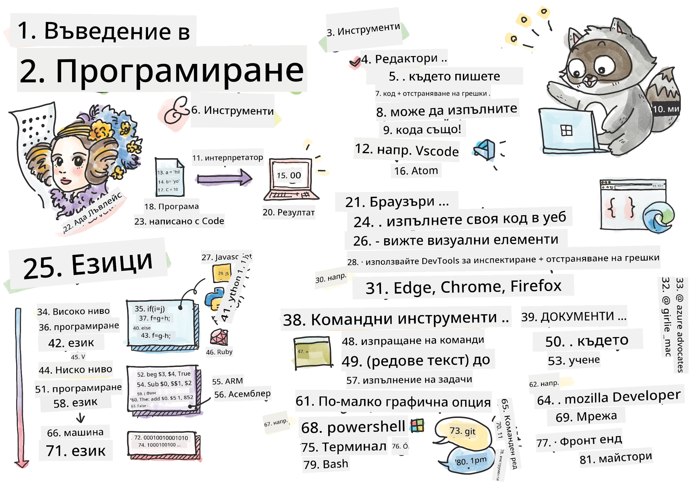
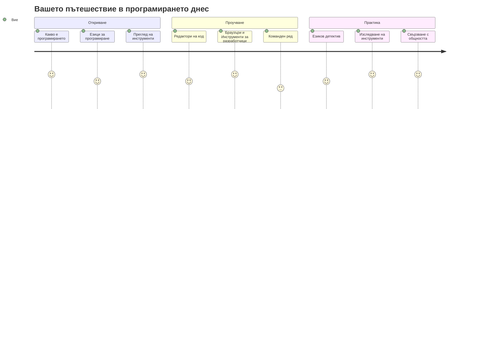
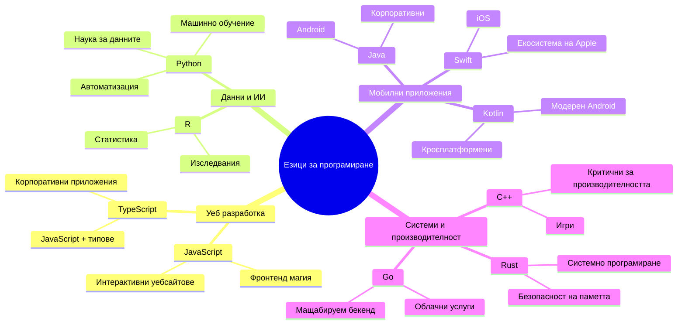
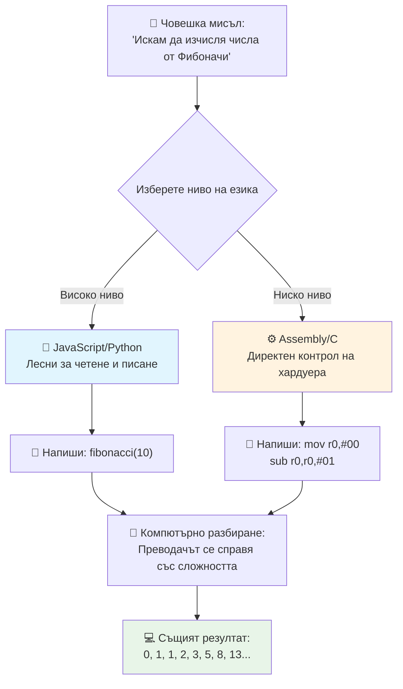
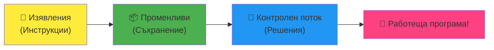
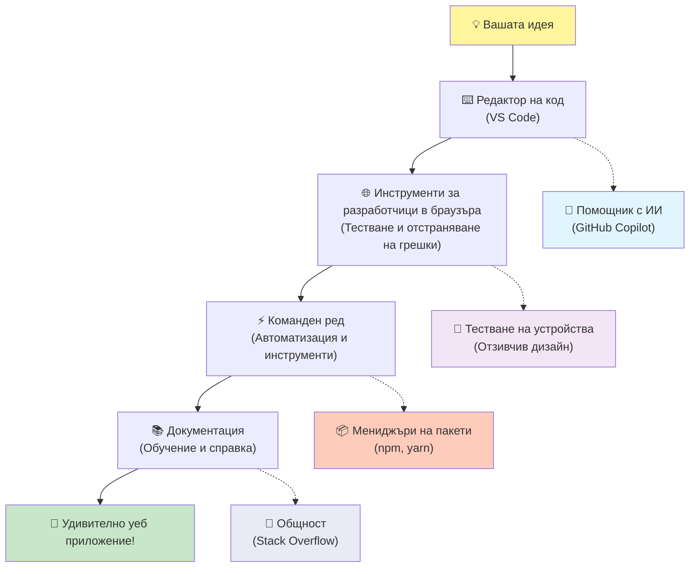
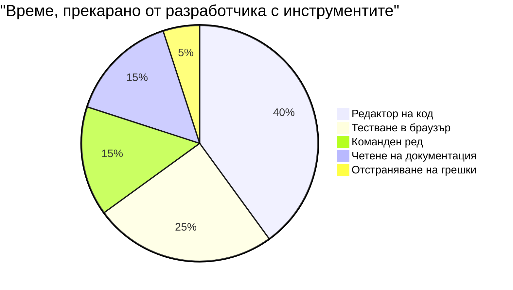
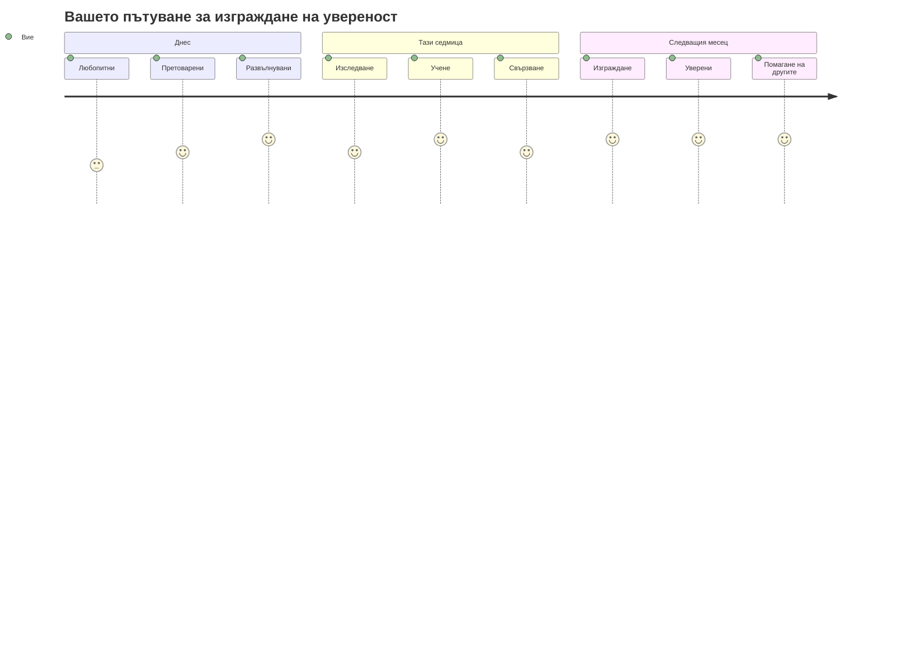

# Въведение в програмните езици и съвременните инструменти за разработчици
 
Здравей, бъдещ разработчик! 👋 Мога ли да ти кажа нещо, което всеки ден продължава да ме разтърсва? Ти си на път да откриеш, че програмирането не е просто за компютри – то е като истински суперсили, с които да превърнеш най-щурите си идеи в реалност!

Знаеш онзи момент, когато използваш любимото си приложение и всичко просто се случва перфектно? Когато натиснеш бутон и се случва нещо абсолютно магическо, което те кара да кажеш "уау, как го НАПРАВИХА това?" Е, някой точно като теб – вероятно седнал в любимото си кафене в 2 сутринта с трето еспресо – е написал кода, който създаде тази магия. И ето кое ще ти взриви ума: до края на този урок не само ще разбереш как са го направили, но ще умреш да опиташ сам/а!

Разбира се, напълно разбирам ако програмирането ти се струва плашещо в момента. Когато аз започнах, честно мислех, че трябва да си някакъв гений по математика или да кодирам от петгодишен. Но ето какво напълно промени гледната ми точка: програмирането е точно като да учиш да водиш разговори на нов език. Започваш с "здравей" и "благодаря", после преминаваш към поръчване на кафе и преди да се усетиш вече водиш дълбоки философски дискусии! Само че в този случай разговаряш с компютри и честно казано? Те са най-търпеливите събеседници, които можеш да имаш – никога не осъждат грешките ти и винаги са готови да опитат отново!

Днес ще разгледаме невероятните инструменти, които правят съвременната уеб разработка не само възможна, но и наистина пристрастяваща. Говоря за същите редактори, браузъри и работни потоци, които разработчиците в Netflix, Spotify и любимото ти инди студио използват всеки ден. И ето частта, която ще те накара да направиш щастлив танц: повечето от тези професионални, индустриално-стандартни инструменти са напълно безплатни!


> Скетчно (sketchnote) от [Tomomi Imura](https://twitter.com/girlie_mac)


```mermaid
journey
    title Вашето пътешествие в програмирането днес
    section Откриване
      Какво е програмирането: 5: Вие
      Езици за програмиране: 4: Вие
      Преглед на инструменти: 5: Вие
    section Проучване
      Редактори на код: 4: Вие
      Браузъри и Инструменти за разработчици: 5: Вие
      Команден ред: 3: Вие
    section Практика
      Езиков детектив: 4: Вие
      Изследване на инструменти: 5: Вие
      Свързване с общността: 5: Вие
```
## Да видим какво вече знаеш!

Преди да се потопим в забавните неща, любопитно ми е – какво вече знаеш за този програмен свят? И слушай, ако гледаш тези въпроси и мислиш "буквално нямам никаква представа за нищо от това," това не е само окей, това е перфектно! Това означава, че си точно на правилното място. Помисли за този тест като за разтягане преди тренировка – просто загряваме тези мозъчни мускули!

[Направи предварителния тест](https://ff-quizzes.netlify.app/web/)


## Приключението, което ще изживеем заедно

Окей, наистина се тръскам от вълнение за това, което ще разгледаме днес! Сериозно, искам да видя лицето ти, когато някои от тези концепции щракнат. Ето невероятното пътуване, което предприемаме заедно:

- **Какво всъщност е програмирането (и защо е най-якото нещо на света!)** – Ще открием как кодът е буквално невидимата магия, която захранва всичко около теб, от оналния алармен часовник, който някак знае, че е понеделник сутрин, до алгоритъма, който перфектно курира твоите Netflix препоръки
- **Програмните езици и техните удивителни личности** – Представи си, че влизаш на парти, където всеки човек има напълно различни суперсили и начини за решаване на проблеми. Такъв е светът на програмните езици и ти ще се влюбиш в срещата с тях!
- **Основните градивни елементи, които правят цифровата магия възможна** – Мисли за тях като за върховния креативен комплект LEGO. След като разбереш как тези части се подреждат, ще осъзнаеш, че буквално можеш да построиш всичко, което въображението ти желае
- **Професионални инструменти, които ще те накарат да се почувстваш сякаш току-що са ти дали вълшебна пръчка** – Не преувеличавам – тези инструменти наистина ще те накарат да се почувстваш като супергерой, а най-хубавото? Това са същите, които използват професионалистите!

> 💡 **Ето какво е важно**: Не мисли дори да се опитваш да запомниш всичко днес! В момента искам просто да почувстваш този искрен пламък на вълнение за това, което е възможно. Детайлите ще се закрепят естествено, докато практикуваме заедно – така става истинското учене!

> Можеш да вземеш този урок на [Microsoft Learn](https://learn.microsoft.com/en-us/learn/modules/web-development-101/introduction-programming/?WT.mc_id=academic-77807-sagibbon)!

## И така, какво точно е *програмирането*?

Добре, нека да се заемем с въпроса за милион долара: какво всъщност е програмирането?

Ще ти разкажа една история, която напълно промени начина, по който мисля за това. Миналата седмица се опитвах да обясня на майка ми как да използва новото дистанционно за смарт телевизора. Хванах се да казвам неща като "Натисни червения бутон, но не големия червен бутон, малкия червен бутон отляво... не, другото ти ляво... ок, сега го задръж за две секунди, не за една, не за три..." Звучи познато? 😅

Това е програмирането! Това е изкуството да даваш невероятно детайлни, стъпка по стъпка инструкции на нещо, което е много мощно, но има нужда всичко да бъде изписано перфектно. Само че вместо да обясняваш на майка си (която може да попита "кой червен бутон?!"), обясняваш на компютър (който просто прави точно това, което кажеш, дори и да не е точно това, което си имал предвид).

Ето какво ме порази, когато за първи път научих това: компютрите всъщност са доста прости в своята същност. Те буквално разбират само две неща – 1 и 0, което е основно "да" и "не" или "включено" и "изключено". Това е всичко! Но ето къде става магично – не се налага да говорим на 1 и 0 като в Матрицата. Тук на помощ идват **програмните езици**. Те са като най-добрия преводач в света, който превръща нормалните човешки мисли в езика на компютъра.

И ето какво все още ме разтърсва всяка сутрин, когато се събудя: буквално *всичко* цифрово в живота ти е започнало с някой точно като теб, вероятно в пижама с чаша кафе, който пише код на лаптопа си. Този филтър в Instagram, който те кара да изглеждаш перфектно? Някой го е кодирал. Препоръката, която те доведе до новата ти любима песен? Разработчик е създал този алгоритъм. Приложението, което ти помага да разделиш сметката за вечерята с приятели? Да, някой си помисли "това е досадно, сигурно мога да го оправя" и после... го направи!

Когато се научиш да програмираш, не просто усвояваш ново умение – ти ставаш част от тази невероятна общност от решаващи проблеми хора, които прекарват дните си, мислейки "Ами ако мога да създам нещо, което да направи деня на някого малко по-добър?" Честно, има ли нещо по-готино от това?

✅ **Лов на интересни факти**: Ето нещо супер готино, което можеш да потърсиш, когато имаш свободен момент – кой мислиш, че е бил първият компютърен програмист в света? Ще ти дам подсказка: може би не е този, когото очакваш! Историята зад тази личност е абсолютно завладяваща и показва, че програмирането винаги е било за креативно решаване на проблеми и мислене извън стандартните рамки.

### 🧠 **Време за проверка: Как се чувстваш?**

**Отдели момент, за да помислиш:**
- Има ли смисъл за теб идеята за "даване на инструкции на компютри" сега?
- Можеш ли да се сетиш за ежедневна задача, която би искал/а да автоматизираш чрез програмиране?
- Какви въпроси ти клокочат в ума относно цялото това програмиране?

> **Не забравяй**: Напълно е нормално някои концепции да изглеждат размазани в момента. Ученето на програмиране е като учене на нов език – отнема време, докато мозъкът ти изгради тези невронни пътеки. Вършиш страхотна работа!

## Програмените езици са като различни видове магия

Окей, звучи странно, но остани с мен – програмните езици са много като различните видове музика. Помисли: имаш джаз, който е плавен и импровизационен, рок, който е мощен и директен, класическа музика, която е елегантна и структурирана, и хип-хоп, който е креативен и изразителен. Всеки стил има своя вибрация, своя общност от страстни фенове и всеки е идеален за различни настроения и поводи.

Програмните езици работят по абсолютно същия начин! Не би използвал/а същия език, за да направиш забавна мобилна игра, който би използвал/а, за да обработваш огромни обеми климатични данни, точно както не би пускал/а дет-метъл на урок по йога (ех, в повечето йога класове все пак! 😄).

Но ето кое ме поразява всеки път, когато мисля за това: тези езици са като най-търпеливия, бляскав преводач в света, седящ до теб. Можеш да изразиш идеите си по начин, който е естествен за човешкия ти мозък, а те вършат цялата изключително сложна работа да го превърнат в 1 и 0, на които компютрите всъщност говорят. Това е като да имаш приятел, който е перфектно владеещ и "човешкото творчество", и "компютърната логика" – и никога не се уморява, никога не пие кафе за пауза и никога не те съди, ако попиташ едно и също нещо два пъти!

### Популярни програмни езици и техните приложения


```mermaid
mindmap
  root((Езици за програмиране))
    Уеб разработка
      JavaScript
        Фронтенд магия
        Интерактивни уебсайтове
      TypeScript
        JavaScript + типове
        Корпоративни приложения
    Данни и ИИ
      Python
        Наука за данните
        Машинно обучение
        Автоматизация
      R
        Статистика
        Изследвания
    Мобилни приложения
      Java
        Android
        Корпоративни
      Swift
        iOS
        Екосистема на Apple
      Kotlin
        Модерен Android
        Кросплатформени
    Системи и производителност
      C++
        Игри
        Критични за производителността
      Rust
        Безопасност на паметта
        Системно програмиране
      Go
        Облачни услуги
        Мащабируем бекенд
```
| Език | Най-подходящ за | Защо е популярен |
|----------|----------|------------------|
| **JavaScript** | Уеб разработка, потребителски интерфейси | Работи в браузъри и захранва интерактивни уебсайтове |
| **Python** | Наука за данни, автоматизация, ИИ | Лесен за четене и изучаване, мощни библиотеки |
| **Java** | Корпоративни приложения, Android приложения | Независим от платформа, стабилен за големи системи |
| **C#** | Windows приложения, разработка на игри | Силна поддръжка в екосистемата на Microsoft |
| **Go** | Облачни услуги, бекенд системи | Бърз, прост, проектиран за съвременни изчисления |

### Езици от високо ниво срещу ниско ниво

Окей, това беше наистина концепцията, която ми "счупи" мозъка, когато за първи път започнах да уча, затова ще споделя аналогията, която най-накрая ме накарала да разбера – и наистина се надявам да ти помогне и на теб!

Представи си, че посещаваш страна, където не говориш езика, и отчаяно трябва да намериш най-близката тоалетна (всички сме били там, нали? 😅):

- **Ниско ниво програмиране** е като да научиш местния диалект толкова добре, че да можеш да говориш с бабата, която продава плодове на ъгъла, използвайки културни препратки, местни жаргонни изрази и вътрешни шеги, които разбира само този, който е израснал там. Много впечатляващо и изключително ефективно... ако случайно си флуентен! Но доста объркващо, когато просто се опитваш да намериш тоалетна.

- **Високо ниво програмиране** е като да имаш този удивителен местен приятел, който просто те разбира. Можеш да кажеш "Наистина трябва да намеря тоалетна" на обикновен език, а той да се погрижи за цялата културна преводна работа и да ти даде упътвания, които имат смисъл за неместния ти мозък.

В програмни термини:
- **Езици от ниско ниво** (като Assembly или C) ти позволяват да водиш невероятно детайлни разговори с действителния хардуер на компютъра, но трябва да мислиш като машина, което е... добре, нека кажем, че е голяма ментална промяна!
- **Езици от високо ниво** (като JavaScript, Python или C#) ти позволяват да мислиш като човек, докато те се грижат за целия "машинен" говор зад кулисите. Освен това имат невероятно гостоприемни общности, пълни с хора, които помнят какво е да си нов и искрено искат да помогнат!

Познае ли кои ще ти предложа да започнеш с? 😉 Езиците от високо ниво са като детски уоки, които никога всъщност няма да искаш да свалиш, защото правят цялото преживяване много по-приятно!


```mermaid
flowchart TB
    A["👤 Човешка мисъл:<br/>'Искам да изчисля числа от Фибоначи'"] --> B{Изберете ниво на езика}
    
    B -->|Високо ниво| C["🌟 JavaScript/Python<br/>Лесни за четене и писане"]
    B -->|Ниско ниво| D["⚙️ Assembly/C<br/>Директен контрол на хардуера"]
    
    C --> E["📝 Напиши: fibonacci(10)"]
    D --> F["📝 Напиши: mov r0,#00<br/>sub r0,r0,#01"]
    
    E --> G["🤖 Компютърно разбиране:<br/>Преводачът се справя със сложността"]
    F --> G
    
    G --> H["💻 Същият резултат:<br/>0, 1, 1, 2, 3, 5, 8, 13..."]
    
    style C fill:#e1f5fe
    style D fill:#fff3e0
    style H fill:#e8f5e8
```
### Нека ти покажа защо езиците от високо ниво са толкова по-дружелюбни

Добре, ще ти покажа нещо, което перфектно демонстрира защо се влюбих в езиците от високо ниво, но първо – трябва да ми обещаеш нещо. Когато видиш първия пример с код, не изпадай в паника! Той трябва да изглежда заплашителен. Това е точно точката, която правя!

Ще разгледаме една и съща задача, написана в два напълно различни стила. И двете създават това, което се нарича последователност на Фибоначи – това е красив математически модел, където всяко число е сумата от предишните две: 0, 1, 1, 2, 3, 5, 8, 13... (Забавен факт: ще откриеш този модел буквално навсякъде в природата – спиралите на семената на слънчогледа, моделите на шишарки, дори начина, по който се формират галактиките!)

Готов/а ли си да видиш разликата? Хайде!

**Език от високо ниво (JavaScript) – удобен за хората:**

```javascript
// Стъпка 1: Основна настройка на Фибоначи
const fibonacciCount = 10;
let current = 0;
let next = 1;

console.log('Fibonacci sequence:');
```

**Какво прави този код:**
- **Декларирай** константа, за да укажеш колко числа от Фибоначи искаме да генерираме
- **Инициализирай** две променливи, за да следиш текущото и следващото число в последователността
- **Задай** началните стойности (0 и 1), които определят модела на Фибоначи
- **Покажи** заглавно съобщение, за да идентифицираш нашия изход

```javascript
// Стъпка 2: Генерирайте последователността с цикъл
for (let i = 0; i < fibonacciCount; i++) {
  console.log(`Position ${i + 1}: ${current}`);
  
  // Изчислете следващото число в последователността
  const sum = current + next;
  current = next;
  next = sum;
}
```

**Разбивка на това, което се случва тук:**
- **Итерирай** през всяка позиция в последователността ни, използвайки `for` цикъл
- **Покажи** всяко число с неговата позиция, използвайки форматиране с шаблонни литерали
- **Изчисли** следващото число от Фибоначи, като добавиш текущата и следващата стойност
- **Обнови** нашите променливи за проследяване, за да преминеш към следващата итерация

```javascript
// Стъпка 3: Модерен функционален подход
const generateFibonacci = (count) => {
  const sequence = [0, 1];
  
  for (let i = 2; i < count; i++) {
    sequence[i] = sequence[i - 1] + sequence[i - 2];
  }
  
  return sequence;
};

// Пример за употреба
const fibSequence = generateFibonacci(10);
console.log(fibSequence);
```

**В горното, ние:**
- **Създадохме** многократно използваща се функция, използвайки съвременния синтаксис със стрелкови функции
- **Създадохме** масив, за да съхраним пълната последователност вместо да я показваме поединично
- **Използвахме** индексиране на масива, за да изчислим всяко ново число от предишните стойности
- **Върнахме** пълната последователност за гъвкаво използване в други части на програмата ни

**Език от ниско ниво (ARM Assembly) – удобен за компютъра:**

```assembly
 area ascen,code,readonly
 entry
 code32
 adr r0,thumb+1
 bx r0
 code16
thumb
 mov r0,#00
 sub r0,r0,#01
 mov r1,#01
 mov r4,#10
 ldr r2,=0x40000000
back add r0,r1
 str r0,[r2]
 add r2,#04
 mov r3,r0
 mov r0,r1
 mov r1,r3
 sub r4,#01
 cmp r4,#00
 bne back
 end
```

Забележи как JavaScript версията чете почти като инструкции на английски, докато Assembly версията използва криптични команди, които директно контролират процесора на компютъра. И двете изпълняват точно същата задача, но езикът от високо ниво е много по-лесен за хората да го разберат, да го пишат и да го поддържат.

**Ключовите разлики, които ще забележиш:**
- **Четивност**: JavaScript използва описателни имена като `fibonacciCount`, докато Assembly използва криптични етикети като `r0`, `r1`
- **Коментари**: Езици от високо ниво насърчават пояснителни коментари, които правят кода самодокументиращ се
- **Структура**: Логичният поток на JavaScript съответства на начина, по който хората мислят за проблемите стъпка по стъпка
- **Поддръжка**: Актуализирането на версията на JavaScript за различни изисквания е просто и ясно

✅ **За редицата на Фибоначи**: Този абсолютно великолепен числов модел (където всяко число е равно на сумата от предходните две: 0, 1, 1, 2, 3, 5, 8...) се появява буквално *навсякъде* в природата! Ще го намерите в спиралите на слънчогледите, в шарките на шишарките, в извивките на черупките на наутилуса и дори в начина, по който клоните на дърветата растат. Доста е поразително как математиката и кодът могат да ни помогнат да разберем и пресъздадем моделите, които природата използва, за да създава красота!


## Строителните блокове, които създават магията

Добре, сега след като видя как програмиращите езици изглеждат в действие, нека разглобим основните части, които формират буквално всяка програма, написана някога. Помисли за тях като за съществените съставки в рецептата ти за любимото ястие – след като разбереш какво прави всяка от тях, ще можеш да четеш и пишеш код почти на всеки език!

Това е нещо като да учиш граматиката на програмирането. Спомняш ли си в училище, когато учеше за съществителни, глаголи и как да подреждаш изречения? Програмирането има своя версия на граматиката и честно казано, тя е много по-логична и по-щедра от английската граматика някога беше! 😄

### Изявления: Инструкции стъпка по стъпка

Нека започнем със **statements** – те са като отделни изречения в разговор с компютъра ти. Всяко изявление казва на компютъра да направи едно конкретно нещо, нещо сякаш даваш указания: "Завий наляв тук," "Спри на червеното," "Паркирай на това място."

Това, което обичам в изявленията, е колко четливи обикновено са. Виж това:

```javascript
// Основни инструкции, които изпълняват отделни действия
const userName = "Alex";                    
console.log("Hello, world!");              
const sum = 5 + 3;                         
```

**Ето какво прави този код:**
- **Декларира** постоянна променлива за съхраняване на името на потребителя
- **Показва** приветствено съобщение в конзолата
- **Изчислява** и съхранява резултата от математическа операция

```javascript
// Инструкции, които взаимодействат с уеб страници
document.title = "My Awesome Website";      
document.body.style.backgroundColor = "lightblue";
```

**Стъпка по стъпка, ето какво се случва:**
- **Променя** заглавието на уеб страницата, което се показва в таба на браузъра
- **Променя** цвета на фона на цялото тяло на страницата

### Променливи: Системата за памет на програмата ти

Окей, **variables** честно казано са една от абсолютните ми любими концепции за преподаване, защото са толкова подобни на неща, които вече използваш всеки ден!

Помисли за момент за списъка с контакти в телефона си. Не запаметяваш всеки номер – вместо това записваш "Мама", "Най-добър приятел" или "Пицария, която доставя до 2 ч." и оставяш телефона да запомни реалните номера. Променливите работят по абсолютно същия начин! Те са като етикетирани контейнери, където програмата ти може да съхранява информация и после да я извлича чрез име, което наистина има смисъл.

Ето кое е наистина готино: променливите могат да се променят, докато програмата работи (оттук и името "променлива" – виж какво направиха там?). Точно както може да актуализираш контакта на пицарията, когато намериш по-добро място, променливите могат да се актуализират, докато програмата научава нова информация или когато обстоятелствата се променят!

Нека ти покажа колко красиво просто може да бъде това:

```javascript
// Стъпка 1: Създаване на основни променливи
const siteName = "Weather Dashboard";        
let currentWeather = "sunny";               
let temperature = 75;                       
let isRaining = false;                      
```

**Разбиране на тези концепции:**
- **Съхранявай** неизменни стойности в `const` променливи (като име на сайт)
- **Използвай** `let` за стойности, които могат да се променят по време на изпълнение
- **Присвоявай** различни типове данни: низове (текст), числа и булеви стойности (`true`/`false`)
- **Избирай** описателни имена, които обясняват какво съдържа всяка променлива

```javascript
// Стъпка 2: Работа с обекти за групиране на свързани данни
const weatherData = {                       
  location: "San Francisco",
  humidity: 65,
  windSpeed: 12
};
```

**В горното, ние:**
- **Създадохме** обект за групиране на свързана метеорологична информация
- **Организирахме** множество данни под едно име на променлива
- **Използвахме** двойки ключ-стойност, за да етикетираме ясно всяка част от информацията

```javascript
// Стъпка 3: Използване и актуализиране на променливи
console.log(`${siteName}: Today is ${currentWeather} and ${temperature}°F`);
console.log(`Wind speed: ${weatherData.windSpeed} mph`);

// Актуализиране на изменяеми променливи
currentWeather = "cloudy";                  
temperature = 68;                          
```

**Нека разберем всяка част:**
- **Показвай** информация, използвайки шаблонни низове с `${}` синтаксис
- **Достъпвай** свойствата на обектите с точкова нотация (`weatherData.windSpeed`)
- **Актуализирай** променливи декларирани с `let`, за да отразяват променящи се условия
- **Комбинирай** няколко променливи, за да създадеш смислени съобщения

```javascript
// Стъпка 4: Съвременно деструктуриране за по-чист код
const { location, humidity } = weatherData; 
console.log(`${location} humidity: ${humidity}%`);
```

**Какво трябва да знаеш:**
- **Извличай** конкретни свойства от обектите с destructuring присвояване
- **Създавай** нови променливи автоматично със същите имена като ключовете на обекта
- **Оптимизирай** кода, като избягваш повтаряща се точкова нотация

### Контролен поток: Да научиш програмата си да мисли

Окей, тук програмирането става абсолютно умопомрачително! **Control flow** всъщност е да научиш програмата как да взема умни решения, точно като теб, които правиш всеки ден без да мислиш особено.

Представи си това: тази сутрин вероятно премина през нещо като "Ако вали, ще взема чадър. Ако е студено, ще сложа яке. Ако закъснявам, ще пропусна закуската и ще взема кафе по пътя." Твоят мозък естествено следва тази if-then логика десетки пъти всеки ден!

Това е, което кара програмите да изглеждат интелигентни и живи, вместо да следват някакъв скучен, предсказуем скрипт. Те всъщност могат да погледнат дадена ситуация, да оценят какво се случва и да реагират подходящо. Това е като да дадеш на програмата си мозък, който може да се адаптира и да прави избори!

Искаш ли да видиш колко красиво това работи? Нека ти покажа:

```javascript
// Стъпка 1: Основна условна логика
const userAge = 17;

if (userAge >= 18) {
  console.log("You can vote!");
} else {
  const yearsToWait = 18 - userAge;
  console.log(`You'll be able to vote in ${yearsToWait} year(s).`);
}
```

**Ето какво прави този код:**
- **Проверява** дали възрастта на потребителя отговаря на изискването за гласуване
- **Изпълнява** различни блокове код въз основа на резултата от условието
- **Изчислява** и показва колко време остава до навършване на правото за гласуване, ако е под 18
- **Предоставя** конкретна, полезна обратна връзка за всеки сценарий

```javascript
// Стъпка 2: Няколко условия с логически оператори
const userAge = 17;
const hasPermission = true;

if (userAge >= 18 && hasPermission) {
  console.log("Access granted: You can enter the venue.");
} else if (userAge >= 16) {
  console.log("You need parent permission to enter.");
} else {
  console.log("Sorry, you must be at least 16 years old.");
}
```

**Разбивка на случващото се тук:**
- **Комбинира** няколко условия с оператора `&&` (и)
- **Създава** йерархия от условия с `else if` за множество сценарии
- **Обработва** всички възможни случаи с финален `else` оператор
- **Предоставя** ясна, приложима обратна връзка за всеки различен случай

```javascript
// Стъпка 3: Кратък условен израз с тернарен оператор
const votingStatus = userAge >= 18 ? "Can vote" : "Cannot vote yet";
console.log(`Status: ${votingStatus}`);
```

**Какво трябва да запомниш:**
- **Използвай** тернарния оператор (`? :`) за прости двоични условия
- **Пиши** условието първо, следвано от `?`, след това резултата при true, после `:`, после резултата при false
- **Приложи** този шаблон, когато трябва да присвояваш стойности въз основа на условия

```javascript
// Стъпка 4: Обработка на няколко конкретни случая
const dayOfWeek = "Tuesday";

switch (dayOfWeek) {
  case "Monday":
  case "Tuesday":
  case "Wednesday":
  case "Thursday":
  case "Friday":
    console.log("It's a weekday - time to work!");
    break;
  case "Saturday":
  case "Sunday":
    console.log("It's the weekend - time to relax!");
    break;
  default:
    console.log("Invalid day of the week");
}
```

**Този код постига следното:**
- **Сравнява** стойността на променлива с множество конкретни случаи
- **Групира** подобни случаи заедно (работни дни срещу уикенди)
- **Изпълнява** подходящия блок код при намерено съвпадение
- **Включва** `default` случай за обработка на неочаквани стойности
- **Използва** `break` оператори, за да предотврати продължаване към следващия case

> 💡 **Аналогия от реалния живот**: Помисли за контролния поток като за най-търпеливата GPS система в света, която ти дава указания. Може да каже "Ако има задръстване по Main Street, хванете магистралата. Ако магистралата е блокирана заради строеж, опитайте панорамния маршрут." Програмите използват точно същия вид условна логика, за да реагират интелигентно на различни ситуации и винаги да предоставят на потребителите най-доброто възможно преживяване.

### 🎯 **Проверка на концепциите: Майсторство на строителните блокове**

**Нека видим как се справяш с основите:**
- Можеш ли да обясниш разликата между променлива и изявление със собствени думи?
- Помисли за реален пример, в който би използвал if-then решение (като нашия пример с гласуването)
- Кое е едно нещо за логиката на програмирането, което те изненада?

**Бърз стимул за увереност:**

```mermaid
flowchart LR
    A["📝 Изявления<br/>(Инструкции)"] --> B["📦 Променливи<br/>(Съхранение)"] --> C["🔀 Контролен поток<br/>(Решения)"] --> D["🎉 Работеща програма!"]
    
    style A fill:#ffeb3b
    style B fill:#4caf50
    style C fill:#2196f3
    style D fill:#ff4081
```
✅ **Какво предстои**: Ще се забавляваме невероятно, като навлизаме по-дълбоко в тези концепции, докато продължаваме това невероятно пътешествие заедно! В момента просто се фокусирай върху това да усетиш вълнението за всички невероятни възможности пред теб. Конкретните умения и техники ще се залепят естествено, докато практикуваме заедно – обещавам, че това ще бъде много по-забавно, отколкото може да очакваш!

## Инструменти на занаята

Добре, тук честно казано започвам да се вълнувам толкова, че едва мога да се сдържа! 🚀 Ще говорим за невероятните инструменти, които ще те накарат да се почувстваш сякаш току-що са ти дали ключовете за цифрова космическа ракета.

Знаеш как един готвач има онези перфектно балансирани ножове, които сякаш са продължение на ръцете му? Или как един музикант има китара, която сякаш запява в момента, в който я докосне? Е, разработчиците имаме своя версия на тези магически инструменти, и ето какво ще ти взриви ума – повечето от тях са напълно безплатни!

Почти подскачам на стола, мислейки да ги споделя с теб, защото те напълно революционираха начина, по който изграждаме софтуер. Говорим за AI-подпомагани кодиращи асистенти, които могат да помогнат при писането на код (аз не се шегувам!), облачни среди, в които можеш да изграждаш цели приложения от буквално навсякъде с Wi‑Fi, и инструменти за отстраняване на грешки толкова сложни, че са като да имаш рентгеново зрение за програмите си.

И ето частта, която все още ме побива: това не са „инструменти за начинаещи“, които ще надраснеш. Това са същите професионални инструменти, които разработчиците в Google, Netflix и това независимо студио за приложения, което обичаш, използват точно в този момент. Ще се почувстваш като истински професионалист, когато ги използваш!


```mermaid
graph TD
    A["💡 Вашата идея"] --> B["⌨️ Редактор на код<br/>(VS Code)"] 
    B --> C["🌐 Инструменти за разработчици в браузъра<br/>(Тестване и отстраняване на грешки)"]
    C --> D["⚡ Команден ред<br/>(Автоматизация и инструменти)"]
    D --> E["📚 Документация<br/>(Обучение и справка)"]
    E --> F["🚀 Удивително уеб приложение!"]
    
    B -.-> G["🤖 Помощник с ИИ<br/>(GitHub Copilot)"]
    C -.-> H["📱 Тестване на устройства<br/>(Отзивчив дизайн)"]
    D -.-> I["📦 Мениджъри на пакети<br/>(npm, yarn)"]
    E -.-> J["👥 Общност<br/>(Stack Overflow)"]
    
    style A fill:#fff59d
    style F fill:#c8e6c9
    style G fill:#e1f5fe
    style H fill:#f3e5f5
    style I fill:#ffccbc
    style J fill:#e8eaf6
```
### Редактори за код и IDE-та: Новите ти дигитални най-добри приятели

Нека поговорим за редакторите за код – те наистина ще станат новите ти любими места за прекарване на време! Помисли за тях като за личното си кодиращо светилище, където ще прекарваш повечето време в създаване и усъвършенстване на цифровите си творения.

Но ето кое е абсолютно магично при модерните редактори: те не са просто фини текстови редактори. Те са като да имаш най-блестящия, подкрепящ код ментор до себе си 24/7. Те улавят печатните ти грешки преди да ги забележиш, предлагат подобрения, които те карат да изглеждаш като гений, помагат ти да разбереш какво прави всеки фрагмент от кода и някои от тях дори могат да предскажат какво ще напишеш и да предложат да завършат мислите ти!

Спомням си кога за първи път открих автодовършването – буквално се почувствах, че живея в бъдещето. Започваш да пишеш нещо и редакторът казва: "Хей, мислеше ли за тази функция, която прави точно това, от което имаш нужда?" Това е като да имаш четящ мисли код приятел!

**Какво прави тези редактори толкова невероятни?**

Модерните редактори предлагат впечатляващ набор от функции, проектирани да подобрят продуктивността ти:

| Функция | Какво прави | Защо помага |
|---------|--------------|--------------|
| **Подчертаване на синтаксиса** | Оцветява различни части от кода ти | Прави кода по-лесен за четене и за откриване на грешки |
| **Автодовършване** | Предлага код, докато пишеш | Ускорява писането на код и намалява печатните грешки |
| **Инструменти за отстраняване на грешки** | Помага ти да откриеш и поправиш грешки | Пести часове в търсене и отстраняване на проблеми |
| **Разширения** | Добавят специализирани функции | Персонализираш редактора за всяка технология |
| **AI асистенти** | Предлагат код и обяснения | Ускоряват ученето и продуктивността |

> 🎥 **Видео ресурс**: Искаш ли да видиш тези инструменти в действие? Гледай това [Tools of the Trade video](https://youtube.com/watch?v=69WJeXGBdxg) за изчерпателен преглед.

#### Препоръчани редактори за уеб разработка

**[Visual Studio Code](https://code.visualstudio.com/?WT.mc_id=academic-77807-sagibbon)** (Безплатен)
- Най-популярен сред уеб разработчиците
- Отлична екосистема от разширения
- Вграден терминал и интеграция с Git
- **Задължителни разширения**:
  - [GitHub Copilot](https://marketplace.visualstudio.com/items?itemName=GitHub.copilot) - AI-подпомагани предложения за код
  - [Live Share](https://marketplace.visualstudio.com/items?itemName=MS-vsliveshare.vsliveshare) - Сътрудничество в реално време
  - [Prettier](https://marketplace.visualstudio.com/items?itemName=esbenp.prettier-vscode) - Автоматично форматиране на кода
  - [Code Spell Checker](https://marketplace.visualstudio.com/items?itemName=streetsidesoftware.code-spell-checker) - Засича печатни грешки в кода ти

**[JetBrains WebStorm](https://www.jetbrains.com/webstorm/)** (Платен, безплатен за студенти)
- Разширени инструменти за отстраняване на грешки и тестване
- Интелигентно автодовършване на кода
- Вградена система за контрол на версиите

**Облачни IDE-та** (Различни цени)
- [GitHub Codespaces](https://github.com/features/codespaces) - Пълен VS Code в браузъра ти
- [Replit](https://replit.com/) - Отличен за учене и споделяне на код
- [StackBlitz](https://stackblitz.com/) - Моментално, full-stack уеб разработване

> 💡 **Съвет за започване**: Започни с Visual Studio Code – той е безплатен, широко използван в индустрията и има огромна общност, създаваща полезни уроци и разширения.


### Уеб браузъри: Твојата тайна лаборатория за разработка

Окей, приготви се умът ти да бъде напълно взривен! Знаеш как използваш браузъри, за да скролваш в социалните мрежи и да гледаш видеа? Оказва се, че те са крили тази невероятна тайна лаборатория за разработчици през цялото време, само чакайки да я откриеш!

Всеки път, когато кликнеш с десния бутон върху уеб страница и избереш "Инспектиране на елемент" (Inspect Element), отключваш скрит свят от инструменти за разработчици, които честно казано са по-мощни от някои скъпи софтуери, за които преди съм плащал стотици долари. Това е като да откриеш, че старото ти обикновено кухненско помещение е прикривало лаборатория на професионален готвач зад таен панел!
Първия път, когато някой ми показа DevTools на браузъра, прекарах около три часа просто като кликах наоколо и казвах "ЧАКАЙ, ТО МОЖЕ И ТОВА?!" Може буквално да редактираш всеки уебсайт в реално време, да видиш точно колко бързо се зарежда всичко, да тестваш как изглежда сайтът ти на различни устройства и дори да дебъгваш JavaScript като истински професионалист. Това е абсолютно умопомрачително!

**Ето защо браузърите са твоето тайно оръжие:**

Когато създаваш уебсайт или уеб приложение, трябва да видиш как изглежда и как се държи в реалния свят. Браузърите не само показват твоята работа, но и предоставят подробна обратна връзка за производителността, достъпността и потенциални проблеми.

#### Инструменти за разработчици в браузъра (DevTools)

Съвременните браузъри включват изчерпателни комплекти за разработка:

| Категория инструмент | Какво прави | Пример за употреба |
|---------------|--------------|------------------|
| **Инспектор на елементи** | Преглеждайте и редактирайте HTML/CSS в реално време | Настройте стила, за да видите незабавни резултати |
| **Конзола** | Преглеждайте съобщения за грешки и тествайте JavaScript | Отстранявайте грешки и експериментирайте с код |
| **Монитор на мрежата** | Проследявайте как се зареждат ресурсите | Оптимизирайте производителността и времето за зареждане |
| **Проверка за достъпност** | Тествайте за инклузивен дизайн | Уверете се, че сайтът ви работи за всички потребители |
| **Симулатор на устройства** | Преглед на различни размери екрани | Тествайте адаптивния дизайн без множество устройства |

#### Препоръчани браузъри за разработка

- **[Chrome](https://developers.google.com/web/tools/chrome-devtools/)** - DevTools, които са отраслов стандарт с обширна документация
- **[Firefox](https://developer.mozilla.org/docs/Tools)** - Отлични инструменти за CSS Grid и достъпност
- **[Edge](https://docs.microsoft.com/microsoft-edge/devtools-guide-chromium/?WT.mc_id=academic-77807-sagibbon)** - Изграден на Chromium с ресурси за разработчици на Microsoft

> ⚠️ **Важен съвет за тестване**: Винаги тествайте уебсайтовете си в няколко браузъра! Това, което работи перфектно в Chrome, може да изглежда различно в Safari или Firefox. Професионалните разработчици тестват във всички основни браузъри, за да осигурят последователно потребителско преживяване.


### Инструменти на командния ред: Вашият портал към суперсили за разработчици

Добре, нека бъдем напълно честни тук относно командния ред, защото искам да го чуеш от някой, който наистина го разбира. Когато го видях за първи път – само този страшен черен екран с мигащ текст – буквално си помислих, "Не, абсолютно не! Това изглежда като нещо от хакерски филм от 80-те, и определено не съм достатъчно умен за това!" 😅

Но ето какво бих искал някой да ми беше казал тогава, и което ти казвам сега: командният ред не е страшен – всъщност е като директен разговор с компютъра ти. Представи си го като разликата между поръчването на храна чрез луксозно приложение със снимки и менюта (което е приятно и лесно) и влизането в любимия ти местен ресторант, където готвачът знае точно какво харесваш и може да приготви нещо перфектно само като кажеш "изненадвай ме с нещо невероятно."

Командният ред е мястото, където разработчиците се чувстват като абсолютни магьосници. Въвеждаш няколко привидно магически думи (добре, те са просто команди, но се чувстват магични!), натискаш enter и БААМ – създал си цяла структура на проект, инсталирал си мощни инструменти от цял свят, или разположил приложението си в интернет за милиони хора. Щом опиташ тази сила за първи път, честно казано става доста пристрастяващо!

**Защо командният ред ще стане любимият ти инструмент:**

Докато графичните интерфейси са страхотни за много задачи, командният ред превъзхожда в автоматизацията, прецизността и скоростта. Много инструменти за разработка работят предимно чрез команден ред, а научаването да ги използваш ефективно може драматично да подобри твоята продуктивност.

```bash
# Стъпка 1: Създаване и влизане в директорията на проекта
mkdir my-awesome-website
cd my-awesome-website
```

**Ето какво прави този код:**
- **Създайте** нова директория с име "my-awesome-website" за вашия проект
- **Влезте** в новосъздадената директория, за да започнете работа

```bash
# Стъпка 2: Инициализирайте проекта с package.json
npm init -y

# Инсталирайте модерни инструменти за разработка
npm install --save-dev vite prettier eslint
npm install --save-dev @eslint/js
```

**Стъпка по стъпка, ето какво се случва:**
- **Инициализирайте** нов Node.js проект с подразбирани настройки, използвайки `npm init -y`
- **Инсталирайте** Vite като модерен инструмент за сборка за бърза разработка и за продукционни сборки
- **Добавете** Prettier за автоматично форматиране на кода и ESLint за проверки на качеството на кода
- **Използвайте** флага `--save-dev`, за да маркирате тези като зависимости само за разработка

```bash
# Стъпка 3: Създайте структурата на проекта и файловете
mkdir src assets
echo '<!DOCTYPE html><html><head><title>My Site</title></head><body><h1>Hello World</h1></body></html>' > index.html

# Стартирайте сървъра за разработка
npx vite
```

**По-горе, ние:**
- **Организирахме** проекта си, като създадохме отделни папки за изходния код и ресурсите
- **Генерирахме** основен HTML файл с правилна структура на документа
- **Стартирахме** разработчическия сървър на Vite за автоматично презареждане и гореща подмяна на модули

#### Основни инструменти на командния ред за уеб разработка

| Инструмент | Цел | Защо ви е нужен |
|------|---------|-----------------|
| **[Git](https://git-scm.com/)** | Контрол на версиите | Проследявайте промените, сътрудничете си с други, архивирайте работата си |
| **[Node.js & npm](https://nodejs.org/)** | JavaScript среда за изпълнение & управление на пакети | Изпълнявайте JavaScript извън браузърите, инсталирайте модерни инструменти за разработка |
| **[Vite](https://vitejs.dev/)** | Инструмент за сборка & dev сървър | Изключително бърза разработка с гореща подмяна на модули |
| **[ESLint](https://eslint.org/)** | Качество на кода | Автоматично намиране и поправяне на проблеми в JavaScript кода ви |
| **[Prettier](https://prettier.io/)** | Форматиране на кода | Поддържайте кода си последователно форматиран и четим |

#### Опции, специфични за платформата

**Windows:**
- **[Windows Terminal](https://docs.microsoft.com/windows/terminal/?WT.mc_id=academic-77807-sagibbon)** - Модерен, функционално богат терминал
- **[PowerShell](https://docs.microsoft.com/powershell/?WT.mc_id=academic-77807-sagibbon)** 💻 - Мощна среда за скриптове
- **[Command Prompt](https://learn.microsoft.com/windows-server/administration/windows-commands/windows-commands)** 💻 - Традиционен команден ред на Windows

**macOS:**
- **[Terminal](https://support.apple.com/guide/terminal/)** 💻 - Вградено терминално приложение
- **[iTerm2](https://iterm2.com/)** - Разширен терминал с усъвършенствани функции

**Linux:**
- **[Bash](https://www.gnu.org/software/bash/)** 💻 - Стандартен shell за Linux
- **[KDE Konsole](https://docs.kde.org/trunk5/en/konsole/konsole/index.html)** - Разширен емулатор на терминал

> 💻 = Предварително инсталирано в операционната система

> 🎯 **Път за обучение**: Започнете с базови команди като `cd` (смяна на директория), `ls` или `dir` (изброяване на файлове), и `mkdir` (създаване на папка). Практикувайте с модерни команди от работния процес като `npm install`, `git status`, и `code .` (отваря текущата директория във VS Code). С напредване на комфорта ще усвоите естествено по-напреднали команди и техники за автоматизация.


### Документация: Вашият винаги-достъпен обучител

Окей, позволи ми да споделя една малка тайна, която ще те накара да се чувстваш много по-добре като начинаещ: дори най-опитните разработчици отделят голяма част от времето си за четене на документация. И това не е защото не знаят какво правят – всъщност е признак за мъдрост!

Помисли за документацията като за достъп до най-търпеливите, най-знаещите учители в света, които са на разположение 24/7. Заклещен на проблем в 2 сутринта? Документацията е там с топла виртуална прегръдка и точно отговора, който ти трябва. Искаш да научиш за някоя готина нова функция, за която всички говорят? Документацията те подкрепя със стъпка по стъпка примери. Опитваш се да разбереш защо нещо работи по определен начин? Вярно предположи – документацията е готова да го обясни по начин, който най-накрая да ти щракне!

Ето нещо, което напълно промени моята перспектива: светът на уеб разработката се движи невероятно бързо, и никой (мисля абсолютно никой!) не запомня всичко. Сблъсквал съм се със старши разработчици с над 15 години опит, които търсят базов синтаксис, и знаеш ли какво? Това не е срамно – това е умно! Не става въпрос за перфектна памет; става въпрос да знаеш къде да намериш надеждни отговори бързо и как да ги приложиш.

**Тук става истинската магия:**

Професионалните разработчици прекарват значителна част от времето си в четене на документация – не защото не знаят какво правят, а защото пейзажът на уеб разработката се развива толкова бързо, че да останеш в крак изисква непрекъснато учене. Отличната документация ти помага да разбереш не само *как* да използваш нещо, но и *защо* и *кога* да го използваш.

#### Основни ресурси за документация

**[Mozilla Developer Network (MDN)](https://developer.mozilla.org/docs/Web)**
- Златният стандарт за документация на уеб технологиите
- Изчерпателни ръководства за HTML, CSS и JavaScript
- Включва информация за съвместимост с браузъри
- Съдържа практични примери и интерактивни демота

**[Web.dev](https://web.dev)** (by Google)
- Съвременни добри практики за уеб разработка
- Ръководства за оптимизиране на производителността
- Принципи за достъпност и инклузивен дизайн
- Казуси от реални проекти

**[Microsoft Developer Documentation](https://docs.microsoft.com/microsoft-edge/#microsoft-edge-for-developers)**
- Ресурси за разработка на браузъра Edge
- Ръководства за Progressive Web App
- Информация за крос-платформена разработка

**[Frontend Masters Learning Paths](https://frontendmasters.com/learn/)**
- Структурирани учебни програми
- Видеокурсове от експерти в бранша
- Практически упражнения по кодиране

> 📚 **Стратегия за учене**: Не се опитвайте да запаметявате документацията – вместо това научете как да се ориентирате в нея ефективно. Добавяйте в отметки често използвани справки и практикувайте използването на търсачките, за да намерите конкретна информация бързо.

### 🔧 **Проверка на овладяване на инструменти: Какво ти отговаря най-много?**

**Отдели момент да помислиш:**
- Кой инструмент те вълнува най-много да пробваш първо? (Няма грешен отговор!)
- Все още ли командният ред ти се струва заплашителен или си любопитен за него?
- Можеш ли да си представиш да използваш DevTools на браузъра, за да надникнеш зад кулисите на любимите си сайтове?


```mermaid
pie title "Време, прекарано от разработчика с инструментите"
    "Редактор на код" : 40
    "Тестване в браузър" : 25
    "Команден ред" : 15
    "Четене на документация" : 15
    "Отстраняване на грешки" : 5
```
> **Забавен факт**: Повечето разработчици прекарват около 40% от времето си в редактора си за код, но забележи колко време отива за тестване, учене и решаване на проблеми. Програмирането не е само да пишеш код – то е да създаваш преживявания!

✅ **Храна за размисъл**: Ето нещо интересно за обмисляне – как мислиш, че инструментите за изграждане на уебсайтове (разработка) могат да се различават от инструментите за проектиране на видимото им (дизайн)? Това е като разликата между архитект, който проектира красива къща, и изпълнителя, който всъщност я построява. И двете са от решаващо значение, но имат нужда от различни комплекти инструменти! Такъв тип мислене ще ти помогне да видиш по-голямата картина за това как уебсайтовете оживяват.

## GitHub Copilot Agent Challenge 🚀

Използвайте Agent режима, за да завършите следното предизвикателство:

**Описание:** Разгледайте функциите на модерен редактор на код или IDE и демонстрирайте как може да подобри вашия работен поток като уеб разработчик.

**Подсказка:** Изберете редактор на код или IDE (като Visual Studio Code, WebStorm или облачен IDE). Избройте три функции или разширения, които помагат да пишете, дебъгвате или поддържате кода по-ефективно. За всяка дайте кратко обяснение как подобрява вашия работен поток.

---

## 🚀 Предизвикателство

**Добре, детективе, готов ли си за първото си дело?**

Сега, когато имаш тази страхотна основа, имам едно приключение, което ще ти помогне да видиш колко невероятно разнообразен и завладяващ е светът на програмирането. И слушай – това не е свързано с писане на код все още, така че нямай напрежение! Представи си, че си детектив на програмни езици в първото си вълнуващо разследване!

Твоята мисия, ако решиш да я приемеш:
1. **Стани изследовател на езици**: Избери три програмни езика от напълно различни светове – може би един за създаване на уебсайтове, един за създаване на мобилни приложения и един за обработка на данни за учени. Намери примери за една и съща проста задача, написана на всеки език. Обещавам, че ще се удивиш колко различно могат да изглеждат, докато правят точно същото нещо!

2. **Разкрий техните произходи**: Какво прави всеки език специален? Ето един готин факт – всеки програмен език е създаден, защото някой е мислил: "Трябва да има по-добър начин да се реши този конкретен проблем." Можеш ли да разбереш какви са били тези проблеми? Някои от тези истории са наистина завладяващи!

3. **Запознай се с общностите**: Разгледай колко приветливи и страстни са общностите на всеки език. Някои имат милиони разработчици, които споделят знания и си помагат, други са по-малки, но изключително сплотени и подкрепящи. Ще ти хареса да видиш различните личности, които тези общности имат!

4. **Следвай инстинкта си**: Кой език ти се струва най-достъпен в момента? Не се притеснявай да правиш "перфектния" избор – просто се довери на усещането си! На практика няма грешен отговор и винаги можеш да изследваш други по-късно.

**Бонус детективска работа**: Опитай да откриеш кои големи уебсайтове или приложения са изградени с всеки език. Гарантирам, че ще се шокираш да научиш какво движи Instagram, Netflix или онази мобилна игра, която не можеш да спреш да играеш!

> 💡 **Запомни**: Не се опитваш да станеш експерт в някой от тези езици днес. Просто опознаваш квартала, преди да решиш къде искаш да се установиш. Отдели време, забавлявай се и остави любопитството да те води!

## Нека отпразнуваме това, което откри!

Боже, усвоил си толкова много невероятна информация днес! Искрено се вълнувам да видя колко от това вълнуващо пътешествие ти е останало. И запомни – това не е тест, в който трябва всичко да бъде перфектно. Това е по-скоро празник на всички готини неща, които научи за този завладяващ свят, в който ще се потопиш!

[Вземете теста след урока](https://ff-quizzes.netlify.app/web/)

## Преглед и самостоятелно обучение

**Отдели си време да изследваш и да се забавляваш!**
Преминахте през много неща днес и това е нещо, с което да се гордеете! Сега идва забавната част – да изследвате темите, които събудиха вашето любопитство. Запомнете, това не е домашна работа – това е приключение!

**Изследвайте по-задълбочено това, което ви вълнува:**

**Практикувайте с програмни езици:**
- Посетете официалните уебсайтове на 2-3 езика, които привлякоха вниманието ви. Всеки има собствен характер и история!
- Опитайте някои онлайн игри за код като [CodePen](https://codepen.io/), [JSFiddle](https://jsfiddle.net/), или [Replit](https://replit.com/). Не се страхувайте да експериментирате – няма да счупите нищо!
- Прочетете за това как възникна вашият любим език. Сериозно, някои от тези истории за произхода са завладяващи и ще ви помогнат да разберете защо езиците работят по определен начин.

**Овладейте новите си инструменти:**
- Изтеглете Visual Studio Code, ако още не сте го направили – безплатен е и ще ви хареса!
- Прекарайте няколко минути в разглеждане на пазара за разширения. Това е като магазин за приложения за вашия кодов редактор!
- Отворете Developer Tools на браузъра си и просто кликнете наоколо. Не се притеснявайте да разберете всичко – просто се запознайте с това, което има.

**Присъединете се към общността:**
- Следвайте някои общности на разработчици в [Dev.to](https://dev.to/), [Stack Overflow](https://stackoverflow.com/), или [GitHub](https://github.com/). Програмистката общност е невероятно приветлива към новодошлите!
- Гледайте няколко видеа за програмиране за начинаещи в YouTube. Има толкова много страхотни създатели, които помнят какво е да започваш.
- Обмислете да се присъедините към местни срещи или онлайн общности. Повярвайте ми, разработчиците обичат да помагат на новодошлите!

> 🎯 **Слушайте, ето какво искам да запомните**: Не се очаква да станете маг на програмирането за една нощ! В момента просто опознавате този удивителен нов свят, към който ще принадлежите. Отделяйте време, наслаждавайте се на пътешествието и запомнете – всеки разработчик, който уважавате, някога е седял точно там, където сте вие в момента, изпълнен с ентусиазъм и може би малко претоварен. Това е напълно нормално и означава, че се справяте правилно!


## Assignment

[Прочетете документацията](assignment.md)

> 💡 **Малко подтикване за вашето задание**: Много бих искал да видя как изследвате инструменти, които още не сме разглеждали! Прескочете редакторите, браузърите и инструментите за команден ред, за които вече говорихме – има цяла невероятна вселена от чудесни инструменти за разработка, която чака да бъде открита. Търсете такива, които се поддържат активно и имат жизнена, полезна общност (те обикновено имат най-добрите уроци и най-подкрепящите хора, когато неизбежно останете блокирани и имате нужда от приятелска помощ).

---

## 🚀 Your Programming Journey Timeline

### ⚡ **Какво можете да направите през следващите 5 минути**
- [ ] Добавете в отметки 2–3 уебсайта на програмни езици, които привлякоха вниманието ви
- [ ] Изтеглете Visual Studio Code, ако още не сте го направили
- [ ] Отворете DevTools на браузъра си (F12) и кликнете наоколо в някой уебсайт
- [ ] Присъединете се към една програмистка общност (Dev.to, Reddit r/webdev или Stack Overflow)

### ⏰ **Какво можете да постигнете през този час**
- [ ] Завършете теста след урока и обмислете отговорите си
- [ ] Настройте VS Code с разширението GitHub Copilot
- [ ] Опитайте пример "Hello World" в 2 различни програмни езика онлайн
- [ ] Гледайте видео "Ден в живота на разработчика" в YouTube
- [ ] Започнете вашето детективско проучване на програмните езици (от предизвикателството)

### 📅 **Вашата седмична авантюра**
- [ ] Завършете заданието и изследвайте 3 нови инструмента за разработка
- [ ] Последвайте 5 разработчици или програмни акаунта в социалните мрежи
- [ ] Опитайте да създадете нещо малко в CodePen или Replit (дори само "Hello, [Your Name]!")
- [ ] Прочетете един блог пост на разработчик за нечие пътешествие в кодирането
- [ ] Присъединете се към виртуална среща или гледайте лекция за програмиране
- [ ] Започнете да учите избрания от вас език с онлайн уроци

### 🗓️ **Вашата месечна трансформация**
- [ ] Създайте първия си малък проект (дори проста уебстраница се брои!)
- [ ] Допринесете за проект с отворен код (започнете с поправки в документацията)
- [ ] Наставлявайте някого, който току-що започва своето пътешествие в програмирането
- [ ] Създайте уебсайт портфолио на разработчик
- [ ] Свържете се с местни общности от разработчици или учебни групи
- [ ] Започнете да планирате следващата си учебна цел

### 🎯 **Финална проверка и размисъл**

**Преди да продължите, отделете момент да се поздравите:**
- Кое е едно нещо за програмирането, което ви развълнува днес?
- Кой инструмент или концепция искате да изследвате първо?
- Как се чувствате относно започването на това пътешествие в програмирането?
- Какъв е един въпрос, който бихте искали да зададете на разработчик в момента?


```mermaid
journey
    title Вашето пътуване за изграждане на увереност
    section Днес
      Любопитни: 3: Вие
      Претоварени: 4: Вие
      Развълнувани: 5: Вие
    section Тази седмица
      Изследване: 4: Вие
      Учене: 5: Вие
      Свързване: 4: Вие
    section Следващия месец
      Изграждане: 5: Вие
      Уверени: 5: Вие
      Помагане на другите: 5: Вие
```
> 🌟 **Запомнете**: Всеки експерт някога е бил начинаещ. Всеки старши разработчик някога е изпитвал точно това, което чувствате вие сега – възбуден, може би малко претоварен и определено любопитен какво е възможно. Вие сте в страхотна компания и това пътешествие ще бъде невероятно. Добре дошли в прекрасния свят на програмирането! 🎉

---

<!-- CO-OP TRANSLATOR DISCLAIMER START -->
**Disclaimer**:
Този документ е преведен с помощта на AI преводаческа услуга [Co-op Translator](https://github.com/Azure/co-op-translator). Въпреки че се стремим към точност, имайте предвид, че автоматизираните преводи могат да съдържат грешки или неточности. Оригиналният документ на езика, на който е написан, трябва да се счита за авторитетен източник. За критична информация се препоръчва професионален човешки превод. Не носим отговорност за каквито и да е недоразумения или погрешни тълкувания, произтичащи от използването на този превод.
<!-- CO-OP TRANSLATOR DISCLAIMER END -->