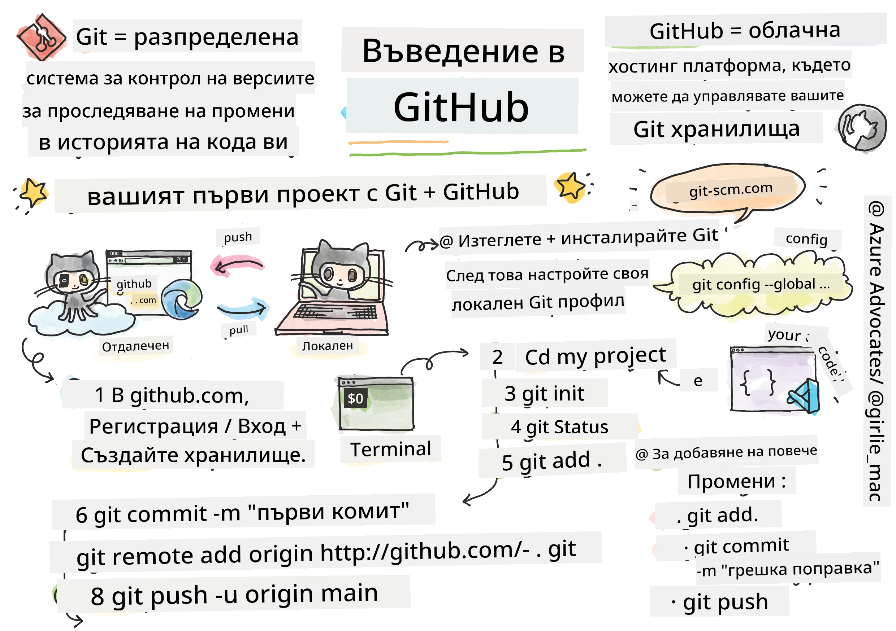
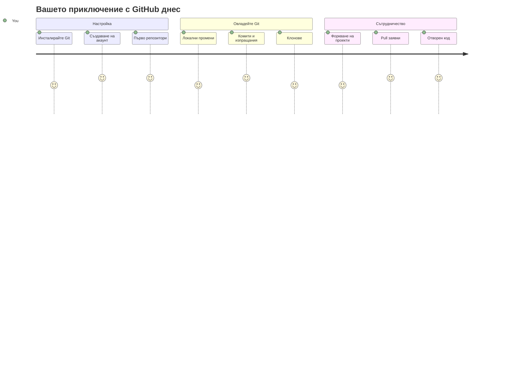
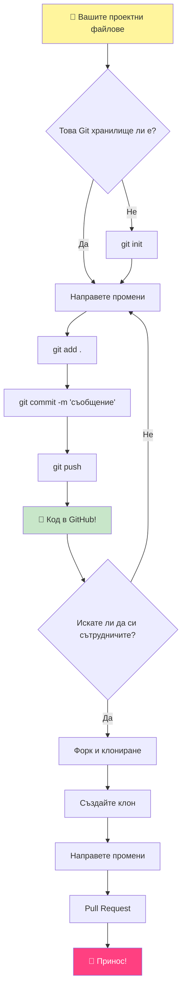
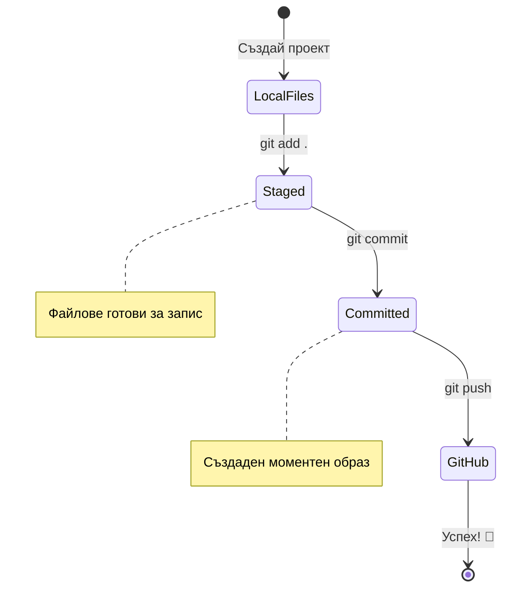
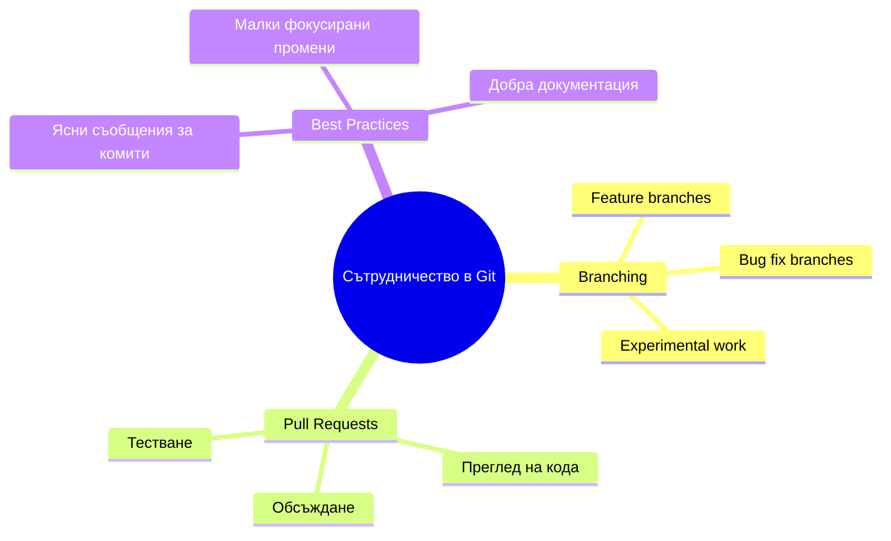
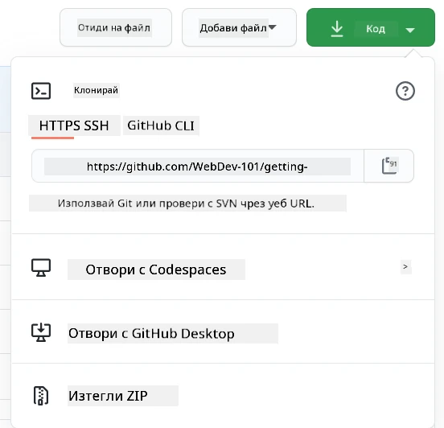
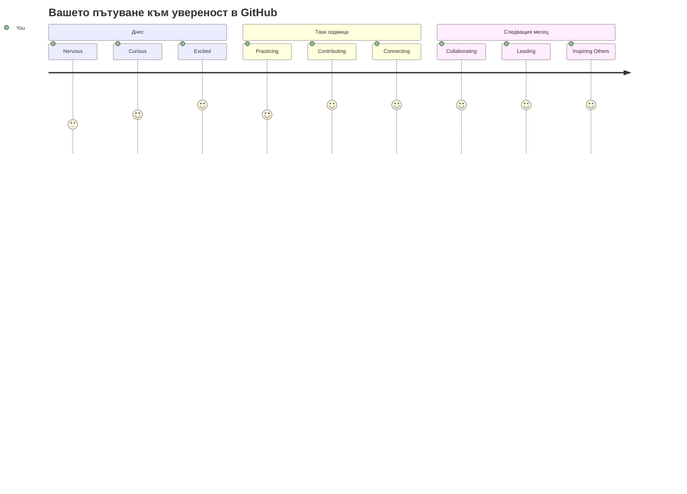

# Въведение в GitHub

Здрасти, бъдещ разработчик! 👋 Готов ли си да се присъединиш към милионите програмисти по света? Наистина съм развълнуван да ти представя GitHub – помисли за него като социална мрежа за програмисти, но вместо да споделяме снимки на обяда си, ние споделяме код и създаваме невероятни неща заедно!

Ето нещо, което ме изумява: всяко приложение на телефона ти, всеки уебсайт, който посещаваш, и повечето от инструментите, които ще научиш да използваш, са създадени от екипи разработчици, които си сътрудничат на платформи като GitHub. Това музикално приложение, което обичаш? Някой като теб е допринесъл за него. Тази игра, която не можеш да оставиш? Да, вероятно е създадена чрез сътрудничество в GitHub. А сега ТИ ЩЕ се научиш как да бъдеш част от тази удивителна общност!

Знам, че първоначално може да ти се стори много – чертите си спомням как гледах първата си страница в GitHub и мислех „Какво по дяволите означава всичко това?“ Но ето нещо: всеки разработчик е започнал точно там, където си ти сега. До края на този урок ще имаш собствен GitHub репозиторий (помисли за него като твоя лична изложба на проекти в облака) и ще знаеш как да запазваш работата си, да я споделяш с другите и дори да допринасяш за проекти, които използват милиони хора.

Ще изминаем това пътешествие заедно, стъпка по стъпка. Без бързане, без натиск – само ти, аз и някои много яки инструменти, които ще станат твоите най-добри приятели!


> Скетчноут от [Tomomi Imura](https://twitter.com/girlie_mac)


## Предварителен тест преди лекцията
[Предварителен тест](https://ff-quizzes.netlify.app)

## Въведение

Преди да се потопим в наистина вълнуващите неща, нека подготвим компютъра ти за малко магия с GitHub! Помисли за това като да организираш художествените си материали преди да създадеш шедьовър – когато имаш правилните инструменти под ръка, всичко е много по-гладко и доста по-забавно.

Ще те преведа през всяка стъпка от настройката лично и обещавам, че не е толкова страшно, колкото може да изглежда на пръв поглед. Ако нещо не ти се получи от първия път, това е напълно нормално! Спомням си как настройвах първата си среда за разработка и имах чувството, че се опитвам да чета древни йероглифи. Всеки разработчик е бил точно там, където си ти сега, чудейки се дали го прави правилно. Малък спойлер: ако си тук и учиш, вече го правиш правилно! 🌟

В този урок ще разгледаме:

- как да следиш работата, която вършиш на своя компютър
- как да работиш по проекти с други хора
- как да допринасяш към проекти с отворен код

### Предварителни условия

Нека подготвим компютъра ти за магия с GitHub! Не се притеснявай – тази настройка е нещо, което трябва да направиш само веднъж и след това си готов за цялото си пътешествие с програмирането.

Добре, нека започнем с основите! Първо трябва да проверим дали Git вече е инсталиран на твоя компютър. Git е като много умен асистент, който запомня всяка промяна, която правиш в кода си – много по-добре от това да натискаш Ctrl+S панически на всяка две секунди (всички сме го правили!).

Нека видим дали Git вече е инсталиран, като напишеш тази магическа команда в терминала си:
`git --version`

Ако Git не е там все още, не се притеснявай! Просто отиди на [download Git](https://git-scm.com/downloads) и го изтегли. Когато го инсталираш, ще трябва да представиш Git правилно на компютъра си:

> 💡 **Първоначална настройка**: Тези команди казват на Git кой си ти. Тази информация ще бъде прикачена към всяко "commit"-ване, което направиш, затова избери име и имейл, които си комфортен да споделяш публично.

```bash
git config --global user.name "your-name"
git config --global user.email "your-email"
```

За да провериш дали Git вече е конфигуриран, можеш да напишеш:
```bash
git config --list
```

Ще ти трябва също GitHub акаунт, редактор за код (като Visual Studio Code) и да отвориш своя терминал (или: командния прозорец).

Посети [github.com](https://github.com/) и създай акаунт, ако все още нямаш, или влез в профила си и попълни своя профил.

💡 **Съвременен съвет**: Помисли за настройване на [SSH ключове](https://docs.github.com/en/authentication/connecting-to-github-with-ssh) или използване на [GitHub CLI](https://cli.github.com/) за по-лесна автентикация без пароли.

✅ GitHub не е единственият репозиторий за код в света; има и други, но GitHub е най-известният

### Подготовка

Ще ти трябва както папка с проект с код на твоя локален компютър (лаптоп или настолен), така и публичен репозиторий в GitHub, който ще служи като пример как да допринасяш за проекти на други хора.

### Как да пазиш кода си в безопасност

Нека поговорим малко за сигурността – но не се притеснявай, няма да те затрупаме с плашещи неща! Помисли за тези практики като за заключване на колата или дома си. Това са прости навици, които стават втора природа и пазят труда ти защитен.

Ще ти покажем съвременните и сигурни начини да работиш с GitHub още от самото начало. По този начин ще развиеш добри навици, които ще ти служат добре през цялата ти програмситка кариера.

Когато работиш с GitHub, е важно да следваш най-добрите практики за сигурност:

| Област на сигурност | Най-добра практика | Защо е важна |
|---------------------|--------------------|--------------|
| **Автентикация** | Използвай SSH ключове или лични достъпни токени | Паролите са по-малко сигурни и се премахват постепенно |
| **Двуфакторна автентикация** | Активирай 2FA в своя GitHub акаунт | Добавя допълнителен слой предпазване на акаунта |
| **Сигурност на репозитория** | Никога не вмъквай чувствителна информация | API ключове и пароли никога не трябва да бъдат в публични репозиторни |
| **Управление на зависимости** | Включи Dependabot за обновления | Поддържа зависимостите ти сигурни и актуални |

> ⚠️ **Критично предупреждение за сигурност**: Никога не вмъквай API ключове, пароли или други чувствителни данни в който и да е репозиторий. Използвай променливи на средата и `.gitignore` файлове за защита на конфиденциални данни.

**Съвременна настройка на автентикация:**

```bash
# Генериране на SSH ключ (модерен алгоритъм ed25519)
ssh-keygen -t ed25519 -C "your_email@example.com"

# Настройте Git да използва SSH
git remote set-url origin git@github.com:username/repository.git
```

> 💡 **Професионален съвет**: SSH ключовете премахват необходимостта да въвеждаш пароли многократно и са по-сигурен метод от традиционните.

---

## Управлявай кода си като професионалист

Добре, ТУК нещата стават наистина вълнуващи! 🎉 Ще научим как да следиш и управляваш кода си като истински професионалисти, и честно казано, това е едно от любимите ми неща да преподавам, защото наистина променя играта.

Представи си: пишеш невероятна история и искаш да следиш всеки проект, всяка блестяща редакция и всеки момент „чакай, това е гениално!“ Именно това прави Git за твоя код! Това е като най-невероятната тетрадка за пътуване във времето, която помни ВСИЧКО – всяко натискане на клавиш, всяка промяна, всеки момент „ой, съсипах всичко“, който можеш мигновено да отмениш.

Честно казано – първоначално може да ти се стори объркващо. Когато аз започнах, мислех „Защо не мога просто да запазвам файловете си както винаги?“ Но повярвай ми: когато Git щракне за теб (а ще го направи!), ще имаш онзи момент, в който мислиш „Как въобще съм кодиран преди това без него?“ Това е като да откриеш, че можеш да летиш, след като цял живот си ходил пеша!

Да кажем, че имаш папка локално с някакъв проект и искаш да започнеш да следиш напредъка си с git – системата за контрол на версиите. Някои хора сравняват използването на git с писане на любовно писмо до бъдещото си аз. Когато четеш съобщенията към commit през дни, седмици или месеци, ще можеш да си припомниш защо си направил дадено решение или да „върнеш“ промяна – при условие, че си писал добри съобщения към commit.


### Задача: Създай първия си репозиторий!

> 🎯 **Твоята мисия (и аз съм супер развълнуван за теб!)**: Заедно ще създадем твоя първи GitHub репозиторий! Когато приключим, ще имаш свой собствен малък ъгъл в интернет, където живее твоя код и ще си направил своя първи "commit" (това е програмистки жаргон за интелигентно запазване на работата ти). 
>
> Това е наистина специален момент – ти си на път да се присъединиш официално към глобалната общност на разработчици! Аз още помня трепета, когато създадох първия си репо и си мислех „Уау, наистина го правя!“

Нека преминем през това приключение заедно, стъпка по стъпка. Отнеми си време за всяка част – няма награда за бързане и обещавам, че всяка стъпка ще има смисъл. Помни, всеки легендарен програмист, който уважаваш, е седял точно там, където си ти сега, и е на път да създаде първия си репозиторий. Колко яко е това?

> Гледай видеото
> 
> [](https://www.youtube.com/watch?v=9R31OUPpxU4)

**Да го направим заедно:**

1. **Създай репозитория си в GitHub**. Отиди на GitHub.com и потърси онзи яркозелен бутон **New** (или знака **+** в горния десен ъгъл). Кликни го и избери **New repository**.

   Ето какво да направиш:
   1. Дай име на репозитория си – нещо, което има значение за теб!
   1. Добави описание, ако искаш (за да помогнеш на другите да разберат какво представлява проектът)
   1. Реши дали да е публичен (всеки може да го види) или частен (само ти)
   1. Препоръчвам да маркираш кутията за README файл – това е като корицата на проекта ти
   1. Натисни **Create repository** и се зарадвай – току-що създаде първия си репозиторий! 🎉

2. **Отиди до папката с твоя проект**. Сега нека отворим терминала ти (не се притеснявай, не е толкова страшно). Трябва да кажем на компютъра къде са файловете на проекта. Въведи тази команда:

   ```bash
   cd [name of your folder]
   ```

   **Какво правим тук:**
   - Казваме на компютъра „Ей, отведи ме до папката на проекта ми“
   - Това е като да отвориш конкретна папка на десктопа си, но го правим с текстови команди
   - Замени `[name of your folder]` с истинското име на твоята папка с проект

3. **Преобразувай папката си в Git репозиторий**. Тук настъпва магията! Въведи:

   ```bash
   git init
   ```

   **Ето какво току-що се случи (много яко!):**
   - Git създаде скрита папка `.git` в твоя проект – няма да я видиш, но е там!
   - Твоята обикновена папка вече е "репозиторий", който може да следи всяка промяна, която правиш
   - Помисли за това като за даване на суперсили на папката да помни всичко

4. **Провери какво става**. Нека видим какво Git мисли за твоя проект в момента:

   ```bash
   git status
   ```

   **Разбиране на информацията от Git:**
   
   Може да видиш нещо такова:

   ```output
   Changes not staged for commit:
   (use "git add <file>..." to update what will be committed)
   (use "git restore <file>..." to discard changes in working directory)

        modified:   file.txt
        modified:   file2.txt
   ```

   **Не се паникьосвай! Това означава:**
   - Файлове в **червено** са файлове с направени промени, но все още не са готови за запазване
   - Файлове в **зелено** (когато ги видиш) са готови за запазване
   - Git е полезен и ти казва какво можеш да направиш след това

   > 💡 **Професионален съвет**: Командата `git status` е твоят най-добър приятел! Използвай я винаги когато си объркан какво се случва. Това е като да питаш Git „Ей, каква е ситуацията точно сега?“

5. **Подготви файловете си за запазване** (това се нарича "staging"):

   ```bash
   git add .
   ```

   **Какво току-що направихме:**
   - Казахме на Git „Искам да включа ВСИЧКИ мои файлове в следващото запазване“
   - Точката `.` е като да кажеш „всичко в тази папка“
   - Сега файловете ти са "подготвени" и готови за следващата стъпка

   **Искаш да бъдеш по-прецизен?** Можеш да добавиш само конкретни файлове:

   ```bash
   git add [file or folder name]
   ```

   **Защо може да искаш това?**
   - Понякога искаш да запазиш свързани промени заедно
   - Това ти помага да организираш работата си в логични части
   - Прави по-лесно разбирането какво и кога се е променило

   **Промени ли си решението?** Няма проблем! Можеш да извадиш файлове от подготовката по този начин:

   ```bash
   # Премахнете всичко от подготвянето
   git reset
   
   # Премахнете от подготвянето само един файл
   git reset [file name]
   ```

   Не се притеснявай – това не изтрива твоята работа, просто изважда файловете от групата на „готови за запазване“.

6. **Запази работата си окончателно** (направи първия си commit!):

   ```bash
   git commit -m "first commit"
   ```

   **🎉 Поздравления! Току-що направи първия си commit!**
   
   **Ето какво се случи:**
   - Git направи „снимка“ на всички подготвени файлове в този точен момент
   - Съобщението към commit „first commit“ обяснява какво представлява тази точка на запазване
   - Git даде на тази снимка уникално ID, така че винаги да можеш да я намериш по-късно
   - Официално започнаш да следиш историята на проекта си!

   > 💡 **Бъдещи съобщения към commit**: Следващите пъти бъди по-описателен! Вместо „updated stuff“, опитай „Добави форма за контакти на началната страница“ или „Поправи бъг в менюто за навигация“. Твоето бъдещо аз ще ти благодари!

7. **Свържи своя локален проект с GitHub**. В момента проектът ти съществува само на твоя компютър. Нека го свържем с твоя GitHub репозиторий, за да можеш да го споделяш със света!

   Първо отиди на страницата на твоя GitHub репозитория и копирай URL адреса. След това се върни тук и напиши:

   ```bash
   git remote add origin https://github.com/username/repository_name.git
   ```
   
   (Замени този URL с истинския URL на твоя репозитория!)

   **Какво току-що направихме:**
   - Създадохме връзка между вашия локален проект и вашето репозитори в GitHub
   - "Origin" е просто прякор за вашето GitHub репозитори – все едно добавяте контакт във вашия телефон
   - Сега вашият локален Git знае къде да изпрати вашия код, когато сте готови да го споделите

   💡 **По-лесен начин**: Ако имате инсталиран GitHub CLI, можете да го направите с една команда:
   ```bash
   gh repo create my-repo --public --push --source=.
   ```

8. **Изпратете кода си в GitHub** (големият момент!):

   ```bash
   git push -u origin main
   ```

   **🚀 Това е то! Качвате кода си в GitHub!**
   
   **Какво се случва:**
   - Вашите комити пътуват от компютъра ви до GitHub
   - Флагът `-u` установява постоянна връзка, за да улесни бъдещите push операции
   - "main" е името на основния ви клон (като главната папка)
   - След това просто можете да пишете `git push` за бъдещите качвания!

   💡 **Бърза забележка**: Ако вашият клон има друго име (като "master"), използвайте това име вместо това. Можете да проверите с `git branch --show-current`.

9. **Вашият нов ежедневен ритъм на кодиране** (това става пристрастяващо!):

   От сега нататък, когато правите промени в проекта си, имате този прост тристъпков танц:

   ```bash
   git add .
   git commit -m "describe what you changed"
   git push
   ```

   **Това става вашето кодиращо сърцебиене:**
   - Направете някои страхотни промени в кода си ✨
   - Подгответе ги с `git add` ("Хей, Git, обърни внимание на тези промени!")
   - Запазете ги с `git commit` и описателно съобщение (бъдещото вие ще ви е благодарно!)
   - Споделете ги с света чрез `git push` 🚀
   - Изпълнявайте отново и отново – сериозно, това става толкова естествено, колкото дишането!

   Харесвам този работен поток, защото е като да имаш множество точки на запис в една видео игра. Направихте промяна, която харесвате? Комитирайте я! Искате да пробвате нещо рисковано? Няма проблем – винаги можете да се върнете към последния си комит, ако нещо се обърка!

   > 💡 **Съвет**: Може би искате да използвате `.gitignore`, за да предотвратите появата на файлове, които не искате да следите в GitHub - като онзи файл с бележки, който държите в същата папка, но няма място в публично репозитори. Можете да намерите шаблони за `.gitignore` файлове на [.gitignore templates](https://github.com/github/gitignore) или да създадете такъв чрез [gitignore.io](https://www.toptal.com/developers/gitignore).

### 🧠 **Първо качване в репозитори: Как се почувства това?**

**Отделете време да отпразнувате и да си помислите:**
- Как се почувствахте, когато видяхте кода си за първи път в GitHub?
- Коя стъпка беше най-объркваща, а коя изненадващо лесна?
- Можете ли да обясните разликата между `git add`, `git commit` и `git push` с ваши думи?


> **Запомнете**: Дори опитни разработчици понякога забравят точните команди. За да стане този работен поток навик, трябва практика – справяте се чудесно!

#### Модерни Git работни процеси

Обмислете възприемането на следните модерни практики:

- **Conventional Commits**: Използвайте стандартизиран формат за съобщения на комит като `feat:`, `fix:`, `docs:`, и т.н. Научете повече на [conventionalcommits.org](https://www.conventionalcommits.org/)
- **Атомарни комити**: Правете всеки комит да представлява една логична промяна
- **Чести комити**: Комитирайте често с описателни съобщения, вместо с големи и редки

#### Съобщения на комити

Страхотен Git комит субект завършва следното изречение:
Ако бъде приложен, този комит ще <вашия субект тук>

За субекта използвайте императивно, сегашно време: "prouveshtavam", а не "prouchi" или "prouchva". 
Както при субекта, в тялото (по желание) също използвайте императивно, сегашно време. Тялото трябва да включва мотивацията за промяната и да я сравнява с предишното поведение. Обяснявате „защо“, а не „как“.

✅ Отделете няколко минути да разгледате GitHub. Можете ли да намерите наистина добро съобщение за комит? Можете ли да намерите много кратко? Коя информация смятате за най-важна и полезна да бъде предадена в съобщение на комит?

## Работа с Други (Забавната Част!)

Дръжте си шапката, защото ТОВА е моментът, в който GitHub става абсолютно магичен! 🪄 Вие овладяхте управлението на собствения си код, но сега навлизаме в моята абсолютна любима част – сътрудничество с невероятни хора от цял свят.

Представете си следното: събуждате се утре и виждате, че някой в Токио е подобрил вашия код, докато сте спали. После някой в Берлин оправя бъг, с който сте заседнали. Следобед разработчик в Сао Пауло добавя функция, за която никога не сте мислили. Това не е научна фантастика – това е просто вторник в GitHub вселената!

Това, което ме вълнува истински, е че уменията за сътрудничество, които ще научите, са ТОЧНО същите работни процеси, които екипите в Google, Microsoft и любимите ви стартъпи използват всеки ден. Не просто учите готин инструмент – учите тайния език, който кара целия софтуерен свят да работи заедно.

Сериозно, щом усетите тръпката от първия си merged pull request, ще разберете защо разработчиците се вълнуват толкова от отворения код. Това е като да си част от най-големия и най-креативен екипен проект в света!

> Вижте видеото
>
> [](https://www.youtube.com/watch?v=bFCM-PC3cu8)

Основната причина да се качва на GitHub е, за да е възможно сътрудничеството с други разработчици.

```mermaid
flowchart LR
    A[🔍 Намери проект] --> B[🍴 Създай форк на хранилище]
    B --> C[📥 Клонирай локално]
    C --> D[🌿 Създай клон]
    D --> E[✏️ Направи промени]
    E --> F[💾 Запиши промени (commit)]
    F --> G[📤 Изпрати клон]
    G --> H[🔄 Създай pull request]
    H --> I{Преглед от поддържащ}
    I -->|✅ Одобрено| J[🎉 Сливи!]
    I -->|❓ Поискано е изменение| K[📝 Направи актуализации]
    K --> F
    J --> L[🧹 Почисти клонове]
    
    style A fill:#e3f2fd
    style J fill:#e8f5e8
    style L fill:#fff3e0
```
Във вашето репозитори отидете на `Insights > Community`, за да видите как проектът ви се сравнява с препоръчаните стандарти на общността.

Искате вашето репозитори да изглежда професионално и приветливо? Отидете в репозитори и кликнете върху `Insights > Community`. Тази готина функция ви показва как вашият проект се съотнася към това, което GitHub общността счита за "добри практики за репозитори".

> 🎯 **Да направим вашия проект да блести**: Добре организирано репозитори с добра документация е като чист и приветлив магазин на улицата. То казва на хората, че ви е грижа за работата ви и кара другите да искат да допринасят!

**Ето какво прави едно репозитори страхотно:**

| Какво да добавите | Защо е важно | Какво ви дава |
|-------------------|--------------|---------------|
| **Описание** | Първото впечатление е важно! | Хората веднага знаят за какво е проектът ви |
| **README** | Началната страница на проекта | Като приятелски гид за новите посетители |
| **Правила за принос** | Показва, че приветствате помощ | Хората знаят точно как могат да помогнат |
| **Кодекс на поведение** | Създава приятелско пространство | Всеки се чувства добре дошъл да участва |
| **Лиценз** | Правна яснота | Другите знаят как могат да използват кода ви |
| **Политика за сигурност** | Показва отговорност | Демонстрира професионални практики |

> 💡 **Професионален съвет**: GitHub предлага шаблони за всички тези файлове. Когато създавате ново репозитори, маркирайте кутийките за автоматично генериране на тези файлове.

**Модерни GitHub Функции за Разглеждане:**

🤖 **Автоматизация и CI/CD:**
- **GitHub Actions** за автоматично тестване и внедряване
- **Dependabot** за автоматични обновления на зависимости

💬 **Община и управление на проекти:**
- **GitHub Discussions** за разговори в общността извън проблемите
- **GitHub Projects** за управление на проекти в стил канбан
- **Правила за защита на клонове** за налагане на стандарти за качество на кода


Всички тези ресурси ще улеснят включването на нови членове в екипа. А те често са първото нещо, което новите допринасящи разглеждат, преди изобщо да погледнат кода ви, за да преценят дали проектът ви е подходящо място за техния труд.

✅ README файловете, макар че отнемат време за подготовка, често се пренебрегват от заетите поддържащи. Можете ли да намерите пример за особено описателен такъв? Забележка: има [инструменти за създаване на добри README](https://www.makeareadme.com/), които може да искате да изпробвате.

### Задача: Обединяване на код

Документацията за принос помага на хората да се включат в проекта. Тя обяснява какви видове приноси търсите и как работи процесът. Съдействащите трябва да преминат през серия от стъпки, за да могат да допринасят във вашето репозитори в GitHub:


1. **Форкване на вашето репозитори** Вие вероятно искате хората да _форкват_ проекта ви. Форкването означава създаване на копие на вашето репозитори в техния GitHub профил.
1. **Клониране**. След това те клонират проекта на своя локален компютър. 
1. **Създаване на клон**. Можете да ги помолите да създадат _клон_ за своята работа. 
1. **Фокусиране на промяната върху една област**. Помолете съдействащите да се съсредоточат върху една промяна наведнъж – така шансът да можете да _обедините_ техния труд е по-голям. Представете си, че някой пише поправка на бъг, добавя нова функция и обновява няколко теста – какво ако искате или можете да приложите само 2 от 3 или 1 от 3 промени?

✅ Представете си ситуация, в която клоновете са особено важни за писането и пускането на добър код. Какви случаи на употреба можете да измислите?

> Забележка, бъдете промяната, която искате да видите в света, и създавайте клонове и за собствената си работа. Всеки комит, който направите, ще бъде върху клона, който в момента сте „разгърнали“. Използвайте `git status`, за да видите кой е той.

Нека преминем през работния процес на съдействащ. Да предположим, че съдействащият вече е _форкнал_ и _клонирал_ репото, така че има Git репо готово за работа на своя локален компютър:

1. **Създаване на клон**. Използвайте командата `git branch` за създаване на клон, който ще съдържа промените, които искат да допринесат:

   ```bash
   git branch [branch-name]
   ```

   > 💡 **Модерен подход**: Можете също така да създадете и превключите към новия клон с една команда:
   ```bash
   git switch -c [branch-name]
   ```

1. **Превключване към работен клон**. Превключете към посочения клон и обновете работната директория с `git switch`:

   ```bash
   git switch [branch-name]
   ```

   > 💡 **Модерна забележка**: `git switch` е съвременната замяна на `git checkout` при смяна на клонове. По-ясна и по-безопасна за начинаещи.

1. **Работа по промените**. На този етап искате да добавите промените си. Не забравяйте да уведомите Git с командите:

   ```bash
   git add .
   git commit -m "my changes"
   ```

   > ⚠️ **Качество на съобщението за комит**: Уверете се, че комитът ви има добро име, както за ваша полза, така и за този, който поддържа репото, в което помагате. Бъдете конкретни какво сте променили!

1. **Обединявате своята работа с клона `main`**. След като приключите с работата, искате да обедините своя труд с този на клона `main`. Междувременно `main` може да се е променил, затова първо го обновете до най-новата версия с командите:

   ```bash
   git switch main
   git pull
   ```

   Тук искате да се уверите, че всички _конфликти_, ситуации, в които Git не може лесно да _обедини_ промените, се случват в работния ви клон. Затова изпълнете следните команди:

   ```bash
   git switch [branch_name]
   git merge main
   ```

   Командата `git merge main` ще донесе всички промени от `main` във вашия клон. Надяваме се просто да продължите. Ако не, VS Code ще ви покаже къде Git се _обърква_ и вие просто променяте засегнатите файлове, за да кажете кое съдържание е най-точно.

   💡 **Модерна алтернатива**: Обмислете използването на `git rebase` за по-чиста история:
   ```bash
   git rebase main
   ```
   Това преиграва вашите комити върху най-новия main клон, създавайки линейна история.

1. **Изпращане на вашата работа в GitHub**. Изпращането на работата означава две неща. Качване на клона ви в репото и след това създаване на PR, Pull Request.

   ```bash
   git push --set-upstream origin [branch-name]
   ```

   Горната команда създава клона във вашето форкнато репо.

### 🤝 **Проверка на умения за сътрудничество: Готови ли сте да работите с други?**

**Нека видим как се чувствате относно сътрудничеството:**
- Има ли смисъл за вас сега концепцията за форк и pull requests?
- Какво бихте искали да упражнявате повече по отношение на работа с клонове?
- Колко комфортно се чувствате да допринасяте към чужд проект?


> **Повишаване на увереността**: Всеки един разработчик, когото уважавате, някога е бил нервен за първия си pull request. GitHub общността е изключително приветлива към начинаещите!

1. **Отваряне на PR**. След това искате да отворите PR. Прави се като отидете в форкнатото репо на GitHub. Ще видите индикация в GitHub, която пита дали искате да създадете нов PR, натискате там и ви отваря интерфейс, където можете да промените заглавието на комита, да му дадете по-подходящо описание. След това поддържащият на репото, което сте форкнали, ще види този PR и _пожелаваме му успех_ да го оцени и _слее_ с основния клон. Сега сте съдействащ, ура :)

   💡 **Модерен съвет**: Можете също да създавате PR-та чрез GitHub CLI:
   ```bash
   gh pr create --title "Your PR title" --body "Description of changes"
   ```

   🔧 **Добри практики за PR:**
   - Свържете с релевантни issues с ключови думи като "Fixes #123"
   - Добавете скрийншотове за промени в UI
   - Искайте конкретни рецензенти
   - Използвайте draft PR за работа в процес на развитие
   - Уверете се, че всички CI проверки са преминали преди да поискате преглед
1. **Почистване**. Счита се за добра практика да _почистите_ след успешното сливане на PR. Искате да почистите както вашия локален клон, така и клона, който сте пуснали в GitHub. Първо нека го изтрием локално с командата:

   ```bash
   git branch -d [branch-name]
   ```

   След това се уверете, че сте отишли на страницата в GitHub за форкнатото хранилище и сте премахнали отдалечения клон, който току-що сте пуснали.

`Pull request` изглежда като глупав термин, защото всъщност искате да "пуснете" промените си в проекта. Но поддръжникът (собственикът на проекта) или основният екип трябва да разгледат промените ви преди да ги слеят с "main" клона на проекта, така че всъщност вие искате решение за промяна от поддръжника.

Pull request е мястото, където се сравняват и обсъждат разликите, въведени в клон с ревюта, коментари, интегрирани тестове и още. Един добър pull request следва приблизително същите правила като съобщение за commit. Можете да добавите препратка към issue в тракера за проблеми, когато вашата работа например оправя някой проблем. Това се прави като използвате `#`, последвано от номера на проблема. Например `#97`.

🤞 Кръстосваме пръсти всички проверки да минат и собствениците на проекта да слеят промените ви в проекта 🤞

Обновете текущия си локален работен клон с всички нови комити от съответния отдалечен клон в GitHub:

`git pull`

## Допринасяне в Open Source (Възможността ви да направите впечатление!)

Готови ли сте за нещо, което ще ви вземе ума? 🤯 Нека поговорим за допринасянето в проекти с отворен код – и аз получавам тръпки само като мисля да споделя това с вас!

Това е вашият шанс да станете част от нещо наистина изключително. Представете си, че подобрявате инструментите, които милиони разработчици използват всеки ден, или оправяте бъг в приложение, което вашите приятели обожават. Това не е просто мечта – това е същността на приноса към отворен код!

Това, което ме кара да се треперя всеки път, когато го мисля: всеки инструмент, с който сте учили – вашият код редактор, фреймуърците, които ще разглеждаме, дори браузърът, в който четете това – е започнал с някой като вас, който е направил първия си принос. Този изключителен разработчик, който е създал любимото ви разширение за VS Code? Някога и те са били начинаещи с треперещи ръце, кликайки "create pull request", точно както и вие сега.

И най-хубавото: общността на отворения код е като най-голямата групова прегръдка в интернет. Повечето проекти активно търсят новаци и имат обозначения "good first issue" специално за хора като вас! Поддръжниците наистина се вълнуват, когато видят нови допринасящи, защото си спомнят първите си стъпки.

```mermaid
flowchart TD
    A[🔍 Разгледайте GitHub] --> B[🏷️ Намерете "добър първи проблем"]
    B --> C[📖 Прочетете Насоки за приноси]
    C --> D[🍴 Форкнете хранилището]
    D --> E[💻 Настройте локална среда]
    E --> F[🌿 Създайте клон за функция]
    F --> G[✨ Направете вашия принос]
    G --> H[🧪 Тествайте промените си]
    H --> I[📝 Напишете ясен комит]
    I --> J[📤 Изпратете и създайте PR]
    J --> K[💬 Взаимодействайте с обратната връзка]
    K --> L[🎉 Сляти! Вие сте приносител!]
    L --> M[🌟 Намерете следващия проблем]
    
    style A fill:#e1f5fe
    style L fill:#c8e6c9
    style M fill:#fff59d
```
Тук не само се учите да кодирате – вие се подготвяте да се присъедините към глобално семейство от строители, които всеки ден се будят с мисълта "Как можем да направим дигиталния свят малко по-добър?" Добре дошли в клуба! 🌟

Първо, нека намерим репозитория (или **repo**) в GitHub, който ви интересува и към който бихте искали да направите промяна. Ще искате да копирате съдържанието му на своя компютър.

✅ Един добър начин да намерите 'начинаещи-приятелски' репота е да [търсите по етикет 'good-first-issue'](https://github.blog/2020-01-22-browse-good-first-issues-to-start-contributing-to-open-source/).



Има няколко начина да копирате кода. Един от тях е да "клонирате" съдържанието на репозитория, използвайки HTTPS, SSH или с помощта на GitHub CLI (Интерфейс на командния ред).

Отворете терминала си и клонирайте репозитория по следния начин:
```bash
# Използване на HTTPS
git clone https://github.com/ProjectURL

# Използване на SSH (изисква настройка на SSH ключ)
git clone git@github.com:username/repository.git

# Използване на GitHub CLI
gh repo clone username/repository
```

За да работите по проекта, преминете към правилната папка:
`cd ProjectURL`

Можете също да отворите целия проект с:
- **[GitHub Codespaces](https://github.com/features/codespaces)** - облачната среда за разработка на GitHub с VS Code в браузъра
- **[GitHub Desktop](https://desktop.github.com/)** - GUI приложение за Git операции  
- **[GitHub.dev](https://github.dev)** - Натиснете бутона `.` върху всеки GitHub репо, за да отворите VS Code в браузъра
- **VS Code** с разширението GitHub Pull Requests

Накрая, можете да изтеглите кода в архивирана папка.

### Още няколко интересни неща за GitHub

Можете да поставяте звезда, да наблюдавате и/или да "форквате" произволен публичен репозитория в GitHub. Вашите звезди можете да намерите в падащото меню горе вдясно. Това е като отметка, но за код.

Проектите имат тракер за проблеми, най-често в GitHub в таба "Issues", освен ако не е посочено друго, където хората обсъждат въпроси, свързани с проекта. А разделът Pull Requests е мястото, където се обсъждат и ревюират промените в процес на работа.

Проектите може също да имат обсъждания във форуми, по пощенски списъци или в чат канали като Slack, Discord или IRC.

🔧 **Модерни функции на GitHub**:
- **GitHub Discussions** - Вграден форум за разговори в общността
- **GitHub Sponsors** - Финансова подкрепа на поддръжниците  
- **Security tab** - Доклади за уязвимости и съвети за сигурността
- **Actions tab** - Вижте автоматизираните работни процеси и CI/CD пайплайни
- **Insights tab** - Анализи за допринасящите, комитите и здравето на проекта
- **Projects tab** - Вградени инструменти за управление на проекти в GitHub

✅ Разгледайте новото си GitHub репо и пробвайте няколко неща, като редактиране на настройки, добавяне на информация, създаване на проект (като Kanban табло) и настройване на GitHub Actions за автоматизация. Много неща можете да направите!

---

## 🚀 Предизвикателство

Добре, време е да изпитате новите си суперсили в GitHub! 🚀 Ето едно предизвикателство, което ще направи всичко да си дойде на мястото по най-приятния начин:

Вземете приятел (или някой от семейството, който постоянно пита с какво се занимавате с цялата тази "компютърна работа") и започнете съвместно приключение в кодирането! Тук се случва истинската магия – създайте проект, нека го форкне, създайте няколко клона и слейте промените като истински професионалисти, които вече сте.

Няма да крия – вероятно ще се посмеете (особено когато се опитате и двамата да промените един и същи ред), може да се почешете по главата в объркване, но ще имате онези страхотни "аха!" моменти, които правят всичко учене заслужаващо си. Освен това има нещо специално в това да споделите първото успешно сливане с някого – това е като малко празненство за свършената работа!

Все още нямате партньор за кодиране? Без притеснения! Общността на GitHub е пълна с изключително приветливи хора, които помнят как е било да си нов. Потърсете репозитории с етикет "good first issue" – те казват "Хей, начинаещи, елате да учите с нас!" Колко страхотно е това?

## Куиз след лекцията
[Post-lecture quiz](https://ff-quizzes.netlify.app/web/en/)

## Преглед и продължавайте да учите

Уф! 🎉 Вижте ви – току-що покрихте основите на GitHub като абсолютен шампион! Ако мозъкът ви в момента е леко претоварен, това е напълно нормално и всъщност е добър знак. Току-що сте се научили на инструменти, за които мен ми отне седмици да се чувствам комфортно, когато започнах.

Git и GitHub са изключително мощни (наистина мощни), и всеки разработчик, когото познавам – включително тези, които сега изглеждат като вълшебници – е трябвало да тренира и да се спъва малко преди всичко да се нареди. Фактът, че стигнахте до края на този урок, означава, че вече сте по пътя към овладяване на някои от най-важните инструменти в инструментариума на разработчика.

Ето някои абсолютно фантастични ресурси, които да ви помогнат да упражнявате и да станете още по-яки:

- [Ръководство за допринасяне към софтуер с отворен код](https://opensource.guide/how-to-contribute/#how-to-submit-a-contribution) – Вашата карта за постигане на влияние
- [Git cheatsheet](https://training.github.com/downloads/github-git-cheat-sheet/) – Дръжте го под ръка за бързи справки!

И помнете: практиката води до прогрес, не до съвършенство! Колкото повече използвате Git и GitHub, толкова по-естествено ще ви се струва. GitHub е създал страхотни интерактивни курсове, които ви позволяват да практикувате в сигурна среда:

- [Въведение в GitHub](https://github.com/skills/introduction-to-github)
- [Комуникация с Markdown](https://github.com/skills/communicate-using-markdown)  
- [GitHub Pages](https://github.com/skills/github-pages)
- [Управление на конфликти при сливане](https://github.com/skills/resolve-merge-conflicts)

**Чувствате се приключенски настроени? Вижте тези модерни инструменти:**
- [Документация за GitHub CLI](https://cli.github.com/manual/) – За когато искате да се почувствате като магьосник на командния ред
- [Документация за GitHub Codespaces](https://docs.github.com/en/codespaces) – Кодирайте в облака!
- [Документация за GitHub Actions](https://docs.github.com/en/actions) – Автоматизирайте всичко
- [Най-добри практики за Git](https://www.atlassian.com/git/tutorials/comparing-workflows) – Подобрете работния си процес

## Предизвикателство с GitHub Copilot Agent 🚀

Използвайте Agent режима, за да изпълните следното предизвикателство:

**Описание:** Създайте съвместен уеб разработващ проект, който демонстрира пълния GitHub работен процес, който сте научили в този урок. Това предизвикателство ще ви помогне да упражните създаването на репозитории, колаборационните функции и модерните Git работни потоци в реален сценарий.

**Задание:** Създайте нов публичен GitHub репозитория за прост проект "Ресурси за уеб разработка". Репозиторията трябва да включва добре структурирано README.md файл, изброяващ полезни уеб разработващи инструменти и ресурси, организирани по категории (HTML, CSS, JavaScript и др.). Настройте репозитория с подходящи стандарти на общността, включително лиценз, правила за допринасяне и кодекс за поведение. Създайте поне два клона за функции: един за добавяне на CSS ресурси и друг за JavaScript ресурси. Направете комити във всеки клон с описателни съобщения и после създайте pull request-и за сливане на промените обратно в main. Активирайте функции на GitHub като Issues, Discussions и настройте основен GitHub Actions workflow за автоматизирани проверки.

## Задача

Вашата мисия, ако решите да я приемете: Завършете курса [Introduction to GitHub](https://github.com/skills/introduction-to-github) в GitHub Skills. Този интерактивен курс ще ви позволи да практикувате всичко, което сте научили, в безопасна и насочена среда. Освен това ще получите страхотен значок, когато го завършите! 🏅

**Чувствате ли се готови за още предизвикателства?**
- Настройте SSH автентикация за GitHub акаунта си (без пароли!)
- Опитайте GitHub CLI за ежедневните си Git операции
- Създайте репозитория с GitHub Actions workflow
- Разгледайте GitHub Codespaces, като отворите този репо в облачна среда за редактиране

---

## 🚀 Вашата времева линия за овладяване на GitHub

### ⚡ **Какво може да направите през следващите 5 минути**
- [ ] Поставете звезда на този репозитория и още 3 проекта, които ви интересуват
- [ ] Настройте двуфакторна автентикация на GitHub акаунта си
- [ ] Създайте прост README за първия си репозитория
- [ ] Последвайте 5 разработчици, чиято работа ви вдъхновява

### 🎯 **Какво може да постигнете през този час**
- [ ] Завършете теста след урока и размишлявайте върху GitHub пътешествието си
- [ ] Настройте SSH ключове за безпаролна GitHub автентикация
- [ ] Направете първия си значим комит с отлично съобщение
- [ ] Разгледайте таба "Explore" в GitHub, за да откриете популярни проекти
- [ ] Упражнявайте се да форквате репозитория и да правите малки промени

### 📅 **Вашето седмично GitHub приключение**
- [ ] Завършете курсовете на GitHub Skills (Въведение в GitHub, Markdown)
- [ ] Направете първия си pull request към проект с отворен код
- [ ] Настройте GitHub Pages сайт, за да покажете вашата работа
- [ ] Включете се в GitHub Discussions за проекти, които ви вълнуват
- [ ] Създайте репозитория с подходящи стандарти на общността (README, Лиценз и др.)
- [ ] Опитайте GitHub Codespaces за разработка в облака

### 🌟 **Вашата месечна трансформация**
- [ ] Допринасяйте към 3 различни проекта с отворен код
- [ ] Наставлявайте някого нов в GitHub (предавайте нататък!)
- [ ] Настройте автоматизирани работни потоци с GitHub Actions
- [ ] Създайте портфолио, показващо вашите GitHub приноси
- [ ] Участвайте в Hacktoberfest или подобни събития на общността
- [ ] Станете поддръжник на собствен проект, към който другите допринасят

### 🎓 **Финална проверка на овладяването на GitHub**

**Празнувайте постиженията си:**
- Кое е любимото ви нещо при използването на GitHub?
- Коя колаборационна функция ви вълнува най-много?
- Колко уверени се чувствате за допринасяне към отворен код сега?
- Към кой проект първи искате да допринесете?


> 🌍 **Добре дошли в глобалната общност на разработчиците!** Вече имате инструментите да си сътрудничите с милиони разработчици по целия свят. Първият ви принос може да изглежда малък, но помнете - всеки голям проект с отворен код е започнал с някой, направил първия си commit. Въпросът не е дали ще направите впечатление, а кой изключителен проект първо ще се възползва от уникалната ви гледна точка! 🚀

Помнете: всеки експерт някога е бил начинаещ. Вие можете! 💪

---

<!-- CO-OP TRANSLATOR DISCLAIMER START -->
**Отказ от отговорност**:
Този документ е преведен с помощта на AI преводаческа услуга [Co-op Translator](https://github.com/Azure/co-op-translator). Въпреки че се стремим към точност, имайте предвид, че автоматизираните преводи могат да съдържат грешки или неточности. Оригиналният документ на неговия роден език трябва да се счита за авторитетен източник. За критична информация се препоръчва професионален човешки превод. Ние не носим отговорност за каквито и да е недоразумения или погрешни тълкувания, произтичащи от използването на този превод.
<!-- CO-OP TRANSLATOR DISCLAIMER END -->