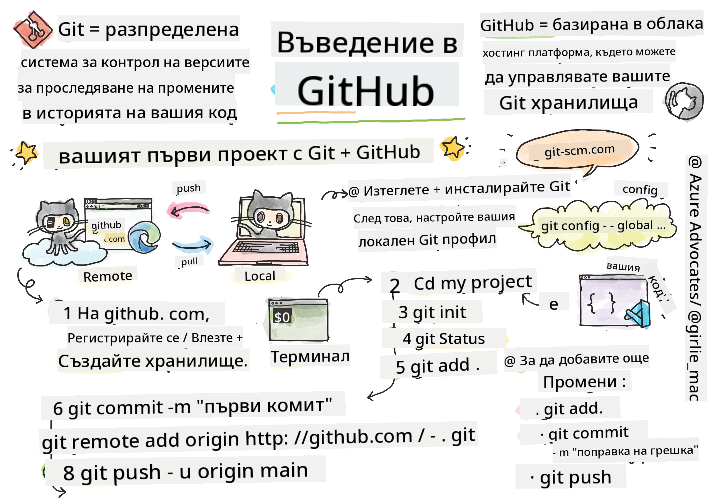
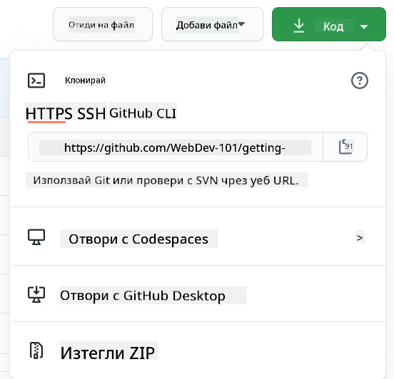

<!--
CO_OP_TRANSLATOR_METADATA:
{
  "original_hash": "acad15f3164cd6348e065ff38619aae9",
  "translation_date": "2025-10-24T22:33:51+00:00",
  "source_file": "1-getting-started-lessons/2-github-basics/README.md",
  "language_code": "bg"
}
-->
# Въведение в GitHub

Здравей, бъдещ разработчик! 👋 Готов ли си да се присъединиш към милиони програмисти по света? Наистина съм развълнуван да те запозная с GitHub – представи си го като социална мрежа за програмисти, но вместо да споделяме снимки на обяд, ние споделяме код и създаваме невероятни неща заедно!

Ето какво ме изумява: всяко приложение на телефона ти, всеки уебсайт, който посещаваш, и повечето инструменти, които ще научиш да използваш, са създадени от екипи от разработчици, които си сътрудничат на платформи като GitHub. Това музикално приложение, което обичаш? Някой като теб е допринесъл за него. Тази игра, от която не можеш да се откъснеш? Да, вероятно е създадена с помощта на GitHub. А сега ТИ ще научиш как да станеш част от тази невероятна общност!

Знам, че в началото може да ти се струва трудно – помня как гледах първата си страница в GitHub и си мислех: "Какво, за Бога, означава всичко това?" Но ето какво ще ти кажа: всеки един разработчик е започнал точно там, където си ти в момента. До края на този урок ще имаш собствено GitHub хранилище (представи си го като твоя лична витрина за проекти в облака) и ще знаеш как да запазваш работата си, да я споделяш с другите и дори да допринасяш за проекти, които се използват от милиони хора.

Ще извървим този път заедно, стъпка по стъпка. Без бързане, без напрежение – само ти, аз и някои наистина страхотни инструменти, които скоро ще станат твоите нови най-добри приятели!


> Скица от [Tomomi Imura](https://twitter.com/girlie_mac)

## Предварителен тест
[Предварителен тест](https://ff-quizzes.netlify.app)

## Въведение

Преди да се потопим в наистина вълнуващите неща, нека подготвим компютъра ти за малко магия с GitHub! Представи си това като организиране на твоите художествени материали преди да създадеш шедьовър – наличието на правилните инструменти прави всичко много по-гладко и много по-забавно.

Ще те преведа през всяка стъпка от настройката лично и обещавам, че не е толкова страшно, колкото изглежда на пръв поглед. Ако нещо не ти се изясни веднага, това е напълно нормално! Помня как настройвах първата си среда за разработка и се чувствах сякаш се опитвам да разчета древни йероглифи. Всеки един разработчик е бил точно там, където си ти в момента, чудейки се дали прави всичко правилно. Спойлер: ако си тук и учиш, вече го правиш правилно! 🌟

В този урок ще разгледаме:

- как да следиш работата си на компютъра
- как да работиш по проекти с други хора
- как да допринасяш за софтуер с отворен код

### Предварителни изисквания

Нека подготвим компютъра ти за малко магия с GitHub! Не се притеснявай – тази настройка трябва да направиш само веднъж и след това ще си готов за цялото си пътешествие в програмирането.

Добре, да започнем с основите! Първо, трябва да проверим дали Git вече е инсталиран на компютъра ти. Git е като супер интелигентен асистент, който помни всяка промяна, която правиш в кода си – много по-добре от това да натискаш Ctrl+S на всеки две секунди (всички сме го правили!).

Нека видим дали Git вече е инсталиран, като напишем тази магическа команда в терминала:
`git --version`

Ако Git все още не е инсталиран, няма проблем! Просто отиди на [download Git](https://git-scm.com/downloads) и го изтегли. След като го инсталираш, трябва да представим Git на теб правилно:

> 💡 **Първоначална настройка**: Тези команди казват на Git кой си. Тази информация ще бъде прикрепена към всяка промяна, която правиш, така че избери име и имейл, които си комфортен да споделиш публично.

```bash
git config --global user.name "your-name"
git config --global user.email "your-email"
```

За да провериш дали Git вече е конфигуриран, можеш да напишеш:
```bash
git config --list
```

Ще ти трябва и GitHub акаунт, редактор за код (като Visual Studio Code) и трябва да отвориш терминала си (или командния ред).

Посети [github.com](https://github.com/) и създай акаунт, ако все още нямаш такъв, или влез и попълни профила си.

💡 **Съвременен съвет**: Помисли за настройка на [SSH ключове](https://docs.github.com/en/authentication/connecting-to-github-with-ssh) или използване на [GitHub CLI](https://cli.github.com/) за по-лесно удостоверяване без пароли.

✅ GitHub не е единственото хранилище за код в света; има и други, но GitHub е най-известното.

### Подготовка

Ще ти трябва както папка с проект за код на локалния ти компютър (лаптоп или PC), така и публично хранилище в GitHub, което ще служи като пример за това как да допринасяш към проектите на други хора.

### Запазване на кода ти безопасно

Нека поговорим за сигурността за момент – но не се притеснявай, няма да те затрупаме със страшни неща! Представи си тези практики за сигурност като заключване на колата или дома ти. Те са прости навици, които стават естествени и пазят труда ти защитен.

Ще ти покажем съвременните, сигурни начини за работа с GitHub още от самото начало. Така ще развиеш добри навици, които ще ти служат добре през цялата ти кариера в програмирането.

Когато работиш с GitHub, е важно да следваш най-добрите практики за сигурност:

| Област на сигурност | Най-добра практика | Защо е важно |
|---------------------|--------------------|--------------|
| **Удостоверяване** | Използвай SSH ключове или Лични достъпни токени | Паролите са по-малко сигурни и постепенно се премахват |
| **Двуфакторно удостоверяване** | Активирай 2FA за акаунта си в GitHub | Добавя допълнителен слой защита на акаунта |
| **Сигурност на хранилището** | Никога не качвай чувствителна информация | API ключове и пароли не трябва да са в публични хранилища |
| **Управление на зависимости** | Активирай Dependabot за актуализации | Поддържа зависимостите ти сигурни и актуални |

> ⚠️ **Критично напомняне за сигурност**: Никога не качвай API ключове, пароли или друга чувствителна информация в хранилище. Използвай променливи на средата и `.gitignore` файлове, за да защитиш чувствителните данни.

**Съвременна настройка за удостоверяване:**

```bash
# Generate SSH key (modern ed25519 algorithm)
ssh-keygen -t ed25519 -C "your_email@example.com"

# Set up Git to use SSH
git remote set-url origin git@github.com:username/repository.git
```

> 💡 **Съвет**: SSH ключовете премахват нуждата от многократно въвеждане на пароли и са по-сигурни от традиционните методи за удостоверяване.

---

## Управление на кода ти като професионалист

Добре, ТОВА е моментът, когато нещата стават наистина вълнуващи! 🎉 Ще научим как да следиш и управляваш кода си като професионалисти, и честно казано, това е едно от любимите ми неща за преподаване, защото е истински преломен момент.

Представи си следното: пишеш невероятна история и искаш да следиш всяка чернова, всяка блестяща редакция и всеки "чакай, това е гениално!" момент по пътя. Това е точно това, което Git прави за твоя код! Това е като да имаш най-невероятния тетрадка за пътуване във времето, която помни ВСИЧКО – всяко натискане на клавиш, всяка промяна, всеки "о, не, това счупи всичко" момент, който можеш мигновено да отмениш.

Ще бъда честен – в началото може да ти се струва объркващо. Когато започнах, си мислех "Защо просто не мога да запазя файловете си както обикновено?" Но ми се довери: щом Git ти стане ясен (а това ще се случи!), ще имаш един от онези моменти на просветление, когато си казваш "Как изобщо съм програмирал без това?" Това е като да откриеш, че можеш да летиш, след като цял живот си ходил пеша!

Да кажем, че имаш папка локално с проект за код и искаш да започнеш да следиш напредъка си с помощта на git – системата за контрол на версиите. Някои хора сравняват използването на git с писане на любовно писмо до бъдещото си аз. Четейки съобщенията за промени (commit messages) след дни, седмици или месеци, ще можеш да си припомниш защо си взел дадено решение или да "върнеш" промяна – стига да пишеш добри съобщения за промените.

### Задача: Създай своето първо хранилище!

> 🎯 **Твоята мисия (и съм толкова развълнуван за теб!)**: Ще създадем твоето първо GitHub хранилище заедно! До края на това, ще имаш свое малко кътче в интернет, където ще живее твоят код, и ще направиш първия си "commit" (това е разработчески жаргон за интелигентно запазване на работата ти).
>
> Това е наистина специален момент – ти официално се присъединяваш към глобалната общност на разработчиците! Все още помня тръпката от създаването на първото си хранилище и мисълта "Уау, наистина го правя!"

Нека преминем през това приключение заедно, стъпка по стъпка. Отдели време за всяка част – няма награда за бързане и обещавам, че всяка стъпка ще има смисъл. Помни, всеки програмист, който възхищаваш, е бил точно там, където си ти, готов да създаде своето първо хранилище. Колко яко е това?

> Виж видеото
> 
> [](https://www.youtube.com/watch?v=9R31OUPpxU4)

**Да го направим заедно:**

1. **Създай своето хранилище в GitHub**. Отиди на GitHub.com и потърси яркозеления бутон **New** (или знака **+** в горния десен ъгъл). Кликни върху него и избери **New repository**.

   Ето какво да направиш:
   1. Дай име на хранилището си – нека бъде нещо значимо за теб!
   1. Добави описание, ако искаш (това помага на другите да разберат за какво става въпрос в проекта ти)
   1. Реши дали искаш да бъде публично (всеки може да го види) или частно (само за теб)
   1. Препоръчвам да отметнеш полето за добавяне на README файл – това е като началната страница на проекта ти
   1. Кликни **Create repository** и празнувай – току-що създаде първото си хранилище! 🎉

2. **Отиди до папката на проекта си**. Сега нека отворим терминала ти (не се притеснявай, не е толкова страшно, колкото изглежда!). Трябва да кажем на компютъра ти къде се намират файловете на проекта. Напиши тази команда:

   ```bash
   cd [name of your folder]
   ```

   **Какво правим тук:**
   - Казваме на компютъра "Хей, заведи ме до папката на проекта ми"
   - Това е като да отвориш конкретна папка на работния плот, но го правим с текстови команди
   - Замени `[name of your folder]` с действителното име на папката на проекта ти

3. **Превърни папката си в Git хранилище**. Тук се случва магията! Напиши:

   ```bash
   git init
   ```

   **Ето какво се случи (доста яко нещо!):**
   - Git току-що създаде скрита `.git` папка в проекта ти – няма да я видиш, но тя е там!
   - Обикновената ти папка вече е "хранилище", което може да следи всяка промяна, която правиш
   - Представи си го като да дадеш на папката си суперсили да помни всичко

4. **Провери какво се случва**. Нека видим какво мисли Git за проекта ти в момента:

   ```bash
   git status
   ```

   **Разбиране на това, което Git ти казва:**
   
   Може да видиш нещо, което изглежда така:

   ```output
   Changes not staged for commit:
   (use "git add <file>..." to update what will be committed)
   (use "git restore <file>..." to discard changes in working directory)

        modified:   file.txt
        modified:   file2.txt
   ```

   **Не се паникьосвай! Ето какво означава това:**
   - Файловете в **червено** са файлове, които имат промени, но все още не са готови за запазване
   - Файловете в **зелено** (когато ги видиш) са готови за запазване
   - Git е полезен, като ти казва точно какво можеш да направиш след това

   > 💡 **Съвет**: Командата `git status` е твоят най-добър приятел! Използвай я винаги, когато си объркан какво се случва. Това е като да питаш Git "Хей, каква е ситуацията в момента?"

5. **Подготви файловете си за запазване** (това се нарича "стейджинг"):

   ```bash
   git add .
   ```

   **Какво току-що направихме:**
   - Казахме на Git "Хей, искам да включа ВСИЧКИ мои файлове в следващото запазване"
   - Точката (`.`) е като да кажеш "всичко в тази папка"
   - Сега файловете ти са "стейджнати" и готови за следващата стъпка

   **Искаш да бъдеш по-селективен?** Можеш да добавиш само конкретни файлове:

   ```bash
   git add [file or folder name]
   ```

   **Защо може да искаш да направиш това?**
   - Понякога искаш да запазиш свързани промени заедно
   - Помага ти да организираш работата си в логически части
   - Улеснява разбирането какво се е променило и кога

   **Промени мнението си?** Няма проблем! Можеш да премахнеш файлове от стейджинга така:

   ```bash
   # Unstage everything
   git reset
   
   # Unstage just one file
   git reset [file name]
   ```

   Не се притеснявай – това не изтрива работата ти, просто премахва файловете от "готови за запазване" купчината.

6. **Запази работата си завинаги** (направи първия си commit!):

   ```bash
   git commit -m "first commit"
   ```

   **🎉 Поздравления! Току-що направи първия си commit!**
   
   **Ето какво се случи:**
   - Git направи "моментна снимка" на всички стейджнати файлове в този конкретен момент
   - Съобщението за commit "first commit" обяснява за какво става въпрос в тази точка на запазване
   - Git даде на тази моментна снимка уникален идентификатор, за да можеш винаги да я намериш по-късно
   - Официално започна да следиш историята на проекта си!

   > 💡 **Бъдещи съобщения за commit**: За следващите си commits бъди по-описателен! Вместо "обновени не
   - Създадохме връзка между вашия локален проект и вашето GitHub хранилище.
   - "Origin" е просто прякор за вашето GitHub хранилище – като да добавите контакт в телефона си.
   - Сега вашият локален Git знае къде да изпраща вашия код, когато сте готови да го споделите.

   💡 **По-лесен начин**: Ако имате инсталиран GitHub CLI, можете да направите това с една команда:
   ```bash
   gh repo create my-repo --public --push --source=.
   ```

8. **Изпратете кода си в GitHub** (големият момент!):

   ```bash
   git push -u origin main
   ```

   **🚀 Това е! Качвате кода си в GitHub!**
   
   **Какво се случва:**
   - Вашите комити пътуват от компютъра ви към GitHub.
   - Флагът `-u` установява постоянна връзка, така че бъдещите изпращания да са по-лесни.
   - "main" е името на вашия основен клон (като основната папка).
   - След това можете просто да напишете `git push` за бъдещи качвания!

   💡 **Бърза бележка**: Ако вашият клон се нарича нещо друго (като "master"), използвайте това име. Можете да проверите с `git branch --show-current`.

9. **Вашият нов ежедневен ритъм на кодиране** (тук става пристрастяващо!):

   Оттук нататък, когато правите промени в проекта си, имате този прост тройен танц:

   ```bash
   git add .
   git commit -m "describe what you changed"
   git push
   ```

   **Това става вашият ритъм на кодиране:**
   - Направете страхотни промени в кода си ✨
   - Подгответе ги с `git add` ("Хей Git, обърни внимание на тези промени!")
   - Запазете ги с `git commit` и описателно съобщение (бъдещото ви аз ще ви благодари!)
   - Споделете ги със света, използвайки `git push` 🚀
   - Повторете – сериозно, това става толкова естествено, колкото дишането!

   Обичам този работен процес, защото е като да имате множество точки за запазване в видео игра. Направихте промяна, която обичате? Комитнете я! Искате да опитате нещо рисковано? Няма проблем – винаги можете да се върнете към последния си комит, ако нещо се обърка!

   > 💡 **Съвет**: Може също да искате да използвате файл `.gitignore`, за да предотвратите появата на файлове, които не искате да следите, в GitHub – като например файл с бележки, който съхранявате в същата папка, но няма място в публично хранилище. Можете да намерите шаблони за файлове `.gitignore` на [.gitignore templates](https://github.com/github/gitignore) или да създадете такъв, използвайки [gitignore.io](https://www.toptal.com/developers/gitignore).

#### Съвременни работни процеси с Git

Помислете за приемане на тези съвременни практики:

- **Конвенционални комити**: Използвайте стандартизиран формат за съобщения на комити като `feat:`, `fix:`, `docs:` и др. Научете повече на [conventionalcommits.org](https://www.conventionalcommits.org/)
- **Атомарни комити**: Нека всеки комит представлява една логическа промяна.
- **Чести комити**: Комитвайте често с описателни съобщения, вместо големи, редки комити.

#### Съобщения за комити

Добро заглавие на съобщение за Git комит завършва следното изречение:
Ако бъде приложен, този комит ще <вашето заглавие тук>

За заглавието използвайте повелително наклонение, сегашно време: "промени", а не "променен" или "промени". 
Както в заглавието, така и в тялото (по избор) използвайте повелително наклонение, сегашно време. Тялото трябва да включва мотивацията за промяната и да я сравни с предишното поведение. Обяснявате `защо`, а не `как`.

✅ Отделете няколко минути, за да разгледате GitHub. Можете ли да намерите наистина страхотно съобщение за комит? Можете ли да намерите наистина минимално? Каква информация смятате, че е най-важна и полезна за предаване в съобщение за комит?

## Работа с други (забавната част!)

Дръжте се здраво, защото ТОВА е мястото, където GitHub става абсолютно магически! 🪄 Вече сте усвоили управлението на собствения си код, но сега се потапяме в моята абсолютна любима част – сътрудничеството с невероятни хора от цял свят.

Представете си това: събуждате се утре и виждате, че някой в Токио е подобрил вашия код, докато сте спали. След това някой в Берлин поправя бъг, който ви е затруднявал. До следобед разработчик в Сао Пауло е добавил функция, за която дори не сте се сетили. Това не е научна фантастика – това е просто обикновен вторник в GitHub вселената!

Това, което наистина ме вълнува, е, че уменията за сътрудничество, които ще научите? Това са ТОЧНО същите работни процеси, които екипите в Google, Microsoft и любимите ви стартиращи компании използват всеки ден. Не просто учите готин инструмент – учите тайния език, който кара целия софтуерен свят да работи заедно.

Сериозно, след като изпитате тръпката от това някой да обедини първото ви pull request, ще разберете защо разработчиците са толкова страстни към отворения код. Това е като да сте част от най-големия, най-креативен екипен проект в света!

> Вижте видеото
>
> [](https://www.youtube.com/watch?v=bFCM-PC3cu8)

Основната причина да качвате неща в GitHub е да направите възможно сътрудничеството с други разработчици.

Във вашето хранилище, навигирайте до `Insights > Community`, за да видите как вашият проект се сравнява с препоръчаните стандарти на общността.

Искате ли вашето хранилище да изглежда професионално и приветливо? Отидете до вашето хранилище и кликнете върху `Insights > Community`. Тази страхотна функция ви показва как вашият проект се сравнява с това, което GitHub общността счита за "добри практики за хранилище".

> 🎯 **Направете проекта си да блести**: Добре организирано хранилище с добра документация е като чист, приветлив магазин. То показва, че се грижите за работата си и кара другите да искат да допринесат!

**Ето какво прави едно хранилище страхотно:**

| Какво да добавите | Защо е важно | Какво прави за вас |
|-------------------|--------------|--------------------|
| **Описание** | Първото впечатление е важно! | Хората веднага разбират какво прави вашият проект |
| **README** | Началната страница на вашия проект | Като приятелски гид за новите посетители |
| **Насоки за принос** | Показва, че приветствате помощ | Хората знаят точно как могат да ви помогнат |
| **Кодекс на поведение** | Създава приятелска среда | Всеки се чувства добре дошъл да участва |
| **Лиценз** | Юридическа яснота | Другите знаят как могат да използват вашия код |
| **Политика за сигурност** | Показва, че сте отговорни | Демонстрира професионални практики |

> 💡 **Професионален съвет**: GitHub предоставя шаблони за всички тези файлове. Когато създавате ново хранилище, проверете кутиите, за да генерирате автоматично тези файлове.

**Съвременни функции на GitHub за изследване:**

🤖 **Автоматизация и CI/CD:**
- **GitHub Actions** за автоматизирано тестване и внедряване.
- **Dependabot** за автоматични актуализации на зависимости.

💬 **Общност и управление на проекти:**
- **GitHub Discussions** за разговори в общността извън проблемите.
- **GitHub Projects** за управление на проекти в стил канбан.
- **Правила за защита на клонове** за налагане на стандарти за качество на кода.

Всички тези ресурси ще бъдат полезни за въвеждане на нови членове на екипа. А това са обикновено нещата, които новите сътрудници разглеждат, преди дори да погледнат вашия код, за да разберат дали вашият проект е подходящото място, където да инвестират времето си.

✅ README файловете, въпреки че отнемат време за подготовка, често се пренебрегват от заети поддръжници. Можете ли да намерите пример за особено описателен? Забележка: има някои [инструменти за създаване на добри README файлове](https://www.makeareadme.com/), които може да искате да опитате.

### Задача: Обединете малко код

Документите за принос помагат на хората да допринасят за проекта. Те обясняват какви видове приноси търсите и как работи процесът. Сътрудниците ще трябва да преминат през серия от стъпки, за да могат да допринесат за вашето хранилище в GitHub:

1. **Форкване на вашето хранилище**. Вероятно ще искате хората да _форкнат_ вашия проект. Форкването означава създаване на копие на вашето хранилище в техния GitHub профил.
1. **Клониране**. Оттам те ще клонират проекта на своя локален компютър.
1. **Създаване на клон**. Ще искате да ги помолите да създадат _клон_ за своята работа.
1. **Фокусиране на промяната върху една област**. Помолете сътрудниците да се концентрират върху една промяна наведнъж – така шансовете да можете да _обедините_ тяхната работа са по-големи. Представете си, че те пишат поправка на бъг, добавят нова функция и актуализират няколко теста – какво ако искате или можете да приложите само 2 от 3, или 1 от 3 промени?

✅ Представете си ситуация, в която клоновете са особено критични за писането и доставката на добър код. Какви случаи на употреба можете да си представите?

> Забележка: Бъдете промяната, която искате да видите в света, и създавайте клонове за собствената си работа също. Всички комити, които правите, ще бъдат направени на клона, на който сте "преминали". Използвайте `git status`, за да видите кой е този клон.

Нека преминем през работния процес на сътрудник. Да предположим, че сътрудникът вече е _форкнал_ и _клонирал_ хранилището, така че има готов Git хранилище за работа на своя локален компютър:

1. **Създаване на клон**. Използвайте командата `git branch`, за да създадете клон, който ще съдържа промените, които възнамеряват да допринесат:

   ```bash
   git branch [branch-name]
   ```

   > 💡 **Съвременен подход**: Можете също така да създадете и преминете към новия клон с една команда:
   ```bash
   git switch -c [branch-name]
   ```

1. **Преминаване към работния клон**. Преминете към посочения клон и актуализирайте работната директория с `git switch`:

   ```bash
   git switch [branch-name]
   ```

   > 💡 **Съвременна бележка**: `git switch` е съвременният заместител на `git checkout`, когато сменяте клонове. Той е по-ясен и по-безопасен за начинаещи.

1. **Работа**. На този етап искате да добавите вашите промени. Не забравяйте да кажете на Git за тях със следните команди:

   ```bash
   git add .
   git commit -m "my changes"
   ```

   > ⚠️ **Качество на съобщението за комит**: Уверете се, че давате на вашия комит добро име, както за вас, така и за поддръжника на хранилището, на което помагате. Бъдете конкретни за това, което сте променили!

1. **Комбинирайте работата си с клона `main`**. В даден момент сте готови с работата си и искате да я комбинирате с тази на клона `main`. Междувременно клонът `main` може да се е променил, така че се уверете, че първо го актуализирате до последната версия със следните команди:

   ```bash
   git switch main
   git pull
   ```

   На този етап искате да се уверите, че всички _конфликти_, ситуации, в които Git не може лесно да _комбинира_ промените, се случват във вашия работен клон. Затова изпълнете следните команди:

   ```bash
   git switch [branch_name]
   git merge main
   ```

   Командата `git merge main` ще включи всички промени от `main` във вашия клон. Надяваме се, че можете просто да продължите. Ако не, VS Code ще ви покаже къде Git е _объркан_ и просто променяте засегнатите файлове, за да кажете кое съдържание е най-точно.

   💡 **Съвременна алтернатива**: Помислете за използване на `git rebase` за по-чиста история:
   ```bash
   git rebase main
   ```
   Това преиграва вашите комити върху последния клон main, създавайки линейна история.

1. **Изпратете работата си в GitHub**. Изпращането на вашата работа в GitHub означава две неща. Качване на вашия клон в хранилището и след това отваряне на PR, Pull Request.

   ```bash
   git push --set-upstream origin [branch-name]
   ```

   Горната команда създава клона във вашето форкнато хранилище.

1. **Отворете PR**. След това искате да отворите PR. Това правите, като навигирате до форкнатото хранилище в GitHub. Ще видите индикация в GitHub, където се пита дали искате да създадете нов PR, кликвате върху това и ще бъдете отведени до интерфейс, където можете да промените заглавието на съобщението за комит, да му дадете по-подходящо описание. Сега поддръжникът на хранилището, което сте форкнали, ще види този PR и _да се надяваме_ ще оцени и _обедини_ вашия PR. Вече сте сътрудник, ура :)

   💡 **Съвременен съвет**: Можете също така да създавате PRs, използвайки GitHub CLI:
   ```bash
   gh pr create --title "Your PR title" --body "Description of changes"
   ```

   🔧 **Най-добри практики за PRs**:
   - Свържете с релевантни проблеми, използвайки ключови думи като "Fixes #123".
   - Добавете скрийншоти за промени в потребителския интерфейс.
   - Поискайте конкретни рецензенти.
   - Използвайте чернови PRs за работа в процес.
   - Уверете се, че всички CI проверки са преминати, преди да поискате рецензия.

1. **Почистване**. Счита се за добра практика да _почистите_ след като успешно обедините PR. Искате да почистите както вашия локален клон, така и клона, който сте качили в GitHub. Първо го изтрийте локално със следната команда:

   ```bash
   git branch -d [branch-name]
   ```

   Уверете се, че сте отишли на страницата на GitHub за форкнатото хранилище и премахнете отдалечения клон, който току-що сте качили.

`Pull request` изглежда като странен термин, защото всъщност искате да качите вашите промени в проекта.
🤞Стискам палци всички проверки да минат успешно и собствениците на проекта да обединят вашите промени в проекта🤞

Актуализирайте текущия локален работен клон с всички нови комити от съответния отдалечен клон в GitHub:

`git pull`

## Принос към Open Source (Вашият шанс да направите промяна!)

Готови ли сте за нещо, което ще ви остави без думи? 🤯 Нека поговорим за приноса към open source проекти – и само мисълта за това ме кара да настръхна!

Това е вашият шанс да станете част от нещо наистина невероятно. Представете си, че подобрявате инструментите, които милиони разработчици използват всеки ден, или че поправяте бъг в приложение, което вашите приятели обожават. Това не е просто мечта – това е същността на приноса към open source!

Ето какво ме кара да настръхвам всеки път, когато мисля за това: всеки един инструмент, с който сте се учили – вашият редактор на код, фреймуърковете, които ще изследваме, дори браузърът, в който четете това – е започнал с някой точно като вас, който прави първия си принос. Този брилянтен разработчик, който е създал любимото ви разширение за VS Code? Той също е бил начинаещ, който е кликнал "create pull request" с треперещи ръце, точно както вие сте на път да направите.

И ето най-красивата част: общността на open source е като най-голямата групова прегръдка в интернет. Повечето проекти активно търсят нови участници и имат задачи, маркирани като "good first issue", специално за хора като вас! Поддръжниците наистина се вълнуват, когато видят нови участници, защото си спомнят своите първи стъпки.

Тук не просто се учите да програмирате – вие се подготвяте да се присъедините към глобално семейство от създатели, които се събуждат всеки ден с мисълта "Как можем да направим дигиталния свят малко по-добър?" Добре дошли в клуба! 🌟

Първо, нека намерим хранилище (или **repo**) в GitHub, което ви интересува и към което искате да направите промяна. Ще трябва да копирате съдържанието му на вашата машина.

✅ Добър начин да намерите хранилища, подходящи за начинаещи, е да [търсите по етикет 'good-first-issue'](https://github.blog/2020-01-22-browse-good-first-issues-to-start-contributing-to-open-source/).



Има няколко начина за копиране на код. Един от тях е да "клонирате" съдържанието на хранилището, използвайки HTTPS, SSH или GitHub CLI (Command Line Interface).

Отворете терминала си и клонирайте хранилището по следния начин:
```bash
# Using HTTPS
git clone https://github.com/ProjectURL

# Using SSH (requires SSH key setup)
git clone git@github.com:username/repository.git

# Using GitHub CLI
gh repo clone username/repository
```

За да работите по проекта, преминете към правилната папка:
`cd ProjectURL`

Можете също да отворите целия проект, използвайки:
- **[GitHub Codespaces](https://github.com/features/codespaces)** - Облачна среда за разработка на GitHub с VS Code в браузъра
- **[GitHub Desktop](https://desktop.github.com/)** - GUI приложение за Git операции  
- **[GitHub.dev](https://github.dev)** - Натиснете клавиша `.` на всяко GitHub хранилище, за да отворите VS Code в браузъра
- **VS Code** с разширението за Pull Requests на GitHub

Накрая можете да изтеглите кода в компресиран файл.

### Няколко интересни неща за GitHub

Можете да добавите звезда, да следите и/или да "fork"-нете всяко публично хранилище в GitHub. Можете да намерите вашите хранилища със звезда в падащото меню горе вдясно. Това е като да запазите отметка, но за код.

Проектите имат тракер за проблеми, най-често в GitHub в раздела "Issues", освен ако не е посочено друго, където хората обсъждат проблеми, свързани с проекта. А разделът Pull Requests е мястото, където хората обсъждат и преглеждат промени, които са в процес на работа.

Проектите може също да имат дискусии във форуми, пощенски списъци или чат канали като Slack, Discord или IRC.

🔧 **Модерни функции на GitHub**:
- **GitHub Discussions** - Вграден форум за разговори в общността
- **GitHub Sponsors** - Финансова подкрепа за поддръжниците  
- **Security tab** - Доклади за уязвимости и съвети за сигурност
- **Actions tab** - Вижте автоматизирани работни процеси и CI/CD пайплайни
- **Insights tab** - Анализи за участници, комити и здравето на проекта
- **Projects tab** - Вградени инструменти за управление на проекти в GitHub

✅ Разгледайте новото си хранилище в GitHub и опитайте няколко неща, като редактиране на настройки, добавяне на информация към хранилището, създаване на проект (като Kanban дъска) и настройка на GitHub Actions за автоматизация. Има много неща, които можете да направите!

---

## 🚀 Предизвикателство 

Добре, време е да тествате новите си суперсили в GitHub! 🚀 Ето едно предизвикателство, което ще направи всичко да щракне по най-удовлетворяващия начин:

Вземете приятел (или този член на семейството, който винаги пита какво правите с всичките тези "компютърни неща") и се впуснете заедно в приключение за съвместно програмиране! Тук се случва истинската магия – създайте проект, оставете ги да го fork-нат, направете няколко клона и обединете промените като професионалистите, които ставате.

Няма да лъжа – вероятно ще се смеете в даден момент (особено когато и двамата се опитате да промените една и съща линия), може би ще се почешете по главата в недоумение, но със сигурност ще имате тези невероятни моменти "аха!", които правят цялото учене да си струва. Освен това има нещо специално в това да споделите първото успешно обединение с някой друг – това е като малко празненство за напредъка, който сте постигнали!

Все още нямате партньор за програмиране? Няма проблем! Общността на GitHub е пълна с невероятно приветливи хора, които си спомнят какво е да си новак. Потърсете хранилища с етикет "good first issue" – те основно казват "Хей, начинаещи, елате да учите с нас!" Колко страхотно е това?

## Тест след лекцията
[Тест след лекцията](https://ff-quizzes.netlify.app/web/en/)

## Преглед и продължавайте да учите

Уау! 🎉 Вижте се – току-що овладяхте основите на GitHub като абсолютен шампион! Ако мозъкът ви се чувства малко претоварен в момента, това е напълно нормално и честно казано добър знак. Току-що научихте инструменти, за които ми отне седмици, за да се почувствам комфортно с тях, когато започнах.

Git и GitHub са невероятно мощни (наистина мощни), и всеки разработчик, когото познавам – включително тези, които сега изглеждат като магьосници – трябваше да практикува и да се лута малко, преди всичко да се изясни. Фактът, че сте преминали през този урок, означава, че вече сте на път да овладеете някои от най-важните инструменти в арсенала на разработчика.

Ето някои наистина фантастични ресурси, които ще ви помогнат да практикувате и да станете още по-добри:

- [Ръководство за принос към софтуер с отворен код](https://opensource.guide/how-to-contribute/#how-to-submit-a-contribution) – Вашата карта за правене на разлика
- [Git cheatsheet](https://training.github.com/downloads/github-git-cheat-sheet/) – Дръжте го под ръка за бърза справка!

И помнете: практиката води до напредък, а не до съвършенство! Колкото повече използвате Git и GitHub, толкова по-естествено ще става. GitHub е създал някои невероятни интерактивни курсове, които ви позволяват да практикувате в безопасна среда:

- [Въведение в GitHub](https://github.com/skills/introduction-to-github)
- [Комуникация с Markdown](https://github.com/skills/communicate-using-markdown)  
- [GitHub Pages](https://github.com/skills/github-pages)
- [Управление на конфликти при обединение](https://github.com/skills/resolve-merge-conflicts)

**Чувствате се авантюристично? Разгледайте тези модерни инструменти:**
- [Документация за GitHub CLI](https://cli.github.com/manual/) – За когато искате да се почувствате като магьосник на командния ред
- [Документация за GitHub Codespaces](https://docs.github.com/en/codespaces) – Програмирайте в облака!
- [Документация за GitHub Actions](https://docs.github.com/en/actions) – Автоматизирайте всичко
- [Най-добри практики за Git](https://www.atlassian.com/git/tutorials/comparing-workflows) – Подобрете работния си процес 

## Предизвикателство с GitHub Copilot Agent 🚀

Използвайте режима Agent, за да завършите следното предизвикателство:

**Описание:** Създайте съвместен проект за уеб разработка, който демонстрира пълния GitHub работен процес, който сте научили в този урок. Това предизвикателство ще ви помогне да практикувате създаването на хранилище, функциите за сътрудничество и модерните Git работни процеси в реална ситуация.

**Задача:** Създайте ново публично хранилище в GitHub за прост проект "Ресурси за уеб разработка". Хранилището трябва да включва добре структурирана README.md файл, който изброява полезни инструменти и ресурси за уеб разработка, организирани по категории (HTML, CSS, JavaScript и др.). Настройте хранилището с подходящи стандарти за общността, включително лиценз, насоки за принос и кодекс за поведение. Създайте поне два клона за функции: един за добавяне на ресурси за CSS и друг за ресурси за JavaScript. Направете комити към всеки клон с описателни съобщения за комитите, след това създайте pull requests, за да обедините промените обратно в основния клон. Активирайте функции на GitHub като Issues, Discussions и настройте основен GitHub Actions работен процес за автоматизирани проверки.

## Задача 

Вашата мисия, ако решите да я приемете: Завършете курса [Въведение в GitHub](https://github.com/skills/introduction-to-github) на GitHub Skills. Този интерактивен курс ще ви позволи да практикувате всичко, което сте научили, в безопасна, ръководена среда. Освен това ще получите страхотен значка, когато го завършите! 🏅

**Чувствате се готови за още предизвикателства?**
- Настройте SSH автентикация за вашия GitHub акаунт (без повече пароли!)
- Опитайте да използвате GitHub CLI за ежедневните си Git операции
- Създайте хранилище с GitHub Actions работен процес
- Изследвайте GitHub Codespaces, като отворите това хранилище в облачен редактор

Помнете: всеки експерт някога е бил начинаещ. Ще се справите! 💪

---

**Отказ от отговорност**:  
Този документ е преведен с помощта на AI услуга за превод [Co-op Translator](https://github.com/Azure/co-op-translator). Въпреки че се стремим към точност, моля, имайте предвид, че автоматизираните преводи може да съдържат грешки или неточности. Оригиналният документ на неговия роден език трябва да се счита за авторитетен източник. За критична информация се препоръчва професионален човешки превод. Не носим отговорност за недоразумения или погрешни интерпретации, произтичащи от използването на този превод.