<!--
CO_OP_TRANSLATOR_METADATA:
{
  "original_hash": "7f2c48e04754724123ea100a822765e5",
  "translation_date": "2026-01-07T07:21:25+00:00",
  "source_file": "1-getting-started-lessons/3-accessibility/README.md",
  "language_code": "bg"
}
-->
# Създаване на достъпни уебстраници


> Скетчноут от [Tomomi Imura](https://twitter.com/girlie_mac)

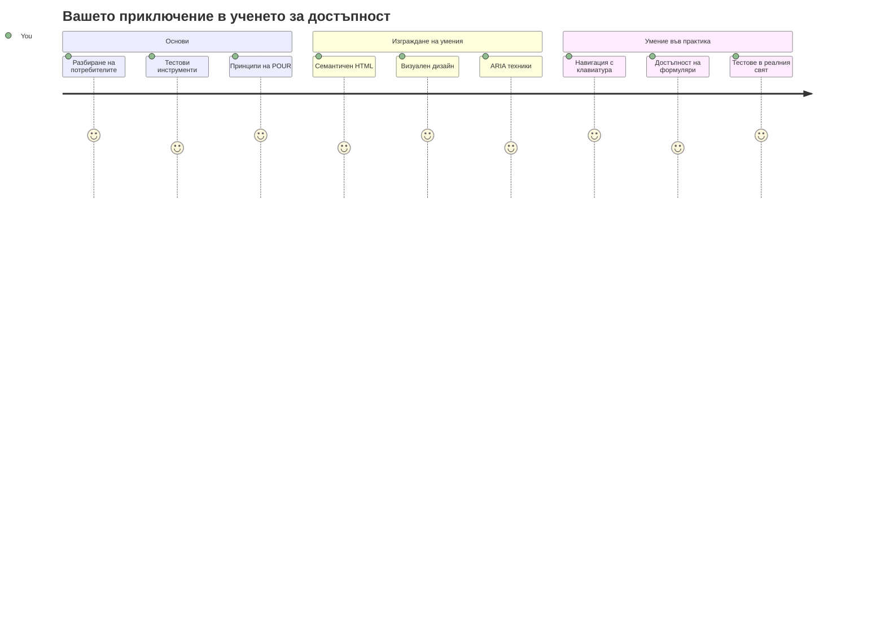
## Въпросник преди урока
[Въпросник преди урока](https://ff-quizzes.netlify.app/web/)

> Силата на уеб е в неговата универсалност. Достъпът за всички, независимо от увреждане, е съществен аспект.
>
> \- сър Тимъти Бърнърс-Лий, директор на W3C и изобретател на Световния широк интернет

Ето нещо, което може да ви изненада: когато създавате достъпни уебсайтове, вие не просто помагате на хора с увреждания — вие всъщност правите уеб по-добър за всички!

Забелязвали ли сте онези наклони на тротоарите на ъгловете? Първоначално са проектирани за инвалидни колички, но сега помагат на хора с детски колички, доставчици с колички, пътници с ролков багаж и колоездачи. Точно така работи достъпният уеб дизайн — решения, които помагат на една група, често в крайна сметка ползват всички. Доста готино, нали?

В този урок ще разгледаме как да създадем уебсайтове, които наистина работят за всички, без значение как сърфират в мрежата. Ще откриете практични техники, които вече са вградени в уеб стандартите, ще усвоите работа с тестови инструменти и ще видите как достъпността прави сайтовете ви по-лесни за използване за всички потребители.

Към края на урока ще имате увереност да направите достъпността естествена част от работния си процес на разработка. Готови ли сте да разгледаме как внимателните дизайнерски решения могат да отворят уеб за милиарди потребители? Да започваме!

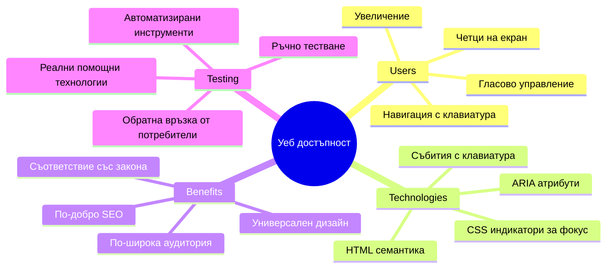
> Можете да преминете този урок в [Microsoft Learn](https://docs.microsoft.com/learn/modules/web-development-101/accessibility/?WT.mc_id=academic-77807-sagibbon)!

## Разбиране на помощните технологии

Преди да започнем с кодирането, нека отделим миг да разберем как хора с различни способности всъщност преживяват уеб. Това не е само теория — разбирането на тези реални навигационни модели ще ви направи много по-добър разработчик!

Помощните технологии са наистина впечатляващи инструменти, които помагат на хора с увреждания да взаимодействат с уебсайтове по начини, които може да ви изненадат. След като схванете как работят тези технологии, създаването на достъпни уеб преживявания става много по-интуитивно. Това е като да се научите да виждате кода си през очите на друг човек.

### Четещи екрани

[Четещи екрани](https://en.wikipedia.org/wiki/Screen_reader) са доста сложни технологии, които преобразуват цифровия текст в реч или брайлова изходна информация. Макар да се използват главно от хора с увреждания на зрението, те са много полезни и за потребители с обучителни затруднения като дислексия.

Обичам да си представям четещия екран като много умен разказвач, който чете книга на глас. Той чете съдържанието на глас в логичен ред, обявява интерактивни елементи като "бутон" или "връзка" и осигурява клавишни комбинации за бързо придвижване из страницата. Но ето нещо — четещите екрани могат да работят магически само ако създаваме сайтове с правилна структура и смислено съдържание. Тук идвате вие като разработчик!

**Популярни четещи екрани по платформи:**
- **Windows**: [NVDA](https://www.nvaccess.org/about-nvda/) (безплатен и най-популярен), [JAWS](https://webaim.org/articles/jaws/), [Narrator](https://support.microsoft.com/windows/complete-guide-to-narrator-e4397a0d-ef4f-b386-d8ae-c172f109bdb1/?WT.mc_id=academic-77807-sagibbon) (вграден)
- **macOS/iOS**: [VoiceOver](https://support.apple.com/guide/voiceover/welcome/10) (вграден и много способен)
- **Android**: [TalkBack](https://support.google.com/accessibility/android/answer/6283677) (вграден)
- **Linux**: [Orca](https://wiki.gnome.org/Projects/Orca) (безплатен и с отворен код)

**Как четещите екрани навигират уеб съдържание:**

Четещите екрани предлагат няколко метода за навигация, които правят сърфирането ефективно за опитни потребители:
- **Последователно четене**: Чете съдържанието от горе до долу, като следване на книга
- **Навигация по ориентири**: Прескачане между секции на страница (заглавие, навигация, основна част, долен колонтитул)
- **Навигация по заглавия**: Прескачане между заглавия за разбиране на структурата на страницата
- **Списъци с връзки**: Генериране на списък с всички връзки за бърз достъп
- **Управление на формуляри**: Навигация директно между полетата за въвеждане и бутоните

> 💡 **Ето нещо, което ме удиви**: 68% от потребителите на четещи екрани навигират предимно чрез заглавията ([WebAIM Survey](https://webaim.org/projects/screenreadersurvey9/#finding)). Това означава, че структурата на заглавията ви е като пътна карта за потребителите — когато е направена правилно, вие буквално им помагате да се ориентират по-бързо във вашето съдържание!

### Създаване на вашия тестови работен процес

Имам добра новина — ефективното тестване на достъпността не трябва да е претоварващо! Желаете да комбинирате автоматизирани инструменти (те са фантастични за откриване на очевидни проблеми) с ръчно тестване. Ето систематичен подход, който съм открил, че улавя най-много проблеми, без да ви отнема цял ден:

**Основен работен процес за ръчно тестване:**

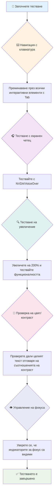
**Стъпка по стъпка контролен списък за тестове:**
1. **Навигация с клавиатура**: Използвайте само Tab, Shift+Tab, Enter, Space и стрелките
2. **Тестване с четещ екран**: Включете NVDA, VoiceOver или Narrator и навигирайте с затворени очи
3. **Тестване на увеличение**: Тествайте на нива 200% и 400%
4. **Проверка на цветен контраст**: Проверете целия текст и UI компоненти
5. **Тестване на индикатор за фокус**: Уверете се, че всички интерактивни елементи имат видими фокусни състояния

✅ **Започнете с Lighthouse**: Отворете DevTools на браузъра, стартирайте Lighthouse одит за достъпност и използвайте резултатите, за да насочите ръчното си тестване.

### Инструменти за увеличение и мащабиране

Знаете как понякога щипете за увеличение на телефона си, когато текстът е твърде малък, или присвивате очи към екрана на лаптопа под ярка слънчева светлина? Много потребители разчитат на инструменти за мащабиране, за да направят съдържанието четливо всеки ден. Това включва хора с понижено зрение, възрастни хора и всеки, който е опитвал да чете уебсайт навън.

Съвременните технологии за увеличение вече са повече от просто уголемяване. Разбирането как работят тези инструменти ще ви помогне да създавате адаптивни дизайни, които остават функционални и привлекателни при всяко ниво на мащабиране.

**Възможности за увеличение на съвременните браузъри:**
- **Увеличаване на страницата**: Пропорционално мащабиране на цялото съдържание (текст, изображения, оформление) – това е предпочитаният метод
- **Увеличаване само на текста**: Увеличава размера на шрифта, като запазва оригиналното оформление
- **Пиниране за увеличение**: Поддръжка на жестове за временно мащабиране на мобилни устройства
- **Поддръжка от браузърите**: Всички съвременни браузъри поддържат увеличение до 500% без да нарушават функционалността

**Специализиран софтуер за мащабиране:**
- **Windows**: [Magnifier](https://support.microsoft.com/windows/use-magnifier-to-make-things-on-the-screen-easier-to-see-414948ba-8b1c-d3bd-8615-0e5e32204198) (вграден), [ZoomText](https://www.freedomscientific.com/training/zoomtext/getting-started/)
- **macOS/iOS**: [Zoom](https://www.apple.com/accessibility/mac/vision/) (вграден с разширени функции)

> ⚠️ **Дизайнерска препоръка**: WCAG изисква съдържанието да остане функционално при мащабиране до 200%. На това ниво хоризонталното скролиране трябва да бъде минимално, а всички интерактивни елементи да останат достъпни.

✅ **Тествайте адаптивния си дизайн**: Увеличете браузъра си на 200% и 400%. Адаптира ли се оформлението плавно? Все още ли имате достъп до цялата функционалност без прекомерно скролиране?

## Съвременни инструменти за тестване на достъпност

Сега, след като разбирате как хората навигират в уеб с помощни технологии, нека разгледаме инструментите, които ви помагат да създавате и тествате достъпни уебсайтове.

Мислете за това така: автоматизираните инструменти са отлични за намиране на очевидни проблеми (като липсващ alt текст), докато ръчното тестване ви помага да се уверите, че сайтът е удобен за използване в реалния свят. Заедно те ви дават увереност, че вашите сайтове работят за всички.

### Тестване на цветен контраст

Имам добра новина: цветният контраст е един от най-често срещаните проблеми с достъпността, но е и един от най-лесните за коригиране. Добър контраст е полезен за всички — от потребители със зрителни увреждания до хора, които се опитват да четат телефоните си на плажа.

**Изисквания на WCAG за контраст:**

| Вид текст | WCAG AA (Минимално) | WCAG AAA (Подобрен) |
|-----------|---------------------|---------------------|
| **Обикновен текст** (под 18pt) | съотношение 4.5:1 | съотношение 7:1 |
| **Голям текст** (над 18pt или над 14pt удебелен) | съотношение 3:1 | съотношение 4.5:1 |
| **UI компоненти** (бутони, граници на формуляри) | съотношение 3:1 | съотношение 3:1 |

**Основни инструменти за тестване:**
- [Colour Contrast Analyser](https://www.tpgi.com/color-contrast-checker/) - Десктоп приложение с избор на цветове
- [WebAIM Contrast Checker](https://webaim.org/resources/contrastchecker/) - Уеб базиран с незабавна обратна връзка
- [Stark](https://www.getstark.co/) - Плъгин за дизайнерски инструменти като Figma, Sketch, Adobe XD
- [Accessible Colors](https://accessible-colors.com/) - Намиране на достъпни цветови палитри

✅ **Създавайте по-добри цветови палитри**: Започнете с цветовете на вашата марка и използвайте проверяващи контраста инструменти, за да създадете достъпни варианти. Документирайте ги като достъпни цветови токени във вашата дизайнерска система.

### Цялостен достъпен одит

Най-ефективният тест за достъпност комбинира няколко подхода. Нито един инструмент не улавя всичко, затова изграждането на рутинен тест с различни методи осигурява пълно покритие.

**Тестване в браузъра (вградено в DevTools):**
- **Chrome/Edge**: Одит за достъпност с Lighthouse + панел Accessibility
- **Firefox**: Accessibility Inspector с подробен дървовиден изглед
- **Safari**: Одит в Web Inspector с симулация на VoiceOver

**Професионални разширения за тестване:**
- [axe DevTools](https://www.deque.com/axe/devtools/) - Стандарт в индустрията за автоматизирано тестване
- [WAVE](https://wave.webaim.org/extension/) - Визуална обратна връзка с маркиране на грешки
- [Accessibility Insights](https://accessibilityinsights.io/) - Комплексен тестов пакет на Microsoft

**Команден ред и интеграция CI/CD:**
- [axe-core](https://github.com/dequelabs/axe-core) - JavaScript библиотека за автоматизирано тестване
- [Pa11y](https://pa11y.org/) - Команден инструмент за тестване на достъпност
- [Lighthouse CI](https://github.com/GoogleChrome/lighthouse-ci) - Автоматизирано оценяване на достъпност

> 🎯 **Цел на тестването**: Стремете се към резултат от 95+ на Lighthouse като базова линия. Запомнете, автоматизираните инструменти улавят само около 30-40% от проблемите с достъпността — ръчното тестване остава задължително!

### 🧠 **Проверка на умения: Готови ли сте да откривате проблеми?**

**Нека проверим как се чувствате по отношение на тестването на достъпност:**
- Кой метод на тестване ви се струва най-достъпен в момента?
- Можете ли да си представите да използвате навигация само с клавиатура за цял ден?
- Кой е един бариерен проблем с достъпността, който лично сте изпитали онлайн?

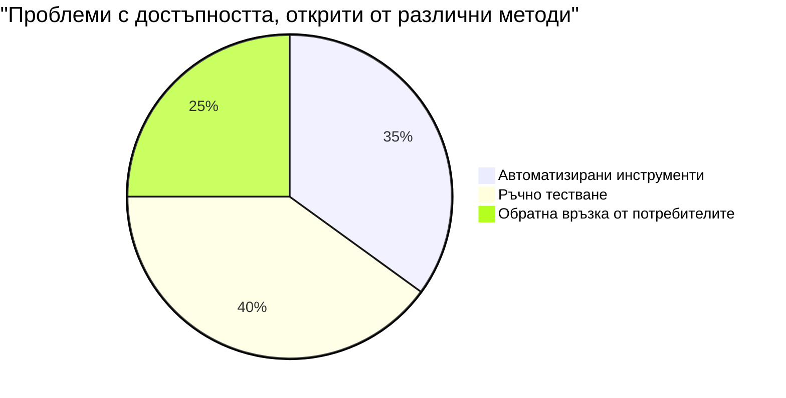
> **Подсилващ увереността съвет**: Професионалните тестери на достъпност използват точно това съчетание от методи. Вие усвоявате индустриални практики!

## Изграждане на достъпност от основата

Ключът към успеха в достъпността е да я вградите от самото начало. Знам, че е изкушаващо да мислите „Ще добавя достъпността по-късно“, но това е като да опитвате да добавите рампа след като домът вече е построен. Възможно ли е? Да. Лесно ли е? Не наистина.

Представете си достъпността като планиране на къща — много по-лесно е да включите достъпност за инвалиди в първоначалните архитектурни планове, отколкото да я пригодите впоследствие.

### Принципите POUR: основата на вашата достъпност

Уеб стандартите за достъпност (WCAG) се основават на четири основни принципа, които образуват акронима POUR. Не се безпокойте — това не са сухи академични понятия! Те са практични насоки за създаване на съдържание, което работи за всички.

След като овладеете POUR, вземането на решения за достъпност става много по-интуитивно. Това е като да имате ментален контролен списък, който води дизайнерските ви избори. Нека ги разгледаме подробно:

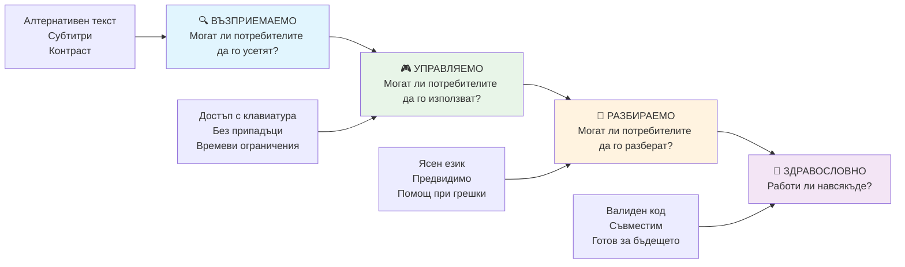
**🔍 Възприемаемо**: Информацията трябва да бъде представена по начини, които потребителите могат да възприемат чрез наличните им сетива

- Предоставете текстови алтернативи за нехудожествено съдържание (изображения, видеа, аудио)
- Осигурете достатъчен цветен контраст за всички текстове и UI компоненти
- Предлагайте субтитри и транскрипти за мултимедийно съдържание
- Дизайн на съдържание, което остава функционално при преподреждане до 200%
- Използвайте различни сетивни характеристики (не само цвят) за предаване на информация

**🎮 Операбилно**: Всички интерфейсни компоненти трябва да бъдат оперирани чрез наличните входни методи

- Направете цялата функционалност достъпна чрез клавиатурна навигация
- Осигурете достатъчно време на потребителите за четене и взаимодействие със съдържанието
- Избягвайте съдържание, което причинява припадъци или вестибуларни нарушения
- Помагайте на потребителите да навигират ефективно чрез ясна структура и ориентири
- Осигурете подходящи размери за интерактивните елементи (минимум 44px)

**📖 Разбираемо**: Информацията и управлението на интерфейса трябва да са ясни и разбираеми

- Използвайте ясен, прост език, подходящ за аудиторията ви
- Осигурете съдържанието да се появява и функционира по предвидими и постоянни начини
- Предлагайте ясни инструкции и съобщения за грешки при потребителски вход
- Помагайте на потребителите да разбират и коригират грешки във формите
- Организирайте съдържанието с логичен ред на четене и информационна йерархия

**💪 Здрав**: Съдържанието трябва да работи надеждно с различни технологии и помощни устройства

- **Използвайте валиден, семантичен HTML като основа**
- **Осигурете съвместимост с настоящи и бъдещи помощни технологии**
- **Спазвайте уеб стандартите и най-добрите практики при маркирането**
- **Тествайте в различни браузъри, устройства и помощни инструменти**
- **Структурирайте съдържанието така, че да се деградира плавно, когато разширени функции не се поддържат**

### 🎯 **Проверка на принципите POUR: Как да ги запазим**

**Бърза рефлексия върху основите:**
- Можете ли да си спомните уеб функция, която не успява при всеки принцип от POUR?
- Кой принцип ви се струва най-естествен като разработчик?
- Как тези принципи биха подобрили дизайна за всички, а не само за потребители с увреждания?

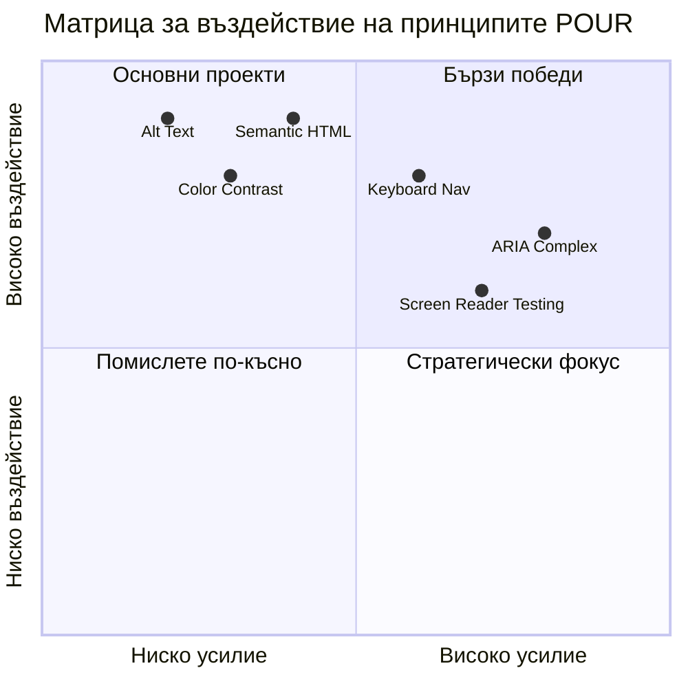
> **Запомнете**: Започнете с подобрения с голямо въздействие и малко усилия. Семантичен HTML и alt текст предоставят най-голям достъпностен бонус с минимални усилия!

## Създаване на достъпен визуален дизайн

Добър визуален дизайн и достъпността вървят ръка за ръка. Когато проектирате с мисъл за достъпността, често откривате, че тези ограничения водят до по-чисти, по-елегантни решения, които са полезни за всички потребители.

Нека разгледаме как да създадем визуално привлекателни дизайни, които работят за всички, независимо от техните зрителни способности или условията, при които разглеждат вашето съдържание.

### Стратегии за цвят и визуална достъпност

Цветът е мощен инструмент за комуникация, но никога не трябва да бъде единственият начин за предаване на важна информация. Проектирането отвъд използването само на цветове създава по-здрави, всеобхватни изживявания, които работят в повече ситуации.

**Проектирайте за различия във възприятията на цветовете:**

Приблизително 8% от мъжете и 0.5% от жените имат някаква форма на разлика във възприемането на цветовете (често наричана "цветна слепота"). Най-честите типове са:
- **Дейтеранопия**: Трудност при различаване на червено и зелено
- **Протанопия**: Червеното изглежда по-бледо
- **Тританопия**: Трудност с синьо и жълто (рядко)

**Инклузивни стратегии за цветове:**

```css
/* ❌ Bad: Using only color to indicate status */
.error { color: red; }
.success { color: green; }

/* ✅ Good: Color plus icons and context */
.error {
  color: #d32f2f;
  border-left: 4px solid #d32f2f;
}
.error::before {
  content: "⚠️";
  margin-right: 8px;
}

.success {
  color: #2e7d32;
  border-left: 4px solid #2e7d32;
}
.success::before {
  content: "✅";
  margin-right: 8px;
}
```

**Отвъд основните изисквания за контраст:**
- Тествайте избора на цветове с помощта на симулатори за цветна слепота
- Използвайте модели, текстури или форми заедно с кодиране с цветове
- Уверете се, че интерактивните състояния остават разпознаваеми и без цвят
- Обмислете как вашият дизайн изглежда в режим на висок контраст

✅ **Тествайте вашата цветова достъпност**: Използвайте инструменти като [Coblis](https://www.color-blindness.com/coblis-color-blindness-simulator/), за да видите как изглежда вашият сайт за потребители с различни видове цветно зрение.

### Индикатори за фокус и дизайн на взаимодействието

Индикаторите за фокус са цифровият еквивалент на курсора — те показват на потребителите, използващи клавиатура, къде се намират на страницата. Добре проектираните индикатори за фокус подобряват преживяването за всички, като правят взаимодействията ясни и предвидими.

**Най-добри практики за модерни индикатори за фокус:**

```css
/* Enhanced focus styles that work across browsers */
button:focus-visible {
  outline: 2px solid #0066cc;
  outline-offset: 2px;
  box-shadow: 0 0 0 4px rgba(0, 102, 204, 0.25);
}

/* Remove focus outline for mouse users, preserve for keyboard users */
button:focus:not(:focus-visible) {
  outline: none;
}

/* Focus-within for complex components */
.card:focus-within {
  box-shadow: 0 0 0 3px rgba(74, 144, 164, 0.5);
  border-color: #4A90A4;
}

/* Ensure focus indicators meet contrast requirements */
.custom-focus:focus-visible {
  outline: 3px solid #ffffff;
  outline-offset: 2px;
  box-shadow: 0 0 0 6px #000000;
}
```

**Изисквания за индикатори за фокус:**
- **Видимост**: Трябва да има контраст поне 3:1 спрямо околните елементи
- **Ширина**: Минимална дебелина 2px около целия елемент
- **Постоянство**: Трябва да остава видим, докато фокусът не се премести някъде другаде
- **Различимост**: Трябва да е визуално различим от други състояния на UI

> 💡 **Съвет при проектиране**: Отличните индикатори често използват комбинация от контур, сянка и промени в цвета, за да осигурят видимост на различни фонове и в различни контексти.

✅ **Проведете одит на индикаторите за фокус**: Навигирайте с таб клавиша през вашия сайт и отбележете кои елементи имат ясни индикатори за фокус. Има ли някой, който е труден за виждане или липсва напълно?

### Семантичен HTML: Основата на достъпността

Семантичният HTML е като да дадете на помощните технологии GPS система за вашият уебсайт. Когато използвате правилните HTML елементи за предназначението им, вие практически предоставяте на екранните четци, клавиатурите и другите инструменти подробна карта, която помага на потребителите да навигират ефективно.

Ето една аналогия, която много ми помогна: семантичният HTML е разликата между добре организирана библиотека с ясни категории и указателни табели и склад, където книгите са разпръснати на случаен принцип. И в двата случая има еднакви книги, но в кое място бихте предпочели да търсите нещо? Точно така!

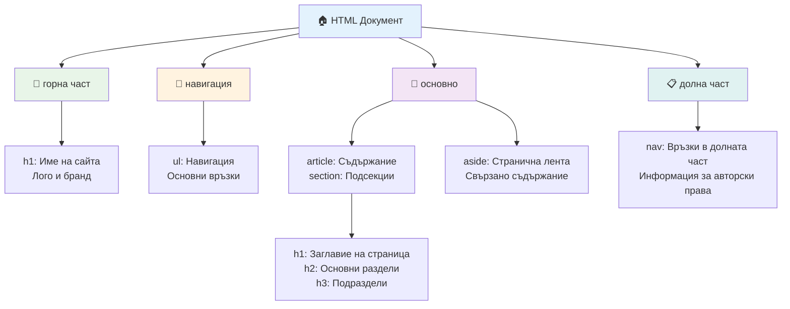
**Строителни блокове на достъпната структура на страницата:**

```html
<!-- Landmark elements provide page navigation structure -->
<header>
  <h1>Your Site Name</h1>
  <nav aria-label="Main navigation">
    <ul>
      <li><a href="/home">Home</a></li>
      <li><a href="/about">About</a></li>
      <li><a href="/services">Services</a></li>
    </ul>
  </nav>
</header>

<main>
  <article>
    <header>
      <h1>Article Title</h1>
      <p>Published on <time datetime="2024-10-14">October 14, 2024</time></p>
    </header>
    
    <section>
      <h2>First Section</h2>
      <p>Content that relates to this section...</p>
    </section>
    
    <section>
      <h2>Second Section</h2>
      <p>More related content...</p>
    </section>
  </article>
  
  <aside>
    <h2>Related Links</h2>
    <nav aria-label="Related articles">
      <ul>
        <li><a href="/related-1">First related article</a></li>
        <li><a href="/related-2">Second related article</a></li>
      </ul>
    </nav>
  </aside>
</main>

<footer>
  <p>&copy; 2024 Your Site Name. All rights reserved.</p>
  <nav aria-label="Footer links">
    <ul>
      <li><a href="/privacy">Privacy Policy</a></li>
      <li><a href="/contact">Contact Us</a></li>
    </ul>
  </nav>
</footer>
```

**Защо семантичният HTML трансформира достъпността:**

| Семантичен елемент | Предназначение | Полза за екранен четец |
|--------------------|---------------|-----------------------|
| `<header>` | Заглавие на страница или секция | "Banner landmark" - бърза навигация към върха |
| `<nav>` | Навигационни линкове | "Navigation landmark" - списък с навигационни секции |
| `<main>` | Основно съдържание на страницата | "Main landmark" - прескачане директно към съдържанието |
| `<article>` | Самостоятелно съдържание | Обявява границите на статията |
| `<section>` | Тематични групи съдържание | Осигурява структура на съдържанието |
| `<aside>` | Свързано съдържание в странична колона | "Complementary landmark" |
| `<footer>` | Долна част на страница или секция | "Contentinfo landmark" |

**Суперсили на екранните четци със семантичен HTML:**
- **Навигация чрез ориентири:** Можете да прескачате веднага между основните секции на страницата
- **Очертания на заглавия:** Генерират съдържание от структурата на заглавията
- **Списъци с елементи:** Създават списъци с всички връзки, бутони или контроли на формуляри
- **Осъзнаване на контекста:** Разбиране на връзки между секциите съдържание

> 🎯 **Бърз тест**: Опитайте да навигирате сайта си с екранен четец, използвайки бързи клавиши за ориентири (D за ориентир, H за заглавие, K за връзка в NVDA/JAWS). Логична ли е навигацията?

### 🏗️ **Проверка на уменията по семантичен HTML: Изграждане на здрави основи**

**Нека оценим вашето семантично разбиране:**
- Можете ли да идентифицирате ориентирите на уебстраница само по HTML-а?
- Как бихте обяснили разликата между `<section>` и `<div>` на приятел?
- Кое е първото нещо, което бихте проверили, ако потребител на екранен четец съобщи за проблем с навигацията?

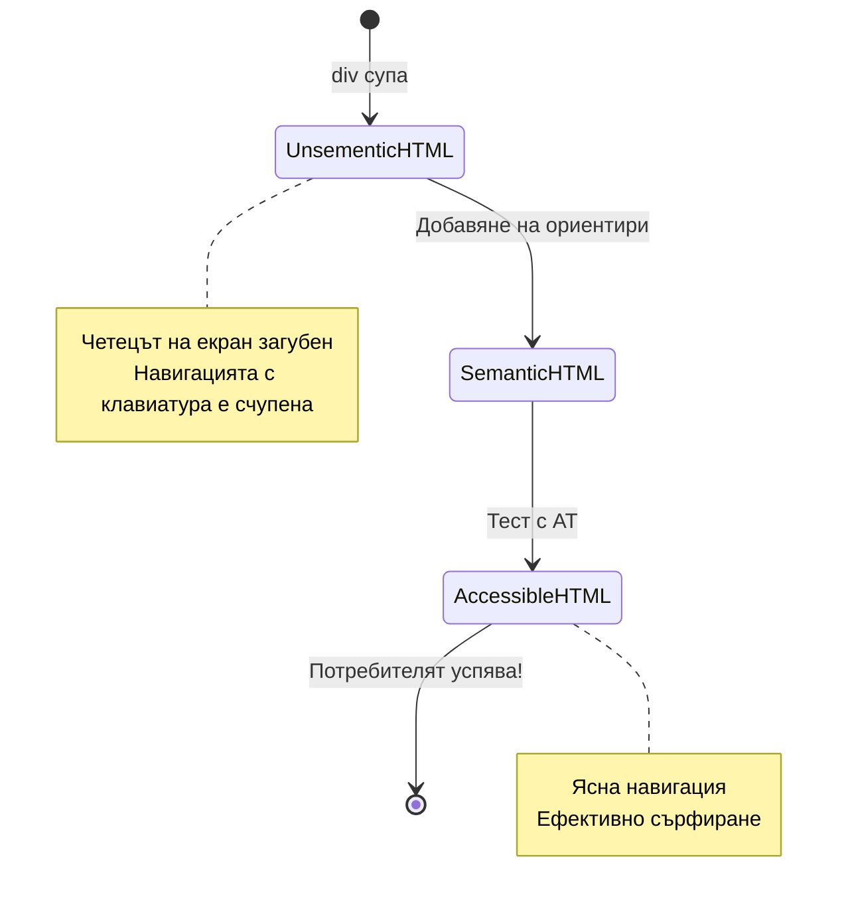
> **Професионален съвет**: Добър семантичен HTML решава около 70% от проблемите с достъпността автоматично. Овладейте тази основа и сте на прав път!

✅ **Одитирайте семантичната си структура**: Използвайте панела за достъпност в DevTools на браузъра си, за да разгледате дървото за достъпност и да се уверите, че вашата маркировка създава логична структура.

### Иерархия на заглавията: Създаване на логически контур на съдържанието

Заглавията са абсолютно важни за достъпното съдържание — те са като гръбнакът, който държи всичко заедно. Потребителите на екранни четци силно разчитат на заглавията, за да разберат и навигират в съдържанието. Мислете за това като предоставяне на съдържание за вашата страница.

**Ето златното правило за заглавията:**
Никога не прескачайте нива. Винаги преминавайте логично от `<h1>` към `<h2>`, след това към `<h3>` и т.н. Спомняте ли си подредбите на есета в училище? Това е точно същия принцип — не бихте скочили от "I. Главна точка" направо на "C. Под-подточка" без "A. Подточка" между тях, нали?

**Пример за перфектна структура на заглавията:**

```html
<!-- ✅ Excellent: Logical, hierarchical progression -->
<main>
  <h1>Complete Guide to Web Accessibility</h1>
  
  <section>
    <h2>Understanding Screen Readers</h2>
    <p>Introduction to screen reader technology...</p>
    
    <h3>Popular Screen Reader Software</h3>
    <p>NVDA, JAWS, and VoiceOver comparison...</p>
    
    <h3>Testing with Screen Readers</h3>
    <p>Step-by-step testing instructions...</p>
  </section>
  
  <section>
    <h2>Color and Contrast Guidelines</h2>
    <p>Designing with sufficient contrast...</p>
    
    <h3>WCAG Contrast Requirements</h3>
    <p>Understanding the different contrast levels...</p>
    
    <h3>Testing Tools and Techniques</h3>
    <p>Tools for verifying contrast ratios...</p>
  </section>
</main>
```

```html
<!-- ❌ Problematic: Skipping levels, inconsistent structure -->
<h1>Page Title</h1>
<h3>Subsection</h3> <!-- Skipped h2 -->
<h2>This should come before h3</h2>
<h1>Another main heading?</h1> <!-- Multiple h1s -->
```

**Най-добри практики за заглавия:**
- **Едно `<h1>` на страница**: Обикновено главното заглавие на страницата или основното заглавие на съдържанието
- **Логично прогресиране**: Никога не прескачайте нива (h1 → h2 → h3, не h1 → h3)
- **Описателно съдържание**: Правете заглавията значими, когато се четат извън контекст
- **Визуално стилизиране с CSS**: Използвайте CSS за външен вид, нива на HTML за структура

**Статистика за навигация чрез заглавия на екранни четци:**
- 68% от потребителите навигират чрез заглавия ([WebAIM Survey](https://webaim.org/projects/screenreadersurvey9/#finding))
- Потребителите очакват да намерят логична структура на заглавията
- Заглавията осигуряват най-бързия начин да се разбере структурата на страницата

> 💡 **Професионален съвет**: Използвайте разширения за браузър като "HeadingsMap", за да визуализирате структурата на заглавията си. Тя трябва да изглежда като добре организирано съдържание.

✅ **Проверете структурата на заглавията**: Използвайте навигация чрез заглавия на екранен четец (клавиш H в NVDA) за да прескачате през заглавията. Разказва ли тази прогресия логично историята на вашето съдържание?

### Разширени техники за визуална достъпност

Отвъд основите на контраста и цветовете има усъвършенствани методи, които помагат да се създадат наистина инклузивни визуални изживявания. Тези методи гарантират, че съдържанието ви работи при различни условия на преглед и с помощни технологии.

**Основни стратегии за визуална комуникация:**

- **Мултимодална обратна връзка:** Комбинира визуални, текстови и понякога аудио сигнали
- **Прогресивно разкриване:** Представяне на информация на лесно усвоими части
- **Последователни модели на взаимодействие:** Използвайте познати UI конвенции
- **Отзивчива типография:** Оразмерявайте текста подходящо за различни устройства
- **Състояния при зареждане и грешки:** Осигурявайте ясна обратна връзка за всички потребителски действия

**CSS помощни средства за подобрена достъпност:**

```css
/* Screen reader only text - visually hidden but accessible */
.sr-only {
  position: absolute;
  width: 1px;
  height: 1px;
  padding: 0;
  margin: -1px;
  overflow: hidden;
  clip: rect(0, 0, 0, 0);
  white-space: nowrap;
  border: 0;
}

/* Skip link for keyboard navigation */
.skip-link {
  position: absolute;
  top: -40px;
  left: 6px;
  background: #000000;
  color: #ffffff;
  padding: 8px 16px;
  text-decoration: none;
  border-radius: 4px;
  font-weight: bold;
  transition: top 0.3s ease;
  z-index: 1000;
}

.skip-link:focus {
  top: 6px;
}

/* Reduced motion respect */
@media (prefers-reduced-motion: reduce) {
  .skip-link {
    transition: none;
  }
  
  * {
    animation-duration: 0.01ms !important;
    animation-iteration-count: 1 !important;
    transition-duration: 0.01ms !important;
  }
}

/* High contrast mode support */
@media (prefers-contrast: high) {
  .button {
    border: 2px solid;
  }
}
```

> 🎯 **Достъпностен модел**: „skip link“ е задължителен за потребителите на клавиатура. Той трябва да е първият фокусируем елемент на страницата и трябва да позволява директно преминаване към основното съдържание.

✅ **Внедрете пропуск за навигация**: Добавете пропускащи връзки към страниците си и ги тествайте като натискате Tab веднага след зареждането на страницата. Те трябва да се появят и да позволяват да скача към основно съдържание.

## Създаване на смислен текст за връзки

Връзките са магистралите на мрежата, но лошо написаният текст на връзките е като пътни табели, които казват само "Място" вместо "Център на Чикаго." Не много полезно, нали?

Ето нещо, което ме удиви, когато го научих: екранните четци могат да извлекат всички връзки от страница и да ги покажат като един голям списък. Представете си, че някой ви даде директория на всяка връзка на вашата страница. Всеки един от тях би ли имал смисъл сам по себе си? Това е тестът, който вашият текст на връзките трябва да издържи!

### Разбиране на моделите за навигация чрез връзки

Екранните четци предлагат мощни функции за навигация през връзки, които разчитат на добре написани текстове на връзки:

**Методи за навигация:**
- **Последователно четене**: Връзките се четат в контекста като част от съдържанието
- **Генериране на списък с връзки**: Всички връзки от страницата се компилират в търсена директория
- **Бърза навигация**: Скок между връзки с клавишни комбинации (K в NVDA)
- **Търсачка**: Намиране на конкретни връзки чрез въвеждане на част от текста

**Защо контекстът има значение:**
Когато потребители на екранен четец генерират списък с връзки, те виждат нещо като това:
- "Изтеглете доклад"
- "Научете повече"
- "Кликнете тук"
- "Политика за поверителност"
- "Кликнете тук"

Само две от тези връзки предоставят полезна информация, ако се четат без контекст!

> 📊 **Влияние върху потребителя**: Потребителите на екранен четец сканират списъците с връзки, за да разберат бързо съдържанието на страницата. Общите и неопределени текстове на връзки ги принуждават да се връщат към контекста всеки път, което значително забавя сърфирането.

### Чести грешки при текстовете на връзки, които да избягвате

Разбирането какво не работи ви помага да разпознаете и поправите достъпностните проблеми в съществуващото съдържание.

**❌ Общи текстове на връзки без контекст:**

```html
<!-- Meaningless when read from a link list -->
<p>Our sustainability efforts are detailed in our recent report. 
   <a href="/sustainability-2024.pdf">Click here</a> to view it.</p>

<!-- Repeated generic text throughout the page -->
<div class="article-card">
  <h3>Web Accessibility Guide</h3>
  <p>Learn the fundamentals...</p>
  <a href="/accessibility-guide">Read more</a>
</div>
<div class="article-card">
  <h3>Color Contrast Tips</h3>
  <p>Improve your design...</p>
  <a href="/color-contrast">Read more</a>
</div>

<!-- URLs as link text (difficult for screen readers to announce) -->
<p>Visit https://www.w3.org/WAI/WCAG21/quickref/ for WCAG guidelines.</p>

<!-- Vague action words -->
<a href="/contact">Go</a> | <a href="/about">See</a> | <a href="/help">View</a>
```

**Защо тези модели се провалят:**
- **"Кликнете тук"** не казва нищо за дестинацията
- **"Прочетете повече"** повтаряно многократно създава объркване
- **Сурови URL адреси** са трудни за произнасяне от екранните четци
- **Еднократни думи** като "Отиди" или "Виж" липсват описателен контекст

### Писане на отличен текст за връзки

Описателният текст на връзки е полезен за всички — виждащите потребители могат бързо да преглеждат връзките, а потребителите на екранни четци веднага разбират дестинациите.

**✅ Примери за ясен, описателен текст на връзки:**

```html
<!-- Descriptive text that explains the destination -->
<p>Our comprehensive <a href="/sustainability-2024.pdf">2024 sustainability report (PDF, 2.1MB)</a> details our environmental initiatives.</p>

<!-- Specific, unique link text for each card -->
<div class="article-card">
  <h3>Web Accessibility Guide</h3>
  <p>Learn the fundamentals of inclusive design...</p>
  <a href="/accessibility-guide">Read our complete web accessibility guide</a>
</div>
<div class="article-card">
  <h3>Color Contrast Tips</h3>
  <p>Improve your design with better color choices...</p>
  <a href="/color-contrast">Explore color contrast best practices</a>
</div>

<!-- Meaningful text instead of raw URLs -->
<p>The <a href="https://www.w3.org/WAI/WCAG21/quickref/">WCAG 2.1 Quick Reference guide</a> provides comprehensive accessibility guidelines.</p>

<!-- Descriptive action links -->
<a href="/contact">Contact our support team</a> | 
<a href="/about">About our company</a> | 
<a href="/help">Get help with your account</a>
```

**Най-добри практики за текст на връзки:**
- **Бъдете конкретни**: "Изтеглете тримесечния финансов доклад" вместо "Изтеглете"
- **Включвайте тип и размер на файла**: "(PDF, 1.2MB)" за изтегляеми файлове
- **Споменете ако линкът отваря външен прозорец**: "(отваря се в нов прозорец)" при необходимост
- **Използвайте действен език**: "Свържете се с нас" вместо "Страница за контакти"
- **Бъдете кратки**: Целете за 2-8 думи, когато е възможно

### Разширени модели за достъпност на връзки

Понякога ограничения в визуалния дизайн или технически изисквания налагат специални решения. Ето усъвършенствани техники за често срещани предизвикателни сценарии:

**Използване на ARIA за подобрен контекст:**

```html
<!-- When button text must be short but needs more context -->
<a href="/report.pdf" 
   aria-label="Download 2024 annual financial report, PDF format, 2.3MB">
  Download Report
</a>

<!-- When the full context comes from surrounding content -->
<h3 id="sustainability-heading">Sustainability Initiative</h3>
<p>Our efforts to reduce environmental impact...</p>
<a href="/sustainability-details" 
   aria-labelledby="sustainability-heading"
   aria-describedby="sustainability-summary">
  Learn more
</a>
<p id="sustainability-summary">Detailed breakdown of our 2024 environmental goals and achievements</p>
```

**Указване на типове файлове и външни дестинации:**

```html
<!-- Method 1: Include information in visible link text -->
<a href="/annual-report.pdf">
  Download our 2024 annual report (PDF, 2.3MB)
</a>

<!-- Method 2: Use screen reader-only text for file details -->
<a href="/annual-report.pdf">
  Download our 2024 annual report
  <span class="sr-only">(PDF format, 2.3MB)</span>
</a>

<!-- Method 3: External link indication -->
<a href="https://example.com" 
   target="_blank" 
   aria-describedby="external-link-warning">
  Visit external resource
</a>
<span id="external-link-warning" class="sr-only">
  (opens in new window)
</span>

<!-- Method 4: Using CSS for visual indicators -->
<a href="https://example.com" class="external-link">
  External resource
</a>
```

```css
/* Visual indicator for external links */
.external-link::after {
  content: " ↗";
  font-size: 0.8em;
  color: #666;
}

/* Screen reader announcement for external links */
.external-link::before {
  content: "External link: ";
  position: absolute;
  left: -10000px;
  width: 1px;
  height: 1px;
  overflow: hidden;
}
```

> ⚠️ **Важно**: Когато използвате `target="_blank"`, винаги информирайте потребителите, че връзката се отваря в нов прозорец или раздел. Неочакваните навигационни промени могат да бъдат дезориентиращи.

✅ **Тествайте контекста на вашите връзки**: Използвайте инструменти за разработчици на браузъра, за да генерирате списък с всички връзки на страницата. Можете ли да разберете предназначението на всяка връзка без контекст?

## ARIA: Усилване на достъпността на HTML

[Достъпни богати интернет приложения (ARIA)](https://developer.mozilla.org/docs/Web/Accessibility/ARIA) са като универсален преводач между вашите сложни уеб приложения и помощните технологии. Когато HTML сам по себе си не може да изрази всичко, което правят интерактивните ви компоненти, ARIA идва да попълни тези пропуски.

Обичам да мисля за ARIA като за добавяне на полезни пояснения към вашия HTML — нещо като сценични указания в театрален сценарий, които помагат на актьорите да разберат ролите и взаимоотношенията си.

**Най-важното правило за ARIA е:** Винаги първо използвайте семантичен HTML, след това добавяйте ARIA за подобрение. Мислете за ARIA като подправка, а не за основното ястие. Тя трябва да изяснява и подобрява структурата на вашия HTML, никога да я замества. Първо изградете здрава основа!

### Стратегическо внедряване на ARIA

ARIA е мощен, но с мощността идва и отговорност. Грешният ARIA може да направи достъпността по-лоша от липсата му. Ето кога и как да го използвате ефективно:

**✅ Използвайте ARIA, когато:**
- Създавате персонализирани интерактивни джаджи (акордеони, табове, карусели)
- Изграждате динамично съдържание, което се променя без презареждане на страницата
- Осигурявате допълнителен контекст за сложни UI връзки
- Индикирате състояния на зареждане или живи обновления на съдържание
- Създавате интерфейси, подобни на приложения, с персонализирани контроли

**❌ Избягвайте ARIA, когато:**
- Стандартните HTML елементи вече осигуряват необходимата семантика
- Не сте сигурни как да го имплементирате правилно
- Дублира информация, вече предоставена от семантичен HTML
- Не сте тествали с реална помощна технология

> 🎯 **Златно правило за ARIA**: "Не променяйте семантиката, освен ако е абсолютно необходимо, осигурявайте винаги достъпност с клавиатура, и тествайте с реална помощна технология."
**Петте категории на ARIA:**

1. **Роли**: Какъв е този елемент? (`button`, `tab`, `dialog`)
2. **Свойства**: Какви са неговите характеристики? (`aria-required`, `aria-haspopup`)
3. **Състояния**: Какво е текущото му състояние? (`aria-expanded`, `aria-checked`)
4. **Ориентиращи елементи**: Къде се намира в структурата на страницата? (`banner`, `navigation`, `main`)
5. **Активни области**: Как трябва да се обявяват промените? (`aria-live`, `aria-atomic`)

### Важни ARIA шаблони за съвременни уеб приложения

Тези шаблони решават най-честите предизвикателства по отношение на достъпността в интерактивните уеб приложения:

**Именуване и описване на елементи:**

```html
<!-- aria-label: Provides accessible name when visible text isn't sufficient -->
<button aria-label="Close newsletter subscription dialog">×</button>

<!-- aria-labelledby: References existing text as the accessible name -->
<section aria-labelledby="news-heading">
  <h2 id="news-heading">Latest News</h2>
  <!-- news content -->
</section>

<!-- aria-describedby: Links to additional descriptive text -->
<input type="password" 
       aria-describedby="pwd-requirements pwd-strength"
       required>
<div id="pwd-requirements">
  Password must contain at least 8 characters, including uppercase, lowercase, and numbers.
</div>
<div id="pwd-strength" aria-live="polite">
  <!-- Dynamic password strength indicator -->
</div>
```

**Активни области за динамично съдържание:**

```html
<!-- Polite announcements (don't interrupt current speech) -->
<div aria-live="polite" id="status-updates">
  <!-- Status messages appear here -->
</div>

<!-- Assertive announcements (interrupt and announce immediately) -->
<div aria-live="assertive" id="urgent-alerts">
  <!-- Error messages and critical alerts -->
</div>

<!-- Loading states with live regions -->
<button id="submit-btn" aria-describedby="loading-status">
  Submit Application
</button>
<div id="loading-status" aria-live="polite" aria-atomic="true">
  <!-- "Processing your application..." appears here -->
</div>
```

**Пример за интерактивен уиджет (акордеон):**

```html
<div class="accordion">
  <h3>
    <button aria-expanded="false" 
            aria-controls="panel-1" 
            id="accordion-trigger-1"
            class="accordion-trigger">
      Accessibility Guidelines
    </button>
  </h3>
  <div id="panel-1" 
       role="region"
       aria-labelledby="accordion-trigger-1" 
       hidden>
    <p>WCAG 2.1 provides comprehensive guidelines...</p>
  </div>
</div>
```

```javascript
// JavaScript за управление на състоянието на акордеона
function toggleAccordion(trigger) {
  const panel = document.getElementById(trigger.getAttribute('aria-controls'));
  const isExpanded = trigger.getAttribute('aria-expanded') === 'true';
  
  // Превключване на състоянията
  trigger.setAttribute('aria-expanded', !isExpanded);
  panel.hidden = isExpanded;
  
  // Обявяване на промяната за екранни четци
  const status = document.getElementById('status-updates');
  status.textContent = isExpanded ? 'Section collapsed' : 'Section expanded';
}
```

### Най-добри практики за имплементация на ARIA

ARIA е мощен, но изисква внимателна имплементация. Следването на тези насоки помага да се гарантира, че вашият ARIA подобрява, а не затруднява достъпността:

**🛡️ Основни принципи:**

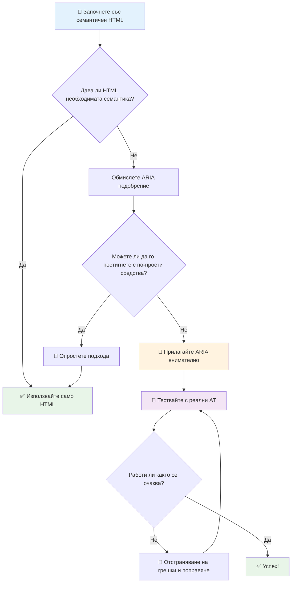
1. **Първо семантичен HTML**: Винаги предпочитайте `<button>` пред `<div role="button">`
2. **Не нарушавайте семантиката**: Никога не презаписвайте значението на съществуващ HTML (избягвайте `<h1 role="button">`)
3. **Поддържайте достъпност с клавиатура**: Всички интерактивни ARIA елементи трябва да са напълно достъпни с клавиатура
4. **Тествайте с реални потребители**: Поддръжката на ARIA варира значително между асистивните технологии
5. **Започнете просто**: Сложните ARIA имплементации имат по-голям риск от грешки

**🔍 Работен процес за тестване:**

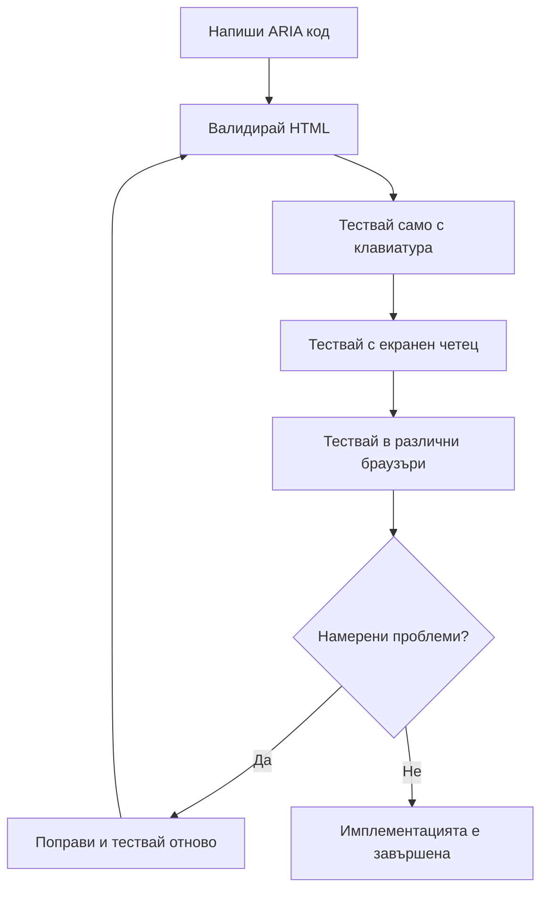
**🚫 Чести грешки с ARIA, които трябва да се избягват:**

- **Противоречива информация**: Не противоречете на семантиката на HTML
- **Прекомерно маркиране**: Прекалено много ARIA информация затруднява потребителите
- **Статичен ARIA**: Забравяне за обновяване на ARIA състояния при промяна на съдържанието
- **Нетестувани имплементации**: ARIA, която работи теоретично, но не и на практика
- **Липса на поддръжка за клавиатура**: ARIA роли без съответни клавиатурни взаимодействия

> 💡 **Ресурси за тестване**: Използвайте инструменти като [accessibility-checker](https://www.npmjs.com/package/accessibility-checker) за автоматизирана валидация на ARIA, но винаги тествайте с реални четци на екран за пълния опит.

### 🎭 **Проверка на умения за ARIA: Готови ли сте за сложни взаимодействия?**

**Оценете увереността си с ARIA:**
- Кога бихте избрали ARIA пред семантичен HTML? (Подсказка: почти никога!)
- Можете ли да обясните защо `<div role="button">` обикновено е по-лошо от `<button>`?
- Кое е най-важното нещо, което да помните за ARIA тестването?

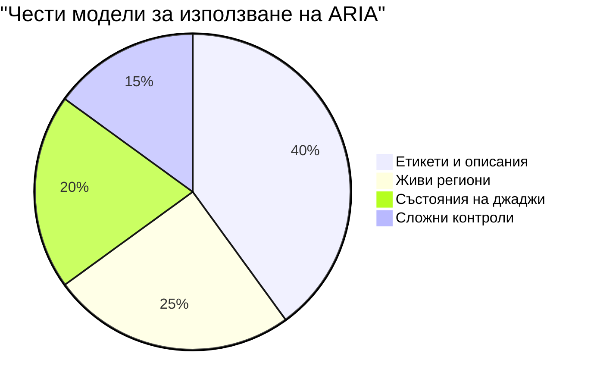
> **Ключова идея**: Повечето ARIA употреби са за маркиране и описване на елементи. Сложните уиджет шаблони са много по-редки, отколкото може да си мислите!

✅ **Учете се от експерти**: Изучавайте [ARIA Authoring Practices Guide](https://w3c.github.io/aria-practices/) за доказани шаблони и имплементации на сложни интерактивни уиджети.

## Направете изображенията и медията достъпни

Визуалното и аудио съдържание са основни части на съвременните уеб преживявания, но могат да създават бариери, ако не са реализирани внимателно. Целта е да се гарантира, че информацията и емоционалното въздействие на вашите медии достигат до всеки потребител. След като свикнете, това става второ естество.

Различните видове медии изискват различни подходи към достъпността. Това е като готвене — не бихте третирали деликатна риба по същия начин, по който бихте тръгнали с издръжливо месо. Разбирането на тези различия ви помага да изберете правилното решение за всяка ситуация.

### Стратегическа достъпност на изображенията

Всяко изображение на вашия уебсайт има цел. Разбирането на тази цел ви помага да напишете по-добър алтернативен текст и да създадете по-всеобхватни преживявания.

**Четири типа изображения и стратегии за alt текст:**

**Информиращи изображения** — предават важна информация:
```html

```

**Декоративни изображения** — чисто визуални, без информационна стойност:
```html

```

**Функционални изображения** — служат като бутони или контролни елементи:
```html
<button>
  
</button>
```

**Сложни изображения** — графики, диаграми, инфографики:
```html

<div id="chart-description">
  <p>Detailed description: Sales data shows a steady increase across all quarters...</p>
</div>
```

### Достъпност на видео и аудио

**Изисквания към видеото:**
- **Субтитри**: Текстова версия на говоримото съдържание и звуковите ефекти
- **Аудиоописания**: Озвучаване на визуални елементи за незрящи потребители
- **Транскрипти**: Пълен текст на всички аудио и визуални материали

```html
<video controls>
  <source src="video.mp4" type="video/mp4">
  <track kind="captions" src="captions.vtt" srclang="en" label="English">
  <track kind="descriptions" src="descriptions.vtt" srclang="en" label="Audio descriptions">
</video>
```

**Изисквания към аудиото:**
- **Транскрипти**: Текстова версия на цялата реч
- **Визуални индикатори**: За аудиосъдържание само, предлагайте визуални подсказки

### Съвременни техники за изображения

**Използване на CSS за декоративни изображения:**
```css
.hero-section {
  background-image: url('decorative-hero.jpg');
  /* Decorative images in CSS don't need alt text */
}
```

**Адаптивни изображения с достъпност:**
```html
<picture>
  <source media="(min-width: 800px)" srcset="large-chart.png">
  <source media="(min-width: 400px)" srcset="medium-chart.png">
  
</picture>
```

✅ **Тествайте достъпността на изображенията**: Използвайте четец на екран, за да навигирате в страница с изображения. Получавате ли достатъчно информация, за да разберете съдържанието?

## Клавиатурна навигация и управление на фокуса

Много потребители навигират из уеб с помощта само на клавиатурата. Това включва хора с двигателни увреждания, напреднали потребители, които намират клавиатурата за по-бърза от мишката, и всеки, чиято мишка е спряла да работи. Уверяването, че вашият сайт работи добре с клавиатура, е съществено и често прави сайта ви по-ефективен за всички.

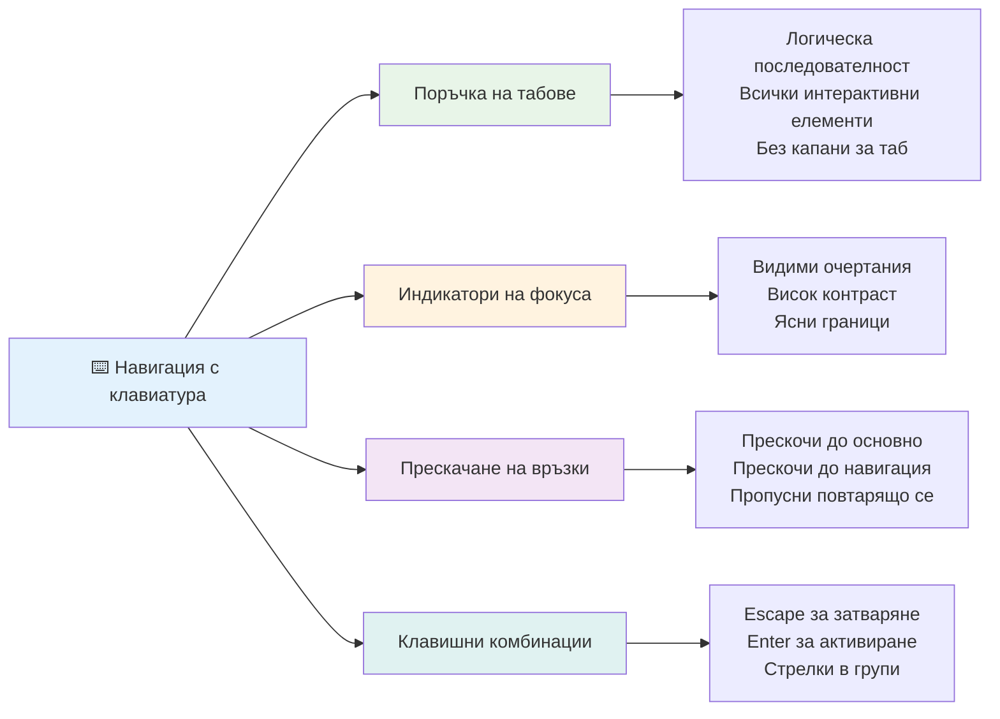
### Основни клавиатурни навигационни шаблони

**Стандартни клавиатурни взаимодействия:**
- **Tab**: Преместване на фокуса напред през интерактивните елементи
- **Shift + Tab**: Преместване на фокуса назад
- **Enter**: Активиране на бутони и връзки
- **Space**: Активиране на бутони, поставяне на отметки
- **Стрелки**: Навигация вътре в групи компоненти (радио бутони, менюта)
- **Escape**: Затваряне на модални прозорци, падащи менюта или отмяна на операции

### Най-добри практики за управление на фокуса

**Видими индикатори за фокус:**
```css
/* Ensure focus is always visible */
button:focus-visible {
  outline: 2px solid #4A90A4;
  outline-offset: 2px;
}

/* Custom focus styles for different components */
.card:focus-within {
  box-shadow: 0 0 0 3px rgba(74, 144, 164, 0.5);
}
```

**Прескачане на връзки за ефективна навигация:**
```html
<a href="#main-content" class="skip-link">Skip to main content</a>
<a href="#navigation" class="skip-link">Skip to navigation</a>

<nav id="navigation">
  <!-- navigation content -->
</nav>
<main id="main-content">
  <!-- main content -->
</main>
```

**Правилен ред на Tab:**
```html
<!-- Use semantic HTML for natural tab order -->
<form>
  <label for="name">Name:</label>
  <input type="text" id="name" tabindex="0">
  
  <label for="email">Email:</label>
  <input type="email" id="email" tabindex="0">
  
  <button type="submit" tabindex="0">Submit</button>
</form>
```

### Затваряне на фокуса в модални прозорци

При отваряне на модални диалози, фокусът трябва да бъде затворен в рамките на модала:

```javascript
// Съвременна реализация на фокусна капан
function trapFocus(element) {
  const focusableElements = element.querySelectorAll(
    'button, [href], input, select, textarea, [tabindex]:not([tabindex="-1"])'
  );
  
  const firstElement = focusableElements[0];
  const lastElement = focusableElements[focusableElements.length - 1];

  element.addEventListener('keydown', (e) => {
    if (e.key === 'Tab') {
      if (e.shiftKey && document.activeElement === firstElement) {
        e.preventDefault();
        lastElement.focus();
      } else if (!e.shiftKey && document.activeElement === lastElement) {
        e.preventDefault();
        firstElement.focus();
      }
    }
    
    if (e.key === 'Escape') {
      closeModal();
    }
  });
  
  // Фокусиране на първия елемент при отваряне на модален прозорец
  firstElement.focus();
}
```

✅ **Тествайте клавиатурната навигация**: Опитайте да навигирате сайта си само с клавиша Tab. Можете ли да достигнете до всички интерактивни елементи? Логичен ли е редът на фокус? Ясно ли са видими индикаторите за фокус?

## Достъпност на формуляри

Формулярите са критични за взаимодействието с потребителите и изискват специално внимание към достъпността.

### Свързване на етикети и контроли в формулярите

**Всеки контрол във формуляр трябва да има етикет:**
```html
<!-- Explicit labeling (preferred) -->
<label for="username">Username:</label>
<input type="text" id="username" name="username" required>

<!-- Implicit labeling -->
<label>
  Password:
  <input type="password" name="password" required>
</label>

<!-- Using aria-label when visual label isn't desired -->
<input type="search" aria-label="Search products" placeholder="Search...">
```

### Обработка и валидация на грешки

**Достъпни съобщения за грешки:**
```html
<label for="email">Email Address:</label>
<input type="email" id="email" name="email" 
       aria-describedby="email-error" 
       aria-invalid="true" required>
<div id="email-error" role="alert">
  Please enter a valid email address
</div>
```

**Най-добри практики при валидация на формуляри:**
- Използвайте `aria-invalid` за индикация на невалидни полета
- Осигурете ясни, конкретни съобщения за грешки
- Използвайте `role="alert"` за важни съобщения за грешки
- Показвайте грешките незабавно и при изпращане на формуляра

### Групиране и fieldsets

**Групирайте свързани контроли във формуляра:**
```html
<fieldset>
  <legend>Shipping Address</legend>
  <label for="street">Street Address:</label>
  <input type="text" id="street" name="street">
  
  <label for="city">City:</label>
  <input type="text" id="city" name="city">
</fieldset>

<fieldset>
  <legend>Preferred Contact Method</legend>
  <input type="radio" id="contact-email" name="contact" value="email">
  <label for="contact-email">Email</label>
  
  <input type="radio" id="contact-phone" name="contact" value="phone">
  <label for="contact-phone">Phone</label>
</fieldset>
```

## Вашето пътуване към достъпността: Основни изводи

Поздравления! Току-що придобихте основни знания за създаване на наистина всеобхватни уеб преживявания. Това е доста вълнуващо! Уеб достъпността не е просто отбелязване на полета — тя е разпознаване на разнообразните начини, по които хората взаимодействат с дигиталното съдържание, и проектиране за тази невероятна сложност.

Сега сте част от нарастваща общност от разработчици, които разбират, че страхотният дизайн работи за всеки. Добре дошли в клуба!

**🎯 Вашият комплект инструменти за достъпност вече включва:**

| Основен принцип           | Имплементация                                    | Въздействие                                             |
|--------------------------|-------------------------------------------------|---------------------------------------------------------|
| **Семантичен HTML**      | Използвайте правилните HTML елементи по предназначение | Четецът на екран навигира ефективно, клавиатурите работят автоматично |
| **Всеобхватен визуален дизайн** | Достатъчен контраст, смислена употреба на цветове, видими индикатори за фокус | Ясно за всеки при всички условия на осветление         |
| **Описателно съдържание**| Смислен текст на връзки, alt текст, заглавия     | Потребителите разбират съдържанието без визуален контекст |
| **Достъпност с клавиатура** | Ред на Tab, клавишни комбинации, управление на фокуса | Достъпност за хора с двигателни затруднения и ефективност за напреднали потребители |
| **ARIA подобрения**       | Стратегическа употреба за запълване на семантични празноти | Сложни приложения работят с асистивни технологии         |
| **Обширно тестване**      | Автоматизирани инструменти + ръчна проверка + тестове с реални потребители | Засичане на проблеми преди те да засегнат потребителите  |

**🚀 Вашите следващи стъпки:**

1. **Вградете достъпността във вашия работен процес**: Направете тестването естествена част от разработката
2. **Учете се от реални потребители**: Търсете обратна връзка от хора, които използват асистивни технологии
3. **Останете актуални**: Техниките за достъпност се развиват с новите технологии и стандарти
4. **Бъдете застъпник за включване**: Споделяйте знанията си и направете достъпността приоритет за екипа

> 💡 **Запомнете**: Ограниченията в достъпността често водят до иновативни, елегантни решения, които помагат на всички. Улесненията за инвалидни колички, субтитрите и гласовите команди започнаха като функции за достъпност и станаха масови подобрения.

**Бизнес аргументът е ясен**: Достъпните уебсайтове достигат до повече потребители, класират се по-добре в търсачките, имат по-ниски разходи за поддръжка и избягват правни рискове. Но честно казано? Истинската причина да държите на достъпността е много по-дълбока. Достъпните сайтове въплъщават най-добрите ценности на уеба — откритост, приобщаване и идеята, че всеки заслужава равен достъп до информация.

Сега сте оборудвани да изграждате приобщаващия уеб на бъдещето. Всеки достъпен сайт, който създавате, прави интернет по-приветливо място за всички. Това е доста удивително, ако се замислите!

## Допълнителни ресурси

Продължете обучението си по достъпност с тези основни ресурси:

**📚 Официални стандарти и насоки:**
- [WCAG 2.1 Насоки](https://www.w3.org/WAI/WCAG21/quickref/) - Официалния стандарт за достъпност с бърз референтен материал
- [ARIA Authoring Practices Guide](https://w3c.github.io/aria-practices/) - Пълни шаблони за интерактивни уиджети
- [WebAIM Насоки](https://webaim.org/) - Практически, подходящи за начинаещи инструкции за достъпност

**🛠️ Инструменти и ресурси за тестване:**
- [axe DevTools](https://www.deque.com/axe/devtools/) - Индустриален стандарт за тестване на достъпност
- [A11y Project Checklist](https://www.a11yproject.com/checklist/) - Стъпка по стъпка проверка за достъпност
- [Accessibility Insights](https://accessibilityinsights.io/) - Комплект за тестване от Microsoft
- [Color Oracle](https://colororacle.org/) - Симулатор на далтонизъм за тестване на дизайн

**🎓 Обучение и общност:**
- [WebAIM проучване за четци на екран](https://webaim.org/projects/screenreadersurvey9/) - Предпочитания и поведение на реални потребители
- [Inclusive Components](https://inclusive-components.design/) - Модерни достъпни компоненти
- [A11y Coffee](https://a11y.coffee/) - Бързи съвети и прозрения за достъпност
- [Web Accessibility Initiative (WAI)](https://www.w3.org/WAI/) - Обширни ресурси за достъпност от W3C

**🎥 Практическо обучение:**
- [Accessibility Developer Guide](https://www.accessibility-developer-guide.com/) - Практически насоки за имплементация
- [Deque University](https://dequeuniversity.com/) - Професионални курсове по достъпност

## Предизвикателство на GitHub Copilot Agent 🚀

Използвайте агента в режим Agent, за да изпълните следното предизвикателство:

**Описание:** Създайте достъпен модален диалогов компонент, който демонстрира правилно управление на фокуса, ARIA атрибути и клавиатурни навигационни шаблони.

**Подсказка:** Изградете пълен модален диалогов компонент с HTML, CSS и JavaScript, който включва: правилно задържане на фокуса, затваряне с клавиш ESC, затваряне при клик извън модала, ARIA атрибути за четци на екран и видими индикатори за фокус. Модалът трябва да съдържа формуляр с правилни етикети и обработка на грешки. Осигурете, че компонентът отговаря на стандартите WCAG 2.1 AA.


## 🚀 Предизвикателство

Вземете този HTML и го пренапишете, за да бъде възможно най-достъпен, според научените стратегии.

```html
<!DOCTYPE html>
<html lang="en">
  <head>
    <meta charset="UTF-8">
    <meta name="viewport" content="width=device-width, initial-scale=1.0">
    <title>Turtle Ipsum - The World's Premier Turtle Fan Club</title>
    <link href='../assets/style.css' rel='stylesheet' type='text/css'>
  </head>
  <body>
    <header class="site-header">
      <h1 class="site-title">Turtle Ipsum</h1>
      <p class="site-subtitle">The World's Premier Turtle Fan Club</p>
    </header>
    
    <nav class="main-nav" aria-label="Main navigation">
      <h2 class="nav-header">Resources</h2>
      <ul class="nav-list">
        <li><a href="https://www.youtube.com/watch?v=CMNry4PE93Y">"I like turtles" video</a></li>
        <li><a href="https://en.wikipedia.org/wiki/Turtle">Basic turtle information</a></li>
        <li><a href="https://en.wikipedia.org/wiki/Turtles_(chocolate)">Chocolate turtles candy</a></li>
      </ul>
    </nav>
    
    <main class="main-content">
      <article>
        <h1>Welcome to Turtle Ipsum</h1>
        <p class="intro">
          <a href="/about">Learn more about our turtle community</a> and discover fascinating facts about these amazing creatures.
        </p>
        <p class="article-text">
          Turtle ipsum dolor sit amet, consectetur adipiscing elit, sed do eiusmod tempor incididunt ut labore et dolore magna aliqua. Ut enim ad minim veniam, quis nostrud exercitation ullamco laboris nisi ut aliquip ex ea commodo consequat. Duis aute irure dolor in reprehenderit in voluptate velit esse cillum dolore eu fugiat nulla pariatur. Excepteur sint occaecat cupidatat non proident, sunt in culpa qui officia deserunt mollit anim id est laborum.
        </p>
      </article>
    </main>
    
    <footer class="footer">
      <section class="newsletter-signup">
        <h2>Stay Updated</h2>
        <button type="button" onclick="showNewsletterForm()">Sign up for turtle news</button>
      </section>
      
      <nav class="footer-nav" aria-label="Footer navigation">
        <h2>Site Pages</h2>
        <ul>
          <li><a href="../">Home</a></li>
          <li><a href="../semantic">Semantic HTML example</a></li>
        </ul>
      </nav>
      
      <p class="footer-copyright">&copy; 2024 Instrument. All rights reserved.</p>
    </footer>
  </body>
</html>
```

**Основни подобрения:**
- Добавена правилна семантична HTML структура
- Коригирана йерархия на заглавията (едно h1, логична последователност)
- Добавен смислен текст на връзките вместо "натисни тук"
- Включени правилни ARIA етикети за навигация
- Добавен lang атрибут и правилни мета тагове
- Използван елемент button за интерактивни елементи
- Структуриран е съдържанието на футъра с правилни ориентиращи елементи

## Тест след лекцията
[Тест след лекцията](https://ff-quizzes.netlify.app/web/en/)

## Преглед и самообучение

Много правителства имат закони относно изискванията за достъпност. Прочетете за законите за достъпност в страната ви. Какво включват и какво не? Пример е [този държавен уебсайт](https://accessibility.blog.gov.uk/).

## Задание

[Анализ на недостъпен уебсайт](assignment.md)

Кредити: [Turtle Ipsum](https://github.com/Instrument/semantic-html-sample) от Instrument

---

## 🚀 Вашият график за овладяване на достъпността

### ⚡ **Какво можете да направите през следващите 5 минути**
- [ ] Инсталирайте разширението axe DevTools в браузъра си
- [ ] Стартирайте Lighthouse одит за достъпност на любимия ви уебсайт
- [ ] Опитайте навигация на уебсайт само с клавиша Tab
- [ ] Тествайте вградения четец на екран на браузъра (Narrator/VoiceOver)

### 🎯 **Какво можете да постигнете през следващия час**
- [ ] Завършете теста след урока и се замислете върху прозренията за достъпността
- [ ] Практикувайте писане на смислен alt текст за 10 различни изображения
- [ ] Одитирайте структурата на заглавията на уебсайт с разширението HeadingsMap
- [ ] Поправете проблеми с достъпността, открити в предизвикателния HTML
- [ ] Тествайте цветовия контраст в текущия ви проект с инструмента на WebAIM

### 📅 **Вашето седмично пътуване в достъпността**
- [ ] Завършете заданието за анализ на недостъпен уебсайт
- [ ] Настройте средата си за разработка с инструменти за тестване на достъпност
- [ ] Упражнения за навигация с клавиатура на 5 различни сложни уебсайта
- [ ] Създаване на прост формуляр с правилни етикети, обработка на грешки и ARIA
- [ ] Присъединяване към общност за достъпност (A11y Slack, WebAIM форум)
- [ ] Наблюдение на реални потребители с увреждания, които навигират уебсайтове (YouTube има страхотни примери)

### 🌟 **Вашата месечна трансформация**
- [ ] Интегриране на тестване за достъпност във вашия работен процес на разработка
- [ ] Принос към проект с отворен код чрез коригиране на проблеми с достъпността
- [ ] Провеждане на тестове за удобство на ползване с някой, който използва помощни технологии
- [ ] Създаване на библиотека от достъпни компоненти за вашия екип
- [ ] Адвокатстване за достъпността във вашето работно място или общност
- [ ] Наставляване на някой нов в концепциите за достъпност

### 🏆 **Финален контролен списък за шампион по достъпност**

**Празнувайте вашето пътуване в достъпността:**
- Кое е най-изненадващото нещо, което научихте за начина, по който хората използват уебa?
- Кой принцип на достъпността най-много резонира с вашия стил на разработка?
- Как изучаването на достъпността промени вашата перспектива върху дизайна?
- Кое е първото подобрение за достъпност, което искате да направите в реален проект?

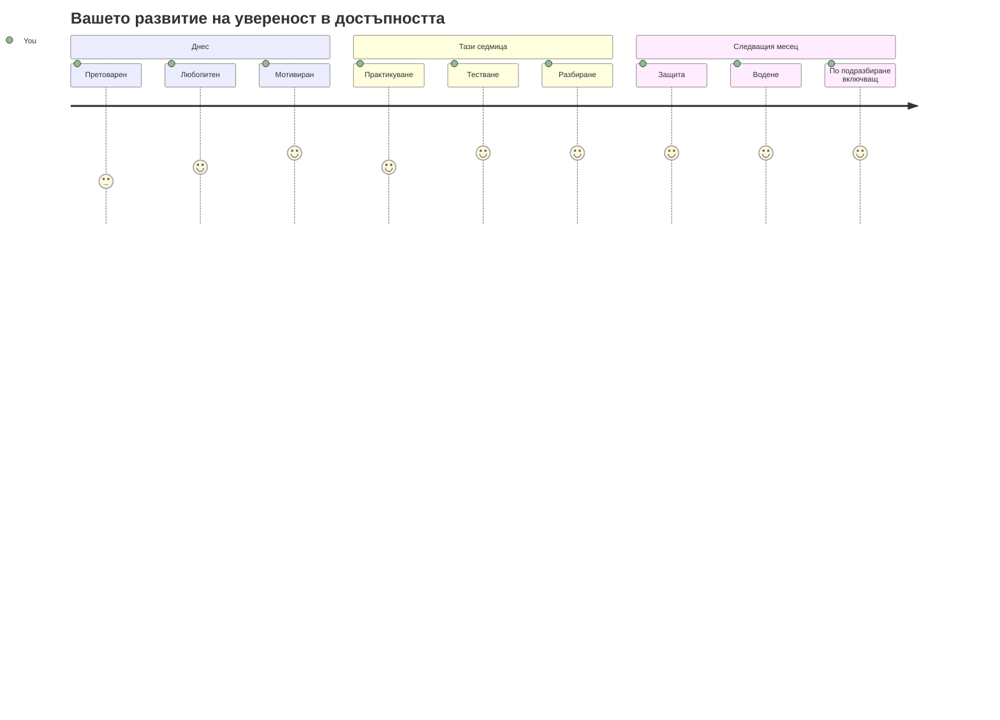
> 🌍 **Вие вече сте шампион по достъпност!** Вие разбирате, че страхотните уеб преживявания работят за всеки, без значение как достъпва уебa. Всяка достъпна функция, която създавате, прави интернет по-инклузивен. Уебът се нуждае от разработчици като вас, които виждат достъпността не като ограничение, а като възможност да създават по-добри преживявания за всички потребители. Добре дошли в движението! 🎉

---

<!-- CO-OP TRANSLATOR DISCLAIMER START -->
**Отказ от отговорност**:
Този документ е преведен с помощта на AI преводаческа услуга [Co-op Translator](https://github.com/Azure/co-op-translator). Въпреки че се стремим към точност, моля имайте предвид, че автоматизираните преводи могат да съдържат грешки или неточности. Оригиналният документ на неговия роден език трябва да се счита за авторитетен източник. За критична информация се препоръчва професионален човешки превод. Ние не носим отговорност за каквито и да е недоразумения или неправилни тълкувания, произтичащи от използването на този превод.
<!-- CO-OP TRANSLATOR DISCLAIMER END -->