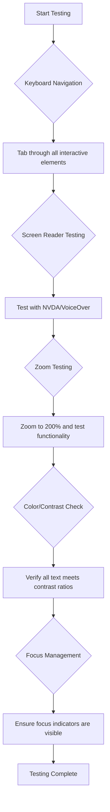
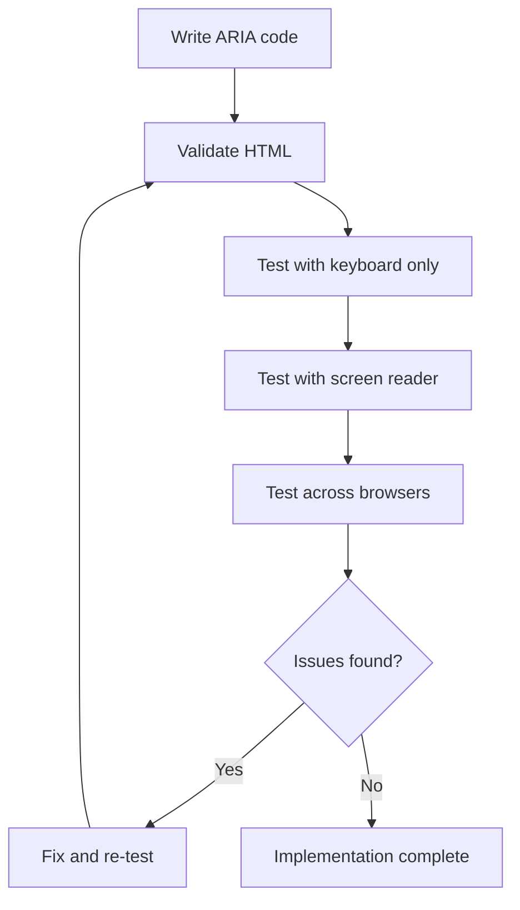

<!--
CO_OP_TRANSLATOR_METADATA:
{
  "original_hash": "90b19cde5b79b29e91babd3138cd8035",
  "translation_date": "2025-10-24T22:31:38+00:00",
  "source_file": "1-getting-started-lessons/3-accessibility/README.md",
  "language_code": "bg"
}
-->
# Създаване на достъпни уеб страници


> Скица от [Tomomi Imura](https://twitter.com/girlie_mac)

## Тест преди лекцията
[Тест преди лекцията](https://ff-quizzes.netlify.app/web/)

> Силата на интернет е в неговата универсалност. Достъпът за всеки, независимо от уврежданията, е съществен аспект.
>
> \- Сър Тимъти Бърнърс-Лий, директор на W3C и изобретател на Световната мрежа

Ето нещо, което може да ви изненада: когато създавате достъпни уебсайтове, не само помагате на хората с увреждания – всъщност правите интернет по-добър за всички!

Забелязвали ли сте онези наклонени рампи на уличните ъгли? Първоначално те са били проектирани за инвалидни колички, но сега помагат на хора с детски колички, доставчици с колички, пътници с куфари на колелца и велосипедисти. Точно така работи достъпният уеб дизайн – решенията, които помагат на една група, често се оказват полезни за всички. Доста впечатляващо, нали?

В този урок ще разгледаме как да създаваме уебсайтове, които наистина работят за всички, независимо как използват интернет. Ще откриете практични техники, които вече са вградени в уеб стандартите, ще се запознаете с инструменти за тестване и ще видите как достъпността прави вашите сайтове по-удобни за всички потребители.

До края на този урок ще имате увереността да направите достъпността естествена част от вашия работен процес на разработка. Готови ли сте да изследвате как внимателните дизайнерски решения могат да отворят интернет за милиарди потребители? Да започваме!

> Можете да вземете този урок на [Microsoft Learn](https://docs.microsoft.com/learn/modules/web-development-101/accessibility/?WT.mc_id=academic-77807-sagibbon)!

## Разбиране на помощните технологии

Преди да започнем с програмирането, нека отделим момент, за да разберем как хората с различни способности всъщност използват интернет. Това не е просто теория – разбирането на тези реални модели на навигация ще ви направи много по-добър разработчик!

Помощните технологии са невероятни инструменти, които помагат на хората с увреждания да взаимодействат с уебсайтове по начини, които може да ви изненадат. След като разберете как работят тези технологии, създаването на достъпни уеб изживявания става много по-интуитивно. Това е като да се научите да виждате кода си през очите на някой друг.

### Екранни четци

[Екранните четци](https://en.wikipedia.org/wiki/Screen_reader) са доста сложни технологии, които преобразуват цифров текст в реч или брайлово изходно устройство. Въпреки че основно се използват от хора с увредено зрение, те са изключително полезни и за потребители с обучителни затруднения като дислексия.

Обичам да мисля за екранния четец като за много умен разказвач, който ви чете книга. Той чете съдържанието на глас в логичен ред, обявява интерактивни елементи като "бутон" или "връзка" и предоставя клавишни комбинации за навигация из страницата. Но ето го важният момент – екранните четци могат да работят ефективно само ако създаваме уебсайтове с правилна структура и смислено съдържание. Тук идва вашата роля като разработчик!

**Популярни екранни четци за различни платформи:**
- **Windows**: [NVDA](https://www.nvaccess.org/about-nvda/) (безплатен и най-популярен), [JAWS](https://webaim.org/articles/jaws/), [Narrator](https://support.microsoft.com/windows/complete-guide-to-narrator-e4397a0d-ef4f-b386-d8ae-c172f109bdb1/?WT.mc_id=academic-77807-sagibbon) (вграден)
- **macOS/iOS**: [VoiceOver](https://support.apple.com/guide/voiceover/welcome/10) (вграден и много способен)
- **Android**: [TalkBack](https://support.google.com/accessibility/android/answer/6283677) (вграден)
- **Linux**: [Orca](https://wiki.gnome.org/Projects/Orca) (безплатен и с отворен код)

**Как екранните четци навигират уеб съдържание:**

Екранните четци предоставят множество методи за навигация, които правят сърфирането ефективно за опитни потребители:
- **Последователно четене**: Чете съдържанието отгоре надолу, като следва книга
- **Навигация по маркери**: Прескачане между секции на страницата (заглавие, навигация, основно съдържание, долен колонтитул)
- **Навигация по заглавия**: Прескачане между заглавия за разбиране на структурата на страницата
- **Списъци с връзки**: Генериране на списък с всички връзки за бърз достъп
- **Контроли на формуляри**: Директна навигация между полета за въвеждане и бутони

> 💡 **Ето нещо, което ме изуми**: 68% от потребителите на екранни четци навигират основно чрез заглавия ([WebAIM Survey](https://webaim.org/projects/screenreadersurvey9/#finding)). Това означава, че структурата на вашите заглавия е като карта за потребителите – когато я направите правилно, буквално помагате на хората да се ориентират по-бързо в съдържанието ви!

### Изграждане на вашия работен процес за тестване

Ето добри новини – ефективното тестване за достъпност не трябва да бъде прекалено сложно! Ще искате да комбинирате автоматизирани инструменти (те са фантастични за откриване на очевидни проблеми) с малко ръчно тестване. Ето систематичен подход, който според мен улавя най-много проблеми, без да отнема целия ви ден:

**Основен ръчен работен процес за тестване:**



**Контролен списък за тестване стъпка по стъпка:**
1. **Навигация с клавиатура**: Използвайте само Tab, Shift+Tab, Enter, Space и стрелките
2. **Тестване с екранен четец**: Активирайте NVDA, VoiceOver или Narrator и навигирайте със затворени очи
3. **Тестване на увеличение**: Тествайте при нива на увеличение от 200% и 400%
4. **Проверка на контраста на цветовете**: Проверете целия текст и компонентите на потребителския интерфейс
5. **Тестване на индикатор за фокус**: Уверете се, че всички интерактивни елементи имат видими състояния на фокус

✅ **Започнете с Lighthouse**: Отворете DevTools на браузъра си, стартирайте проверка за достъпност с Lighthouse и използвайте резултатите, за да насочите ръчното си тестване.

### Инструменти за увеличение и мащабиране

Знаете ли как понякога увеличавате текста на телефона си, когато е твърде малък, или се напрягате да четете на екрана на лаптопа си при ярка слънчева светлина? Много потребители разчитат на инструменти за мащабиране, за да направят съдържанието четимо всеки ден. Това включва хора с намалено зрение, възрастни хора и всеки, който някога е опитвал да чете уебсайт на открито.

Съвременните технологии за мащабиране са се развили отвъд просто увеличаване на размера. Разбирането как работят тези инструменти ще ви помогне да създавате адаптивни дизайни, които остават функционални и привлекателни при всяко ниво на мащабиране.

**Съвременни възможности за мащабиране в браузърите:**
- **Мащабиране на страницата**: Пропорционално увеличава цялото съдържание (текст, изображения, оформление) - това е предпочитаният метод
- **Само текстово мащабиране**: Увеличава размера на шрифта, като запазва оригиналното оформление
- **Увеличение чрез щипка**: Поддръжка на мобилни жестове за временно мащабиране
- **Поддръжка от браузъри**: Всички съвременни браузъри поддържат мащабиране до 500% без нарушаване на функционалността

**Специализиран софтуер за мащабиране:**
- **Windows**: [Magnifier](https://support.microsoft.com/windows/use-magnifier-to-make-things-on-the-screen-easier-to-see-414948ba-8b1c-d3bd-8615-0e5e32204198) (вграден), [ZoomText](https://www.freedomscientific.com/training/zoomtext/getting-started/)
- **macOS/iOS**: [Zoom](https://www.apple.com/accessibility/mac/vision/) (вграден с разширени функции)

> ⚠️ **Дизайнерско съображение**: WCAG изисква съдържанието да остане функционално при мащабиране до 200%. На това ниво хоризонталното превъртане трябва да бъде минимално, а всички интерактивни елементи трябва да останат достъпни.

✅ **Тествайте адаптивния си дизайн**: Увеличете браузъра си до 200% и 400%. Адаптира ли се вашето оформление добре? Можете ли все още да използвате всички функции без прекомерно превъртане?

## Съвременни инструменти за тестване на достъпност

Сега, когато разбирате как хората навигират в интернет с помощта на помощни технологии, нека разгледаме инструментите, които ви помагат да създавате и тествате достъпни уебсайтове.

Мислете за това така: автоматизираните инструменти са чудесни за откриване на очевидни проблеми (като липсващ alt текст), докато ръчното тестване ви помага да се уверите, че сайтът ви е удобен за използване в реалния свят. Заедно те ви дават увереност, че вашите сайтове работят за всички.

### Тестване на контраста на цветовете

Ето добри новини: контрастът на цветовете е един от най-често срещаните проблеми с достъпността, но също така е един от най-лесните за коригиране. Добрият контраст е полезен за всички – от потребители с увредено зрение до хора, които се опитват да четат телефоните си на плажа.

**Изисквания за контраст според WCAG:**

| Тип текст | WCAG AA (Минимум) | WCAG AAA (Подобрен) |
|-----------|-------------------|---------------------|
| **Обикновен текст** (под 18pt) | 4.5:1 съотношение на контраста | 7:1 съотношение на контраста |
| **Голям текст** (18pt+ или 14pt+ удебелен) | 3:1 съотношение на контраста | 4.5:1 съотношение на контраста |
| **UI компоненти** (бутони, рамки на формуляри) | 3:1 съотношение на контраста | 3:1 съотношение на контраста |

**Основни инструменти за тестване:**
- [Colour Contrast Analyser](https://www.tpgi.com/color-contrast-checker/) - Десктоп приложение с избор на цветове
- [WebAIM Contrast Checker](https://webaim.org/resources/contrastchecker/) - Уеб-базирано с незабавна обратна връзка
- [Stark](https://www.getstark.co/) - Плъгин за дизайн инструменти като Figma, Sketch, Adobe XD
- [Accessible Colors](https://accessible-colors.com/) - Намерете достъпни цветови палитри

✅ **Създайте по-добри цветови палитри**: Започнете с цветовете на вашия бранд и използвайте инструменти за проверка на контраста, за да създадете достъпни вариации. Документирайте тези цветове като достъпни цветови токени във вашата дизайн система.

### Комплексен одит за достъпност

Най-ефективното тестване за достъпност комбинира множество подходи. Нито един инструмент не улавя всичко, така че изграждането на рутинен процес за тестване с различни методи гарантира пълно покритие.

**Тестване в браузър (вградено в DevTools):**
- **Chrome/Edge**: Lighthouse одит за достъпност + панел за достъпност
- **Firefox**: Инспектор за достъпност с подробен изглед на дървото
- **Safari**: Таб за одит в Web Inspector със симулация на VoiceOver

**Професионални разширения за тестване:**
- [axe DevTools](https://www.deque.com/axe/devtools/) - Стандарт за автоматизирано тестване в индустрията
- [WAVE](https://wave.webaim.org/extension/) - Визуална обратна връзка с подчертаване на грешки
- [Accessibility Insights](https://accessibilityinsights.io/) - Комплексен инструмент за тестване от Microsoft

**Интеграция с команден ред и CI/CD:**
- [axe-core](https://github.com/dequelabs/axe-core) - JavaScript библиотека за автоматизирано тестване
- [Pa11y](https://pa11y.org/) - Инструмент за тестване на достъпност чрез команден ред
- [Lighthouse CI](https://github.com/GoogleChrome/lighthouse-ci) - Автоматизирано оценяване на достъпността

> 🎯 **Цел на тестването**: Стремете се към оценка за достъпност от Lighthouse от 95+ като базов стандарт. Помнете, че автоматизираните инструменти улавят само около 30-40% от проблемите с достъпността – ръчното тестване все още е от съществено значение!

## Изграждане на достъпност от самото начало

Ключът към успеха в достъпността е да я включите в основата си от самото начало. Знам, че е изкушаващо да мислите "Ще добавя достъпност по-късно", но това е като да се опитвате да добавите рампа към къща, след като вече е построена. Възможно? Да. Лесно? Не съвсем.

Мислете за достъпността като за планиране на къща – много по-лесно е да включите достъпността за инвалидни колички в първоначалните архитектурни планове, отколкото да променяте всичко по-късно.

### Принципите POUR: Основата на достъпността

Насоките за достъпност на уеб съдържание (WCAG) са изградени около четири основни принципа, които се обобщават като POUR. Не се притеснявайте – това не са сухи академични концепции! Всъщност те са практични насоки за създаване на съдържание, което работи за всички.

След като разберете принципите на POUR, вземането на решения за достъпност става много по-интуитивно. Това е като да имате мисловен контролен списък, който насочва вашите дизайнерски избори. Нека ги разгледаме:

**🔍 Възприемаемо**: Информацията трябва да бъде представена по начини, които потребителите могат да възприемат чрез наличните си сетива

- Осигурете текстови алтернативи за съдържание, което не е текст (изображения, видеа, аудио)
- Осигурете достатъчен контраст на цветовете за целия текст и компонентите на потребителския интерфейс
- Предоставете субтитри и транскрипции за мултимедийно съдържание
- Проектирайте съдържание, което остава функционално при увеличаване до 200%
- Използвайте множество сетивни характеристики (не само цвят), за да пред
Цветът е мощен инструмент за комуникация, но никога не трябва да бъде единственият начин за предаване на важна информация. Дизайнът, който надхвърля цветовете, създава по-устойчиви и достъпни преживявания, които работят в повече ситуации.

**Дизайн за различия в цветното зрение:**

Приблизително 8% от мъжете и 0.5% от жените имат някаква форма на различие в цветното зрение (често наричано "цветна слепота"). Най-често срещаните типове са:
- **Деутеранопия**: Трудност при разграничаване на червено и зелено
- **Протанопия**: Червеното изглежда по-тъмно
- **Тританопия**: Трудност с синьо и жълто (рядко срещано)

**Стратегии за включващ дизайн с цветове:**

```css
/* ❌ Bad: Using only color to indicate status */
.error { color: red; }
.success { color: green; }

/* ✅ Good: Color plus icons and context */
.error {
  color: #d32f2f;
  border-left: 4px solid #d32f2f;
}
.error::before {
  content: "⚠️";
  margin-right: 8px;
}

.success {
  color: #2e7d32;
  border-left: 4px solid #2e7d32;
}
.success::before {
  content: "✅";
  margin-right: 8px;
}
```

**Отвъд основните изисквания за контраст:**
- Тествайте избора си на цветове с симулатори за цветна слепота
- Използвайте шарки, текстури или форми заедно с цветово кодиране
- Уверете се, че интерактивните състояния остават различими без цветове
- Помислете как изглежда вашият дизайн в режим на висок контраст

✅ **Тествайте достъпността на цветовете си**: Използвайте инструменти като [Coblis](https://www.color-blindness.com/coblis-color-blindness-simulator/), за да видите как изглежда вашият сайт за потребители с различни типове цветно зрение.

### Индикатори за фокус и дизайн на взаимодействията

Индикаторите за фокус са дигиталният еквивалент на курсора – те показват на потребителите с клавиатура къде се намират на страницата. Добре проектираните индикатори за фокус подобряват преживяването за всички, като правят взаимодействията ясни и предсказуеми.

**Съвременни най-добри практики за индикатори за фокус:**

```css
/* Enhanced focus styles that work across browsers */
button:focus-visible {
  outline: 2px solid #0066cc;
  outline-offset: 2px;
  box-shadow: 0 0 0 4px rgba(0, 102, 204, 0.25);
}

/* Remove focus outline for mouse users, preserve for keyboard users */
button:focus:not(:focus-visible) {
  outline: none;
}

/* Focus-within for complex components */
.card:focus-within {
  box-shadow: 0 0 0 3px rgba(74, 144, 164, 0.5);
  border-color: #4A90A4;
}

/* Ensure focus indicators meet contrast requirements */
.custom-focus:focus-visible {
  outline: 3px solid #ffffff;
  outline-offset: 2px;
  box-shadow: 0 0 0 6px #000000;
}
```

**Изисквания за индикатори за фокус:**
- **Видимост**: Трябва да имат контрастно съотношение поне 3:1 със заобикалящите елементи
- **Ширина**: Минимум 2px дебелина около целия елемент
- **Постоянство**: Трябва да останат видими, докато фокусът не се премести другаде
- **Различие**: Трябва визуално да се различават от други състояния на потребителския интерфейс

> 💡 **Съвет за дизайн**: Отличните индикатори за фокус често използват комбинация от контур, сенки и промени в цвета, за да осигурят видимост на различни фонове и контексти.

✅ **Проверете индикаторите за фокус**: Прегледайте сайта си с клавиша Tab и отбележете кои елементи имат ясни индикатори за фокус. Има ли такива, които са трудни за виждане или напълно липсват?

### Семантичен HTML: Основата на достъпността

Семантичният HTML е като GPS система за помощните технологии на вашия уебсайт. Когато използвате правилните HTML елементи за тяхната предназначена цел, всъщност предоставяте на екранните четци, клавиатурите и други инструменти подробна карта, която помага на потребителите да се ориентират ефективно.

Ето една аналогия, която наистина ми помогна да разбера: семантичният HTML е разликата между добре организирана библиотека с ясни категории и полезни знаци и склад, където книгите са разхвърляни на случаен принцип. И двете места имат едни и същи книги, но в кое бихте предпочели да търсите нещо? Точно така!

**Основни елементи за достъпна структура на страницата:**

```html
<!-- Landmark elements provide page navigation structure -->
<header>
  <h1>Your Site Name</h1>
  <nav aria-label="Main navigation">
    <ul>
      <li><a href="/home">Home</a></li>
      <li><a href="/about">About</a></li>
      <li><a href="/services">Services</a></li>
    </ul>
  </nav>
</header>

<main>
  <article>
    <header>
      <h1>Article Title</h1>
      <p>Published on <time datetime="2024-10-14">October 14, 2024</time></p>
    </header>
    
    <section>
      <h2>First Section</h2>
      <p>Content that relates to this section...</p>
    </section>
    
    <section>
      <h2>Second Section</h2>
      <p>More related content...</p>
    </section>
  </article>
  
  <aside>
    <h2>Related Links</h2>
    <nav aria-label="Related articles">
      <ul>
        <li><a href="/related-1">First related article</a></li>
        <li><a href="/related-2">Second related article</a></li>
      </ul>
    </nav>
  </aside>
</main>

<footer>
  <p>&copy; 2024 Your Site Name. All rights reserved.</p>
  <nav aria-label="Footer links">
    <ul>
      <li><a href="/privacy">Privacy Policy</a></li>
      <li><a href="/contact">Contact Us</a></li>
    </ul>
  </nav>
</footer>
```

**Защо семантичният HTML трансформира достъпността:**

| Семантичен елемент | Цел | Полза за екранните четци |
|--------------------|-----|--------------------------|
| `<header>` | Заглавие на страница или секция | "Banner landmark" - бърза навигация до горната част |
| `<nav>` | Навигационни връзки | "Navigation landmark" - списък с навигационни секции |
| `<main>` | Основно съдържание на страницата | "Main landmark" - директен достъп до съдържанието |
| `<article>` | Самостоятелно съдържание | Обявява границите на статията |
| `<section>` | Групи от тематично съдържание | Осигурява структура на съдържанието |
| `<aside>` | Свързано съдържание в странична лента | "Complementary landmark" |
| `<footer>` | Долен колонтитул на страница или секция | "Contentinfo landmark" |

**Суперсили на екранните четци със семантичен HTML:**
- **Навигация по маркери**: Моментално преминаване между основните секции на страницата
- **Очертания на заглавията**: Генериране на съдържание от структурата на заглавията
- **Списъци с елементи**: Създаване на списъци с всички връзки, бутони или контролни елементи на формуляри
- **Осъзнаване на контекста**: Разбиране на връзките между секциите на съдържанието

> 🎯 **Бърз тест**: Опитайте да навигирате в сайта си с екранен четец, използвайки преки пътища за маркери (D за маркер, H за заглавие, K за връзка в NVDA/JAWS). Дали навигацията има смисъл?

✅ **Проверете семантичната си структура**: Използвайте панела за достъпност в DevTools на браузъра си, за да видите дървото на достъпността и да се уверите, че вашият HTML код създава логична структура.

### Йерархия на заглавията: Създаване на логичен контур на съдържанието

Заглавията са абсолютно важни за достъпното съдържание – те са като гръбнакът, който държи всичко заедно. Потребителите на екранни четци разчитат силно на заглавията, за да разберат и навигират съдържанието ви. Представете си, че предоставяте съдържание на страницата си като таблица на съдържанието.

**Ето златното правило за заглавията:**
Никога не пропускайте нива. Винаги преминавайте логично от `<h1>` към `<h2>` към `<h3>` и т.н. Спомняте ли си как правехте планове в училище? Това е същият принцип – не бихте преминали от "I. Основна точка" директно към "C. Подточка", без да имате "A. Подточка" между тях, нали?

**Пример за перфектна структура на заглавия:**

```html
<!-- ✅ Excellent: Logical, hierarchical progression -->
<main>
  <h1>Complete Guide to Web Accessibility</h1>
  
  <section>
    <h2>Understanding Screen Readers</h2>
    <p>Introduction to screen reader technology...</p>
    
    <h3>Popular Screen Reader Software</h3>
    <p>NVDA, JAWS, and VoiceOver comparison...</p>
    
    <h3>Testing with Screen Readers</h3>
    <p>Step-by-step testing instructions...</p>
  </section>
  
  <section>
    <h2>Color and Contrast Guidelines</h2>
    <p>Designing with sufficient contrast...</p>
    
    <h3>WCAG Contrast Requirements</h3>
    <p>Understanding the different contrast levels...</p>
    
    <h3>Testing Tools and Techniques</h3>
    <p>Tools for verifying contrast ratios...</p>
  </section>
</main>
```

```html
<!-- ❌ Problematic: Skipping levels, inconsistent structure -->
<h1>Page Title</h1>
<h3>Subsection</h3> <!-- Skipped h2 -->
<h2>This should come before h3</h2>
<h1>Another main heading?</h1> <!-- Multiple h1s -->
```

**Най-добри практики за заглавия:**
- **Едно `<h1>` на страница**: Обикновено основното заглавие на страницата или основното съдържание
- **Логична прогресия**: Никога не пропускайте нива (h1 → h2 → h3, а не h1 → h3)
- **Описателно съдържание**: Направете заглавията значими, когато се четат извън контекста
- **Визуално оформление с CSS**: Използвайте CSS за външния вид, HTML нива за структурата

**Статистика за навигация с екранни четци:**
- 68% от потребителите на екранни четци навигират чрез заглавия ([WebAIM Survey](https://webaim.org/projects/screenreadersurvey9/#finding))
- Потребителите очакват да намерят логичен контур на заглавията
- Заглавията предоставят най-бързия начин за разбиране на структурата на страницата

> 💡 **Професионален съвет**: Използвайте разширения за браузър като "HeadingsMap", за да визуализирате структурата на заглавията си. Тя трябва да изглежда като добре организирана таблица на съдържанието.

✅ **Тествайте структурата на заглавията си**: Използвайте навигацията по заглавия на екранен четец (клавиш H в NVDA), за да преминавате през заглавията си. Дали прогресията разказва логично историята на съдържанието ви?

### Напреднали техники за визуална достъпност

Отвъд основите на контраста и цветовете, съществуват усъвършенствани техники, които помагат за създаването на наистина включващи визуални преживявания. Тези методи гарантират, че съдържанието ви работи в различни условия на гледане и с помощни технологии.

**Основни стратегии за визуална комуникация:**

- **Мултимодална обратна връзка**: Комбинирайте визуални, текстови и понякога аудио сигнали
- **Прогресивно разкриване**: Представяйте информацията на малки, лесно усвоими части
- **Последователни модели на взаимодействие**: Използвайте познати конвенции на потребителския интерфейс
- **Респонсивна типография**: Настройте текста според различните устройства
- **Състояния на зареждане и грешки**: Осигурете ясна обратна връзка за всички действия на потребителя

**CSS инструменти за подобрена достъпност:**

```css
/* Screen reader only text - visually hidden but accessible */
.sr-only {
  position: absolute;
  width: 1px;
  height: 1px;
  padding: 0;
  margin: -1px;
  overflow: hidden;
  clip: rect(0, 0, 0, 0);
  white-space: nowrap;
  border: 0;
}

/* Skip link for keyboard navigation */
.skip-link {
  position: absolute;
  top: -40px;
  left: 6px;
  background: #000000;
  color: #ffffff;
  padding: 8px 16px;
  text-decoration: none;
  border-radius: 4px;
  font-weight: bold;
  transition: top 0.3s ease;
  z-index: 1000;
}

.skip-link:focus {
  top: 6px;
}

/* Reduced motion respect */
@media (prefers-reduced-motion: reduce) {
  .skip-link {
    transition: none;
  }
  
  * {
    animation-duration: 0.01ms !important;
    animation-iteration-count: 1 !important;
    transition-duration: 0.01ms !important;
  }
}

/* High contrast mode support */
@media (prefers-contrast: high) {
  .button {
    border: 2px solid;
  }
}
```

> 🎯 **Модел за достъпност**: "Прескачане на връзка" е от съществено значение за потребителите с клавиатура. Тя трябва да бъде първият фокусируем елемент на страницата и да позволява директно преминаване към основната област на съдържанието.

✅ **Добавете навигация за прескачане**: Добавете връзки за прескачане към страниците си и ги тествайте, като натиснете Tab веднага след зареждането на страницата. Те трябва да се появят и да ви позволят да преминете към основното съдържание.

## Създаване на смислен текст за връзки

Връзките са основните пътища в интернет, но лошо написаният текст за връзки е като пътни знаци, които просто казват "Място" вместо "Център на Чикаго". Не е много полезно, нали?

Ето нещо, което ме изненада, когато го научих: екранните четци могат да извлекат всички връзки от една страница и да ги покажат като един голям списък. Представете си, че някой ви даде директория с всяка връзка на вашата страница. Дали всяка от тях би имала смисъл сама по себе си? Това е тестът, който вашият текст за връзки трябва да премине!

### Разбиране на моделите за навигация чрез връзки

Екранните четци предлагат мощни функции за навигация чрез връзки, които разчитат на добре написан текст за връзки:

**Методи за навигация чрез връзки:**
- **Последователно четене**: Връзките се четат в контекста на потока на съдържанието
- **Генериране на списък с връзки**: Всички връзки на страницата се събират в търсима директория
- **Бърза навигация**: Преминаване между връзки с клавишни комбинации (K в NVDA)
- **Функция за търсене**: Намиране на конкретни връзки чрез въвеждане на частичен текст

**Защо контекстът е важен:**
Когато потребителите на екранни четци генерират списък с връзки, те виждат нещо подобно:
- "Изтегли доклад"
- "Научете повече"
- "Кликнете тук"
- "Политика за поверителност"
- "Кликнете тук"

Само две от тези връзки предоставят полезна информация, когато се четат извън контекста!

> 📊 **Влияние върху потребителите**: Потребителите на екранни четци сканират списъци с връзки, за да разберат съдържанието на страницата бързо. Общият текст на връзките ги принуждава да се върнат към контекста на всяка връзка, което значително забавя тяхното преживяване при сърфиране.

### Често срещани грешки при текстовете на връзки

Разбирането на това, което не работи, помага да разпознаете и коригирате проблемите с достъпността в съществуващото съдържание.

**❌ Общ текст на връзки, който не предоставя контекст:**

```html
<!-- Meaningless when read from a link list -->
<p>Our sustainability efforts are detailed in our recent report. 
   <a href="/sustainability-2024.pdf">Click here</a> to view it.</p>

<!-- Repeated generic text throughout the page -->
<div class="article-card">
  <h3>Web Accessibility Guide</h3>
  <p>Learn the fundamentals...</p>
  <a href="/accessibility-guide">Read more</a>
</div>
<div class="article-card">
  <h3>Color Contrast Tips</h3>
  <p>Improve your design...</p>
  <a href="/color-contrast">Read more</a>
</div>

<!-- URLs as link text (difficult for screen readers to announce) -->
<p>Visit https://www.w3.org/WAI/WCAG21/quickref/ for WCAG guidelines.</p>

<!-- Vague action words -->
<a href="/contact">Go</a> | <a href="/about">See</a> | <a href="/help">View</a>
```

**Защо тези модели не работят:**
- **"Кликнете тук"** не казва нищо за дестинацията
- **"Прочетете повече"** повторено многократно създава объркване
- **Сурови URL адреси** са трудни за произнасяне от екранните четци
- **Единични думи** като "Отиди" или "Виж" липсват описателен контекст

### Писане на отличен текст за връзки

Описателният текст за връзки е полезен за всички – потребителите с нормално зрение могат бързо да сканират връзките, а потребителите на екранни четци разбират дестинациите незабавно.

**✅ Примери за ясен, описателен текст за връзки:**

```html
<!-- Descriptive text that explains the destination -->
<p>Our comprehensive <a href="/sustainability-2024.pdf">2024 sustainability report (PDF, 2.1MB)</a> details our environmental initiatives.</p>

<!-- Specific, unique link text for each card -->
<div class="article-card">
  <h3>Web Accessibility Guide</h3>
  <p>Learn the fundamentals of inclusive design...</p>
  <a href="/accessibility-guide">Read our complete web accessibility guide</a>
</div>
<div class="article-card">
  <h3>Color Contrast Tips</h3>
  <p>Improve your design with better color choices...</p>
  <a href="/color-contrast">Explore color contrast best practices</a>
</div>

<!-- Meaningful text instead of raw URLs -->
<p>The <a href="https://www.w3.org/WAI/WCAG21/quickref/">WCAG 2.1 Quick Reference guide</a> provides comprehensive accessibility guidelines.</p>

<!-- Descriptive action links -->
<a href="/contact">Contact our support team</a> | 
<a href="/about">About our company</a> | 
<a href="/help">Get help with your account</a>
```

**Най-добри практики за текст на връзки:**
- **Бъдете конкретни**: "Изтеглете тримесечния финансов отчет" вместо "Изтегли"
- **Включете тип и размер на файла**: "(PDF, 1.2MB)" за файлове за изтегляне
- **Споменете, ако връзките се отварят външно**: "(отваря се в нов прозорец)" когато е подходящо
- **Използвайте активен език**: "Свържете се с нас" вместо "Страница за контакт"
- **Бъдете кратки**: Стремете се към 2-8 думи, когато е възможно

### Напреднали модели за достъпност на връзки

Понякога ограниченията на визуалния дизайн или техническите изисквания изискват специални решения. Ето усъвършенствани техники за често срещани предизвикателни сценарии:

**Използване на ARIA за подобрен контекст:**

```html
<!-- When button text must be short but needs more context -->
<a href="/report.pdf" 
   aria-label="Download 2024 annual financial report, PDF format, 2.3MB">
  Download Report
</a>

<!-- When the full context comes from surrounding content -->
<h3 id="sustainability-heading">Sustainability Initiative</h3>
<p>Our efforts to reduce environmental impact...</p>
<a href="/sustainability-details" 
   aria-labelledby="sustainability-heading"
   aria-describedby="sustainability-summary">
  Learn more
</a>
<p id="sustainability-summary">Detailed breakdown of our 2024 environmental goals and achievements</p>
```

**Посочване на типове файлове и външни дестинации:**

```html
<!-- Method 1: Include information in visible link text -->
<a href="/annual-report.pdf">
  Download our 2024 annual report (PDF, 2.3MB)
</a>

<!-- Method 2: Use screen reader-only text for file details -->
<a href="/annual-report.pdf">
  Download our 2024 annual report
  <span class="sr-only">(PDF format, 2.3MB)</span>
</a>

<!-- Method 3: External link indication -->
<a href="https://example.com" 
   target="_blank" 
   aria-describedby="external-link-warning">
  Visit external resource
</a>
<span id="external-link-warning" class="sr-only">
  (opens in new window)
</span>

<!-- Method 4: Using CSS for visual indicators -->
<a href="https://example.com" class="external-link">
  External resource
</a>
```

```css
/* Visual indicator for external links */
.external-link::after {
  content: " ↗";
  font-size: 0.8em;
  color: #666;
}

/* Screen reader announcement for external links */
.external-link::before {
  content: "External link: ";
  position: absolute;
  left: -10000px;
  width: 1px;
  height: 1px;
  overflow: hidden;
}
```

> ⚠️ **Важно**: Когато използвате `target="_blank"`, винаги информирайте потребителите, че връзката се отваря в нов прозорец или раздел. Неочакваните промени в навигацията могат да бъдат объркващи.

✅ **Тествайте контекста на връзките си**: Използвайте инструментите за разработчици на браузъра си, за да генерирате списък с всички връзки на страницата си. Можете ли да разберете целта на всяка връзка без допълнителен контекст?

## ARIA: Усъвършенстване на достъпността на HTML

[Accessible Rich Internet Applications (ARIA)](https://developer.mozilla.org/docs/Web/Accessibility/ARIA) е като универсален преводач между вашите сложни уеб приложения и помощните технологии. Когато HTML сам по себе си не може да изрази всичко, което правят вашите интерактивни компоненти, ARIA се намесва, за да запълни тези празнини.

Обичам да мисля за ARIA като за добавяне на полезни пояснения към вашия HTML – нещо като сценични указания в сценарий, които помагат на актьорите да разберат своите роли и връзки.

**Ето най-важното правило за ARIA**: Винаги използвайте първо семантичен HTML, след това добавете ARIA, за да го подобрите. Мислете за ARIA като за подправка, а не за
5. **Започнете просто**: Сложните ARIA реализации са по-склонни към грешки

**🔍 Работен процес за тестване:**



**🚫 Чести грешки с ARIA, които да избягвате:**

- **Противоречива информация**: Не противоречете на семантиката на HTML
- **Прекалено много етикети**: Прекомерната информация от ARIA може да обърка потребителите
- **Статична ARIA**: Забравяне за актуализиране на състоянията на ARIA при промяна на съдържанието
- **Непроверени реализации**: ARIA, която работи на теория, но се проваля на практика
- **Липса на поддръжка за клавиатура**: Роли на ARIA без съответстващи клавиатурни взаимодействия

> 💡 **Ресурси за тестване**: Използвайте инструменти като [accessibility-checker](https://www.npmjs.com/package/accessibility-checker) за автоматична проверка на ARIA, но винаги тествайте с реални екранни четци за пълноценен опит.

✅ **Учете от експерти**: Изучете [ARIA Authoring Practices Guide](https://w3c.github.io/aria-practices/) за доказани модели и реализации на сложни интерактивни джаджи.

## Достъпност на изображения и медии

Визуалното и аудио съдържание са основни части от съвременния уеб опит, но могат да създадат бариери, ако не са внедрени внимателно. Целта е да се гарантира, че информацията и емоционалното въздействие на вашите медии достигат до всеки потребител. След като овладеете това, то става естествено.

Различните видове медии изискват различни подходи за достъпност. Това е като готвене — не бихте третирали деликатна риба по същия начин, както бихте третирали сочен стек. Разбирането на тези различия ви помага да изберете правилното решение за всяка ситуация.

### Стратегическа достъпност на изображения

Всяко изображение на вашия уебсайт има цел. Разбирането на тази цел ви помага да напишете по-добър алтернативен текст и да създадете по-инклузивни преживявания.

**Четирите типа изображения и техните стратегии за алтернативен текст:**

**Информативни изображения** - предават важна информация:
```html

```

**Декоративни изображения** - чисто визуални, без информационна стойност:
```html

```

**Функционални изображения** - служат като бутони или контроли:
```html
<button>
  
</button>
```

**Сложни изображения** - графики, диаграми, инфографики:
```html

<div id="chart-description">
  <p>Detailed description: Sales data shows a steady increase across all quarters...</p>
</div>
```

### Достъпност на видео и аудио

**Изисквания за видео:**
- **Субтитри**: Текстова версия на говореното съдържание и звуковите ефекти
- **Аудио описания**: Разказ на визуалните елементи за незрящи потребители
- **Транскрипции**: Пълна текстова версия на цялото аудио и визуално съдържание

```html
<video controls>
  <source src="video.mp4" type="video/mp4">
  <track kind="captions" src="captions.vtt" srclang="en" label="English">
  <track kind="descriptions" src="descriptions.vtt" srclang="en" label="Audio descriptions">
</video>
```

**Изисквания за аудио:**
- **Транскрипции**: Текстова версия на цялото говорено съдържание
- **Визуални индикатори**: За съдържание само с аудио, предоставете визуални подсказки

### Съвременни техники за изображения

**Използване на CSS за декоративни изображения:**
```css
.hero-section {
  background-image: url('decorative-hero.jpg');
  /* Decorative images in CSS don't need alt text */
}
```

**Респонсив изображения с достъпност:**
```html
<picture>
  <source media="(min-width: 800px)" srcset="large-chart.png">
  <source media="(min-width: 400px)" srcset="medium-chart.png">
  
</picture>
```

✅ **Тествайте достъпността на изображенията**: Използвайте екранен четец, за да навигирате в страница с изображения. Получавате ли достатъчно информация, за да разберете съдържанието?

## Навигация с клавиатура и управление на фокуса

Много потребители навигират в уеб пространството изцяло с клавиатура. Това включва хора с двигателни увреждания, опитни потребители, които намират клавиатурата за по-бърза от мишката, и всеки, чиято мишка е спряла да работи. Уверете се, че вашият сайт работи добре с вход от клавиатура, което е от съществено значение и често прави сайта ви по-ефективен за всички.

### Основни модели за навигация с клавиатура

**Стандартни взаимодействия с клавиатура:**
- **Tab**: Преместване на фокуса напред през интерактивни елементи
- **Shift + Tab**: Преместване на фокуса назад
- **Enter**: Активиране на бутони и връзки
- **Space**: Активиране на бутони, маркиране на квадратчета
- **Стрелки**: Навигация в групи от компоненти (радио бутони, менюта)
- **Escape**: Затваряне на модали, падащи менюта или отменяне на операции

### Най-добри практики за управление на фокуса

**Видими индикатори за фокус:**
```css
/* Ensure focus is always visible */
button:focus-visible {
  outline: 2px solid #4A90A4;
  outline-offset: 2px;
}

/* Custom focus styles for different components */
.card:focus-within {
  box-shadow: 0 0 0 3px rgba(74, 144, 164, 0.5);
}
```

**Пропускане на връзки за ефективна навигация:**
```html
<a href="#main-content" class="skip-link">Skip to main content</a>
<a href="#navigation" class="skip-link">Skip to navigation</a>

<nav id="navigation">
  <!-- navigation content -->
</nav>
<main id="main-content">
  <!-- main content -->
</main>
```

**Правилен ред на табулация:**
```html
<!-- Use semantic HTML for natural tab order -->
<form>
  <label for="name">Name:</label>
  <input type="text" id="name" tabindex="0">
  
  <label for="email">Email:</label>
  <input type="email" id="email" tabindex="0">
  
  <button type="submit" tabindex="0">Submit</button>
</form>
```

### Задържане на фокуса в модали

При отваряне на модални диалози, фокусът трябва да бъде задържан в модала:

```javascript
// Modern focus trap implementation
function trapFocus(element) {
  const focusableElements = element.querySelectorAll(
    'button, [href], input, select, textarea, [tabindex]:not([tabindex="-1"])'
  );
  
  const firstElement = focusableElements[0];
  const lastElement = focusableElements[focusableElements.length - 1];

  element.addEventListener('keydown', (e) => {
    if (e.key === 'Tab') {
      if (e.shiftKey && document.activeElement === firstElement) {
        e.preventDefault();
        lastElement.focus();
      } else if (!e.shiftKey && document.activeElement === lastElement) {
        e.preventDefault();
        firstElement.focus();
      }
    }
    
    if (e.key === 'Escape') {
      closeModal();
    }
  });
  
  // Focus first element when modal opens
  firstElement.focus();
}
```

✅ **Тествайте навигацията с клавиатура**: Опитайте да навигирате в уебсайта си, използвайки само клавиша Tab. Можете ли да достигнете до всички интерактивни елементи? Логичен ли е редът на фокуса? Видими ли са индикаторите за фокус?

## Достъпност на формуляри

Формулярите са критични за взаимодействието с потребителите и изискват специално внимание към достъпността.

### Асоциация между етикети и контроли на формуляра

**Всеки контрол на формуляра се нуждае от етикет:**
```html
<!-- Explicit labeling (preferred) -->
<label for="username">Username:</label>
<input type="text" id="username" name="username" required>

<!-- Implicit labeling -->
<label>
  Password:
  <input type="password" name="password" required>
</label>

<!-- Using aria-label when visual label isn't desired -->
<input type="search" aria-label="Search products" placeholder="Search...">
```

### Обработка на грешки и валидиране

**Достъпни съобщения за грешки:**
```html
<label for="email">Email Address:</label>
<input type="email" id="email" name="email" 
       aria-describedby="email-error" 
       aria-invalid="true" required>
<div id="email-error" role="alert">
  Please enter a valid email address
</div>
```

**Най-добри практики за валидиране на формуляри:**
- Използвайте `aria-invalid`, за да посочите невалидни полета
- Осигурете ясни, конкретни съобщения за грешки
- Използвайте `role="alert"` за важни съобщения за грешки
- Показвайте грешки както веднага, така и при изпращане на формуляра

### Полета и групиране

**Групирайте свързани контроли на формуляра:**
```html
<fieldset>
  <legend>Shipping Address</legend>
  <label for="street">Street Address:</label>
  <input type="text" id="street" name="street">
  
  <label for="city">City:</label>
  <input type="text" id="city" name="city">
</fieldset>

<fieldset>
  <legend>Preferred Contact Method</legend>
  <input type="radio" id="contact-email" name="contact" value="email">
  <label for="contact-email">Email</label>
  
  <input type="radio" id="contact-phone" name="contact" value="phone">
  <label for="contact-phone">Phone</label>
</fieldset>
```

## Вашето пътуване към достъпността: Основни изводи

Поздравления! Току-що придобихте основни знания за създаване на наистина инклузивни уеб преживявания. Това е доста вълнуващо! Уеб достъпността не е само за отбелязване на съответствие—тя е за разпознаване на разнообразните начини, по които хората взаимодействат с дигиталното съдържание, и за проектиране за тази невероятна сложност.

Сега сте част от нарастваща общност от разработчици, които разбират, че страхотният дизайн работи за всички. Добре дошли в клуба!

**🎯 Вашият инструментариум за достъпност вече включва:**

| Основен принцип | Реализация | Въздействие |
|------------------|------------|-------------|
| **Семантична HTML основа** | Използвайте правилните HTML елементи за тяхната предназначена цел | Екранните четци могат ефективно да навигират, клавиатурите работят автоматично |
| **Инклузивен визуален дизайн** | Достатъчен контраст, смислено използване на цветове, видими индикатори за фокус | Ясно за всички при всякакви условия на осветление |
| **Описателно съдържание** | Смислен текст на връзки, алтернативен текст, заглавия | Потребителите разбират съдържанието без визуален контекст |
| **Достъпност с клавиатура** | Ред на табулация, клавишни комбинации, управление на фокуса | Двигателна достъпност и ефективност за опитни потребители |
| **Подобрение с ARIA** | Стратегическо използване за запълване на семантични пропуски | Сложни приложения работят с помощни технологии |
| **Цялостно тестване** | Автоматизирани инструменти + ръчна проверка + тестване с реални потребители | Откриване на проблеми преди да засегнат потребителите |

**🚀 Вашите следващи стъпки:**

1. **Вградете достъпността в работния си процес**: Направете тестването естествена част от процеса на разработка
2. **Учете се от реални потребители**: Търсете обратна връзка от хора, които използват помощни технологии
3. **Бъдете в крак с новостите**: Техниките за достъпност се развиват с новите технологии и стандарти
4. **Застъпвайте се за инклузия**: Споделяйте знанията си и направете достъпността приоритет за екипа

> 💡 **Запомнете**: Ограниченията на достъпността често водят до иновативни, елегантни решения, които са от полза за всички. Рампи за инвалидни колички, субтитри и гласови контроли започнаха като функции за достъпност и се превърнаха в основни подобрения.

**Бизнес аргументът е кристално ясен**: Достъпните уебсайтове достигат до повече потребители, се класират по-добре в търсачките, имат по-ниски разходи за поддръжка и избягват правни рискове. Но честно казано? Истинската причина да се грижим за достъпността е много по-дълбока. Достъпните уебсайтове въплъщават най-добрите ценности на уеб пространството—отвореност, инклузия и идеята, че всеки заслужава равен достъп до информация.

Сега сте готови да изградите инклузивния уеб на бъдещето. Всеки достъпен сайт, който създавате, прави интернет по-гостоприемно място за всички. Това е наистина невероятно, когато се замислите!

## Допълнителни ресурси

Продължете своето обучение за достъпност с тези основни ресурси:

**📚 Официални стандарти и насоки:**
- [WCAG 2.1 Guidelines](https://www.w3.org/WAI/WCAG21/quickref/) - Официалният стандарт за достъпност с бърза справка
- [ARIA Authoring Practices Guide](https://w3c.github.io/aria-practices/) - Изчерпателни модели за интерактивни джаджи
- [WebAIM Guidelines](https://webaim.org/) - Практически, лесни за разбиране насоки за достъпност

**🛠️ Инструменти и ресурси за тестване:**
- [axe DevTools](https://www.deque.com/axe/devtools/) - Стандарт за тестване на достъпност в индустрията
- [A11y Project Checklist](https://www.a11yproject.com/checklist/) - Стъпка по стъпка проверка за достъпност
- [Accessibility Insights](https://accessibilityinsights.io/) - Комплексен тестов пакет на Microsoft
- [Color Oracle](https://colororacle.org/) - Симулатор за цветна слепота за тестване на дизайна

**🎓 Обучение и общност:**
- [WebAIM Screen Reader Survey](https://webaim.org/projects/screenreadersurvey9/) - Предпочитания и поведение на реални потребители
- [Inclusive Components](https://inclusive-components.design/) - Модерни модели за достъпни компоненти
- [A11y Coffee](https://a11y.coffee/) - Бързи съвети и прозрения за достъпност
- [Web Accessibility Initiative (WAI)](https://www.w3.org/WAI/) - Изчерпателни ресурси за достъпност от W3C

**🎥 Практическо обучение:**
- [Accessibility Developer Guide](https://www.accessibility-developer-guide.com/) - Практически насоки за реализация
- [Deque University](https://dequeuniversity.com/) - Професионални курсове за обучение по достъпност

## Предизвикателство на GitHub Copilot Agent 🚀

Използвайте режим Agent, за да завършите следното предизвикателство:

**Описание:** Създайте достъпен компонент за модален диалог, който демонстрира правилно управление на фокуса, ARIA атрибути и модели за навигация с клавиатура.

**Подсказка:** Изградете пълен компонент за модален диалог с HTML, CSS и JavaScript, който включва: правилно задържане на фокуса, клавиш ESC за затваряне, кликване извън модала за затваряне, ARIA атрибути за екранни четци и видими индикатори за фокус. Модалът трябва да съдържа формуляр с правилни етикети и обработка на грешки. Уверете се, че компонентът отговаря на стандартите WCAG 2.1 AA.


## 🚀 Предизвикателство

Вземете този HTML и го пренапишете, за да бъде възможно най-достъпен, използвайки стратегиите, които научихте.

```html
<!DOCTYPE html>
<html lang="en">
  <head>
    <meta charset="UTF-8">
    <meta name="viewport" content="width=device-width, initial-scale=1.0">
    <title>Turtle Ipsum - The World's Premier Turtle Fan Club</title>
    <link href='../assets/style.css' rel='stylesheet' type='text/css'>
  </head>
  <body>
    <header class="site-header">
      <h1 class="site-title">Turtle Ipsum</h1>
      <p class="site-subtitle">The World's Premier Turtle Fan Club</p>
    </header>
    
    <nav class="main-nav" aria-label="Main navigation">
      <h2 class="nav-header">Resources</h2>
      <ul class="nav-list">
        <li><a href="https://www.youtube.com/watch?v=CMNry4PE93Y">"I like turtles" video</a></li>
        <li><a href="https://en.wikipedia.org/wiki/Turtle">Basic turtle information</a></li>
        <li><a href="https://en.wikipedia.org/wiki/Turtles_(chocolate)">Chocolate turtles candy</a></li>
      </ul>
    </nav>
    
    <main class="main-content">
      <article>
        <h1>Welcome to Turtle Ipsum</h1>
        <p class="intro">
          <a href="/about">Learn more about our turtle community</a> and discover fascinating facts about these amazing creatures.
        </p>
        <p class="article-text">
          Turtle ipsum dolor sit amet, consectetur adipiscing elit, sed do eiusmod tempor incididunt ut labore et dolore magna aliqua. Ut enim ad minim veniam, quis nostrud exercitation ullamco laboris nisi ut aliquip ex ea commodo consequat. Duis aute irure dolor in reprehenderit in voluptate velit esse cillum dolore eu fugiat nulla pariatur. Excepteur sint occaecat cupidatat non proident, sunt in culpa qui officia deserunt mollit anim id est laborum.
        </p>
      </article>
    </main>
    
    <footer class="footer">
      <section class="newsletter-signup">
        <h2>Stay Updated</h2>
        <button type="button" onclick="showNewsletterForm()">Sign up for turtle news</button>
      </section>
      
      <nav class="footer-nav" aria-label="Footer navigation">
        <h2>Site Pages</h2>
        <ul>
          <li><a href="../">Home</a></li>
          <li><a href="../semantic">Semantic HTML example</a></li>
        </ul>
      </nav>
      
      <p class="footer-copyright">&copy; 2024 Instrument. All rights reserved.</p>
    </footer>
  </body>
</html>
```

**Основни подобрения, направени:**
- Добавена правилна семантична HTML структура
- Поправена йерархия на заглавията (единично h1, логична последователност)
- Добавен смислен текст на връзки вместо "кликнете тук"
- Включени правилни ARIA етикети за навигация
- Добавен атрибут lang и правилни мета тагове
- Използван елемент button за интерактивни елементи
- Структурирано съдържание на футъра с правилни маркери

## Тест след лекцията
[Тест след лекцията](https://ff-quizzes.netlify.app/web/en/)

## Преглед и самостоятелно обучение

Много правителства имат закони относно изискванията за достъпност. Проучете законите за достъпност във вашата страна. Какво е обхванато и какво не е? Пример е [този правителствен уебсайт](https://accessibility.blog.gov.uk/).

## Задача
 
[Анализирайте недостъпен уебсайт](assignment.md)

Кредити: [Turtle Ipsum](https://github.com/Instrument/semantic-html-sample) от Instrument

---

**Отказ от отговорност**:  
Този документ е преведен с помощта на AI услуга за превод [Co-op Translator](https://github.com/Azure/co-op-translator). Въпреки че се стремим към точност, моля, имайте предвид, че автоматизираните преводи може да съдържат грешки или неточности. Оригиналният документ на неговия роден език трябва да се счита за авторитетен източник. За критична информация се препоръчва професионален човешки превод. Ние не носим отговорност за каквито и да е недоразумения или погрешни интерпретации, произтичащи от използването на този превод.