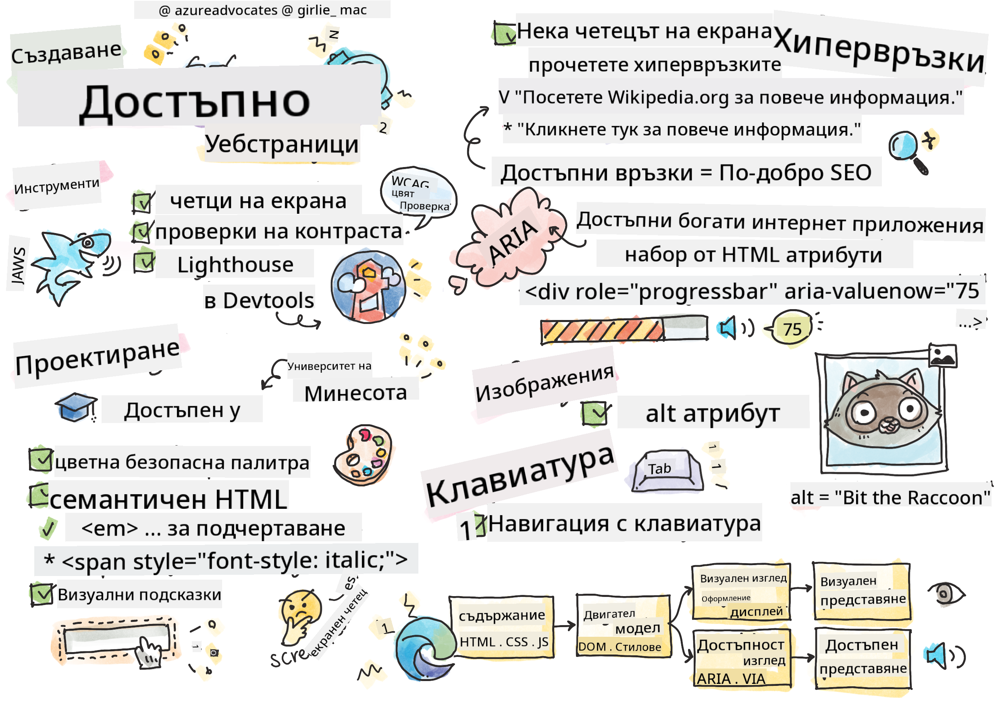

<!--
CO_OP_TRANSLATOR_METADATA:
{
  "original_hash": "e4cd5b1faed4adab5acf720f82798003",
  "translation_date": "2025-08-27T22:32:11+00:00",
  "source_file": "1-getting-started-lessons/3-accessibility/README.md",
  "language_code": "bg"
}
-->
# Създаване на достъпни уеб страници

  
> Скетч от [Tomomi Imura](https://twitter.com/girlie_mac)

## Предварителен тест
[Предварителен тест](https://ashy-river-0debb7803.1.azurestaticapps.net/quiz/5)

> Силата на интернет е в неговата универсалност. Достъпът за всички, независимо от уврежданията, е съществен аспект.
>
> \- Сър Тимъти Бърнърс-Лий, директор на W3C и изобретател на световната мрежа

Този цитат перфектно подчертава важността на създаването на достъпни уебсайтове. Приложение, което не може да бъде достъпно за всички, по дефиниция е изключващо. Като уеб разработчици, винаги трябва да имаме предвид достъпността. Ако се фокусираме върху това от самото начало, ще сме на прав път да гарантираме, че всички могат да достъпят страниците, които създаваме. В този урок ще научите за инструментите, които могат да ви помогнат да гарантирате, че вашите уеб ресурси са достъпни, и как да изграждате с мисъл за достъпността.

> Можете да преминете този урок на [Microsoft Learn](https://docs.microsoft.com/learn/modules/web-development-101/accessibility/?WT.mc_id=academic-77807-sagibbon)!

## Инструменти за използване

### Четеци на екрана

Един от най-известните инструменти за достъпност са четците на екрана.

[Четеците на екрана](https://en.wikipedia.org/wiki/Screen_reader) са често използвани от хора с увредено зрение. Докато отделяме време, за да гарантираме, че браузърът правилно предава информацията, която искаме да споделим, трябва също така да се уверим, че четецът на екрана прави същото.

В най-основната си форма, четецът на екрана ще чете страницата отгоре надолу на глас. Ако страницата ви е изцяло текстова, четецът ще предаде информацията по подобен начин на браузъра. Разбира се, уеб страниците рядко са само текст; те съдържат връзки, графики, цветове и други визуални компоненти. Трябва да се внимава, за да се гарантира, че тази информация се чете правилно от четеца на екрана.

Всеки уеб разработчик трябва да се запознае с четец на екрана. Както беше подчертано по-горе, това е клиентът, който вашите потребители ще използват. По същия начин, по който сте запознати с начина, по който работи браузърът, трябва да научите как работи четецът на екрана. За щастие, четците на екрана са вградени в повечето операционни системи.

Някои браузъри също имат вградени инструменти и разширения, които могат да четат текст на глас или дори да предоставят някои основни навигационни функции, като например [тези инструменти за достъпност в браузъра Edge](https://support.microsoft.com/help/4000734/microsoft-edge-accessibility-features). Те също са важни инструменти за достъпност, но функционират много различно от четците на екрана и не трябва да се бъркат с инструменти за тестване на четци на екрана.

✅ Изпробвайте четец на екрана и четец на текст в браузър. В Windows [Narrator](https://support.microsoft.com/windows/complete-guide-to-narrator-e4397a0d-ef4f-b386-d8ae-c172f109bdb1/?WT.mc_id=academic-77807-sagibbon) е включен по подразбиране, а [JAWS](https://webaim.org/articles/jaws/) и [NVDA](https://www.nvaccess.org/about-nvda/) също могат да бъдат инсталирани. В macOS и iOS [VoiceOver](https://support.apple.com/guide/voiceover/welcome/10) е инсталиран по подразбиране.

### Увеличение

Друг инструмент, често използван от хора с увредено зрение, е увеличението. Най-основният тип увеличение е статичното увеличение, контролирано чрез `Control + плюс (+)` или чрез намаляване на резолюцията на екрана. Този тип увеличение кара цялата страница да се преоразмери, така че използването на [отзивчив дизайн](https://developer.mozilla.org/docs/Learn/CSS/CSS_layout/Responsive_Design) е важно за осигуряване на добро потребителско изживяване при увеличени нива на мащабиране.

Друг тип увеличение разчита на специализиран софтуер за увеличаване на една област от екрана и панорамиране, подобно на използването на истинска лупа. В Windows [Magnifier](https://support.microsoft.com/windows/use-magnifier-to-make-things-on-the-screen-easier-to-see-414948ba-8b1c-d3bd-8615-0e5e32204198) е вграден, а [ZoomText](https://www.freedomscientific.com/training/zoomtext/getting-started/) е софтуер на трета страна за увеличение с повече функции и по-голяма потребителска база. И macOS, и iOS имат вграден софтуер за увеличение, наречен [Zoom](https://www.apple.com/accessibility/mac/vision/).

### Проверка на контраста

Цветовете на уебсайтовете трябва да бъдат внимателно подбрани, за да отговорят на нуждите на потребители с цветна слепота или хора, които имат затруднения с виждането на цветове с нисък контраст.

✅ Тествайте уебсайт, който харесвате, за използване на цветове с разширение за браузър като [проверка на цветовия контраст на WCAG](https://microsoftedge.microsoft.com/addons/detail/wcag-color-contrast-check/idahaggnlnekelhgplklhfpchbfdmkjp?hl=en-US&WT.mc_id=academic-77807-sagibbon). Какво научавате?

### Lighthouse

В областта за инструменти за разработчици на вашия браузър ще намерите инструмента Lighthouse. Този инструмент е важен за получаване на първоначален поглед върху достъпността (както и други анализи) на уебсайт. Въпреки че е важно да не разчитате изключително на Lighthouse, резултат от 100% е много полезен като базова линия.

✅ Намерете Lighthouse в панела с инструменти за разработчици на вашия браузър и направете анализ на произволен сайт. Какво откривате?

## Дизайн с мисъл за достъпността

Достъпността е сравнително голяма тема. За да ви помогнем, има множество налични ресурси.

- [Accessible U - Университет на Минесота](https://accessibility.umn.edu/your-role/web-developers)

Въпреки че няма да можем да обхванем всеки аспект на създаването на достъпни сайтове, по-долу са някои от основните принципи, които ще искате да приложите. Дизайнът на достъпна страница от самото начало е **винаги** по-лесен, отколкото да се върнете към съществуваща страница, за да я направите достъпна.

## Добри принципи за визуализация

### Безопасни цветови палитри

Хората виждат света по различни начини, включително цветовете. Когато избирате цветова схема за вашия сайт, трябва да се уверите, че тя е достъпна за всички. Един чудесен [инструмент за генериране на цветови палитри е Color Safe](http://colorsafe.co/).

✅ Идентифицирайте уебсайт, който е много проблематичен в използването на цветове. Защо?

### Използвайте правилния HTML

С CSS и JavaScript е възможно да направите всеки елемент да изглежда като всякакъв тип контрол. `<span>` може да се използва за създаване на `<button>`, а `<b>` може да стане хипервръзка. Въпреки че това може да се счита за по-лесно за стилизиране, то не предава нищо на четец на екрана. Използвайте подходящия HTML, когато създавате контроли на страница. Ако искате хипервръзка, използвайте `<a>`. Използването на правилния HTML за правилния контрол се нарича използване на семантичен HTML.

✅ Отидете на произволен уебсайт и вижте дали дизайнерите и разработчиците използват HTML правилно. Можете ли да намерите бутон, който трябва да бъде връзка? Подсказка: щракнете с десния бутон и изберете „Преглед на изходния код на страницата“ в браузъра си, за да разгледате основния код.

### Създайте описателна йерархия на заглавията

Потребителите на четци на екрана [разчитат силно на заглавията](https://webaim.org/projects/screenreadersurvey8/#finding), за да намират информация и да навигират през страница. Писането на описателно съдържание на заглавия и използването на семантични тагове за заглавия са важни за създаването на лесно навигируем сайт за потребителите на четци на екрана.

### Използвайте добри визуални подсказки

CSS предлага пълен контрол върху външния вид на всеки елемент на страница. Можете да създадете текстови полета без контур или хипервръзки без подчертаване. За съжаление, премахването на тези подсказки може да затрудни разпознаването на типа контрол за някой, който зависи от тях.

## Значението на текста на връзките

Хипервръзките са основни за навигацията в интернет. Следователно, гарантирането, че четецът на екрана може правилно да чете връзките, позволява на всички потребители да навигират във вашия сайт.

### Четци на екрана и връзки

Както бихте очаквали, четците на екрана четат текста на връзките по същия начин, по който четат всеки друг текст на страницата. С това наум, текстът, демонстриран по-долу, може да изглежда напълно приемлив.

> Малкият пингвин, понякога наричан феен пингвин, е най-малкият пингвин в света. [Кликнете тук](https://en.wikipedia.org/wiki/Little_penguin) за повече информация.

> Малкият пингвин, понякога наричан феен пингвин, е най-малкият пингвин в света. Посетете https://en.wikipedia.org/wiki/Little_penguin за повече информация.

> **ЗАБЕЛЕЖКА** Както ще прочетете по-долу, никога не трябва да създавате връзки, които изглеждат като горните.

Запомнете, четците на екрана са различен интерфейс от браузърите с различен набор от функции.

### Проблемът с използването на URL

Четците на екрана четат текста. Ако URL се появи в текста, четецът на екрана ще прочете URL. Като цяло, URL не предава смислена информация и може да звучи досадно. Може би сте изпитвали това, ако телефонът ви някога е прочел на глас текстово съобщение с URL.

### Проблемът с „кликнете тук“

Четците на екрана също имат способността да четат само хипервръзките на страница, по същия начин, по който зрящ човек би сканирал страница за връзки. Ако текстът на връзката винаги е „кликнете тук“, всичко, което потребителят ще чуе, е „кликнете тук, кликнете тук, кликнете тук, кликнете тук, кликнете тук, ...“. Всички връзки сега са неразличими една от друга.

### Добър текст на връзките

Добрият текст на връзките накратко описва какво има от другата страна на връзката. В горния пример, който говори за малки пингвини, връзката е към страницата в Уикипедия за вида. Фразата *малки пингвини* би била перфектен текст за връзка, тъй като ясно показва какво ще научи някой, ако кликне върху връзката - малки пингвини.

> [Малкият пингвин](https://en.wikipedia.org/wiki/Little_penguin), понякога наричан феен пингвин, е най-малкият пингвин в света.

✅ Сърфирайте в интернет за няколко минути, за да намерите страници, които използват неясни стратегии за връзки. Сравнете ги с други, по-добре свързани сайтове. Какво научавате?

#### Бележки за търсачките

Като допълнителен бонус за гарантиране, че вашият сайт е достъпен за всички, ще помогнете на търсачките да навигират във вашия сайт. Търсачките използват текста на връзките, за да научат темите на страниците. Така че използването на добър текст на връзките помага на всички!

### ARIA

Представете си следната страница:

| Продукт      | Описание           | Поръчка      |
| ------------ | ------------------ | ------------ |
| Джаджа       | [Описание](../../../../1-getting-started-lessons/3-accessibility/')    | [Поръчка](../../../../1-getting-started-lessons/3-accessibility/') |
| Супер джаджа | [Описание](../../../../1-getting-started-lessons/3-accessibility/')    | [Поръчка](../../../../1-getting-started-lessons/3-accessibility/') |

В този пример дублирането на текста на описание и поръчка има смисъл за някой, който използва браузър. Въпреки това, някой, който използва четец на екрана, ще чуе само думите *описание* и *поръчка*, повторени без контекст.

За да поддържате тези типове сценарии, HTML поддържа набор от атрибути, известни като [Достъпни богати интернет приложения (ARIA)](https://developer.mozilla.org/docs/Web/Accessibility/ARIA). Тези атрибути ви позволяват да предоставите допълнителна информация на четците на екрана.

> **ЗАБЕЛЕЖКА**: Както при много аспекти на HTML, поддръжката на браузъри и четци на екрана може да варира. Въпреки това, повечето основни клиенти поддържат ARIA атрибути.

Можете да използвате `aria-label`, за да опишете връзката, когато форматът на страницата не ви позволява. Описанието за джаджа може да бъде зададено като

``` html
<a href="#" aria-label="Widget description">description</a>
```

✅ По принцип използването на семантичен HTML, както е описано по-горе, има предимство пред използването на ARIA, но понякога няма семантичен еквивалент за различни HTML елементи. Добър пример е дърво. Няма HTML еквивалент за дърво, така че идентифицирате общия `<div>` за този елемент с подходяща роля и ARIA стойности. [Документацията на MDN за ARIA](https://developer.mozilla.org/docs/Web/Accessibility/ARIA) съдържа повече полезна информация.

```html
<h2 id="tree-label">File Viewer</h2>
<div role="tree" aria-labelledby="tree-label">
  <div role="treeitem" aria-expanded="false" tabindex="0">Uploads</div>
</div>
```

## Изображения

Очевидно е, че четците на екрана не могат автоматично да четат какво има в изображение. Гарантирането, че изображенията са достъпни, не изисква много работа - това е целта на атрибута `alt`. Всички значими изображения трябва да имат `alt`, за да опишат какво представляват.  
Изображенията, които са чисто декоративни, трябва да имат атрибута `alt`, зададен на празен низ: `alt=""`. Това предотвратява ненужното обявяване на декоративното изображение от четците на екрана.

✅ Както може да се очаква, търсачките също не могат да разберат какво има в изображение. Те също използват alt текста. Така че, отново, гарантирането, че вашата страница е достъпна, предоставя допълнителни бонуси!

## Клавиатурата

Някои потребители не могат да използват мишка или тъчпад, вместо това разчитат на взаимодействия с клавиатурата, за да преминават от един елемент към друг. Важно е вашият уебсайт да представя съдържанието си в логичен ред, така че потребителят на клавиатурата да може да достъпи всеки инт
Много правителства имат закони относно изискванията за достъпност. Запознайте се със законите за достъпност във вашата страна. Какво е обхванато и какво не е? Пример за това е [този правителствен уебсайт](https://accessibility.blog.gov.uk/).

## Задача

[Анализирайте недостъпен уебсайт](assignment.md)

Кредити: [Turtle Ipsum](https://github.com/Instrument/semantic-html-sample) от Instrument

---

**Отказ от отговорност**:  
Този документ е преведен с помощта на AI услуга за превод [Co-op Translator](https://github.com/Azure/co-op-translator). Въпреки че се стремим към точност, моля, имайте предвид, че автоматизираните преводи може да съдържат грешки или неточности. Оригиналният документ на неговия роден език трябва да се счита за авторитетен източник. За критична информация се препоръчва професионален човешки превод. Ние не носим отговорност за недоразумения или погрешни интерпретации, произтичащи от използването на този превод.