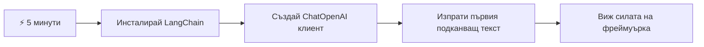
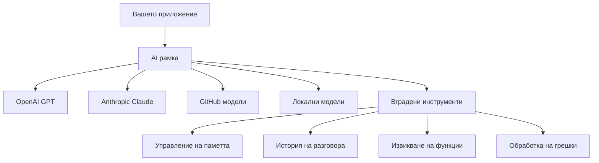
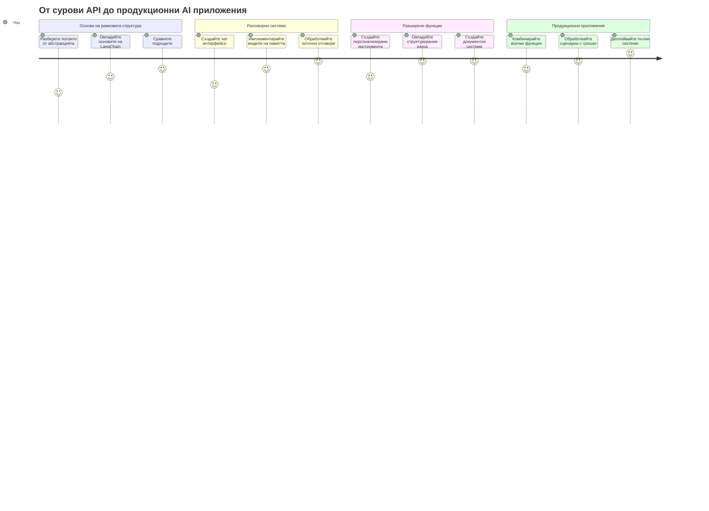
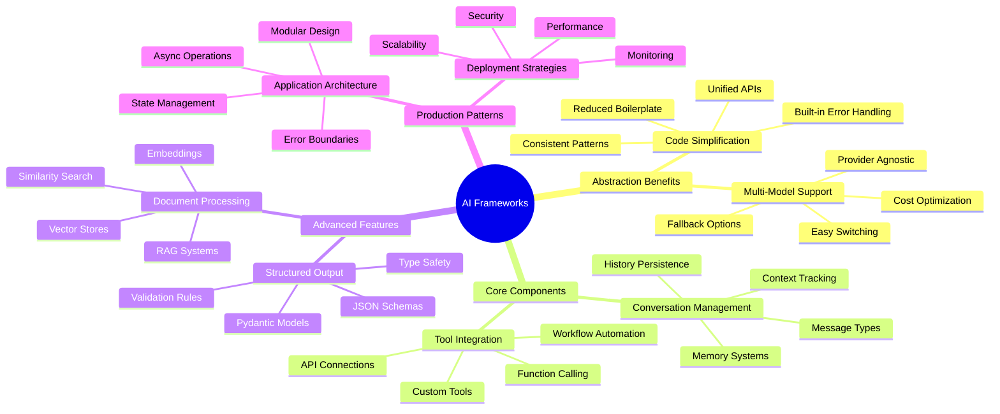
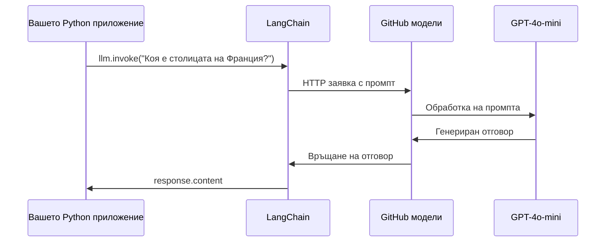
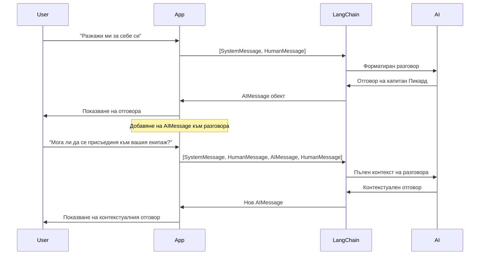
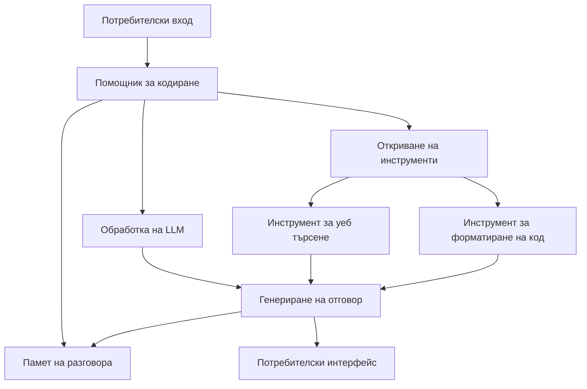
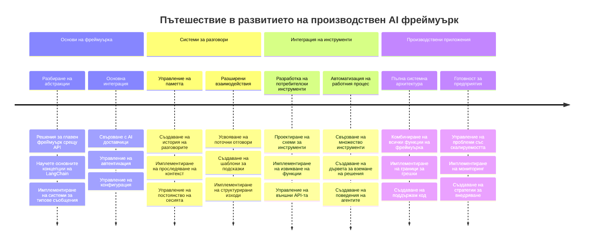
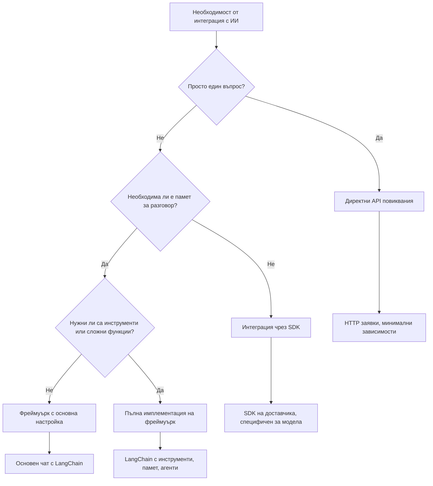

<!--
CO_OP_TRANSLATOR_METADATA:
{
  "original_hash": "3925b6a1c31c60755eaae4d578232c25",
  "translation_date": "2026-01-07T06:25:54+00:00",
  "source_file": "10-ai-framework-project/README.md",
  "language_code": "bg"
}
-->
# AI Framework

Чувствали ли сте се претоварени, опитвайки се да създадете AI приложения от нулата? Не сте сами! AI рамките са като швейцарски нож за разработка на AI - те са мощни инструменти, които могат да ви спестят време и главоболия при създаването на интелигентни приложения. Помислете за AI рамка като за добре организирана библиотека: тя предоставя предварително изготвени компоненти, стандартизирани API и умни абстракции, за да можете да се фокусирате върху решаването на проблеми, вместо да се борите с детайлите по имплементацията.

В този урок ще разгледаме как рамки като LangChain могат да превърнат някогашните сложни задачи по интеграция на AI в чист, четим код. Ще откриете как да се справяте с реални предизвикателства като проследяване на разговори, имплементиране на повикване на инструменти и управление на различни AI модели чрез единно интерфейс.

Към края на урока ще знаете кога да използвате рамки вместо директни API повиквания, как да използвате техните абстракции ефективно и как да изградите AI приложения, готови за реална употреба. Нека разгледаме какво могат да направят AI рамките за вашите проекти.

## ⚡ Какво можете да направите в следващите 5 минути

**Бърз старт за заети разработчици**


- **Минута 1**: Инсталирайте LangChain: `pip install langchain langchain-openai`
- **Минута 2**: Настройте своя GitHub токен и импортирайте ChatOpenAI клиента
- **Минута 3**: Създайте прост разговор със системни и човешки съобщения
- **Минута 4**: Добавете основен инструмент (като функция за събиране) и вижте повикването на AI инструменти
- **Минута 5**: Усетете разликата между директни API повиквания и абстракция чрез рамката

**Бърз тестов код**:
```python
from langchain_openai import ChatOpenAI
from langchain_core.messages import SystemMessage, HumanMessage

llm = ChatOpenAI(
    api_key=os.environ["GITHUB_TOKEN"],
    base_url="https://models.github.ai/inference",
    model="openai/gpt-4o-mini"
)

response = llm.invoke([
    SystemMessage(content="You are a helpful coding assistant"),
    HumanMessage(content="Explain Python functions briefly")
])
print(response.content)
```

**Защо е важно това**: За 5 минути ще изпитате как AI рамките преобразуват сложната интеграция на AI в прости методови повиквания. Това е основата, която захранва продукционни AI приложения.

## Защо да изберете рамка?

Така че сте готови да изградите AI приложение - страхотно! Но ето какво: имате няколко различни пътища, по които можете да тръгнете, и всеки има своите плюсове и минуси. Това е като да избирате между ходене пеша, каране на велосипед или шофиране – всички ще ви отведат до там, но преживяването (и усилието) ще е коренно различно.

Нека разгледаме трите основни начина, по които можете да интегрирате AI в проектите си:

| Подход | Предимства | Най-подходящ за | Съображения |
|----------|------------|----------|--------------|
| **Директни HTTP заявки** | Пълен контрол, без зависимости | Прости заявки, учене на основи | По-вербален код, ръчно управление на грешки |
| **Интеграция чрез SDK** | По-малко код, оптимизация за конкретни модели | Приложения с един модел | Ограничено до конкретни доставчици |
| **AI рамки** | Единен API, вградени абстракции | Приложения с множество модели, сложни работни потоци | Крива на учене, потенциално прекалена абстракция |

### Ползи от рамките на практика


**Защо рамките са важни:**
- **Обединяват** множество AI доставчици под един интерфейс
- **Управляват** паметта на разговора автоматично
- **Предоставят** готови инструменти за общи задачи като embeddings и повикване на функции
- **Менажират** обработка на грешки и логика за повторни опити
- **Превръщат** сложни работни потоци в четими методови повиквания

> 💡 **Професионален съвет**: Използвайте рамки, когато превключвате между различни AI модели или изграждате сложни функции като агенти, памет или повикване на инструменти. Останете с директните API, когато учите основите или създавате прости, фокусирани приложения.

**Заключение**: Подобно на избора между специализираните инструменти на майстор и пълна работилница, става дума да съчетаете инструмента с задачата. Рамките блестят при сложни, богати на функции приложения, докато директните API са добър избор за праволинейни случаи.

## 🗺️ Вашето обучително пътешествие към майсторство в AI рамките


**Вашата цел в пътуването**: Към края на този урок ще сте овладели разработката с AI рамки и ще можете да изграждате сложни AI приложения, готови за продукция, с които конкурирате търговските AI асистенти.

## Въведение

В този урок ще научите:

- Как да използвате обща AI рамка.
- Как да адресирате често срещани проблеми като чат разговори, използване на инструменти, памет и контекст.
- Как да използвате това за създаване на AI приложения.

## 🧠 Екосистема за разработка на AI рамки


**Основен принцип**: AI рамките абстрахират сложността, като същевременно предоставят мощни абстракции за управление на разговори, интеграция на инструменти и обработка на документи, позволявайки на разработчиците да създават сложни AI приложения с чист и поддържим код.

## Вашият първи AI промпт

Нека започнем с основите като създадем първото ви AI приложение, което изпраща въпрос и получава отговор. Подобно на Архимед, който открил принципа на изместване във ваната си, понякога най-простите наблюдения водят до най-мощните прозрения – а рамките правят тези прозрения достъпни.

### Настройване на LangChain с GitHub модели

Ще използваме LangChain за връзка с GitHub модели, което е страхотно, защото ви дава безплатен достъп до различни AI модели. Най-хубавото? Трябват ви само няколко прости параметъра за конфигурация, за да започнете:

```python
from langchain_openai import ChatOpenAI
import os

llm = ChatOpenAI(
    api_key=os.environ["GITHUB_TOKEN"],
    base_url="https://models.github.ai/inference",
    model="openai/gpt-4o-mini",
)

# Изпратете прост подкана
response = llm.invoke("What's the capital of France?")
print(response.content)
```

**Нека разгледаме какво се случва тук:**
- **Създава** LangChain клиент чрез класа `ChatOpenAI` – това е вашата врата към AI!
- **Конфигурира** връзката към GitHub модели с вашия автентикационен токен
- **Посочва** кой AI модел да се използва (`gpt-4o-mini`) – като да избирате вашия AI асистент
- **Изпраща** въпроса ви с метода `invoke()` – тук става магията
- **Извлича** и показва отговора – voilà, вие чатите с AI!

> 🔧 **Бележка за настройка**: Ако използвате GitHub Codespaces, късметлии сте – `GITHUB_TOKEN` вече е настроен! Локална работа? Няма проблем, просто трябва да създадете личен токен за достъп с подходящи разрешения.

**Очакван изход:**
```text
The capital of France is Paris.
```


## Създаване на разговорен AI

Първият пример демонстрира основите, но е само една размяна – вие задавате въпрос, получавате отговор и толкова. В реални приложения искате вашият AI да помни за какво сте разговаряли, както Watson и Holmes изграждаха своите разследващи разговори с времето.

Тук LangChain става особено полезен. Той предоставя различни типове съобщения, които помагат за структурирането на разговорите и ви позволяват да дадете личност на вашия AI. Ще изграждате чат преживявания, които запазват контекста и характера.

### Разбиране на типовете съобщения

Помислете за тези типове съобщения като различни „шапки“, които участниците носят в разговора. LangChain използва различни класове съобщения, за да следи кой какво казва:

| Тип съобщение | Цел | Примерна употреба |
|--------------|---------|------------------|
| `SystemMessage` | Определя личността и поведението на AI | "Ти си полезен помощник по програмиране" |
| `HumanMessage` | Представлява потребителския вход | "Обясни как работят функциите" |
| `AIMessage` | Съхранява отговорите на AI | Предишни AI отговори в разговора |

### Създаване на първия си разговор

Нека създадем разговор, в който нашият AI поема конкретна роля. Ще го направим да влезе в ролята на капитан Пикар – персонаж, известен със своята дипломатическа мъдрост и лидерство:

```python
messages = [
    SystemMessage(content="You are Captain Picard of the Starship Enterprise"),
    HumanMessage(content="Tell me about you"),
]
```

**Разгледайте тази настройка на разговора:**
- **Установява** ролята и личността на AI чрез `SystemMessage`
- **Предоставя** началната потребителска заявка чрез `HumanMessage`
- **Създава** основа за многообменен разговор

Пълният код за този пример изглежда така:

```python
from langchain_core.messages import HumanMessage, SystemMessage
from langchain_openai import ChatOpenAI
import os

llm = ChatOpenAI(
    api_key=os.environ["GITHUB_TOKEN"],
    base_url="https://models.github.ai/inference",
    model="openai/gpt-4o-mini",
)

messages = [
    SystemMessage(content="You are Captain Picard of the Starship Enterprise"),
    HumanMessage(content="Tell me about you"),
]


# работи
response  = llm.invoke(messages)
print(response.content)
```

Трябва да видите резултат, подобен на:

```text
I am Captain Jean-Luc Picard, the commanding officer of the USS Enterprise (NCC-1701-D), a starship in the United Federation of Planets. My primary mission is to explore new worlds, seek out new life and new civilizations, and boldly go where no one has gone before. 

I believe in the importance of diplomacy, reason, and the pursuit of knowledge. My crew is diverse and skilled, and we often face challenges that test our resolve, ethics, and ingenuity. Throughout my career, I have encountered numerous species, grappled with complex moral dilemmas, and have consistently sought peaceful solutions to conflicts.

I hold the ideals of the Federation close to my heart, believing in the importance of cooperation, understanding, and respect for all sentient beings. My experiences have shaped my leadership style, and I strive to be a thoughtful and just captain. How may I assist you further?
```

За да поддържате непрекъснатост в разговора (вместо да нулирате контекста всеки път), трябва да продължите да добавяте отговори към списъка със съобщения. Подобно на устните традиции, които съхраняват истории през поколения, този подход изгражда дълготрайна памет:

```python
from langchain_core.messages import HumanMessage, SystemMessage
from langchain_openai import ChatOpenAI
import os

llm = ChatOpenAI(
    api_key=os.environ["GITHUB_TOKEN"],
    base_url="https://models.github.ai/inference",
    model="openai/gpt-4o-mini",
)

messages = [
    SystemMessage(content="You are Captain Picard of the Starship Enterprise"),
    HumanMessage(content="Tell me about you"),
]


# работи
response  = llm.invoke(messages)

print(response.content)

print("---- Next ----")

messages.append(response)
messages.append(HumanMessage(content="Now that I know about you, I'm Chris, can I be in your crew?"))

response  = llm.invoke(messages)

print(response.content)

```

Много готино, нали? Това, което става тук, е, че извикваме LLM два пъти – първо с нашите две първоначални съобщения, а после пак с цялата история на разговора. Като че ли AI всъщност следи нашия чат!

Когато изпълните този код, ще получите втори отговор, който звучи приблизително така:

```text
Welcome aboard, Chris! It's always a pleasure to meet those who share a passion for exploration and discovery. While I cannot formally offer you a position on the Enterprise right now, I encourage you to pursue your aspirations. We are always in need of talented individuals with diverse skills and backgrounds. 

If you are interested in space exploration, consider education and training in the sciences, engineering, or diplomacy. The values of curiosity, resilience, and teamwork are crucial in Starfleet. Should you ever find yourself on a starship, remember to uphold the principles of the Federation: peace, understanding, and respect for all beings. Your journey can lead you to remarkable adventures, whether in the stars or on the ground. Engage!
```


Ще приема това като „може би“ ;)

## Поточно предаване на отговори

Забелязвали ли сте как ChatGPT сякаш „писка“ отговорите си в реално време? Това е поточно предаване в действие. Като наблюдаване на майстор-калиграф – да виждате как буквите се появяват щрих по щрих, а не изведнъж – поточното предаване прави взаимодействието по-естествено и осигурява незабавна обратна връзка.

### Имплементиране на поточно предаване с LangChain

```python
from langchain_openai import ChatOpenAI
import os

llm = ChatOpenAI(
    api_key=os.environ["GITHUB_TOKEN"],
    base_url="https://models.github.ai/inference",
    model="openai/gpt-4o-mini",
    streaming=True
)

# Потоков отговор
for chunk in llm.stream("Write a short story about a robot learning to code"):
    print(chunk.content, end="", flush=True)
```

**Защо поточното предаване е страхотно:**
- **Показва** съдържанието докато се създава – няма повече неловко чакане!
- **Прави** потребителите да чувстват, че нещо наистина се случва
- **Изглежда** по-бързо, дори когато технически не е
- **Позволява** на потребителите да започнат да четат, докато AI все още „мисли“

> 💡 **Съвет за опит на потребителя**: Поточното предаване блести при по-дълги отговори като обяснения на код, креативно писане или детайлни уроци. Вашите потребители ще обикнат да виждат напредъка, вместо да гледат празен екран!

### 🎯 Педагогическа проверка: Ползи от абстракцията на рамките

**Пауза и размисъл**: Току-що изпитахте мощта на абстракциите в AI рамките. Сравнете това, което научихте, с директните API повиквания от предишните уроци.

**Бърза самопроверка**:
- Можете ли да обясните как LangChain опростява управлението на разговорите спрямо ръчното проследяване на съобщения?
- Каква е разликата между методите `invoke()` и `stream()`, и кога би използвали всеки?
- Как системата за типове съобщения подобрява организацията на кода?

**Връзка с реалния свят**: Абстрактните модели, които научихте (типове съобщения, поточни интерфейси, памет на разговори), се използват във всяко голямо AI приложение – от интерфейса на ChatGPT до асистенцията на GitHub Copilot. Вие овладявате същите архитектурни модели, които използват професионалните AI екипи.

**Въпрос за предизвикателство**: Как бихте проектирали абстракция на рамка за обработка на различни доставчици на AI модели (OpenAI, Anthropic, Google) с единен интерфейс? Обмислете предимствата и компромисите.

## Шаблони за промпти

Шаблоните за промпти работят като реторическите структури, използвани в класическата ораторска реч – помислете как Цицерон адаптираше речите си за различни аудитории, запазвайки една и съща убедителна рамка. Те ви позволяват да създавате многократно използваеми промпти, където можете да заменяте различни елементи информация без да преписвате всичко отначало. След като настроите шаблона, просто попълвате променливите с необходимите стойности.

### Създаване на многократно използваеми промпти

```python
from langchain_core.prompts import ChatPromptTemplate

# Дефинирайте шаблон за обяснения на кода
template = ChatPromptTemplate.from_messages([
    ("system", "You are an expert programming instructor. Explain concepts clearly with examples."),
    ("human", "Explain {concept} in {language} with a practical example for {skill_level} developers")
])

# Използвайте шаблона с различни стойности
questions = [
    {"concept": "functions", "language": "JavaScript", "skill_level": "beginner"},
    {"concept": "classes", "language": "Python", "skill_level": "intermediate"},
    {"concept": "async/await", "language": "JavaScript", "skill_level": "advanced"}
]

for question in questions:
    prompt = template.format_messages(**question)
    response = llm.invoke(prompt)
    print(f"Topic: {question['concept']}\n{response.content}\n---\n")
```

**Защо ще харесате използването на шаблони:**
- **Запазват** консистентност на промптите из цялото приложение
- **Без повече** объркващи конкатенации на низове – само чисти, прости променливи
- **AI-то ви** се държи предвидимо, защото структурата остава същата
- **Обновленията** са лесни – променяте шаблона веднъж и е поправено навсякъде

## Структуриран изход

Калвало ли ви е да се ядосвате, опитвайки се да разчетете AI отговори, върнати като неструктуриран текст? Структурираният изход е като да научите AI да следва систематичния подход на Линей за биологична класификация – организирана, предвидима и лесна за работа. Можете да изисквате JSON, конкретни структури от данни или всякакъв формат, който ви е нужен.

### Определяне на схеми за изход

```python
from langchain_core.prompts import ChatPromptTemplate
from langchain_core.output_parsers import JsonOutputParser
from pydantic import BaseModel, Field

class CodeReview(BaseModel):
    score: int = Field(description="Code quality score from 1-10")
    strengths: list[str] = Field(description="List of code strengths")
    improvements: list[str] = Field(description="List of suggested improvements")
    overall_feedback: str = Field(description="Summary feedback")

# Настройте парсъра
parser = JsonOutputParser(pydantic_object=CodeReview)

# Създайте подканващ текст с инструкции за форматиране
prompt = ChatPromptTemplate.from_messages([
    ("system", "You are a code reviewer. {format_instructions}"),
    ("human", "Review this code: {code}")
])

# Форматирайте подканващия текст с инструкции
chain = prompt | llm | parser

# Получете структурирания отговор
code_sample = """
def calculate_average(numbers):
    return sum(numbers) / len(numbers)
"""

result = chain.invoke({
    "code": code_sample,
    "format_instructions": parser.get_format_instructions()
})

print(f"Score: {result['score']}")
print(f"Strengths: {', '.join(result['strengths'])}")
```

**Защо структурираният изход е революционен:**
- **Няма повече** чудене за формата, който ще получите – винаги е последователен
- **Свързва се** директно с вашите бази данни и API без допълнителна работа
- **Хваща** странни AI отговори преди да счупят вашето приложение
- **Прави** кода ви по-чист, защото знаете точно с какво работите

## Повикване на инструменти

Сега достигаме до една от най-мощните функции: инструментите. Това е начинът да дадете на AI практични възможности отвъд разговора. Подобно на средновековните гилдии, които разработваха специализирани инструменти за конкретни занаяти, можете да оборудвате AI с фокусирани инструменти. Описвате наличните инструменти и когато някой поиска нещо, което съвпада, AI може да предприеме действие.

### Използване на Python

Нека добавим някои инструменти по следния начин:

```python
from typing_extensions import Annotated, TypedDict

class add(TypedDict):
    """Add two integers."""

    # Анотациите трябва да имат тип и могат по избор да включват стойност по подразбиране и описание (в този ред).
    a: Annotated[int, ..., "First integer"]
    b: Annotated[int, ..., "Second integer"]

tools = [add]

functions = {
    "add": lambda a, b: a + b
}
```

Какво се случва тук? Създаваме план за инструмент, наречен `add`. Наследявайки се от `TypedDict` и използвайки тези елегантни типове `Annotated` за `a` и `b`, даваме на LLM ясна представа какво прави този инструмент и от какво има нужда. Речникът `functions` е като нашият инструментариум – казва на кода ни какво точно да прави, когато AI реши да използва конкретен инструмент.

Нека видим как после извикваме LLM с този инструмент:

```python
llm = ChatOpenAI(
    api_key=os.environ["GITHUB_TOKEN"],
    base_url="https://models.github.ai/inference",
    model="openai/gpt-4o-mini",
)

llm_with_tools = llm.bind_tools(tools)
```

Тук извикваме `bind_tools` с нашия масив `tools`, и по този начин LLM `llm_with_tools` вече има познания за този инструмент.

За да използваме този нов LLM, можем да напишем следния код:

```python
query = "What is 3 + 12?"

res = llm_with_tools.invoke(query)
if(res.tool_calls):
    for tool in res.tool_calls:
        print("TOOL CALL: ", functions[tool["name"]](../../../10-ai-framework-project/**tool["args"]))
print("CONTENT: ",res.content)
```

Сега, когато извикваме `invoke` на този нов llm със инструменти, свойството `tool_calls` може да е запълнено. Ако е така, всеки идентифициран инструмент има свойства `name` и `args`, които показват кой инструмент трябва да бъде извикан и с какви аргументи. Пълният код изглежда така:

```python
from langchain_core.messages import HumanMessage, SystemMessage
from langchain_openai import ChatOpenAI
import os
from typing_extensions import Annotated, TypedDict

class add(TypedDict):
    """Add two integers."""

    # Анотациите трябва да имат тип и могат по желание да включват стойност по подразбиране и описание (в този ред).
    a: Annotated[int, ..., "First integer"]
    b: Annotated[int, ..., "Second integer"]

tools = [add]

functions = {
    "add": lambda a, b: a + b
}

llm = ChatOpenAI(
    api_key=os.environ["GITHUB_TOKEN"],
    base_url="https://models.github.ai/inference",
    model="openai/gpt-4o-mini",
)

llm_with_tools = llm.bind_tools(tools)

query = "What is 3 + 12?"

res = llm_with_tools.invoke(query)
if(res.tool_calls):
    for tool in res.tool_calls:
        print("TOOL CALL: ", functions[tool["name"]](../../../10-ai-framework-project/**tool["args"]))
print("CONTENT: ",res.content)
```

При изпълнение на този код трябва да видите изход подобен на:

```text
TOOL CALL:  15
CONTENT: 
```

AI разгледа "Какво е 3 + 12" и разпозна това като задача за инструмента `add`. Подобно на опитния библиотекар, който знае какъв справочник да консултира в зависимост от вида на зададения въпрос, AI направи това определяне въз основа на името, описанието и спецификациите на полето на инструмента. Резултатът 15 идва от нашия речник `functions`, който изпълнява инструмента:

```python
print("TOOL CALL: ", functions[tool["name"]](../../../10-ai-framework-project/**tool["args"]))
```

### По-интересен инструмент, който извиква уеб API
Добавянето на числа демонстрира концепцията, но реалните инструменти обикновено извършват по-сложни операции, като викане на уеб API. Нека разширим примера, така че AI да изтегля съдържание от интернет - подобно на начина, по който телеграфните оператори някога свързваха отдалечени места:

```python
class joke(TypedDict):
    """Tell a joke."""

    # Ангажираните трябва да имат тип и по избор може да включват стойност по подразбиране и описание (в този ред).
    category: Annotated[str, ..., "The joke category"]

def get_joke(category: str) -> str:
    response = requests.get(f"https://api.chucknorris.io/jokes/random?category={category}", headers={"Accept": "application/json"})
    if response.status_code == 200:
        return response.json().get("value", f"Here's a {category} joke!")
    return f"Here's a {category} joke!"

functions = {
    "add": lambda a, b: a + b,
    "joke": lambda category: get_joke(category)
}

query = "Tell me a joke about animals"

# останалата част от кода е същата
```

Ако стартирате този код, ще получите отговор, казващ нещо като:

```text
TOOL CALL:  Chuck Norris once rode a nine foot grizzly bear through an automatic car wash, instead of taking a shower.
CONTENT:  
```

```mermaid
flowchart TD
    A[Потребителски въпрос: "Кажи ми шега за животни"] --> B[Анализ на LangChain]
    B --> C{Инструмент наличен?}
    C -->|Да| D[Избери инструмент за шеги]
    C -->|Не| E[Генерирай директен отговор]
    
    D --> F[Извличане на параметри]
    F --> G[Извикване на joke(категория="животни")]
    G --> H[API заявка към chucknorris.io]
    H --> I[Връщане на съдържанието на шегата]
    I --> J[Показване на потребителя]
    
    E --> K[Отговор, генериран от AI]
    K --> J
    
    subgraph "Слой за дефиниране на инструменти"
        L[TypedDict Схема]
        M[Реализация на функция]
        N[Валидиране на параметри]
    end
    
    D --> L
    F --> N
    G --> M
```
Ето кода в цялост:

```python
from langchain_openai import ChatOpenAI
import requests
import os
from typing_extensions import Annotated, TypedDict

class add(TypedDict):
    """Add two integers."""

    # Анотациите трябва да имат тип и могат по избор да включват стойност по подразбиране и описание (в този ред).
    a: Annotated[int, ..., "First integer"]
    b: Annotated[int, ..., "Second integer"]

class joke(TypedDict):
    """Tell a joke."""

    # Анотациите трябва да имат тип и могат по избор да включват стойност по подразбиране и описание (в този ред).
    category: Annotated[str, ..., "The joke category"]

tools = [add, joke]

def get_joke(category: str) -> str:
    response = requests.get(f"https://api.chucknorris.io/jokes/random?category={category}", headers={"Accept": "application/json"})
    if response.status_code == 200:
        return response.json().get("value", f"Here's a {category} joke!")
    return f"Here's a {category} joke!"

functions = {
    "add": lambda a, b: a + b,
    "joke": lambda category: get_joke(category)
}

llm = ChatOpenAI(
    api_key=os.environ["GITHUB_TOKEN"],
    base_url="https://models.github.ai/inference",
    model="openai/gpt-4o-mini",
)

llm_with_tools = llm.bind_tools(tools)

query = "Tell me a joke about animals"

res = llm_with_tools.invoke(query)
if(res.tool_calls):
    for tool in res.tool_calls:
        # print("ИЗВИКВАНЕ НА ИНСТРУМЕНТ: ", tool)
        print("TOOL CALL: ", functions[tool["name"]](../../../10-ai-framework-project/**tool["args"]))
print("CONTENT: ",res.content)
```

## Вграждания и обработка на документи

Вгражданията представляват едно от най-елегантните решения в съвременния AI. Представете си, че можете да вземете всеки текст и да го преобразувате в числови координати, които улавят неговото значение. Това точно правят вгражданията - превръщат текст в точки в многомерно пространство, където подобни концепции се групират заедно. Това е като да имате координатна система за идеи, наподобяваща начина, по който Менделеев е организирал периодичната таблица по атомни свойства.

### Създаване и използване на вграждания

```python
from langchain_openai import OpenAIEmbeddings
from langchain_community.vectorstores import FAISS
from langchain_community.document_loaders import TextLoader
from langchain.text_splitter import CharacterTextSplitter

# Инициализиране на вгражданията
embeddings = OpenAIEmbeddings(
    api_key=os.environ["GITHUB_TOKEN"],
    base_url="https://models.github.ai/inference",
    model="text-embedding-3-small"
)

# Зареждане и разделяне на документи
loader = TextLoader("documentation.txt")
documents = loader.load()

text_splitter = CharacterTextSplitter(chunk_size=1000, chunk_overlap=0)
texts = text_splitter.split_documents(documents)

# Създаване на векторно хранилище
vectorstore = FAISS.from_documents(texts, embeddings)

# Извършване на търсене по сходство
query = "How do I handle user authentication?"
similar_docs = vectorstore.similarity_search(query, k=3)

for doc in similar_docs:
    print(f"Relevant content: {doc.page_content[:200]}...")
```

### Зареждачи на документи за различни формати

```python
from langchain_community.document_loaders import (
    PyPDFLoader,
    CSVLoader,
    JSONLoader,
    WebBaseLoader
)

# Заредете различни типове документи
pdf_loader = PyPDFLoader("manual.pdf")
csv_loader = CSVLoader("data.csv")
json_loader = JSONLoader("config.json")
web_loader = WebBaseLoader("https://example.com/docs")

# Обработвайте всички документи
all_documents = []
for loader in [pdf_loader, csv_loader, json_loader, web_loader]:
    docs = loader.load()
    all_documents.extend(docs)
```

**Какво може да направите с вграждания:**
- **Изградете** търсене, което наистина разбира значението ви, а не просто съвпадение на ключови думи
- **Създайте** AI, който може да отговаря на въпроси за вашите документи
- **Направете** системи за препоръчване, които предлагат действително релевантно съдържание
- **Автоматично** организирайте и категоризирайте съдържанието си

```mermaid
flowchart LR
    A[Документи] --> B[Разделител на текст]
    B --> C[Създаване на вграждания]
    C --> D[Векторно хранилище]
    
    E[Потребителски въпрос] --> F[Вграждане на въпроса]
    F --> G[Търсене на сходство]
    G --> D
    D --> H[Релевантни документи]
    H --> I[AI отговор]
    
    subgraph "Векторно пространство"
        J[Документ А: [0.1, 0.8, 0.3...]]
        K[Документ Б: [0.2, 0.7, 0.4...]]
        L[Въпрос: [0.15, 0.75, 0.35...]]
    end
    
    C --> J
    C --> K
    F --> L
    G --> J
    G --> K
```
## Изграждане на пълно AI приложение

Сега ще интегрираме всичко, което сте научили, в цялостно приложение - асистент за кодиране, който може да отговаря на въпроси, да използва инструменти и да поддържа спомен за разговора. По подобие на начина, по който печатната преса комбинира съществуващи технологии (подвижен шрифт, мастило, хартия и натиск) в нещо трансформиращо, ние ще съчетаем нашите AI компоненти в нещо практично и полезно.

### Пример за цялостно приложение

```python
from langchain_openai import ChatOpenAI, OpenAIEmbeddings
from langchain_core.prompts import ChatPromptTemplate
from langchain_core.messages import HumanMessage, SystemMessage, AIMessage
from langchain_community.vectorstores import FAISS
from typing_extensions import Annotated, TypedDict
import os
import requests

class CodingAssistant:
    def __init__(self):
        self.llm = ChatOpenAI(
            api_key=os.environ["GITHUB_TOKEN"],
            base_url="https://models.github.ai/inference",
            model="openai/gpt-4o-mini"
        )
        
        self.conversation_history = [
            SystemMessage(content="""You are an expert coding assistant. 
            Help users learn programming concepts, debug code, and write better software.
            Use tools when needed and maintain a helpful, encouraging tone.""")
        ]
        
        # Дефинирай инструменти
        self.setup_tools()
    
    def setup_tools(self):
        class web_search(TypedDict):
            """Search for programming documentation or examples."""
            query: Annotated[str, "Search query for programming help"]
        
        class code_formatter(TypedDict):
            """Format and validate code snippets."""
            code: Annotated[str, "Code to format"]
            language: Annotated[str, "Programming language"]
        
        self.tools = [web_search, code_formatter]
        self.llm_with_tools = self.llm.bind_tools(self.tools)
    
    def chat(self, user_input: str):
        # Добави съобщение от потребителя към разговора
        self.conversation_history.append(HumanMessage(content=user_input))
        
        # Вземи отговор от AI
        response = self.llm_with_tools.invoke(self.conversation_history)
        
        # Обработи извиквания на инструменти, ако има такива
        if response.tool_calls:
            for tool_call in response.tool_calls:
                tool_result = self.execute_tool(tool_call)
                print(f"🔧 Tool used: {tool_call['name']}")
                print(f"📊 Result: {tool_result}")
        
        # Добави отговора на AI към разговора
        self.conversation_history.append(response)
        
        return response.content
    
    def execute_tool(self, tool_call):
        tool_name = tool_call['name']
        args = tool_call['args']
        
        if tool_name == 'web_search':
            return f"Found documentation for: {args['query']}"
        elif tool_name == 'code_formatter':
            return f"Formatted {args['language']} code: {args['code'][:50]}..."
        
        return "Tool execution completed"

# Пример за употреба
assistant = CodingAssistant()

print("🤖 Coding Assistant Ready! Type 'quit' to exit.\n")

while True:
    user_input = input("You: ")
    if user_input.lower() == 'quit':
        break
    
    response = assistant.chat(user_input)
    print(f"🤖 Assistant: {response}\n")
```

**Архитектура на приложението:**


**Основни функции, които сме реализирали:**
- **Запомня** целия ви разговор за контекстна последователност
- **Изпълнява действия** чрез викане на инструменти, не само чрез чат
- **Следва** прогнозируеми модели на взаимодействие
- **Управлява** обработка на грешки и сложни работни процеси автоматично

### 🎯 Педагогическа проверка: Производствена AI архитектура

**Разбиране на архитектурата**: Изградили сте пълно AI приложение, което съчетава управление на разговори, извикване на инструменти и структурирани работни потоци. Това представлява разработка на AI приложение на производствено ниво.

**Основни усвоени концепции**:
- **Архитектура на базата на класове**: Организирана, поддържаща се структура на AI приложението
- **Интеграция на инструменти**: Персонализирана функционалност извън разговора
- **Управление на паметта**: Психическа последователност на разговора
- **Обработка на грешки**: Здрава работа на приложението

**Връзка с индустрията**: Патърните на архитектурата, които сте имплементирали (класове за разговори, системи с инструменти, управление на паметта) са същите, които се използват в корпоративни AI приложения като AI асистента на Slack, GitHub Copilot и Microsoft Copilot. Вие изграждате с професионално мислене за архитектура.

**Въпрос за размисъл**: Как бихте разширили това приложение, за да поддържа множество потребители, постоянна памет или интеграция с външни бази данни? Обмислете предизвикателствата при мащабируемост и управление на състоянието.

## Задача: Изградете собствен AI-подпомаган учебен асистент

**Цел**: Създайте AI приложение, което помага на студентите да научат програмни концепции, предоставяйки обяснения, кодови примери и интерактивни тестове.

### Изисквания

**Основни функции (задължителни):**
1. **Разговорен интерфейс**: Имплементирайте чат система, която поддържа контекст през множество въпроси
2. **Образователни инструменти**: Създайте поне два инструмента, които подпомагат ученето:
   - Инструмент за обяснение на код
   - Генератор на концептуални тестове
3. **Персонализирано обучение**: Използвайте системни съобщения, за да адаптирате отговорите спрямо различни нива на умения
4. **Форматиране на отговори**: Имплементирайте структурирани изходни данни за въпроси от тестовете

### Стъпки за реализация

**Стъпка 1: Настройте средата си**
```bash
pip install langchain langchain-openai
```

**Стъпка 2: Базова чат функционалност**
- Създайте клас `StudyAssistant`
- Имплементирайте памет на разговорите
- Добавете конфигурация на личността за образователна подкрепа

**Стъпка 3: Добавете образователни инструменти**
- **Обяснител на кода**: Разбива кода на разбираеми части
- **Генератор на тестове**: Създава въпроси за програмни концепции
- **Тракер за напредък**: Проследява покритите теми

**Стъпка 4: Подобрени функции (по избор)**
- Имплементирайте стрийминг на отговори за по-добро потребителско изживяване
- Добавете зареждане на документи, за да включите учебни материали
- Създайте вграждания за извличане на съдържание на база сходство

### Критерии за оценяване

| Функция | Отлично (4) | Добро (3) | Задоволително (2) | Трябва подобрение (1) |
|---------|-------------|-----------|-------------------|-----------------------|
| **Теч на разговора** | Естествен, с внимание към контекста | Добро запазване на контекста | Основен разговор | Няма памет между обмени |
| **Интеграция на инструменти** | Множество полезни инструменти работят безотказно | 2+ правилно имплементирани инструменти | 1-2 основни инструмента | Инструментите не работят |
| **Кодово качество** | Чист, добре документиран, с обработка на грешки | Добра структура, някаква документация | Работи основната функционалност | Лоша структура, липса на обработка на грешки |
| **Образователна стойност** | Наистина полезно за учене, адаптивно | Добра подкрепа за учене | Основни обяснения | Ограничена образователна полза |

### Примерна структура на кода

```python
class StudyAssistant:
    def __init__(self, skill_level="beginner"):
        # Инициализиране на LLM, инструменти и памет за разговор
        pass
    
    def explain_code(self, code, language):
        # Инструмент: Обяснява как работи кодът
        pass
    
    def generate_quiz(self, topic, difficulty):
        # Инструмент: Създава тренировъчни въпроси
        pass
    
    def chat(self, user_input):
        # Основен интерфейс за разговор
        pass

# Пример за употреба
assistant = StudyAssistant(skill_level="intermediate")
response = assistant.chat("Explain how Python functions work")
```

**Допълнителни предизвикателства:**
- Добавете възможности за гласов вход/изход
- Имплементирайте уеб интерфейс с Streamlit или Flask
- Създайте база знания от учебни материали с помощта на вграждания
- Добавете проследяване на напредъка и персонализирани учебни пътеки

## 📈 Времева линия за овладяване на разработката на AI рамка


**🎓 Крайъгълен камък при завършване**: Успешно овладяхте разработката на AI рамка с помощта на същите инструменти и патърни, които захранват съвременните AI приложения. Тези умения представляват върха на развитието на AI приложения и ви подготвят за изграждане на интелигентни системи на корпоративно ниво.

**🔄 Следващо ниво възможности**:
- Готови сте да изследвате напреднали AI архитектури (агенти, мултиагентни системи)
- Подготвени сте да изградите RAG системи с векторни бази данни
- Оборудвани сте да създавате мултимодални AI приложения
- Поставили сте основата за мащабиране и оптимизация на AI приложения

## Обобщение

🎉 Вече сте овладели основите на разработката на AI рамки и сте научили как да изграждате сложни AI приложения с помощта на LangChain. Като завършване на пълноценно обучение, придобихте значителен набор от умения. Нека обобщим какво сте постигнали.

### Какво научихте

**Основни концепции на рамката:**
- **Предимства на рамките**: Разбиране кога да изберете рамки пред директни API обаждания
- **Основи на LangChain**: Настройка и конфигуриране на връзки с AI модели
- **Типове съобщения**: Използване на `SystemMessage`, `HumanMessage` и `AIMessage` за структуриран разговор

**Разширени функции:**
- **Викане на инструменти**: Създаване и интегриране на персонализирани инструменти за разширени AI възможности
- **Памет на разговорите**: Поддържане на контекст през множество обръщения в разговора
- **Стрийминг на отговори**: Имплементиране на реакция в реално време
- **Шаблони за промпти**: Изграждане на многократно използваеми, динамични шаблони
- **Структуриран изход**: Гарантиране на конзистентни, пригодни за парсване AI отговори
- **Вграждания**: Създаване на семантично търсене и обработка на документи

**Практическа употреба:**
- **Изграждане на пълни приложения**: Комбиниране на множество функции в приложения, готови за продукция
- **Обработка на грешки**: Имплементиране на здрава обработка на грешки и валидация
- **Интеграция на инструменти**: Създаване на персонализирани инструменти, разширяващи AI възможностите

### Основни изводи

> 🎯 **Запомнете**: AI рамките като LangChain са като вашите най-добри приятели, които скриват сложността и са пълни с функции. Те са идеални, когато ви трябва памет на разговорите, викане на инструменти или работа с множество AI модели без да губите ума си.

**Рамка за взимане на решения за AI интеграция:**


### Къде да продължите оттук?

**Започнете да изграждате веднага:**
- Вземете тези концепции и създайте нещо, което ВАС вдъхновява!
- Играйте си с различни AI модели чрез LangChain - това е като игрище за AI модели
- Създайте инструменти, които решават реални проблеми във вашата работа или проекти

**Готови ли сте за следващото ниво?**
- **AI агенти**: Изградете AI системи, които могат да планират и изпълняват сложни задачи сами
- **RAG (Retrieval-Augmented Generation)**: Комбинирайте AI с вашите бази знания за супер мощни приложения
- **Мултимодален AI**: Работете с текст, изображения и аудио заедно - възможностите са безкрайни!
- **Производствено внедряване**: Научете как да мащабирате вашите AI приложения и да ги наблюдавате в реалния свят

**Присъединете се към общността:**
- Общността на LangChain е отлична за оставане в крак с новостите и усвояване на добри практики
- GitHub Models ви дава достъп до най-новите AI възможности - перфектно за експериментиране
- Продължавайте да практикувате с различни случаи - всеки проект ще ви научи на нещо ново

Сега имате знанията да изграждате интелигентни, разговорни приложения, които могат да помагат на хората да решават реални проблеми. Подобно на ренесансовите майстори, които съчетавали артистично виждане с технически умения, вие можете да слеете AI възможностите с практическо приложение. Въпросът е: какво ще създадете? 🚀

## Предизвикателство GitHub Copilot Agent 🚀

Използвайте Agent режима, за да изпълните следното предизвикателство:

**Описание:** Създайте напреднал AI асистент за преглед на код, който комбинира множество LangChain функции, включително викане на инструменти, структуриран изход и памет за разговори, за да осигури обстойни отзиви за кодови подавания.

**Промпт:** Създайте клас CodeReviewAssistant, който имплементира:
1. Инструмент за анализ на сложността на кода и предлагане на подобрения
2. Инструмент за проверка на кода спрямо най-добрите практики
3. Структуриран изход с Pydantic модели за еднакъв формат на прегледа
4. Памет за разговори, за да следи сесиите на преглед
5. Основен чат интерфейс, който може да обработва кодови подавания и да дава подробна, приложима обратна връзка

Асистентът трябва да може да преглежда код на множество програмни езици, да поддържа контекст през няколко кодови подавания в сесия и да предоставя както обобщени оценки, така и подробни предложения за подобрение.

Научете повече за [агент режим](https://code.visualstudio.com/blogs/2025/02/24/introducing-copilot-agent-mode) тук.

---

<!-- CO-OP TRANSLATOR DISCLAIMER START -->
**Отказ от отговорност**:
Този документ е преведен с помощта на AI преводаческа услуга [Co-op Translator](https://github.com/Azure/co-op-translator). Въпреки че се стремим към точност, моля, имайте предвид, че автоматизираните преводи могат да съдържат грешки или неточности. Оригиналният документ на неговия роден език трябва да се счита за авторитетен източник. За критична информация се препоръчва професионален човешки превод. Не носим отговорност за каквито и да било недоразумения или неправилни тълкувания, възникнали от използването на този превод.
<!-- CO-OP TRANSLATOR DISCLAIMER END -->