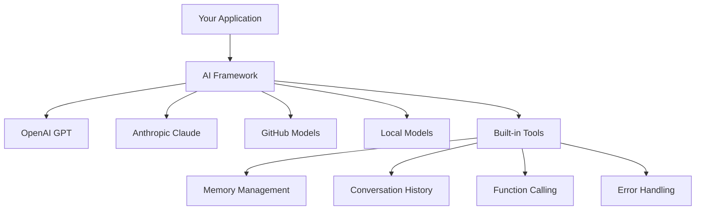
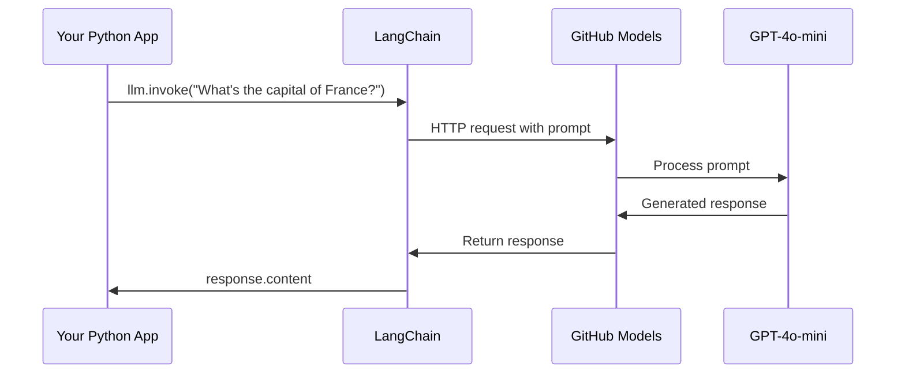
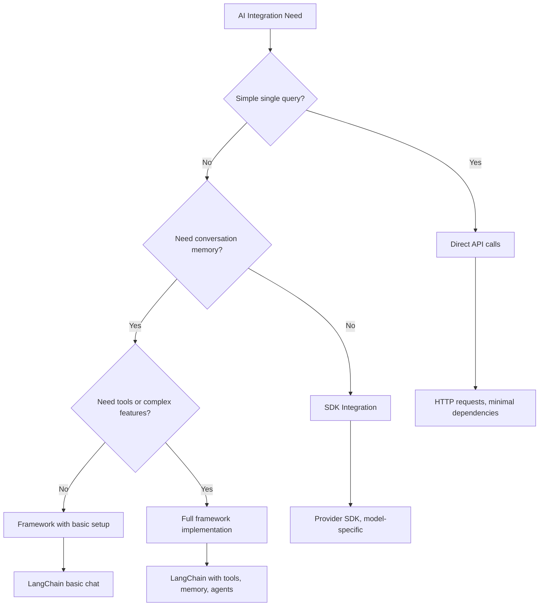

<!--
CO_OP_TRANSLATOR_METADATA:
{
  "original_hash": "e2c4ae5688e34b4b8b09d52aec56c79e",
  "translation_date": "2025-10-24T22:35:45+00:00",
  "source_file": "10-ai-framework-project/README.md",
  "language_code": "bg"
}
-->
# AI Фреймуърк

Чувствали ли сте се претоварени, опитвайки се да изградите AI приложения от нулата? Не сте сами! AI фреймуърковете са като швейцарско ножче за разработка на AI - мощни инструменти, които могат да ви спестят време и усилия при създаването на интелигентни приложения. Помислете за AI фреймуърк като добре организирана библиотека: той предоставя предварително изградени компоненти, стандартизирани API-та и интелигентни абстракции, за да можете да се фокусирате върху решаването на проблеми, вместо да се борите с детайлите на имплементацията.

В този урок ще разгледаме как фреймуъркове като LangChain могат да превърнат сложните задачи за интеграция на AI в чист и четим код. Ще откриете как да се справяте с реални предизвикателства като проследяване на разговори, имплементиране на инструменти и управление на различни AI модели чрез един унифициран интерфейс.

До края на урока ще знаете кога да използвате фреймуъркове вместо директни API извиквания, как ефективно да използвате техните абстракции и как да изграждате AI приложения, готови за реална употреба. Нека разгледаме какво могат да направят AI фреймуърковете за вашите проекти.

## Защо да изберете фреймуърк?

Готови сте да изградите AI приложение - страхотно! Но ето го въпросът: имате няколко различни пътища, които можете да изберете, и всеки от тях има своите плюсове и минуси. Това е като да избирате между ходене, каране на велосипед или шофиране, за да стигнете някъде - всички ще ви отведат там, но преживяването (и усилието) ще бъде напълно различно.

Нека разгледаме трите основни начина, по които можете да интегрирате AI във вашите проекти:

| Подход | Предимства | Най-добро за | Съображения |
|--------|------------|-------------|-------------|
| **Директни HTTP заявки** | Пълен контрол, без зависимости | Прости заявки, изучаване на основите | По-обемен код, ръчно управление на грешки |
| **SDK интеграция** | По-малко шаблонен код, оптимизация за конкретни модели | Приложения с един модел | Ограничено до конкретни доставчици |
| **AI фреймуъркове** | Унифициран API, вградени абстракции | Приложения с много модели, сложни работни процеси | Крива на обучение, потенциална прекомерна абстракция |

### Ползи от фреймуърковете на практика



**Защо фреймуърковете са важни:**
- **Унифицират** множество AI доставчици под един интерфейс
- **Автоматично управляват** паметта на разговорите
- **Предоставят** готови инструменти за често срещани задачи като вграждания и извикване на функции
- **Управляват** обработката на грешки и логиката за повторно изпълнение
- **Превръщат** сложните работни процеси в четими методи

> 💡 **Полезен съвет**: Използвайте фреймуъркове, когато превключвате между различни AI модели или изграждате сложни функции като агенти, памет или извикване на инструменти. Използвайте директни API-та, когато изучавате основите или изграждате прости, фокусирани приложения.

**Заключение**: Както при избора между специализирани инструменти на майстор и цяла работилница, всичко зависи от съответствието на инструмента със задачата. Фреймуърковете са отлични за сложни, богати на функции приложения, докато директните API-та работят добре за прости случаи.

## Въведение

В този урок ще научим как да:

- Използваме общ AI фреймуърк.
- Решаваме често срещани проблеми като разговори, използване на инструменти, памет и контекст.
- Използваме това, за да изградим AI приложения.

## Вашият първи AI промпт

Нека започнем с основите, като създадем първото ви AI приложение, което изпраща въпрос и получава отговор. Както Архимед открива принципа на изместването във ваната си, понякога най-простите наблюдения водят до най-мощните прозрения - а фреймуърковете правят тези прозрения достъпни.

### Настройка на LangChain с GitHub модели

Ще използваме LangChain, за да се свържем с GitHub модели, което е доста удобно, защото ви предоставя безплатен достъп до различни AI модели. Най-хубавото? Нужни са само няколко прости конфигурационни параметри, за да започнете:

```python
from langchain_openai import ChatOpenAI
import os

llm = ChatOpenAI(
    api_key=os.environ["GITHUB_TOKEN"],
    base_url="https://models.github.ai/inference",
    model="openai/gpt-4o-mini",
)

# Send a simple prompt
response = llm.invoke("What's the capital of France?")
print(response.content)
```

**Нека разгледаме какво се случва тук:**
- **Създава** клиент на LangChain, използвайки класа `ChatOpenAI` - това е вашият портал към AI!
- **Конфигурира** връзката с GitHub модели чрез вашия токен за автентикация
- **Определя** кой AI модел да се използва (`gpt-4o-mini`) - помислете за това като за избор на вашия AI асистент
- **Изпраща** вашия въпрос чрез метода `invoke()` - тук се случва магията
- **Извлича** и показва отговора - и voilà, разговаряте с AI!

> 🔧 **Бележка за настройка**: Ако използвате GitHub Codespaces, имате късмет - `GITHUB_TOKEN` вече е настроен за вас! Работите локално? Няма проблем, просто трябва да създадете личен токен за достъп с правилните разрешения.

**Очакван резултат:**
```text
The capital of France is Paris.
```



## Създаване на разговорен AI

Първият пример демонстрира основите, но това е само едно взаимодействие - задавате въпрос, получавате отговор и това е всичко. В реални приложения искате вашият AI да помни какво сте обсъждали, както Уотсън и Холмс изграждат своите разследващи разговори с течение на времето.

Тук LangChain става особено полезен. Той предоставя различни типове съобщения, които помагат за структуриране на разговорите и ви позволяват да дадете на вашия AI личност. Ще изградите чат преживявания, които поддържат контекст и характер.

### Разбиране на типовете съобщения

Помислете за тези типове съобщения като за различни "шапки", които участниците носят в разговор. LangChain използва различни класове съобщения, за да следи кой какво казва:

| Тип съобщение | Цел | Пример за употреба |
|---------------|-----|--------------------|
| `SystemMessage` | Определя личността и поведението на AI | "Вие сте полезен асистент за програмиране" |
| `HumanMessage` | Представлява вход от потребителя | "Обяснете как работят функциите" |
| `AIMessage` | Съхранява отговорите на AI | Предишни отговори на AI в разговора |

### Създаване на първия ви разговор

Нека създадем разговор, в който нашият AI приема конкретна роля. Ще го накараме да въплъти капитан Пикард - персонаж, известен със своята дипломатическа мъдрост и лидерство:

```python
messages = [
    SystemMessage(content="You are Captain Picard of the Starship Enterprise"),
    HumanMessage(content="Tell me about you"),
]
```

**Разбивка на настройката на този разговор:**
- **Установява** ролята и личността на AI чрез `SystemMessage`
- **Предоставя** първоначалния въпрос на потребителя чрез `HumanMessage`
- **Създава** основа за разговор с множество обмени

Пълният код за този пример изглежда така:

```python
from langchain_core.messages import HumanMessage, SystemMessage
from langchain_openai import ChatOpenAI
import os

llm = ChatOpenAI(
    api_key=os.environ["GITHUB_TOKEN"],
    base_url="https://models.github.ai/inference",
    model="openai/gpt-4o-mini",
)

messages = [
    SystemMessage(content="You are Captain Picard of the Starship Enterprise"),
    HumanMessage(content="Tell me about you"),
]


# works
response  = llm.invoke(messages)
print(response.content)
```

Трябва да видите резултат, подобен на:

```text
I am Captain Jean-Luc Picard, the commanding officer of the USS Enterprise (NCC-1701-D), a starship in the United Federation of Planets. My primary mission is to explore new worlds, seek out new life and new civilizations, and boldly go where no one has gone before. 

I believe in the importance of diplomacy, reason, and the pursuit of knowledge. My crew is diverse and skilled, and we often face challenges that test our resolve, ethics, and ingenuity. Throughout my career, I have encountered numerous species, grappled with complex moral dilemmas, and have consistently sought peaceful solutions to conflicts.

I hold the ideals of the Federation close to my heart, believing in the importance of cooperation, understanding, and respect for all sentient beings. My experiences have shaped my leadership style, and I strive to be a thoughtful and just captain. How may I assist you further?
```

За да поддържате непрекъснатостта на разговора (вместо да нулирате контекста всеки път), трябва да продължите да добавяте отговори към списъка със съобщения. Както устните традиции, които запазват истории през поколенията, този подход изгражда трайна памет:

```python
from langchain_core.messages import HumanMessage, SystemMessage
from langchain_openai import ChatOpenAI
import os

llm = ChatOpenAI(
    api_key=os.environ["GITHUB_TOKEN"],
    base_url="https://models.github.ai/inference",
    model="openai/gpt-4o-mini",
)

messages = [
    SystemMessage(content="You are Captain Picard of the Starship Enterprise"),
    HumanMessage(content="Tell me about you"),
]


# works
response  = llm.invoke(messages)

print(response.content)

print("---- Next ----")

messages.append(response)
messages.append(HumanMessage(content="Now that I know about you, I'm Chris, can I be in your crew?"))

response  = llm.invoke(messages)

print(response.content)

```

Доста интересно, нали? Това, което се случва тук, е, че извикваме LLM два пъти - първо само с нашите първоначални две съобщения, а след това отново с пълната история на разговора. Това е като AI наистина да следи нашия чат!

Когато изпълните този код, ще получите втори отговор, който звучи приблизително така:

```text
Welcome aboard, Chris! It's always a pleasure to meet those who share a passion for exploration and discovery. While I cannot formally offer you a position on the Enterprise right now, I encourage you to pursue your aspirations. We are always in need of talented individuals with diverse skills and backgrounds. 

If you are interested in space exploration, consider education and training in the sciences, engineering, or diplomacy. The values of curiosity, resilience, and teamwork are crucial in Starfleet. Should you ever find yourself on a starship, remember to uphold the principles of the Federation: peace, understanding, and respect for all beings. Your journey can lead you to remarkable adventures, whether in the stars or on the ground. Engage!
```

Ще го приемем като "може би" ;)

## Потокови отговори

Забелязвали ли сте как ChatGPT изглежда сякаш "пише" своите отговори в реално време? Това е потокът в действие. Както да гледате умел калиграф, който работи - виждате как символите се появяват удар по удар, вместо да се материализират мигновено - потокът прави взаимодействието да изглежда по-естествено и предоставя незабавна обратна връзка.

### Имплементиране на поток с LangChain

```python
from langchain_openai import ChatOpenAI
import os

llm = ChatOpenAI(
    api_key=os.environ["GITHUB_TOKEN"],
    base_url="https://models.github.ai/inference",
    model="openai/gpt-4o-mini",
    streaming=True
)

# Stream the response
for chunk in llm.stream("Write a short story about a robot learning to code"):
    print(chunk.content, end="", flush=True)
```

**Защо потокът е страхотен:**
- **Показва** съдържание, докато се създава - край на неудобното чакане!
- **Кара** потребителите да се чувстват сякаш нещо наистина се случва
- **Изглежда** по-бързо, дори когато технически не е
- **Позволява** на потребителите да започнат да четат, докато AI все още "мисли"

> 💡 **Съвет за потребителския опит**: Потокът наистина блести, когато се занимавате с по-дълги отговори като обяснения на код, творческо писане или подробни уроци. Вашите потребители ще обичат да виждат напредъка, вместо да гледат празен екран!

## Шаблони за промптове

Шаблоните за промптове работят като реторичните структури, използвани в класическата ораторика - помислете как Цицерон би адаптирал своите речеви модели за различни аудитории, като същевременно запазва същата убедителна рамка. Те ви позволяват да създавате многократно използваеми промптове, където можете да заменяте различни части от информацията, без да пренаписвате всичко отначало. След като настроите шаблона, просто попълвате променливите с необходимите стойности.

### Създаване на многократно използваеми промптове

```python
from langchain_core.prompts import ChatPromptTemplate

# Define a template for code explanations
template = ChatPromptTemplate.from_messages([
    ("system", "You are an expert programming instructor. Explain concepts clearly with examples."),
    ("human", "Explain {concept} in {language} with a practical example for {skill_level} developers")
])

# Use the template with different values
questions = [
    {"concept": "functions", "language": "JavaScript", "skill_level": "beginner"},
    {"concept": "classes", "language": "Python", "skill_level": "intermediate"},
    {"concept": "async/await", "language": "JavaScript", "skill_level": "advanced"}
]

for question in questions:
    prompt = template.format_messages(**question)
    response = llm.invoke(prompt)
    print(f"Topic: {question['concept']}\n{response.content}\n---\n")
```

**Защо ще обикнете използването на шаблони:**
- **Поддържа** вашите промптове последователни в цялото приложение
- **Край на** обърканото конкатениране на низове - само чисти, прости променливи
- **Вашият AI** се държи предсказуемо, защото структурата остава същата
- **Актуализациите** са лесни - променете шаблона веднъж и той се коригира навсякъде

## Структуриран изход

Чувствали ли сте се разочаровани, опитвайки се да анализирате AI отговори, които се връщат като неструктуриран текст? Структурираният изход е като да научите вашия AI да следва систематичния подход, който Линей използва за биологична класификация - организиран, предсказуем и лесен за работа. Можете да поискате JSON, специфични структури от данни или какъвто и да е формат, от който се нуждаете.

### Определяне на схеми за изход

```python
from langchain_core.prompts import ChatPromptTemplate
from langchain_core.output_parsers import JsonOutputParser
from pydantic import BaseModel, Field

class CodeReview(BaseModel):
    score: int = Field(description="Code quality score from 1-10")
    strengths: list[str] = Field(description="List of code strengths")
    improvements: list[str] = Field(description="List of suggested improvements")
    overall_feedback: str = Field(description="Summary feedback")

# Set up the parser
parser = JsonOutputParser(pydantic_object=CodeReview)

# Create prompt with format instructions
prompt = ChatPromptTemplate.from_messages([
    ("system", "You are a code reviewer. {format_instructions}"),
    ("human", "Review this code: {code}")
])

# Format the prompt with instructions
chain = prompt | llm | parser

# Get structured response
code_sample = """
def calculate_average(numbers):
    return sum(numbers) / len(numbers)
"""

result = chain.invoke({
    "code": code_sample,
    "format_instructions": parser.get_format_instructions()
})

print(f"Score: {result['score']}")
print(f"Strengths: {', '.join(result['strengths'])}")
```

**Защо структурираният изход е революционен:**
- **Край на** догадките за формата на отговора - той е последователен всеки път
- **Лесно се интегрира** директно във вашите бази данни и API-та без допълнителна работа
- **Улавя** странни AI отговори, преди да счупят вашето приложение
- **Прави** вашия код по-чист, защото знаете точно с какво работите

## Извикване на инструменти

Сега стигаме до една от най-мощните функции: инструментите. Това е начинът, по който давате на вашия AI практически способности извън разговорите. Както средновековните гилдии са разработвали специализирани инструменти за конкретни занаяти, можете да оборудвате вашия AI с фокусирани инструменти. Описвате какви инструменти са налични и когато някой поиска нещо, което съответства, вашият AI може да предприеме действие.

### Използване на Python

Нека добавим някои инструменти, както следва:

```python
from typing_extensions import Annotated, TypedDict

class add(TypedDict):
    """Add two integers."""

    # Annotations must have the type and can optionally include a default value and description (in that order).
    a: Annotated[int, ..., "First integer"]
    b: Annotated[int, ..., "Second integer"]

tools = [add]

functions = {
    "add": lambda a, b: a + b
}
```

Какво се случва тук? Създаваме чертеж за инструмент, наречен `add`. Като наследяваме от `TypedDict` и използваме тези изискани типове `Annotated` за `a` и `b`, даваме на LLM ясна представа за това какво прави този инструмент и какво му е необходимо. Речникът `functions` е като нашата кутия с инструменти - той казва на нашия код точно какво да прави, когато AI реши да използва конкретен инструмент.

Нека видим как да извикаме LLM с този инструмент:

```python
llm = ChatOpenAI(
    api_key=os.environ["GITHUB_TOKEN"],
    base_url="https://models.github.ai/inference",
    model="openai/gpt-4o-mini",
)

llm_with_tools = llm.bind_tools(tools)
```

Тук извикваме `bind_tools` с нашия масив `tools` и така LLM `llm_with_tools` вече има информация за този инструмент.

За да използваме този нов LLM, можем да напишем следния код:

```python
query = "What is 3 + 12?"

res = llm_with_tools.invoke(query)
if(res.tool_calls):
    for tool in res.tool_calls:
        print("TOOL CALL: ", functions[tool["name"]](../../../10-ai-framework-project/**tool["args"]))
print("CONTENT: ",res.content)
```

Сега, когато извикваме `invoke` на този нов LLM, който има инструменти, може да се попълни свойството `tool_calls`. Ако е така, всеки идентифициран инструмент има свойства `name` и `args`, които идентифицират кой инструмент трябва да бъде извикан и с какви аргументи. Пълният код изглежда така:

```python
from langchain_core.messages import HumanMessage, SystemMessage
from langchain_openai import ChatOpenAI
import os
from typing_extensions import Annotated, TypedDict

class add(TypedDict):
    """Add two integers."""

    # Annotations must have the type and can optionally include a default value and description (in that order).
    a: Annotated[int, ..., "First integer"]
    b: Annotated[int, ..., "Second integer"]

tools = [add]

functions = {
    "add": lambda a, b: a + b
}

llm = ChatOpenAI(
    api_key=os.environ["GITHUB_TOKEN"],
    base_url="https://models.github.ai/inference",
    model="openai/gpt-4o-mini",
)

llm_with_tools = llm.bind_tools(tools)

query = "What is 3 + 12?"

res = llm_with_tools.invoke(query)
if(res.tool_calls):
    for tool in res.tool_calls:
        print("TOOL CALL: ", functions[tool["name"]](../../../10-ai-framework-project/**tool["args"]))
print("CONTENT: ",res.content)
```

Когато изпълните този код, трябва да видите резултат, подобен на:

```text
TOOL CALL:  15
CONTENT: 
```

AI анализира "Какво е 3 + 12" и разпозна това като задача за инструмента `add`. Както умел библиотекар знае коя справка да използва въз основа на типа зададен въпрос, AI направи това определение от името, описанието и спецификациите на полетата на инструмента. Резултатът от 15 идва от нашия речник `functions`, който изпълнява инструмента:

```python
print("TOOL CALL: ", functions[tool["name"]](../../../10-ai-framework-project/**tool["args"]))
```

### По-интересен инструмент, който извиква уеб API

Добавянето на числа демонстрира концепцията, но реалните инструменти обикновено изпълняват по-сложни операции, като например извикване на уеб API. Нека разширим нашия пример, за да накараме AI да извлича съдържание от интернет - подобно на това как телеграфните оператори някога са свързвали отдалечени места:

```python
class joke(TypedDict):
    """Tell a joke."""

    # Annotations must have the type and can optionally include a default value and description (in that order).
    category: Annotated[str, ..., "The joke category"]

def get_joke(category: str) -> str:
    response = requests.get(f"https://api.chucknorris.io/jokes/random?category={category}", headers={"Accept": "application/json"})
    if response.status_code == 200:
        return response.json().get("value", f"Here's a {category} joke!")
    return f"Here's a {category} joke!"

functions = {
    "add": lambda a, b: a + b,
    "joke": lambda category: get_joke(category)
}

query = "Tell me a joke about animals"

# the rest of the code is the same
```

Сега, ако изпълните този код, ще получите отговор, който изглежда приблизително така:

```text
TOOL CALL:  Chuck Norris once rode a nine foot grizzly bear through an automatic car wash, instead of taking a shower.
CONTENT:  
```

Ето целия код:

```python
from langchain_openai import ChatOpenAI
import requests
import os
from typing_extensions import Annotated, TypedDict

class add(TypedDict):
    """Add two integers."""

    # Annotations must have the type and can optionally include a default value and description (in that order).
    a: Annotated[int, ..., "First integer"]
    b: Annotated[int, ..., "Second integer"]

class joke(TypedDict):
    """Tell a joke."""

    # Annotations must have the type and can optionally include a default value and description (in that order).
    category: Annotated[str, ..., "The joke category"]

tools = [add, joke]

def get_joke(category: str) -> str:
    response = requests.get(f"https://api.chucknorris.io/jokes/random?category={category}", headers={"Accept": "application/json"})
    if response.status_code == 200:
        return response.json().get("value", f"Here's a {category} joke!")
    return f"Here's a {category} joke!"

functions = {
    "add": lambda a, b: a + b,
    "joke": lambda category: get_joke(category)
}

llm = ChatOpenAI(
    api_key=os.environ["GITHUB_TOKEN"],
    base_url="https://models.github.ai/inference",
    model="openai/gpt-4o-mini",
)

llm_with_tools = llm.bind_tools(tools)

query = "Tell me a joke about animals"

res = llm_with_tools.invoke(query)
if(res.tool_calls):
    for tool in res.tool_calls:
        # print("TOOL CALL: ", tool)
        print("TOOL CALL: ", functions[tool["name"]](../../../10-ai-framework-project/**tool["args"]))
print("CONTENT: ",res.content)
```

## Вграждания и обработка на документи

Вгражданията представляват едно от най-елегантните решения в съвременния AI. Представете си, че можете да вземете всяко парче текст и да го преобразувате в числови координати, които улавят неговото значение. Точно това правят вгражданията - те трансформират текста в точки в многомерно пространство, където сходните концепции се групират заедно. Това е като да имате координатна система за идеи, напомняща как Менделеев организира периодичната таблица според атомните свойства.

### Създаване и използване на вграждания

```python
from langchain_openai import OpenAIEmbeddings
from langchain_community.vectorstores import FAISS
from langchain_community.document_loaders import TextLoader
from langchain.text_splitter import CharacterTextSplitter

# Initialize embeddings
embeddings = OpenAIEmbeddings(
    api_key=os.environ["GITHUB_TOKEN"],
    base_url="https://models.github.ai/inference",
    model="text-embedding-3-small"
)

# Load and split documents
loader = TextLoader("documentation.txt")
documents = loader.load()

text_splitter = CharacterTextSplitter(chunk_size=1000, chunk_overlap=0)
texts = text_splitter.split_documents(documents)

# Create vector store
vectorstore = FAISS.from_documents(texts, embeddings)

# Perform similarity search
query = "How do I handle user authentication?"
similar_docs = vectorstore.similarity_search(query, k=3)

for doc in similar_docs:
    print(f"Relevant content: {doc.page_content[:200]}...")
```

### Зареждане на документи за различни формати

```python
from langchain_community.document_loaders import (
    PyPDFLoader,
    CSVLoader,
    JSONLoader,
    WebBaseLoader
)

# Load different document types
pdf_loader = PyPDFLoader("manual.pdf")
csv_loader = CSVLoader("data.csv")
json_loader = JSONLoader("config.json")
web_loader = WebBaseLoader("https://example.com/docs")

# Process all documents
all_documents = []
for loader in [pdf_loader, csv_loader, json_loader, web_loader]:
    docs = loader.load()
    all_documents.extend(docs)
```

**Какво можете да правите с вгражданията:**
- **Създавате** търсене, което наистина разбира какво имате предвид, а не само съвпадение на ключови думи
- **Създавате**
3. **Персонализирано обучение**: Използвайте системни съобщения, за да адаптирате отговорите към различни нива на умения  
4. **Форматиране на отговори**: Реализирайте структурирани изходи за въпроси от тестове  

### Стъпки за изпълнение  

**Стъпка 1: Настройте вашата среда**  
```bash
pip install langchain langchain-openai
```
  
**Стъпка 2: Основна функционалност на чат**  
- Създайте клас `StudyAssistant`  
- Реализирайте памет за разговори  
- Добавете конфигурация на личността за образователна подкрепа  

**Стъпка 3: Добавете образователни инструменти**  
- **Обяснител на код**: Разделя кода на разбираеми части  
- **Генератор на тестове**: Създава въпроси за концепции в програмирането  
- **Проследяване на напредъка**: Следи темите, които са покрити  

**Стъпка 4: Разширени функции (по избор)**  
- Реализирайте стрийминг отговори за по-добро потребителско изживяване  
- Добавете зареждане на документи за включване на учебни материали  
- Създайте ембединг за извличане на съдържание на база сходство  

### Критерии за оценка  

| Функция | Отлично (4) | Добро (3) | Задоволително (2) | Нуждае се от подобрение (1) |  
|---------|-------------|-----------|-------------------|-----------------------------|  
| **Поток на разговор** | Естествени, контекстуално осведомени отговори | Добро задържане на контекста | Основен разговор | Без памет между обмените |  
| **Интеграция на инструменти** | Множество полезни инструменти, които работят безпроблемно | 2+ инструмента, правилно реализирани | 1-2 основни инструмента | Инструментите не функционират |  
| **Качество на кода** | Чист, добре документиран, обработка на грешки | Добра структура, някаква документация | Основната функционалност работи | Лоша структура, без обработка на грешки |  
| **Образователна стойност** | Наистина полезно за обучение, адаптивно | Добра подкрепа за обучение | Основни обяснения | Ограничена образователна полза |  

### Примерна структура на кода  

```python
class StudyAssistant:
    def __init__(self, skill_level="beginner"):
        # Initialize LLM, tools, and conversation memory
        pass
    
    def explain_code(self, code, language):
        # Tool: Explain how code works
        pass
    
    def generate_quiz(self, topic, difficulty):
        # Tool: Create practice questions
        pass
    
    def chat(self, user_input):
        # Main conversation interface
        pass

# Example usage
assistant = StudyAssistant(skill_level="intermediate")
response = assistant.chat("Explain how Python functions work")
```
  
**Допълнителни предизвикателства:**  
- Добавете възможности за гласов вход/изход  
- Реализирайте уеб интерфейс с помощта на Streamlit или Flask  
- Създайте база знания от учебни материали с помощта на ембединг  
- Добавете проследяване на напредъка и персонализирани учебни пътеки  

## Обобщение  

🎉 Вече сте усвоили основите на разработката на AI рамки и сте научили как да изграждате сложни AI приложения с помощта на LangChain. Подобно на завършването на цялостно чиракуване, сте придобили значителен набор от умения. Нека прегледаме какво сте постигнали.  

### Какво научихте  

**Основни концепции на рамката:**  
- **Ползи от рамката**: Разбиране кога да изберете рамки пред директни API извиквания  
- **Основи на LangChain**: Настройка и конфигуриране на връзки с AI модели  
- **Типове съобщения**: Използване на `SystemMessage`, `HumanMessage` и `AIMessage` за структурирани разговори  

**Разширени функции:**  
- **Извикване на инструменти**: Създаване и интеграция на персонализирани инструменти за разширени AI възможности  
- **Памет за разговори**: Поддържане на контекст през множество обмени в разговор  
- **Стрийминг отговори**: Реализиране на доставка на отговори в реално време  
- **Шаблони за подканване**: Създаване на многократно използваеми, динамични подканвания  
- **Структуриран изход**: Осигуряване на последователни, анализируеми AI отговори  
- **Ембединг**: Създаване на семантично търсене и обработка на документи  

**Практически приложения:**  
- **Изграждане на завършени приложения**: Комбиниране на множество функции в готови за производство приложения  
- **Обработка на грешки**: Реализиране на надеждно управление на грешки и валидиране  
- **Интеграция на инструменти**: Създаване на персонализирани инструменти, които разширяват AI възможностите  

### Основни изводи  

> 🎯 **Запомнете**: AI рамките като LangChain са вашите най-добри приятели, които скриват сложността и са пълни с функции. Те са идеални, когато ви трябва памет за разговори, извикване на инструменти или искате да работите с множество AI модели, без да губите разсъдъка си.  

**Рамка за вземане на решения за AI интеграция:**  


  
### Какво следва?  

**Започнете да изграждате веднага:**  
- Вземете тези концепции и изградете нещо, което ви вдъхновява!  
- Експериментирайте с различни AI модели чрез LangChain - това е като да имате площадка за игра с AI модели  
- Създайте инструменти, които решават реални проблеми, с които се сблъсквате в работата или проектите си  

**Готови за следващото ниво?**  
- **AI агенти**: Създайте AI системи, които могат да планират и изпълняват сложни задачи самостоятелно  
- **RAG (Генерация с допълнително извличане)**: Комбинирайте AI с вашите собствени бази знания за приложения с суперсили  
- **Мултимодален AI**: Работете с текст, изображения и аудио заедно - възможностите са безкрайни!  
- **Разгръщане в производство**: Научете как да мащабирате вашите AI приложения и да ги наблюдавате в реалния свят  

**Присъединете се към общността:**  
- Общността на LangChain е фантастична за актуализации и научаване на най-добрите практики  
- GitHub Models ви дава достъп до най-новите AI възможности - идеално за експериментиране  
- Продължавайте да практикувате с различни случаи на употреба - всеки проект ще ви научи на нещо ново  

Сега имате знанията да изграждате интелигентни, разговорни приложения, които могат да помагат на хората да решават реални проблеми. Подобно на ренесансовите майстори, които съчетават художествена визия с технически умения, сега можете да обедините AI възможности с практическо приложение. Въпросът е: какво ще създадете? 🚀  

## Предизвикателство с GitHub Copilot Agent 🚀  

Използвайте режим Agent, за да завършите следното предизвикателство:  

**Описание:** Създайте усъвършенстван AI асистент за преглед на код, който комбинира множество функции на LangChain, включително извикване на инструменти, структуриран изход и памет за разговори, за да предостави цялостна обратна връзка за подаден код.  

**Подканване:** Създайте клас CodeReviewAssistant, който реализира:  
1. Инструмент за анализ на сложността на кода и предлагане на подобрения  
2. Инструмент за проверка на кода спрямо най-добрите практики  
3. Структуриран изход с помощта на Pydantic модели за последователен формат на преглед  
4. Памет за разговори за проследяване на сесиите за преглед  
5. Основен интерфейс за чат, който може да обработва подаване на код и да предоставя подробна, приложима обратна връзка  

Асистентът трябва да може да преглежда код на множество програмни езици, да поддържа контекст през множество подавания на код в една сесия и да предоставя както обобщени оценки, така и подробни предложения за подобрения.  

Научете повече за [режим Agent](https://code.visualstudio.com/blogs/2025/02/24/introducing-copilot-agent-mode) тук.  

---

**Отказ от отговорност**:  
Този документ е преведен с помощта на AI услуга за превод [Co-op Translator](https://github.com/Azure/co-op-translator). Въпреки че се стремим към точност, моля, имайте предвид, че автоматизираните преводи може да съдържат грешки или неточности. Оригиналният документ на неговия роден език трябва да се счита за авторитетен източник. За критична информация се препоръчва професионален човешки превод. Ние не носим отговорност за каквито и да е недоразумения или погрешни интерпретации, произтичащи от използването на този превод.