<!--
CO_OP_TRANSLATOR_METADATA:
{
  "original_hash": "672b0bb6e8b431075f3bdb7130590d2d",
  "translation_date": "2026-01-07T06:36:33+00:00",
  "source_file": "2-js-basics/1-data-types/README.md",
  "language_code": "bg"
}
-->
# Основи на JavaScript: Типове данни


> Скетчноут от [Tomomi Imura](https://twitter.com/girlie_mac)

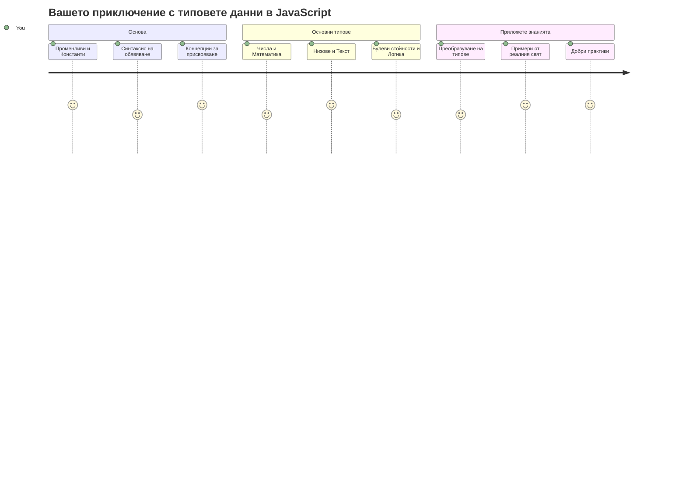
Типовете данни са една от фундаменталните концепции в JavaScript, с които ще се срещнете във всеки писан от вас програмен код. Представете си типовете данни като система за подреждане, използвана от древните библиотекари в Александрия – те имаха определени места за свитъци с поезия, математика и исторически записи. JavaScript организира информацията по подобен начин с различни категории за различни видове данни.

В този урок ще разгледаме основните типове данни, които карат JavaScript да работи. Ще научите как да работите с числа, текст, булеви стойности истинно/невярно и да разберете защо изборът на правилния тип е съществен за вашите програми. Тези концепции може да изглеждат абстрактни в началото, но с практиката ще станат втора природа.

Разбирането на типовете данни ще направи всичко останало в JavaScript много по-ясно. Точно както архитектите трябва да познават различните строителни материали преди да издигнат катедрала, основните понятия тук ще подкрепят всичко, което изграждате занапред.

## Предварителен тест преди лекцията
[Предварителен тест](https://ff-quizzes.netlify.app/web/)

Този урок обхваща основите на JavaScript, езикът, който осигурява интерактивност в уеб.

> Можете да вземете този урок в [Microsoft Learn](https://docs.microsoft.com/learn/modules/web-development-101-variables/?WT.mc_id=academic-77807-sagibbon)!

[](https://youtube.com/watch?v=JNIXfGiDWM8 "Variables in JavaScript")

[](https://youtube.com/watch?v=AWfA95eLdq8 "Data Types in JavaScript")

> 🎥 Кликнете на изображенията по-горе за видеа за променливи и типове данни

Нека започнем с променливите и типове данни, които ги пълнят!

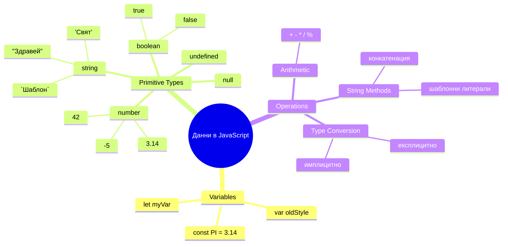
## Променливи

Променливите са основни градивни блокове в програмирането. Като надписаните буркани, които средновековните алхимици използваха за съхранение на различни субстанции, променливите ви позволяват да съхранявате информация и да ѝ дадете описателно име, за да може да я позовавате по-късно. Трябва ли да запомните нечия възраст? Съхранете я в променлива на име `age`. Искате ли да следите името на потребител? Запазете го в променлива с име `userName`.

Ще се фокусираме върху съвременния подход за създаване на променливи в JavaScript. Техниките, които ще научите тук, представляват години еволюция на езика и най-добри практики, разработени от програмистката общност.

Създаването и **декларирането** на променлива има следния синтаксис **[ключова дума] [име]**. То се състои от две части:

- **Ключова дума**. Използвайте `let` за променливи, които могат да се променят, или `const` за стойности, които остават постоянни.
- **Името на променливата**, това е описателно име, което избирате сами.

✅ Ключовата дума `let` беше въведена в ES6 и дава на вашата променлива така наречената _блокова обхватност_. Препоръчително е да използвате `let` или `const` вместо по-старата ключова дума `var`. Ще разгледаме блоковите обхвати по-подробно в бъдещи части.

### Задача - работа с променливи

1. **Декларирайте променлива**. Нека започнем с създаването на първата ни променлива:

    ```javascript
    let myVariable;
    ```

   **Какво се постига с това:**
   - Казва на JavaScript да създаде място за съхранение с име `myVariable`
   - JavaScript заделя пространство в паметта за тази променлива
   - Променливата в момента няма стойност (undefined)

2. **Дайте ѝ стойност**. Сега нека сложим нещо в нашата променлива:

    ```javascript
    myVariable = 123;
    ```

   **Как работи задаването:**
   - Операторът `=` приравнява стойността 123 към нашата променлива
   - Първоначалната undefined стойност се заменя с тази числова стойност
   - Можете да използвате тази стойност в кода си чрез `myVariable`

   > Забележка: използването на `=` в този урок означава, че ползваме "оператор за присвояване", който задава стойност на променлива. Не означава равенство.

3. **Правете го по умен начин**. Всъщност, нека комбинираме тези две стъпки:

    ```javascript
    let myVariable = 123;
    ```

    **Този подход е по-ефективен:**
    - Декларирате променливата и ѝ задавате стойност в едно изречение
    - Това е стандартна практика сред разработчиците
    - Намалява дължината на кода, като същевременно запазва яснота

4. **Променете решението си**. Ами ако искаме да съхраним друго число?

   ```javascript
   myVariable = 321;
   ```

   **Разбиране на повторното задаване:**
   - Променливата вече съдържа 321 вместо 123
   - Предишната стойност се заменя – променливите съхраняват само една стойност в даден момент
   - Тази изменяемост е ключова характеристика на променливите, декларирани с `let`

   ✅ Опитайте сами! Можете да пишете JavaScript директно в браузъра си. Отворете прозорец на браузъра и отидете в Инструментите за разработчици. В конзолата ще намерите ред за въвеждане; напишете `let myVariable = 123`, натиснете Enter, след това напишете `myVariable`. Какво се случва? Ще научите повече за тези понятия в следващите уроци.

### 🧠 **Проверка на овладяване на променливите: Да свикнем с тях**

**Нека видим как се справяте с променливите:**
- Можете ли да обясните разликата между деклариране и задаване на променлива?
- Какво се случва, ако опитате да използвате променлива преди да я декларирате?
- Кога бихте избрали `let` пред `const` за променлива?

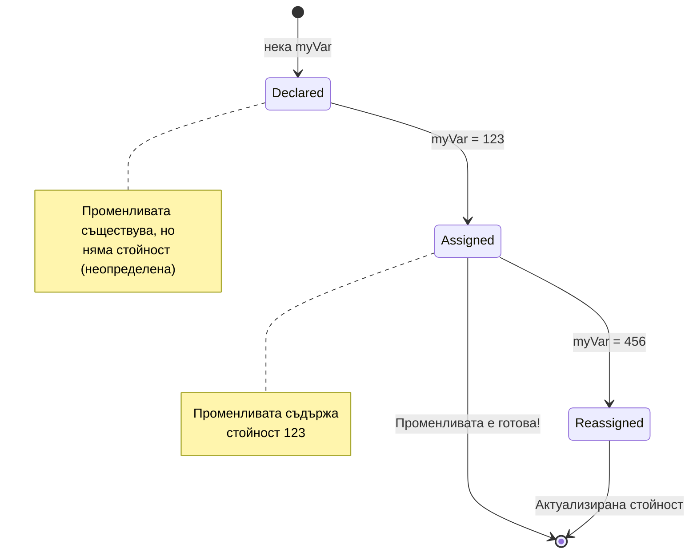
> **Бърз съвет**: Помислете за променливите като за надписани кутии за съхранение. Създавате кутията (`let`), слагате нещо в нея (`=`) и може по-късно да смените съдържанието ѝ ако е необходимо!

## Константи

Понякога е нужно да съхранявате информация, която никога не трябва да се променя по време на изпълнението на програмата. Помислете за константите като за математическите принципи, които Евклид установил в древна Гърция – веднъж доказани и документирани, те останали неизменни за всички следващи препратки.

Константите работят подобно на променливите, но с важно ограничение: след като им зададете стойност, тя не може да бъде променяна. Тази неизменяемост помага да се предотвратят случайни промени на критични стойности в програмата ви.

Декларирането и инициализацията на константа следва същите концепции като при променлива, с изключение на ключовата дума `const`. Обикновено константите се декларират с главни букви.

```javascript
const MY_VARIABLE = 123;
```

**Ето какво прави този код:**
- **Създава** константа на име `MY_VARIABLE` със стойност 123
- **Използва** конвенцията за име с главни букви при константи
- **Предотвратява** бъдещи промени на тази стойност

Константите имат два основни правила:

- **Трябва веднага да им зададете стойност** – не се позволяват празни константи!
- **Никога не можете да променяте тази стойност** – JavaScript ще генерира грешка, ако опитате. Нека видим какво имам предвид:

   **Проста стойност** - Следното НЕ Е позволено:
   
      ```javascript
      const PI = 3;
      PI = 4; // не е позволено
      ```

   **Какво трябва да запомните:**
   - **Опитите** за присвояване на нова стойност на константа ще доведат до грешка
   - **Защитава** важни стойности от случайни изменения
   - **Гарантира**, че стойността остава постоянна през цялата програма
 
   **Защитена е референцията към обекта** - Следното НЕ Е позволено:
   
      ```javascript
      const obj = { a: 3 };
      obj = { b: 5 } // не е позволено
      ```

   **Разбиране на тези концепции:**
   - **Предотвратява** пълната замяна на обекта с нов
   - **Защитава** референцията към оригиналния обект
   - **Поддържа** идентичността на обекта в паметта

    **Стойността на обекта не е защитена** - Следното Е позволено:
    
      ```javascript
      const obj = { a: 3 };
      obj.a = 5;  // позволено
      ```

      **Обяснение какво става тук:**
      - **Променя** стойността на свойството в обекта
      - **Запазва** същата референция към обекта
      - **Показва**, че съдържанието на обекта може да се променя, докато референцията остава постоянна

   > Забележка: `const` означава, че референцията е защитена от повторно присвояване. Стойността на обекта обаче не е _непроменяема_ и може да се променя, особено ако е сложна структура като обект.

## Типове данни

JavaScript организира информацията в различни категории, наречени типове данни. Тази концепция отразява начина, по който древните учени категоризирали знанието – Аристотел разграничавал различни видове разсъждения, знаейки, че логическите принципи не могат да се прилагат еднакво към поезия, математика и естествена философия.

Типовете данни са важни, защото различни операции работят с различни видове информация. Също както не може да извършвате аритметични операции над името на човек или да подреждате математическо уравнение по азбучен ред, JavaScript изисква подходящ тип данни за всяка операция. Разбирането на това предотвратява грешки и прави кода ви по-надежден.

Променливите могат да съхраняват много различни типове стойности, като числа и текст. Тези различни видове стойности се наричат **тип данни**. Типовете данни са важна част от разработката на софтуер, защото помагат на разработчиците да вземат решения как кодът трябва да бъде написан и как трябва да се изпълнява софтуерът. Освен това някои типове данни имат уникални възможности, които помагат да се трансформира или извлече допълнителна информация от дадена стойност.

✅ Типовете данни понякога се наричат примитиви на JavaScript, тъй като са най-ниско ниво типове данни, предоставени от езика. Има 7 примитивни типа данни: string, number, bigint, boolean, undefined, null и symbol. Отделете минута да визуализирате какво може да представлява всеки от тези примитиви. Какво е `зебра`? А `0`? `true`?

### Числа

Числата са най-простият тип данни в JavaScript. Независимо дали работите със цели числа като 42, десетични като 3.14, или отрицателни числа като -5, JavaScript ги обработва по един и същи начин.

Помните ли променливата ни от по-рано? Онзи 123, който съхранихме, всъщност беше тип число:

```javascript
let myVariable = 123;
```

**Ключови характеристики:**
- JavaScript автоматично разпознава числови стойности
- Можете да извършвате математически операции с тези променливи
- Не е необходима експлицитна декларация на типа

Променливите могат да съхраняват всякакви числа, включително десетични или отрицателни. Числата могат да се ползват и с аритметични оператори, разгледани в [следващия раздел](../../../../2-js-basics/1-data-types).

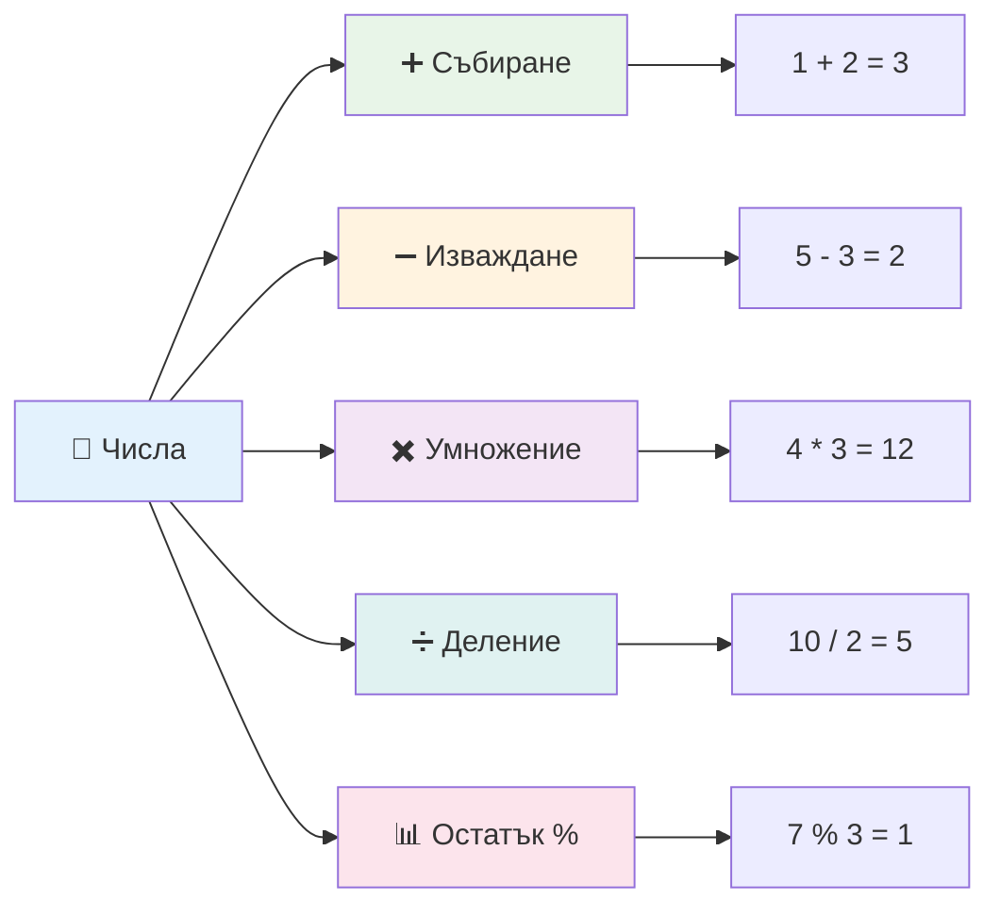
### Аритметични оператори

Аритметичните оператори ви позволяват да извършвате математически изчисления в JavaScript. Тези оператори следват същите принципи, които математиците използват от векове – същите символи, които се появяват в трудовете на учени като Ал-Хорезми, създател на алгебричната нотация.

Операторите работят както е в традиционната математика: плюс за събиране, минус за изваждане и така нататък.

Има няколко типа оператори за използване при аритметични операции и някои от тях са изброени тук:

| Символ  | Описание                                                                | Пример                          |
| ------  | ----------------------------------------------------------------------- | ------------------------------ |
| `+`     | **Събиране**: Изчислява сумата на две числа                            | `1 + 2 //очакван отговор 3`    |
| `-`     | **Изваждане**: Изчислява разликата на две числа                        | `1 - 2 //очакван отговор -1`   |
| `*`     | **Умножение**: Изчислява произведението на две числа                   | `1 * 2 //очакван отговор 2`    |
| `/`     | **Деление**: Изчислява частното на две числа                           | `1 / 2 //очакван отговор 0.5`  |
| `%`     | **Остатък**: Изчислява остатъка при деление на две числа               | `1 % 2 //очакван отговор 1`    |

✅ Опитайте! Направете аритметична операция в конзолата на браузъра си. Резултатите изненадват ли ви?

### 🧮 **Проверка на математическите умения: Изчисляване с увереност**

**Проверете разбирането си за аритметика:**
- Каква е разликата между `/` (деление) и `%` (остатък)?
- Можете ли да предскажете резултата от `10 % 3`? (Подсказка: не е 3.33...)
- Защо операторът за остатък може да е полезен при програмиране?

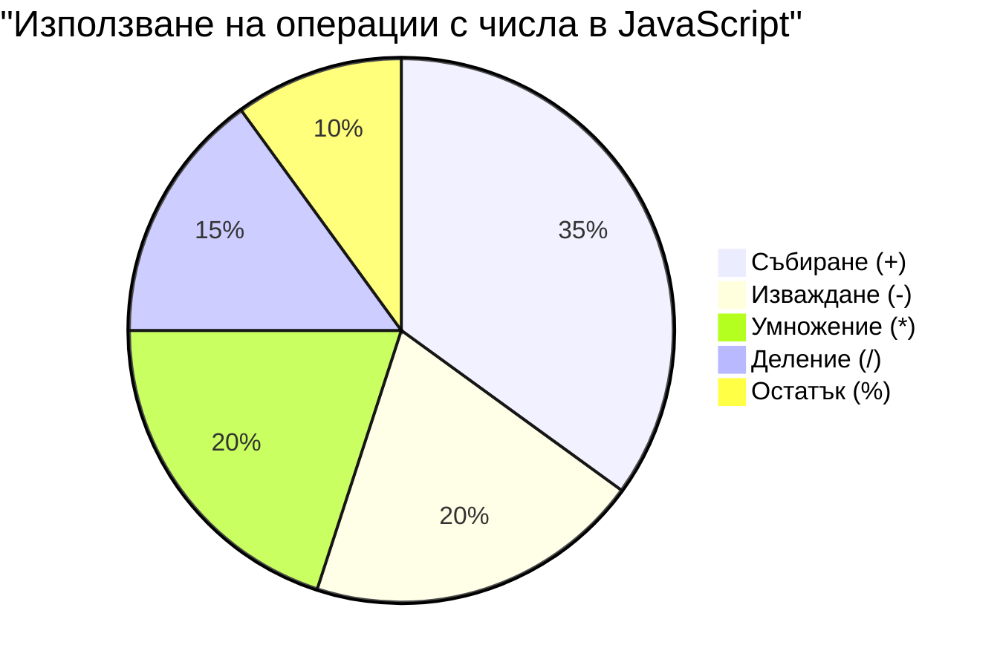
> **Практичен поглед**: Операторът за остатък (%) е много полезен за проверка дали числа са четни/нечетни, създаване на модели или циклиране през масиви!

### Низове

В JavaScript текстовите данни се представят чрез низове. Терминът "низа" произлиза от концепцията за поредица от символи, съединени заедно, подобно на начина, по който писарите в средновековните манастири свързвали букви в думи и изречения в техните ръкописи.

Низовете са основополагащи за уеб разработката. Всеки текст, показван на уебсайт – потребителски имена, надписи на бутони, съобщения за грешки, съдържание – се обработва като низ. Разбирането на низовете е ключово за създаване на функционални потребителски интерфейси.

Низовете са поредици от символи, намиращи се между единични или двойни кавички.

```javascript
'This is a string'
"This is also a string"
let myString = 'This is a string value stored in a variable';
```

**Разбиране на тези понятия:**
- **Използва** или единични кавички `'`, или двойни кавички `"` за дефиниране на низове
- **Съхранява** текстови данни, които могат да включват букви, числа и символи
- **Присвоява** стрингови стойности на променливи за по-късна употреба
- **Изисква** кавички, за да се разграничат текстовите стойности от имена на променливи

Не забравяйте да използвате кавички при писане на низ, в противен случай JavaScript ще приеме, че става дума за име на променлива.

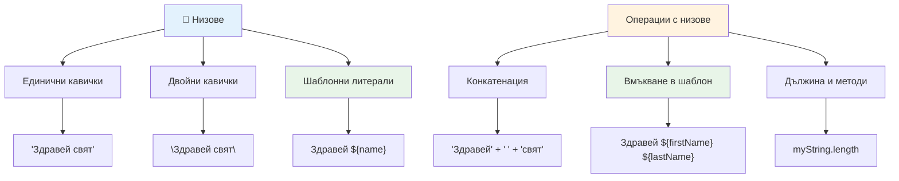
### Форматиране на низове

Манипулирането на низове ви позволява да съединявате текстови елементи, да включвате променливи и да създавате динамично съдържание, което реагира на състоянието на програмата. Тази техника ви позволява да конструирате текст програмно.

Често трябва да събирате няколко низове заедно – този процес се нарича конкатенация.
За да **обедините** два или повече низа, или да ги свържете заедно, използвайте оператора `+`.

```javascript
let myString1 = "Hello";
let myString2 = "World";

myString1 + myString2 + "!"; //Здравей, свят!
myString1 + " " + myString2 + "!"; //Здравей свят!
myString1 + ", " + myString2 + "!"; //Здравей, свят!
```

**Стъпка по стъпка, ето какво се случва:**
- **Обединява** няколко низа, използвайки оператора `+`
- **Свързва** низовете директно без интервали в първия пример
- **Добавя** интервали `" "` между низовете за по-добра четимост
- **Вмъква** пунктуация като запетаи за правилно форматиране

✅ Защо в JavaScript `1 + 1 = 2`, но `'1' + '1' = 11?` Помислете. А какво ще кажете за `'1' + 1`?

**Тemplate literals** (шаблонни литерали) са друг начин да форматирате низове, но вместо кавички се използва обратен апостроф. Всичко, което не е обикновен текст, трябва да бъде поставено в плейсхолдъри `${ }`. Това включва и променливи, които могат да са низове.

```javascript
let myString1 = "Hello";
let myString2 = "World";

`${myString1} ${myString2}!` //Здравей свят!
`${myString1}, ${myString2}!` //Здравей, свят!
```

**Да разберем всяка част:**
- **Използва** обратни апострофи `` ` `` вместо обикновени кавички за създаване на шаблонни литерали
- **Вгражда** променливи директно чрез синтаксиса на плейсхолдъра `${}`
- **Запазва** интервалите и форматирането точно както са написани
- **Предоставя** по-чист начин за създаване на сложни низове с променливи

Можете да постигнете желания ефект с всеки от двата метода, но шаблонните литерали ще уважават всички интервали и прекъсвания на редове.

✅ Кога бихте използвали шаблонен литерал вместо обикновен низ?

### 🔤 **Проверка на уменията за низове: Увереност при манипулиране на текст**

**Оценете уменията си с низове:**
- Можете ли да обясните защо `'1' + '1'` е равно на `'11'`, а не на `2`?
- Кой метод за низове ви се струва по-четим: конкатенация или шаблонни литерали?
- Какво се случва, ако забравите кавичките около низ?

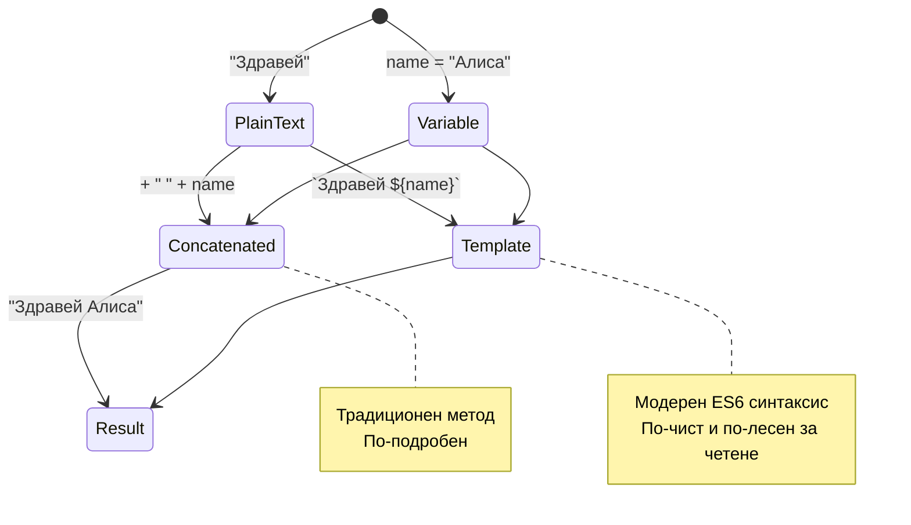
> **Професионален съвет**: Шаблонните литерали обикновено са предпочитани за сложна работа с низове, защото са по-четими и отлично се справят с много редови низове!

### Булеви стойности

Булевите стойности представляват най-простата форма на данни: те могат да имат само една от две стойности – `true` или `false`. Тази двоична логика води началото си от работата на Джордж Бул, математик от 19 век, който разработва булева алгебра.

Въпреки своята простота, булевите стойности са основни за логиката в програмирането. Те позволяват на вашия код да взема решения въз основа на условия – например дали един потребител е влязъл в системата, дали е кликнат бутон или дали определени критерии са изпълнени.

Булевите стойности могат да са само две: `true` или `false`. Те помагат за вземането на решения кои редове код да се изпълнят при изпълнение на определени условия. В много случаи [операторите](../../../../2-js-basics/1-data-types) помагат при задаване на стойността на булева променлива и често ще видите и пишете променливи, които се инициализират или техните стойности се обновяват с оператор.

```javascript
let myTrueBool = true;
let myFalseBool = false;
```

**В горния пример сме:**
- **Създали** променлива, която съхранява булевата стойност `true`
- **Показали** как се съхранява булевата стойност `false`
- **Използвали** точните ключови думи `true` и `false` (не са нужни кавички)
- **Подготвили** тези променливи за използване в условни изрази

✅ Променлива може да се счита за „истинна“ (truthy), ако се оценява като булево `true`. Интересно е, че в JavaScript [всички стойности са truthy, освен ако не са дефинирани като falsy](https://developer.mozilla.org/docs/Glossary/Truthy).

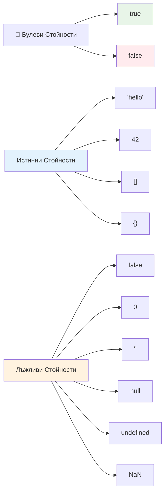
### 🎯 **Проверка на булевата логика: Умения за вземане на решения**

**Тествайте разбирането си за булеви стойности:**
- Защо според вас JavaScript има „истински“ (truthy) и „невярни“ (falsy) стойности освен само `true` и `false`?
- Можете ли да предвидите кое от следните е falsy: `0`, `"0"`, `[]`, `"false"`?
- Как булевите стойности могат да бъдат полезни при контролирането на изпълнението на програмата?

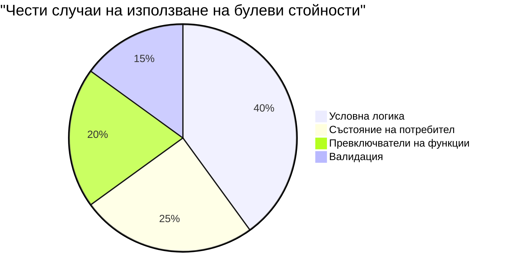
> **Запомнете**: В JavaScript само 6 стойности са falsy: `false`, `0`, `""`, `null`, `undefined` и `NaN`. Всичко останало е truthy!

---

## 📊 **Обобщение на вашия комплект от типове данни**

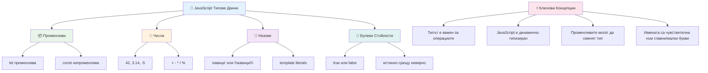
## Предизвикателство с GitHub Copilot Agent 🚀

Използвайте режим Agent, за да изпълните следното предизвикателство:

**Описание:** Създайте мениджър за лична информация, който демонстрира всички типове данни в JavaScript, които сте научили в този урок, докато обработва реални ситуации с данни.

**Задача:** Напишете JavaScript програма, която създава обект с потребителски профил, съдържащ: име на човек (низ), възраст (число), статус на студент (булева стойност), любими цветове като масив и обект адрес с улица, град и пощенски код. Включете функции за показване на профилната информация и актуализиране на отделни полета. Демонстрирайте конкатенация на низове, шаблонни литерали, аритметични операции с възрастта и булева логика за статуса на студент.

Научете повече за [режим agent](https://code.visualstudio.com/blogs/2025/02/24/introducing-copilot-agent-mode) тук.

## 🚀 Предизвикателство

JavaScript има някои поведения, които могат да изненадат разработчиците. Ето класически пример за изследване: опитайте да напишете в конзолата на браузъра си: `let age = 1; let Age = 2; age == Age` и наблюдавайте резултата. Връща `false` – можете ли да разберете защо?

Това представлява едно от множеството поведения на JavaScript, които си струва да се разбират. Познаването на тези особености ще ви помогне да пишете по-надежден код и по-ефективно да отстранявате грешки.

## Тест след лекцията
[Тест след лекцията](https://ff-quizzes.netlify.app)

## Преглед и самостоятелно обучение

Вижте [този списък с JavaScript упражнения](https://css-tricks.com/snippets/javascript/) и опитайте някое. Какво научихте?

## Задача

[Практика с типове данни](assignment.md)

## 🚀 Вашата времева линия за усвояване на JavaScript типове данни

### ⚡ **Какво можете да направите през следващите 5 минути**
- [ ] Отворете конзолата на браузъра и създайте 3 променливи с различни типове данни
- [ ] Опитайте предизвикателството: `let age = 1; let Age = 2; age == Age` и разберете защо е false
- [ ] Практикувайте конкатенация на низове с вашето име и любимо число
- [ ] Тествайте какво се случва, когато добавите число към низ

### 🎯 **Какво можете да постигнете този час**
- [ ] Попълнете теста след урока и прегледайте объркващи концепции
- [ ] Създайте мини калкулатор, който събира, изважда, умножава и дели две числа
- [ ] Направете прост форматиращ низ с помощта на шаблонни литерали
- [ ] Изследвайте разликите между операторите `==` и `===`
- [ ] Практикувайте преобразуване между различните типове данни

### 📅 **Вашата седмична основа в JavaScript**
- [ ] Изпълнете задачата с увереност и креативност
- [ ] Създайте личен профилен обект, използвайки всички научени типове данни
- [ ] Практикувайте с [JavaScript упражнения от CSS-Tricks](https://css-tricks.com/snippets/javascript/)
- [ ] Изградете прост валидатор на формуляри с булева логика
- [ ] Експериментирайте с масиви и обекти (преглед на предстоящи уроци)
- [ ] Присъединете се към JavaScript общност и задавайте въпроси за типовете данни

### 🌟 **Вашата месечна трансформация**
- [ ] Интегрирайте знанията за типове данни в по-големи програми
- [ ] Разберете кога и защо да използвате всеки тип данни в реални приложения
- [ ] Помогнете на други начинаещи да разберат основите на JavaScript
- [ ] Създайте малко приложение за управление на различни типове потребителски данни
- [ ] Изследвайте разширени концепции за типове данни като преобразуване на типове и строго равенство
- [ ] Допринасяйте за open source JavaScript проекти с подобрения в документацията

### 🧠 **Последна проверка на уменията с типове данни**

**Празнувайте основите си в JavaScript:**
- Кой тип данни ви изненада най-много с поведението си?
- Колко удобно се чувствате да обяснявате променливи и константи на приятел?
- Кое е най-интересното нещо, което открихте за системата от типове на JavaScript?
- Какво реално приложение си представяте да създадете с тези основи?

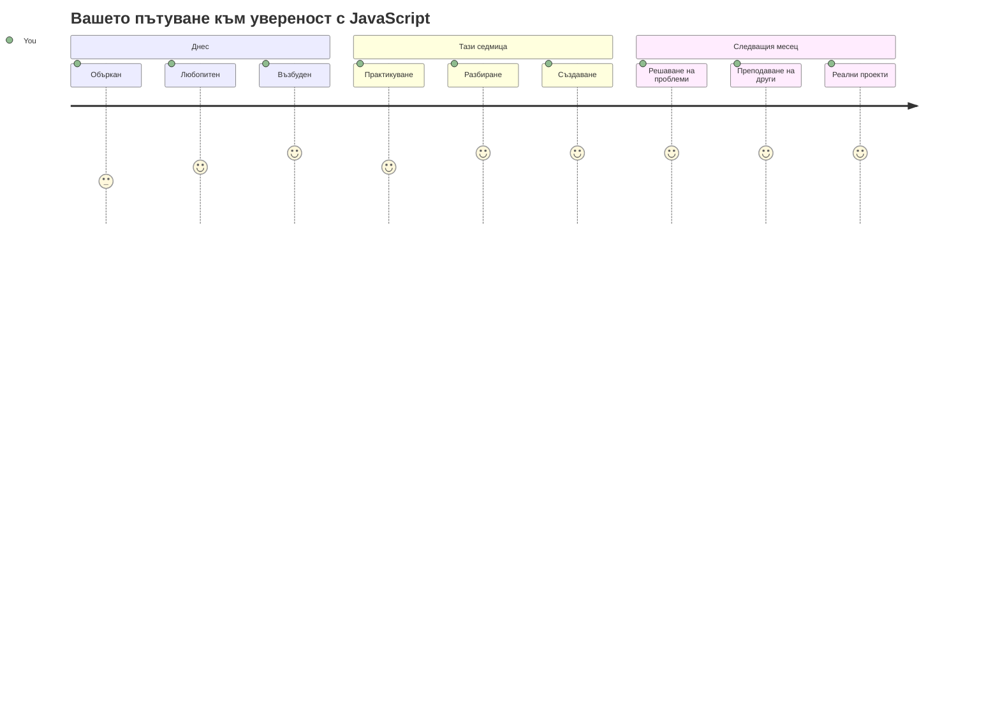
> 💡 **Вие вече имате основата!** Разбирането на типовете данни е като да научите азбуката преди да пишете истории. Всеки JavaScript програма, която някога ще напишете, ще използва тези фундаментални концепции. Сега разполагате с градивните блокове за създаване на интерактивни уебсайтове, динамични приложения и решаване на реални проблеми с код. Добре дошли в прекрасния свят на JavaScript! 🎉

---

<!-- CO-OP TRANSLATOR DISCLAIMER START -->
**Отказ от отговорност**:
Този документ е преведен с помощта на AI преводаческа услуга [Co-op Translator](https://github.com/Azure/co-op-translator). Въпреки че се стараем за точност, моля имайте предвид, че автоматизираните преводи могат да съдържат грешки или неточности. Оригиналният документ на неговия роден език трябва да се счита за авторитетен източник. За критична информация се препоръчва професионален превод от човек. Ние не носим отговорност за никакви недоразумения или неправилни тълкувания, произтичащи от използването на този превод.
<!-- CO-OP TRANSLATOR DISCLAIMER END -->