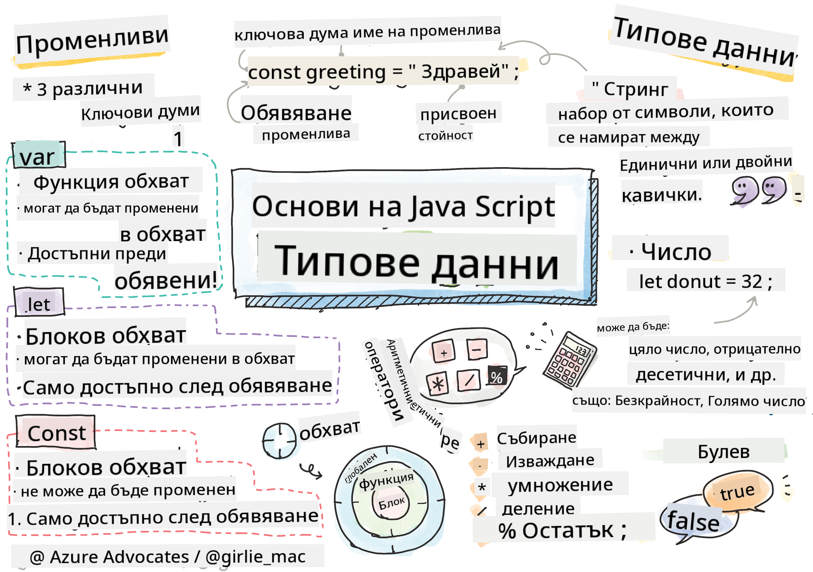

<!--
CO_OP_TRANSLATOR_METADATA:
{
  "original_hash": "b95fdd8310ef467305015ece1b0f9411",
  "translation_date": "2025-08-29T11:53:33+00:00",
  "source_file": "2-js-basics/1-data-types/README.md",
  "language_code": "bg"
}
-->
# Основи на JavaScript: Типове данни


> Скица от [Tomomi Imura](https://twitter.com/girlie_mac)

## Тест преди лекцията
[Тест преди лекцията](https://ff-quizzes.netlify.app/web/)

Този урок обхваща основите на JavaScript, езикът, който осигурява интерактивност в уеб.

> Можете да преминете този урок на [Microsoft Learn](https://docs.microsoft.com/learn/modules/web-development-101-variables/?WT.mc_id=academic-77807-sagibbon)!

[](https://youtube.com/watch?v=JNIXfGiDWM8 "Променливи в JavaScript")

[](https://youtube.com/watch?v=AWfA95eLdq8 "Типове данни в JavaScript")

> 🎥 Кликнете върху изображенията по-горе за видеа относно променливи и типове данни

Нека започнем с променливите и типовете данни, които ги запълват!

## Променливи

Променливите съхраняват стойности, които могат да се използват и променят в кода ви.

Създаването и **декларирането** на променлива има следния синтаксис **[ключова дума] [име]**. Състои се от две части:

- **Ключова дума**. Ключовите думи могат да бъдат `let` или `var`.  

✅ Ключовата дума `let` беше въведена в ES6 и дава на променливата така наречения _блоков обхват_. Препоръчително е да използвате `let` вместо `var`. Ще разгледаме блоковите обхвати по-подробно в следващите части.
- **Името на променливата**, това е име, което избирате сами.

### Задача - работа с променливи

1. **Декларирайте променлива**. Нека декларираме променлива, използвайки ключовата дума `let`:

    ```javascript
    let myVariable;
    ```

   `myVariable` вече е декларирана с помощта на ключовата дума `let`. В момента няма стойност.

1. **Присвояване на стойност**. Съхранете стойност в променлива с оператора `=`, последван от очакваната стойност.

    ```javascript
    myVariable = 123;
    ```

   > Забележка: използването на `=` в този урок означава, че използваме "оператор за присвояване", който задава стойност на променлива. Това не означава равенство.

   `myVariable` вече е *инициализирана* със стойност 123.

1. **Рефакториране**. Заменете кода си със следното изявление.

    ```javascript
    let myVariable = 123;
    ```

    Горният пример се нарича _явна инициализация_, когато променлива се декларира и ѝ се присвоява стойност едновременно.

1. **Промяна на стойността на променливата**. Променете стойността на променливата по следния начин:

   ```javascript
   myVariable = 321;
   ```

   След като променливата е декларирана, можете да промените стойността ѝ по всяко време в кода си с оператора `=` и новата стойност.

   ✅ Опитайте! Можете да пишете JavaScript директно в браузъра си. Отворете прозорец на браузъра и отидете на Developer Tools. В конзолата ще намерите подканващ ред; напишете `let myVariable = 123`, натиснете Enter, след това напишете `myVariable`. Какво се случва? Забележете, че ще научите повече за тези концепции в следващите уроци.

## Константи

Декларирането и инициализирането на константа следва същите концепции като променлива, с изключение на ключовата дума `const`. Константите обикновено се декларират с главни букви.

```javascript
const MY_VARIABLE = 123;
```

Константите са подобни на променливите, с две изключения:

- **Трябва да имат стойност**. Константите трябва да бъдат инициализирани, в противен случай ще възникне грешка при изпълнение на кода.
- **Референцията не може да бъде променена**. Референцията на константа не може да бъде променена след инициализация, в противен случай ще възникне грешка при изпълнение на кода. Нека разгледаме два примера:
   - **Проста стойност**. Следното НЕ е позволено:
   
      ```javascript
      const PI = 3;
      PI = 4; // not allowed
      ```
 
   - **Референцията на обект е защитена**. Следното НЕ е позволено.
   
      ```javascript
      const obj = { a: 3 };
      obj = { b: 5 } // not allowed
      ```

    - **Стойността на обекта не е защитена**. Следното Е позволено:
    
      ```javascript
      const obj = { a: 3 };
      obj.a = 5;  // allowed
      ```

      В горния пример променяте стойността на обекта, но не и самата референция, което го прави позволено.

   > Забележка: `const` означава, че референцията е защитена от преназначаване. Стойността обаче не е _непроменяема_ и може да се промени, особено ако е сложна структура като обект.

## Типове данни

Променливите могат да съхраняват различни типове стойности, като числа и текст. Тези различни типове стойности са известни като **типове данни**. Типовете данни са важна част от разработката на софтуер, защото помагат на разработчиците да вземат решения как да пишат кода и как да работи софтуерът. Освен това, някои типове данни имат уникални характеристики, които помагат за трансформиране или извличане на допълнителна информация от стойност.

✅ Типовете данни също се наричат примитиви на JavaScript, тъй като са най-ниското ниво типове данни, предоставени от езика. Има 7 примитивни типа данни: string, number, bigint, boolean, undefined, null и symbol. Отделете минута, за да си представите какво представлява всеки от тези примитиви. Какво е `zebra`? А `0`? `true`?

### Числа

В предишния раздел стойността на `myVariable` беше от тип данни число.

`let myVariable = 123;`

Променливите могат да съхраняват всякакви числа, включително десетични или отрицателни числа. Числата също могат да се използват с аритметични оператори, разгледани в [следващия раздел](../../../../2-js-basics/1-data-types).

### Аритметични оператори

Има няколко типа оператори за използване при извършване на аритметични функции, като някои от тях са изброени тук:

| Символ | Описание                                                                 | Пример                           |
| ------ | ------------------------------------------------------------------------ | -------------------------------- |
| `+`    | **Събиране**: Изчислява сумата на две числа                              | `1 + 2 //очакван отговор е 3`    |
| `-`    | **Изваждане**: Изчислява разликата между две числа                       | `1 - 2 //очакван отговор е -1`   |
| `*`    | **Умножение**: Изчислява произведението на две числа                     | `1 * 2 //очакван отговор е 2`    |
| `/`    | **Деление**: Изчислява частното на две числа                             | `1 / 2 //очакван отговор е 0.5`  |
| `%`    | **Остатък**: Изчислява остатъка от делението на две числа                | `1 % 2 //очакван отговор е 1`    |

✅ Опитайте! Опитайте аритметична операция в конзолата на браузъра си. Изненадват ли ви резултатите?

### Стрингове

Стринговете са набори от символи, които се намират между единични или двойни кавички.

- `'Това е стринг'`
- `"Това също е стринг"`
- `let myString = 'Това е стринг стойност, съхранена в променлива';`

Не забравяйте да използвате кавички, когато пишете стринг, в противен случай JavaScript ще приеме, че това е име на променлива.

### Форматиране на стрингове

Стринговете са текстови и понякога ще изискват форматиране.

За да **конкатенирате** два или повече стринга, или да ги обедините, използвайте оператора `+`.

```javascript
let myString1 = "Hello";
let myString2 = "World";

myString1 + myString2 + "!"; //HelloWorld!
myString1 + " " + myString2 + "!"; //Hello World!
myString1 + ", " + myString2 + "!"; //Hello, World!

```

✅ Защо `1 + 1 = 2` в JavaScript, но `'1' + '1' = 11?` Помислете. А какво ще кажете за `'1' + 1`?

**Шаблонни литерали** са друг начин за форматиране на стрингове, но вместо кавички се използва обратна кавичка. Всичко, което не е обикновен текст, трябва да бъде поставено в плейсхолдъри `${ }`. Това включва всякакви променливи, които може да са стрингове.

```javascript
let myString1 = "Hello";
let myString2 = "World";

`${myString1} ${myString2}!` //Hello World!
`${myString1}, ${myString2}!` //Hello, World!
```

Можете да постигнете целите си за форматиране с който и да е от двата метода, но шаблонните литерали ще уважават всички интервали и нови редове.

✅ Кога бихте използвали шаблонен литерал вместо обикновен стринг?

### Булеви стойности

Булевите стойности могат да бъдат само две: `true` или `false`. Булевите стойности помагат за вземане на решения кои редове от кода да се изпълнят, когато са изпълнени определени условия. В много случаи [операторите](../../../../2-js-basics/1-data-types) помагат за задаване на стойността на булева променлива и често ще забележите и пишете променливи, които се инициализират или чиито стойности се актуализират с оператор.

- `let myTrueBool = true`
- `let myFalseBool = false`

✅ Променлива може да се счита за 'истинна', ако се оценява като булева `true`. Интересното е, че в JavaScript [всички стойности са истинни, освен ако не са дефинирани като лъжливи](https://developer.mozilla.org/docs/Glossary/Truthy).

---

## 🚀 Предизвикателство

JavaScript е известен със своите изненадващи начини за обработка на типове данни понякога. Направете малко проучване за тези 'изненади'. Например: чувствителността към главни и малки букви може да ви изненада! Опитайте това в конзолата си: `let age = 1; let Age = 2; age == Age` (резултатът е `false` -- защо?). Какви други изненади можете да откриете?

## Тест след лекцията
[Тест след лекцията](https://ff-quizzes.netlify.app)

## Преглед и самостоятелно обучение

Разгледайте [този списък с упражнения по JavaScript](https://css-tricks.com/snippets/javascript/) и опитайте едно от тях. Какво научихте?

## Задание

[Практика с типове данни](assignment.md)

---

**Отказ от отговорност**:  
Този документ е преведен с помощта на AI услуга за превод [Co-op Translator](https://github.com/Azure/co-op-translator). Въпреки че се стремим към точност, моля, имайте предвид, че автоматичните преводи може да съдържат грешки или неточности. Оригиналният документ на неговия изходен език трябва да се счита за авторитетен източник. За критична информация се препоръчва професионален превод от човек. Ние не носим отговорност за каквито и да е недоразумения или погрешни интерпретации, произтичащи от използването на този превод.