<!--
CO_OP_TRANSLATOR_METADATA:
{
  "original_hash": "71f7d7dafa1c7194d79ddac87f669ff9",
  "translation_date": "2026-01-07T06:34:57+00:00",
  "source_file": "2-js-basics/2-functions-methods/README.md",
  "language_code": "bg"
}
-->
# Основи на JavaScript: Методи и функции


> Скетчнот от [Tomomi Imura](https://twitter.com/girlie_mac)

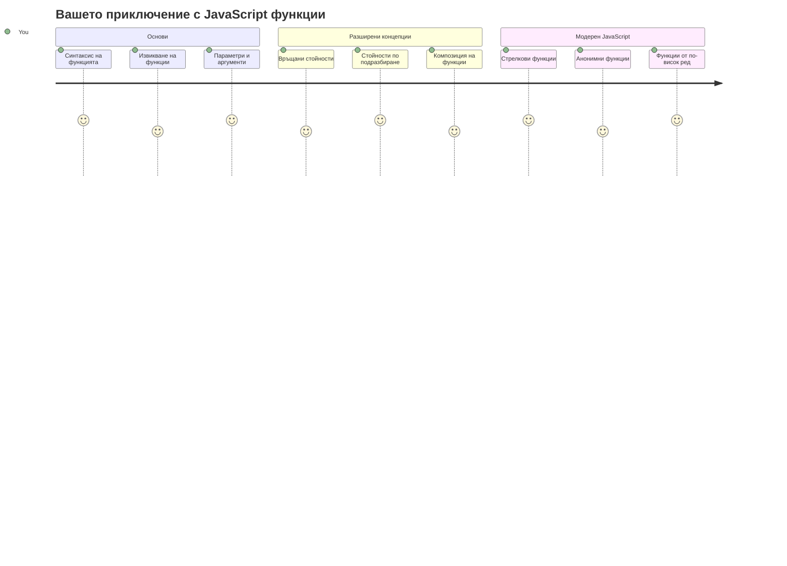
## Предварителен тест преди лекцията
[Предварителен тест преди лекцията](https://ff-quizzes.netlify.app)

Повтарящото се писане на един и същ код е една от най-честите фрустрации в програмирането. Функциите решават този проблем, като ви позволяват да пакетирате код в многократно използваеми блокове. Мислете за функциите като за стандартни части, които направиха производствената линия на Хенри Форд революционна – след като създадете надежден компонент, можете да го използвате навсякъде, без да го изграждате отново от нулата.

Функциите позволяват да свържете части от код, така че да ги използвате многократно в цялата си програма. Вместо да копирате и поставяте една и съща логика навсякъде, можете да създадете функция веднъж и да я извиквате, когато е необходимо. Този подход запазва кода ви организиран и прави актуализациите много по-лесни.

В този урок ще научите как да създавате свои собствени функции, да им подавате информация и да получавате полезни резултати обратно. Ще откриете разликата между функции и методи, ще научите модерни синтактични подходи и ще видите как функциите могат да работят с други функции. Ще изграждаме тези концепции стъпка по стъпка.

[](https://youtube.com/watch?v=XgKsD6Zwvlc "Методи и функции")

> 🎥 Кликнете върху изображението по-горе за видео за методите и функциите.

> Можете да вземете този урок на [Microsoft Learn](https://docs.microsoft.com/learn/modules/web-development-101-functions/?WT.mc_id=academic-77807-sagibbon)!

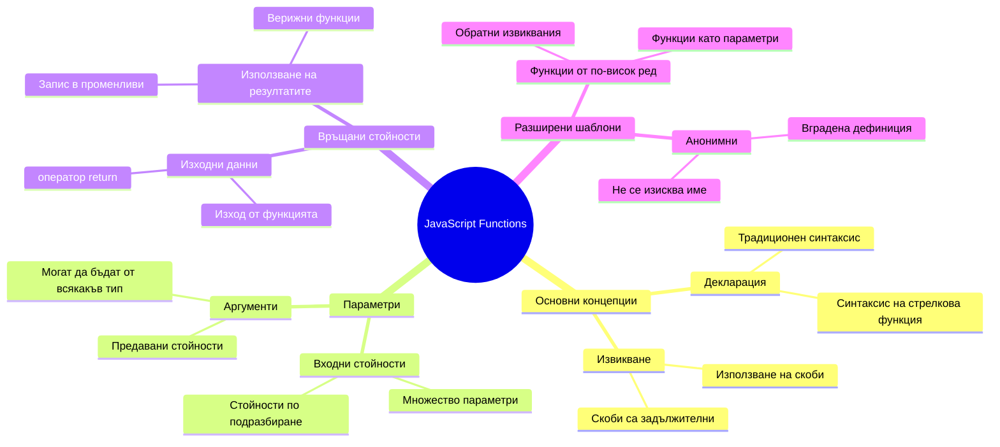
## Функции

Функцията е самостоятелен блок код, който изпълнява конкретна задача. Тя капсулира логика, която можете да изпълнявате, когато е необходимо.

Вместо да пишете един и същ код многократно в цялата си програма, можете да го опаковате във функция и да извиквате тази функция винаги, когато ви трябва. Този подход държи кода ви чист и прави актуализациите много по-лесни. Помислете за предизвикателството при поддръжка, ако трябва да промените логика, разпръсната в 20 различни места във вашия код.

Важно е да именувате функциите си описателно. Добре именувана функция ясно комуникира целта си – когато видите `cancelTimer()`, веднага разбирате какво прави, точно както бутон с ясна етикет казва точно какво ще се случи, когато го натиснете.

## Създаване и извикване на функция

Да разгледаме как се създава функция. Синтаксисът следва постоянен модел:

```javascript
function nameOfFunction() { // дефиниция на функция
 // дефиниция/тяло на функция
}
```

Нека го разчупим:
- Ключовата дума `function` казва на JavaScript "Хей, създавам функция!"
- `nameOfFunction` е мястото, където давате описателно име на функцията си
- Круглите скоби `()` са където можете да добавите параметри (скоро ще ги разгледаме)
- Фигурните скоби `{}` съдържат реалния код, който се изпълнява, когато извикате функцията

Нека създадем проста функция за поздрав, за да видим това в действие:

```javascript
function displayGreeting() {
  console.log('Hello, world!');
}
```

Тази функция отпечатва "Hello, world!" в конзолата. След като я дефинирате, можете да я използвате колкото пъти ви трябва.

За да изпълните (или "извикате") функцията си, напишете нейното име, последвано от скоби. JavaScript ви позволява да дефинирате функцията си преди или след като я извикате – двигателят на JavaScript ще се погрижи за реда на изпълнение.

```javascript
// извикване на нашата функция
displayGreeting();
```

Когато изпълните този ред, се изпълнява целият код вътре във вашата функция `displayGreeting`, който показва "Hello, world!" в конзолата на браузъра ви. Можете да извиквате тази функция многократно.

### 🧠 **Проверка на основите на функциите: Създаване на първите ви функции**

**Да видим как се справяте с основните функции:**
- Можете ли да обясните защо използваме фигурните скоби `{}` при дефиниция на функции?
- Какво се случва, ако напишете `displayGreeting` без скобите?
- Защо бихте искали да извиквате една и съща функция няколко пъти?

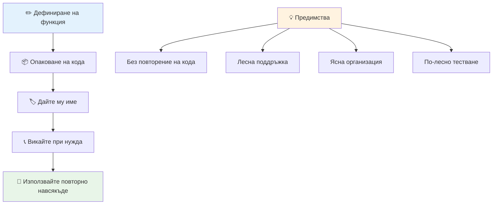
> **Забележка:** Вие използвате **методи** през тези уроци. `console.log()` е метод – всъщност функция, която принадлежи на обекта `console`. Ключовата разлика е, че методите са прикачени към обекти, докато функциите са независими. Много разработчици използват тези термини взаимозаменяемо в разговор.

### Най-добри практики за функции

Ето няколко съвета, за да напишете страхотни функции:

- Давайте на функциите си ясни и описателни имена – бъдещото ви “аз” ще ви благодари!
- Използвайте **camelCase** за многословни имена (като `calculateTotal` вместо `calculate_total`)
- Поддържайте всяка функция фокусирана върху изпълнението на една задача добре

## Подаване на информация във функция

Нашата функция `displayGreeting` е ограничена – тя може да покаже само "Hello, world!" на всички. Параметрите ни позволяват да направим функциите по-гъвкави и полезни.

**Параметрите** действат като заместители, където можете да вмъквате различни стойности всеки път, когато използвате функцията. По този начин една и съща функция може да работи с различна информация при всяко извикване.

Параметрите се изписват в скобите при дефиниране на функцията, като при многократно използване се разделят със запетаи:

```javascript
function name(param, param2, param3) {

}
```

Всеки параметър действа като заместител – когато някой извика функцията ви, той ще подаде реални стойности, които се поставят на тези места.

Нека ъпдейтнем нашата функция за поздрав, за да приема името на някого:

```javascript
function displayGreeting(name) {
  const message = `Hello, ${name}!`;
  console.log(message);
}
```

Забележете как използваме обратни кавички (`` ` ``) и `${}` да вмъкнем името директно в съобщението – това се нарича template literal и е много удобен начин да се създават низове с променливи вътре.

Сега, когато извикаме функцията, можем да подадем произволно име:

```javascript
displayGreeting('Christopher');
// показва "Здрасти, Кристофър!", когато се стартира
```

JavaScript приема низа `'Christopher'`, присвоява го на параметъра `name` и създава персонализираното съобщение "Hello, Christopher!"

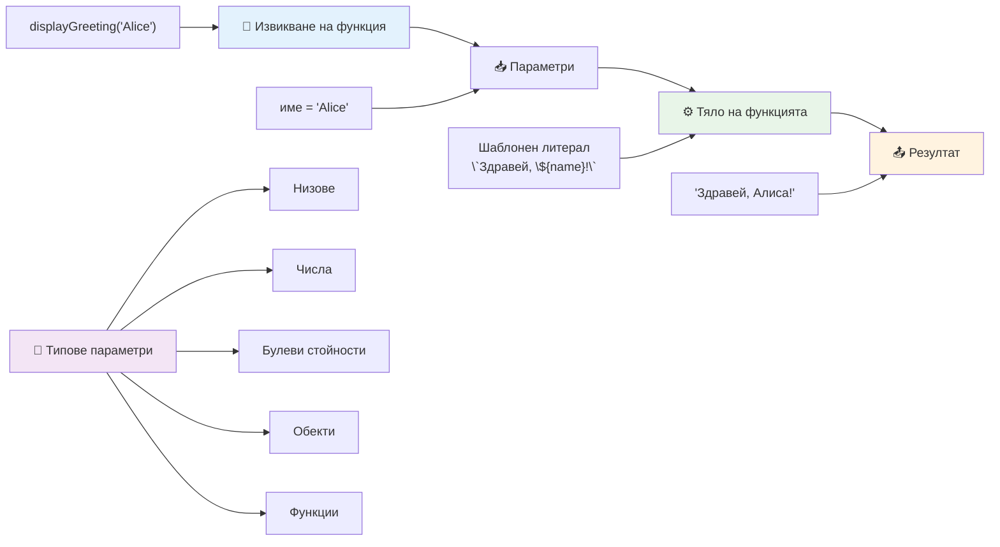
## Стойности по подразбиране

Какво, ако искаме някои параметри да са по избор? Тогава идват на помощ стойностите по подразбиране!

Да кажем, че искаме хората да могат да персонализират думата на поздрав, но ако не посочат такава, ще използваме "Hello" като резервна стойност. Можете да зададете стойности по подразбиране, като използвате знака за равенство, както при задаване на променлива:

```javascript
function displayGreeting(name, salutation='Hello') {
  console.log(`${salutation}, ${name}`);
}
```

Тук `name` все още е задължителен, но `salutation` има резервна стойност `'Hello'`, ако никой не подаде друга стойност за поздрав.

Сега можем да извикаме функцията по два начина:

```javascript
displayGreeting('Christopher');
// показва "Здравей, Кристофър"

displayGreeting('Christopher', 'Hi');
// показва "Здрасти, Кристофър"
```

При първото извикване JavaScript използва "Hello" по подразбиране, тъй като не сме посочили поздрав. При второто ползваме нашия персонализиран "Hi". Тази гъвкавост прави функциите адаптивни към различни сценарии.

### 🎛️ **Проверка на параметрите: Правене на функции гъвкави**

**Изпробвайте знанията си за параметрите:**
- Каква е разликата между параметър и аргумент?
- Защо стойностите по подразбиране са полезни в реалното програмиране?
- Можете ли да предположите какво става, ако подадете повече аргументи, отколкото параметри?

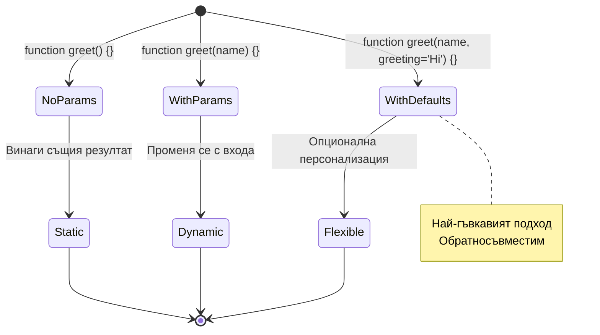
> **Професионален съвет**: Стойностите по подразбиране правят функциите ви по-лесни за употреба. Потребителите могат бързо да започнат с разумни настройки, но все пак да ги променят при нужда!

## Връщане на стойности

До момента функциите ни само отпечатват съобщения в конзолата, но какво, ако искате функция да изчисли нещо и да ви върне резултат?

Тук идват **върнатите стойности**. Вместо просто да показва нещо, функцията може да ви върне стойност, която можете да съхраните в променлива или да използвате в други части от кода.

За да върнете стойност, използвате ключовата дума `return`, последвана от това, което искате да върнете:

```javascript
return myVariable;
```

Важно: когато функция достигне `return`, тя веднага спира изпълнението си и връща тази стойност на този, който я е извикал.

Нека променим функцията за поздрав така, че да връща съобщението, вместо да го отпечатва:

```javascript
function createGreetingMessage(name) {
  const message = `Hello, ${name}`;
  return message;
}
```

Сега вместо да отпечатва поздрав, функцията създава съобщение и ни го връща.

За да използваме върнатата стойност, можем да я съхраним в променлива, както всяка друга стойност:

```javascript
const greetingMessage = createGreetingMessage('Christopher');
```

Сега `greetingMessage` съдържа "Hello, Christopher" и можем да я използваме навсякъде в кода – за показване на уебстраница, включване в имейл или предаване на друга функция.

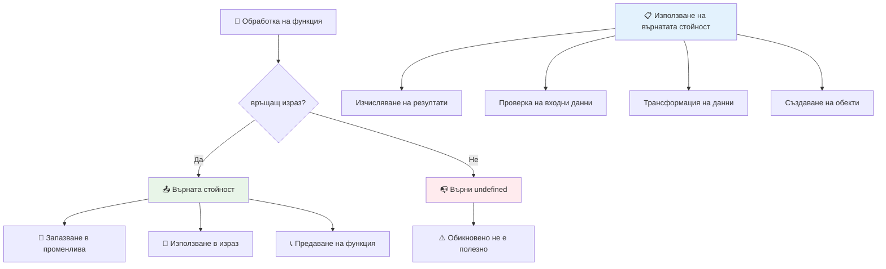
### 🔄 **Проверка на върнатите стойности: Получаване на резултати**

**Проверете познанията си за върнатите стойности:**
- Какво се случва с кода след един `return` в функция?
- Защо връщането на стойности е често по-добро от просто отпечатване в конзолата?
- Може ли функция да върне различни типове стойности (низ, число, логическо)?

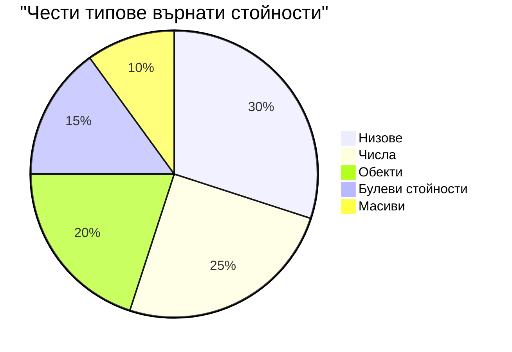
> **Важна идея**: Функциите, които връщат стойности, са по-гъвкави, защото извикващият решава какво да прави с резултата. Това прави кода ви по-модулен и многократно използваем!

## Функции като параметри за функции

Функциите могат да бъдат подавани като параметри към други функции. Въпреки че тази идея може да изглежда сложна в началото, тя е силно полезна функция за постигане на гъвкави модели на програмиране.

Този модел е много разпространен, когато искате да кажете "когато се случи нещо, направи това". Например "когато таймерът свърши, изпълни този код" или "когато потребителят кликне бутон, извикай тази функция".

Нека разгледаме `setTimeout`, която е вградена функция, която чака определено време и след това изпълнява някакъв код. Трябва да ѝ кажем какъв код да изпълни – перфектен случай за подаване на функция!

Опитайте този код – след 3 секунди ще видите съобщение:

```javascript
function displayDone() {
  console.log('3 seconds has elapsed');
}
// стойността на таймера е в милисекунди
setTimeout(displayDone, 3000);
```

Забележете как подаваме `displayDone` (без скоби) на `setTimeout`. Ние не извикваме функцията сами – подаваме я на `setTimeout` и казваме "извикай това след 3 секунди".

### Анонимни функции

Понякога имате нужда от функция за единствена цел и не искате да ѝ давате име. Помислете – ако използвате функция само веднъж, защо да замърсявате кода с допълнително име?

JavaScript ви позволява да създавате **анонимни функции** – функции без имена, които можете да дефинирате точно там, където са ви нужни.

Ето как можем да пренапишем нашия пример с таймера, използвайки анонимна функция:

```javascript
setTimeout(function() {
  console.log('3 seconds has elapsed');
}, 3000);
```

Това постига същия резултат, но функцията е дефинирана директно вътре в повикването на `setTimeout`, без нужда от отделна декларация.

### Стрелкови функции

Съвременният JavaScript има още по-кратък начин за писане на функции, наречен **стрелкови функции**. Те използват `=>` (което изглежда като стрела – разбирате ли?) и са много популярни сред разработчиците.

Стрелковите функции ви позволяват да пропуснете ключовата дума `function` и да пишете по-кратък код.

Ето нашия пример с таймера, използвайки стрелкова функция:

```javascript
setTimeout(() => {
  console.log('3 seconds has elapsed');
}, 3000);
```

`()` е мястото, където биха отишли параметрите (празно в този случай), следва стрелката `=>` и накрая тялото на функцията във фигурни скоби. Това дава същата функционалност с по-сбит синтаксис.

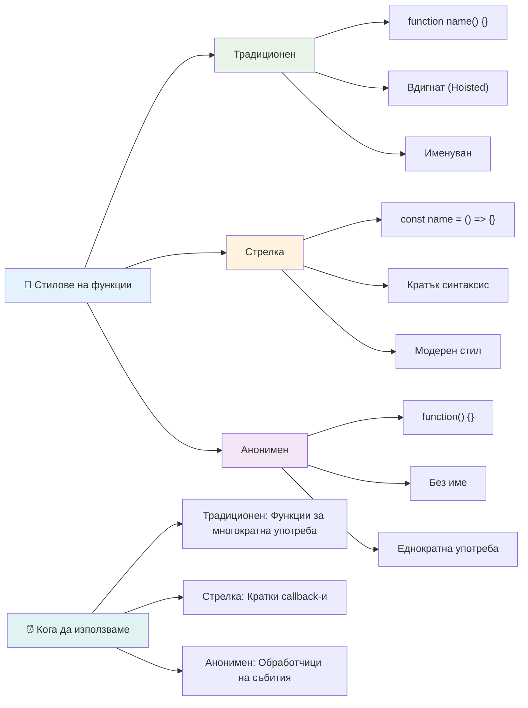
### Кога да използвате всеки подход

Кога да изберете всеки метод? Практично ръководство: ако ще използвате функцията многократно, дайте ѝ име и я дефинирайте отделно. Ако е за една конкретна употреба, помислете за анонимна функция. И двата начина – стрелковият синтаксис и традиционният – са валидни, макар че стрелковите функции са по-разпространени в съвременни кодови бази.

### 🎨 **Проверка на стила на функции: Избор на подходящия синтаксис**

**Проверете разбирането си за синтаксиса:**
- Кога бихте предпочели стрелкови функции пред традиционния синтаксис?
- Какво е основното предимство на анонимните функции?
- Можете ли да измислите ситуация, в която именуваната функция е по-добра от анонимна?

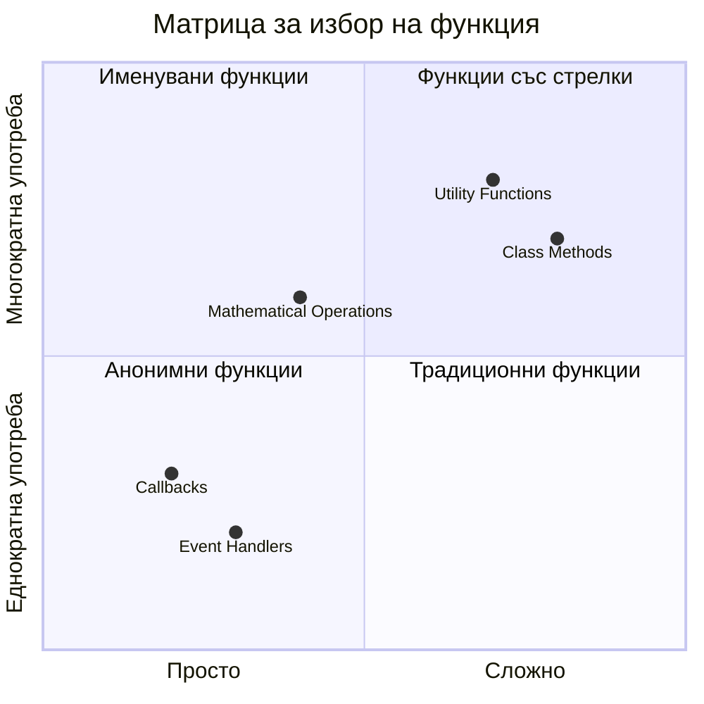
> **Модерен тренд**: Стрелковите функции се превръщат в предпочитан избор за много разработчици поради сбития си синтаксис, но традиционните функции все още имат място!

---


## 🚀 Предизвикателство

Можете ли да формулирате с едно изречение разликата между функции и методи? Опитайте!

## Challenge с GitHub Copilot Agent 🚀

Използвайте режим Agent, за да изпълните следното предизвикателство:

**Описание:** Създайте библиотека с математически функции, която демонстрира различните концепции за функции, разгледани в този урок, включително параметри, стойности по подразбиране, върнати стойности и стрелкови функции.

**Подсказка:** Създайте JavaScript файл с име `mathUtils.js`, който съдържа следните функции:
1. Функция `add`, която приема два параметъра и връща тяхната сума
2. Функция `multiply` със стойности по подразбиране за параметрите (вторият параметър по подразбиране е 1)
3. Стрелкова функция `square`, която приема число и връща квадрата му
4. Функция `calculate`, която приема друга функция като параметър и две числа, след което прилага функцията върху тези числа
5. Демонстриране на извиквания на всяка функция с подходящи тестови случаи

Научете повече за [agent mode](https://code.visualstudio.com/blogs/2025/02/24/introducing-copilot-agent-mode) тук.

## Тест след лекцията
[Тест след лекцията](https://ff-quizzes.netlify.app)

## Преглед и самоподготовка

Струва си да [прочетете малко повече за стрелковите функции](https://developer.mozilla.org/docs/Web/JavaScript/Reference/Functions/Arrow_functions), тъй като те все по-често се използват в кодовите бази. Практикувайте да пишете функция, а после да я пренапишете със синтаксиса на стрелковите функции.

## Задача

[Забавление с функции](assignment.md)

---

## 🧰 **Обобщение на Вашия инструментариум за JavaScript функции**

```mermaid
graph TD
    A["🎯 JavaScript Функции"] --> B["📋 Декларация на функция"]
    A --> C["📥 Параметри"]
    A --> D["📤 Връщани стойности"]
    A --> E["🎨 Модерен синтаксис"]
    
    B --> B1["function name() {}"]
    B --> B2["Описателно именуване"]
    B --> B3["Повторно използваеми блокове код"]
    
    C --> C1["Входни данни"]
    C --> C2["Стойности по подразбиране"]
    C --> C3["Множество параметри"]
    
    D --> D1["оператор return"]
    D --> D2["Изход от функцията"]
    D --> D3["Връщане на данни"]
    
    E --> E1["Стрелкови функции: () =>"]
    E --> E2["Анонимни функции"]
    E --> E3["Функции от по-висок ред"]
    
    F["⚡ Ключови предимства"] --> F1["Повторна използваемост на кода"]
    F --> F2["По-добра организация"]
    F --> F3["По-лесно тестване"]
    F --> F4["Модулен дизайн"]
    
    style A fill:#e3f2fd
    style B fill:#e8f5e8
    style C fill:#fff3e0
    style D fill:#f3e5f5
    style E fill:#e0f2f1
    style F fill:#fce4ec
```
---

## 🚀 Вашата времева линия за усвояване на JavaScript функции

### ⚡ **Какво можете да направите в следващите 5 минути**
- [ ] Напишете проста функция, която връща любимото ви число
- [ ] Създайте функция с два параметъра, която ги добавя заедно
- [ ] Опитайте да конвертирате традиционна функция в синтаксис на стрелкова функция
- [ ] Практикувайте предизвикателството: обяснете разликата между функции и методи

### 🎯 **Какво можете да постигнете този час**
- [ ] Попълнете теста след урока и прегледайте объркващите концепции
- [ ] Изградете библиотека с математически утилити от предизвикателството на GitHub Copilot
- [ ] Създайте функция, която използва друга функция като параметър
- [ ] Практикувайте писане на функции с параметри по подразбиране
- [ ] Експериментирайте с шаблонни низове в стойностите връщани от функции

### 📅 **Вашето седмично овладяване на функциите**
- [ ] Завършете задачата "Забавление с функции" с креативност
- [ ] Рефакторирайте някакъв повторяем код, който сте написали, във възобновяеми функции
- [ ] Изградете малък калкулатор, използвайки само функции (без глобални променливи)
- [ ] Практикувайте стрелкови функции с методи на масиви като `map()` и `filter()`
- [ ] Създайте колекция от утилити функции за често срещани задачи
- [ ] Изучавайте висшестепенни функции и концепции на функционалното програмиране

### 🌟 **Вашата месечна трансформация**
- [ ] Овладейте напреднали концепции за функции като затваряния и обхват
- [ ] Изградете проект, който силно използва композиция на функции
- [ ] Допринасяйте за отворен код, подобрявайки документацията на функциите
- [ ] Преподавайте на някой друг за функциите и различните стилове на синтаксис
- [ ] Проучете парадигмите на функционалното програмиране в JavaScript
- [ ] Създайте лична библиотека с възобновяеми функции за бъдещи проекти

### 🏆 **Финално чек-ин на шампиона по функции**

**Отбележете вашето овладяване на функциите:**
- Коя е най-полезната функция, която сте създали досега?
- Как изучаването на функциите промени начина, по който мислите за организацията на кода?
- Кой синтаксис на функция предпочитате и защо?
- Какъв реален проблем бихте решили, като напишете функция?

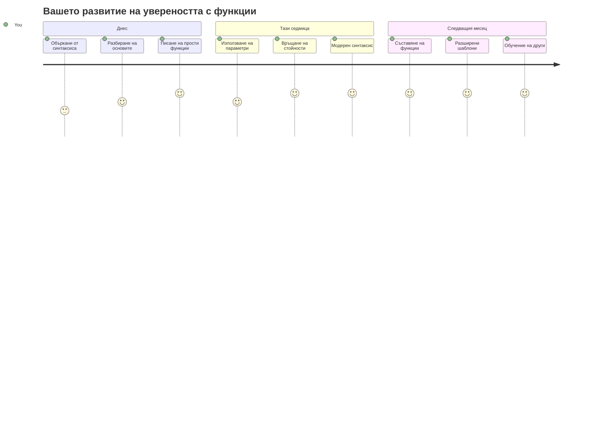
> 🎉 **Вие овладяхте една от най-мощните концепции в програмирането!** Функциите са градивните елементи на по-големите програми. Всеки апликация, която някога ще създадете, ще използва функции за организиране, повторна употреба и структуриране на кода. Сега разбирате как да пакетиране на логика в възобновяеми компоненти, което ви прави по-ефективен и продуктивен програмист. Добре дошли в света на модулното програмиране! 🚀

---

<!-- CO-OP TRANSLATOR DISCLAIMER START -->
**Отказ от отговорност**:
Този документ е преведен с помощта на AI преводаческа услуга [Co-op Translator](https://github.com/Azure/co-op-translator). Въпреки че се стремим към точност, моля, имайте предвид, че автоматизираните преводи могат да съдържат грешки или неточности. Оригиналният документ на неговия роден език трябва да се счита за авторитетен източник. За критична информация се препоръчва професионален човешки превод. Не носим отговорност за каквито и да е недоразумения или неправилни тълкувания, произтичащи от използването на този превод.
<!-- CO-OP TRANSLATOR DISCLAIMER END -->