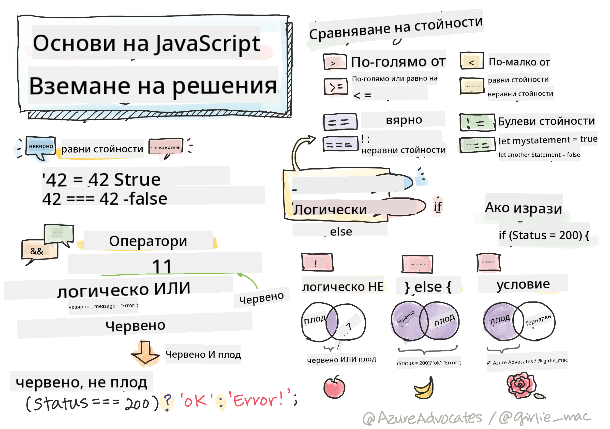

<!--
CO_OP_TRANSLATOR_METADATA:
{
  "original_hash": "f7009631b73556168ca435120a231c98",
  "translation_date": "2025-08-29T11:53:03+00:00",
  "source_file": "2-js-basics/3-making-decisions/README.md",
  "language_code": "bg"
}
-->
# Основи на JavaScript: Вземане на решения



> Скетч от [Tomomi Imura](https://twitter.com/girlie_mac)

## Тест преди лекцията

[Тест преди лекцията](https://ff-quizzes.netlify.app/web/quiz/11)

Вземането на решения и контролирането на реда, в който се изпълнява кодът ви, прави вашия код по-гъвкав и надежден. Тази секция обхваща синтаксиса за контролиране на потока от данни в JavaScript и значението му, когато се използва с булеви типове данни.

[](https://youtube.com/watch?v=SxTp8j-fMMY "Вземане на решения")

> 🎥 Кликнете върху изображението по-горе за видео относно вземането на решения.

> Можете да преминете този урок на [Microsoft Learn](https://docs.microsoft.com/learn/modules/web-development-101-if-else/?WT.mc_id=academic-77807-sagibbon)!

## Кратко припомняне за булевите стойности

Булевите стойности могат да имат само две стойности: `true` или `false`. Те помагат да се вземат решения кои редове от кода да се изпълнят, когато са изпълнени определени условия.

Задайте булева стойност като `true` или `false` по следния начин:

`let myTrueBool = true`  
`let myFalseBool = false`

✅ Булевите стойности са наречени на английския математик, философ и логик Джордж Бул (1815–1864).

## Оператори за сравнение и булеви стойности

Операторите се използват за оценка на условия чрез сравнения, които създават булева стойност. Ето списък с често използвани оператори:

| Символ | Описание                                                                                                                                                   | Пример             |
| ------ | ---------------------------------------------------------------------------------------------------------------------------------------------------------- | ------------------ |
| `<`    | **По-малко от**: Сравнява две стойности и връща булева стойност `true`, ако стойността отляво е по-малка от тази отдясно                                    | `5 < 6 // true`    |
| `<=`   | **По-малко или равно на**: Сравнява две стойности и връща булева стойност `true`, ако стойността отляво е по-малка или равна на тази отдясно                | `5 <= 6 // true`   |
| `>`    | **По-голямо от**: Сравнява две стойности и връща булева стойност `true`, ако стойността отляво е по-голяма от тази отдясно                                  | `5 > 6 // false`   |
| `>=`   | **По-голямо или равно на**: Сравнява две стойности и връща булева стойност `true`, ако стойността отляво е по-голяма или равна на тази отдясно              | `5 >= 6 // false`  |
| `===`  | **Строго равенство**: Сравнява две стойности и връща булева стойност `true`, ако стойностите отляво и отдясно са равни И са от един и същ тип данни         | `5 === 6 // false` |
| `!==`  | **Неравенство**: Сравнява две стойности и връща обратната булева стойност на това, което би върнал операторът за строго равенство                          | `5 !== 6 // true`  |

✅ Проверете знанията си, като напишете няколко сравнения в конзолата на браузъра си. Изненадва ли ви някой от върнатите резултати?

## If израз

Изразът `if` ще изпълни кода между своите блокове, ако условието е вярно.

```javascript
if (condition) {
  //Condition is true. Code in this block will run.
}
```

Логическите оператори често се използват за формиране на условието.

```javascript
let currentMoney;
let laptopPrice;

if (currentMoney >= laptopPrice) {
  //Condition is true. Code in this block will run.
  console.log("Getting a new laptop!");
}
```

## If..Else израз

Изразът `else` ще изпълни кода между своите блокове, когато условието е невярно. Той е опционален с израза `if`.

```javascript
let currentMoney;
let laptopPrice;

if (currentMoney >= laptopPrice) {
  //Condition is true. Code in this block will run.
  console.log("Getting a new laptop!");
} else {
  //Condition is false. Code in this block will run.
  console.log("Can't afford a new laptop, yet!");
}
```

✅ Тествайте разбирането си за този код и следващия, като го изпълните в конзолата на браузъра. Променете стойностите на променливите `currentMoney` и `laptopPrice`, за да промените върнатия резултат от `console.log()`.

## Switch израз

Изразът `switch` се използва за изпълнение на различни действия въз основа на различни условия. Използвайте `switch`, за да изберете един от много блокове код за изпълнение.

```javascript
switch (expression) {
  case x:
    // code block
    break;
  case y:
    // code block
    break;
  default:
  // code block
}
```

```javascript
// program using switch statement
let a = 2;

switch (a) {
  case 1:
    a = "one";
    break;
  case 2:
    a = "two";
    break;
  default:
    a = "not found";
    break;
}
console.log(`The value is ${a}`);
```

✅ Тествайте разбирането си за този код и следващия, като го изпълните в конзолата на браузъра. Променете стойностите на променливата `a`, за да промените върнатия резултат от `console.log()`.

## Логически оператори и булеви стойности

Решенията може да изискват повече от едно сравнение и могат да бъдат свързани с логически оператори, за да се получи булева стойност.

| Символ | Описание                                                                                     | Пример                                                                 |
| ------ | ------------------------------------------------------------------------------------------- | --------------------------------------------------------------------- |
| `&&`   | **Логическо И**: Сравнява две булеви израза. Връща `true` **само** ако и двете страни са верни | `(5 > 6) && (5 < 6 ) // Едната страна е невярна, другата е вярна. Връща false` |
| `\|\|` | **Логическо ИЛИ**: Сравнява две булеви израза. Връща `true`, ако поне едната страна е вярна   | `(5 > 6) \|\| (5 < 6) // Едната страна е невярна, другата е вярна. Връща true` |
| `!`    | **Логическо НЕ**: Връща обратната стойност на булев израз                                     | `!(5 > 6) // 5 не е по-голямо от 6, но "!" ще върне true`             |

## Условия и решения с логически оператори

Логическите оператори могат да се използват за формиране на условия в изрази `if..else`.

```javascript
let currentMoney;
let laptopPrice;
let laptopDiscountPrice = laptopPrice - laptopPrice * 0.2; //Laptop price at 20 percent off

if (currentMoney >= laptopPrice || currentMoney >= laptopDiscountPrice) {
  //Condition is true. Code in this block will run.
  console.log("Getting a new laptop!");
} else {
  //Condition is true. Code in this block will run.
  console.log("Can't afford a new laptop, yet!");
}
```

### Оператор за отрицание

Досега видяхте как можете да използвате израз `if...else`, за да създадете условна логика. Всичко, което влиза в `if`, трябва да се оценява като вярно/невярно. Чрез използването на оператора `!` можете да _отрицаете_ израза. Това би изглеждало така:

```javascript
if (!condition) {
  // runs if condition is false
} else {
  // runs if condition is true
}
```

### Тернарни изрази

`if...else` не е единственият начин за изразяване на логика за вземане на решения. Можете също да използвате нещо, наречено тернарен оператор. Синтаксисът му изглежда така:

```javascript
let variable = condition ? <return this if true> : <return this if false>
```

По-долу е даден по-осезаем пример:

```javascript
let firstNumber = 20;
let secondNumber = 10;
let biggestNumber = firstNumber > secondNumber ? firstNumber : secondNumber;
```

✅ Отделете минута, за да прочетете този код няколко пъти. Разбирате ли как работят тези оператори?

Горният код гласи:

- ако `firstNumber` е по-голямо от `secondNumber`
- тогава присвойте `firstNumber` на `biggestNumber`
- иначе присвойте `secondNumber`.

Тернарният израз е просто компактен начин за написване на следния код:

```javascript
let biggestNumber;
if (firstNumber > secondNumber) {
  biggestNumber = firstNumber;
} else {
  biggestNumber = secondNumber;
}
```

---

## 🚀 Предизвикателство

Създайте програма, която първо е написана с логически оператори, а след това я пренапишете, използвайки тернарен израз. Кой синтаксис предпочитате?

---

## Тест след лекцията

[Тест след лекцията](https://ff-quizzes.netlify.app/web/quiz/12)

## Преглед и самостоятелно обучение

Прочетете повече за многото оператори, достъпни за потребителя, [на MDN](https://developer.mozilla.org/docs/Web/JavaScript/Reference/Operators).

Разгледайте чудесния [справочник за оператори](https://joshwcomeau.com/operator-lookup/) на Джош Комо!

## Задание

[Оператори](assignment.md)

---

**Отказ от отговорност**:  
Този документ е преведен с помощта на AI услуга за превод [Co-op Translator](https://github.com/Azure/co-op-translator). Въпреки че се стремим към точност, моля, имайте предвид, че автоматизираните преводи може да съдържат грешки или неточности. Оригиналният документ на неговия изходен език трябва да се счита за авторитетен източник. За критична информация се препоръчва професионален превод от човек. Ние не носим отговорност за каквито и да е недоразумения или погрешни интерпретации, произтичащи от използването на този превод.