<!--
CO_OP_TRANSLATOR_METADATA:
{
  "original_hash": "c688385d15dd3645e924ea0ffee8967f",
  "translation_date": "2026-01-07T06:38:31+00:00",
  "source_file": "2-js-basics/3-making-decisions/README.md",
  "language_code": "bg"
}
-->
# Основи на JavaScript: Вземане на решения


> Скетчнот от [Tomomi Imura](https://twitter.com/girlie_mac)

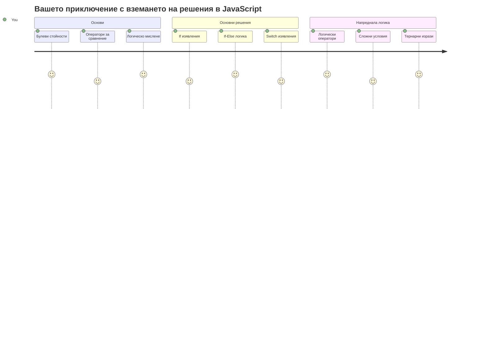
Замисляли ли сте се някога как приложенията вземат умни решения? Например как навигационна система избира най-бързия маршрут или как термостатът решава кога да включи отоплението? Това е основната концепция за вземане на решения в програмирането.

Точно както аналитичният механизъм на Чарлз Бабидж е бил проектиран да следва различни последователности от операции според условия, така и съвременните JavaScript програми трябва да правят избори в зависимост от различни обстоятелства. Тази способност за разклоняване и вземане на решения превръща статичния код в отзивчиви, интелигентни приложения.

В този урок ще научите как да прилагате условна логика в своите програми. Ще разгледаме условни изрази, оператори за сравнение и логически изрази, които позволяват на вашия код да оценява ситуации и да реагира по подходящ начин.

## Предварителен тест

[Предварителен тест](https://ff-quizzes.netlify.app/web/quiz/11)

Способността да вземате решения и да управлявате потока на програмата е основен аспект на програмирането. Този раздел обхваща как да контролирате пътя на изпълнение на вашите JavaScript програми, използвайки булеви стойности и условна логика.

[](https://youtube.com/watch?v=SxTp8j-fMMY "Making Decisions")

> 🎥 Кликнете върху изображението по-горе за видео за вземане на решения.

> Можете да вземете този урок в [Microsoft Learn](https://docs.microsoft.com/learn/modules/web-development-101-if-else/?WT.mc_id=academic-77807-sagibbon)!

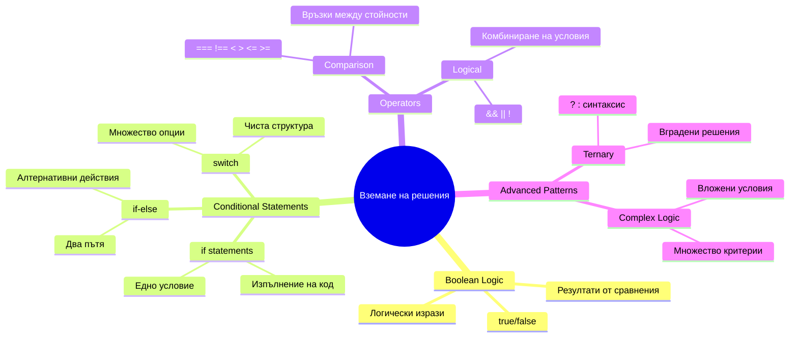
## Кратко припомняне за булевите стойности

Преди да разгледаме вземането на решения, нека си припомним булевите стойности от предишния урок. Кръстени на математика Джордж Бул, тези стойности представляват бинарни състояния – или `true`, или `false`. Няма двусмислия, няма среден вариант.

Тези двоични стойности формират основата на цялата изчислителна логика. Всяко решение, което вашата програма взема, в крайна сметка се свежда до булево оценяване.

Създаването на булеви променливи е просто:

```javascript
let myTrueBool = true;
let myFalseBool = false;
```

Това създава две променливи с изрично зададени булеви стойности.

✅ Булевите стойности са именувани на английския математик, философ и логик Джордж Бул (1815–1864).

## Оператори за сравнение и булеви стойности

В практиката рядко ще задавате булеви стойности ръчно. Вместо това ще ги генерирате чрез оценяване на условия: „Дали това число е по-голямо от онова?“ или „Равни ли са тези стойности?“

Операторите за сравнение позволяват тези оценки. Те сравняват стойности и връщат булеви резултати въз основа на връзката между операндите.

| Символ | Описание                                                                                                                                                   | Пример            |
| ------ | ------------------------------------------------------------------------------------------------------------------------------------------------------------- | ------------------ |
| `<`    | **По-малко от**: Сравнява две стойности и връща булевата стойност `true`, ако стойността от лявата страна е по-малка от тази от дясната                      | `5 < 6 // true`    |
| `<=`   | **По-малко или равно на**: Сравнява две стойности и връща булевата стойност `true`, ако стойността от лявата страна е по-малка или равна на тази отдясно      | `5 <= 6 // true`   |
| `>`    | **По-голямо от**: Сравнява две стойности и връща булевата стойност `true`, ако стойността от лявата страна е по-голяма от тази отдясно                         | `5 > 6 // false`   |
| `>=`   | **По-голямо или равно на**: Сравнява две стойности и връща булевата стойност `true`, ако стойността от лявата страна е по-голяма или равна на тази отдясно     | `5 >= 6 // false`  |
| `===`  | **Строго равенство**: Сравнява две стойности и връща булевата стойност `true`, ако стойностите са равни И са от един и същи тип                              | `5 === 6 // false` |
| `!==`  | **Неравенство**: Сравнява две стойности и връща противоположната булева стойност на тази, която би върнал операторът за строго равенство                     | `5 !== 6 // true`  |

✅ Проверете знанията си, като напишете няколко сравнения в конзолата на браузъра. Изненада ли ви някой от върнатите резултати?

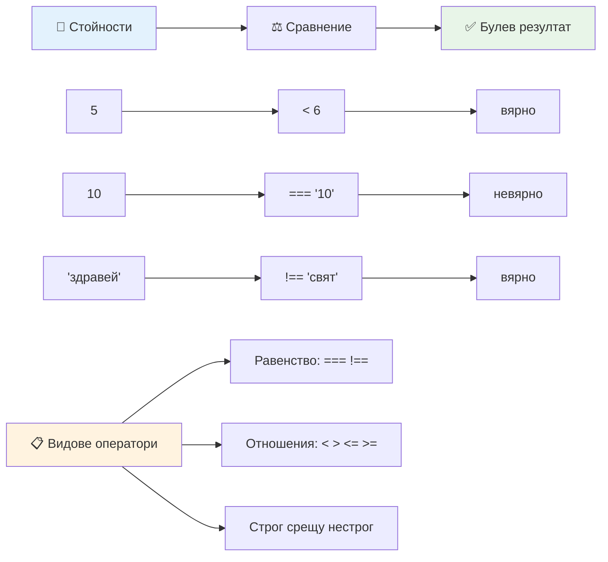
### 🧠 **Проверка на уменията за сравнение: Разбиране на булевата логика**

**Тествайте разбирането си за сравнения:**
- Защо смятате, че `===` (строго равенство) обикновено се предпочита пред `==` (нестрого равенство)?
- Можете ли да предвидите какво връща `5 === '5'`? А `5 == '5'`?
- Каква е разликата между `!==` и `!=`?

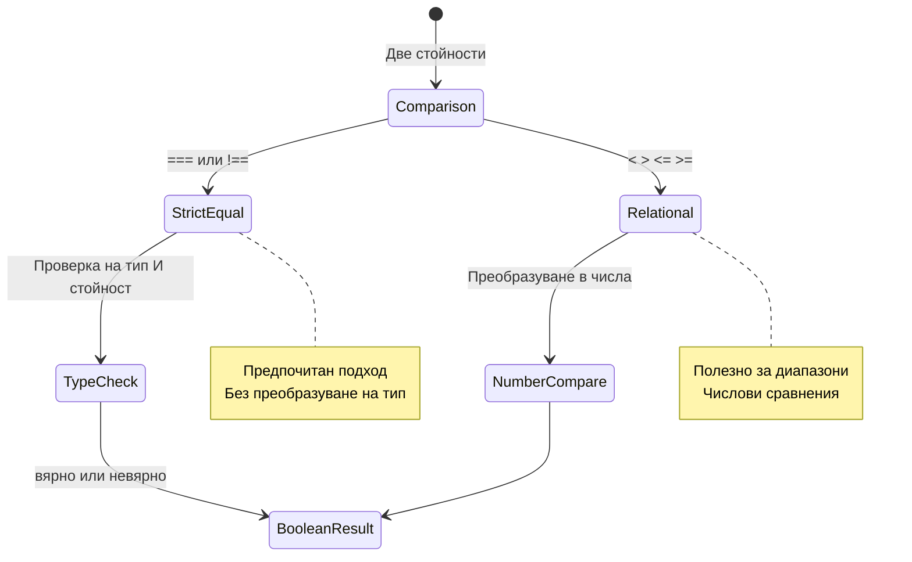
> **Професионален съвет**: Винаги използвайте `===` и `!==` за проверки на равенство, освен ако специално не ви е необходима конверсия на типа. Това предотвратява неочаквано поведение!

## If оператор

Операторът `if` е като да зададете въпрос в кода си. „Ако това условие е вярно, тогава направи това.“ Вероятно това е най-важният инструмент, който ще използвате за вземане на решения в JavaScript.

Ето как работи:

```javascript
if (condition) {
  // Условието е вярно. Кодът в този блок ще се изпълни.
}
```

Условието се поставя в скобите и ако е `true`, JavaScript изпълнява кода в къдриците. Ако е `false`, JavaScript пропуска целия блок.

Често ще използвате оператори за сравнение, за да създавате тези условия. Нека видим практичен пример:

```javascript
let currentMoney = 1000;
let laptopPrice = 800;

if (currentMoney >= laptopPrice) {
  // Условието е вярно. Кодът в този блок ще се изпълни.
  console.log("Getting a new laptop!");
}
```

Тъй като `1000 >= 800` се оценява като `true`, кодът вътре в блока се изпълнява и показва "Getting a new laptop!" в конзолата.

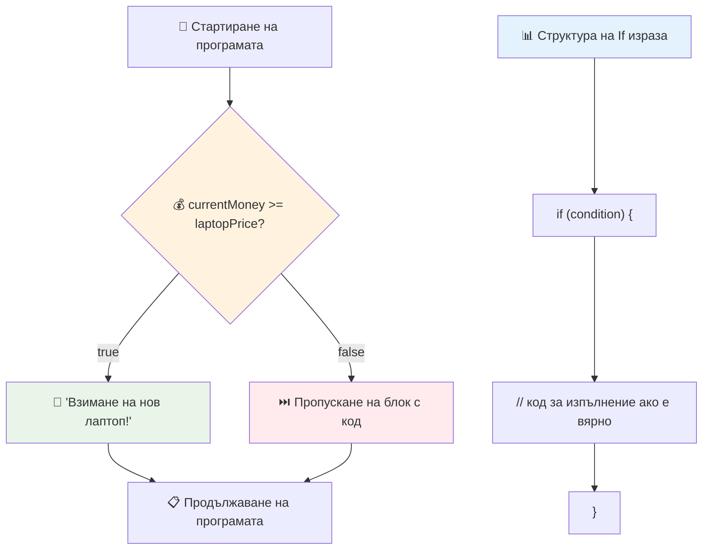
## If..Else оператор

Но какво ако искате програмата ви да направи нещо различно, когато условието е `false`? Тук влиза `else` – нещо като резервен план.

`else` операторът ви дава възможност да кажете „ако това условие не е вярно, направи това друго нещо вместо това.“

```javascript
let currentMoney = 500;
let laptopPrice = 800;

if (currentMoney >= laptopPrice) {
  // Условието е вярно. Кодът в този блок ще се изпълни.
  console.log("Getting a new laptop!");
} else {
  // Условието е невярно. Кодът в този блок ще се изпълни.
  console.log("Can't afford a new laptop, yet!");
}
```

Тъй като `500 >= 800` е `false`, JavaScript пропуска първия блок и изпълнява `else` блока вместо това. В конзолата ще видите "Can't afford a new laptop, yet!".

✅ Тествайте разбирането си на този код и следващия, като го изпълните в конзолата на браузъра. Променете стойностите на променливите currentMoney и laptopPrice, за да промените изведеното в `console.log()`.

### 🎯 **Проверка на логиката if-else: Разклонени пътища**

**Оценете разбирането си за условната логика:**
- Какво се случва, ако currentMoney е точно равно на laptopPrice?
- Можете ли да измислите реален сценарий, в който логиката if-else би била полезна?
- Как бихте разширили това, за да обработвате няколко ценови диапазона?

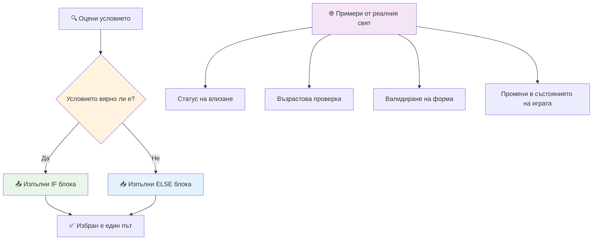
> **Основна идея**: If-else гарантира, че се избира точно един път. Това осигурява програмата ви винаги да има отговор на всяко условие!

## Switch оператор

Понякога трябва да сравните една стойност с няколко опции. Въпреки че можете да свържете няколко `if..else` израза, този подход става неудобен. Операторът `switch` осигурява по-чиста структура за обработка на няколко отделни стойности.

Концепцията прилича на механичните превключващи системи, използвани в ранните телефонни централи – една входна стойност определя кой конкретен път на изпълнение следва.

```javascript
switch (expression) {
  case x:
    // блок с код
    break;
  case y:
    // блок с код
    break;
  default:
    // блок с код
}
```

Ето как е структуриран:
- JavaScript оценява израза веднъж
- Преглежда всеки `case`, за да намери съвпадение
- Когато намери съвпадение, изпълнява този кодов блок
- `break` казва на JavaScript да спре и да излезе от switch-а
- Ако няма съвпадение, изпълнява блока `default` (ако има такъв)

```javascript
// Програма, използваща инструкция switch за ден от седмицата
let dayNumber = 2;
let dayName;

switch (dayNumber) {
  case 1:
    dayName = "Monday";
    break;
  case 2:
    dayName = "Tuesday";
    break;
  case 3:
    dayName = "Wednesday";
    break;
  default:
    dayName = "Unknown day";
    break;
}
console.log(`Today is ${dayName}`);
```

В този пример JavaScript вижда, че `dayNumber` е `2`, намира съответния `case 2`, задава `dayName` на "Tuesday" и след това излиза от switch-а. Резултатът? В конзолата се изписва "Today is Tuesday".

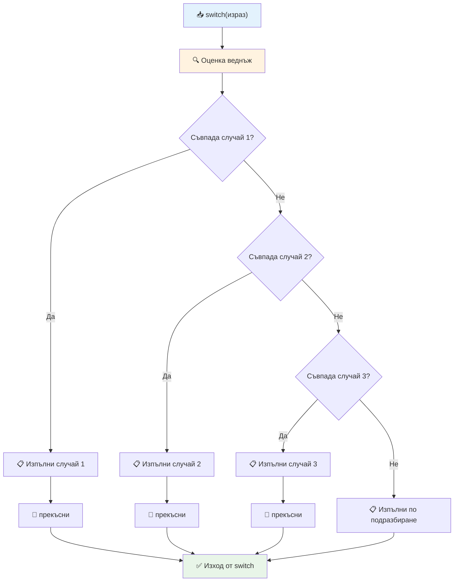
✅ Тествайте разбирането си на този код и следващия, като го изпълните в конзолата на браузъра. Променете стойността на променливата a, за да промените изведеното в `console.log()`.

### 🔄 **Майсторство с Switch: Множество опции**

**Тествайте разбирането си за switch:**
- Какво се случва, ако забравите оператор `break`?
- Кога бихте използвали `switch` вместо няколко `if-else` оператора?
- Защо `default` случая е полезен, дори ако мислите, че сте покрили всички възможности?

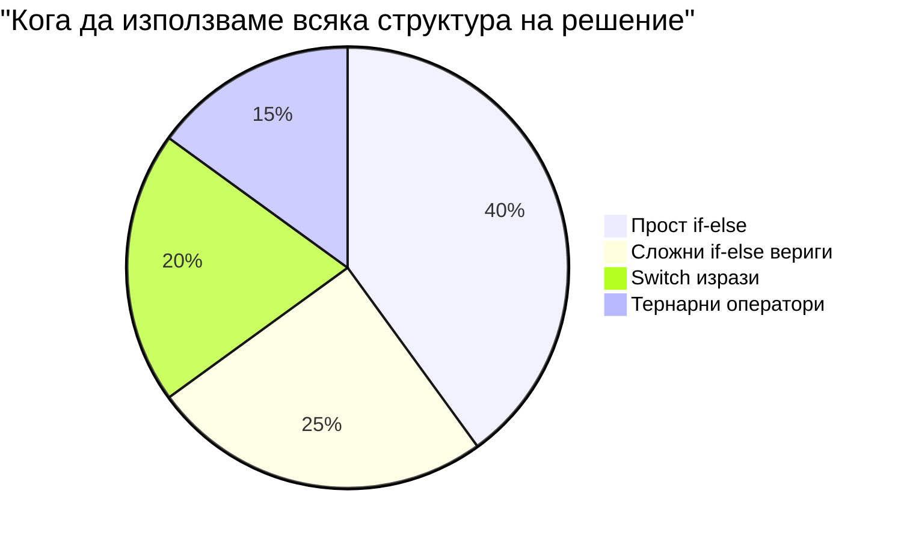
> **Добра практика**: Използвайте `switch`, когато сравнявате една променлива с няколко конкретни стойности. Използвайте `if-else` за проверки на диапазони или сложни условия!

## Логически оператори и булеви стойности

Сложните решения често изискват едновременно оценяване на няколко условия. Точно както булевата алгебра позволява на математиците да комбинират логически изрази, програмирането предлага логически оператори за свързване на множество булеви условия.

Тези оператори дават възможност за усъвършенствана условна логика чрез комбиниране на прости true/false оценки.

| Символ | Описание                                                                                     | Пример                                                                 |
| ------ | ----------------------------------------------------------------------------------------------- | ----------------------------------------------------------------------- |
| `&&`   | **Логическо И**: Сравнява два булеви израза. Връща true **само** ако и двете страни са верни    | `(5 > 3) && (5 < 10) // И двете страни са верни. Връща true` |
| `\|\|` | **Логическо ИЛИ**: Сравнява два булеви израза. Връща true, ако поне едната страна е вярна      | `(5 > 10) \|\| (5 < 10) // Едната страна е грешна, другата вярна. Връща true` |
| `!`    | **Логическо НЕ**: Връща противоположната стойност на булев израз                                   | `!(5 > 10) // 5 не е по-голямо от 10, така че "!" го превръща в true`         |

Тези оператори ви позволяват да комбинирате условия по полезни начини:
- AND (`&&`) означава, че и двете условия трябва да са верни
- OR (`||`) означава, че поне едно от условията трябва да е вярно  
- NOT (`!`) обръща true в false (и обратно)

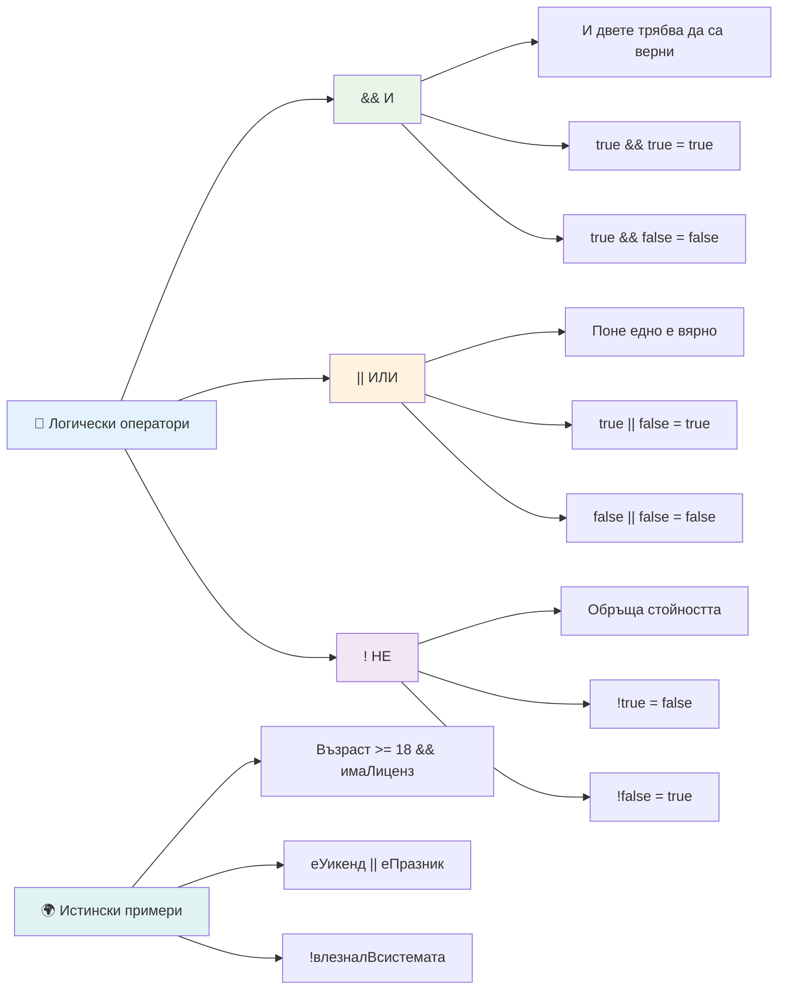
## Условия и решения с логически оператори

Нека видим тези логически оператори в действие чрез по-реалистичен пример:

```javascript
let currentMoney = 600;
let laptopPrice = 800;
let laptopDiscountPrice = laptopPrice - (laptopPrice * 0.2); // Цена на лаптоп с 20 процента отстъпка

if (currentMoney >= laptopPrice || currentMoney >= laptopDiscountPrice) {
  // Условието е вярно. Кодът в този блок ще се изпълни.
  console.log("Getting a new laptop!");
} else {
  // Условието е невярно. Кодът в този блок ще се изпълни.
  console.log("Can't afford a new laptop, yet!");
}
```

В този пример: изчисляваме 20% отстъпка (640), след това оценяваме дали наличните средства покриват пълната цена ИЛИ цената със 20% отстъпка. Тъй като 600 не покрива намалената цена от 640, условието се оценява като false.

### 🧮 **Проверка на логическите оператори: Комбиниране на условия**

**Тествайте разбирането си за логическите оператори:**
- В израза `A && B`, какво се случва, ако A е false? Оценява ли се изобщо B?
- Можете ли да си представите ситуация, в която трябва да използвате трите оператора (&&, ||, !) заедно?
- Каква е разликата между `!user.isActive` и `user.isActive !== true`?

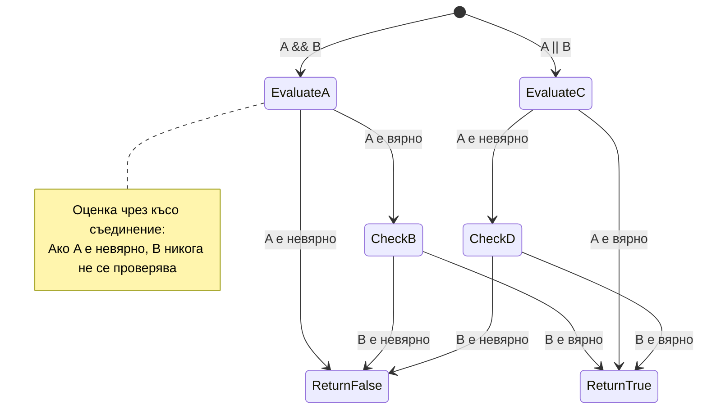
> **Съвет за производителност**: JavaScript използва "short-circuit evaluation" – в `A && B`, ако A е false, B дори не се оценява. Използвайте това във ваша полза!

### Оператор за отрицание

Понякога е по-лесно да мислите кога нещо не е вярно. Например, вместо да питате „Потребителят влязъл ли е?“, може да искате да попитате „Потребителят не е влязъл ли?“. Операторът удивителен знак (`!`) обръща логиката вместо вас.

```javascript
if (!condition) {
  // изпълнява се, ако условието е невярно
} else {
  // изпълнява се, ако условието е вярно
}
```

Операторът `!` е като да кажете „обратното на...“ – ако нещо е `true`, `!` го превръща в `false`, и обратно.

### Тернарни изрази

За прости условни присвоявания, JavaScript предлага **тернарния оператор**. Този кратък синтаксис ви позволява да напишете условен израз на един ред, полезно когато трябва да зададете една от две стойности в зависимост от условието.

```javascript
let variable = condition ? returnThisIfTrue : returnThisIfFalse;
```

Той се чете като въпрос: „Това условие вярно ли е? Ако да, използвай тази стойност. Ако не, използвай другата стойност.“

По-долу е по-ясен пример:

```javascript
let firstNumber = 20;
let secondNumber = 10;
let biggestNumber = firstNumber > secondNumber ? firstNumber : secondNumber;
```

✅ Отделете минута да прочетете този код няколко пъти. Разбирате ли как работят тези оператори?

Тази линия казва: „Дали `firstNumber` е по-голямо от `secondNumber`? Ако да, сложи `firstNumber` в `biggestNumber`. Ако не, сложи `secondNumber` в `biggestNumber`.“

Тернарният оператор е просто по-кратък начин да се напише традиционният `if..else` израз:

```javascript
let biggestNumber;
if (firstNumber > secondNumber) {
  biggestNumber = firstNumber;
} else {
  biggestNumber = secondNumber;
}
```

И двата подхода произвеждат идентични резултати. Тернарният оператор предлага компактност, докато традиционната if-else структура може да е по-четлива за по-сложни условия.

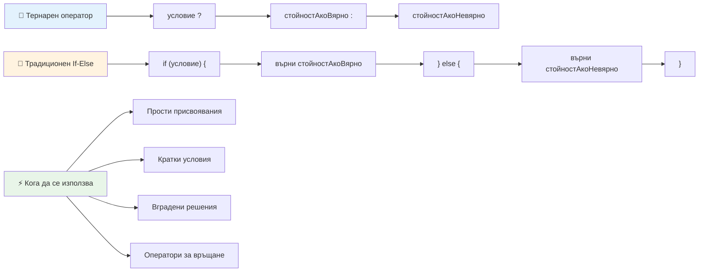
---


## 🚀 Предизвикателство

Създайте програма, която първо е написана с логически оператори, а след това я пренапишете, използвайки тернарен израз. Кой синтаксис предпочитате?

---

## GitHub Copilot Agent Предизвикателство 🚀

Използвайте Agent режима, за да изпълните следното предизвикателство:

**Описание:** Създайте цялостен калкулатор за оценки, който демонстрира няколко концепции за вземане на решения от този урок, включително if-else оператори, switch оператори, логически оператори и тернарни изрази.

**Подканващ текст:** Напишете JavaScript програма, която приема числова оценка на ученик (0-100) и определя буквена оценка според следните критерии:
- A: 90-100
- B: 80-89  
- C: 70-79
- D: 60-69
- F: под 60

Изисквания:
1. Използвайте if-else оператор за определяне на буквена оценка
2. Използвайте логически оператори, за да проверите дали студентът е издържал (оценка >= 60) И има отличен успех (оценка >= 90)  
3. Използвайте конструкция switch, за да дадете конкретна обратна връзка за всяка буквена оценка  
4. Използвайте тернарен оператор, за да определите дали студентът е допустим за следващия курс (оценка >= 70)  
5. Включете проверка на входните данни, за да гарантирате, че резултатът е между 0 и 100  

Тествайте програмата си с различни резултати, включително гранични случаи като 59, 60, 89, 90 и невалидни входни данни.  

Научете повече за [agent mode](https://code.visualstudio.com/blogs/2025/02/24/introducing-copilot-agent-mode) тук.


## Post-Lecture Quiz

[Post-lecture quiz](https://ff-quizzes.netlify.app/web/quiz/12)

## Review & Self Study

Прочетете повече за многобройните оператори, налични за потребителя [в MDN](https://developer.mozilla.org/docs/Web/JavaScript/Reference/Operators).

Прегледайте чудесния [operator lookup](https://joshwcomeau.com/operator-lookup/) на Джош Комо!

## Assignment

[Operators](assignment.md)

---

## 🧠 **Обобщение на вашия комплект за вземане на решения**

```mermaid
graph TD
    A["🎯 Решения в JavaScript"] --> B["🔍 Логика на булеви стойности"]
    A --> C["📊 Условни изрази"]
    A --> D["🔗 Логически оператори"]
    A --> E["⚡ Напреднали шаблони"]
    
    B --> B1["стойности true/false"]
    B --> B2["Оператор за сравнение"]
    B --> B3["Концепции за истинност"]
    
    C --> C1["if изрази"]
    C --> C2["if-else вериги"]
    C --> C3["switch изрази"]
    
    D --> D1["&& (И)"]
    D --> D2["|| (ИЛИ)"]
    D --> D3["! (НЕ)"]
    
    E --> E1["Тернарен оператор"]
    E --> E2["Оценяване с прекъсване"]
    E --> E3["Сложни условия"]
    
    F["💡 Ключови принципи"] --> F1["Ясни и четими условия"]
    F --> F2["Последователен стил на сравнение"]
    F --> F3["Правилен ред на операциите"]
    F --> F4["Ефективен ред на оценяване"]
    
    style A fill:#e3f2fd
    style B fill:#e8f5e8
    style C fill:#fff3e0
    style D fill:#f3e5f5
    style E fill:#e0f2f1
    style F fill:#fce4ec
```
---

## 🚀 Вашият график за овладяване на вземането на решения в JavaScript

### ⚡ **Какво можете да направите в следващите 5 минути**
- [ ] Практикувайте оператори за сравнение в конзолата на браузъра
- [ ] Напишете прост if-else израз, който проверява възрастта ви
- [ ] Опитайте предизвикателството: пренапишете if-else с помощта на тернарен оператор
- [ ] Тествайте какво се случва с различни "истински" и "фалшиви" стойности

### 🎯 **Какво можете да постигнете този час**
- [ ] Завършете теста след урока и прегледайте объркващите концепции
- [ ] Изградете комплексен калкулатор за оценки от предизвикателството GitHub Copilot
- [ ] Създайте просто решение на дърво за решение за реален сценарий (като избор какво да облечете)
- [ ] Практикувайте комбиниране на множество условия с логически оператори
- [ ] Експериментирайте с switch конструкции за различни случаи на употреба

### 📅 **Вашето овладяване на логиката за седмицата**
- [ ] Завършете задачата с оператори с креативни примери
- [ ] Създайте мини приложение за тест с използване на различни условни структури
- [ ] Направете валидатор за форма, който проверява няколко входни условия
- [ ] Практикувайте упражненията от [operator lookup](https://joshwcomeau.com/operator-lookup/) на Джош Комо
- [ ] Рефакторирайте съществуващия код, за да използва по-подходящи условни структури
- [ ] Учете се на оценки със съкращаване и влияние върху производителността

### 🌟 **Трансформацията ви за месеца**
- [ ] Овладейте сложни вложени условия и запазете четливостта на кода
- [ ] Изградете приложение с усъвършенствана логика за вземане на решения
- [ ] Допринасяйте в open source чрез подобряване на условната логика в съществуващи проекти
- [ ] Обучавайте други за различните условни структури и кога да се използват
- [ ] Проучете функционални подходи към условната логика
- [ ] Създайте личен справочник за най-добри практики в условната логика

### 🏆 **Финална проверка за шампион в вземането на решения**

**Празнувайте овладяването на логическото мислене:**  
- Коя е най-сложната логика за вземане на решения, която успешно сте имплементирали?  
- Коя условна структура ви се струва най-естествена и защо?  
- Как научаването за логическите оператори промени вашия подход към решаването на проблеми?  
- Кое приложение в реалния свят биха имали полза от усъвършенствана логика за вземане на решения?  

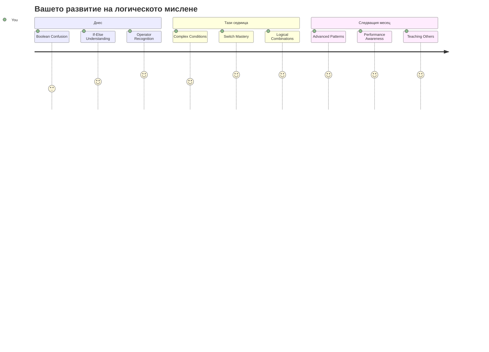
> 🧠 **Вие сте овладели изкуството на цифровото вземане на решения!** Всяко интерактивно приложение разчита на условна логика, за да реагира интелигентно на действията на потребителя и променящите се условия. Вече разбирате как да накарате програмите си да мислят, оценяват и избират подходящи отговори. Тази логическа основа ще захрани всяко динамично приложение, което създавате! 🎉

---

<!-- CO-OP TRANSLATOR DISCLAIMER START -->
**Отговорност**:  
Този документ е преведен с използване на AI преводаческа услуга [Co-op Translator](https://github.com/Azure/co-op-translator). Въпреки че се стремим към точност, моля, имайте предвид, че автоматичните преводи могат да съдържат грешки или неточности. Оригиналният документ на неговия роден език трябва да се счита за авторитетен източник. За критична информация се препоръчва професионален човешки превод. Ние не носим отговорност за каквито и да е недоразумения или неправилни интерпретации, произтичащи от използването на този превод.
<!-- CO-OP TRANSLATOR DISCLAIMER END -->