# Основи на JavaScript: Масиви и цикли

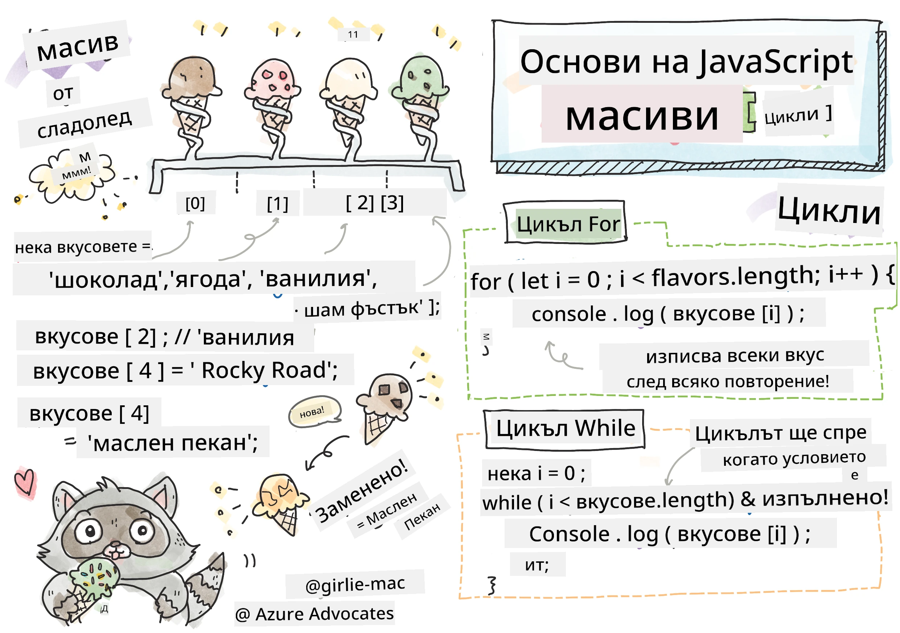
> Скетчноут от [Tomomi Imura](https://twitter.com/girlie_mac)

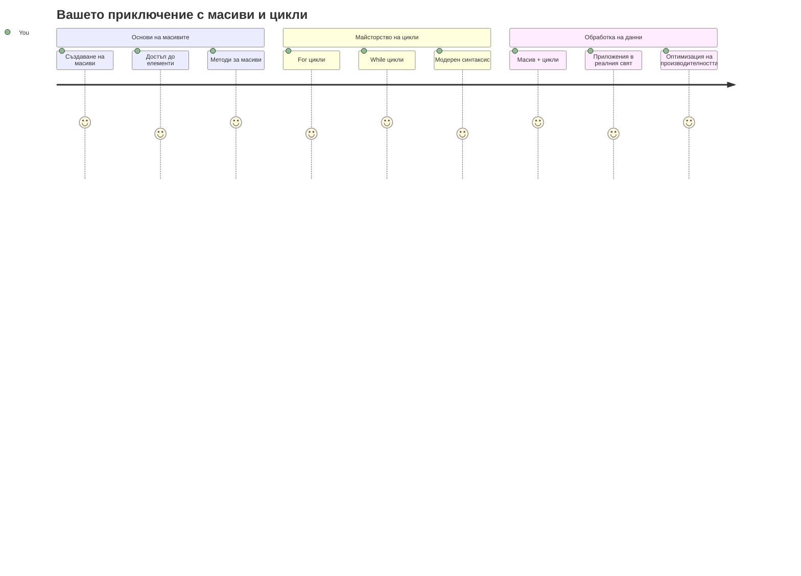
## Предварителен тест преди лекцията
[Предварителен тест](https://ff-quizzes.netlify.app/web/quiz/13)

Някога чудили ли сте се как уебсайтовете следят съдържанието на количката за пазаруване или показват списъка на приятелите ви? Тук влизат в игра масивите и цикълите. Масивите са като дигитални контейнери, които държат множество парчета информация, докато цикълите ви позволяват да работите с всички тези данни ефективно, без да пишете повторен код.

Заедно тези две концепции формират основата за работа с информацията във вашите програми. Ще научите как да преминете от ръчното писане на всяка стъпка до създаването на умен, ефективен код, който може бързо да обработва стотици или дори хиляди елементи.

До края на този урок ще разберете как да изпълнявате сложни задачи с данни с няколко реда код. Нека разгледаме тези основни програмни концепции.

[](https://youtube.com/watch?v=1U4qTyq02Xw "Масиви")

[](https://www.youtube.com/watch?v=Eeh7pxtTZ3k "Цикли")

> 🎥 Кликнете върху изображенията по-горе за видеа за масиви и цикли.

> Можете да вземете този урок в [Microsoft Learn](https://docs.microsoft.com/learn/modules/web-development-101-arrays/?WT.mc_id=academic-77807-sagibbon)!

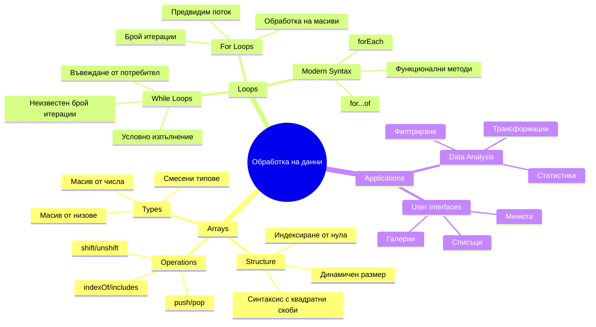
## Масиви

Помислете за масивите като дигитален файлов шкаф – вместо да съхранявате един документ на чекмедже, можете да организирате множество свързани елементи в един структуриран контейнер. В програмирането масивите ви позволяват да съхранявате множество парчета информация в един организиран пакет.

Независимо дали правите фотогалерия, управлявате списък със задачи или следите високи резултати в игра, масивите осигуряват основата за организация на данните. Нека видим как работят.

✅ Масиви има навсякъде около нас! Можете ли да си представите реален пример за масив, като масив от соларни панели?

### Създаване на масиви

Създаването на масив е много просто - просто използвайте квадратни скоби!

```javascript
// Празен масив - като празна количка за пазаруване, чакаща артикули
const myArray = [];
```

**Какво се случва тук?**
Току-що създадохте празен контейнер, използвайки тези квадратни скоби `[]`. Помислете за това като празна библиотечна рафт - готова да държи всички книги, които искате да организирате там.

Можете също да напълните вашия масив с начални стойности от самото начало:

```javascript
// Меню с вкусове на вашия магазин за сладолед
const iceCreamFlavors = ["Chocolate", "Strawberry", "Vanilla", "Pistachio", "Rocky Road"];

// Профилна информация на потребител (смесване на различни типове данни)
const userData = ["John", 25, true, "developer"];

// Тестови резултати за вашия любим клас
const scores = [95, 87, 92, 78, 85];
```

**Готини неща, които да забележите:**
- Можете да съхранявате текст, числа или дори стойности true/false в един и същ масив
- Просто отделете всеки елемент със запетая - лесно е!
- Масивите са перфектни за съхраняване на свързана информация заедно

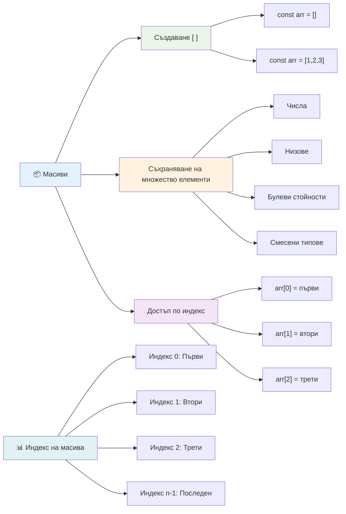
### Индексиране на масиви

Ето нещо, което може да ви се струва необичайно в началото: масивите номерират своите елементи, започвайки от 0, а не от 1. Това индексиране с начало от нула има корени в начина, по който работи компютърната памет – то е програмна конвенция от ранните дни на езици за програмиране като C. Всяко място в масива получава свой собствен адресен номер, наречен **индекс**.

| Индекс | Стойност | Описание |
|--------|----------|----------|
| 0 | "Шоколад" | Първи елемент |
| 1 | "Ягода" | Втори елемент |
| 2 | "Ванилия" | Трети елемент |
| 3 | "Фисташка" | Четвърти елемент |
| 4 | "Роки Род" | Пети елемент |

✅ Изненадва ли ви, че масивите започват с индекс 0? В някои програмни езици индексите започват от 1. Има интересна история по този въпрос, която можете да [прочетете в Wikipedia](https://en.wikipedia.org/wiki/Zero-based_numbering).

**Достъп до елементи на масив:**

```javascript
const iceCreamFlavors = ["Chocolate", "Strawberry", "Vanilla", "Pistachio", "Rocky Road"];

// Достъп до отделни елементи чрез скобна нотация
console.log(iceCreamFlavors[0]); // "Шоколад" - първи елемент
console.log(iceCreamFlavors[2]); // "Ванилия" - трети елемент
console.log(iceCreamFlavors[4]); // "Роки Роуд" - последен елемент
```

**Разглеждане стъпка по стъпка:**
- **Използва** квадратна скоба с номер на индекс за достъп до елементи
- **Връща** стойността, съхранена на тази специфична позиция в масива
- **Започва** броенето от 0, което прави първия елемент с индекс 0

**Промяна на елементи на масив:**

```javascript
// Промяна на съществуваща стойност
iceCreamFlavors[4] = "Butter Pecan";
console.log(iceCreamFlavors[4]); // "Карамелен орех"

// Добавяне на нов елемент в края
iceCreamFlavors[5] = "Cookie Dough";
console.log(iceCreamFlavors[5]); // "Тесто за бисквити"
```

**В горния пример сме:**
- **Променили** елемента на индекс 4 от "Роки Род" на "Бътер Пекан"
- **Добавили** нов елемент "Куки Доу" на индекс 5
- **Разширили** дължината на масива автоматично, когато добавяте извън текущите граници

### Дължина на масив и често използвани методи

Масивите имат вградени свойства и методи, които правят работата с данни много по-лесна.

**Откриване на дължината на масив:**

```javascript
const iceCreamFlavors = ["Chocolate", "Strawberry", "Vanilla", "Pistachio", "Rocky Road"];
console.log(iceCreamFlavors.length); // 5

// Дължината се актуализира автоматично при промяна на масива
iceCreamFlavors.push("Mint Chip");
console.log(iceCreamFlavors.length); // 6
```

**Основни точки за запомняне:**
- **Връща** общия брой елементи в масива
- **Актуализира** се автоматично, когато елементи се добавят или премахват
- **Осигурява** динамичен брой, полезен за цикли и валидация

**Основни методи на масив:**

```javascript
const fruits = ["apple", "banana", "orange"];

// Добавяне на елементи
fruits.push("grape");           // Добавя в края: ["ябълка", "банан", "портокал", "грозде"]
fruits.unshift("strawberry");   // Добавя в началото: ["ягода", "ябълка", "банан", "портокал", "грозде"]

// Премахване на елементи
const lastFruit = fruits.pop();        // Премахва и връща "грозде"
const firstFruit = fruits.shift();     // Премахва и връща "ягода"

// Намиране на елементи
const index = fruits.indexOf("banana"); // Връща 1 (позицията на "банан")
const hasApple = fruits.includes("apple"); // Връща true
```

**Разбиране на тези методи:**
- **Добавят** елементи с `push()` (в края) и `unshift()` (в началото)
- **Премахват** елементи с `pop()` (в края) и `shift()` (в началото)
- **Намират** елементи с `indexOf()` и проверяват съществуване с `includes()`
- **Връщат** полезни стойности като премахнати елементи или позиционни индекси

✅ Опитайте сами! Използвайте конзолата на браузъра, за да създадете и манипулирате собствен масив.

### 🧠 **Проверка на основите на масива: Организиране на вашите данни**

**Тествайте разбирането си за масиви:**
- Защо мислите, че масивите започват да броят от 0, а не от 1?
- Какво се случва, ако опитате да достъпите индекс, който не съществува (като `arr[100]` в масив с 5 елемента)?
- Можете ли да дадете три реални примера, където масивите биха били полезни?

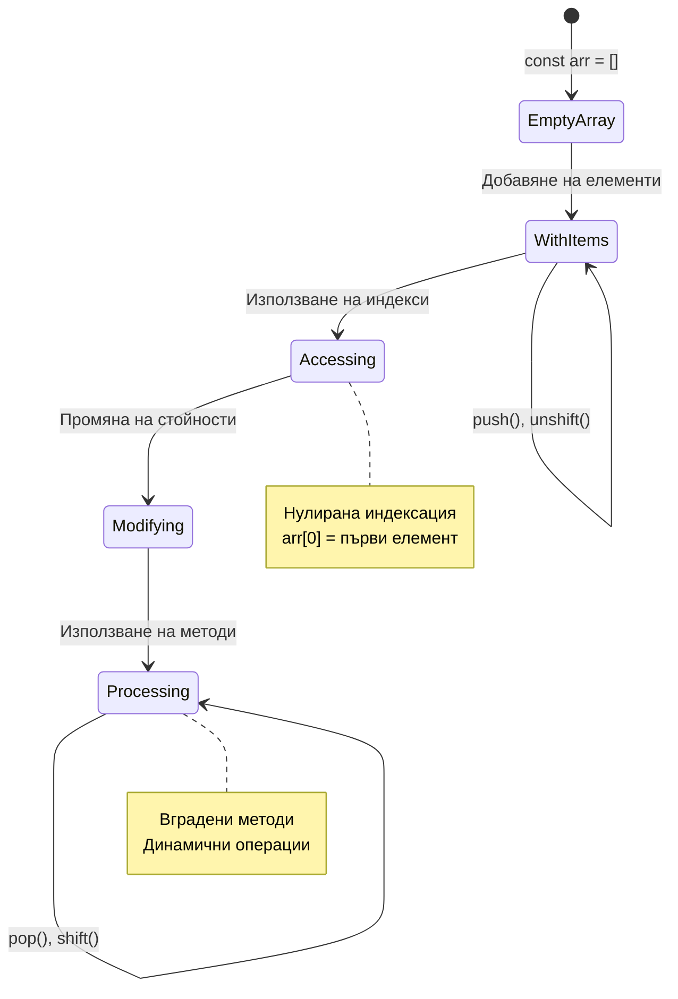
> **Преглед от реалния свят**: Масивите са навсякъде в програмирането! Фийдове в социални мрежи, колички за пазаруване, фотогалерии, песни в плейлист – всичко е базирано на масиви зад сцената!

## Цикли

Помислете за известната наказателна практика от романите на Чарлз Дикенс, при която учениците трябвало да пишат редове многократно на шрифт. Представете си, че просто можете да кажете на някого "напиши това изречение 100 пъти" и то да бъде изпълнено автоматично. Това е точно това, което правят цикълите за вашия код.

Циклите са като неуморен помощник, който може да повтаря задачи без грешки. Независимо дали трябва да проверите всеки артикул в количката за пазаруване, или да покажете всички снимки в албум, цикълите обработват повторението ефективно.

JavaScript предоставя няколко вида цикли за избор. Нека разгледаме всеки и разберем кога да ги използваме.

```mermaid
flowchart TD
    A["🔄 Видове цикли"] --> B["Цикъл For"]
    A --> C["Цикъл While"]
    A --> D["Цикъл For...of"]
    A --> E["Метод forEach"]
    
    B --> B1["Известен брой итерации"]
    B --> B2["Базиран на брояч"]
    B --> B3["for(init; condition; increment)"]
    
    C --> C1["Неизвестен брой итерации"]
    C --> C2["Базиран на условие"]
    C --> C3["while(condition)"]
    
    D --> D1["Модерен ES6+"]
    D --> D2["Итерация по масив"]
    D --> D3["for(item of array)"]
    
    E --> E1["Функционален стил"]
    E --> E2["Метод на масив"]
    E --> E3["array.forEach(callback)"]
    
    F["⏰ Кога да се използва"] --> F1["For: Броене, индекси"]
    F --> F2["While: Въвеждане от потребител, търсене"]
    F --> F3["For...of: Просто итериране"]
    F --> F4["forEach: Функционално програмиране"]
    
    style A fill:#e3f2fd
    style B fill:#e8f5e8
    style C fill:#fff3e0
    style D fill:#f3e5f5
    style E fill:#e0f2f1
    style F fill:#fce4ec
```
### For цикъл

`for` цикълът е като да зададете таймер – знаете точно колко пъти искате нещо да се случи. Той е много организиран и предсказуем, което го прави перфектен, когато работите с масиви или трябва да броите неща.

**Структура на For цикъла:**

| Компонент | Цел | Пример |
|-----------|------|--------|
| **Инициализация** | Задава началната точка | `let i = 0` |
| **Условие** | Кога да продължи | `i < 10` |
| **Увеличение** | Как да се актуализира | `i++` |

```javascript
// Броене от 0 до 9
for (let i = 0; i < 10; i++) {
  console.log(`Count: ${i}`);
}

// По-практичен пример: обработка на резултати
const testScores = [85, 92, 78, 96, 88];
for (let i = 0; i < testScores.length; i++) {
  console.log(`Student ${i + 1}: ${testScores[i]}%`);
}
```

**Стъпка по стъпка, ето какво се случва:**
- **Инициализира** брояча `i` на 0 в началото
- **Проверява** условието `i < 10` преди всяка итерация
- **Изпълнява** блока код, когато условието е вярно
- **Увеличава** `i` с 1 след всяка итерация чрез `i++`
- **Спира** когато условието стане невярно (когато `i` достигне 10)

✅ Стартирайте този код в конзолата на браузъра. Какво се случва, ако направите малки промени в брояча, условието или израза за итерация? Можете ли да го накарате да върви назад, създавайки броене назад?

### 🗓️ **Проверка на усвояването на For цикъл: Контролирано повторение**

**Оценете разбирането си за for цикъла:**
- Кои са трите части на for цикъла и какво прави всяка?
- Как бихте обходили масив в обратен ред?
- Какво се случва, ако забравите частта за увеличаване (`i++`)?

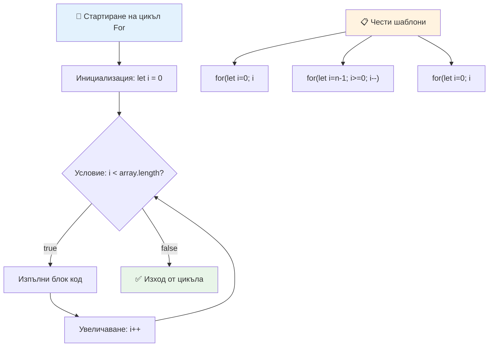
> **Мъдрост за цикъла**: For цикли са перфектни, когато знаете точно колко пъти трябва да повторите нещо. Те са най-често използваните за обработка на масиви!

### While цикъл

`while` цикълът е като да кажете "продължавай да правиш това, докато..." - може да не знаете точно колко пъти ще се изпълни, но знаете кога да спре. Той е идеален за неща като искане за въвеждане от потребител, докато не получи необходимата стойност, или търсене в данни, докато не намерите търсеното.

**Характеристики на While цикъла:**
- **Продължава** да изпълнява, докато условието е вярно
- **Изисква** ръчно управление на броячите
- **Проверява** условието преди всяка итерация
- **Рискува** безкрайни цикли, ако условието никога не стане невярно

```javascript
// Основен пример за броене
let i = 0;
while (i < 10) {
  console.log(`While count: ${i}`);
  i++; // Не забравяйте да увеличавате!
}

// По-практичен пример: обработка на потребителски вход
let userInput = "";
let attempts = 0;
const maxAttempts = 3;

while (userInput !== "quit" && attempts < maxAttempts) {
  userInput = prompt(`Enter 'quit' to exit (attempt ${attempts + 1}):`);
  attempts++;
}

if (attempts >= maxAttempts) {
  console.log("Maximum attempts reached!");
}
```

**Разбиране на тези примери:**
- **Управлява** брояча `i` ръчно в тялото на цикъла
- **Увеличава** брояча, за да предотврати безкраен цикъл
- **Демонстрира** практическо използване с въвеждане от потребител и ограничение на опити
- **Включва** механизми за безопасност срещу безкрайно изпълнение

### ♾️ **Проверка на мъдростта на While цикъла: Повторение базирано на условие**

**Тествайте разбирането си за while цикъла:**
- Каква е основната опасност при използване на while цикли?
- Кога бихте избрали while пред for цикъл?
- Как може да предотвратите безкрайни цикли?

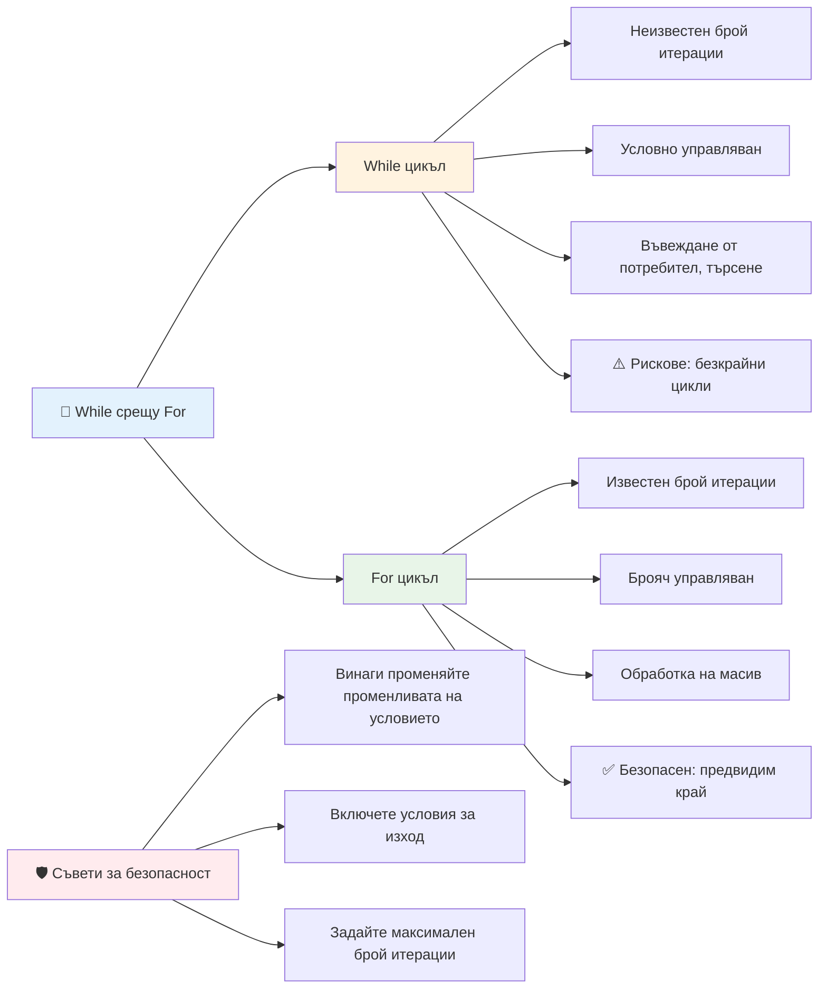
> **Безопасността преди всичко**: While цикли са мощни, но изискват внимателно управление на условието. Винаги се уверявайте, че условието на цикъла в крайна сметка ще стане невярно!

### Модерни алтернативи на цикли

JavaScript предлага модерни синтаксиси за цикли, които правят кода ви по-четим и по-малко податлив на грешки.

**For...of цикъл (ES6+):**

```javascript
const colors = ["red", "green", "blue", "yellow"];

// Модерен подход - по-чист и по-безопасен
for (const color of colors) {
  console.log(`Color: ${color}`);
}

// Сравнение с традиционния цикъл for
for (let i = 0; i < colors.length; i++) {
  console.log(`Color: ${colors[i]}`);
}
```

**Основни предимства на for...of:**
- **Премахва** нуждата от управление на индекс и потенциални грешки с офсет
- **Осигурява** директен достъп до елементи от масива
- **Подобрява** читливостта на кода и намалява синтактичната сложност

**Метод forEach:**

```javascript
const prices = [9.99, 15.50, 22.75, 8.25];

// Използване на forEach за функционален програмен стил
prices.forEach((price, index) => {
  console.log(`Item ${index + 1}: $${price.toFixed(2)}`);
});

// forEach с функции със стрелки за прости операции
prices.forEach(price => console.log(`Price: $${price}`));
```

**Какво е полезно да знаете за forEach:**
- **Изпълнява** дадена функция за всеки елемент от масива
- **Предоставя** както стойност, така и индекс като параметри
- **Не може** да бъде прекъснат преждевременно (за разлика от традиционните цикли)
- **Връща** undefined (не създава нов масив)

✅ Защо бихте избрали for цикъл пред while? 17 000 потребители във StackOverflow са имали същия въпрос и някои от мненията [могат да ви бъдат интересни](https://stackoverflow.com/questions/39969145/while-loops-vs-for-loops-in-javascript).

### 🎨 **Проверка на модерния синтаксис на цикли: Възприемане на ES6+**

**Оценете разбирането си за съвременния JavaScript:**
- Какви са предимствата на `for...of` спрямо традиционните for цикли?
- Кога бихте предпочели традиционния for цикъл?
- Каква е разликата между `forEach` и `map`?

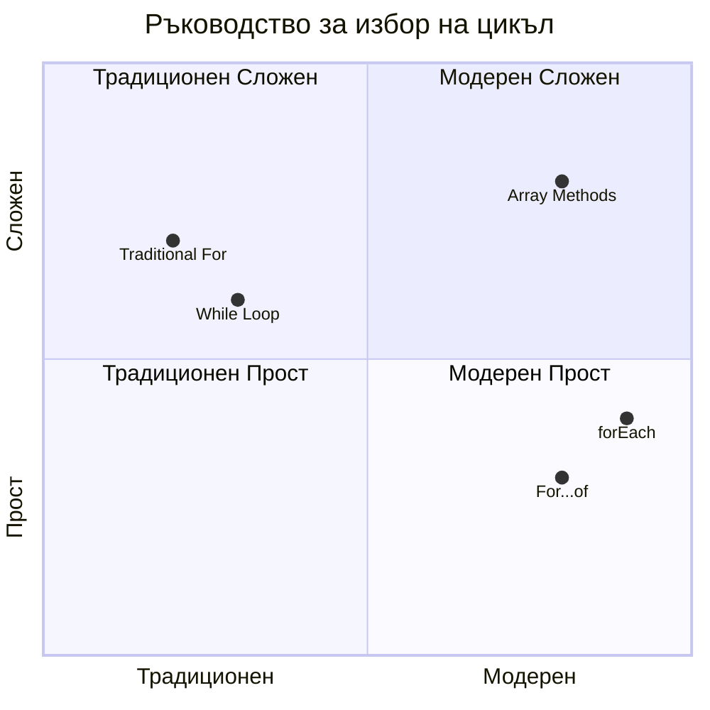
> **Модерен тренд**: Синтаксисът ES6+ като `for...of` и `forEach` става предпочитан за итерация на масиви, защото е по-четим и по-малко податлив на грешки!

## Цикли и масиви

Комбинирането на масиви с цикли създава мощни възможности за обработка на данни. Това съчетание е фундаментално за много програмни задачи – от показване на списъци до изчисляване на статистики.

**Традиционна обработка на масив:**

```javascript
const iceCreamFlavors = ["Chocolate", "Strawberry", "Vanilla", "Pistachio", "Rocky Road"];

// Класически подход с цикъл for
for (let i = 0; i < iceCreamFlavors.length; i++) {
  console.log(`Flavor ${i + 1}: ${iceCreamFlavors[i]}`);
}

// Модерен подход с for...of
for (const flavor of iceCreamFlavors) {
  console.log(`Available flavor: ${flavor}`);
}
```

**Нека разберем всеки подход:**
- **Използва** свойството дължина на масива, за да определи границата на цикъла
- **Достъпва** елементи чрез индекс в традиционни for цикли
- **Осигурява** директен достъп до елементи в for...of цикли
- **Обработва** всеки елемент от масива точно веднъж

**Практически пример за обработка на данни:**

```javascript
const studentGrades = [85, 92, 78, 96, 88, 73, 89];
let total = 0;
let highestGrade = studentGrades[0];
let lowestGrade = studentGrades[0];

// Обработете всички оценки с един цикъл
for (let i = 0; i < studentGrades.length; i++) {
  const grade = studentGrades[i];
  total += grade;
  
  if (grade > highestGrade) {
    highestGrade = grade;
  }
  
  if (grade < lowestGrade) {
    lowestGrade = grade;
  }
}

const average = total / studentGrades.length;
console.log(`Average: ${average.toFixed(1)}`);
console.log(`Highest: ${highestGrade}`);
console.log(`Lowest: ${lowestGrade}`);
```

**Ето как работи този код:**
- **Инициализира** променливи за сума и екстремуми
- **Обработва** всяка оценка с един ефективен цикъл
- **Натрупва** общата сума за изчисляване на средно
- **Следи** най-високите и най-ниските стойности по време на итерацията
- **Изчислява** крайни статистики след приключване на цикъла

✅ Експериментирайте с обхождане на собствен масив в конзолата на браузъра.

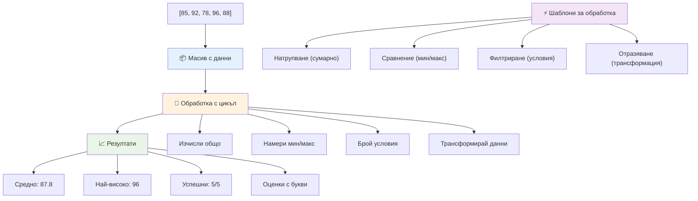
---

## Предизвикателство GitHub Copilot Agent 🚀

Използвайте Agent режима, за да изпълните следното предизвикателство:

**Описание:** Създайте изчерпателна функция за обработка на данни, която комбинира масиви и цикли за анализ на набор от данни и генериране на смислени изводи.

**Задача:** Напишете функция на име `analyzeGrades`, която приема масив от обекти с оценки на студенти (всеки съдържащ свойства име и оценка) и връща обект със статистики, включително най-висока оценка, най-ниска оценка, средна оценка, брой на студенти, които са успели (оценка >= 70), и масив с имената на студентите, които са над средно. Използвайте поне два различни вида цикли в решението си.

Научете повече за [agent mode](https://code.visualstudio.com/blogs/2025/02/24/introducing-copilot-agent-mode) тук.

## 🚀 Предизвикателство
JavaScript предлага няколко модерни метода за масиви, които могат да заменят традиционните цикли за конкретни задачи. Разгледайте [forEach](https://developer.mozilla.org/docs/Web/JavaScript/Reference/Global_Objects/Array/forEach), [for-of](https://developer.mozilla.org/docs/Web/JavaScript/Reference/Statements/for...of), [map](https://developer.mozilla.org/docs/Web/JavaScript/Reference/Global_Objects/Array/map), [filter](https://developer.mozilla.org/docs/Web/JavaScript/Reference/Global_Objects/Array/filter) и [reduce](https://developer.mozilla.org/docs/Web/JavaScript/Reference/Global_Objects/Array/reduce). 

**Вашето предизвикателство:** Рефакторирайте примера с оценките на студентите, използвайки поне три различни метода за масиви. Забележете колко по-чист и четим става кодът с модерния JavaScript синтаксис.

## Куиз след лекцията
[Куиз след лекцията](https://ff-quizzes.netlify.app/web/quiz/14)


## Преглед и самостоятелно обучение

Масивите в JavaScript имат много методи, които са изключително полезни за манипулация на данни. [Прочетете за тези методи](https://developer.mozilla.org/docs/Web/JavaScript/Reference/Global_Objects/Array) и изпробвайте някои от тях (като push, pop, slice и splice) върху масив по ваш избор.

## Задача

[Обход на масив](assignment.md)

---

## 📊 **Обобщение на Вашия набор от инструменти за масиви и цикли**

```mermaid
graph TD
    A["🎯 Мастерство с масиви и цикли"] --> B["📦 Основи на масивите"]
    A --> C["🔄 Видове цикли"]
    A --> D["🔗 Обработка на данни"]
    A --> E["🎨 Модерни техники"]
    
    B --> B1["Създаване: [ ]"]
    B --> B2["Индексиране: arr[0]"]
    B --> B3["Методи: push, pop"]
    B --> B4["Свойства: length"]
    
    C --> C1["For: Познати итерации"]
    C --> C2["While: Условни"]
    C --> C3["For...of: Директен достъп"]
    C --> C4["forEach: Функционален"]
    
    D --> D1["Изчисляване на статистики"]
    D --> D2["Трансформация на данни"]
    D --> D3["Филтриране и търсене"]
    D --> D4["Обработка в реално време"]
    
    E --> E1["Стрелкови функции"]
    E --> E2["Верижно използване на методи"]
    E --> E3["Деструктуриране"]
    E --> E4["Шаблонни литерали"]
    
    F["💡 Ключови ползи"] --> F1["Ефективна обработка на данни"]
    F --> F2["Намалено повторение на код"]
    F --> F3["Разширяеми решения"]
    F --> F4["По-чист синтаксис"]
    
    style A fill:#e3f2fd
    style B fill:#e8f5e8
    style C fill:#fff3e0
    style D fill:#f3e5f5
    style E fill:#e0f2f1
    style F fill:#fce4ec
```
---

## 🚀 Вашият път към майсторство с масиви и цикли

### ⚡ **Какво можете да направите през следващите 5 минути**
- [ ] Създайте масив с любимите си филми и достъпете конкретни елементи
- [ ] Напишете for цикъл, който брои от 1 до 10
- [ ] Опитайте предизвикателството с модерните методи за масиви от урока
- [ ] Практикувайте индексиране на масиви във вашата конзола на браузъра

### 🎯 **Какво можете да постигнете през този час**
- [ ] Попълнете куиза след урока и прегледайте всички затрудняващи ви концепции
- [ ] Изградете комплексния анализатор на оценки от предизвикателството на GitHub Copilot
- [ ] Създайте прост пазарски кош за добавяне и премахване на артикули
- [ ] Практикувайте конвертиране между различни типове цикли
- [ ] Експериментирайте с методи за масиви като `push`, `pop`, `slice` и `splice`

### 📅 **Вашето седмично пътешествие в обработката на данни**
- [ ] Завършете задачата "Обход на масив" с творчески подобрения
- [ ] Изградете приложение за списък със задачи, използвайки масиви и цикли
- [ ] Създайте прост калкулатор за статистически данни
- [ ] Практикувайте с [MDN методи за масиви](https://developer.mozilla.org/docs/Web/JavaScript/Reference/Global_Objects/Array)
- [ ] Изградете галерия за снимки или интерфейс за музикални плейлисти
- [ ] Изследвайте функционалното програмиране с `map`, `filter` и `reduce`

### 🌟 **Вашата месечна трансформация**
- [ ] Усъвършенствайте напредналите операции с масиви и оптимизация на производителността
- [ ] Изградете пълен табло за визуализация на данни
- [ ] Допринасяйте към проекти с отворен код, свързани с обработка на данни
- [ ] Обучете друг някой за масиви и цикли с практически примери
- [ ] Създайте лична библиотека с повторно използваеми функции за обработка на данни
- [ ] Изследвайте алгоритми и структури от данни, базирани на масиви

### 🏆 **Краен контролен списък за шампион по обработка на данни**

**Празнувайте вашето майсторство с масиви и цикли:**
- Коя е най-полезната операция с масив, която сте научили за реални приложения?
- Кой тип цикъл ви се струва най-естествен и защо?
- Как разбирането на масиви и цикли промени вашия подход към организацията на данни?
- Каква сложна задача за обработка на данни бихте искали да решите следваща?

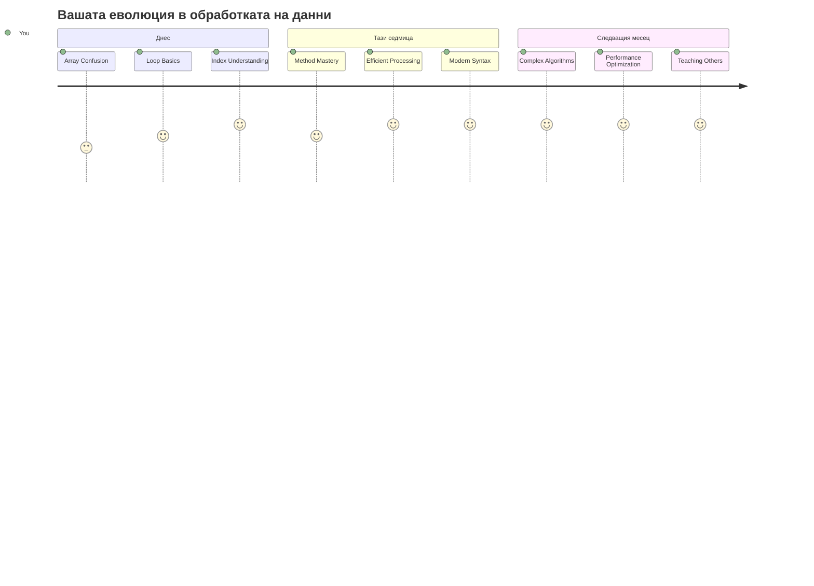
> 📦 **Отключихте силата на организацията и обработката на данни!** Масивите и циклите са основата на почти всяко приложение, което ще изграждате. От прости списъци до сложен анализ на данни - вече имате инструментите за работа с информацията ефективно и елегантно. Всяка динамична уеб страница, мобилно приложение и приложение, базирано на данни, разчита на тези основни концепции. Добре дошли в света на мащабируемата обработка на данни! 🎉

---

<!-- CO-OP TRANSLATOR DISCLAIMER START -->
**Отказ от отговорност**:
Този документ е преведен с помощта на AI преводаческа услуга [Co-op Translator](https://github.com/Azure/co-op-translator). Въпреки че се стремим към точност, моля имайте предвид, че автоматичните преводи могат да съдържат грешки или неточности. Оригиналният документ на неговия роден език трябва да се счита за авторитетен източник. За критична информация се препоръчва професионален човешки превод. Ние не носим отговорност за всякакви недоразумения или неправилни тълкувания, произтичащи от използването на този превод.
<!-- CO-OP TRANSLATOR DISCLAIMER END -->