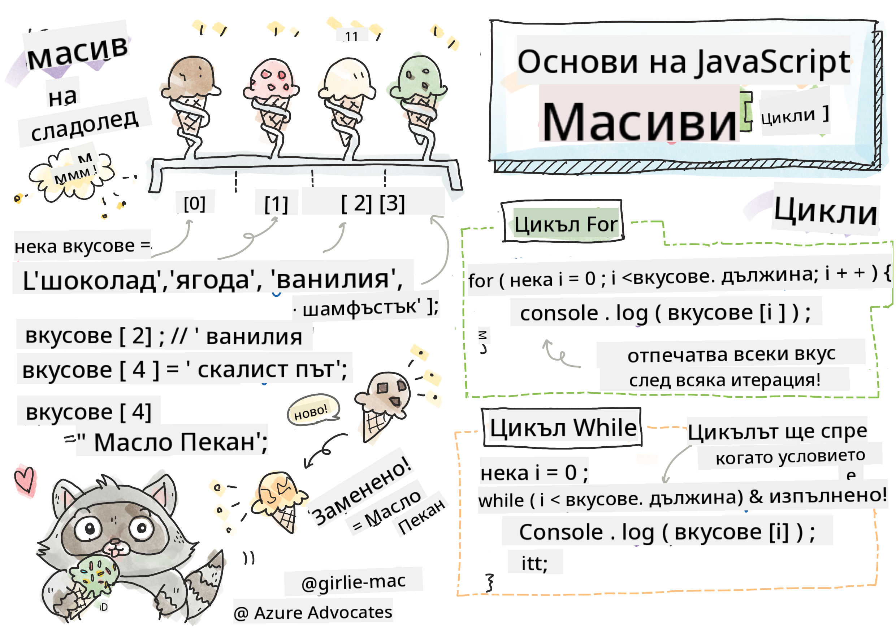

<!--
CO_OP_TRANSLATOR_METADATA:
{
  "original_hash": "3f7f87871312cf6cc12662da7d973182",
  "translation_date": "2025-08-28T08:09:12+00:00",
  "source_file": "2-js-basics/4-arrays-loops/README.md",
  "language_code": "bg"
}
-->
# Основи на JavaScript: Масиви и Цикли


> Скетч от [Tomomi Imura](https://twitter.com/girlie_mac)

## Предварителен тест
[Предварителен тест](https://ashy-river-0debb7803.1.azurestaticapps.net/quiz/13)

Този урок обхваща основите на JavaScript, езикът, който осигурява интерактивност в уеб. В този урок ще научите за масиви и цикли, които се използват за манипулиране на данни.

[](https://youtube.com/watch?v=1U4qTyq02Xw "Масиви")

[](https://www.youtube.com/watch?v=Eeh7pxtTZ3k "Цикли")

> 🎥 Кликнете върху изображенията по-горе за видеа относно масиви и цикли.

> Можете да преминете този урок на [Microsoft Learn](https://docs.microsoft.com/learn/modules/web-development-101-arrays/?WT.mc_id=academic-77807-sagibbon)!

## Масиви

Работата с данни е често срещана задача за всеки език, и тя става много по-лесна, когато данните са организирани в структурен формат, като масиви. С масиви данните се съхраняват в структура, подобна на списък. Едно от основните предимства на масивите е, че можете да съхранявате различни типове данни в един масив.

✅ Масивите са навсякъде около нас! Можете ли да измислите пример от реалния живот за масив, като например масив от слънчеви панели?

Синтаксисът за масив е чифт квадратни скоби.

```javascript
let myArray = [];
```

Това е празен масив, но масивите могат да бъдат декларирани вече попълнени с данни. Множеството стойности в масив се разделят със запетая.

```javascript
let iceCreamFlavors = ["Chocolate", "Strawberry", "Vanilla", "Pistachio", "Rocky Road"];
```

Стойностите в масива получават уникална стойност, наречена **индекс**, цяло число, което се определя въз основа на разстоянието му от началото на масива. В горния пример стринговата стойност "Chocolate" има индекс 0, а индексът на "Rocky Road" е 4. Използвайте индекса с квадратни скоби, за да извлечете, промените или добавите стойности в масива.

✅ Изненадва ли ви, че масивите започват от индекс нула? В някои програмни езици индексите започват от 1. Има интересна история за това, която можете да [прочетете в Wikipedia](https://en.wikipedia.org/wiki/Zero-based_numbering).

```javascript
let iceCreamFlavors = ["Chocolate", "Strawberry", "Vanilla", "Pistachio", "Rocky Road"];
iceCreamFlavors[2]; //"Vanilla"
```

Можете да използвате индекса, за да промените стойност, като това:

```javascript
iceCreamFlavors[4] = "Butter Pecan"; //Changed "Rocky Road" to "Butter Pecan"
```

И можете да добавите нова стойност на даден индекс, като това:

```javascript
iceCreamFlavors[5] = "Cookie Dough"; //Added "Cookie Dough"
```

✅ По-често срещан начин за добавяне на стойности в масив е чрез оператори като array.push().

За да разберете колко елемента има в масива, използвайте свойството `length`.

```javascript
let iceCreamFlavors = ["Chocolate", "Strawberry", "Vanilla", "Pistachio", "Rocky Road"];
iceCreamFlavors.length; //5
```

✅ Опитайте сами! Използвайте конзолата на браузъра си, за да създадете и манипулирате масив по ваш избор.

## Цикли

Циклите ни позволяват да изпълняваме повтарящи се или **итеративни** задачи и могат да спестят много време и код. Всяка итерация може да се различава по своите променливи, стойности и условия. В JavaScript има различни видове цикли, които имат малки разлики, но по същество правят едно и също: обхождат данни.

### For цикъл

Цикълът `for` изисква 3 части, за да се изпълни:
- `counter` Променлива, която обикновено се инициализира с число, което брои итерациите
- `condition` Израз, който използва оператори за сравнение, за да спре цикъла, когато стане `false`
- `iteration-expression` Изпълнява се в края на всяка итерация, обикновено се използва за промяна на стойността на брояча
  
```javascript
// Counting up to 10
for (let i = 0; i < 10; i++) {
  console.log(i);
}
```

✅ Стартирайте този код в конзолата на браузъра. Какво се случва, когато направите малки промени в брояча, условието или израза за итерация? Можете ли да го накарате да работи назад, създавайки обратно броене?

### While цикъл

За разлика от синтаксиса на цикъла `for`, цикълът `while` изисква само условие, което ще спре цикъла, когато условието стане `false`. Условията в циклите обикновено зависят от други стойности като броячи и трябва да се управляват по време на цикъла. Началните стойности за броячите трябва да се създадат извън цикъла, а всички изрази за изпълнение на условието, включително промяната на брояча, трябва да се поддържат вътре в цикъла.

```javascript
//Counting up to 10
let i = 0;
while (i < 10) {
 console.log(i);
 i++;
}
```

✅ Защо бихте избрали for цикъл вместо while цикъл? 17 хиляди потребители имаха същия въпрос в StackOverflow, а някои от мненията [може да ви бъдат интересни](https://stackoverflow.com/questions/39969145/while-loops-vs-for-loops-in-javascript).

## Цикли и масиви

Масивите често се използват с цикли, защото повечето условия изискват дължината на масива, за да спрат цикъла, а индексът може също да бъде стойността на брояча.

```javascript
let iceCreamFlavors = ["Chocolate", "Strawberry", "Vanilla", "Pistachio", "Rocky Road"];

for (let i = 0; i < iceCreamFlavors.length; i++) {
  console.log(iceCreamFlavors[i]);
} //Ends when all flavors are printed
```

✅ Експериментирайте с обхождане на масив по ваш избор в конзолата на браузъра.

---

## 🚀 Предизвикателство

Има и други начини за обхождане на масиви освен for и while цикли. Съществуват [forEach](https://developer.mozilla.org/docs/Web/JavaScript/Reference/Global_Objects/Array/forEach), [for-of](https://developer.mozilla.org/docs/Web/JavaScript/Reference/Statements/for...of) и [map](https://developer.mozilla.org/docs/Web/JavaScript/Reference/Global_Objects/Array/map). Пренапишете вашия цикъл за масив, използвайки една от тези техники.

## Финален тест
[Финален тест](https://ashy-river-0debb7803.1.azurestaticapps.net/quiz/14)

## Преглед и самостоятелно обучение

Масивите в JavaScript имат много методи, които са изключително полезни за манипулиране на данни. [Прочетете за тези методи](https://developer.mozilla.org/docs/Web/JavaScript/Reference/Global_Objects/Array) и изпробвайте някои от тях (като push, pop, slice и splice) върху масив, който сте създали.

## Задача

[Обход на масив](assignment.md)

---

**Отказ от отговорност**:  
Този документ е преведен с помощта на AI услуга за превод [Co-op Translator](https://github.com/Azure/co-op-translator). Въпреки че се стремим към точност, моля, имайте предвид, че автоматичните преводи може да съдържат грешки или неточности. Оригиналният документ на неговия изходен език трябва да се счита за авторитетен източник. За критична информация се препоръчва професионален превод от човек. Ние не носим отговорност за каквито и да е недоразумения или погрешни интерпретации, произтичащи от използването на този превод.