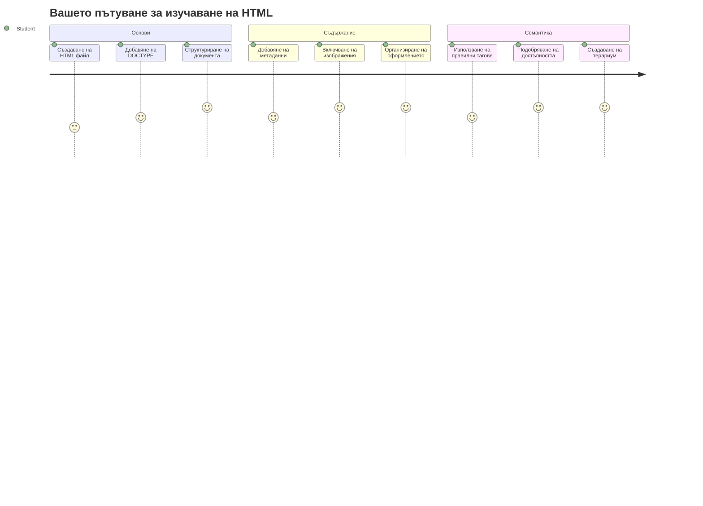
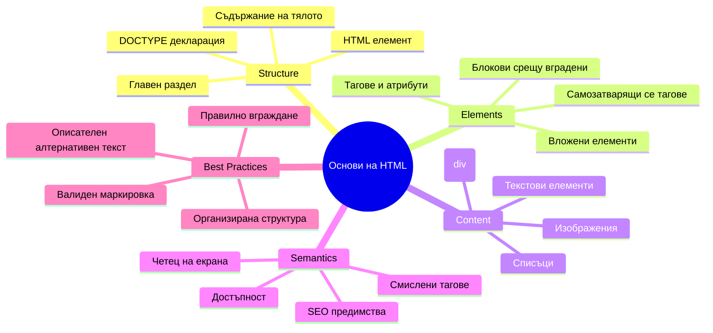
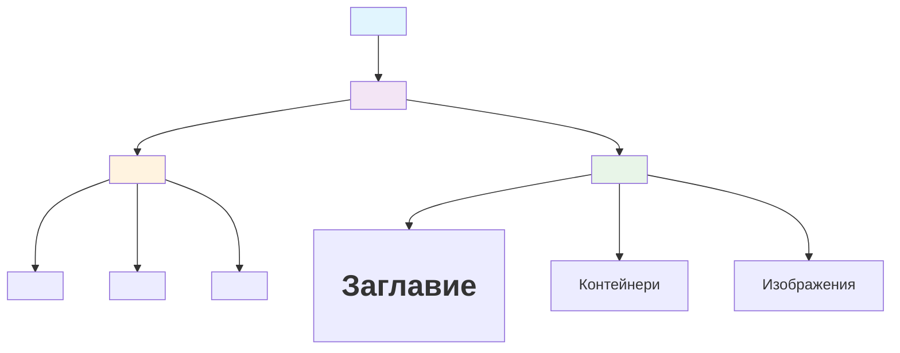
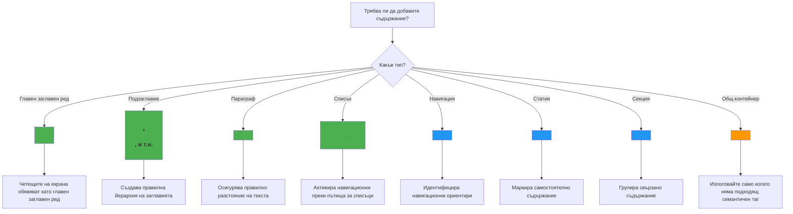
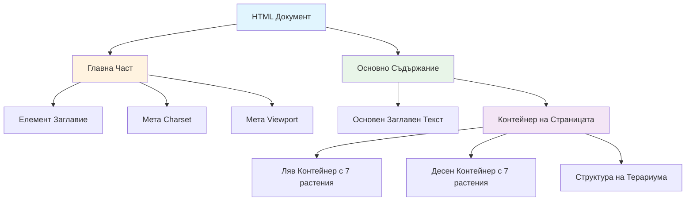
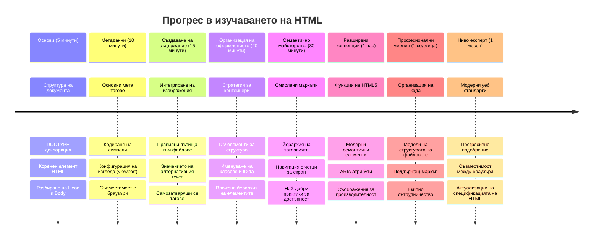

<!--
CO_OP_TRANSLATOR_METADATA:
{
  "original_hash": "3fcfa99c4897e051b558b5eaf1e8cc74",
  "translation_date": "2026-01-07T07:14:47+00:00",
  "source_file": "3-terrarium/1-intro-to-html/README.md",
  "language_code": "bg"
}
-->
# Terrarium Project Part 1: Въведение в HTML



> Скетчноут от [Tomomi Imura](https://twitter.com/girlie_mac)

HTML или HyperText Markup Language е основата на всеки уебсайт, който някога сте посещавали. Помислете за HTML като за скелета, който дава структура на уеб страниците – той определя къде да отиде съдържанието, как е организирано и какво представлява всяка част. Докато CSS по-късно „облича“ вашия HTML с цветове и оформления, а JavaScript го оживява с интерактивност, HTML осигурява съществената структура, която прави всичко останало възможно.

В този урок ще създадете HTML структура за виртуален интерфейс на терариум. Този практически проект ще ви научи на основни концепции в HTML, докато изграждате нещо визуално ангажиращо. Ще научите как да организирате съдържание с помощта на семантични елементи, да работите с изображения и да създадете основата за интерактивно уеб приложение.

Към края на урока ще имате работеща HTML страница, показваща изображения на растения, организирани в колони, готова за стилове в следващия урок. Не се притеснявайте, ако първоначално изглежда основно – това е точно това, което HTML трябва да прави преди CSS да добави визуален блясък.


## Предварителен тест

[Pre-lecture quiz](https://ff-quizzes.netlify.app/web/quiz/15)

> 📺 **Гледайте и учете**: Вижте този полезен видео обзор
> 
> [](https://www.youtube.com/watch?v=1TvxJKBzhyQ)

## Настройване на вашия проект

Преди да се потопим в HTML кода, нека настроим подходящо работно пространство за вашия терариум проект. Създаването на организирана файловата структура от самото начало е важен навик, който ще ви служи през цялото ви пътешествие в уеб разработката.

### Задача: Създайте структурата на проекта си

Ще създадете отделена папка за вашия терариум и ще добавите първия си HTML файл. Ето два подхода, които можете да използвате:

**Опция 1: Използване на Visual Studio Code**
1. Отворете Visual Studio Code
2. Щракнете "File" → "Open Folder" или използвайте `Ctrl+K, Ctrl+O` (Windows/Linux) или `Cmd+K, Cmd+O` (Mac)
3. Създайте нова папка на име `terrarium` и я изберете
4. В панела Explorer кликнете иконата за "New File"
5. Наименувайте файла си `index.html`


**Опция 2: Използване на команди в терминала**
```bash
mkdir terrarium
cd terrarium
touch index.html
code index.html
```

**Това, което тези команди правят:**
- **Създават** нова директория с име `terrarium` за вашия проект
- **Навигират** до директорията terrarium
- **Създават** празен файл `index.html`
- **Отварят** файла за редактиране във Visual Studio Code

> 💡 **Професионален съвет**: Името на файла `index.html` е специално в уеб разработката. Когато някой посети уебсайт, браузърите автоматично търсят `index.html` като начална страница за показване. Това означава, че URL като `https://mysite.com/projects/` автоматично ще сервира файла `index.html` от папката `projects` без да се налага да указвате името на файла в URL адреса.

## Разбиране на структурата на HTML документ

Всеки HTML документ следва специфична структура, която браузърите трябва да разберат и показват правилно. Помислете за тази структура като за формално писмо – тя има задължителни елементи в определен ред, които помагат на получателя (в този случай браузъра) да обработи съдържанието правилно.


Нека започнем с добавянето на съществената основа, от която всеки HTML документ се нуждае.

### Декларация DOCTYPE и коренов елемент

Първите два реда от всеки HTML файл служат като „въведение“ на документа към браузъра:

```html
<!DOCTYPE html>
<html></html>
```

**Разбиране какво прави този код:**
- **Декларира** типа на документа като HTML5 чрез `<!DOCTYPE html>`
- **Създава** кореновия `<html>` елемент, който ще съдържа цялото съдържание на страницата
- **Установява** съвременни уеб стандарти за правилно изобразяване от браузъра
- **Осигурява** последователно показване в различни браузъри и устройства

> 💡 **Съвет за VS Code**: Задръжте курсора над всеки HTML таг във VS Code, за да видите полезна информация от MDN Web Docs, включително примери за употреба и съвместимост с браузъри.

> 📚 **Научете повече**: Декларацията DOCTYPE предотвратява браузърите да влизат в „quirks mode“, който се използваше за поддръжка на много стари уебсайтове. Модерната уеб разработка използва опростената декларация `<!DOCTYPE html>`, за да осигури [изобразяване, съобразено със стандартите](https://developer.mozilla.org/docs/Web/HTML/Quirks_Mode_and_Standards_Mode).

### 🔄 **Педагогическа проверка**
**Пауза и размисъл**: Уверете се, че разбирате:
- ✅ Защо всеки HTML документ се нуждае от DOCTYPE декларация
- ✅ Какво съдържа кореновият `<html>` елемент
- ✅ Как тази структура помага на браузърите да изобразят страниците правилно

**Бърз тест**: Можете ли да обясните със свои думи какво означава „изобразяване, съобразено със стандартите“?

## Добавяне на съществен метаинформация за документа

Секцията `<head>` в HTML документа съдържа важна информация, от която браузърите и търсачките се нуждаят, но която посетителите не виждат директно на страницата. Помислете за нея като „задкулисна“ информация, която помага на вашата уеб страница да работи правилно и да се показва коректно на различни устройства и платформи.

Тази метаинформация казва на браузърите как да показват страницата ви, каква кодировка на символите да използват и как да се справят с различни размери на екрана – всички тези неща са важни за създаването на професионални и достъпни уеб страници.

### Задача: Добавете секцията head

Поставете този `<head>` раздел между отварящия и затварящия `<html>` тагове:

```html
<head>
	<title>Welcome to my Virtual Terrarium</title>
	<meta charset="utf-8" />
	<meta http-equiv="X-UA-Compatible" content="IE=edge" />
	<meta name="viewport" content="width=device-width, initial-scale=1" />
</head>
```

**Разбор какво прави всеки елемент:**
- **Настройва** заглавието на страницата, което се появява в табовете на браузъра и в резултатите от търсене
- **Определя** UTF-8 кодиране за правилно изобразяване на текста по света
- **Гарантира** съвместимост с модерни версии на Internet Explorer
- **Конфигурира** отзивчив дизайн, като задава viewport със ширина, съответстваща на устройството
- **Контролира** началното ниво на мащабиране за показване на съдържанието в естествен размер

> 🤔 **Помислете за това**: Какво би се случило, ако зададете viewport мета таг като този: `<meta name="viewport" content="width=600">`? Това ще принуди страницата да бъде винаги широка 600 пиксела, като ще развали отзивчивия дизайн! Научете повече за [правилната конфигурация на viewport](https://developer.mozilla.org/docs/Web/HTML/Viewport_meta_tag).

## Изграждане на тялото на документа

Елементът `<body>` съдържа цялото видимо съдържание на вашата уеб страница – всичко, което потребителите ще видят и с което ще взаимодействат. Докато секцията `<head>` дава инструкции на браузъра, секцията `<body>` съдържа самото съдържание: текст, изображения, бутони и други елементи, които създават потребителския интерфейс.

Нека добавим структурата на тялото и разберем как HTML таговете работят заедно, за да създадат смислено съдържание.

### Разбиране на структурата на HTML таговете

HTML използва тагове в двойки, за да дефинира елементи. Повечето тагове имат отварящ таг като `<p>` и затварящ таг като `</p>`, като съдържанието се поставя между тях: `<p>Hello, world!</p>`. Това създава параграфен елемент, съдържащ текста "Hello, world!".

### Задача: Добавете body елемента

Обновете HTML файла си, за да включва елемента `<body>`:

```html
<!DOCTYPE html>
<html>
	<head>
		<title>Welcome to my Virtual Terrarium</title>
		<meta charset="utf-8" />
		<meta http-equiv="X-UA-Compatible" content="IE=edge" />
		<meta name="viewport" content="width=device-width, initial-scale=1" />
	</head>
	<body></body>
</html>
```

**Ето какво осигурява цялата тази структура:**
- **Установява** основната рамка на HTML5 документа
- **Включва** съществена метаинформация за правилно изобразяване от браузъра
- **Създава** празно тяло, готово за видимото ви съдържание
- **Следва** най-добрите практики в модерната уеб разработка

Сега сте готови да добавите видимите елементи на вашия терариум. Ще използваме `<div>` елементи като контейнери за организиране на различни секции с съдържание и `` елементи за показване на изображенията на растения.

### Работа с изображения и контейнери за оформление

Изображенията са специални в HTML, защото използват „самозатварящи“ тагове. За разлика от елементи като `<p></p>`, които заобикалят съдържание, тагът `` съдържа цялата необходима информация в себе си чрез атрибути като `src` за пътя към изображението и `alt` за достъпност.

Преди да добавите изображения в HTML, ще трябва да организирате файловете на проекта си правилно, като създадете папка за изображения и добавите графиките на растенията.

**Първо, настройте вашите изображения:**
1. Създайте папка на име `images` в папката на вашия терариум проект
2. Изтеглете изображенията на растенията от [папката с решение](../../../../3-terrarium/solution/images) (общо 14 изображения на растения)
3. Копирайте всички изображения на растения в новата си папка `images`

### Задача: Създайте оформление за показване на растенията

Сега добавете изображенията на растения, организирани в две колони между вашите тагове `<body></body>`:

```html
<div id="page">
	<div id="left-container" class="container">
		<div class="plant-holder">
			
		</div>
		<div class="plant-holder">
			
		</div>
		<div class="plant-holder">
			
		</div>
		<div class="plant-holder">
			
		</div>
		<div class="plant-holder">
			
		</div>
		<div class="plant-holder">
			
		</div>
		<div class="plant-holder">
			
		</div>
	</div>
	<div id="right-container" class="container">
		<div class="plant-holder">
			
		</div>
		<div class="plant-holder">
			
		</div>
		<div class="plant-holder">
			
		</div>
		<div class="plant-holder">
			
		</div>
		<div class="plant-holder">
			
		</div>
		<div class="plant-holder">
			
		</div>
		<div class="plant-holder">
			
		</div>
	</div>
</div>
```

**Стъпка по стъпка, това се случва в този код:**
- **Създава** главен контейнер на страницата с `id="page"`, който държи цялото съдържание
- **Установява** два контейнера за колони: `left-container` и `right-container`
- **Организира** 7 растения в лявата колона и 7 растения в дясната колона
- **Обгражда** всяко изображение на растение в `plant-holder` div за индивидуално позициониране
- **Прилага** последователни имена на класове за стилове в следващия урок
- **Задава** уникални ID-та на всяко изображение за по-късна интеракция с JavaScript
- **Включва** правилни пътища към папката с изображения

> 🤔 **Помислете за това**: Обърнете внимание, че всички изображения в момента имат еднакъв alt текст „plant“. Това не е идеално за достъпност. Потребителите на екранни четци биха чули „plant“ повторено 14 пъти, без да знаят кое точно растение е всяко изображение. Можете ли да измислите по-добри, по-описателни alt текстове за всяко изображение?

> 📝 **Типове HTML елементи**: Елементите `<div>` са „блокови“ и заемат цялата ширина, докато елементите `<span>` са „инлайн“ и заемат само необходимата ширина. Какво мислите какво би станало, ако замените всички тези `<div>` тагове с `<span>` тагове?

### 🔄 **Педагогическа проверка**
**Разбиране на структурата**: Отделете момент, за да прегледате структурите в HTML:
- ✅ Можете ли да откриете главните контейнери в оформлението си?
- ✅ Разбирате ли защо всяко изображение има уникално ID?
- ✅ Как бихте описали предназначението на `plant-holder` div-овете?

**Визуална проверка**: Отворете своя HTML файл в браузър. Трябва да видите:
- Основен списък с изображения на растения
- Изображенията организирани в две колони
- Просто, нестилизирано оформление

**Запомнете**: Този обикновен вид е точно това, което HTML трябва да изглежда преди стилизиране с CSS!

С добавения този маркъп растенията ще се покажат на екрана, макар и все още да не изглеждат полиран – за това е CSS в следващия урок! За момента имате солидна HTML основа, която правилно организира съдържанието и следва най-добрите практики за достъпност.

## Използване на семантичен HTML за достъпност

Семантичният HTML означава да избирате HTML елементи според тяхното значение и цел, а не само според въздействието им върху визията. Когато използвате семантичен маркъп, вие комуникирате структурата и значението на съдържанието си към браузъри, търсачки и помощни технологии като екранни четци.


Този подход прави вашите уебсайтове по-достъпни за потребители с увреждания и помага на търсачките по-добре да разбират съдържанието ви. Това е фундаментален принцип на модерната уеб разработка, който създава по-добри изживявания за всички.

### Добавяне на семантично заглавие на страницата

Нека добавим подходящо заглавие на страницата на вашия терариум. Поставете този ред веднага след отварящия `<body>` таг:

```html
<h1>My Terrarium</h1>
```

**Защо семантичният маркъп е важен:**
- **Помага** на екранните четци да навигират и разбират структурата на страницата
- **Подобрява** оптимизацията за търсачки (SEO), като изяснява йерархията на съдържанието
- **Подсилва** достъпността за потребители с нарушения на зрението или когнитивни различия
- **Създава** по-добри потребителски изживявания на всички устройства и платформи
- **Следва** уеб стандартите и добрите практики за професионална разработка

**Примери за семантични срещу несемантични избори:**

| Цел | ✅ Семантичен избор | ❌ Несемантичен избор |
|---------|-------------------|------------------------|
| Основно заглавие | `<h1>Title</h1>` | `<div class="big-text">Title</div>` |
| Навигация | `<nav><ul><li></li></ul></nav>` | `<div class="menu"><div></div></div>` |
| Бутон | `<button>Click me</button>` | `<span onclick="...">Click me</span>` |
| Съдържание на статия | `<article><p></p></article>` | `<div class="content"><div></div></div>` |

> 🎥 **Вижте го в действие**: Гледайте [как екранните четци взаимодействат с уеб страници](https://www.youtube.com/watch?v=OUDV1gqs9GA), за да разберете защо семантичният маркъп е решаващ за достъпността. Забележете как правилната HTML структура помага на потребителите да навигират ефективно.

## Създаване на контейнер за терариума

Сега нека добавим HTML структурата за самия терариум – стъкления контейнер, където растенията в крайна сметка ще бъдат поставени. Тази секция демонстрира важна концепция: HTML осигурява структура, но без CSS стилове тези елементи все още няма да се виждат.

Маркъпът за терариума използва описателни имена на класове, които ще направят стиловете с CSS интуитивни и лесни за поддръжка в следващия урок.

### Задача: Добавете структурата на терариума

Поставете този маркъп над последния таг `</div>` (преди затварящия таг на контейнера на страницата):

```html
<div id="terrarium">
	<div class="jar-top"></div>
	<div class="jar-walls">
		<div class="jar-glossy-long"></div>
		<div class="jar-glossy-short"></div>
	</div>
	<div class="dirt"></div>
	<div class="jar-bottom"></div>
</div>
```

**Разбиране на тази структура за терариума:**
- **Създава** главен контейнер на терариума с уникално ID за стилизиране
- **Дефинира** отделни елементи за всеки визуален компонент (горна част, стени, пръст, долна част)  
- **Включва** вложени елементи за ефекти на отражение на стъкло (лъскави елементи)  
- **Използва** описателни имена на класове, които ясно показват целта на всеки елемент  
- **Подготвя** структурата за CSS стилизиране, което ще създаде външния вид на стъклен терариум  

> 🤔 **Забелязвате ли нещо?**: Въпреки че добавихте този маркъп, не виждате нищо ново на страницата! Това прекрасно илюстрира как HTML осигурява структура, а CSS — визия. Тези `<div>` елементи съществуват, но все още нямат визуално стилизиране – то предстои в следващия урок!


### 🔄 **Педагогическа проверка**  
**Владеене на HTML структурата**: Преди да продължите, уверете се, че можете:  
- ✅ Да обясните разликата между HTML структура и визуален вид  
- ✅ Да различите семантични и несемантични HTML елементи  
- ✅ Да опишете как правилният маркъп подпомага достъпността  
- ✅ Да разпознаете пълната дървовидна структура на документа  

**Тествайте разбирането си**: Опитайте да отворите вашия HTML файл в браузър с изключен JavaScript и без CSS. Това ще ви покаже чистата семантична структура, която сте създали!  

---  

## Предизвикателство с GitHub Copilot Agent  

Използвайте режим Agent, за да изпълните следното предизвикателство:  

**Описание:** Създайте семантична HTML структура за секция с указания за грижа за растенията, която може да бъде добавена към проекта за терариум.  

**Подсказка:** Създайте семантична HTML секция, която включва главен заглавен елемент "Указания за грижа за растенията", три подтемички с заглавия "Поливане", "Изисквания към светлината" и "Грижа за почвата", всяка съдържаща параграф с информация за грижите. Използвайте подходящи семантични HTML тагове като `<section>`, `<h2>`, `<h3>` и `<p>`, за да структурирате съдържанието адекватно.  

Научете повече за [режим agent](https://code.visualstudio.com/blogs/2025/02/24/introducing-copilot-agent-mode) тук.  

## Предизвикателство за изследване на историята на HTML  

**Научаване за еволюцията на уеб**  

HTML еволюира значително откакто Тим Бърнърс-Лий създава първия уеб браузър в CERN през 1990 г. Някои по-стари тагове като `<marquee>` вече са остарели, тъй като не се съчетават добре с модерните стандарти за достъпност и принципите на адаптивен дизайн.  

**Опитайте този експеримент:**  
1. Временно обгърнете вашето `<h1>` заглавие с `<marquee>` тага: `<marquee><h1>Моят терариум</h1></marquee>`  
2. Отворете страницата в браузър и наблюдавайте ефекта на превъртане  
3. Помислете защо този тага е остарял (подсказка: за удобство на потребителя и достъпност)  
4. Премахнете `<marquee>` тага и се върнете към семантичен маркъп  

**Въпроси за размисъл:**  
- Как превъртащо се заглавие може да повлияе на потребители с нарушения на зрението или чувствителност към движение?  
- Какви съвременни CSS техники биха могли да постигнат подобни визуални ефекти по-достъпно?  
- Защо е важно да се използват актуални уеб стандарти вместо остарели елементи?  

Разгледайте повече за [остарели и отхвърлени HTML елементи](https://developer.mozilla.org/docs/Web/HTML/Element#Obsolete_and_deprecated_elements), за да разберете как уеб стандартите се развиват, за да подобрят потребителското изживяване.  

## Тест след лекцията  

[Тест след лекцията](https://ff-quizzes.netlify.app/web/quiz/16)  

## Преглед и самообучение  

**Удължете знанията си по HTML**  

HTML е основата на уеб технологиите повече от 30 години, развил се от прост език за маркиране на документи до сложна платформа за създаване на интерактивни приложения. Разбирането на тази еволюция ви помага да оцените съвременните уеб стандарти и да вземате по-добри решения при разработката.  

**Препоръчани учебни пътеки:**  

1. **История и еволюция на HTML**  
   - Изследвайте хронологията от HTML 1.0 до HTML5  
   - Разберете защо някои тагове са отхвърлени (достъпност, удобство за мобилни устройства, поддръжка)  
   - Проучете нови функции и предложения за HTML  

2. **Дълбоко навлизане в семантичен HTML**  
   - Проучете пълния списък със [семантични HTML5 елементи](https://developer.mozilla.org/docs/Web/HTML/Element)  
   - Практикувайте кога да използвате `<article>`, `<section>`, `<aside>` и `<main>`  
   - Запознайте се с ARIA атрибути за подобрена достъпност  

3. **Модерен уеб дизайн и разработка**  
   - Изследвайте [създаването на адаптивни уебсайтове](https://docs.microsoft.com/learn/modules/build-simple-website/?WT.mc_id=academic-77807-sagibbon) в Microsoft Learn  
   - Разберете как HTML се интегрира с CSS и JavaScript  
   - Научете за уеб оптимизация и SEO най-добри практики  

**Въпроси за размисъл:**  
- Кои остарели HTML тагове открихте и защо са премахнати?  
- Какви нови HTML функции се предлагат за бъдещи версии?  
- Как семантичният HTML допринася за уеб достъпност и SEO?  

### ⚡ **Какво можете да направите през следващите 5 минути**  
- [ ] Отворете DevTools (F12) и инспектирайте HTML структурата на любимия си уебсайт  
- [ ] Създайте прост HTML файл с основни тагове: `<h1>`, `<p>`, и ``  
- [ ] Валидирайте HTML кода си с онлайн валидатор на W3C  
- [ ] Опитайте да добавите коментар към HTML с `<!-- comment -->`  

### 🎯 **Какво може да постигнете през този час**  
- [ ] Завършете теста след урока и прегледайте концепциите за семантичен HTML  
- [ ] Изградете проста уебстраница за себе си с правилна HTML структура  
- [ ] Експериментирайте с различни нива на заглавия и тагове за форматиране на текст  
- [ ] Добавете изображения и връзки, за да практикувате интеграция на мултимедия  
- [ ] Изследвайте HTML5 функции, които още не сте пробвали  

### 📅 **Вашето седмично HTML пътуване**  
- [ ] Завършете проекта терариум със семантичен маркъп  
- [ ] Създайте достъпна уебстраница с ARIA етикети и роли  
- [ ] Практикувайте създаване на форми с различни типове полета  
- [ ] Разгледайте HTML5 APIs като localStorage или геолокация  
- [ ] Изучавайте адаптивни HTML шаблони и мобилно ориентиран дизайн  
- [ ] Преглеждайте HTML код на други разработчици за най-добри практики  

### 🌟 **Вашата месечна основа за уеб развитие**  
- [ ] Изградете портфолио уебсайт, показващ уменията ви в HTML  
- [ ] Научете шаблониране в HTML с рамка като Handlebars  
- [ ] Допринасяйте към open source проекти чрез подобряване на HTML документация  
- [ ] Владеете напреднали HTML концепции като персонализирани елементи  
- [ ] Интегрирайте HTML с CSS фреймуъркове и JavaScript библиотеки  
- [ ] Наставлявайте други в основите на HTML  

## 🎯 Вашият времеви план за овладяване на HTML  


### 🛠️ Резюме на вашия HTML инструментариум  

След завършването на този урок вече имате:  
- **Структура на документа**: Пълна основа HTML5 с правилен DOCTYPE  
- **Семантичен маркъп**: Смислени тагове, които повишават достъпността и SEO  
- **Интеграция на изображения**: Добра организация на файловете и практики за alt текст  
- **Контейнери за оформление**: Стратегическо използване на div с описателни класове  
- **Осъзнаване за достъпността**: Познаване на навигацията с четец на екран  
- **Модерни стандарти**: Настоящи практики в HTML5 и познаване на остарели тагове  
- **Основи за проекта**: Солидна база за CSS стилизиране и JavaScript интерактивност  

**Следващи стъпки**: Вашата HTML структура е готова за CSS стилизиране! Семантичната основа, която сте изградили, ще направи следващия урок много по-лесен за разбиране.  

## Задача  

[Практикувайте HTML: Създайте макет на блог](assignment.md)

---

<!-- CO-OP TRANSLATOR DISCLAIMER START -->
**Отказ от отговорност**:
Този документ е преведен с помощта на AI преводаческа услуга [Co-op Translator](https://github.com/Azure/co-op-translator). Въпреки че се стремим към точност, моля имайте предвид, че автоматизираните преводи могат да съдържат грешки или неточности. Оригиналният документ на неговия език трябва да се счита за авторитетен източник. За критична информация се препоръчва професионален човешки превод. Ние не носим отговорност за всякакви недоразумения или неправилни тълкувания, произтичащи от използването на този превод.
<!-- CO-OP TRANSLATOR DISCLAIMER END -->