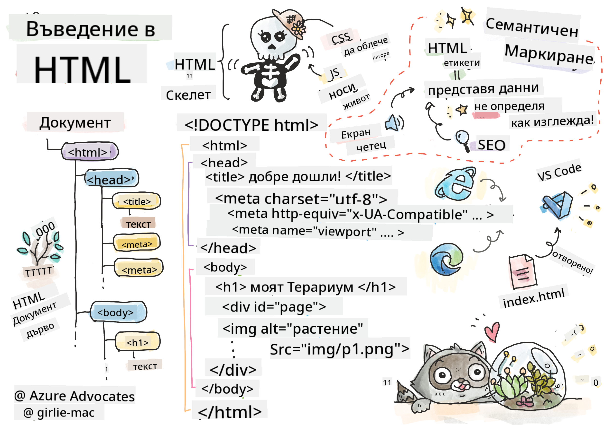
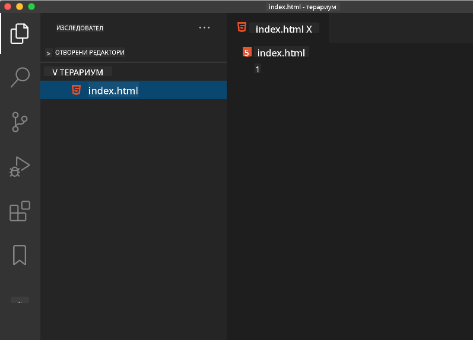

<!--
CO_OP_TRANSLATOR_METADATA:
{
  "original_hash": "46a0639e719b9cf1dfd062aa24cad639",
  "translation_date": "2025-08-27T22:00:12+00:00",
  "source_file": "3-terrarium/1-intro-to-html/README.md",
  "language_code": "bg"
}
-->
# Проект Терариум Част 1: Въведение в HTML


> Скица от [Tomomi Imura](https://twitter.com/girlie_mac)

## Тест преди лекцията

[Тест преди лекцията](https://ashy-river-0debb7803.1.azurestaticapps.net/quiz/15)

> Вижте видеото

> 
> [](https://www.youtube.com/watch?v=1TvxJKBzhyQ)

### Въведение

HTML, или HyperText Markup Language, е "скелетът" на уеба. Ако CSS "облича" вашия HTML, а JavaScript го "оживява", то HTML е тялото на вашето уеб приложение. Синтаксисът на HTML дори отразява тази идея, като включва тагове като "head", "body" и "footer".

В този урок ще използваме HTML, за да създадем "скелета" на интерфейса на нашия виртуален терариум. Той ще има заглавие и три колони: дясна и лява колона, където ще се намират плъзгащите се растения, и централна зона, която ще представлява самия стъклен терариум. До края на този урок ще можете да видите растенията в колоните, но интерфейсът ще изглежда малко странно; не се притеснявайте, в следващата секция ще добавим CSS стилове, за да направим интерфейса по-привлекателен.

### Задача

На вашия компютър създайте папка с име 'terrarium' и вътре в нея файл с име 'index.html'. Можете да направите това във Visual Studio Code, като отворите нов прозорец на VS Code, кликнете върху 'open folder' и навигирате до новата си папка. Кликнете върху малкия бутон 'file' в панела Explorer и създайте новия файл:



Или

Използвайте тези команди в git bash:
* `mkdir terrarium`
* `cd terrarium`
* `touch index.html`
* `code index.html` или `nano index.html`

> Файловете index.html указват на браузъра, че това е основният файл в папката; URL адреси като `https://anysite.com/test` може да бъдат изградени с помощта на структура от папки, включваща папка с име `test` и файл `index.html` вътре в нея; `index.html` не е задължително да се показва в URL адреса.

---

## DocType и html тагове

Първият ред на HTML файл е неговият doctype. Малко е изненадващо, че трябва да имате този ред най-отгоре на файла, но той указва на по-старите браузъри, че страницата трябва да се рендерира в стандартен режим, следвайки текущата HTML спецификация.

> Съвет: във VS Code можете да задържите курсора върху таг и да получите информация за неговото използване от MDN Reference guides.

Вторият ред трябва да бъде отварящият `<html>` таг, следван веднага от затварящия таг `</html>`. Тези тагове са основните елементи на вашия интерфейс.

### Задача

Добавете тези редове в началото на вашия файл `index.html`:

```HTML
<!DOCTYPE html>
<html></html>
```

✅ Има няколко различни режима, които могат да бъдат определени чрез задаване на DocType с низ за заявка: [Quirks Mode и Standards Mode](https://developer.mozilla.org/docs/Web/HTML/Quirks_Mode_and_Standards_Mode). Тези режими се използваха за поддръжка на много стари браузъри, които вече не се използват често (Netscape Navigator 4 и Internet Explorer 5). Можете да се придържате към стандартната декларация за doctype.

---

## 'head' на документа

Областта 'head' на HTML документа включва важна информация за вашата уеб страница, известна също като [метаданни](https://developer.mozilla.org/docs/Web/HTML/Element/meta). В нашия случай казваме на уеб сървъра, към който тази страница ще бъде изпратена за рендериране, следните четири неща:

-   заглавието на страницата
-   метаданни на страницата, включително:
    -   'character set', указващ какво кодиране на символите се използва на страницата
    -   информация за браузъра, включително `x-ua-compatible`, който указва, че се поддържа браузърът IE=edge
    -   информация за това как трябва да се държи viewport при зареждане. Задаването на viewport с начален мащаб 1 контролира нивото на увеличение при първоначалното зареждане на страницата.

### Задача

Добавете блок 'head' към вашия документ между отварящия и затварящия `<html>` таг.

```html
<head>
	<title>Welcome to my Virtual Terrarium</title>
	<meta charset="utf-8" />
	<meta http-equiv="X-UA-Compatible" content="IE=edge" />
	<meta name="viewport" content="width=device-width, initial-scale=1" />
</head>
```

✅ Какво би се случило, ако зададете meta таг за viewport като този: `<meta name="viewport" content="width=600">`? Прочетете повече за [viewport](https://developer.mozilla.org/docs/Web/HTML/Viewport_meta_tag).

---

## 'body' на документа

### HTML тагове

В HTML добавяте тагове към вашия .html файл, за да създадете елементи на уеб страница. Всеки таг обикновено има отварящ и затварящ таг, като този: `<p>hello</p>`, за да обозначи параграф. Създайте тялото на вашия интерфейс, като добавите комплект `<body>` тагове вътре в `<html>` таговете; вашият код сега изглежда така:

### Задача

```html
<!DOCTYPE html>
<html>
	<head>
		<title>Welcome to my Virtual Terrarium</title>
		<meta charset="utf-8" />
		<meta http-equiv="X-UA-Compatible" content="IE=edge" />
		<meta name="viewport" content="width=device-width, initial-scale=1" />
	</head>
	<body></body>
</html>
```

Сега можете да започнете да изграждате вашата страница. Обикновено използвате `<div>` тагове, за да създадете отделни елементи на страницата. Ще създадем серия от `<div>` елементи, които ще съдържат изображения.

### Изображения

Един HTML таг, който не се нуждае от затварящ таг, е `` тагът, защото той има елемент `src`, който съдържа цялата информация, необходима на страницата, за да рендерира елемента.

Създайте папка във вашето приложение с име `images` и в нея добавете всички изображения от [папката с изходен код](../../../../3-terrarium/solution/images); (има 14 изображения на растения).

### Задача

Добавете тези изображения на растения в две колони между `<body></body>` таговете:

```html
<div id="page">
	<div id="left-container" class="container">
		<div class="plant-holder">
			
		</div>
		<div class="plant-holder">
			
		</div>
		<div class="plant-holder">
			
		</div>
		<div class="plant-holder">
			
		</div>
		<div class="plant-holder">
			
		</div>
		<div class="plant-holder">
			
		</div>
		<div class="plant-holder">
			
		</div>
	</div>
	<div id="right-container" class="container">
		<div class="plant-holder">
			
		</div>
		<div class="plant-holder">
			
		</div>
		<div class="plant-holder">
			
		</div>
		<div class="plant-holder">
			
		</div>
		<div class="plant-holder">
			
		</div>
		<div class="plant-holder">
			
		</div>
		<div class="plant-holder">
			
		</div>
	</div>
</div>
```

> Забележка: Spans срещу Divs. Divs се считат за 'блокови' елементи, а Spans са 'вградени'. Какво би се случило, ако преобразувате тези divs в spans?

С този код растенията вече се показват на екрана. Изглежда доста зле, защото все още не са стилизирани с CSS, но ще направим това в следващия урок.

Всяко изображение има alt текст, който ще се появи, дори ако не можете да видите или рендерирате изображение. Това е важен атрибут за включване за достъпност. Научете повече за достъпността в бъдещи уроци; засега запомнете, че атрибутът alt предоставя алтернативна информация за изображение, ако потребителят по някаква причина не може да го види (поради бавна връзка, грешка в src атрибута или ако потребителят използва екранен четец).

✅ Забелязахте ли, че всяко изображение има един и същ alt таг? Това добра практика ли е? Защо или защо не? Можете ли да подобрите този код?

---

## Семантичен маркъп

Като цяло е за предпочитане да използвате смислен 'семантичен' маркъп, когато пишете HTML. Какво означава това? Това означава, че използвате HTML тагове, за да представите типа данни или взаимодействие, за които са предназначени. Например, основният текст на заглавието на страница трябва да използва `<h1>` таг.

Добавете следния ред точно под отварящия `<body>` таг:

```html
<h1>My Terrarium</h1>
```

Използването на семантичен маркъп, като например заглавия `<h1>` и неупорядъчени списъци `<ul>`, помага на екранните четци да навигират през страницата. Като цяло бутоните трябва да бъдат написани като `<button>`, а списъците като `<li>`. Въпреки че е _възможно_ да използвате специално стилизирани `<span>` елементи с обработчици на кликвания, за да имитирате бутони, е по-добре за потребителите с увреждания да използват технологии, за да определят къде на страницата се намира бутон и да взаимодействат с него, ако елементът изглежда като бутон. Поради тази причина се опитвайте да използвате семантичен маркъп колкото е възможно повече.

✅ Разгледайте екранен четец и [как той взаимодейства с уеб страница](https://www.youtube.com/watch?v=OUDV1gqs9GA). Можете ли да видите защо несемантичният маркъп може да разочарова потребителя?

## Терариумът

Последната част от този интерфейс включва създаване на маркъп, който ще бъде стилизиран, за да създаде терариум.

### Задача:

Добавете този маркъп над последния `</div>` таг:

```html
<div id="terrarium">
	<div class="jar-top"></div>
	<div class="jar-walls">
		<div class="jar-glossy-long"></div>
		<div class="jar-glossy-short"></div>
	</div>
	<div class="dirt"></div>
	<div class="jar-bottom"></div>
</div>
```

✅ Въпреки че добавихте този маркъп към екрана, не виждате абсолютно нищо да се рендерира. Защо?

---

## 🚀Предизвикателство

Има някои стари 'по-стари' тагове в HTML, които все още са забавни за използване, въпреки че не трябва да използвате остарели тагове като [тези тагове](https://developer.mozilla.org/docs/Web/HTML/Element#Obsolete_and_deprecated_elements) във вашия маркъп. Все пак, можете ли да използвате стария `<marquee>` таг, за да накарате заглавието h1 да се движи хоризонтално? (ако го направите, не забравяйте да го премахнете след това)

## Тест след лекцията

[Тест след лекцията](https://ashy-river-0debb7803.1.azurestaticapps.net/quiz/16)

## Преглед и самостоятелно обучение

HTML е "изпитаната и вярна" система от градивни елементи, която е помогнала за изграждането на уеба такъв, какъвто го познаваме днес. Научете малко за неговата история, като изучите някои стари и нови тагове. Можете ли да разберете защо някои тагове са били остарели, а други добавени? Какви тагове може да бъдат въведени в бъдеще?

Научете повече за изграждането на сайтове за уеб и мобилни устройства на [Microsoft Learn](https://docs.microsoft.com/learn/modules/build-simple-website/?WT.mc_id=academic-77807-sagibbon).

## Задание

[Практикувайте HTML: Създайте макет на блог](assignment.md)

---

**Отказ от отговорност**:  
Този документ е преведен с помощта на AI услуга за превод [Co-op Translator](https://github.com/Azure/co-op-translator). Въпреки че се стремим към точност, моля, имайте предвид, че автоматизираните преводи може да съдържат грешки или неточности. Оригиналният документ на неговия роден език трябва да се счита за авторитетен източник. За критична информация се препоръчва професионален човешки превод. Ние не носим отговорност за недоразумения или погрешни интерпретации, произтичащи от използването на този превод.