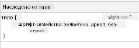
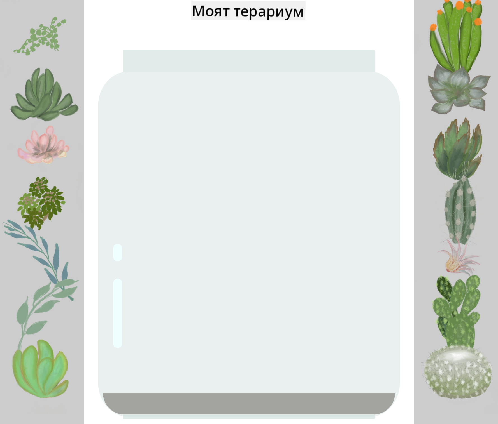

<!--
CO_OP_TRANSLATOR_METADATA:
{
  "original_hash": "92c4431eac70670b0450b02c1d11279a",
  "translation_date": "2025-10-24T22:41:43+00:00",
  "source_file": "3-terrarium/2-intro-to-css/README.md",
  "language_code": "bg"
}
-->
# Проект Терариум Част 2: Въведение в CSS


> Скица от [Tomomi Imura](https://twitter.com/girlie_mac)

Спомняте ли си как вашият HTML терариум изглеждаше доста обикновен? С CSS можем да преобразим тази проста структура в нещо визуално привлекателно.

Ако HTML е като изграждането на рамката на къща, то CSS е всичко, което я прави уютен дом - цветовете на стените, подредбата на мебелите, осветлението и как стаите се свързват помежду си. Помислете как дворецът Версай е започнал като обикновена ловна хижа, но внимателното внимание към декорацията и оформлението го е превърнало в една от най-великолепните сгради в света.

Днес ще преобразим вашия терариум от функционален в изискан. Ще научите как да позиционирате елементи прецизно, да създавате оформления, които се адаптират към различни размери на екрана, и да създавате визуална привлекателност, която прави уебсайтовете ангажиращи.

До края на този урок ще видите как стратегическото стилизиране с CSS може драматично да подобри вашия проект. Нека добавим стил към вашия терариум.

## Предварителен тест

[Предварителен тест](https://ff-quizzes.netlify.app/web/quiz/17)

## Започваме с CSS

CSS често се възприема като инструмент за "разкрасяване", но всъщност има много по-широка цел. CSS е като режисьор на филм - контролирате не само как всичко изглежда, но и как се движи, реагира на взаимодействие и се адаптира към различни ситуации.

Съвременният CSS е изключително способен. Можете да пишете код, който автоматично настройва оформленията за телефони, таблети и настолни компютри. Можете да създавате плавни анимации, които насочват вниманието на потребителите към важни елементи. Резултатите могат да бъдат доста впечатляващи, когато всичко работи заедно.

> 💡 **Съвет**: CSS постоянно се развива с нови функции и възможности. Винаги проверявайте [CanIUse.com](https://caniuse.com), за да се уверите, че браузърите поддържат новите функции на CSS, преди да ги използвате в производствени проекти.

**Ето какво ще постигнем в този урок:**
- **Създаване** на цялостен визуален дизайн за вашия терариум с помощта на съвременни техники на CSS
- **Изследване** на основни концепции като каскада, наследяване и селектори в CSS
- **Прилагане** на стратегии за позициониране и оформление, които се адаптират към различни устройства
- **Изграждане** на контейнер за терариума с помощта на форми и стилизиране в CSS

### Предпоставки

Трябва да сте завършили HTML структурата за вашия терариум от предишния урок и да сте готови да я стилизирате.

> 📺 **Видео ресурс**: Вижте този полезен видео урок
>
> [](https://www.youtube.com/watch?v=6yIdOIV9p1I)

### Настройка на вашия CSS файл

Преди да започнем със стилизирането, трябва да свържем CSS с нашия HTML. Тази връзка казва на браузъра къде да намери инструкциите за стилизиране на нашия терариум.

В папката на вашия терариум създайте нов файл, наречен `style.css`, след това го свържете в секцията `<head>` на вашия HTML документ:

```html
<link rel="stylesheet" href="./style.css" />
```

**Ето какво прави този код:**
- **Създава** връзка между вашите HTML и CSS файлове
- **Указва** на браузъра да зареди и приложи стиловете от `style.css`
- **Използва** атрибута `rel="stylesheet"`, за да посочи, че това е CSS файл
- **Реферира** пътя към файла с `href="./style.css"`

## Разбиране на каскадата в CSS

Чудили ли сте се защо CSS се нарича "каскадни" стилове? Стиловете се спускат като водопад и понякога се конфликтират помежду си.

Помислете как работят военните командни структури - генерална заповед може да гласи "всички войници да носят зелено", но специфична заповед за вашето подразделение може да гласи "носете официални униформи за церемонията". По-специфичната инструкция има предимство. CSS следва подобна логика и разбирането на тази йерархия прави отстраняването на грешки много по-лесно.

### Експериментиране с приоритетите на каскадата

Нека видим каскадата в действие, като създадем конфликт в стиловете. Първо, добавете вътрешен стил към вашия `<h1>` таг:

```html
<h1 style="color: red">My Terrarium</h1>
```

**Какво прави този код:**
- **Прилага** червен цвят директно към елемента `<h1>` с помощта на вътрешен стил
- **Използва** атрибута `style`, за да вгради CSS директно в HTML
- **Създава** правило за стил с най-висок приоритет за този конкретен елемент

След това добавете това правило към вашия файл `style.css`:

```css
h1 {
  color: blue;
}
```

**В горното сме:**
- **Дефинирали** правило в CSS, което таргетира всички елементи `<h1>`
- **Задавали** текстов цвят син чрез външен стилов файл
- **Създавали** правило с по-нисък приоритет в сравнение с вътрешните стилове

✅ **Проверка на знанията**: Кой цвят се показва във вашето уеб приложение? Защо този цвят има предимство? Можете ли да си представите сценарии, в които бихте искали да замените стиловете?

> 💡 **Ред на приоритетите в CSS (от най-висок към най-нисък):**
> 1. **Вътрешни стилове** (атрибут style)
> 2. **ID-та** (#myId)
> 3. **Класове** (.myClass) и атрибути
> 4. **Селектори на елементи** (h1, div, p)
> 5. **По подразбиране на браузъра**

## CSS наследяване в действие

CSS наследяването работи като генетика - елементите наследяват определени свойства от своите родителски елементи. Ако зададете шрифт на елемента body, целият текст вътре автоматично използва същия шрифт. Това е подобно на начина, по който характерната челюст на фамилията Хабсбург се появява през поколенията, без да се задава за всеки индивид.

Въпреки това, не всичко се наследява. Стилове на текст като шрифтове и цветове се наследяват, но свойства на оформлението като отстъпи и рамки не се наследяват. Точно както децата могат да наследят физически черти, но не и модните предпочитания на родителите си.

### Наблюдение на наследяването на шрифта

Нека видим наследяването в действие, като зададем шрифт на елемента `<body>`:

```css
body {
  font-family: 'Segoe UI', Tahoma, Geneva, Verdana, sans-serif;
}
```

**Разбивка на случващото се тук:**
- **Задава** шрифт за целия страница, таргетирайки елемента `<body>`
- **Използва** стек от шрифтове с резервни опции за по-добра съвместимост с браузъри
- **Прилага** модерни системни шрифтове, които изглеждат добре на различни операционни системи
- **Гарантира**, че всички дъщерни елементи наследяват този шрифт, освен ако не са изрично заменени

Отворете инструментите за разработчици на браузъра (F12), отидете на таба Elements и инспектирайте вашия `<h1>` елемент. Ще видите, че той наследява шрифта от body:



✅ **Експеримент**: Опитайте да зададете други наследяеми свойства на `<body>` като `color`, `line-height` или `text-align`. Какво се случва с вашия заглавие и други елементи?

> 📝 **Наследяеми свойства включват**: `color`, `font-family`, `font-size`, `line-height`, `text-align`, `visibility`
>
> **Ненаследяеми свойства включват**: `margin`, `padding`, `border`, `width`, `height`, `position`

## Овладяване на селектори в CSS

Селекторите в CSS са вашият начин да таргетирате конкретни елементи за стилизиране. Те работят като даване на точни указания - вместо да кажете "къщата", може да кажете "синята къща с червената врата на улица Мейпъл".

CSS предоставя различни начини за прецизност, и изборът на правилния селектор е като избор на подходящ инструмент за задачата. Понякога трябва да стилизирате всяка врата в квартала, а понякога само една конкретна врата.

### Селектори на елементи (Тагове)

Селекторите на елементи таргетират HTML елементи по техния таг. Те са идеални за задаване на основни стилове, които се прилагат широко на страницата:

```css
body {
  font-family: 'Segoe UI', Tahoma, Geneva, Verdana, sans-serif;
  margin: 0;
  padding: 0;
}

h1 {
  color: #3a241d;
  text-align: center;
  font-size: 2.5rem;
  margin-bottom: 1rem;
}
```

**Разбиране на тези стилове:**
- **Задава** последователна типография за цялата страница с селектора `body`
- **Премахва** стандартните отстъпи и запълване на браузъра за по-добър контрол
- **Стилира** всички заглавни елементи с цвят, подравняване и разстояние
- **Използва** единици `rem` за мащабируемо и достъпно оразмеряване на шрифта

Докато селекторите на елементи работят добре за общо стилизиране, ще ви трябват по-специфични селектори, за да стилизирате индивидуални компоненти като растенията в вашия терариум.

### ID селектори за уникални елементи

ID селекторите използват символа `#` и таргетират елементи със специфични атрибути `id`. Тъй като ID-тата трябва да бъдат уникални на страницата, те са идеални за стилизиране на индивидуални, специални елементи като контейнерите за растенията отляво и отдясно.

Нека създадем стилизиране за контейнерите на терариума, където ще се намират растенията:

```css
#left-container {
  background-color: #f5f5f5;
  width: 15%;
  left: 0;
  top: 0;
  position: absolute;
  height: 100vh;
  padding: 1rem;
  box-sizing: border-box;
}

#right-container {
  background-color: #f5f5f5;
  width: 15%;
  right: 0;
  top: 0;
  position: absolute;
  height: 100vh;
  padding: 1rem;
  box-sizing: border-box;
}
```

**Ето какво постига този код:**
- **Позиционира** контейнерите в крайните леви и десни ръбове с помощта на `absolute` позициониране
- **Използва** единици `vh` (височина на изгледа) за адаптивна височина, която се променя според размера на екрана
- **Прилага** `box-sizing: border-box`, така че запълването да се включи в общата ширина
- **Премахва** ненужните единици `px` от стойности нула за по-чист код
- **Задава** лек фон, който е по-приятен за очите от ярко сивото

✅ **Предизвикателство за качество на кода**: Забележете как този CSS нарушава принципа DRY (Не се повтаряй). Можете ли да го рефакторирате, използвайки както ID, така и клас?

**Подобрен подход:**
```html
<div id="left-container" class="container"></div>
<div id="right-container" class="container"></div>
```

```css
.container {
  background-color: #f5f5f5;
  width: 15%;
  top: 0;
  position: absolute;
  height: 100vh;
  padding: 1rem;
  box-sizing: border-box;
}

#left-container {
  left: 0;
}

#right-container {
  right: 0;
}
```

### Селектори на класове за многократна употреба

Селекторите на класове използват символа `.` и са идеални, когато искате да приложите едни и същи стилове към множество елементи. За разлика от ID-тата, класовете могат да се използват многократно в целия HTML, което ги прави идеални за последователни стилови модели.

В нашия терариум всяко растение се нуждае от подобно стилизиране, но също така се нуждае от индивидуално позициониране. Ще използваме комбинация от класове за общи стилове и ID-та за уникално позициониране.

**Ето HTML структурата за всяко растение:**
```html
<div class="plant-holder">
  
</div>
```

**Ключови елементи обяснени:**
- **Използва** `class="plant-holder"` за последователно стилизиране на контейнера за всички растения
- **Прилага** `class="plant"` за общо стилизиране и поведение на изображението
- **Включва** уникално `id="plant1"` за индивидуално позициониране и взаимодействие с JavaScript
- **Осигурява** описателен alt текст за достъпност за хора с увредено зрение

Сега добавете тези стилове към вашия файл `style.css`:

```css
.plant-holder {
  position: relative;
  height: 13%;
  left: -0.6rem;
}

.plant {
  position: absolute;
  max-width: 150%;
  max-height: 150%;
  z-index: 2;
  transition: transform 0.3s ease;
}

.plant:hover {
  transform: scale(1.05);
}
```

**Разбивка на тези стилове:**
- **Създава** относително позициониране за контейнера на растението, за да установи контекст за позициониране
- **Задава** височина на всеки контейнер за растения на 13%, за да се гарантира, че всички растения се побират вертикално без превъртане
- **Премества** контейнерите леко наляво, за да центрира по-добре растенията в техните контейнери
- **Позволява** растенията да се мащабират адаптивно с свойства `max-width` и `max-height`
- **Използва** `z-index`, за да постави растенията над други елементи в терариума
- **Добавя** лек ефект при задържане с CSS преходи за по-добро взаимодействие с потребителя

✅ **Критично мислене**: Защо ни трябват както селектори `.plant-holder`, така и `.plant`? Какво би се случило, ако се опитаме да използваме само един?

> 💡 **Дизайнерски модел**: Контейнерът (`.plant-holder`) контролира оформлението и позиционирането, докато съдържанието (`.plant`) контролира външния вид и мащабирането. Това разделение прави кода по-лесен за поддръжка и по-гъвкав.

## Разбиране на позиционирането в CSS

Позиционирането в CSS е като да бъдете режисьор на сцена - вие решавате къде стои всеки актьор и как се движи по сцената. Някои актьори следват стандартната формация, докато други се нуждаят от специфично позициониране за драматичен ефект.

След като разберете позиционирането, много предизвикателства с оформлението стават управляеми. Нуждаете се от навигационна лента, която остава в горната част, докато потребителите превъртат? Позиционирането се справя с това. Искате подсказка, която се появява на конкретно място? Това също е позициониране.

### Петте стойности на позициониране

| Стойност на позициониране | Поведение | Приложение |
|---------------------------|-----------|------------|
| `static` | Стандартен поток, игнорира top/left/right/bottom | Нормално оформление на документа |
| `relative` | Позиционирано спрямо нормалната позиция | Малки корекции, създаване на контекст за позициониране |
| `absolute` | Позиционирано спрямо най-близкия позициониран предшественик | Прецизно разположение, наслагвания |
| `fixed` | Позиционирано спрямо изгледа | Навигационни ленти, плаващи елементи |
| `sticky` | Превключва между относително и фиксирано според превъртането | Заглавия, които се залепват при превъртане |

### Позициониране в нашия терариум

Нашият терариум използва стратегическа комбинация от типове позициониране, за да създаде желаното оформление:

```css
/* Container positioning */
.container {
  position: absolute; /* Removes from normal flow */
  /* ... other styles ... */
}

/* Plant holder positioning */
.plant-holder {
  position: relative; /* Creates positioning context */
  /* ... other styles ... */
}

/* Plant positioning */
.plant {
  position: absolute; /* Allows precise placement within holder */
  /* ... other styles ... */
}
```

**Разбиране на стратегията за
Нека изградим терариума стъпка по стъпка. Всеки елемент използва абсолютно позициониране и размери на база проценти за адаптивен дизайн:

```css
.jar-walls {
  height: 80%;
  width: 60%;
  background: #d1e1df;
  border-radius: 1rem;
  position: absolute;
  bottom: 0.5%;
  left: 20%;
  opacity: 0.5;
  z-index: 1;
  box-shadow: inset 0 0 2rem rgba(0, 0, 0, 0.1);
}

.jar-top {
  width: 50%;
  height: 5%;
  background: #d1e1df;
  position: absolute;
  bottom: 80.5%;
  left: 25%;
  opacity: 0.7;
  z-index: 1;
  border-radius: 0.5rem 0.5rem 0 0;
}

.jar-bottom {
  width: 50%;
  height: 1%;
  background: #d1e1df;
  position: absolute;
  bottom: 0;
  left: 25%;
  opacity: 0.7;
  border-radius: 0 0 0.5rem 0.5rem;
}

.dirt {
  width: 60%;
  height: 5%;
  background: #3a241d;
  position: absolute;
  border-radius: 0 0 1rem 1rem;
  bottom: 1%;
  left: 20%;
  opacity: 0.7;
  z-index: -1;
}
```

**Разбиране на конструкцията на терариума:**
- **Използва** размери на база проценти за адаптивно мащабиране на всички размери на екрана
- **Позиционира** елементите абсолютно, за да ги подреди и подравни прецизно
- **Прилага** различни стойности на прозрачност за създаване на ефект на стъклена прозрачност
- **Използва** `z-index` за наслояване, така че растенията да изглеждат вътре в буркана
- **Добавя** финни сенки и усъвършенстван радиус на рамката за по-реалистичен вид

### Адаптивен дизайн с проценти

Обърнете внимание как всички размери използват проценти вместо фиксирани пикселни стойности:

**Защо това е важно:**
- **Осигурява** пропорционално мащабиране на терариума на всякакъв размер екран
- **Поддържа** визуалните връзки между компонентите на буркана
- **Гарантира** последователно изживяване от мобилни телефони до големи настолни монитори
- **Позволява** дизайнът да се адаптира без да нарушава визуалното оформление

### CSS единици в действие

Използваме `rem` единици за радиуса на рамката, които се мащабират спрямо основния размер на шрифта. Това създава по-достъпни дизайни, които уважават предпочитанията на потребителя за шрифт. Научете повече за [CSS относителни единици](https://www.w3.org/TR/css-values-3/#font-relative-lengths) в официалната спецификация.

✅ **Визуален експеримент**: Опитайте да промените тези стойности и наблюдавайте ефектите:
- Променете прозрачността на буркана от 0.5 на 0.8 – как това влияе на външния вид на стъклото?
- Настройте цвета на почвата от `#3a241d` на `#8B4513` – какъв визуален ефект има това?
- Модифицирайте `z-index` на почвата на 2 – какво се случва с наслояването?

---

## Предизвикателство с GitHub Copilot Agent 🚀

Използвайте режима Agent, за да завършите следното предизвикателство:

**Описание:** Създайте CSS анимация, която кара растенията в терариума да се люлеят леко напред-назад, симулирайки ефект на естествен бриз. Това ще ви помогне да практикувате CSS анимации, трансформации и ключови кадри, като същевременно подобрите визуалната привлекателност на вашия терариум.

**Подсказка:** Добавете CSS анимации с ключови кадри, за да направите растенията в терариума да се люлеят леко отстрани. Създайте анимация на люлеене, която леко завърта всяко растение (2-3 градуса) наляво и надясно с продължителност от 3-4 секунди и я приложете към класа `.plant`. Уверете се, че анимацията се повтаря безкрайно и има функция за изглаждане за естествено движение.

Научете повече за [режим Agent](https://code.visualstudio.com/blogs/2025/02/24/introducing-copilot-agent-mode) тук.

## 🚀 Предизвикателство: Добавяне на отражения върху стъклото

Готови ли сте да подобрите вашия терариум с реалистични отражения върху стъклото? Тази техника ще добави дълбочина и реализъм към дизайна.

Ще създадете фини отблясъци, които симулират как светлината се отразява от стъклени повърхности. Този подход е подобен на начина, по който ренесансови художници като Ян ван Ейк използват светлина и отражение, за да направят рисуваното стъкло да изглежда триизмерно. Ето какво целите:



**Вашето предизвикателство:**
- **Създайте** фини бели или светли овални форми за отраженията върху стъклото
- **Позиционирайте** ги стратегически от лявата страна на буркана
- **Приложете** подходящи ефекти на прозрачност и размазване за реалистично отражение на светлината
- **Използвайте** `border-radius`, за да създадете органични, балоноподобни форми
- **Експериментирайте** с градиенти или сенки за подобрен реализъм

## Тест след лекцията

[Тест след лекцията](https://ff-quizzes.netlify.app/web/quiz/18)

## Разширете знанията си за CSS

CSS може да изглежда сложно в началото, но разбирането на тези основни концепции осигурява солидна основа за по-напреднали техники.

**Следващи области за изучаване на CSS:**
- **Flexbox** - опростява подравняването и разпределението на елементи
- **CSS Grid** - предоставя мощни инструменти за създаване на сложни оформления
- **CSS променливи** - намалява повторението и подобрява поддръжката
- **Адаптивен дизайн** - гарантира, че сайтовете работят добре на различни размери екрани

### Интерактивни учебни ресурси

Практикувайте тези концепции с тези ангажиращи, интерактивни игри:
- 🐸 [Flexbox Froggy](https://flexboxfroggy.com/) - Овладейте Flexbox чрез забавни предизвикателства
- 🌱 [Grid Garden](https://codepip.com/games/grid-garden/) - Научете CSS Grid, като отглеждате виртуални моркови
- 🎯 [CSS Battle](https://cssbattle.dev/) - Тествайте уменията си по CSS с кодиращи предизвикателства

### Допълнително обучение

За цялостни основи на CSS, завършете този модул на Microsoft Learn: [Стилизирайте вашето HTML приложение с CSS](https://docs.microsoft.com/learn/modules/build-simple-website/4-css-basics/?WT.mc_id=academic-77807-sagibbon)

## Задание

[Рефакториране на CSS](assignment.md)

---

**Отказ от отговорност**:  
Този документ е преведен с помощта на AI услуга за превод [Co-op Translator](https://github.com/Azure/co-op-translator). Въпреки че се стремим към точност, моля, имайте предвид, че автоматизираните преводи може да съдържат грешки или неточности. Оригиналният документ на неговия роден език трябва да се счита за авторитетен източник. За критична информация се препоръчва професионален човешки превод. Не носим отговорност за недоразумения или погрешни интерпретации, произтичащи от използването на този превод.