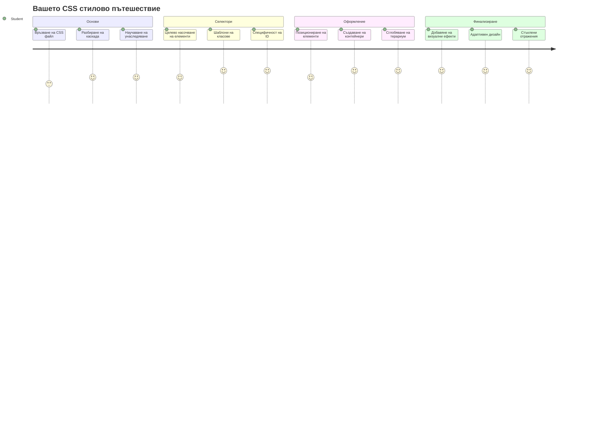
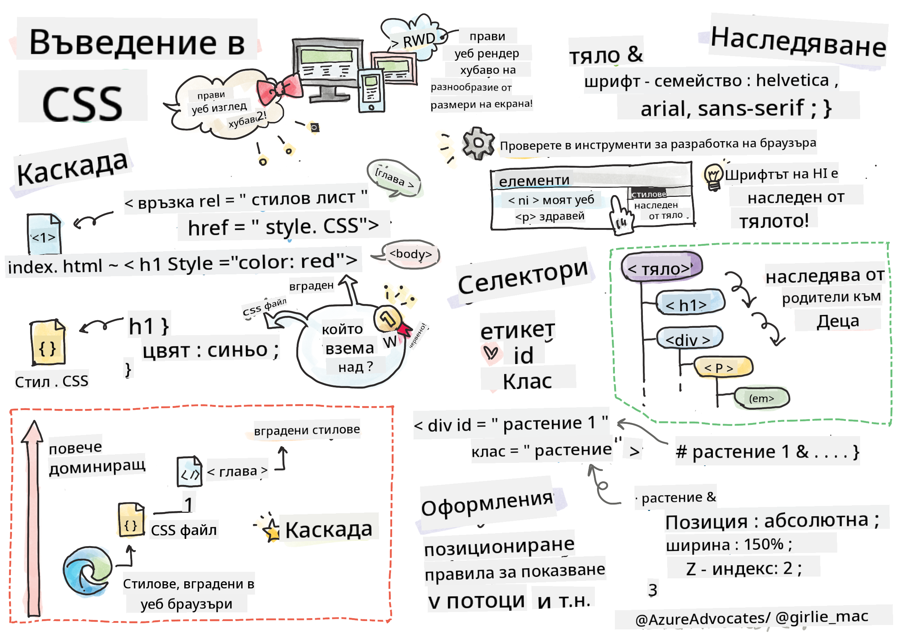
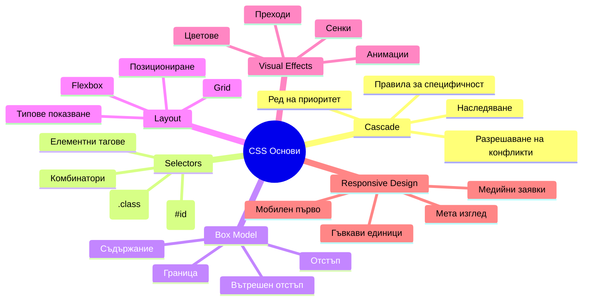
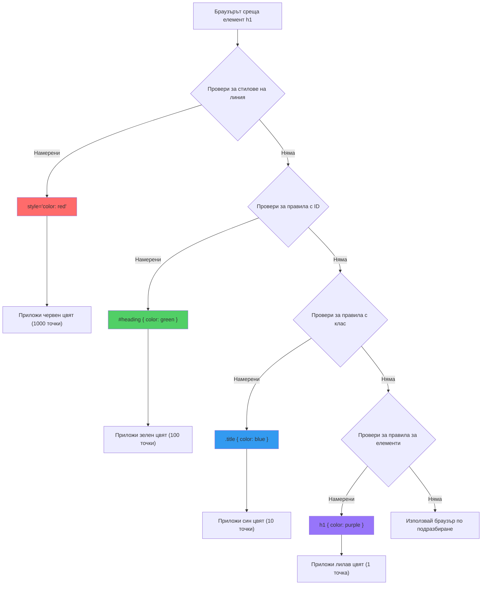
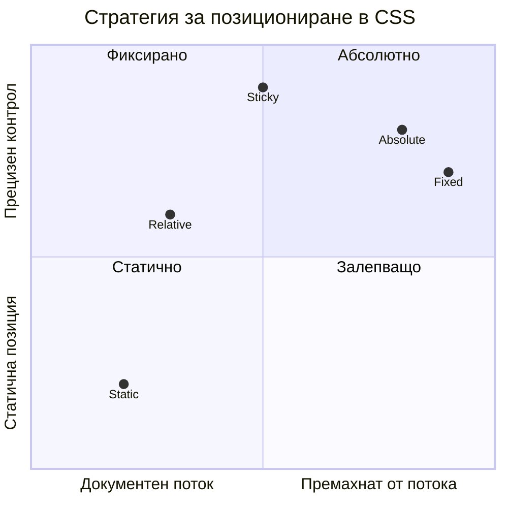
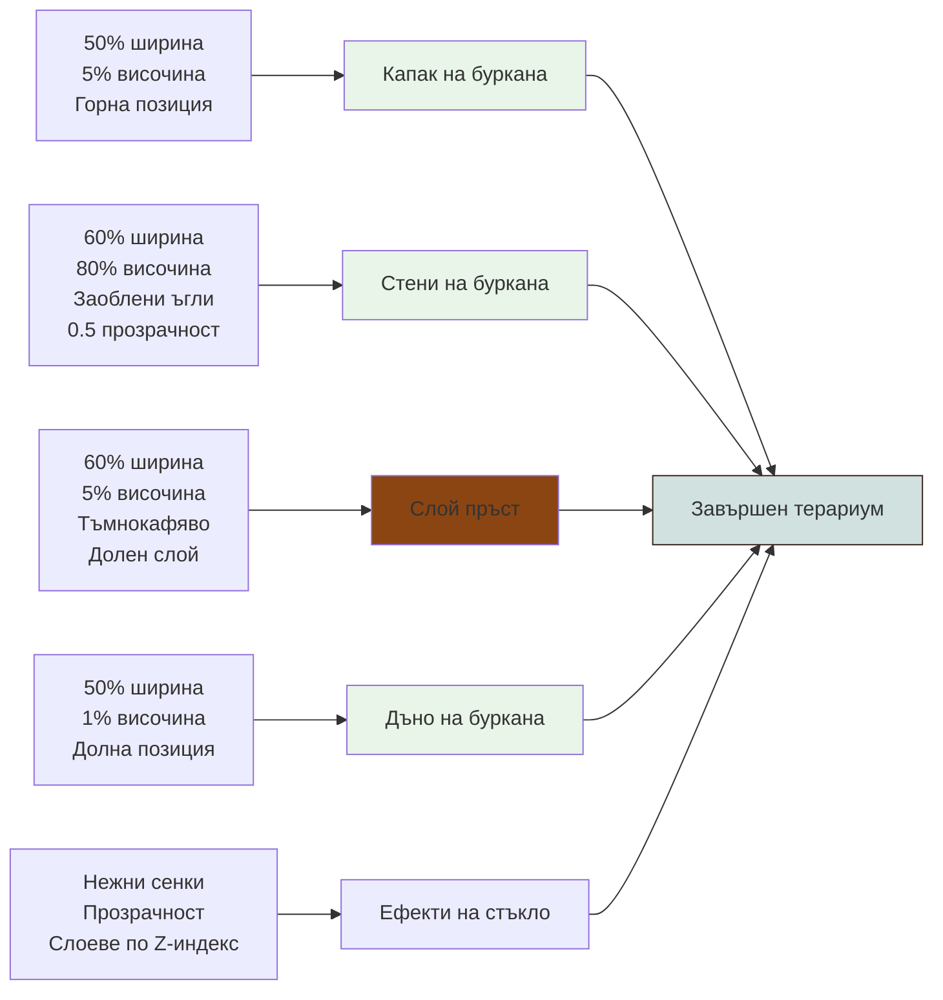
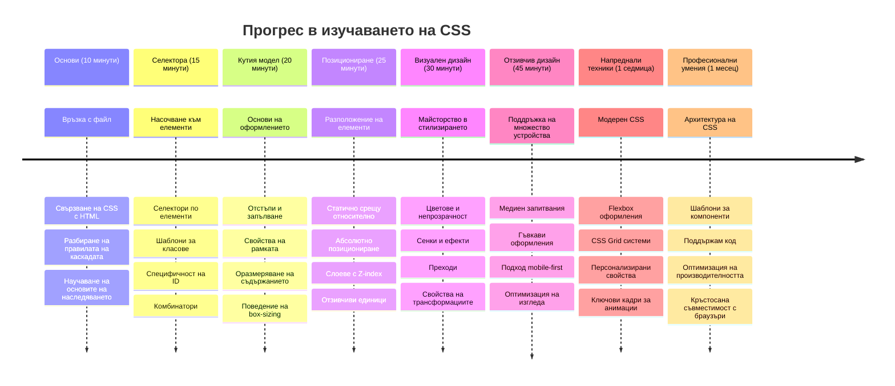

<!--
CO_OP_TRANSLATOR_METADATA:
{
  "original_hash": "e39f3a4e3bcccf94639e3af1248f8a4d",
  "translation_date": "2026-01-07T07:19:20+00:00",
  "source_file": "3-terrarium/2-intro-to-css/README.md",
  "language_code": "bg"
}
-->
# Terrarium Project Част 2: Въведение в CSS



> Скетчноут от [Tomomi Imura](https://twitter.com/girlie_mac)

Спомняте ли си как вашият HTML терариум изглеждаше доста основен? CSS е мястото, където преобразяваме тази обикновена структура във визуално привлекателна.

Ако HTML е като построяването на рамката на къща, тогава CSS е всичко, което я кара да се чувства като дом - цветовете на боята, подредбата на мебелите, осветлението и как стаите се свързват една с друга. Помислете как Дворецът във Версай е започнал като проста ловна хижа, но внимателното внимание към украсата и подредбата го превърна в една от най-величествените сгради в света.

Днес ще преобразим вашия терариум от функционален в изискан. Ще научите как точно да позиционирате елементите, да направите оформленията адаптивни към различни размери на екрана и да създадете визуалната привлекателност, която прави уебсайтовете ангажиращи.

Към края на този урок ще видите как стратегическото стилизиране с CSS може драматично да подобри вашия проект. Нека добавим стил към вашия терариум.


## Предлекционен тест

[Предлекционен тест](https://ff-quizzes.netlify.app/web/quiz/17)

## Започване с CSS

Често CSS се възприема само като „правене на нещата красиви“, но той служи на много по-широка цел. CSS е като режисьор на филм – вие контролирате не само как изглежда всичко, но и как се движи, реагира на взаимодействия и се адаптира към различни ситуации.

Модерният CSS е изключително способен. Можете да пишете код, който автоматично адаптира оформленията за телефони, таблети и настолни компютри. Можете да създавате плавни анимации, които насочват вниманието на потребителите там, където е нужно. Резултатите могат да бъдат доста впечатляващи, когато всичко работи заедно.

> 💡 **Профи съвет**: CSS постоянно се развива с нови функции и възможности. Винаги проверявайте [CanIUse.com](https://caniuse.com), за да потвърдите поддръжката в браузърите за новите CSS функции, преди да ги използвате в продукционни проекти.

**Ето какво ще постигнем в този урок:**
- **Създаване** на пълен визуален дизайн за вашия терариум, използвайки модерни CSS техники
- **Изследване** на основни концепции като каскада, наследяване и CSS селектори
- **Прилагане** на адаптивни стратегии за позициониране и оформление
- **Изграждане** на контейнера на терариума чрез CSS форми и стилизиране

### Предварителни изисквания

Трябва да сте създали HTML структурата за вашия терариум от предишния урок и да я имате готова за стилизиране.

> 📺 **Видео ресурс**: Вижте този полезен видео урок  
>  
> [](https://www.youtube.com/watch?v=6yIdOIV9p1I)

### Настройване на вашия CSS файл

Преди да започнем със стилизирането, трябва да свържем CSS с нашия HTML. Тази връзка казва на браузъра къде да намери инструкциите за стилизиране на нашия терариум.

В папката на вашия терариум създайте нов файл на име `style.css`, след което го свържете в секцията `<head>` на вашия HTML документ:

```html
<link rel="stylesheet" href="./style.css" />
```

**Какво прави този код:**
- **Създава** връзка между вашите HTML и CSS файлове
- **Казва** на браузъра да зареди и приложи стиловете от `style.css`
- **Използва** атрибута `rel="stylesheet"`, който указва, че това е CSS файл
- **Реферира** файлa път с `href="./style.css"`

## Разбиране на CSS каскадата

Някога чудили ли сте се защо CSS се нарича „Cascading“ Style Sheets (Каскадни стилове)? Стиловете се спускат като водопад и понякога си противоречат.

Помислете как работят военните командни структури – генералска заповед може да казва „всички войски да носят зелено“, но конкретна заповед към вашия отряд може да казва „за церемонията носете официален син“. По-конкретната инструкция има предимство. CSS следва подобна логика и разбирането на тази иерархия прави отстраняването на грешки много по-лесно.

### Експериментиране с приоритета на каскадата

Нека видим каскадата в действие, като създадем стилов конфликт. Първо, добавете инлайн стил към вашия `<h1>` таг:

```html
<h1 style="color: red">My Terrarium</h1>
```

**Какво прави този код:**
- **Прилага** червен цвят директно на елемента `<h1>` чрез инлайн стил
- **Използва** атрибута `style`, за да вгради CSS директно в HTML
- **Създава** стилово правило с най-висок приоритет за този конкретен елемент

След това добавете това правило във вашия файл `style.css`:

```css
h1 {
  color: blue;
}
```

**В горния случай сме:**
- **Дефинирали** CSS правило, което таргетира всички `<h1>` елементи
- **Зададени** синия цвят на текста чрез външен стилов файл
- **Създадено** правило с по-нисък приоритет в сравнение с инлайн стиловете

✅ **Проверка на знанията**: Кой цвят се показва във вашето уеб приложение? Защо този цвят печели? Можете ли да измислите ситуации, когато бихте искали да презапишете стилове?


> 💡 **Ред на приоритет в CSS (от най-висок към най-нисък):**  
> 1. **Инлайн стилове** (атрибут style)  
> 2. **ID-та** (#myId)  
> 3. **Класове** (.myClass) и атрибути  
> 4. **Селектори на елементи** (h1, div, p)  
> 5. **Браузърни стойности по подразбиране**

## CSS наследяване в действие

CSS наследяването работи като генетиката – елементите наследяват определени свойства от родителските елементи. Ако зададете шрифт на `body`, целият текст вътре автоматично използва същия шрифт. Това е подобно на това как отличителната челюст на Хабсбургското семейство се явява в поколения, без да е специфично посочено за всеки отделен.

Обаче, не всичко се наследява. Текстови стилове като шрифтове и цветове се наследяват, но свойства на оформление като отстояния (margins) и рамки не се наследяват. Подобно на това, че децата могат да наследят физически черти, но не и модните предпочитания на родителите си.

### Наблюдаване на наследяването на шрифтове

Нека видим наследяването в действие, като зададем шрифт на елемента `<body>`:

```css
body {
  font-family: 'Segoe UI', Tahoma, Geneva, Verdana, sans-serif;
}
```

**Обяснение на случващото се тук:**
- **Задава** шрифтово семейство за цялата страница чрез таргетиране на `<body>` елемента
- **Използва** стек от шрифтове с резервни опции за по-добра съвместимост с браузърите
- **Прилага** модерни системни шрифтове, които изглеждат добре на различни операционни системи
- **Осигурява**, че всички вложени елементи наследяват този шрифт, освен ако не е изрично презаписан

Отворете инструменти за разработчици на вашия браузър (F12), отидете на раздел Elements и инспектирайте вашия `<h1>` елемент. Ще видите, че той наследява шрифтa от body:


✅ **Време за експеримент**: Опитайте да зададете други наследяеми свойства на `<body>`, като `color`, `line-height` или `text-align`. Какво се случва с вашия заглавен елемент и други елементи?

> 📝 **Наследяеми свойства са**: `color`, `font-family`, `font-size`, `line-height`, `text-align`, `visibility`  
>  
> **Наследяеми свойства, които не са**: `margin`, `padding`, `border`, `width`, `height`, `position`

### 🔄 **Педагогическа проверка**  
**Разбиране на основите на CSS**: Преди да преминете към селектори, уверете се, че можете:  
- ✅ Да обясните разликата между каскада и наследяване  
- ✅ Да предскажете кой стил ще победи при конфликт на специфичност  
- ✅ Да разпознаете кои свойства се наследяват от родителски елементи  
- ✅ Да свързвате CSS файлове към HTML правилно  

**Бърз тест**: Ако имате тези стилове, какъв цвят ще има `<h1>` в `<div class="special">`?  
```css
div { color: blue; }
.special { color: green; }
h1 { color: red; }
```
*Отговор: Червен (селектор на елемент директно таргетира h1)*

## Овладяване на CSS селекторите

CSS селекторите са вашият начин да таргетирате конкретни елементи за стилизиране. Те работят като даване на точни инструкции - вместо да казвате „къщата“, бихте казали „синята къща с червената врата на улица Мейпъл“.

CSS предоставя различни начини за избиране на елементи, а изборът на правилния селектор е като избора на правилния инструмент. Понякога трябва да стилизирате всички врати в квартала, а понякога само една конкретна врата.

### Селектори по елемент (таг)

Селекторите по елемент таргетират HTML елементи по тяхното име на таг. Те са идеални за задаване на базови стилове, които се прилагат широко из страницата:

```css
body {
  font-family: 'Segoe UI', Tahoma, Geneva, Verdana, sans-serif;
  margin: 0;
  padding: 0;
}

h1 {
  color: #3a241d;
  text-align: center;
  font-size: 2.5rem;
  margin-bottom: 1rem;
}
```

**Разбиране на тези стилове:**
- **Задава** последователна типография за цялата страница чрез селектора `body`
- **Премахва** браузърните отстояния и падащи стойности за по-добър контрол
- **Стилира** всички заглавни елементи с цвят, подравняване и разстояния
- **Използва** единици `rem` за мащабируем и достъпен размер на шрифта

Докато селекторите по елемент работят добре за общо стилизиране, ще ви трябват по-специфични селектори за стилизиране на отделни компоненти като растенията в терариума.

### Селектори по ID за уникални елементи

Селекторите по ID използват символа `#` и таргетират елементи с конкретни атрибути `id`. Тъй като ID-тата трябва да са уникални в една страница, те са перфектни за стилизиране на отделни, специални елементи като контейнерите за растенията вляво и вдясно.

Нека създадем стилизиране за страничните контейнери на терариума, където ще се намират растенията:

```css
#left-container {
  background-color: #f5f5f5;
  width: 15%;
  left: 0;
  top: 0;
  position: absolute;
  height: 100vh;
  padding: 1rem;
  box-sizing: border-box;
}

#right-container {
  background-color: #f5f5f5;
  width: 15%;
  right: 0;
  top: 0;
  position: absolute;
  height: 100vh;
  padding: 1rem;
  box-sizing: border-box;
}
```

**Какво постига този код:**
- **Позиционира** контейнерите в най-лявата и най-дясната част чрез абсолютна позиция
- **Използва** `vh` (височина на изгледа) единици за адаптивна височина според размера на екрана
- **Прилага** `box-sizing: border-box`, така че падингът да се включва в общата ширина
- **Премахва** ненужни `px` единици от стойности с нула за по-чист код
- **Задава** мек фон, който е по-приятен за окото от твърдо сивото

✅ **Предизвикателство за качество на кода**: Забелязвате ли, че този CSS нарушава принципа DRY (Don't Repeat Yourself)? Можете ли да го рефакторирате, използвайки както ID, така и клас?

**Подобрен подход:**
```html
<div id="left-container" class="container"></div>
<div id="right-container" class="container"></div>
```

```css
.container {
  background-color: #f5f5f5;
  width: 15%;
  top: 0;
  position: absolute;
  height: 100vh;
  padding: 1rem;
  box-sizing: border-box;
}

#left-container {
  left: 0;
}

#right-container {
  right: 0;
}
```

### Класови селектори за многократно използване на стилове

Класовите селектори използват символа `.` и са идеални, когато искате да приложите същите стилове към множество елементи. За разлика от ID-тата, класовете могат да се използват многократно в целия HTML, което ги прави подходящи за консистентни стилови шаблони.

В нашия терариум всяко растение се нуждае от подобно стилизиране, но също така и от индивидуално позициониране. Ще използваме комбинация от класове за споделени стилове и ID-та за уникално позициониране.

**Ето HTML структурата за всяко растение:**
```html
<div class="plant-holder">
  
</div>
```

**Обяснение на ключовите елементи:**
- **Използва** `class="plant-holder"` за последователно стилизиране на контейнера за всички растения
- **Прилaга** `class="plant"` за споделен стил и поведение на изображенията
- **Включва** уникален `id="plant1"` за индивидуално позициониране и JavaScript взаимодействие
- **Осигурява** описателен alt текст за достъпност с екранни четци

Сега добавете тези стилове към вашия файл `style.css`:

```css
.plant-holder {
  position: relative;
  height: 13%;
  left: -0.6rem;
}

.plant {
  position: absolute;
  max-width: 150%;
  max-height: 150%;
  z-index: 2;
  transition: transform 0.3s ease;
}

.plant:hover {
  transform: scale(1.05);
}
```

**Разбивка на тези стилове:**
- **Създава** относително позициониране за контейнера на растението, за да осигури контекст на позициониране
- **Задава** височина на всеки контейнер 13%, така че всички растения да се побират вертикално без скролиране
- **Изместване** на контейнерите леко наляво за по-добро центриране на растенията във вътрешността
- **Позволява** растенията да се мащабират адаптивно чрез свойства `max-width` и `max-height`
- **Използва** `z-index`, за да постави растенията над други елементи в терариума
- **Добавя** мек ефект при задържане с мишката чрез CSS преходи за по-добро взаимодействие с потребителя

✅ **Критично мислене**: Защо са необходими и двете селектори `.plant-holder` и `.plant`? Какво би се случило, ако използваме само един?

> 💡 **Дизайнерски модел**: Контейнерът (`.plant-holder`) контролира оформлението и позиционирането, докато съдържанието (`.plant`) контролира външния вид и мащабирането. Тази разделеност прави кода по-поддържащ и гъвкав.

## Разбиране на позиционирането в CSS

Позиционирането в CSS е като режисьор на театрална постановка – ви казва къде стои всеки актьор и как се движи на сцената. Някои актьори следват стандартното разположение, докато други изискват специфично позициониране за драматичен ефект.

След като разберете позиционирането, много предизвикателства при оформлението стават управляеми. Искате ли навигационна лента, която остава на върха, когато потребителите скролват? Позиционирането се грижи за това. Искате ли подсказка, която се показва на конкретно място? Това също е позициониране.

### Петте стойности на позициониране


| Стойност на позициониране | Поведение | Приложение |
|---------------------------|-----------|------------|
| `static` | По подразбиране, игнорира top/left/right/bottom | Нормално оформление на документа |
| `relative` | Позиционира се спрямо нормалната си позиция | Малки корекции, създаване на контекст за позициониране |
| `absolute` | Позиционира се спрямо най-близкия позициониран предшественик | Прецизно позициониране, припокривания |
| `fixed` | Позиционира се спрямо изгледа на прозореца | Навигационни ленти, плаващи елементи |
| `sticky` | Превключва между relative и fixed според скролиране | Заглавия, които се зацепват при скролиране |

### Позициониране в нашия терариум

Нашият терариум използва стратегическа комбинация от типове позициониране, за да постигне желаното оформление:

```css
/* Container positioning */
.container {
  position: absolute; /* Removes from normal flow */
  /* ... other styles ... */
}

/* Plant holder positioning */
.plant-holder {
  position: relative; /* Creates positioning context */
  /* ... other styles ... */
}

/* Plant positioning */
.plant {
  position: absolute; /* Allows precise placement within holder */
  /* ... other styles ... */
}
```

**Разбиране на стратегията за позициониране:**
- **Абсолютните контейнери** се изваждат от нормалния поток и се закрепват към краищата на екрана
- **Относителните "plant-holder"** създават контекст за позициониране, като остават в потока на документа
- **Абсолютните "plant"** могат да се позиционират прецизно в рамките на относителните контейнери
- **Тази комбинация** позволява растенията да се нареждат вертикално и да се позиционират индивидуално

> 🎯 **Защо е важно:** Елементите `plant` се нуждаят от абсолютна позиция, за да станат плъзгащи се в следващия урок. Абсолютното позициониране ги изважда от нормалния поток, което позволява интерактивност за влачене и пускане.

✅ **Време за експеримент:** Опитайте да променяте стойностите на позициониране и наблюдавайте резултатите:  
- Какво се случва, ако промените `.container` от `absolute` на `relative`?
- Как се променя оформлението, ако `.plant-holder` използва `absolute` вместо `relative`?
- Какво се случва, когато превключите `.plant` на `relative` позициониране?

### 🔄 **Педагогическа проверка**
**Майсторство с позициониране в CSS**: Направете пауза, за да проверите разбирането си:
- ✅ Можете ли да обясните защо растенията се нуждаят от абсолюно позициониране за drag-and-drop?
- ✅ Разбирате ли как относителните контейнери създават контекст за позициониране?
- ✅ Защо страничните контейнери използват абсолюно позициониране?
- ✅ Какво би станало, ако изобщо премахнете декларациите за позициониране?

**Връзка с реалния свят**: Помислете как позиционирането в CSS отразява реалния свят:
- **Статично**: Книги на рафт (естествен ред)
- **Относително**: Преместване на книга леко, но запазване на мястото й
- **Абсолютно**: Поставяне на книгоразделител на точна страница
- **Фиксирано**: Лепяща бележка, която остава видима докато листите страниците

## Създаване на терариум с CSS

Сега ще построим стъклен буркан, използвайки само CSS - без нужда от изображения или графичен софтуер.

Създаването на реалистично изглеждащо стъкло, сенки и дълбочина с позициониране и прозрачност демонстрира визуалните възможности на CSS. Тази техника отразява как архитектите от движение Баухаус са използвали прости геометрични фигури за създаване на сложни, красиви конструкции. След като разберете тези принципи, ще разпознаете CSS техниките зад много уеб дизайни.


### Създаване на компонентите на стъкления буркан

Нека изградим буркана на терариума на части. Всяка част използва абсолюно позициониране и размери, базирани на проценти за отзивчив дизайн:

```css
.jar-walls {
  height: 80%;
  width: 60%;
  background: #d1e1df;
  border-radius: 1rem;
  position: absolute;
  bottom: 0.5%;
  left: 20%;
  opacity: 0.5;
  z-index: 1;
  box-shadow: inset 0 0 2rem rgba(0, 0, 0, 0.1);
}

.jar-top {
  width: 50%;
  height: 5%;
  background: #d1e1df;
  position: absolute;
  bottom: 80.5%;
  left: 25%;
  opacity: 0.7;
  z-index: 1;
  border-radius: 0.5rem 0.5rem 0 0;
}

.jar-bottom {
  width: 50%;
  height: 1%;
  background: #d1e1df;
  position: absolute;
  bottom: 0;
  left: 25%;
  opacity: 0.7;
  border-radius: 0 0 0.5rem 0.5rem;
}

.dirt {
  width: 60%;
  height: 5%;
  background: #3a241d;
  position: absolute;
  border-radius: 0 0 1rem 1rem;
  bottom: 1%;
  left: 20%;
  opacity: 0.7;
  z-index: -1;
}
```

**Разбиране на конструкцията на терариума:**
- **Използва** размери в проценти за отзивчиво мащабиране на всички размери на екрана
- **Позиционира** елементите абсолютно, за да ги подредим и подравним точно
- **Прилaга** различни стойности на прозрачност за създаване на ефект на стъкленост
- **Изпълнява** слоеве чрез `z-index`, така че растенията да се появяват вътре в буркана
- **Добавя** леки сенки и фина граница с радиус за по-реалистичен вид

### Отзивчив дизайн с проценти

Забележете как всички размери използват проценти вместо фиксирани пиксели:

**Защо е важно:**
- **Гарантира**, че терариумът се мащабира пропорционално на всеки размер екран
- **Поддържа** визуалните връзки между компонентите на буркана
- **Осигурява** последователно изживяване от мобилни телефони до големи десктоп екрани
- **Позволява** дизайнът да се адаптира без да нарушава визуалния изглед

### CSS единици в действие

Използваме единици `rem` за радиуса на границата, които се мащабират спрямо основния размер на шрифта. Това създава по-достъпни дизайни, които уважават настройките на шрифтовете на потребителя. Прочетете повече за [относителните CSS единици](https://www.w3.org/TR/css-values-3/#font-relative-lengths) в официалната спецификация.

✅ **Визуален експеримент**: Опитайте да промените тези стойности и наблюдавайте ефекта:
- Променете прозрачността на буркана от 0.5 на 0.8 – как това влияе на вида на стъклото?
- Регулирайте цвета на пръстта от `#3a241d` на `#8B4513` – какъв визуален ефект има това?
- Променете `z-index` на пръстта на 2 – какво става с подреждането на слоевете?

### 🔄 **Педагогическа проверка**
**Разбиране на визуален дизайн с CSS**: Потвърдете усвояването си на визуалния CSS:
- ✅ Как размерите в проценти създават отзивчив дизайн?
- ✅ Защо прозрачността създава ефекта на стъклена прозрачност?
- ✅ Каква роля играе z-index в слоевете на елементите?
- ✅ Как радиусът на границата формира формата на буркана?

**Принцип на дизайна**: Забележете как изграждаме сложни визуални ефекти от прости форми:
1. **Правоъгълници** → **Заоблени правоъгълници** → **Компоненти на буркана**
2. **Плоски цветове** → **Прозрачност** → **Стъклен ефект**
3. **Отделни елементи** → **Слоев състав** → **3D вид**

---

## Предизвикателство GitHub Copilot Agent 🚀

Използвайте режим Agent, за да завършите следното предизвикателство:

**Описание:** Създайте CSS анимация, която кара растенията в терариума леко да се люлеят напред-назад, симулирайки лек бриз. Това ще ви помогне да практикувате CSS анимации, трансформации и ключови кадри, като същевременно подобрите визуалната привлекателност на терариума.

**Задача:** Добавете CSS ключови кадри, за да накарате растенията в терариума да се люлеят леко отстрани на страна. Създайте анимация на люлеене, която завърта всяко растение леко (2-3 градуса) наляво и надясно с продължителност 3-4 секунди, и я приложете към класа `.plant`. Уверете се, че анимацията се повтаря безкрайно и има функция за плавност за естествено движение.

Научете повече за [режим agent](https://code.visualstudio.com/blogs/2025/02/24/introducing-copilot-agent-mode) тук.

## 🚀 Предизвикателство: Добавяне на отразявания върху стъклото

Готови ли сте да подобрите терариума си с реалистични отражения върху стъклото? Тази техника ще добави дълбочина и реализъм на дизайна.

Ще създадете нежни отблясъци, които симулират как светлината се отразява от стъклени повърхности. Този подход е подобен на техниката на ренесансови художници като Ян ван Ейк, които използвали светлина и отражения, за да направят изрисуваното стъкло триизмерно. Ето какво трябва да постигнете:


**Вашата задача:**
- **Създайте** нежни бели или светли овални форми за отражения върху стъклото
- **Позиционирайте** ги стратегически в лявата част на буркана
- **Приложете** подходяща прозрачност и размазване за реалистично отражение на светлината
- **Използвайте** `border-radius` за създаване на органични, мехурчести форми
- **Експериментирайте** с градиенти или сянки (box-shadow) за по-голям реализъм

## Квиз след лекцията

[Квиз след лекцията](https://ff-quizzes.netlify.app/web/quiz/18)

## Разширете CSS знанията си

CSS може първоначално да изглежда сложно, но разбирането на тези основни концепции дава стабилна основа за по-напреднали техники.

**Следващи области за учене в CSS:**
- **Flexbox** - опростява подравняването и разпределението на елементите
- **CSS Grid** - предоставя мощни инструменти за създаване на сложни оформления
- **CSS променливи** - намалява повтарянето и подобрява поддръжката
- **Отзивчив дизайн** - гарантира, че сайтовете работят добре на различни размери екрани

### Интерактивни учебни ресурси

Практикувайте тези концепции с любопитни, интерактивни игри:
- 🐸 [Flexbox Froggy](https://flexboxfroggy.com/) - усвоете Flexbox чрез забавни предизвикателства
- 🌱 [Grid Garden](https://codepip.com/games/grid-garden/) - научете CSS Grid, като отглеждате виртуални моркови
- 🎯 [CSS Battle](https://cssbattle.dev/) - тествайте CSS уменията си с кодови предизвикателства

### Допълнително обучение

За изчерпателни CSS основи, завършете този модул на Microsoft Learn: [Стил на HTML приложение с CSS](https://docs.microsoft.com/learn/modules/build-simple-website/4-css-basics/?WT.mc_id=academic-77807-sagibbon)

### ⚡ **Какво можете да направите следващите 5 минути**
- [ ] Отворете DevTools и инспектирайте CSS стилове на който и да е сайт чрез панела Elements
- [ ] Създайте прост CSS файл и го свържете с HTML страница
- [ ] Опитайте да промените цветове чрез различни методи: hex, RGB, именовани цветове
- [ ] Практикувайте box model, като добавите padding и margin към div

### 🎯 **Какво можете да постигнете този час**
- [ ] Завършете квиза след урока и прегледайте CSS основите
- [ ] Стиловайте HTML страницата с шрифтове, цветове и разстояния
- [ ] Създайте прост layout с flexbox или grid
- [ ] Експериментирайте с CSS преходи за плавни ефекти
- [ ] Практикувайте отзивчив дизайн с медиен заявки

### 📅 **Вашето седмично CSS приключение**
- [ ] Завършете задачата за стилизиране на терариума с творчески подход
- [ ] Усъвършенствайте CSS Grid като изградите фото галерия
- [ ] Научете CSS анимации, за да вдъхнете живот на дизайните си
- [ ] Изследвайте CSS препроцесори като Sass или Less
- [ ] Изучавайте принципи на дизайна и ги прилагайте в CSS
- [ ] Анализирайте и пресъздавайте интересни дизайни от онлайн

### 🌟 **Вашето месечно майсторство в дизайна**
- [ ] Изградете пълна система за отзивчив уеб дизайн
- [ ] Научете CSS-in-JS или utility-first фреймуъркове като Tailwind
- [ ] Приносете към open source проекти с подобрения в CSS
- [ ] Усъвършенствайте напреднали CSS концепции като персонализирани свойства и containment
- [ ] Създайте библиотеки с модулен CSS и преизползваеми компоненти
- [ ] Наставлявайте други в изучаването на CSS и споделяйте дизайнерски знания

## 🎯 Вашата времева линия на майсторство в CSS


### 🛠️ Обобщение на CSS арсенала ви

След като завършихте този урок, вече притежавате:
- **Разбиране на каскадата**: Как стиловете наследяват и презаписват един друг
- **Майсторство на селекторите**: Точно таргетиране с елементи, класове и ID-та
- **Умения за позициониране**: Стратегическо поставяне и слоеве на елементите
- **Визуален дизайн**: Създаване на стъклени ефекти, сенки и прозрачност
- **Отзивчиви техники**: Оформления на базата на проценти, които се адаптират към всеки екран
- **Организация на кода**: Чист и поддържан CSS
- **Модерни практики**: Използване на относителни единици и достъпни дизайнерски модели

**Следващи стъпки**: Вашият терариум вече има структура (HTML) и стил (CSS). Последният урок ще добави интерактивност с JavaScript!

## Задача

[CSS Рефакториране](assignment.md)

---

<!-- CO-OP TRANSLATOR DISCLAIMER START -->
**Отказ от отговорност**:
Този документ е преведен с помощта на AI преводаческия сервис [Co-op Translator](https://github.com/Azure/co-op-translator). Въпреки че се стремим към точност, моля, имайте предвид, че автоматизираните преводи могат да съдържат грешки или неточности. Оригиналният документ на неговия роден език трябва да се счита за авторитетен източник. За критична информация се препоръчва професионален превод от човек. Не носим отговорност за никакви недоразумения или погрешни тълкувания, произтичащи от използването на този превод.
<!-- CO-OP TRANSLATOR DISCLAIMER END -->