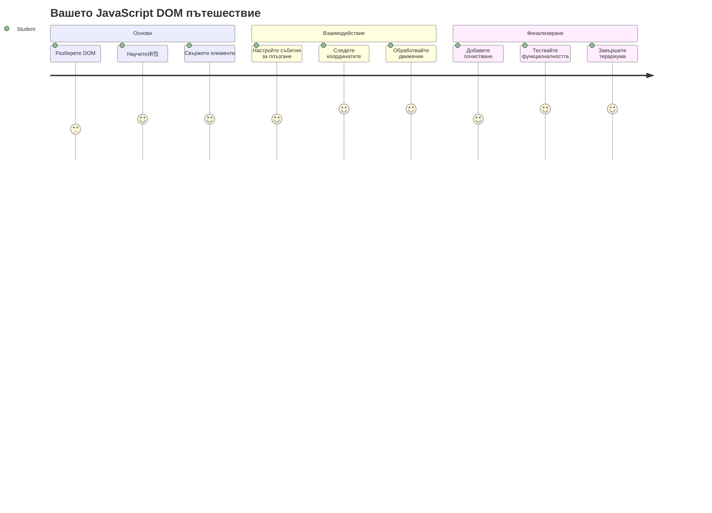
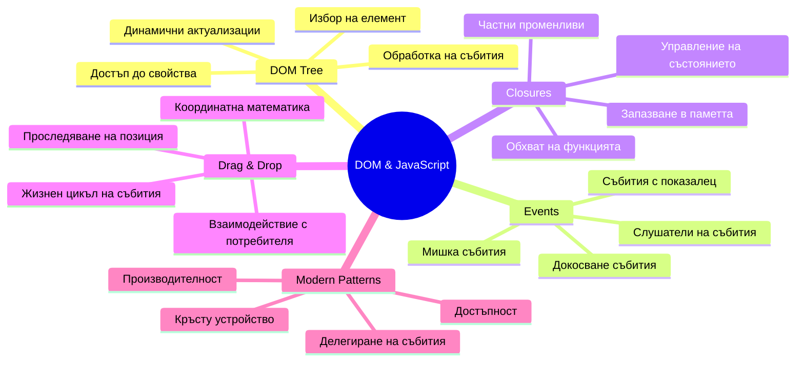
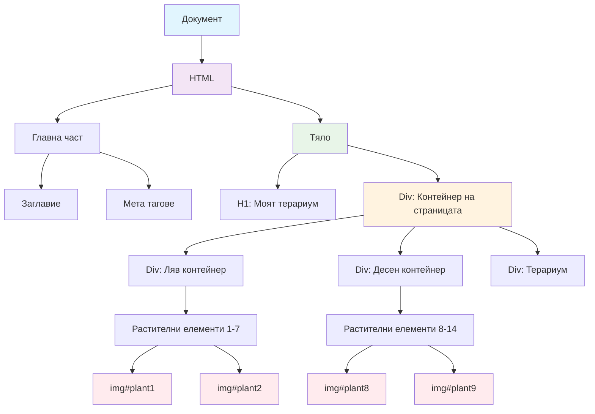
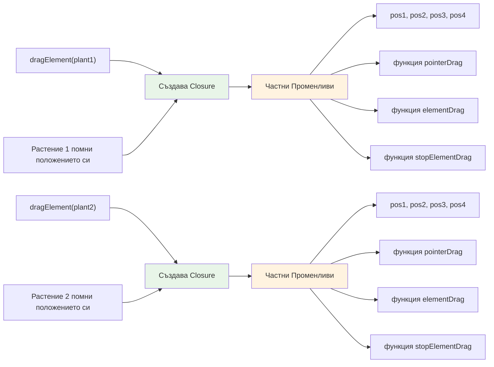
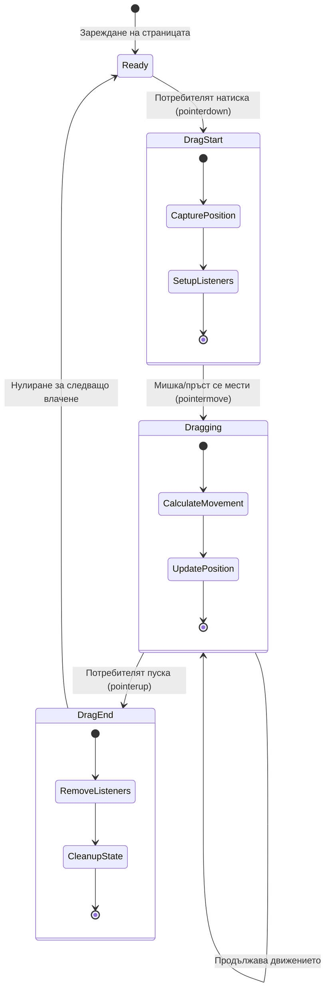
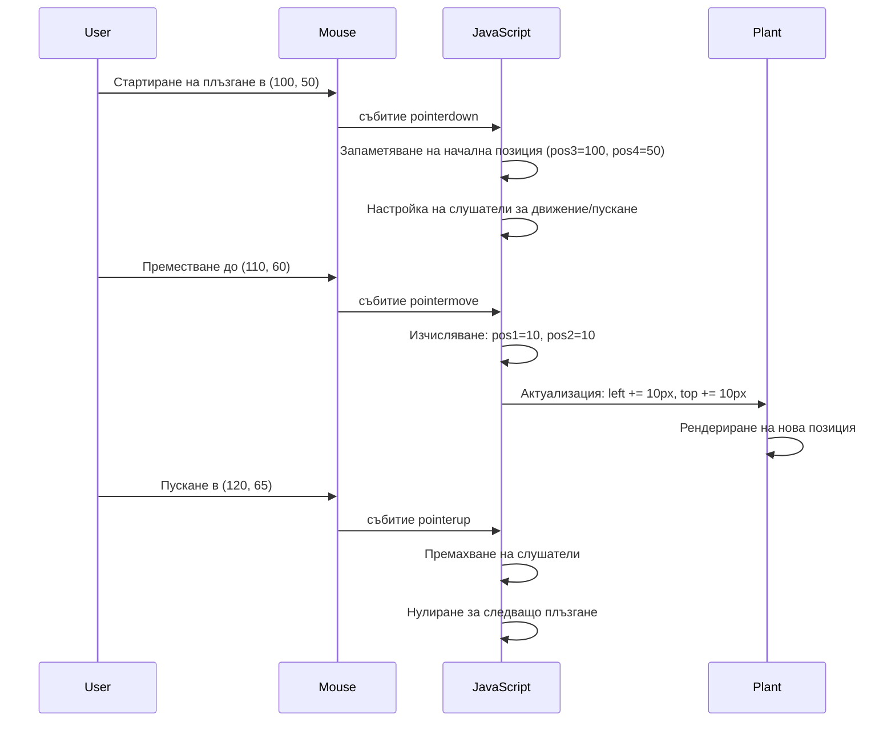
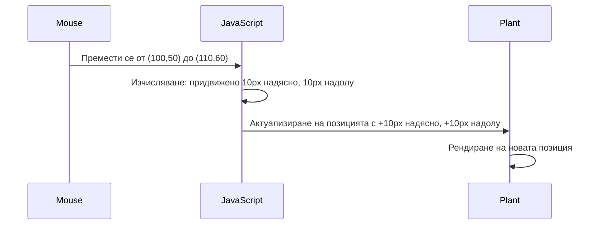
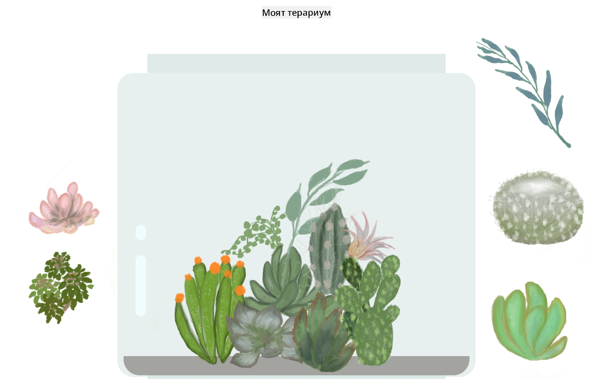
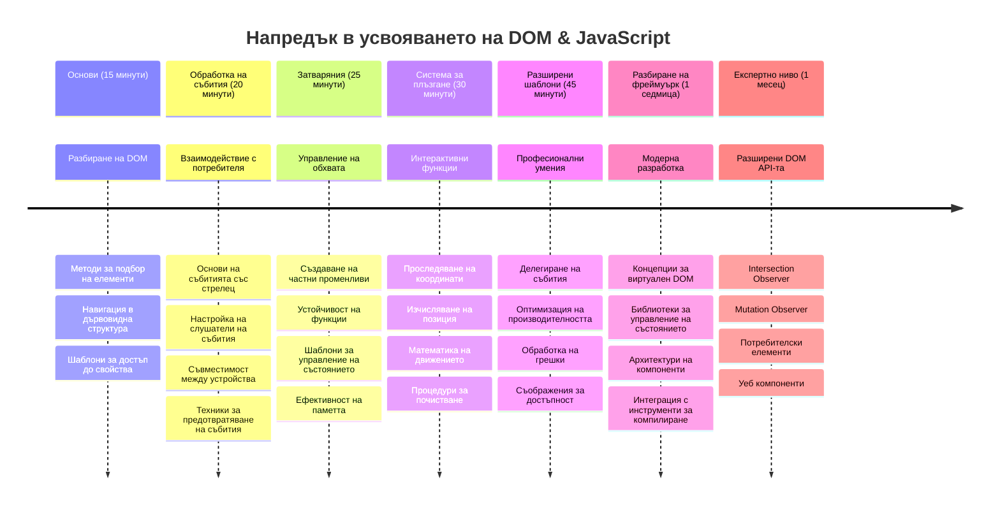

<!--
CO_OP_TRANSLATOR_METADATA:
{
  "original_hash": "973e48ad87d67bf5bb819746c9f8e302",
  "translation_date": "2026-01-07T07:16:39+00:00",
  "source_file": "3-terrarium/3-intro-to-DOM-and-closures/README.md",
  "language_code": "bg"
}
-->
# Terrarium Project Част 3: Манипулация на DOM и JavaScript замиквания



> Скетчноут от [Tomomi Imura](https://twitter.com/girlie_mac)

Добре дошли в един от най-ангажиращите аспекти на уеб разработката - правенето на нещата интерактивни! Document Object Model (DOM) е като мост между вашия HTML и JavaScript, и днес ще го използваме, за да вдъхнем живот на вашия терариум. Когато Тим Бернърс-Лий създава първия уеб браузър, той си представя уеб, където документите могат да бъдат динамични и интерактивни - DOM прави тази визия възможна.

Ще разгледаме и JavaScript замиквания, които може да звучат страховито в началото. Мислете за замикванията като създаване на "джобове за памет", където вашите функции могат да запомнят важна информация. Това е като всяко растение във вашия терариум да има свой собствен запис за позицията си. В края на този урок ще разберете колко естествени и полезни са те.

Ето какво ще създадем: терариум, в който потребителите могат да плъзгат и пускат растения навсякъде където искат. Ще научите техниките за манипулация на DOM, които захранват всичко - от плъзгане и пускане на файлове до интерактивни игри. Нека оживим вашия терариум.


## Предвариелен тест

[Предвариелен тест](https://ff-quizzes.netlify.app/web/quiz/19)

## Разбиране на DOM: Вратата ви към интерактивните уеб страници

Document Object Model (DOM) е начинът, по който JavaScript комуникира с вашите HTML елементи. Когато браузърът зареди HTML страница, той създава структурирано представяне на тази страница в паметта - това е DOM. Мислете за него като за родословно дърво, където всеки HTML елемент е член на семейството, до който JavaScript може да има достъп, да го променя или пренарежда.

Манипулацията на DOM превръща статични страници в интерактивни уебсайтове. Всеки път когато видите бутон да променя цвят при задържане на мишката, съдържание да се обновява без презареждане на страницата или елементи, които можете да плъзгате, това е DOM манипулация в действие.




> Представяне на DOM и HTML маркировката, която го реферира. От [Olfa Nasraoui](https://www.researchgate.net/publication/221417012_Profile-Based_Focused_Crawler_for_Social_Media-Sharing_Websites)

**Ето какво прави DOM мощен:**
- **Осигурява** структурирана възможност за достъп до всеки елемент на вашата страница
- **Позволява** динамични обновявания на съдържанието без презареждане
- **Позволява** отговор в реално време на взаимодействия като кликвания и плъзгане
- **Създава** основата за съвременни интерактивни уеб приложения

## JavaScript замиквания: Създаване на организиран, мощен код

[JavaScript замикване](https://developer.mozilla.org/docs/Web/JavaScript/Closures) е като да дадете на функция собствено частно работно пространство с постоянна памет. Помислете как Darwin-овите враноглави птици на Галапагоските острови са развили специализирани човки според средата си - замикванията работят по същия начин, създавайки специализирани функции, които "помнят" своя конкретен контекст дори след като родителската им функция приключи.

В нашия терариум замикванията помагат на всяко растение да помни собствената си позиция независимо. Този модел се появява във всички професионални JavaScript разработки, правейки го важна концепция за разбиране.


> 💡 **Разбиране на замикванията**: Замикванията са важна тема в JavaScript, и много разработчици ги използват години преди да разберат напълно всички теоретични аспекти. Днес се фокусираме върху практическото приложение - ще видите как замикванията естествено изникват докато изграждаме нашите интерактивни функции. Разбирането ще се развива докато виждате как те решават реални проблеми.


> Представяне на DOM и HTML маркировката, която го реферира. От [Olfa Nasraoui](https://www.researchgate.net/publication/221417012_Profile-Based_Focused_Crawler_for_Social_Media-Sharing_Websites)

В този урок ще завършим нашия интерактивен терариум проект, като създадем JavaScript, който ще позволи на потребителя да манипулира растенията на страницата.

## Преди да започнем: Подготовка за успех

Ще ви трябват HTML и CSS файловете от предишните уроци за терариума - предстои да направим този статичен дизайн интерактивен. Ако се присъединявате за първи път, първо преминаването през тези уроци ще ви предостави важен контекст.

Ето какво ще изградим:
- **Плавно плъзгане и пускане** за всички растения в терариума
- **Проследяване на координати**, за да помнят растенията позициите си
- **Пълно интерактивно интерфейс** с помощта на чист JavaScript
- **Чист, организиран код** използващ шаблони за замиквания

## Настройка на вашия JavaScript файл

Нека създадем JavaScript файла, който ще направи вашия терариум интерактивен.

**Стъпка 1: Създайте скриптовия файл**

В папката на терариума си създайте нов файл, наречен `script.js`.

**Стъпка 2: Свържете JavaScript с вашия HTML**

Добавете тази скрипт таг в секцията `<head>` на вашия `index.html` файл:

```html
<script src="./script.js" defer></script>
```

**Защо атрибутът `defer` е важен:**
- **Гарантира** че JavaScript чакa докато целият HTML е зареден
- **Предпазва** от грешки, когато JavaScript търси елементи, които все още не са заредени
- **Гарантира** че всички растителни елементи са налични за взаимодействие
- **Осигурява** по-добра производителност в сравнение с поставяне на скриптове в края на страницата

> ⚠️ **Важно**: Атрибутът `defer` предотвратява типични проблеми с времето. Без него, JavaScript може да се опита да достъпи HTML елементи преди да са заредени, водейки до грешки.

---

## Свързване на JavaScript с HTML елементите

Преди да направим елементите за плъзгане, JavaScript трябва да ги намери в DOM. Мислете за това като за библиотечна каталогизация - когато имате каталожния номер, можете да намерите точно книгата, която ви трябва, и да достъпите целия й съдържание.

Ще използваме метода `document.getElementById()`, за да направим тези връзки. Това е като точна система за подреждане - подавате ID, и тя намира точно елемента, който ви трябва в HTML.

### Активиране на функционалност за плъзгане за всички растения

Добавете този код във файла си `script.js`:

```javascript
// Активиране на функцията за плъзгане за всички 14 растения
dragElement(document.getElementById('plant1'));
dragElement(document.getElementById('plant2'));
dragElement(document.getElementById('plant3'));
dragElement(document.getElementById('plant4'));
dragElement(document.getElementById('plant5'));
dragElement(document.getElementById('plant6'));
dragElement(document.getElementById('plant7'));
dragElement(document.getElementById('plant8'));
dragElement(document.getElementById('plant9'));
dragElement(document.getElementById('plant10'));
dragElement(document.getElementById('plant11'));
dragElement(document.getElementById('plant12'));
dragElement(document.getElementById('plant13'));
dragElement(document.getElementById('plant14'));
```

**Ето какво постига този код:**
- **Намира** всеки растителен елемент в DOM чрез уникалния му ID
- **Вземa** JavaScript препратка към всеки HTML елемент
- **Подава** всеки елемент на функция `dragElement` (която ще създадем след това)
- **Подготвя** всяко растение за взаимодействие с плъзгане и пускане
- **Свързва** вашата HTML структура с JavaScript функционалност

> 🎯 **Защо използваме ID, а не класове?** ID-та осигуряват уникални идентификатори за конкретни елементи, докато CSS класове са предназначени за стилизиране на групи елементи. Когато JavaScript трябва да манипулира отделни елементи, ID-тата дават необходимата прецизност и ефективност.

> 💡 **Профи съвет**: Забележете, че извикваме `dragElement()` за всяко растение поотделно. Този подход гарантира, че всяко растение получава собствено независимо поведение за плъзгане, което е съществено за гладко потребителско взаимодействие.

### 🔄 **Педагогическа проверка**
**Разбиране на връзката с DOM**: Преди да преминете към функционалността за плъзгане, уверете се, че можете да:
- ✅ Обясните как `document.getElementById()` намира HTML елементи
- ✅ Разберете защо използваме уникални ID-та за всяко растение
- ✅ Опишете ролята на атрибута `defer` в скрипт таговете
- ✅ Разпознаете как JavaScript и HTML се свързват чрез DOM

**Бърз самотест**: Какво би се случило, ако два елемента имат еднакъв ID? Защо `getElementById()` връща само един елемент?
*Отговор: ID-тата трябва да са уникални; ако са дублирани, се връща само първият елемент*

---

## Създаване на замикване за dragElement

Сега ще създадем сърцето на нашата функционалност за плъзгане: замикване, което управлява поведението на плъзгане за всяко растение. Това замикване ще съдържа няколко вътрешни функции, които работят заедно, за да следят движението на мишката и да обновяват позициите на елементите.

Замикванията са перфектни за тази задача, защото ни позволяват да създадем "частни" променливи, които се запазват между извикванията на функции, давайки на всяко растение собствена независима система за проследяване на координати.

### Разбиране на замиквания чрез прост пример

Нека демонстрирам замиквания с прост пример, който илюстрира концепцията:

```javascript
function createCounter() {
    let count = 0; // Това е като частна променлива
    
    function increment() {
        count++; // Вътрешната функция помни външната променлива
        return count;
    }
    
    return increment; // Връщаме вътрешната функция
}

const myCounter = createCounter();
console.log(myCounter()); // 1
console.log(myCounter()); // 2
```

**Ето какво се случва в този шаблон на замикване:**
- **Създава** частна променлива `count`, която съществува само в това замикване
- **Вътрешната функция** може да достъпва и променя външната променлива (механизъм на замикването)
- **Когато връщаме** вътрешната функция, тя запазва връзката си с тази частна информация
- **Дори след** `createCounter()` да завърши изпълнението, `count` остава и помни стойността си

### Защо замикванията са идеални за функционалността за плъзгане

За нашия терариум всяко растение трябва да помни текущите си координати. Замикванията предоставят идеално решение:

**Ключови ползи за нашия проект:**
- **Поддържа** частни променливи за позиция за всяко растение независимо
- **Запазва** координатните данни между събития за плъзгане
- **Предпазва** от конфликти между променливи при различните плъзгащи се елементи
- **Създава** чиста, организирана структура на кода

> 🎯 **Цел на обучението**: Не е нужно да овладявате всеки аспект на замикванията веднага. Фокусирайте се върху това как помагат да организираме кода и да поддържаме състояние за функционалността за плъзгане.


### Създаване на функцията dragElement

Сега нека изградим основната функция, която ще управлява цялата логика на плъзгане. Добавете тази функция под декларациите за растителните елементи:

```javascript
function dragElement(terrariumElement) {
    // Инициализиране на променливи за проследяване на позицията
    let pos1 = 0,  // Предишна позиция на мишката по X
        pos2 = 0,  // Предишна позиция на мишката по Y
        pos3 = 0,  // Текуща позиция на мишката по X
        pos4 = 0;  // Текуща позиция на мишката по Y
    
    // Настройка на първоначалния слушател за събитие за плъзгане
    terrariumElement.onpointerdown = pointerDrag;
}
```

**Разбиране на системата за проследяване на позицията:**
- **`pos1` и `pos2`**: съхраняват разликата между старите и новите координати на мишката
- **`pos3` и `pos4`**: следят текущите координати на мишката
- **`terrariumElement`**: конкретният растителен елемент, който правим плъзгащ се
- **`onpointerdown`**: събитието, което задейства началото на плъзгане

**Ето как работи шаблонът на замикването:**
- **Създава** частни променливи за позиция за всеки растителен елемент
- **Поддържа** тези променливи през целия жизнен цикъл на плъзгането
- **Гарантира** че всяко растение следи собствените си координати независимо
- **Осигурява** чист интерфейс чрез функцията `dragElement`

### Защо използваме pointer събития?

Може да се чудите защо използваме `onpointerdown` вместо по-популярния `onclick`. Ето причините:

| Тип събитие | Най-подходящо за | Недостатък |
|-------------|------------------|------------|
| `onclick` | Прости кликвания на бутон | Не поддържа плъзгане (само клик и отпускане) |
| `onpointerdown` | Мишка и докосване | По-нова технология, но вече добре поддържана |
| `onmousedown` | Само за мишка на десктоп | Не покрива мобилни устройства |

**Защо pointer събитията са идеални за нашия проект:**
- **Работи отлично** независимо дали потребителят използва мишка, пръст или стилус
- **Същото усещане** на лаптоп, таблет или телефон
- **Управлява** действителното плъзгане (не само кликване)
- **Осигурява** плавно преживяване, което потребителите очакват от съвременни уеб приложения

> 💡 **Подготовка за бъдещето**: Pointer събитията са съвременният начин за обработка на взаимодействия. Вместо да пишете отделен код за мишка и докосване, получавате и двете безплатно. Много удобно, нали?

### 🔄 **Педагогическа проверка**
**Разбиране на събитията**: Спирайте за момент и проверете разбирането си:
- ✅ Защо използваме pointer събития вместо mouse събития?
- ✅ Как замикващите променливи се запазват между извиквания на функции?
- ✅ Каква роля играе `preventDefault()` при плавното плъзгане?
- ✅ Защо прикачваме слушатели към документа вместо към отделни елементи?

**Връзка с реалния свят**: Помислете за интерфейсите за плъзгане и пускане, които използвате ежедневно:
- **Качване на файлове**: плъзгане на файлове в прозорец на браузъра
- **Канбан дъски**: преместване на задачи между колони
- **Галерии с изображения**: пренареждане на снимки
- **Мобилни интерфейси**: плъзгане и докосване на екрана

---

## Функцията pointerDrag: Започване на плъзгане

Когато потребител натисне върху растение (с мишка или докосване), функцията `pointerDrag` влезе в действие. Тя улавя началните координати и настройва системата за плъзгане.

Добавете тази функция вътре в замикването на `dragElement`, веднага след реда `terrariumElement.onpointerdown = pointerDrag;`:

```javascript
function pointerDrag(e) {
    // Предотвратяване на стандартното поведение на браузъра (като селекция на текст)
    e.preventDefault();
    
    // Заснемане на началната позиция на мишката/докосването
    pos3 = e.clientX;  // X координата, където е започнало плъзгането
    pos4 = e.clientY;  // Y координата, където е започнало плъзгането
    
    // Настройване на слушатели на събития за процеса на плъзгане
    document.onpointermove = elementDrag;
    document.onpointerup = stopElementDrag;
}
```

**Стъпка по стъпка, ето какво се случва:**
- **Предотвратява** настройки на браузъра, които биха попречили на плъзгането
- **Записва** точните координати, на които потребителят започва плъзгането
- **Създава** слушатели за събития за текущото движение при плъзгане
- **Подготвя** системата да следи движението на мишката/пръста по целия документ

### Разбиране на предотвратяването на събития

Редът `e.preventDefault()` е критичен за плавното плъзгане:

**Без предотвратяване браузърите могат:**
- **Да селектират** текст при плъзгане през страницата
- **Да показват** контекстни менюта при плъзгане с десен бутон
- **Да пречат** на нашето персонализирано поведение за плъзгане
- **Да създават** визуални артефакти по време на плъзгане

> 🔍 **Експеримент**: След завършване на този урок, опитайте да премахнете `e.preventDefault()` и вижте как това променя преживяването при плъзгане. Ще разберете бързо защо този ред е толкова важен!

### Система за проследяване на координатите

Свойствата `e.clientX` и `e.clientY` ни дават точни координати на мишката/докосването:

| Свойство | Какво измерва | Приложение |
|----------|---------------|------------|
| `clientX` | Хоризонтална позиция спрямо изгледа | Проследяване на движение наляво-надясно |
| `clientY` | Вертикална позиция спрямо изгледа | Проследяване на движение нагоре-надолу |
**Разбиране на тези координати:**
- **Предоставя** информация за позициониране с пикселова точност
- **Обновява се** в реално време, докато потребителят мести показалеца си
- **Остава** последователно при различни размери на екрана и нива на увеличение
- **Позволява** плавни, отзивчиви взаимодействия с плъзгане

### Настройване на слушатели на събития на ниво документ

Забележете как прикачваме събитията за движение и спиране към целия `document`, а не само към елемента на растението:

```javascript
document.onpointermove = elementDrag;
document.onpointerup = stopElementDrag;
```

**Защо ги прикачваме към документа:**
- **Продължава** проследяването дори когато мишката напусне елемента на растението
- **Предотвратява** прекъсване на плъзгането, ако потребителят се движи бързо
- **Осигурява** плавно плъзгане през целия екран
- **Обработва** краен случай, когато курсорът се премести извън прозореца на браузъра

> ⚡ **Бележка за производителността**: Ще почистим тези слушатели на събития на ниво документ, когато плъзгането спре, за да избегнем изтичане на памет и проблеми с производителността.

## Завършване на системата за плъзгане: движение и почистване

Сега ще добавим двете останали функции, които обработват действителното движение при плъзгане и почистването при спиране на плъзгането. Тези функции работят заедно, за да създадат плавно, отзивчиво движение на растението в терариума.

### Функцията elementDrag: проследяване на движението

Добавете функцията `elementDrag` веднага след затварящата къдрава скоба на `pointerDrag`:

```javascript
function elementDrag(e) {
    // Изчислете изминатото разстояние от последното събитие
    pos1 = pos3 - e.clientX;  // Хоризонтално изминато разстояние
    pos2 = pos4 - e.clientY;  // Вертикално изминато разстояние
    
    // Актуализирайте текущото проследяване на позицията
    pos3 = e.clientX;  // Нова текуща X позиция
    pos4 = e.clientY;  // Нова текуща Y позиция
    
    // Приложете движението към позицията на елемента
    terrariumElement.style.top = (terrariumElement.offsetTop - pos2) + 'px';
    terrariumElement.style.left = (terrariumElement.offsetLeft - pos1) + 'px';
}
```

**Разбиране на математиката с координатите:**
- **`pos1` и `pos2`**: Изчисляват колко далеч е преместена мишката от последното обновяване
- **`pos3` и `pos4`**: Съхраняват текущата позиция на мишката за следващото изчисление
- **`offsetTop` и `offsetLeft`**: Вземат текущата позиция на елемента в страницата
- **Логика на изваждане**: Премества елемента с толкова, колкото е преместена мишката


**Ето разписване на изчислението на движението:**
1. **Измерва** разликата между старата и новата позиция на мишката
2. **Изчислява** колко да се премести елемента на база движението на мишката
3. **Обновява** CSS позиционните свойства на елемента в реално време
4. **Съхранява** новата позиция като базова за следващото изчисление на движение

### Визуално представяне на математиката


### Функцията stopElementDrag: почистване

Добавете функцията за почистване след затварящата къдрава скоба на `elementDrag`:

```javascript
function stopElementDrag() {
    // Премахнете слушателите на събития на ниво документ
    document.onpointerup = null;
    document.onpointermove = null;
}
```

**Защо почистването е важно:**
- **Предотвратява** изтичане на памет от останали слушатели на събития
- **Спира** поведението на плъзгане, когато потребителят пусне растението
- **Позволява** други елементи да се плъзгат независимо
- **Нулира** системата за следващата операция по плъзгане

**Какво се случва без почистване:**
- Слушателите на събития продължават да работят дори след спиране на плъзгането
- Производителността се влошава, тъй като неизползваните слушатели се натрупват
- Непредвидено поведение при взаимодействие с други елементи
- Ресурсите на браузъра се хабят за ненужно обработване на събития

### Разбиране на CSS позиционните свойства

Нашата система за плъзгане манипулира две ключови CSS свойства:

| Свойство | Какво контролира | Как го използваме |
|----------|------------------|-------------------|
| `top` | Разстояние от горния ръб | Вертикално позициониране при плъзгане |
| `left` | Разстояние от левия ръб | Хоризонтално позициониране при плъзгане |

**Основни наблюдения за offset свойствата:**
- **`offsetTop`**: Текущо разстояние от горния край на позиционирания родителски елемент
- **`offsetLeft`**: Текущо разстояние от левия край на позиционирания родителски елемент
- **Контекст на позициониране**: Тези стойности са относителни към най-близкия позициониран предшественик
- **Обновяване в реално време**: Променят се веднага при модифициране на CSS свойствата

> 🎯 **Философия на дизайна**: Тази система за плъзгане е умишлено гъвкава – няма „зони за пускане“ или ограничения. Потребителите могат да поставят растенията навсякъде, давайки им пълен творчески контрол над дизайна на терариума си.

## Обединяване на всичко: Вашата пълна система за плъзгане

Поздравления! Току-що сте изградили сложна система за плъзгане и пускане, използвайки чист JavaScript. Вашата пълна функция `dragElement` вече съдържа мощен closure, който управлява:

**Какво постига вашият closure:**
- **Поддържа** частни променливи с позиция за всяко растение независимо
- **Обработва** целия жизнен цикъл на плъзгане от начало до край
- **Осигурява** плавно, отзивчиво движение по целия екран
- **Почиства** ресурсите правилно, за да предотврати изтичане на памет
- **Създава** интуитивен, творчески интерфейс за дизайн на терариум

### Тествайте вашия интерактивен терариум

Сега тествайте вашия интерактивен терариум! Отворете файла `index.html` в уеб браузър и опитайте функционалността:

1. **Кликнете и задръжте** върху някое растение, за да започнете плъзгането
2. **Преместете мишката или пръста си** и вижте как растението следва плавно
3. **Пуснете** за да оставите растението на новата позиция
4. **Експериментирайте** с различни разположения, за да изследвате интерфейса

🥇 **Постижение**: Създадохте пълноценна интерактивна уеб апликация, използвайки основни концепции, на които професионалните разработчици разчитат ежедневно. Тази функционалност за плъзгане и пускане използва същите принципи, които стоят зад качване на файлове, канбан дъски и много други интерактивни интерфейси.

### 🔄 **Проверка на познанията**
**Пълно разбиране на системата**: Проверете овладяването си на цялата система за плъзгане:
- ✅ Как closures поддържат независимо състояние за всяко растение?
- ✅ Защо е необходима математиката при изчисляване на координатите за плавно движение?
- ✅ Какво би станало, ако забравим да почистим слушателите на събития?
- ✅ Как този модел се мащабира към по-сложни взаимодействия?

**Размисъл за качеството на кода**: Прегледайте цялостното си решение:
- **Модулен дизайн**: Всяко растение има собствен екземпляр на closure
- **Ефективност на събитията**: Правилна настройка и почистване на слушателите
- **Поддръжка на различни устройства**: Работи и на десктоп, и на мобилни устройства
- **Осъзнатост за производителност**: Без изтичания на памет или излишни изчисления



---

## Предизвикателство GitHub Copilot Agent 🚀

Използвайте режим Agent, за да завършите следното предизвикателство:

**Описание:** Разширете проекта терариум с добавяне на функционалност за нулиране, която връща всички растения до първоначалните им позиции с плавни анимации.

**Подканване:** Създайте бутон за нулиране, който при клик анимира всички растения обратно до първоначалната им позиция в страничната лента, използвайки CSS трансформации. Функцията трябва да съхранява оригиналните позиции при зареждане на страницата и да анимира плавно растенията обратно към тези позиции за 1 секунда при натискане на бутона.

Научете повече за [agent mode](https://code.visualstudio.com/blogs/2025/02/24/introducing-copilot-agent-mode) тук.

## 🚀 Допълнително предизвикателство: Разширете уменията си

Готови ли сте да изведете терариума си на следващо ниво? Опитайте да реализирате тези подобрения:

**Творчески разширения:**
- **Двойно кликване** върху растение, за да се извиси отпред (манипулация на z-index)
- **Добавяне на визуална обратна връзка** като лек блясък при задържане върху растенията
- **Имплементиране на граници**, за да предотврати плъзгането на растения извън терариума
- **Създаване на функция за запис**, която запомня позициите на растенията с помощта на localStorage
- **Добавяне на звукови ефекти** при вдигане и поставяне на растенията

> 💡 **Възможност за учене**: Всяко от тези предизвикателства ще ви научи на нови аспекти на манипулиране на DOM, работа със събития и проектиране на потребителския опит.

## Тест след лекцията

[Тест след лекцията](https://ff-quizzes.netlify.app/web/quiz/20)

## Преглед и самостоятелно учене: Задълбочаване на разбирането

Вие овладяхте основите на манипулиране на DOM и closures, но винаги има още за научаване! Ето няколко пътеки за разширяване на вашите знания и умения.

### Алтернативни подходи за плъзгане и пускане

Използвахме pointer събития за максимална гъвкавост, но уеб разработката предлага множество методи:

| Подход | Подходящ за | Обучителна стойност |
|--------|-------------|---------------------|
| [HTML Drag and Drop API](https://developer.mozilla.org/docs/Web/API/HTML_Drag_and_Drop_API) | Качване на файлове, формални зони за плъзгане | Разбиране на нативните възможности на браузъра |
| [Touch Events](https://developer.mozilla.org/docs/Web/API/Touch_events) | Мобилни специализирани взаимодействия | Модели на мобилна разработка |
| CSS `transform` свойства | Плавни анимации | Техники за оптимизация на производителността |

### Разширени теми за манипулиране на DOM

**Следващи стъпки в обучението:**
- **Делегиране на събития**: Ефективно обработване на множество елементи
- **Intersection Observer**: Откриване кога елементи влизат/напускат видимата част
- **Mutation Observer**: Следене на промени в структурата на DOM
- **Уеб компоненти**: Създаване на повторно използваеми, капсулирани UI елементи
- **Концепции за виртуален DOM**: Как фреймуърковете оптимизират DOM обновяванията

### Основни ресурси за продължаващо учене

**Техническа документация:**
- [Ръководство за Pointer Events в MDN](https://developer.mozilla.org/docs/Web/API/Pointer_events) - Подробна справка за pointer събития
- [Спецификация на W3C за pointer events](https://www.w3.org/TR/pointerevents1/) - Официална стандартизирана документация
- [Дълбоко в JavaScript closures](https://developer.mozilla.org/docs/Web/JavaScript/Closures) - Разширени модели на closures

**Съвместимост с браузъри:**
- [CanIUse.com](https://caniuse.com/) - Проверка на поддръжка на функции в браузъри
- [MDN Browser Compatibility Data](https://github.com/mdn/browser-compat-data) - Подробна информация за съвместимост

**Възможности за практика:**
- **Създайте** пъзел игра с подобна механика на плъзгане
- **Изградете** канбан дъска с управление на задачи чрез плъзгане и пускане
- **Дизайнирайте** галерия с изображения с възможност за плъзгане на снимки
- **Експериментирайте** с докосвания за мобилни интерфейси

> 🎯 **Стратегия за учене**: Най-добрият начин да усвоите тези концепции е чрез практика. Опитвайте да създавате варианти на интерфейси с плъзгане – всеки проект ще ви научи нещо ново за взаимодействието с потребител и манипулирането на DOM.

### ⚡ **Какво можете да направите в следващите 5 минути**
- [ ] Отворете DevTools в браузъра и напишете `document.querySelector('body')` в конзолата
- [ ] Опитайте да промените текст на уебстраница чрез `innerHTML` или `textContent`
- [ ] Добавете слушател за събитие click към някой бутон или линк на уебстраница
- [ ] Изследвайте структурата на DOM дървото в панела Elements

### 🎯 **Какво можете да постигнете през този час**
- [ ] Завършете теста след урока и прегледайте концепциите за манипулиране на DOM
- [ ] Създайте интерактивна уебстраница, реагираща на кликвания на потребителя
- [ ] Практикувайте работа със събития с различни типове (click, mouseover, keypress)
- [ ] Направете прост списък със задачи или брояч чрез манипулиране на DOM
- [ ] Изследвайте връзката между HTML елементи и JavaScript обекти

### 📅 **Вашето седмично пътуване с JavaScript**
- [ ] Завършете проекта терариум с функционалност за плъзгане и пускане
- [ ] Овладейте делегиране на събития за ефективна обработка
- [ ] Научете за event loop и асинхронен JavaScript
- [ ] Практикувайте closures чрез изграждане на модули със собствено състояние
- [ ] Изучете модерни DOM API-та като Intersection Observer
- [ ] Създавайте интерактивни компоненти без използване на фреймуъркове

### 🌟 **Вашето месечно постижение в JavaScript**
- [ ] Изградете сложна SPA (single-page application) с ванилия JavaScript
- [ ] Научете модерен фреймуърк (React, Vue или Angular) и го сравнете с ванилия DOM
- [ ] Допринасяйте в отворени JavaScript проекти
- [ ] Усвоете напреднали концепции като уеб компоненти и потребителски елементи
- [ ] Изграждайте високопроизводителни уеб приложения с оптимални DOM модели
- [ ] Преподавайте на други за манипулиране на DOM и JavaScript основи

## 🎯 Вашата времева линия за овладяване на JavaScript DOM


### 🛠️ Обобщение на вашия JavaScript инструментарий

След приключване на този урок вие вече имате:
- **Владеене на DOM**: Избор на елементи, манипулиране на свойства и навигация в дървото
- **Експертиза в събитията**: Обработка на взаимодействия на различни устройства с pointer събития
- **Разбиране на closures**: Управление на частно състояние и продължителност на функциите
- **Интерактивни системи**: Пълна имплементация на drag-and-drop от нулата
- **Осъзнатост за производителността**: Правилно почистване на събития и управление на паметта
- **Модерни модели**: Техники за организиране на код, използвани в професионална разработка
- **Потребителско изживяване**: Създаване на интуитивни, отзивчиви интерфейси

**Професионални умения, които сте придобили**: Създавали сте функционалности с използване на същите техники като:
- **Trello/Kanban дъски**: Плъзгане на карти между колони
- **Системи за качване на файлове**: Обработка на файлове чрез плъзгане и пускане
- **Галерии с изображения**: Интерфейси за подреждане на снимки
- **Мобилни приложения**: Интеракции, базирани на докосване

**Следващо ниво**: Готови сте да изследвате модерни фреймуъркове като React, Vue или Angular, които се основават на тези фундаментални концепции за манипулиране на DOM!

## Задача

[Работете още малко с DOM](assignment.md)

---

<!-- CO-OP TRANSLATOR DISCLAIMER START -->
**Отказ от отговорност**:
Този документ е преведен с помощта на AI преводаческа услуга [Co-op Translator](https://github.com/Azure/co-op-translator). Въпреки че се стремим към точност, моля, имайте предвид, че автоматизираните преводи могат да съдържат грешки или неточности. Оригиналният документ на неговия роден език трябва да се счита за авторитетен източник. За критична информация се препоръчва професионален човешки превод. Ние не носим отговорност за каквито и да е недоразумения или неправилни тълкувания, възникнали от използването на този превод.
<!-- CO-OP TRANSLATOR DISCLAIMER END -->