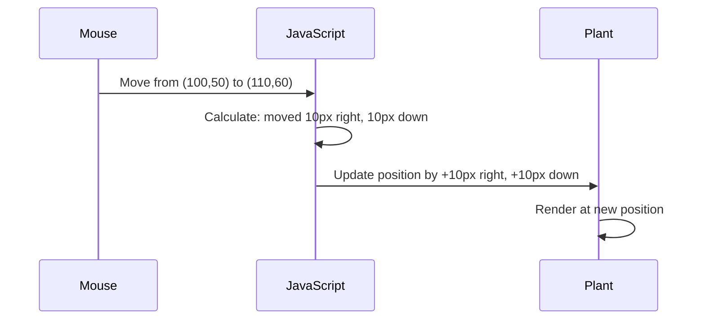

<!--
CO_OP_TRANSLATOR_METADATA:
{
  "original_hash": "bc93f6285423033ebf5b8abeb5282888",
  "translation_date": "2025-10-24T22:40:51+00:00",
  "source_file": "3-terrarium/3-intro-to-DOM-and-closures/README.md",
  "language_code": "bg"
}
-->
# Проект Терариум Част 3: Манипулация с DOM и JavaScript Closures


> Скица от [Tomomi Imura](https://twitter.com/girlie_mac)

Добре дошли в една от най-интересните области на уеб разработката - създаването на интерактивност! Document Object Model (DOM) е като мост между вашия HTML и JavaScript, и днес ще го използваме, за да вдъхнем живот на вашия терариум. Когато Тим Бърнърс-Лий създаде първия уеб браузър, той си представяше уеб, където документите могат да бъдат динамични и интерактивни - DOM прави тази визия възможна.

Ще разгледаме и JavaScript closures, които може да звучат плашещо в началото. Помислете за closures като за "джобове на паметта", където вашите функции могат да запомнят важна информация. Това е като всяко растение в терариума да има собствен запис на данни, за да следи позицията си. До края на този урок ще разберете колко естествени и полезни са те.

Ето какво ще изградим: терариум, в който потребителите могат да местят растенията навсякъде, където пожелаят. Ще научите техники за манипулация с DOM, които захранват всичко - от качване на файлове чрез влачене и пускане до интерактивни игри. Нека вдъхнем живот на вашия терариум.

## Предварителен тест

[Предварителен тест](https://ff-quizzes.netlify.app/web/quiz/19)

## Разбиране на DOM: Вашият портал към интерактивни уеб страници

Document Object Model (DOM) е начинът, по който JavaScript комуникира с вашите HTML елементи. Когато браузърът ви зареди HTML страница, той създава структурирано представяне на тази страница в паметта - това е DOM. Представете си го като семейно дърво, където всеки HTML елемент е член на семейството, който JavaScript може да достъпи, модифицира или пренареди.

Манипулацията с DOM трансформира статичните страници в интерактивни уебсайтове. Всеки път, когато видите бутон, който променя цвета си при задържане, съдържание, което се обновява без презареждане на страницата, или елементи, които можете да местите, това е работа на манипулацията с DOM.


> Представяне на DOM и HTML маркировката, която го реферира. От [Olfa Nasraoui](https://www.researchgate.net/publication/221417012_Profile-Based_Focused_Crawler_for_Social_Media-Sharing_Websites)

**Ето какво прави DOM мощен:**
- **Осигурява** структуриран начин за достъп до всеки елемент на страницата ви
- **Позволява** динамично обновяване на съдържанието без презареждане на страницата
- **Реагира** в реално време на взаимодействията на потребителя като кликове и влачене
- **Създава** основата за модерни интерактивни уеб приложения

## JavaScript Closures: Създаване на организиран и мощен код

[JavaScript closure](https://developer.mozilla.org/docs/Web/JavaScript/Closures) е като да дадете на функцията собствено частно пространство с постоянна памет. Помислете как финките на Дарвин на островите Галапагос са развили специализирани човки според специфичната си среда - closures работят по подобен начин, създавайки специализирани функции, които "запомнят" своя специфичен контекст дори след като родителската функция е приключила.

В нашия терариум closures помагат на всяко растение да запомни собствената си позиция независимо. Този модел се среща навсякъде в професионалната JavaScript разработка, което го прави ценна концепция за разбиране.

> 💡 **Разбиране на Closures**: Closures са значима тема в JavaScript, и много разработчици ги използват години наред, преди напълно да разберат всички теоретични аспекти. Днес ще се фокусираме върху практическото приложение - ще видите как closures естествено се появяват, докато изграждаме нашите интерактивни функции. Разбирането ще се развие, докато виждате как те решават реални проблеми.


> Представяне на DOM и HTML маркировката, която го реферира. От [Olfa Nasraoui](https://www.researchgate.net/publication/221417012_Profile-Based_Focused_Crawler_for_Social_Media-Sharing_Websites)

В този урок ще завършим нашия интерактивен проект за терариум, като създадем JavaScript, който ще позволи на потребителя да манипулира растенията на страницата.

## Преди да започнем: Подготовка за успех

Ще ви трябват вашите HTML и CSS файлове от предишните уроци за терариум - предстои да направим този статичен дизайн интерактивен. Ако се присъединявате за първи път, завършването на тези уроци първо ще ви предостави важен контекст.

Ето какво ще изградим:
- **Плавно влачене и пускане** за всички растения в терариума
- **Проследяване на координати**, за да запомнят растенията своите позиции
- **Пълно интерактивно интерфейс** с помощта на vanilla JavaScript
- **Чист, организиран код** с използване на closure модели

## Настройка на вашия JavaScript файл

Нека създадем JavaScript файла, който ще направи вашия терариум интерактивен.

**Стъпка 1: Създайте вашия скрипт файл**

В папката на вашия терариум създайте нов файл, наречен `script.js`.

**Стъпка 2: Свържете JavaScript към вашия HTML**

Добавете този `<script>` таг в секцията `<head>` на вашия `index.html` файл:

```html
<script src="./script.js" defer></script>
```

**Защо атрибутът `defer` е важен:**
- **Осигурява**, че вашият JavaScript ще изчака, докато целият HTML бъде зареден
- **Предотвратява** грешки, при които JavaScript търси елементи, които още не са готови
- **Гарантира**, че всички елементи на растенията са налични за взаимодействие
- **Осигурява** по-добра производителност, отколкото поставянето на скриптове в долната част на страницата

> ⚠️ **Важна бележка**: Атрибутът `defer` предотвратява често срещани проблеми с времето. Без него JavaScript може да се опита да достъпи HTML елементи преди те да бъдат заредени, което води до грешки.

---

## Свързване на JavaScript с вашите HTML елементи

Преди да направим елементите влачими, JavaScript трябва да ги намери в DOM. Представете си това като система за каталогизиране в библиотека - след като имате каталожния номер, можете да намерите точно книгата, която ви трябва, и да получите достъп до цялото й съдържание.

Ще използваме метода `document.getElementById()`, за да направим тези връзки. Това е като да имате прецизна система за архивиране - предоставяте ID и тя намира точно елемента, който ви трябва в HTML.

### Активиране на функцията за влачене за всички растения

Добавете този код към вашия файл `script.js`:

```javascript
// Enable drag functionality for all 14 plants
dragElement(document.getElementById('plant1'));
dragElement(document.getElementById('plant2'));
dragElement(document.getElementById('plant3'));
dragElement(document.getElementById('plant4'));
dragElement(document.getElementById('plant5'));
dragElement(document.getElementById('plant6'));
dragElement(document.getElementById('plant7'));
dragElement(document.getElementById('plant8'));
dragElement(document.getElementById('plant9'));
dragElement(document.getElementById('plant10'));
dragElement(document.getElementById('plant11'));
dragElement(document.getElementById('plant12'));
dragElement(document.getElementById('plant13'));
dragElement(document.getElementById('plant14'));
```

**Ето какво постига този код:**
- **Намира** всеки елемент на растение в DOM, използвайки уникалния му ID
- **Извлича** JavaScript референция към всеки HTML елемент
- **Предава** всеки елемент на функцията `dragElement` (която ще създадем след малко)
- **Подготвя** всяко растение за взаимодействие чрез влачене и пускане
- **Свързва** структурата на HTML с функционалността на JavaScript

> 🎯 **Защо да използваме ID вместо класове?** ID предоставят уникални идентификатори за конкретни елементи, докато CSS класовете са предназначени за стилизиране на групи от елементи. Когато JavaScript трябва да манипулира индивидуални елементи, ID предлагат прецизността и производителността, от които се нуждаем.

> 💡 **Полезен съвет**: Забележете как извикваме `dragElement()` за всяко растение поотделно. Този подход гарантира, че всяко растение получава собствено независимо поведение при влачене, което е от съществено значение за гладкото взаимодействие с потребителя.

---

## Създаване на Closure за Drag Element

Сега ще създадем сърцето на нашата функционалност за влачене: closure, който управлява поведението на влачене за всяко растение. Този closure ще съдържа множество вътрешни функции, които работят заедно, за да проследяват движенията на мишката и да актуализират позициите на елементите.

Closures са идеални за тази задача, защото ни позволяват да създадем "частни" променливи, които се запазват между извикванията на функции, като дават на всяко растение собствена независима система за проследяване на координати.

### Разбиране на Closures с прост пример

Нека демонстрираме closures с прост пример, който илюстрира концепцията:

```javascript
function createCounter() {
    let count = 0; // This is like a private variable
    
    function increment() {
        count++; // The inner function remembers the outer variable
        return count;
    }
    
    return increment; // We're giving back the inner function
}

const myCounter = createCounter();
console.log(myCounter()); // 1
console.log(myCounter()); // 2
```

**Ето какво се случва в този модел на closure:**
- **Създава** частна променлива `count`, която съществува само в този closure
- **Вътрешната функция** може да достъпва и модифицира тази външна променлива (механизмът на closure)
- **Когато връщаме** вътрешната функция, тя запазва връзката си с тези частни данни
- **Дори след като** `createCounter()` приключи изпълнението си, `count` се запазва и помни стойността си

### Защо Closures са идеални за функционалността на влачене

За нашия терариум всяко растение трябва да запомни текущите си координати. Closures предоставят идеалното решение:

**Основни предимства за нашия проект:**
- **Запазват** частни променливи за позицията на всяко растение независимо
- **Съхраняват** данни за координатите между събитията на влачене
- **Предотвратяват** конфликти на променливи между различни влачими елементи
- **Създават** чиста и организирана структура на кода

> 🎯 **Цел на обучението**: Не е нужно да овладявате всеки аспект на closures точно сега. Фокусирайте се върху това да видите как те помагат за организиране на кода и поддържане на състояние за функционалността на влачене.

### Създаване на функцията dragElement

Сега нека изградим основната функция, която ще управлява цялата логика на влачене. Добавете тази функция под декларациите на елементите на растенията:

```javascript
function dragElement(terrariumElement) {
    // Initialize position tracking variables
    let pos1 = 0,  // Previous mouse X position
        pos2 = 0,  // Previous mouse Y position  
        pos3 = 0,  // Current mouse X position
        pos4 = 0;  // Current mouse Y position
    
    // Set up the initial drag event listener
    terrariumElement.onpointerdown = pointerDrag;
}
```

**Разбиране на системата за проследяване на позицията:**
- **`pos1` и `pos2`**: Съхраняват разликата между старите и новите позиции на мишката
- **`pos3` и `pos4`**: Проследяват текущите координати на мишката
- **`terrariumElement`**: Конкретният елемент на растение, който правим влачим
- **`pos3` и `pos4`**: Съхраняват текущата позиция на мишката за следващото изчисление
- **`offsetTop` и `offsetLeft`**: Получават текущата позиция на елемента на страницата
- **Логика на изваждане**: Премества елемента със същото разстояние, с което се е преместила мишката

**Ето разбивка на изчисленията за движение:**
1. **Измерва** разликата между старата и новата позиция на мишката
2. **Изчислява** колко да се премести елементът въз основа на движението на мишката
3. **Актуализира** CSS свойствата за позиция на елемента в реално време
4. **Съхранява** новата позиция като основа за следващото изчисление на движението

### Визуално представяне на математиката



### Функцията stopElementDrag: Почистване

Добавете функцията за почистване след затварящата фигурна скоба на `elementDrag`:

```javascript
function stopElementDrag() {
    // Remove the document-level event listeners
    document.onpointerup = null;
    document.onpointermove = null;
}
```

**Защо почистването е важно:**
- **Предотвратява** изтичане на памет от оставащи слушатели на събития
- **Спира** поведението на влачене, когато потребителят освободи растението
- **Позволява** на други елементи да бъдат влачени независимо
- **Рестартира** системата за следващата операция на влачене

**Какво се случва без почистване:**
- Слушателите на събития продължават да работят, дори след като влаченето спре
- Производителността се влошава, тъй като се натрупват неизползвани слушатели
- Неочаквано поведение при взаимодействие с други елементи
- Ресурсите на браузъра се изразходват за ненужно обработване на събития

### Разбиране на CSS свойства за позициониране

Нашата система за влачене манипулира два ключови CSS свойства:

| Свойство | Какво контролира | Как го използваме |
|----------|------------------|-------------------|
| `top` | Разстояние от горния ръб | Вертикално позициониране по време на влачене |
| `left` | Разстояние от левия ръб | Хоризонтално позициониране по време на влачене |

**Основни прозрения за свойствата offset:**
- **`offsetTop`**: Текущото разстояние от горния ръб на позиционирания родителски елемент
- **`offsetLeft`**: Текущото разстояние от левия ръб на позиционирания родителски елемент
- **Контекст на позициониране**: Тези стойности са относителни спрямо най-близкия позициониран предшественик
- **Актуализации в реално време**: Променят се незабавно, когато модифицираме CSS свойствата

> 🎯 **Философия на дизайна**: Тази система за влачене е умишлено гъвкава – няма "зони за пускане" или ограничения. Потребителите могат да поставят растенията навсякъде, като им се предоставя пълен творчески контрол върху дизайна на терариума.

## Събиране на всичко: Вашата пълна система за влачене

Поздравления! Току-що създадохте сложна система за влачене и пускане, използвайки чист JavaScript. Вашата пълна функция `dragElement` вече съдържа мощен closure, който управлява:

**Какво постига вашият closure:**
- **Поддържа** частни променливи за позиция за всяко растение независимо
- **Управлява** целия жизнен цикъл на влаченето от начало до край
- **Осигурява** плавно и отзивчиво движение по целия екран
- **Почиства** ресурсите правилно, за да предотврати изтичане на памет
- **Създава** интуитивен, творчески интерфейс за дизайн на терариум

### Тестване на вашия интерактивен терариум

Сега тествайте вашия интерактивен терариум! Отворете вашия файл `index.html` в уеб браузър и опитайте функционалността:

1. **Кликнете и задръжте** върху което и да е растение, за да започнете влаченето
2. **Преместете мишката или пръста си** и наблюдавайте как растението се движи плавно
3. **Освободете**, за да пуснете растението на новата му позиция
4. **Експериментирайте** с различни подредби, за да изследвате интерфейса

🥇 **Постижение**: Създадохте напълно интерактивно уеб приложение, използвайки основни концепции, които професионалните разработчици използват ежедневно. Тази функционалност за влачене и пускане използва същите принципи, които стоят зад качването на файлове, канбан дъски и много други интерактивни интерфейси.


---

## Предизвикателство с GitHub Copilot Agent 🚀

Използвайте режим Agent, за да завършите следното предизвикателство:

**Описание:** Подобрете проекта за терариум, като добавите функция за нулиране, която връща всички растения на първоначалните им позиции с плавни анимации.

**Подсказка:** Създайте бутон за нулиране, който при натискане анимира всички растения обратно към първоначалните им позиции в страничната лента, използвайки CSS преходи. Функцията трябва да съхранява първоначалните позиции при зареждане на страницата и плавно да премества растенията обратно към тези позиции за 1 секунда, когато бутонът за нулиране бъде натиснат.

Научете повече за [режим Agent](https://code.visualstudio.com/blogs/2025/02/24/introducing-copilot-agent-mode) тук.

## 🚀 Допълнително предизвикателство: Разширете уменията си

Готови ли сте да издигнете вашия терариум на следващо ниво? Опитайте да реализирате тези подобрения:

**Творчески разширения:**
- **Двойно кликване** върху растение, за да го поставите отпред (манипулация на z-index)
- **Добавете визуална обратна връзка**, като леко сияние при задържане на курсора върху растенията
- **Реализирайте граници**, за да предотвратите влаченето на растения извън терариума
- **Създайте функция за запазване**, която запомня позициите на растенията, използвайки localStorage
- **Добавете звукови ефекти** при вземане и поставяне на растения

> 💡 **Възможност за учене**: Всяко от тези предизвикателства ще ви научи на нови аспекти на манипулацията на DOM, обработката на събития и дизайна на потребителския интерфейс.

## Тест след лекцията

[Тест след лекцията](https://ff-quizzes.netlify.app/web/quiz/20)

## Преглед и самостоятелно обучение: Задълбочаване на разбирането

Овладяхте основите на манипулацията на DOM и closures, но винаги има още какво да се изследва! Ето някои пътища за разширяване на вашите знания и умения.

### Алтернативни подходи за влачене и пускане

Използвахме pointer събития за максимална гъвкавост, но уеб разработката предлага множество подходи:

| Подход | Най-добър за | Стойност за учене |
|--------|--------------|-------------------|
| [HTML Drag and Drop API](https://developer.mozilla.org/docs/Web/API/HTML_Drag_and_Drop_API) | Качване на файлове, формални зони за влачене | Разбиране на възможностите на браузъра |
| [Touch Events](https://developer.mozilla.org/docs/Web/API/Touch_events) | Специфични взаимодействия за мобилни устройства | Мобилно-ориентирани модели за разработка |
| CSS свойства `transform` | Плавни анимации | Техники за оптимизация на производителността |

### Напреднали теми за манипулация на DOM

**Следващи стъпки във вашето учебно пътуване:**
- **Делегиране на събития**: Ефективно управление на събития за множество елементи
- **Intersection Observer**: Засичане, когато елементи влизат/излизат от изгледа
- **Mutation Observer**: Наблюдение за промени в структурата на DOM
- **Web Components**: Създаване на многократно използваеми, капсулирани UI елементи
- **Концепции за виртуален DOM**: Разбиране как фреймуърковете оптимизират актуализациите на DOM

### Основни ресурси за продължаващо обучение

**Техническа документация:**
- [Ръководство за MDN Pointer Events](https://developer.mozilla.org/docs/Web/API/Pointer_events) - Изчерпателен справочник за pointer събития
- [Спецификация на W3C Pointer Events](https://www.w3.org/TR/pointerevents1/) - Официална документация за стандартите
- [Дълбоко разбиране на JavaScript Closures](https://developer.mozilla.org/docs/Web/JavaScript/Closures) - Разширени модели на closures

**Съвместимост с браузъри:**
- [CanIUse.com](https://caniuse.com/) - Проверете поддръжката на функции в различни браузъри
- [MDN Browser Compatibility Data](https://github.com/mdn/browser-compat-data) - Подробна информация за съвместимост

**Възможности за практика:**
- **Създайте** игра с пъзели, използвайки подобни механики за влачене
- **Създайте** канбан дъска с управление на задачи чрез влачене и пускане
- **Дизайн** на галерия с изображения с подреждане на снимки чрез влачене
- **Експериментирайте** с жестове за докосване за мобилни интерфейси

> 🎯 **Стратегия за учене**: Най-добрият начин да затвърдите тези концепции е чрез практика. Опитайте да създадете вариации на интерфейси с влачене – всеки проект ще ви научи на нещо ново за взаимодействието с потребителя и манипулацията на DOM.

## Задача

[Работете още малко с DOM](assignment.md)

---

**Отказ от отговорност**:  
Този документ е преведен с помощта на AI услуга за превод [Co-op Translator](https://github.com/Azure/co-op-translator). Въпреки че се стремим към точност, моля, имайте предвид, че автоматизираните преводи може да съдържат грешки или неточности. Оригиналният документ на неговия роден език трябва да се счита за авторитетен източник. За критична информация се препоръчва професионален човешки превод. Не носим отговорност за недоразумения или погрешни интерпретации, произтичащи от използването на този превод.