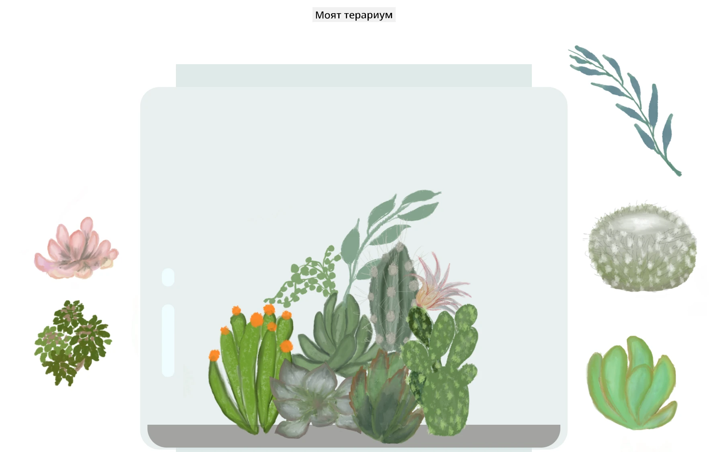

# Моето терариумче: Проект за изучаване на HTML, CSS и манипулация на DOM с JavaScript 🌵🌱

Малка медитация с влачене и пускане на код. С малко HTML, JS и CSS можете да създадете уеб интерфейс, да го стилизирате и да добавите интеракция.

## Кредити

Написано с ♥️ от [Jen Looper](https://www.twitter.com/jenlooper)

Терариумът, създаден чрез CSS, е вдъхновен от стъкления буркан на Jakub Mandra [codepen](https://codepen.io/Rotarepmi/pen/rjpNZY).

Илюстрациите са ръчно нарисувани от [Jen Looper](http://jenlooper.com) с помощта на Procreate.

## Публикувайте вашето терариумче

Можете да публикувате вашето терариумче в интернет, използвайки Azure Static Web Apps.

1. Направете fork на това хранилище

2. Натиснете този бутон

3. Следвайте инструкциите в съветника за създаване на вашето приложение. Уверете се, че сте задали корена на приложението да бъде `/solution` или корена на вашата кодова база. В това приложение няма API, така че не се притеснявайте да добавяте такъв. Във вашето fork-нато хранилище ще бъде създадена папка .github, която ще помогне на услугата за изграждане на Azure Static Web Apps да изгради и публикува вашето приложение на нов URL адрес.

---

**Отказ от отговорност**:  
Този документ е преведен с помощта на AI услуга за превод [Co-op Translator](https://github.com/Azure/co-op-translator). Въпреки че се стремим към точност, моля, имайте предвид, че автоматичните преводи може да съдържат грешки или неточности. Оригиналният документ на неговия изходен език трябва да се счита за авторитетен източник. За критична информация се препоръчва професионален човешки превод. Ние не носим отговорност за каквито и да е недоразумения или погрешни интерпретации, произтичащи от използването на този превод.