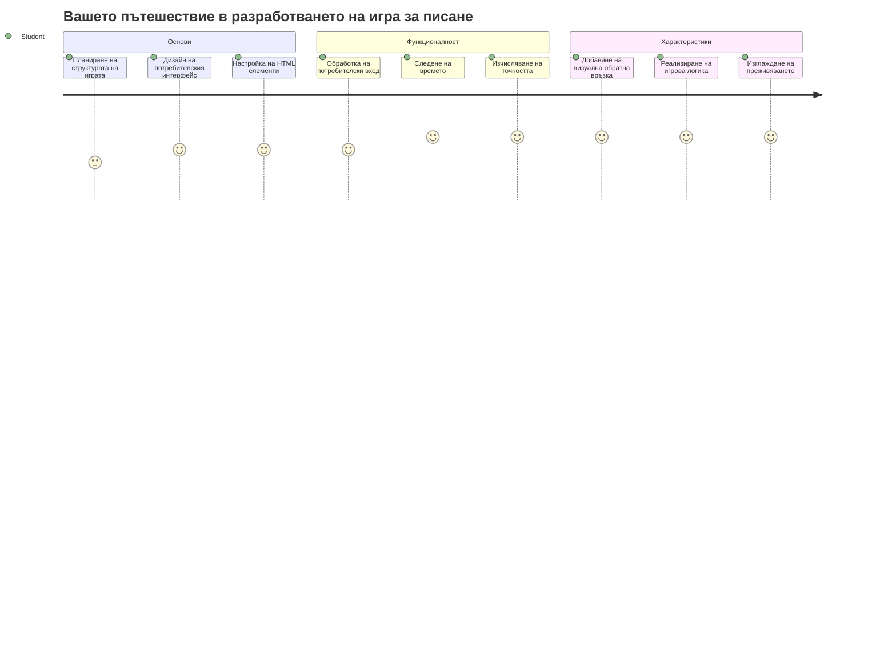
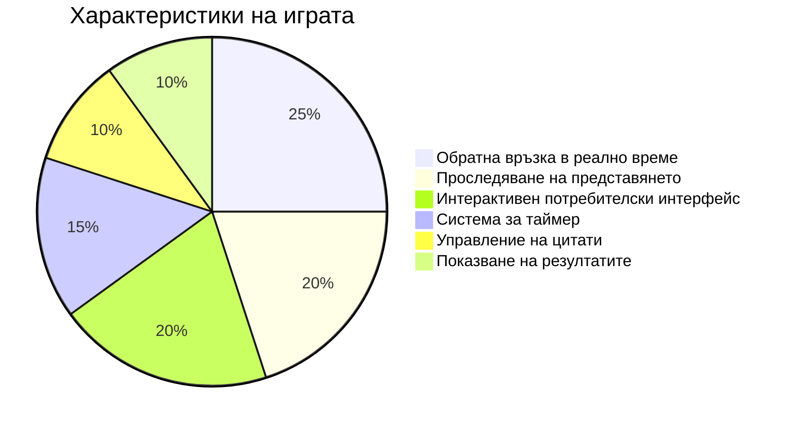
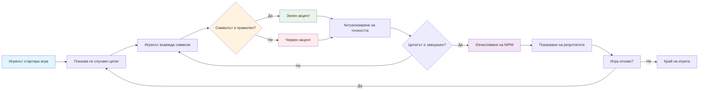
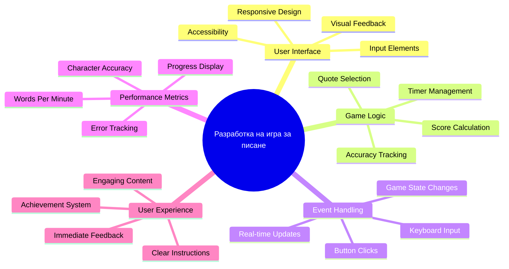
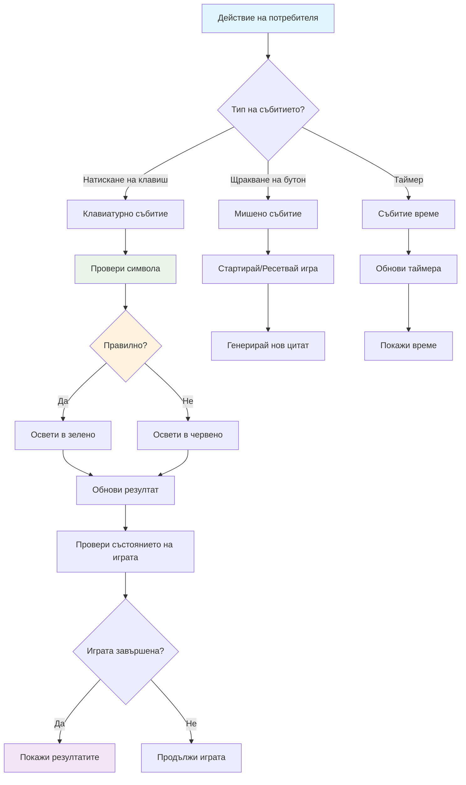
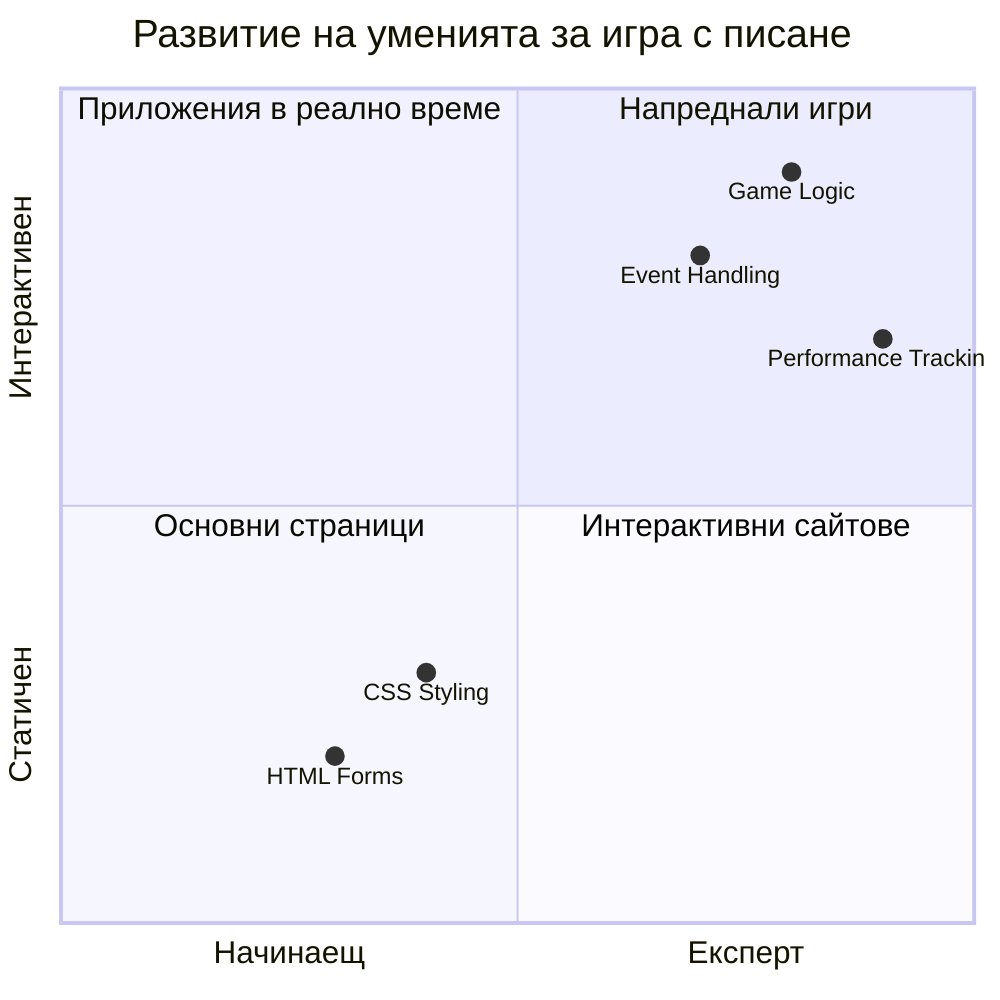
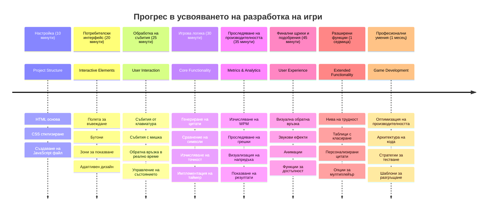

<!--
CO_OP_TRANSLATOR_METADATA:
{
  "original_hash": "efa2ab875b8bb5a7883816506da6b6d2",
  "translation_date": "2026-01-07T06:28:34+00:00",
  "source_file": "4-typing-game/README.md",
  "language_code": "bg"
}
-->
# Програмиране, основано на събития - Създайте игра за писане

## Въведение

Ето нещо, което всеки разработчик знае, но рядко говори за него: бързото писане е суперсила! 🚀 Помислете - колкото по-бързо можете да прехвърлите идеите си от мозъка си към кода, толкова повече може да тече вашата креативност. Това е като да имате директен канал между мислите си и екрана.

Искате ли да знаете един от най-добрите начини да подобрите този умение? Познахте - ще създадем игра!

> Нека създадем страхотна игра за писане заедно!

Готови ли сте да използвате всички тези умения по JavaScript, HTML и CSS, които сте усвоили? Ще създадем игра за писане, която ще ви предизвика с произволни цитати от легендарния детектив [Шерлок Холмс](https://en.wikipedia.org/wiki/Sherlock_Holmes). Играта ще следи колко бързо и точно можете да пишете – повярвайте ми, това е по-заразно, отколкото си мислите!

## Какво ще трябва да знаете

Преди да започнем, уверете се, че сте запознати с тези концепции (не се притеснявайте, ако имате нужда от бързо припомняне - всички сме били там!):

- Създаване на текстови полета и бутони  
- CSS и задаване на стилове чрез класове  
- Основи на JavaScript
  - Създаване на масив
  - Създаване на случайно число
  - Получаване на текущото време

Ако някое от тези неща ви се струва малко заръждясало, нищо страшно! Понякога най-добрият начин да затвърдите знанията си е като започнете проект и разберете всичко в движение.

### 🔄 **Образователна проверка**
**Оценка на основите**: Преди да започнете разработката, уверете се, че разбирате:
- ✅ Как работят HTML формите и елементите за въвеждане
- ✅ CSS класове и динамично стилизиране
- ✅ JavaScript слушатели и обработващи функции за събития
- ✅ Манипулиране на масиви и случайно избиране
- ✅ Измерване на време и изчисления

**Бърз самотест**: Можете ли да обясните как тези концепции работят заедно в интерактивна игра?
- **Събития** се задействат, когато потребителите взаимодействат с елементи
- **Обработващи функции** обработват тези събития и актуализират състоянието на играта
- **CSS** осигурява визуална обратна връзка за действията на потребителя
- **Измерването на време** позволява измерване на представяне и напредък в играта

## Нека построим това!

[Създаване на игра за писане чрез програмиране, основано на събития](./typing-game/README.md)

### ⚡ **Какво можете да направите през следващите 5 минути**
- [ ] Отворете конзолата на браузъра и опитайте да слушате за клавишни събития с `addEventListener`
- [ ] Създайте проста HTML страница с полe за въвеждане и тествайте засичане на писане
- [ ] Упражнявайте манипулиране на текст, като сравнявате написания текст с целевия
- [ ] Експериментирайте с `setTimeout`, за да разберете как работят таймерите

### 🎯 **Какво можете да постигнете този час**
- [ ] Завършете викторината след урока и разберете програмиране, основано на събития
- [ ] Изградете основна версия на играта за писане с проверка на думи
- [ ] Добавете визуална обратна връзка за правилно и неправилно писане
- [ ] Прилагайте проста система за оценяване на базата на скорост и точност
- [ ] Стилизирайте играта с CSS, за да я направите визуално привлекателна

### 📅 **Вашето седмично разработване на игра**
- [ ] Завършете пълната игра за писане с всички функции и полиран вид
- [ ] Добавете нива на трудност с различна сложност на думите
- [ ] Прилагайте проследяване на статистики на потребителя (думи в минута, точност с времето)
- [ ] Създайте звукови ефекти и анимации за по-добро потребителско преживяване
- [ ] Направете играта си адаптивна за мобилни устройства с тъч интерфейс
- [ ] Споделете играта си онлайн и съберете обратна връзка от потребители

### 🌟 **Вашето месечно интерактивно развитие**
- [ ] Създавайте множество игри, изследващи различни модели на взаимодействие
- [ ] Научете за игрови цикли, управление на състояния и оптимизация на производителността
- [ ] Допринасяйте за проекти с отворен код в разработката на игри
- [ ] Овладейте напреднали концепции за време и плавни анимации
- [ ] Създайте портфолио, показващо разнообразни интерактивни приложения
- [ ] Наставлявайте други, заинтересовани от разработката на игри и потребителско взаимодействие

## 🎯 Вашата времева линия за овладяване на игра за писане

### 🛠️ Резюме на вашите инструменти за разработка на игри

След завършване на този проект ще сте овладели:
- **Програмиране, основано на събития**: Отзивчиви потребителски интерфейси, които реагират на вход
- **Обратна връзка в реално време**: Незабавни визуални и представителни актуализации
- **Измерване на производителността**: Точни системи за измерване на време и точкуване
- **Управление на състоянието на играта**: Контрол на потока на приложението и потребителското преживяване
- **Интерактивен дизайн**: Създаване на ангажиращи, пристрастяващи потребителски преживявания
- **Модерни уеб API-та**: Използване на възможностите на браузъра за богати взаимодействия
- **Патерни за достъпност**: Приобщаващ дизайн за всички потребители

**Приложения в реалния свят**: Тези умения се прилагат директно в:
- **Уеб приложения**: Всеки интерактивен интерфейс или табло за управление
- **Образователен софтуер**: Платформи за обучение и инструменти за оценка на умения
- **Продуктивни инструменти**: Текстови редактори, IDE-та и софтуер за съвместна работа
- **Индустрията на игрите**: Игри в браузъра и интерактивни забавления
- **Мобилна разработка**: Тъч-базирани интерфейси и обработка на жестове

**Следващо ниво**: Готови сте да изследвате напреднали игрови рамки, системи за мултиплейър в реално време или сложни интерактивни приложения!

## Благодарности

Написано с ♥️ от [Christopher Harrison](http://www.twitter.com/geektrainer)

---

<!-- CO-OP TRANSLATOR DISCLAIMER START -->
**Отказ от отговорност**:
Този документ е преведен с помощта на AI преводаческа услуга [Co-op Translator](https://github.com/Azure/co-op-translator). Въпреки че се стараем да осигурим точност, имайте предвид, че автоматизираните преводи могат да съдържат грешки или неточности. Оригиналният документ на неговия първоначален език трябва да се счита за авторитетен източник. За критична информация се препоръчва професионален човешки превод. Ние не носим отговорност за никакви недоразумения или неправилни тълкувания, произтичащи от използването на този превод.
<!-- CO-OP TRANSLATOR DISCLAIMER END -->