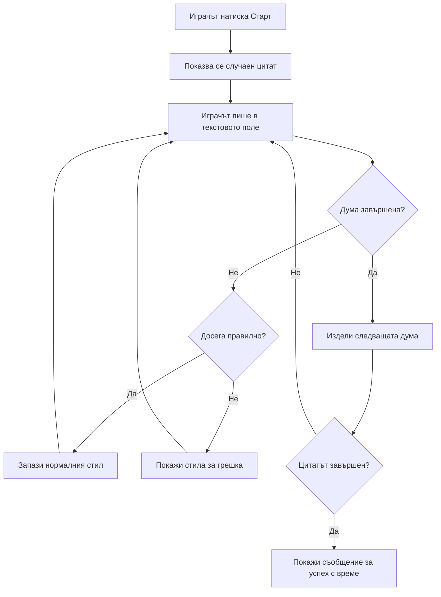
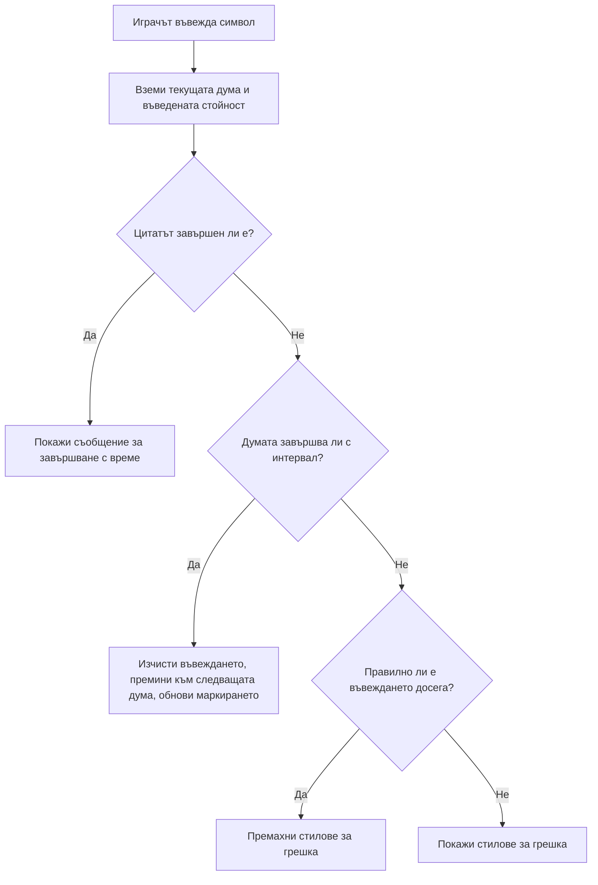
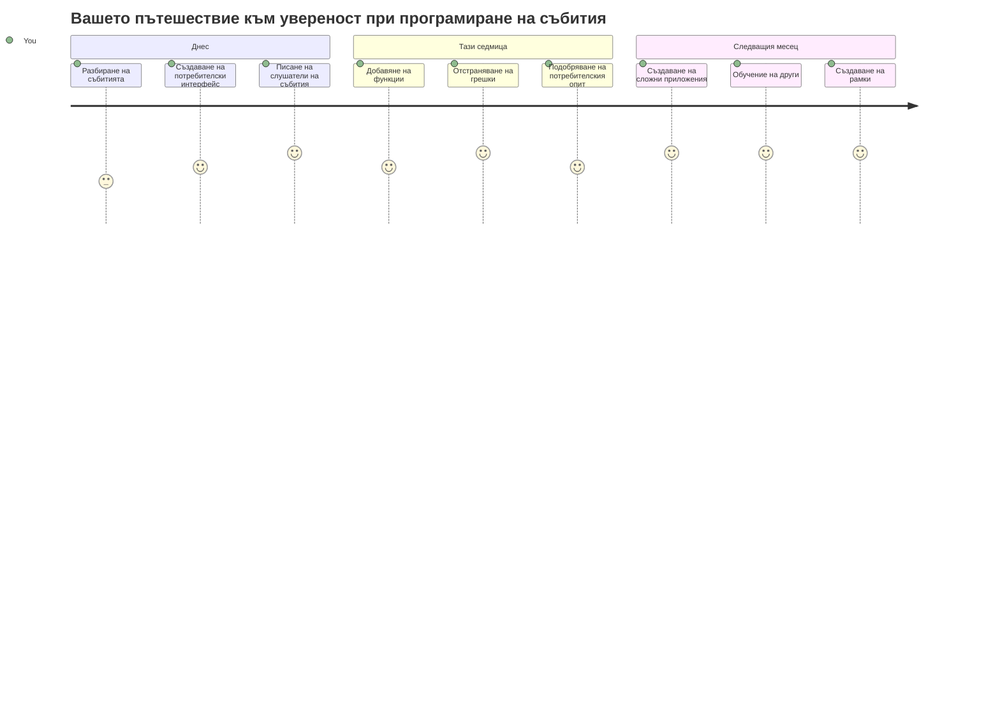

# Създаване на игра с използване на събития

Замисляли ли сте се някога как сайтовете разбират кога кликнете върху бутон или напишете нещо в текстово поле? Това е магията на събитийно ориентираното програмиране! Какъв по-добър начин да научите този важен умение, от това да създадете нещо полезно - игра за бързина на писане, която реагира на всеки натиснат клавиш.

Ще видите на живо как уеб браузърите "комуникират" с вашия JavaScript код. Всеки път, когато кликнете, напишете или преместите мишката, браузърът изпраща малки съобщения (наричаме ги събития) към вашия код и вие решавате как да отговорите!

Когато приключим тук, ще сте създали истинска игра за писане, която проследява скоростта и точността ви. Още по-важното е, че ще разберете фундаменталните концепции, които задвижват всеки интерактивен уеб сайт, който някога сте ползвали. Хайде да започваме!

## Предварителен тест пред лекцията

[Предварителен тест пред лекцията](https://ff-quizzes.netlify.app/web/quiz/21)

## Програмиране, ориентирано към събития

Помислете за любимото си приложение или сайт - какво го кара да се чувства жив и отзивчив? Всичко е в това как реагира на вашите действия! Всеки клик, докосване, плъзгане или натискане на клавиш създава нещо, което наричаме "събитие", и тук се случва истинската магия на уеб разработката.

Ето какво прави програмирането за уеб толкова интересно: никога не знаем кога някой ще кликне бутона или ще започне да пише в текстовото поле. Може да кликне веднага, да изчака пет минути или може никога да не кликне! Тази непредсказуемост ни кара да мислим по различен начин как да пишем кода си.

Вместо да пишем код, който се изпълнява отгоре надолу като рецепта, ние пишем код, който търпеливо чака нещо да се случи. Това е подобно на начина, по който телеграфните оператори през 1800-те сядат до машините си, готови да реагират веднага щом през жицата премине съобщение.

Какво всъщност е "събитие"? Просто казано, това е нещо, което се случва! Когато кликнете върху бутон - това е събитие. Когато натиснете клавиш - това е събитие. Когато преместите мишката - това е друго събитие.

Програмирането, ориентирано към събития, ни позволява да настроим кода си да слуша и реагира. Създаваме специални функции, наречени **слушатели на събития** (event listeners), които търпеливо чакат специфични неща да се случат и веднага се задействат, когато това стане.

Мислете за слушателите на събития като звънец за вашия код. Вие настройвате звънеца (`addEventListener()`), казвате му за какъв звук да слуша (например 'click' или 'keypress'), и след това посочвате какво да се случи, когато някой звънне (вашата персонализирана функция).

**Ето как работят слушателите на събития:**
- **Слушат** за специфични действия на потребителя като кликове, натискане на клавиши или движение на мишката
- **Изпълняват** вашия код веднага, когато настъпи посоченото събитие
- **Реагират** мигновено на действията на потребителя, създавайки плавно преживяване
- **Обработват** множество събития на един и същ елемент чрез различни слушатели

> **ЗАБЕЛЕЖКА:** Струва си да се отбележи, че има много начини за създаване на слушатели на събития. Можете да използвате анонимни функции или да създадете именувани. Можете да използвате разнообразни кратки начини като настройване на свойството `click` или чрез `addEventListener()`. В нашето упражнение ще се фокусираме върху `addEventListener()` и анонимни функции, тъй като това е вероятно най-често използваната техника от уеб разработчиците. Освен това е най-гъвкавата, защото `addEventListener()` работи с всички събития и името на събитието може да се подаде като параметър.

### Често използвани събития

Въпреки че уеб браузърите предлагат десетки различни събития, на които можете да слушате, повечето интерактивни приложения разчитат само на няколко основни. Разбирането на тези основни събития ще ви даде основата за изграждане на по-сложни взаимодействия с потребителите.

Има [десетки събития](https://developer.mozilla.org/docs/Web/Events), към които можете да се прикачите при създаването на приложение. Почти всичко, което потребителят прави на страница, повдига събитие, което ви дава голяма възможност да осигурите нужния опит. За щастие, обикновено ви трябват само няколко събития. Ето някои често използвани (включително тези, които ще ползваме в нашата игра):

| Събитие | Описание | Често използвани случаи |
|---------|----------|------------------------|
| `click` | Потребителят кликна върху нещо | Бутони, линкове, интерактивни елементи |
| `contextmenu` | Потребителят кликна с десен бутон на мишката | Персонализирани менюта с десен бутон |
| `select` | Потребителят избра текст | Редактиране на текст, копиране |
| `input` | Потребителят въведе текст | Валидация на форми, търсене в реално време |

**Разбиране на тези типове събития:**
- **Се задействат**, когато потребителите взаимодействат със специфични елементи на страницата
- **Осигуряват** подробна информация за действието на потребителя чрез обекти на събитието
- **Позволяват** създаването на отзивчиви и интерактивни уеб приложения
- **Работят** постоянно на различни браузъри и устройства

## Създаване на играта

Сега, когато разбирате как работят събитията, нека приложим това знание като създадем нещо полезно. Ще направим игра за скорост на писане, която демонстрира обработката на събития и помага да развиете важни умения за разработчици.

Ще създадем игра, за да изследваме как работят събитията в JavaScript. Наша игра ще тества умението за писане на играча – една от най-пренебрегваните способности, които всеки разработчик трябва да притежава. Забавен факт: клавиатурната подредба QWERTY, която използваме днес, всъщност е проектирана през 1870-те за пишещи машини – и добрите умения за писане са също толкова ценни и за програмистите днес! Общият ход на играта ще изглежда така:


**Ето как ще работи нашата игра:**
- **Започва** когато играчът натисне бутона за старт и показва произволен цитат
- **Проследява** напредъка на писане на играча дума по дума в реално време
- **Подчертава** текущата дума, за да насочи фокуса на играча
- **Осигурява** незабавна визуална обратна връзка при грешки в писането
- **Изчислява** и показва общото време след завършване на цитата

Нека създадем играта си и научим повече за събитията!

### Структура на файловете

Преди да започнем да пишем код, нека се организираме! Имате ли чиста структура на файловете от самото начало, това ще ви спести главоболия по-късно и ще направи проекта ви по-професионален. 😊

Ще поддържаме нещата прости с три файла: `index.html` за структурата на страницата, `script.js` за логиката на играта и `style.css` за оформлението. Това е класическото трио, което движи почти целия уеб!

**Създайте нова папка за работата си, като отворите конзола или терминал и изпълните следната команда:**

```bash
# Linux или macOS
mkdir typing-game && cd typing-game

# Windows
md typing-game && cd typing-game
```

**Ето какво правят тези команди:**
- **Създават** нова директория, наречена `typing-game` за файловете на проекта
- **Влизат** автоматично в новосъздадената директория
- **Настройват** чисто работно пространство за разработка на играта

**Отворете Visual Studio Code:**

```bash
code .
```

**Тази команда:**
- **Стартира** Visual Studio Code в текущата директория
- **Отваря** папката на проекта в редактора
- **Дава** достъп до всички инструменти за разработка, от които ще имате нужда

**Добавете три файла в папката в Visual Studio Code със следните имена:**
- `index.html` - Съдържа структурата и съдържанието на играта
- `script.js` - Обработва логиката и слушателите на събития за играта
- `style.css` - Определя визуалното оформление и стила

## Създаване на потребителския интерфейс

Сега нека построим сцената, на която ще се случва цялото действие в играта! Представете си го като проектиране на контролен панел за космически кораб – трябва да сме сигурни, че всичко, от което играчите се нуждаят, е точно там, където го очакват.

Да разберем от какво всъщност се нуждае нашата игра. Ако играехте игра за писане, какво бихте искали да виждате на екрана? Ето какво ще ни трябва:

| UI елемент | Цел | HTML елемент |
|------------|-----|--------------|
| Показване на цитат | Показва текста за писане | `<p>` с `id="quote"` |
| Област за съобщения | Показва статус и съобщения за успех | `<p>` с `id="message"` |
| Текстово поле | Където играчите пишат цитата | `<input>` с `id="typed-value"` |
| Бутон старт | Започва играта | `<button>` с `id="start"` |

**Разбиране на структурата на UI:**
- **Организира** съдържанието логично от горе надолу
- **Присвоява** уникални идентификатори на елементите за презаписване с JavaScript
- **Осигурява** ясна визуална йерархия за по-добър потребителски опит
- **Включва** семантични HTML елементи за достъпност

Всеки от тези елементи ще трябва да има ID, за да можем да работим с тях в JavaScript. Ще добавим и препратки към CSS и JavaScript файловете, които ще създадем.

Създайте нов файл с име `index.html`. Добавете следния HTML:

```html
<!-- inside index.html -->
<html>
<head>
  <title>Typing game</title>
  <link rel="stylesheet" href="style.css">
</head>
<body>
  <h1>Typing game!</h1>
  <p>Practice your typing skills with a quote from Sherlock Holmes. Click **start** to begin!</p>
  <p id="quote"></p> <!-- This will display our quote -->
  <p id="message"></p> <!-- This will display any status messages -->
  <div>
    <input type="text" aria-label="current word" id="typed-value" /> <!-- The textbox for typing -->
    <button type="button" id="start">Start</button> <!-- To start the game -->
  </div>
  <script src="script.js"></script>
</body>
</html>
```

**Разграждане на това, което постига тази HTML структура:**
- **Свързва** CSS стиловата таблица в `<head>` за оформление
- **Създава** ясен заглавен текст и инструкции за потребителя
- **Установява** празни параграфи с конкретни идентификатори за динамично съдържание
- **Включва** текстово поле с атрибути за достъпност
- **Предоставя** бутон за старт на играта
- **Зарежда** JavaScript файла в края за оптимална работа

### Стартиране на приложението

Честото тестване на приложението по време на разработка ви помага да откривате проблеми рано и да виждате напредъка си в реално време. Live Server е безценен инструмент, който автоматично презарежда браузъра при всяко записване на промени, което прави разработката много по-ефективна.

Най-добре е да разработвате итеративно, за да виждате как изглеждат нещата. Нека стартираме приложението. Съществува страхотно разширение за Visual Studio Code, наречено [Live Server](https://marketplace.visualstudio.com/items?itemName=ritwickdey.LiveServer&WT.mc_id=academic-77807-sagibbon), което ще хоства локално приложението ви и ще обновява браузъра всеки път, когато запишете.

**Инсталирайте [Live Server](https://marketplace.visualstudio.com/items?itemName=ritwickdey.LiveServer&WT.mc_id=academic-77807-sagibbon), като следвате връзката и натиснете Инсталирай:**

**По време на инсталацията:**
- **Подканя** браузъра да отвори Visual Studio Code
- **Ви води** през процеса на инсталиране на разширението
- **Може да изисква** рестартиране на Visual Studio Code, за да завърши настройката

**След като е инсталирано, в Visual Studio Code натиснете Ctrl-Shift-P (или Cmd-Shift-P) за отваряне на командния палитър:**

**Разбиране на командния палитър:**
- **Предоставя** бърз достъп до всички команди на VS Code
- **Търси** команди докато пишете
- **Предлага** клавишни комбинации за по-бърза разработка

**Напишете "Live Server: Open with Live Server":**

**Какво прави Live Server:**
- **Стартира** локален сървър за разработка на проекта
- **Автоматично** презарежда браузъра при запис на файлове
- **Сървира** файловете ви от локален URL (обикновено `localhost:5500`)

**Отворете браузър и отидете на `https://localhost:5500`:**

Сега трябва да видите страницата, която създадохте! Нека добавим функционалност.

## Добавяне на CSS

Сега нека направим нещата да изглеждат добре! Визуалната обратна връзка е била ключова за потребителските интерфейси още от ранните дни на компютрите. През 80-те години изследователите откриват, че незабавната визуална обратна връзка значително подобрява представянето на потребителя и намалява грешките. Точно това ще създадем.

Нашата игра трябва да е кристално ясна за това какво се случва. Играчите веднага трябва да знаят коя дума трябва да напишат и ако направят грешка, да я виждат веднага. Нека създадем прост, но ефективен стил:

Създайте нов файл с име `style.css` и добавете следния код.

```css
/* inside style.css */
.highlight {
  background-color: yellow;
}

.error {
  background-color: lightcoral;
  border: red;
}
```

**Разбиране на тези CSS класове:**
- **Подчертава** текущата дума с жълт фон за ясно визуално насочване
- **Сигнализира** грешки в писането с мек коралов фон
- **Осигурява** незабавна обратна връзка без да нарушава потока на писане
- **Използва** контрастни цветове за достъпност и ясна визуална комуникация

✅ Когато става дума за CSS, можете да оформите страницата както пожелаете. Отделете малко време и направете страницата по-привлекателна:

- Изберете различен шрифт
- Оцветете заглавията
- Променете размера на елементите

## JavaScript

Тук нещата стават интересни! 🎉 Имаме HTML структурата и CSS оформлението, но в момента нашата игра е като хубава кола без двигател. JavaScript ще бъде този двигател - той прави всичко да работи и да реагира на действията на играчите.

Тук ще видите как създанието ви оживява. Ще подхванем това стъпка по стъпка, за да не се чувствате претоварени:

| Стъпка | Цел | Какво ще научите |
|--------|-----|------------------|
| [Създаване на константите](../../../../4-typing-game/typing-game) | Настройване на цитати и референции към DOM | Управление на променливи и селекция в DOM |
| [Слушател на събития за стартиране на играта](../../../../4-typing-game/typing-game) | Обработка на инициализация на играта | Обработка на събития и обновяване на UI |
| [Слушател на събития за писане](../../../../4-typing-game/typing-game) | Обработка на потребителски вход в реално време | Проверкa на вход и динамична обратна връзка |

**Този структуриран подход ви помага:**
- **Организирате** кода в логически и управлявани секции
- **Изградите** функционалност постепенно за по-лесно отстраняване на грешки
- **Разберете** как различните части на приложението работят заедно
- **Създадете** повторно използваеми модели за бъдещи проекти

Но първо, създайте нов файл с име `script.js`.

### Добавяне на константите

Преди да се потопим в действието, нека съберем всичките си ресурси! Както контролният център на НАСА настройва всички си системи за наблюдение преди изстрелването, така и на нас ни е много по-лесно, когато имаме всичко подготвено и готово. Това ни спестява ровене по-късно и помага да избегнем правописни грешки.

Ето какво трябва първо да настроим:

| Тип данни | Цел | Пример |
| Масив от цитати | Съхранява всички възможни цитати за играта | `['Цитат 1', 'Цитат 2', ...]` |
| Масив с думи | Разделя текущия цитат на отделни думи | `['Когато', 'имаш', ...]` |
| Индекс на думата | Следи коя дума играчът въвежда | `0, 1, 2, 3...` |
| Начално време | Изчислява изминалото време за оценяване | `Date.now()` |

**Също ще имаме нужда от препратки към нашите UI елементи:**
| Елемент | ID | Цел |
|---------|----|---------|
| Текстово поле за въвеждане | `typed-value` | Където играчите въвеждат |
| Показване на цитата | `quote` | Показва цитата за въвеждане |
| Област за съобщения | `message` | Показва актуализации на състоянието |

```javascript
// вътре в script.js
// всички наши цитати
const quotes = [
    'When you have eliminated the impossible, whatever remains, however improbable, must be the truth.',
    'There is nothing more deceptive than an obvious fact.',
    'I ought to know by this time that when a fact appears to be opposed to a long train of deductions it invariably proves to be capable of bearing some other interpretation.',
    'I never make exceptions. An exception disproves the rule.',
    'What one man can invent another can discover.',
    'Nothing clears up a case so much as stating it to another person.',
    'Education never ends, Watson. It is a series of lessons, with the greatest for the last.',
];
// съхранява списъка с думи и индекса на думата, която играчът в момента въвежда
let words = [];
let wordIndex = 0;
// началното време
let startTime = Date.now();
// елементи на страницата
const quoteElement = document.getElementById('quote');
const messageElement = document.getElementById('message');
const typedValueElement = document.getElementById('typed-value');
```

**Разбиване на това, което този код настройва:**
- **Съхранява** масив от цитати на Шерлок Холмс с `const`, тъй като цитатите няма да се променят  
- **Инициализира** променливи за следене с `let`, тъй като тези стойности ще се обновяват по време на играта  
- **Улавя** препратки към DOM елементи с `document.getElementById()` за ефективен достъп  
- **Настройва** основата за цялата игрова функционалност с ясни, описателни имена на променливи  
- **Организира** свързаните данни и елементи логично за по-лесна поддръжка на кода  

✅ Продължете и добавете още цитати към играта си

> 💡 **Полезен съвет**: Можем да извличаме елементите винаги, когато пожелаем в кода, използвайки `document.getElementById()`. Понеже ще се обръщаме към тези елементи често, за да избегнем правописни грешки при низовете използваме константи. Фреймуъркове като [Vue.js](https://vuejs.org/) или [React](https://reactjs.org/) могат да помогнат за по-добро центриране на кода ви.  
>  
**Ето защо този подход работи толкова добре:**  
- **Предотвратява** правописни грешки при често рефериране към елементи  
- **Подобряване** на четимостта на кода с описателни имена на константи  
- **Позволява** по-добра поддръжка от IDE с автодовършване и проверка за грешки  
- **Прави** рефакторинга по-лесен, ако по-късно се променят ID-тата на елементите  

Отделете минута да гледате видео за използването на `const`, `let` и `var`

[](https://youtube.com/watch?v=JNIXfGiDWM8 "Видове променливи")

> 🎥 Кликнете върху изображението по-горе за видео за променливи.

### Добавяне на логика за старт

Тук всичко се сглобява! 🚀 Точно сега ще напишете първия си реален слушател на събития и има нещо много удовлетворяващо в това да видите кода си да реагира на натискане на бутон.

Помислете: някъде там, играч ще кликне на бутона „Старт“ и вашият код трябва да бъде готов за тях. Нямаме идея кога ще го направят - може веднага, може след като сипят кафе - но когато го направят, вашата игра оживява.

Когато потребителят кликне `start`, трябва да изберем цитат, да настроим потребителския интерфейс и да започнем следенето на текущата дума и времето. По-долу е JavaScript кодът, който трябва да добавите; ние го обсъждаме непосредствено след скрипта.

```javascript
// в края на script.js
document.getElementById('start').addEventListener('click', () => {
  // получи цитат
  const quoteIndex = Math.floor(Math.random() * quotes.length);
  const quote = quotes[quoteIndex];
  // Постави цитата в масив от думи
  words = quote.split(' ');
  // нулирай индекса на думата за проследяване
  wordIndex = 0;

  // актуализации на потребителския интерфейс
  // Създай масив от span елементи, за да можем да зададем клас
  const spanWords = words.map(function(word) { return `<span>${word} </span>`});
  // Преобразувай в стринг и задай като innerHTML на дисплея за цитати
  quoteElement.innerHTML = spanWords.join('');
  // Изтъкни първата дума
  quoteElement.childNodes[0].className = 'highlight';
  // Изчисти всички предишни съобщения
  messageElement.innerText = '';

  // Настрой текстовото поле
  // Изчисти текстовото поле
  typedValueElement.value = '';
  // задай фокус
  typedValueElement.focus();
  // задай обработчик на събития

  // Стартирай таймера
  startTime = new Date().getTime();
});
```

**Нека разчленим кода на логични части:**

**📊 Настройка на следене на думите:**  
- **Избира** случаен цитат чрез `Math.floor()` и `Math.random()` за разнообразие  
- **Преобразува** цитата в масив от отделни думи с `split(' ')`  
- **Ресетва** `wordIndex` на 0, тъй като играчите започват с първата дума  
- **Подготвя** игровото състояние за нов рунд  

**🎨 Настройка и показване на UI:**  
- **Създава** масив от `<span>` елементи, които обгръщат всяка дума за индивидуално стилизиране  
- **Събира** span елементите в един низ за ефективно обновяване на DOM  
- **Подчертава** първата дума чрез добавяне на CSS класа `highlight`  
- **Изчиства** всички предишни игрови съобщения, за да предостави чист екран  

**⌨️ Подготовка на текстово поле:**  
- **Изчиства** всякакъв съществуващ текст в полето за въвеждане  
- **Задава фокус** на текстовото поле, за да могат играчите да започнат веднага да пишат  
- **Подготвя** зоната за въвеждане за новата игрова сесия  

**⏱️ Инициализация на таймера:**  
- **Улавя** текущото време със `new Date().getTime()`  
- **Позволява** точни изчисления на скоростта на писане и времето за завършване  
- **Започва** следенето на времето за игровата сесия  

### Добавяне на логика за писане

Тук стигаме до същността на играта! Не се притеснявайте, ако първоначално изглежда сложно - ще преминем през всяка част, и накрая ще видите колко логично е всичко.

Това, което създаваме тук, е доста sofisticирано: всеки път когато някой напише буква, нашият код ще проверява какво е написал, ще дава обратна връзка и ще решава какво да се случи след това. Подобно е на ранните текстови процесори като WordStar от 70-те години, които осигуряваха обратна връзка в реално време.

```javascript
// в края на script.js
typedValueElement.addEventListener('input', () => {
  // Получаване на текущата дума
  const currentWord = words[wordIndex];
  // получаване на текущата стойност
  const typedValue = typedValueElement.value;

  if (typedValue === currentWord && wordIndex === words.length - 1) {
    // край на изречението
    // Показване на успех
    const elapsedTime = new Date().getTime() - startTime;
    const message = `CONGRATULATIONS! You finished in ${elapsedTime / 1000} seconds.`;
    messageElement.innerText = message;
  } else if (typedValue.endsWith(' ') && typedValue.trim() === currentWord) {
    // край на думата
    // изчистване на typedValueElement за новата дума
    typedValueElement.value = '';
    // преминаване към следващата дума
    wordIndex++;
    // нулиране на името на класа за всички елементи в цитата
    for (const wordElement of quoteElement.childNodes) {
      wordElement.className = '';
    }
    // осветяване на новата дума
    quoteElement.childNodes[wordIndex].className = 'highlight';
  } else if (currentWord.startsWith(typedValue)) {
    // в момента правилно
    // осветяване на следващата дума
    typedValueElement.className = '';
  } else {
    // грешка
    typedValueElement.className = 'error';
  }
});
```

**Разбиране на логиката за писане:**

Тази функция използва метод "водопад", проверявайки условията от най-специфичното към най-общото. Нека разгледаме всеки сценарий:


**🏁 Цитатът е завършен (Сценарий 1):**  
- **Проверява** дали въведеният текст съвпада с текущата дума И сме на последната дума  
- **Изчислява** изминалото време като извади началното време от текущото  
- **Преобразува** милисекунди в секунди, като дели на 1000  
- **Показва** поздравително съобщение с времето за завършване  

**✅ Думата е завършена (Сценарий 2):**  
- **Открива** завършването на дума, когато въвеждането завършва с интервал  
- **Потвърждава**, че изчистеният вход съвпада точно с текущата дума  
- **Изчиства** полето за въвеждане за следващата дума  
- **Премества** се към следващата дума чрез инкрементиране на `wordIndex`  
- **Обновява** визуално подчертаване, като премахва всички класове и подчертава новата дума  

**📝 Въвеждане в процес (Сценарий 3):**  
- **Проверява**, че текущата дума започва с това, което вече е въведено  
- **Премахва** всякакъв стил за грешка, за да покаже, че въвеждането е правилно  
- **Позволява** продължаване на писането без прекъсване  

**❌ Грешка в състоянието (Сценарий 4):**  
- **Задейства** се, когато въведеният текст не съвпада с началото на очакваната дума  
- **Прилага** CSS клас за грешка за незабавна визуална обратна връзка  
- **Помага** на играчите бързо да идентифицират и коригират грешки  

## Тествайте вашето приложение

Вижте какво постигнахте! 🎉 Току-що изградихте истинска, работеща игра за писане от нулата, използвайки събитийно-ориентирано програмиране. Отделете момент да се насладите на това - не е никак маловажно!

Сега идва фазата на тестване! Ще работи ли според очакванията? Пропуснахме ли нещо? Истината е: ако нещо не работи перфектно първия път, това е напълно нормално. Дори опитните разработчици редовно намират бъгове в кода си. Това е част от процеса на развитие!

Кликнете „start“ и започнете да пишете! Трябва да изглежда малко като анимацията, която видяхме преди.


**Какво да тествате в приложението си:**  
- **Проверява** дали натискането на Старт показва случаен цитат  
- **Уверява** се, че въвеждането подчертава правилно текущата дума  
- **Проверява** дали се показва стил за грешка при некоректно писане  
- **Гарантира** че завършването на думите премества подчертаването правилно  
- **Тества** дали завършването на цитата показва съобщение за време  

**Често срещани съвети за отстраняване на грешки:**  
- **Проверете** конзолата на браузъра (F12) за JavaScript грешки  
- **Верифицирайте** дали всички имена на файлове съвпадат точно (различава се по големина на букви)  
- **Уверете се, че** Live Server работи и обновява правилно страницата  
- **Тествайте** различни цитати, за да проверите дали случаят избор работи  

---

## Състезание с GitHub Copilot Agent 🎮

Използвайте режим Agent, за да изпълните следното предизвикателство:

**Описание:** Разширете играта за писане, като реализирате система за трудност, която адаптира играта според представянето на играча. Това предизвикателство ще ви помогне да практикувате напреднало обработване на събития, анализ на данни и динамични UI ъпдейти.

**Подсказка:** Създайте система за адаптиране на трудността в играта, която:  
1. Следи скоростта на писане на играча (думи в минута) и процента точност  
2. Автоматично се адаптира към три нива на трудност: Лесно (прости цитати), Средно (текущите цитати), Трудно (сложни цитати с пунктуация)  
3. Показва текущото ниво на трудност и статистики на играча в UI  
4. Изпълнява брояч на серия от добри представяния, който увеличава трудността след 3 последователни успеха  
5. Добавя визуална обратна връзка (цветове, анимации), която показва промените в трудността  

Добавете необходимите HTML елементи, CSS стилове и JavaScript функции, за да реализирате тази функция. Включете подходяща обработка на грешки и гарантирайте, че играта остава достъпна с подходящи ARIA етикети.

Научете повече за [Agent режима](https://code.visualstudio.com/blogs/2025/02/24/introducing-copilot-agent-mode) тук.

## 🚀 Предизвикателство

Готови ли сте да издигнете играта си за писане на следващо ниво? Опитайте да внедрите тези разширени функции, за да задълбочите разбирането си за обработка на събития и манипулация на DOM:

**Добавете още функционалности:**

| Функция | Описание | Умения за практикуване |
|---------|----------|------------------------|
| **Контрол на въвеждането** | Деактивирайте event listener-a за `input` при завършване и го активирайте отново при натискане на бутона | Управление на събития и контрол на състояние |
| **Управление на UI състоянието** | Деактивирайте текстовото поле когато играчът завърши цитата | Манипулиране на DOM свойства |
| **Модален диалог** | Показва модален диалог с успех при завършване | Напреднали UI шаблони и достъпност |
| **Система за високи резултати** | Записва високи резултати с `localStorage` | API за съхранение в браузъра и съхранение на данни |

**Съвети за реализация:**  
- **Разучете** `localStorage.setItem()` и `localStorage.getItem()` за устойчиво съхранение  
- **Практикувайте** динамично добавяне и премахване на слушатели на събития  
- **Изследвайте** HTML елементите dialog или CSS модални шаблони  
- **Обмислете** достъпността при деактивиране и активиране на формови контролни елементи  

## Въпросник след лекцията

[Въпросник след лекцията](https://ff-quizzes.netlify.app/web/quiz/22)

---

## 🚀 Вашата времева линия за овладяване на играта за писане

### ⚡ **Какво можете да направите следващите 5 минути**
- [ ] Тествайте играта си с различни цитати, за да се уверите, че работи гладко  
- [ ] Експериментирайте с CSS стилизирането - опитайте да промените цвета на подчертаване и грешка  
- [ ] Отворете DevTools на браузъра (F12) и наблюдавайте Конзолата по време на игра  
- [ ] Предизвикайте себе си да завършите цитат възможно най-бързо  

### ⏰ **Какво можете да постигнете този час**
- [ ] Добавете още цитати в масива (може от любимите си книги или филми)  
- [ ] Реализирайте системата за високи резултати с localStorage от секцията с предизвикателства  
- [ ] Създайте калкулатор за думи в минута, който се показва след всяка игра  
- [ ] Добавете звукови ефекти за правилно писане, грешки и завършване  

### 📅 **Вашето приключение през седмицата**
- [ ] Изградете мултиплейър версия, където приятели могат да се състезават един до друг  
- [ ] Създайте различни нива на трудност с различна сложност на цитатите  
- [ ] Добавете прогрес бар, който показва колко от цитата е завършено  
- [ ] Внедрете потребителски акаунти с проследяване на лична статистика  
- [ ] Дизайн на персонализирани теми, които потребителите да избират  

### 🗓️ **Вашата трансформация през месеца**
- [ ] Създайте курс за писане с уроци, които постепенно учат на правилно разположение на пръстите  
- [ ] Изградете аналитика, която показва кои букви или думи причиняват най-много грешки  
- [ ] Добавете поддръжка за различни езици и клавиатурни разположения  
- [ ] Интегрирайте се с образователни API-та за извличане на цитати от литературни бази данни  
- [ ] Публикувайте разширената си игра за писане, за да могат други да я използват и да се забавляват  

### 🎯 **Последна проверка на самоотразяване**

**Преди да продължите, отделете момент да отбележите:**  
- Кой беше най-удовлетворяващият момент при изграждането на тази игра?  
- Как се чувствате сега относно събитийно-ориентираното програмиране в сравнение с началото?  
- Коя функция бихте искали да добавите, за да направите играта уникална?  
- Как бихте приложили концепциите за обработка на събития в други проекти?  


> 🌟 **Запомнете**: Току-що овладяхте една от основните концепции, които задвижват всяка интерактивна уеб страница и приложение. Събитийно-ориентираното програмиране е това, което прави уеба жив и отзивчив. Всеки път, когато видите падащо меню, форма, която валидира докато пишете, или игра, която реагира на кликвания, вече разбирате магията зад това. Не просто учите да програмирате - учите се да създавате преживявания, които се усещат интуитивни и ангажиращи! 🎉

---

## Преглед и самостоятелно обучение

Прочетете за [всички събития, достъпни](https://developer.mozilla.org/docs/Web/Events) на разработчика чрез уеб браузъра и обмислете в кои ситуации бихте използвали всяко от тях.

## Задача

[Създайте нова игра с клавиатура](assignment.md)

---

<!-- CO-OP TRANSLATOR DISCLAIMER START -->
**Отказ от отговорност**:  
Този документ е преведен с помощта на AI преводаческа услуга [Co-op Translator](https://github.com/Azure/co-op-translator). Въпреки че се стремим към точност, моля, имайте предвид, че автоматичните преводи могат да съдържат грешки или неточности. Оригиналният документ на неговия роден език трябва да се счита за авторитетен източник. За критична информация се препоръчва професионален превод от човешки преводач. Не носим отговорност за каквито и да е недоразумения или неправилни тълкувания, произтичащи от използването на този превод.
<!-- CO-OP TRANSLATOR DISCLAIMER END -->