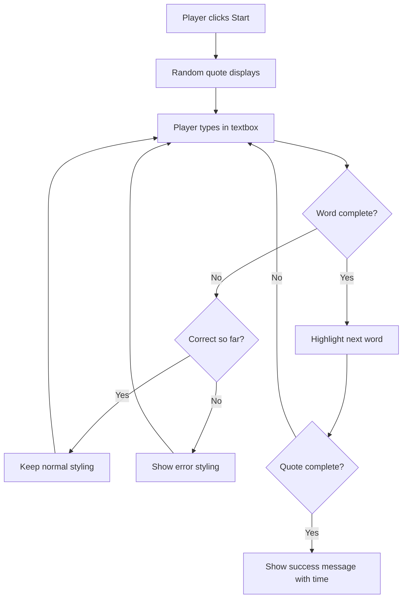
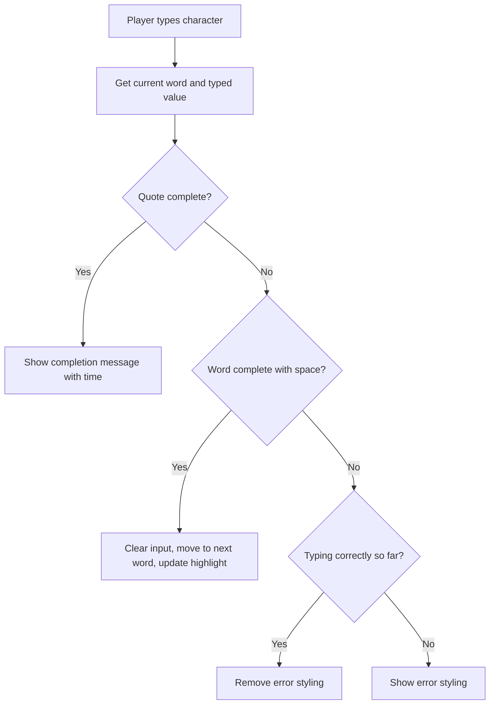

<!--
CO_OP_TRANSLATOR_METADATA:
{
  "original_hash": "e6b75e5b8caae906473a8a09d77b7121",
  "translation_date": "2025-10-24T22:51:33+00:00",
  "source_file": "4-typing-game/typing-game/README.md",
  "language_code": "bg"
}
-->
# Създаване на игра с използване на събития

Чудили ли сте се някога как уебсайтовете разбират, когато кликнете върху бутон или въведете текст в текстово поле? Това е магията на програмирането, базирано на събития! Какъв по-добър начин да научите това основно умение от това да създадете нещо полезно - игра за скорост на писане, която реагира на всяко натискане на клавиш.

Ще видите от първа ръка как уеб браузърите "говорят" с вашия JavaScript код. Всеки път, когато кликнете, пишете или движите мишката, браузърът изпраща малки съобщения (наричаме ги събития) към вашия код, а вие решавате как да реагирате!

Когато приключим, ще сте създали истинска игра за писане, която следи вашата скорост и точност. Още по-важно е, че ще разберете основните концепции, които задвижват всеки интерактивен уебсайт, който някога сте използвали. Да започваме!

## Тест преди лекцията

[Тест преди лекцията](https://ff-quizzes.netlify.app/web/quiz/21)

## Програмиране, базирано на събития

Помислете за любимото си приложение или уебсайт - какво го прави живо и отзивчиво? Всичко е свързано с това как реагира на вашите действия! Всеки натиск, клик, плъзгане или натискане на клавиш създава това, което наричаме "събитие", и именно там се случва истинската магия на уеб разработката.

Ето какво прави програмирането за уеб толкова интересно: никога не знаем кога някой ще кликне върху този бутон или ще започне да пише в текстово поле. Може да кликне веднага, да изчака пет минути или изобщо да не кликне! Тази непредсказуемост означава, че трябва да мислим по различен начин за това как пишем нашия код.

Вместо да пишем код, който се изпълнява отгоре надолу като рецепта, пишем код, който търпеливо чака нещо да се случи. Това е подобно на начина, по който телеграфните оператори през 1800-те години са седели до своите машини, готови да реагират в момента, в който съобщение премине през жицата.

И така, какво точно е "събитие"? Просто казано, това е нещо, което се случва! Когато кликнете върху бутон - това е събитие. Когато напишете буква - това е събитие. Когато движите мишката - това е друго събитие.

Програмирането, базирано на събития, ни позволява да настроим нашия код да слуша и да реагира. Създаваме специални функции, наречени **слушатели на събития**, които търпеливо чакат определени неща да се случат, а след това действат, когато това стане.

Представете си слушателите на събития като звънец за вашия код. Настройвате звънеца (`addEventListener()`), казвате му какъв звук да слуша (като 'click' или 'keypress') и след това определяте какво трябва да се случи, когато някой го натисне (вашата персонализирана функция).

**Ето как работят слушателите на събития:**
- **Слушат** за специфични действия на потребителя като кликвания, натискания на клавиши или движения на мишката
- **Изпълняват** вашия персонализиран код, когато се случи определеното събитие
- **Реагират** незабавно на взаимодействията на потребителя, създавайки безпроблемно изживяване
- **Обработват** множество събития върху един и същ елемент, използвайки различни слушатели

> **NOTE:** Струва си да се подчертае, че има множество начини за създаване на слушатели на събития. Можете да използвате анонимни функции или да създадете именувани. Можете да използвате различни преки пътища, като задаване на свойството `click` или използване на `addEventListener()`. В нашето упражнение ще се фокусираме върху `addEventListener()` и анонимни функции, тъй като това вероятно е най-често използваната техника от уеб разработчиците. Освен това е най-гъвкавата, тъй като `addEventListener()` работи за всички събития, а името на събитието може да бъде предоставено като параметър.

### Често срещани събития

Докато уеб браузърите предлагат десетки различни събития, които можете да слушате, повечето интерактивни приложения разчитат само на няколко основни събития. Разбирането на тези основни събития ще ви даде основа за изграждане на сложни взаимодействия с потребителите.

Има [десетки събития](https://developer.mozilla.org/docs/Web/Events), които можете да слушате, когато създавате приложение. По същество всичко, което потребителят прави на страницата, предизвиква събитие, което ви дава много сила да гарантирате, че те получават желаното изживяване. За щастие, обикновено ще ви трябват само няколко основни събития. Ето някои често срещани (включително двете, които ще използваме при създаването на нашата игра):

| Събитие | Описание | Чести случаи на употреба |
|---------|----------|--------------------------|
| `click` | Потребителят кликна върху нещо | Бутони, линкове, интерактивни елементи |
| `contextmenu` | Потребителят кликна с десния бутон на мишката | Персонализирани контекстни менюта |
| `select` | Потребителят маркира текст | Редактиране на текст, операции за копиране |
| `input` | Потребителят въведе текст | Валидация на формуляри, търсене в реално време |

**Разбиране на тези типове събития:**
- **Активират се**, когато потребителите взаимодействат със специфични елементи на вашата страница
- **Предоставят** подробна информация за действието на потребителя чрез обекти на събития
- **Позволяват** създаването на отзивчиви, интерактивни уеб приложения
- **Работят** последователно на различни браузъри и устройства

## Създаване на играта

Сега, когато разбирате как работят събитията, нека приложим това знание на практика, като създадем нещо полезно. Ще създадем игра за скорост на писане, която демонстрира обработката на събития, докато ви помага да развиете важно умение за разработчици.

Ще създадем игра, за да изследваме как работят събитията в JavaScript. Нашата игра ще тества умението на играча за писане, което е едно от най-недооценените умения, които всички разработчици трябва да имат. Забавен факт: клавиатурната подредба QWERTY, която използваме днес, всъщност е проектирана през 1870-те години за пишещи машини - и добрите умения за писане все още са толкова ценни за програмистите днес! Общият ход на играта ще изглежда така:



**Ето как ще работи нашата игра:**
- **Започва**, когато играчът кликне върху бутона за старт и се показва случайна цитата
- **Проследява** напредъка на играча при писане дума по дума в реално време
- **Подчертава** текущата дума, за да насочи фокуса на играча
- **Осигурява** незабавна визуална обратна връзка за грешки при писане
- **Изчислява** и показва общото време, когато цитатът е завършен

Нека изградим нашата игра и да научим за събитията!

### Структура на файловете

Преди да започнем да кодираме, нека се организираме! Да имате чиста структура на файловете от самото начало ще ви спести главоболия по-късно и ще направи вашия проект по-професионален. 😊

Ще запазим нещата прости с само три файла: `index.html` за структурата на страницата, `script.js` за цялата логика на играта и `style.css`, за да направим всичко да изглежда страхотно. Това е класическото трио, което задвижва повечето уебсайтове!

**Създайте нова папка за вашата работа, като отворите конзола или терминал и изпълните следната команда:**

```bash
# Linux or macOS
mkdir typing-game && cd typing-game

# Windows
md typing-game && cd typing-game
```

**Ето какво правят тези команди:**
- **Създават** нова директория, наречена `typing-game`, за вашите проектни файлове
- **Навигират** автоматично в новосъздадената директория
- **Настройват** чисто работно пространство за разработка на вашата игра

**Отворете Visual Studio Code:**

```bash
code .
```

**Тази команда:**
- **Стартира** Visual Studio Code в текущата директория
- **Отваря** вашата проектна папка в редактора
- **Осигурява** достъп до всички инструменти за разработка, които ще ви трябват

**Добавете три файла към папката във Visual Studio Code със следните имена:**
- `index.html` - Съдържа структурата и съдържанието на вашата игра
- `script.js` - Обработва цялата логика на играта и слушателите на събития
- `style.css` - Определя визуалния вид и стилизацията

## Създаване на потребителския интерфейс

Сега нека изградим сцената, където ще се случи цялото действие на нашата игра! Помислете за това като за проектиране на контролен панел за космически кораб - трябва да се уверим, че всичко, от което играчите ни се нуждаят, е точно там, където го очакват.

Нека разберем какво всъщност ни трябва за нашата игра. Ако играете игра за писане, какво бихте искали да видите на екрана? Ето какво ще ни трябва:

| Елемент на интерфейса | Цел | HTML елемент |
|------------------------|-----|--------------|
| Показване на цитат | Показва текста за писане | `<p>` с `id="quote"` |
| Зона за съобщения | Показва статус и съобщения за успех | `<p>` с `id="message"` |
| Текстово поле | Където играчите пишат цитата | `<input>` с `id="typed-value"` |
| Бутон за старт | Започва играта | `<button>` с `id="start"` |

**Разбиране на структурата на интерфейса:**
- **Организира** съдържанието логично отгоре надолу
- **Присвоява** уникални ID-та на елементите за насочване чрез JavaScript
- **Осигурява** ясна визуална йерархия за по-добро потребителско изживяване
- **Включва** семантични HTML елементи за достъпност

Всеки от тези елементи ще се нуждае от ID, за да можем да работим с тях в нашия JavaScript. Ще добавим и препратки към CSS и JavaScript файловете, които ще създадем.

Създайте нов файл с име `index.html`. Добавете следния HTML:

```html
<!-- inside index.html -->
<html>
<head>
  <title>Typing game</title>
  <link rel="stylesheet" href="style.css">
</head>
<body>
  <h1>Typing game!</h1>
  <p>Practice your typing skills with a quote from Sherlock Holmes. Click **start** to begin!</p>
  <p id="quote"></p> <!-- This will display our quote -->
  <p id="message"></p> <!-- This will display any status messages -->
  <div>
    <input type="text" aria-label="current word" id="typed-value" /> <!-- The textbox for typing -->
    <button type="button" id="start">Start</button> <!-- To start the game -->
  </div>
  <script src="script.js"></script>
</body>
</html>
```

**Разбивка на това, което постига тази HTML структура:**
- **Свързва** CSS стиловия файл в `<head>` за стилизация
- **Създава** ясен заглавие и инструкции за потребителите
- **Установява** резервни параграфи със специфични ID-та за динамично съдържание
- **Включва** текстово поле с атрибути за достъпност
- **Осигурява** бутон за старт, който да задейства играта
- **Зарежда** JavaScript файла в края за оптимална производителност

### Стартиране на приложението

Тестването на вашето приложение често по време на разработка ви помага да откривате проблеми рано и да виждате напредъка си в реално време. Live Server е безценен инструмент, който автоматично обновява вашия браузър, когато запазите промените, правейки разработката много по-ефективна.

Винаги е най-добре да разработвате итеративно, за да видите как изглеждат нещата. Нека стартираме нашето приложение. Има чудесно разширение за Visual Studio Code, наречено [Live Server](https://marketplace.visualstudio.com/items?itemName=ritwickdey.LiveServer&WT.mc_id=academic-77807-sagibbon), което ще хоства вашето приложение локално и ще обновява браузъра всеки път, когато запазите.

**Инсталирайте [Live Server](https://marketplace.visualstudio.com/items?itemName=ritwickdey.LiveServer&WT.mc_id=academic-77807-sagibbon), като следвате линка и кликнете върху Install:**

**Ето какво се случва по време на инсталацията:**
- **Подканва** вашия браузър да отвори Visual Studio Code
- **Насочва** ви през процеса на инсталиране на разширението
- **Може да изисква** рестартиране на Visual Studio Code за завършване на настройката

**След като е инсталиран, във Visual Studio Code натиснете Ctrl-Shift-P (или Cmd-Shift-P), за да отворите командния палет:**

**Разбиране на командния палет:**
- **Осигурява** бърз достъп до всички команди на VS Code
- **Търси** команди, докато пишете
- **Предлага** клавишни комбинации за по-бърза разработка

**Напишете "Live Server: Open with Live Server":**

**Какво прави Live Server:**
- **Стартира** локален сървър за разработка за вашия проект
- **Автоматично** обновява браузъра, когато запазвате файлове
- **Сервира** вашите файлове от локален URL (обикновено `localhost:5500`)

**Отворете браузър и навигирайте до `https://localhost:5500`:**

Сега трябва да видите страницата, която създадохте! Нека добавим малко функционалност.

## Добавяне на CSS

Сега нека направим нещата да изглеждат добре! Визуалната обратна връзка е била от решаващо значение за потребителските интерфейси още от ранните дни на компютрите. През 80-те години изследователите откриха, че незабавната визуална обратна връзка значително подобрява производителността на потребителите и намалява грешките. Точно това ще създадем.

Нашата игра трябва да бъде кристално ясна за това, което се случва. Играчите трябва незабавно да знаят коя дума трябва да напишат, и ако направят грешка, трябва да я видят веднага. Нека създадем някои прости, но ефективни стилизации:

Създайте нов файл с име `style.css` и добавете следния синтаксис.

```css
/* inside style.css */
.highlight {
  background-color: yellow;
}

.error {
  background-color: lightcoral;
  border: red;
}
```

**Разбиране на тези CSS класове:**
- **Подчертава** текущата дума с жълт фон за ясна визуална насока
- **Сигнализира** за грешки при писане със светъл коралов цвят на фона
- **Осигурява** незабавна обратна връзка, без да прекъсва потока на писане на потребителя
- **Използва** контрастни цветове за достъпност и ясна визуална комуникация

✅ Що се отнася до CSS, можете да оформите страницата както ви харесва. Отделете малко време и направете страницата по-привлекателна:

- Изберете различен шрифт
- Оцветете заглавията
- Променете размерите на елементите

## JavaScript

Тук става интересно! 🎉 Имаме структурата на HTML и стилизацията на CSS, но в момента нашата игра е като красива кола без двигател. JavaScript ще бъде този
| Масив от цитати | Съхранява всички възможни цитати за играта | `['Цитат 1', 'Цитат 2', ...]` |
| Масив от думи | Разделя текущия цитат на отделни думи | `['Когато', 'имаш', '...', ...]` |
| Индекс на думата | Следи коя дума пише играчът | `0, 1, 2, 3...` |
| Начално време | Изчислява изминалото време за оценяване | `Date.now()` |

**Ще ни трябват и препратки към елементите на потребителския интерфейс:**
| Елемент | ID | Цел |
|---------|----|-----|
| Текстово поле | `typed-value` | Където играчите пишат |
| Показване на цитат | `quote` | Показва цитата за писане |
| Зона за съобщения | `message` | Показва актуализации на състоянието |

```javascript
// inside script.js
// all of our quotes
const quotes = [
    'When you have eliminated the impossible, whatever remains, however improbable, must be the truth.',
    'There is nothing more deceptive than an obvious fact.',
    'I ought to know by this time that when a fact appears to be opposed to a long train of deductions it invariably proves to be capable of bearing some other interpretation.',
    'I never make exceptions. An exception disproves the rule.',
    'What one man can invent another can discover.',
    'Nothing clears up a case so much as stating it to another person.',
    'Education never ends, Watson. It is a series of lessons, with the greatest for the last.',
];
// store the list of words and the index of the word the player is currently typing
let words = [];
let wordIndex = 0;
// the starting time
let startTime = Date.now();
// page elements
const quoteElement = document.getElementById('quote');
const messageElement = document.getElementById('message');
const typedValueElement = document.getElementById('typed-value');
```

**Разглеждане на това, което прави този код за настройка:**
- **Съхранява** масив от цитати на Шерлок Холмс, използвайки `const`, тъй като цитатите няма да се променят
- **Инициализира** променливи за проследяване с `let`, тъй като тези стойности ще се актуализират по време на игра
- **Улавя** препратки към DOM елементи, използвайки `document.getElementById()` за ефективен достъп
- **Настройва** основата за цялата функционалност на играта с ясни, описателни имена на променливи
- **Организира** свързани данни и елементи логично за по-лесна поддръжка на кода

✅ Добавете още цитати към вашата игра

> 💡 **Полезен съвет**: Можем да извличаме елементите, когато пожелаем в кода, използвайки `document.getElementById()`. Тъй като често ще се обръщаме към тези елементи, ще избегнем грешки при изписването на низове, като използваме константи. Фреймуъркове като [Vue.js](https://vuejs.org/) или [React](https://reactjs.org/) могат да ви помогнат да управлявате по-добре централизирането на вашия код.
>
**Защо този подход работи толкова добре:**
- **Предотвратява** правописни грешки при многократно използване на елементи
- **Подобрява** четимостта на кода с описателни имена на константи
- **Позволява** по-добра поддръжка от IDE с автоматично допълване и проверка за грешки
- **Улеснява** рефакторинга, ако идентификаторите на елементите се променят по-късно

Отделете минута, за да гледате видео за използването на `const`, `let` и `var`

[](https://youtube.com/watch?v=JNIXfGiDWM8 "Видове променливи")

> 🎥 Кликнете върху изображението по-горе за видео за променливите.

### Добавяне на логика за стартиране

Тук всичко се събира на едно място! 🚀 Сега ще напишете първия си истински слушател на събития, и има нещо много удовлетворяващо в това да видите как вашият код реагира на натискане на бутон.

Помислете: някъде там играч ще натисне бутона "Старт", и вашият код трябва да е готов за него. Нямаме представа кога ще го натисне - може да е веднага, може да е след като си вземе кафе - но когато го направи, вашата игра оживява.

Когато потребителят натисне `start`, трябва да изберем цитат, да настроим потребителския интерфейс и да подготвим проследяването за текущата дума и времето. По-долу е JavaScript кодът, който трябва да добавите; ще го обсъдим веднага след блока със скрипта.

```javascript
// at the end of script.js
document.getElementById('start').addEventListener('click', () => {
  // get a quote
  const quoteIndex = Math.floor(Math.random() * quotes.length);
  const quote = quotes[quoteIndex];
  // Put the quote into an array of words
  words = quote.split(' ');
  // reset the word index for tracking
  wordIndex = 0;

  // UI updates
  // Create an array of span elements so we can set a class
  const spanWords = words.map(function(word) { return `<span>${word} </span>`});
  // Convert into string and set as innerHTML on quote display
  quoteElement.innerHTML = spanWords.join('');
  // Highlight the first word
  quoteElement.childNodes[0].className = 'highlight';
  // Clear any prior messages
  messageElement.innerText = '';

  // Setup the textbox
  // Clear the textbox
  typedValueElement.value = '';
  // set focus
  typedValueElement.focus();
  // set the event handler

  // Start the timer
  startTime = new Date().getTime();
});
```

**Нека разделим кода на логически секции:**

**📊 Настройка за проследяване на думи:**
- **Избира** случаен цитат, използвайки `Math.floor()` и `Math.random()` за разнообразие
- **Конвертира** цитата в масив от отделни думи, използвайки `split(' ')`
- **Нулира** `wordIndex` на 0, тъй като играчите започват с първата дума
- **Подготвя** състоянието на играта за нов рунд

**🎨 Настройка и показване на потребителския интерфейс:**
- **Създава** масив от `<span>` елементи, обгръщайки всяка дума за индивидуално стилизиране
- **Обединява** елементите span в един низ за ефективно обновяване на DOM
- **Подчертава** първата дума, като добавя CSS клас `highlight`
- **Изчиства** всички предишни съобщения от играта, за да осигури чисто начало

**⌨️ Подготовка на текстовото поле:**
- **Изчиства** всякакъв съществуващ текст в полето за въвеждане
- **Фокусира** текстовото поле, за да могат играчите да започнат да пишат веднага
- **Подготвя** зоната за въвеждане за нова игрова сесия

**⏱️ Инициализация на таймера:**
- **Улавя** текущия времеви отпечатък, използвайки `new Date().getTime()`
- **Позволява** точно изчисление на скоростта на писане и времето за завършване
- **Започва** проследяването на производителността за игровата сесия

### Добавяне на логика за писане

Тук се справяме със сърцето на нашата игра! Не се притеснявайте, ако това изглежда много в началото - ще преминем през всяка част, и накрая ще видите колко логично е всичко.

Това, което изграждаме тук, е доста сложно: всеки път, когато някой напише буква, нашият код ще проверява какво е написано, ще дава обратна връзка и ще решава какво трябва да се случи след това. Това е подобно на начина, по който ранните текстови процесори като WordStar през 70-те години предоставяха обратна връзка в реално време на пишещите.

```javascript
// at the end of script.js
typedValueElement.addEventListener('input', () => {
  // Get the current word
  const currentWord = words[wordIndex];
  // get the current value
  const typedValue = typedValueElement.value;

  if (typedValue === currentWord && wordIndex === words.length - 1) {
    // end of sentence
    // Display success
    const elapsedTime = new Date().getTime() - startTime;
    const message = `CONGRATULATIONS! You finished in ${elapsedTime / 1000} seconds.`;
    messageElement.innerText = message;
  } else if (typedValue.endsWith(' ') && typedValue.trim() === currentWord) {
    // end of word
    // clear the typedValueElement for the new word
    typedValueElement.value = '';
    // move to the next word
    wordIndex++;
    // reset the class name for all elements in quote
    for (const wordElement of quoteElement.childNodes) {
      wordElement.className = '';
    }
    // highlight the new word
    quoteElement.childNodes[wordIndex].className = 'highlight';
  } else if (currentWord.startsWith(typedValue)) {
    // currently correct
    // highlight the next word
    typedValueElement.className = '';
  } else {
    // error state
    typedValueElement.className = 'error';
  }
});
```

**Разбиране на потока на логиката за писане:**

Тази функция използва подход на водопад, проверявайки условията от най-специфичното към най-общото. Нека разгледаме всеки сценарий:



**🏁 Завършен цитат (Сценарий 1):**
- **Проверява** дали въведената стойност съвпада с текущата дума И сме на последната дума
- **Изчислява** изминалото време, като изважда началното време от текущото време
- **Конвертира** милисекунди в секунди, като дели на 1,000
- **Показва** поздравително съобщение с времето за завършване

**✅ Завършена дума (Сценарий 2):**
- **Открива** завършване на дума, когато въведеното завършва с интервал
- **Проверява** дали подрязаният вход съвпада точно с текущата дума
- **Изчиства** полето за въвеждане за следващата дума
- **Преминава** към следващата дума, като увеличава `wordIndex`
- **Обновява** визуалното подчертаване, като премахва всички класове и подчертава новата дума

**📝 Напредък в писането (Сценарий 3):**
- **Проверява** дали текущата дума започва с това, което е написано досега
- **Премахва** всякакво стилизиране на грешки, за да покаже, че входът е правилен
- **Позволява** продължаване на писането без прекъсване

**❌ Състояние на грешка (Сценарий 4):**
- **Задейства** се, когато въведеният текст не съвпада с началото на очакваната дума
- **Прилага** CSS клас за грешка, за да предостави незабавна визуална обратна връзка
- **Помага** на играчите бързо да идентифицират и коригират грешките

## Тествайте вашето приложение

Вижте какво сте постигнали! 🎉 Току-що изградихте истинска, работеща игра за писане от нулата, използвайки програмиране, базирано на събития. Отделете момент, за да оцените това - това не е малко постижение!

Сега идва фазата на тестване! Ще работи ли както се очаква? Пропуснахме ли нещо? Ето какво: ако нещо не работи перфектно веднага, това е напълно нормално. Дори опитни разработчици редовно откриват грешки в своя код. Това е част от процеса на разработка!

Кликнете върху `start` и започнете да пишете! Трябва да изглежда малко като анимацията, която видяхме преди.


**Какво да тествате във вашето приложение:**
- **Проверява** дали натискането на Start показва случаен цитат
- **Потвърждава** дали писането правилно подчертава текущата дума
- **Проверява** дали стилизирането на грешки се появява при неправилно писане
- **Уверява** се, че завършването на думите правилно премества подчертаването
- **Тества** дали завършването на цитата показва съобщение за завършване с време

**Често срещани съвети за отстраняване на грешки:**
- **Проверете** конзолата на браузъра (F12) за грешки в JavaScript
- **Уверете се**, че всички имена на файлове съвпадат точно (чувствителни към малки и големи букви)
- **Уверете се**, че Live Server работи и се обновява правилно
- **Тествайте** различни цитати, за да проверите дали случайният избор работи

---

## Предизвикателство GitHub Copilot Agent 🎮

Използвайте режим Agent, за да завършите следното предизвикателство:

**Описание:** Разширете играта за писане, като внедрите система за трудност, която се адаптира към представянето на играча. Това предизвикателство ще ви помогне да практикувате напреднало управление на събития, анализ на данни и динамични актуализации на потребителския интерфейс.

**Задача:** Създайте система за регулиране на трудността за играта за писане, която:
1. Проследява скоростта на писане на играча (думи в минута) и процента на точност
2. Автоматично се адаптира към три нива на трудност: Лесно (прости цитати), Средно (текущи цитати), Трудно (сложни цитати с пунктуация)
3. Показва текущото ниво на трудност и статистиката на играча в потребителския интерфейс
4. Внедрява брояч на поредици, който увеличава трудността след 3 последователни добри представяния
5. Добавя визуална обратна връзка (цветове, анимации), за да посочи промените в трудността

Добавете необходимите HTML елементи, CSS стилове и JavaScript функции, за да внедрите тази функция. Включете подходящо обработване на грешки и се уверете, че играта остава достъпна с подходящи ARIA етикети.

Научете повече за [режим Agent](https://code.visualstudio.com/blogs/2025/02/24/introducing-copilot-agent-mode) тук.

## 🚀 Предизвикателство

Готови ли сте да издигнете играта си за писане на следващо ниво? Опитайте да внедрите тези напреднали функции, за да задълбочите разбирането си за управление на събития и манипулация на DOM:

**Добавете повече функционалност:**

| Функция | Описание | Умения, които ще практикувате |
|---------|----------|-----------------------------|
| **Контрол на входа** | Деактивирайте слушателя на събития `input` при завършване и го активирайте отново, когато бутонът бъде натиснат | Управление на събития и контрол на състоянието |
| **Управление на състоянието на UI** | Деактивирайте текстовото поле, когато играчът завърши цитата | Манипулация на свойства на DOM |
| **Модален диалог** | Показване на модален диалогов прозорец със съобщение за успех | Напреднали UI модели и достъпност |
| **Система за високи резултати** | Съхранявайте високи резултати, използвайки `localStorage` | API за съхранение в браузъра и устойчивост на данни |

**Съвети за внедряване:**
- **Проучете** `localStorage.setItem()` и `localStorage.getItem()` за устойчиво съхранение
- **Практикувайте** добавяне и премахване на слушатели на събития динамично
- **Изследвайте** HTML елементи за диалог или CSS модели за модални прозорци
- **Обмислете** достъпността при деактивиране и активиране на контролите на формата

## Тест след лекцията

[Тест след лекцията](https://ff-quizzes.netlify.app/web/quiz/22)

## Преглед и самостоятелно обучение

Прочетете за [всички налични събития](https://developer.mozilla.org/docs/Web/Events), които разработчикът може да използва чрез уеб браузъра, и обмислете сценариите, в които бихте използвали всяко от тях.

## Задание

[Създайте нова игра с клавиатура](assignment.md)

---

**Отказ от отговорност**:  
Този документ е преведен с помощта на AI услуга за превод [Co-op Translator](https://github.com/Azure/co-op-translator). Въпреки че се стремим към точност, моля, имайте предвид, че автоматизираните преводи може да съдържат грешки или неточности. Оригиналният документ на неговия роден език трябва да се счита за авторитетен източник. За критична информация се препоръчва професионален човешки превод. Ние не носим отговорност за каквито и да е недоразумения или погрешни интерпретации, произтичащи от използването на този превод.