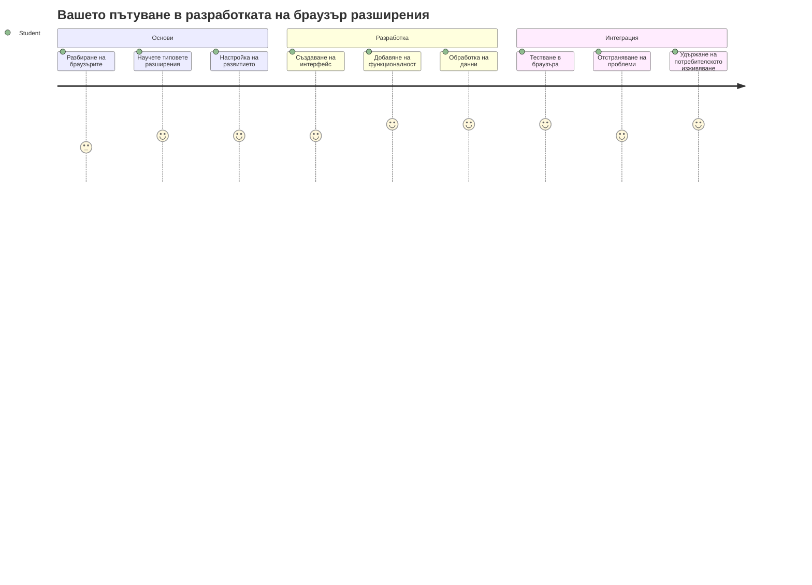
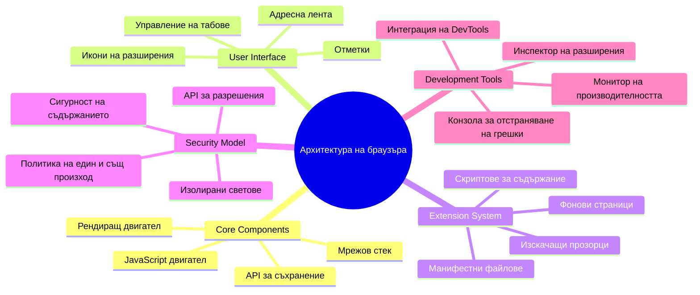
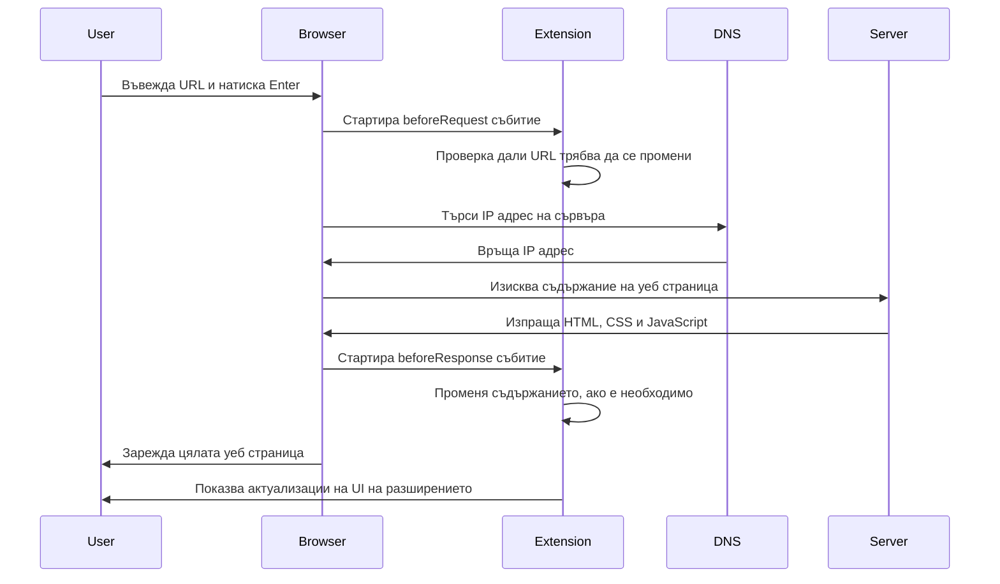
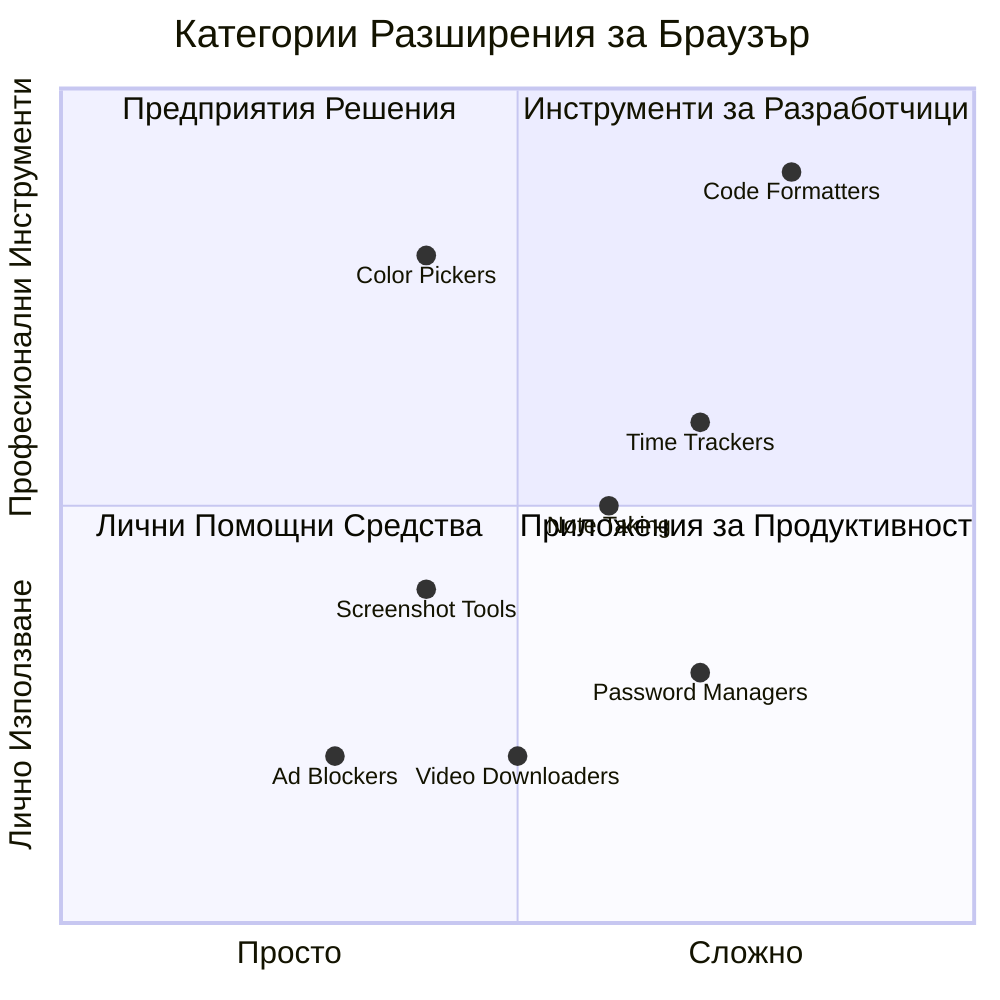
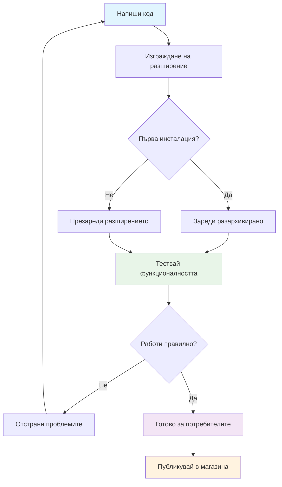
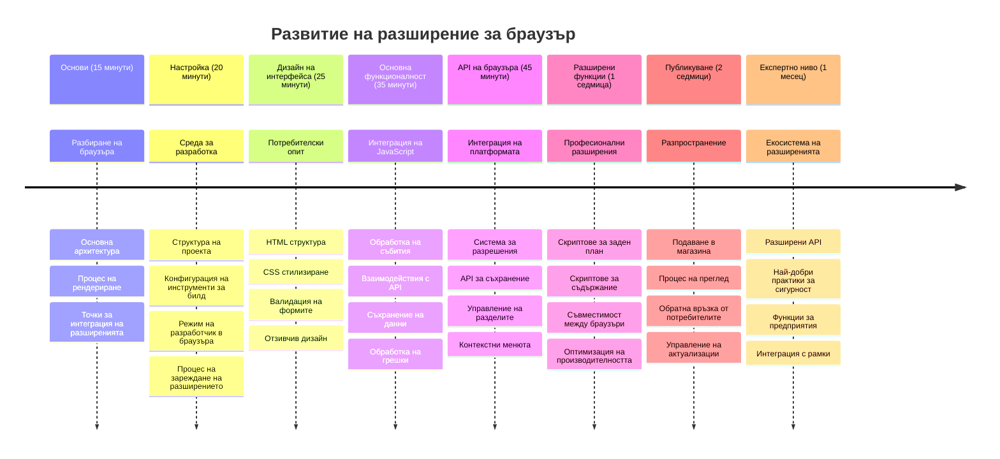

<!--
CO_OP_TRANSLATOR_METADATA:
{
  "original_hash": "00aa85715e1efd4930c17a23e3012e69",
  "translation_date": "2026-01-07T07:00:25+00:00",
  "source_file": "5-browser-extension/1-about-browsers/README.md",
  "language_code": "bg"
}
-->
# Проект за разширение на браузър Част 1: Всичко за браузърите



> Бележка от [Wassim Chegham](https://dev.to/wassimchegham/ever-wondered-what-happens-when-you-type-in-a-url-in-an-address-bar-in-a-browser-3dob)

## Пред-лекционен тест

[Пред-лекционен тест](https://ff-quizzes.netlify.app/web/quiz/23)

### Въведение

Разширенията за браузър са мини-приложения, които подобряват вашето сърфиране в интернет. Подобно на оригиналната визия на Тим Бърнърс-Лий за интерактивен уеб, разширенията разширяват възможностите на браузъра отвъд просто показване на документи. От мениджъри на пароли, които пазят вашите акаунти в безопасност, до инструменти за избор на цветове, които помагат на дизайнерите да вземат перфектния нюанс — разширенията решават ежедневни предизвикателства при сърфиране.

Преди да създадем първото ви разширение, нека разберем как работят браузърите. Точно както Александър Греъм Бел трябваше да разбере предаването на звук, преди да изобрети телефона, познаването на основите на браузърите ще ви помогне да създавате разширения, които се интегрират безпроблемно със съществуващите браузърни системи.

В края на този урок ще разберете архитектурата на браузъра и ще започнете да изграждате първото си разширение.


## Разбиране на уеб браузърите

Уеб браузърът е по същество сложен интерпретатор на документи. Когато напишете "google.com" в адресната лента, браузърът извършва сложна поредица от операции - заявявайки съдържание от сървъри по целия свят, след което анализира и визуализира този код в интерактивните уеб страници, които виждате.

Този процес отразява начина, по който първият уеб браузър, WorldWideWeb, беше проектиран от Тим Бърнърс-Лий през 1990 г., за да направи хипервръзки достъпни за всеки.

✅ **Малко история**: Първият браузър се казваше 'WorldWideWeb' и беше създаден от сър Тимъти Бърнърс-Лий през 1990 г.


> Някои ранни браузъри, чрез [Karen McGrane](https://www.slideshare.net/KMcGrane/week-4-ixd-history-personal-computing)

### Как браузърите обработват уеб съдържание

Процесът от въвеждането на URL до гледането на уеб страница включва няколко координирани стъпки, които се случват за секунди:


**Ето какво осъществява този процес:**
- **Превежда** URL адреса, разбираем за хората, в IP адрес на сървър чрез DNS заявка
- **Установява** сигурна връзка със уеб сървъра чрез HTTP или HTTPS протоколи
- **Заявява** конкретното съдържание на уеб страницата от сървъра
- **Получава** HTML маркиране, CSS стилизиране и JavaScript код от сървъра
- **Визуализира** цялото съдържание като интерактивна уеб страница, която виждате

### Основни функции на браузъра

Съвременните браузъри предлагат множество функции, които разработчиците на разширения могат да използват:

| Функция | Цел | Възможности за разширения |
|---------|---------|------------------------|
| **Рендеринг енджин** | Показва HTML, CSS и JavaScript | Модификация на съдържание, вмъкване на стилове |
| **JavaScript енджин** | Изпълнява JavaScript код | Потребителски скриптове, взаимодействие с API |
| **Локално съхранение** | Запазва данни локално | Потребителски настройки, кеширани данни |
| **Мрежова стека** | Обработва уеб заявки | Мониторинг на заявки, анализ на данни |
| **Модел за сигурност** | Защитава потребителите от злонамерено съдържание | Филтриране на съдържание, подобряване на сигурността |

**Разбирането на тези функции ви помага:**
- **Идентифицирате** къде вашето разширение може да добави най-голяма стойност
- **Избирате** правилните браузърни API-та за функционалността на вашето разширение
- **Проектирате** разширения, които работят ефективно с браузърните системи
- **Осигурявате** спазването на най-добрите практики за сигурност на браузъра

### Съображения при разработка за различни браузъри

Различните браузъри прилагат стандартите с леки вариации, подобно на това как различни програмни езици може да обработват един и същи алгоритъм по различен начин. Chrome, Firefox и Safari имат уникални характеристики, които разработчиците трябва да имат предвид при създаване на разширения.

> 💡 **Съвет от професионалист**: Използвайте [caniuse.com](https://www.caniuse.com), за да проверите кои уеб технологии се поддържат в отделните браузъри. Това е безценно при планиране на функциите на разширението ви!

**Ключови съображения за разработка на разширения:**
- **Тествайте** разширението си в Chrome, Firefox и Edge
- **Адаптирайте** се към различни браузърни API-та и формати на манифест
- **Обработвайте** различни характеристики на производителността и ограничения
- **Осигурявайте** резервни решения за браузърно-специфични функции, които може да не са достъпни

✅ **Аналитично наблюдение**: Можете да определите кои браузъри предпочитат вашите потребители, като инсталирате аналитични пакети в своите уеб проекти. Тези данни помагат да приоритизирате подкрепата за определени браузъри.

## Разбиране на разширенията за браузър

Разширенията за браузър решават често срещани проблеми при сърфиране, като добавят функционалност директно към интерфейса на браузъра. Вместо да изискват отделни приложения или сложни работни потоци, разширенията предоставят незабавен достъп до инструменти и функции.

Това е концепция, която отразява визията на ранните пионери в компютърната област като Дъглас Енгелбарт да увеличат човешките възможности чрез технология — разширенията увеличават базовата функционалност на вашия браузър.


**Популярни категории разширения и техните предимства:**
- **Инструменти за продуктивност**: Мениджъри на задачи, приложения за водене на бележки и тракери за време, които помагат за по-добра организация
- **Подобрения в сигурността**: Мениджъри на пароли, блокиращи реклами, инструменти за защита на поверителността, които пазят вашите данни
- **Инструменти за разработчици**: Форматори на код, инструменти за избор на цветове и дебъгинг, които улесняват разработката
- **Подобрения на съдържанието**: Режими за четене, изтеглящи видео файлове и инструменти за екранни снимки, които подобряват изживяването при сърфиране

✅ **Въпрос за размисъл**: Кои са любимите ви разширения за браузър? Какви конкретни задачи изпълняват и как подобряват сърфирането ви?

### 🔄 **Педагогически проверка**
**Разбиране на архитектурата на браузърите**: Преди да преминете към разработка на разширения, уверете се, че можете:
- ✅ Да обясните как браузърите обработват уеб заявки и визуализират съдържание
- ✅ Да идентифицирате основните компоненти на архитектурата на браузъра
- ✅ Да разберете как разширенията се интегрират с функционалността на браузъра
- ✅ Да познавате модела за сигурност, който защитава потребителите

**Бърз самотест**: Можете ли да проследите пътя от въвеждането на URL до показването на уеб страница?
1. **DNS заявка** превръща URL в IP адрес
2. **HTTP заявка** извлича съдържание от сървъра
3. **Анализ** обработва HTML, CSS и JavaScript
4. **Рендериране** показва крайния уебсайт
5. **Разширенията** могат да модифицират съдържание на няколко етапа

## Инсталиране и управление на разширения

Разбирането на процеса по инсталация на разширения помага да предвидите потребителското изживяване при инсталиране на вашето разширение. Този процес е стандартизиран във всички съвременни браузъри, с малки различия в дизайна на интерфейса.


> **Важно**: Уверете се, че сте активирали режим за разработчици и разрешили разширения от други магазини, когато тествате собствените си разширения.

### Процес на инсталиране на разширения по време на разработка

Когато разработвате и тествате своите разширения, следвайте тази последователност:


```bash
# Стъпка 1: Създайте вашето разширение
npm run build
```

**Ето какво постига тази команда:**
- **Компилира** изходния ви код в готови за браузър файлове
- **Пакетира** JavaScript модулите в оптимизирани пакети
- **Генерира** окончателните файлове на разширението в папката `/dist`
- **Подготвя** разширението ви за инсталация и тестване

**Стъпка 2: Навигирайте до разширения на браузъра**
1. **Отворете** страницата за управление на разширенията в браузъра
2. **Щракнете** бутона "Настройки и още" (иконата `...`) в горния десен ъгъл
3. **Изберете** "Разширения" от падащото меню

**Стъпка 3: Зареждане на разширението**
- **За нова инсталация**: Изберете `load unpacked` и посочете папката `/dist`
- **За ъпдейти**: Щракнете `reload` до вече инсталирано разширение
- **За тестване**: Активирайте "Режим за разработчици" за достъп до по-дълбоки функции за дебъгинг

### Инсталиране на разширения в продукция

> ✅ **Забележка**: Тези инструкции за разработка са предназначени за разширения, които сами създавате. За инсталиране на публикувани разширения, посетете официалните магазини за разширения, като [Microsoft Edge Add-ons store](https://microsoftedge.microsoft.com/addons/Microsoft-Edge-Extensions-Home).

**Разбиране на разликата:**
- **Разработващи инсталации** позволяват тестване на непубликувани разширения по време на разработка
- **Инсталации от магазина** предлагат проверени, публикувани разширения с автоматични ъпдейти
- **Сайдлоудинг** позволява инсталиране на разширения от външни източници (изисква режим за разработчици)

## Създаване на разширението за въглеродния отпечатък

Ще създадем разширение за браузър, което показва въглеродния отпечатък от енергопотреблението във вашия регион. Този проект демонстрира основни концепции за разработка на разширения, докато създава практичен инструмент за екологично съзнание.

Този подход следва принципа "учене чрез правене", доказано ефективен от образователните теории на Джон Дюи - комбиниране на технически умения със значими приложения в реалния свят.

### Изисквания към проекта

Преди да започнете разработката, нека съберем необходимите ресурси и зависимости:

**Изискван достъп до API:**
- **[API ключ за CO2 Signal](https://www.co2signal.com/)**: Въведете своя имейл адрес, за да получите безплатния си ключ
- **[Код на регион](http://api.electricitymap.org/v3/zones)**: Намерете кода на своя регион в [Electricity Map](https://www.electricitymap.org/map) (например, Бостън използва 'US-NEISO')

**Инструменти за разработка:**
- **[Node.js и NPM](https://www.npmjs.com)**: Инструменти за управление на пакети за инсталиране на зависимости
- **[Начален код](../../../../5-browser-extension/start)**: Изтеглете папка `start`, за да започнете разработката

✅ **Научете повече**: Подобрете уменията си за управление на пакети с този [изчерпателен Learn модул](https://docs.microsoft.com/learn/modules/create-nodejs-project-dependencies/?WT.mc_id=academic-77807-sagibbon)

### Разбиране на структурата на проекта

Разбирането на структурата на проекта помага за ефективна организация на разработката. Подобно на това как Александрийската библиотека беше организирана за лесен достъп до знание, добре структурирана кодова база прави разработката по-ефективна:

```
project-root/
├── dist/                    # Built extension files
│   ├── manifest.json        # Extension configuration
│   ├── index.html           # User interface markup
│   ├── background.js        # Background script functionality
│   └── main.js              # Compiled JavaScript bundle
├── src/                     # Source development files
│   └── index.js             # Your main JavaScript code
├── package.json             # Project dependencies and scripts
└── webpack.config.js        # Build configuration
```

**Разглобяване на функционалността на всеки файл:**
- **`manifest.json`**: **Дефинира** метаданните на разширението, разрешенията и входните точки
- **`index.html`**: **Създава** потребителския интерфейс, който се появява при клик върху разширението
- **`background.js`**: **Обработва** фонови задачи и слушатели на събития на браузъра
- **`main.js`**: **Съдържа** окончателния пакет JavaScript след процеса на компилация
- **`src/index.js`**: **Кодира** основния код за разработка, който се компилира в `main.js`

> 💡 **Съвет за организация**: Запишете своя API ключ и регионалния код в сигурна бележка за лесен достъп по време на разработка. Тези данни ще са ви необходими за тестване на функционалността на разширението.

✅ **Съвет за сигурност**: Никога не вкарвайте API ключове или чувствителни данни в хранилището на кода. Ще ви покажем как да ги управлявате сигурно в следващите стъпки.

## Създаване на интерфейса на разширението

Сега ще изградим компонентите на потребителския интерфейс. Разширението използва двусекционен подход: екран за конфигурация при първоначална настройка и екран с резултати за показване на данни.

Това следва принципа за прогресивно разкриване, използван в дизайна на интерфейси още от ранните компютърни дни - разкриване на информация и опции в логична последователност, за да не се претоварват потребителите.

### Преглед на изгледите на разширението

**Екран за настройка** - Конфигурация при първото използване:


**Екран с резултати** - Показване на данните за въглеродния отпечатък:


### Изграждане на формата за конфигурация

Формата за настройка събира данни от потребителя при първото използване. След конфигурация, тази информация се запазва в браузърното хранилище за бъдещи сесии.

Във файла `/dist/index.html` добавете тази структура на формата:

```html
<form class="form-data" autocomplete="on">
    <div>
        <h2>New? Add your Information</h2>
    </div>
    <div>
        <label for="region">Region Name</label>
        <input type="text" id="region" required class="region-name" />
    </div>
    <div>
        <label for="api">Your API Key from tmrow</label>
        <input type="text" id="api" required class="api-key" />
    </div>
    <button class="search-btn">Submit</button>
</form>
```

**Ето какво осигурява тази форма:**
- **Създава** семантична структура с подходящи етикети и асоциации на полета
- **Активира** функциите за автоматично довършване на браузъра за подобрено потребителско изживяване
- **Изисква** попълване на всички полета преди подаване чрез атрибута `required`
- **Организира** полетата с описателни имена на класове за лесна стилизация и JavaScript насочване
- **Предоставя** ясни инструкции за потребителите, които настройват разширението за първи път

### Изграждане на екран за показване на резултати

След това създайте областта за резултати, която ще показва данните за въглеродния отпечатък. Добавете този HTML под формата:

```html
<div class="result">
    <div class="loading">loading...</div>
    <div class="errors"></div>
    <div class="data"></div>
    <div class="result-container">
        <p><strong>Region: </strong><span class="my-region"></span></p>
        <p><strong>Carbon Usage: </strong><span class="carbon-usage"></span></p>
        <p><strong>Fossil Fuel Percentage: </strong><span class="fossil-fuel"></span></p>
    </div>
    <button class="clear-btn">Change region</button>
</div>
```

**Разчленяване на предоставената структура:**
- **`loading`**: **Показва** съобщение за зареждане, докато се извличат данни от API
- **`errors`**: **Показва** съобщения за грешки при неуспешни API заявки или невалидни данни
- **`data`**: **Съдържа** сурови данни за целите на дебъгинг по време на разработка
- **`result-container`**: **Презентира** форматирана информация за въглеродния отпечатък на потребителите
- **`clear-btn`**: **Позволява** на потребителите да променят своя регион и да пре-конфигурират разширението

### Настройване на процеса за компилация

Сега нека инсталираме зависимостите на проекта и тестваме процеса на компилация:

```bash
npm install
```

**Какво постигаме с този процес на инсталация:**
- **Изтегля** Webpack и други зависимости за разработка, посочени в `package.json`
- **Конфигурира** инструментариума за компилиране на съвременен JavaScript
- **Подготвя** средата за разработка за изграждане и тестване на разширение
- **Позволява** пакетиране на код, оптимизация и съвместимост с различни браузъри

> 💡 **Информация за процеса на компилация**: Webpack пакетира вашия изходен код от `/src/index.js` в `/dist/main.js`. Този процес оптимизира кода за продукция и осигурява съвместимост с браузърите.

### Тестване на напредъка

В този момент можете да тествате разширението си:
1. **Изпълнете** командата за билд, за да компилирате кода си  
2. **Заредете** разширението в браузъра си, като използвате режим за разработчици  
3. **Проверете**, че формата се показва правилно и изглежда професионално  
4. **Уверете се**, че всички елементи на формата са правилно подравнени и функционални  

**Какво сте постигнали:**  
- **Построихте** основната HTML структура за вашето разширение  
- **Създадохте** интерфейси за конфигурация и резултати с правилна семантична маркировка  
- **Настроихте** съвременен работен процес с използване на индустриални инструменти  
- **Подготвихте** основата за добавяне на интерактивна JavaScript функционалност  

### 🔄 **Педагогическа проверка**  
**Прогрес в разработката на разширение**: Проверете разбирането си преди да продължите:  
- ✅ Можете ли да обясните предназначението на всеки файл в структурата на проекта?  
- ✅ Разбирате ли как процесът на билд превръща изходния ви код?  
- ✅ Защо разделяме конфигурацията и резултатите в различни UI секции?  
- ✅ Как структурата на формата поддържа както удобство за ползване, така и достъпност?  

**Разбиране на работния процес на разработка**: Вече би трябвало да можете да:  
1. **Модифицирате** HTML и CSS за интерфейса на разширението си  
2. **Изпълните** командата за билд, за да компилирате промените  
3. **Презаредите** разширението в браузъра, за да тествате актуализациите  
4. **Отстранявате грешки** с помощта на инструментите за разработчици на браузъра  

Завършихте първия етап от разработката на браузърно разширение. Както братята Райт първо трябваше да разберат аеродинамиката преди да постигнат полет, така и разбирането на тези основни концепции ви подготвя за изграждане на по-сложни интерактивни функции в следващия урок.  

## GitHub Copilot Agent Challenge 🚀  

Използвайте режим Agent, за да изпълните следното предизвикателство:  

**Описание:** Подобрете браузърното разширение, като добавите валидиране на формата и функции за обратна връзка към потребителя, за да подобрите потребителския опит при въвеждане на API ключове и регионални кодове.  

**Подсказка:** Създайте JavaScript функции за валидиране, които проверяват дали полето за API ключ съдържа поне 20 знака и дали регионалният код е във верния формат (като 'US-NEISO'). Добавете визуална обратна връзка чрез промяна на цвета на рамката на полето в зелено за валидни и в червено за невалидни стойности. Също добавете функция за превключване на видимостта на API ключа за целите на сигурността.  

Научете повече за [режим agent](https://code.visualstudio.com/blogs/2025/02/24/introducing-copilot-agent-mode) тук.  

## 🚀 Предизвикателство  

Разгледайте магазин за браузърни разширения и инсталирайте едно в браузъра си. Можете да разгледате файловете му по интересни начини. Какво откривате?  

## Квиз след лекцията  

[Квиз след лекцията](https://ff-quizzes.netlify.app/web/quiz/24)  

## Преглед и самостоятелно изучаване  

В този урок научихте малко за историята на уеб браузъра; използвайте тази възможност да научите повече за начина, по който изобретателите на Световната мрежа са си представяли нейното използване, като прочетете повече за историята ѝ. Някои полезни сайтове включват:  

[История на уеб браузърите](https://www.mozilla.org/firefox/browsers/browser-history/)  

[История на уеб](https://webfoundation.org/about/vision/history-of-the-web/)  

[Интервю с Тим Бърнърс-Ли](https://www.theguardian.com/technology/2019/mar/12/tim-berners-lee-on-30-years-of-the-web-if-we-dream-a-little-we-can-get-the-web-we-want)  

### ⚡ **Какво можете да направите през следващите 5 минути**  
- [ ] Отворете страницата с разширения на Chrome/Edge (chrome://extensions) и разгледайте инсталираните разширения  
- [ ] Разгледайте раздела Network в DevTools на браузъра си докато зареждате уеб страница  
- [ ] Опитайте да видите източника на страницата (Ctrl+U), за да видите HTML структурата  
- [ ] Инспектирайте всеки елемент на уеб страницата и модифицирайте CSS в DevTools  

### 🎯 **Какво можете да постигнете този час**  
- [ ] Завършете пост-урочния квиз и разберете основите на браузъра  
- [ ] Създайте базов manifest.json файл за браузърно разширение  
- [ ] Постройте просто разширение "Hello World" с изскачащ прозорец  
- [ ] Тествайте зареждането на разширението в режим разработчик  
- [ ] Разгледайте документацията за разширенията на таргетирания браузър  

### 📅 **Вашето пътешествие с разширения през седмицата**  
- [ ] Завършете функционално браузърно разширение с реална полезност  
- [ ] Научете за content scripts, background scripts и popup взаимодействия  
- [ ] Овладейте браузърни API-та като storage, tabs и messaging  
- [ ] Проектирайте потребителски приятелски интерфейси за разширението  
- [ ] Тествайте разширението върху различни сайтове и сценарии  
- [ ] Публикувайте разширението в магазина за браузърни разширения  

### 🌟 **Вашето месечно развитие на браузърни приложения**  
- [ ] Създайте множество разширения, които решават различни потребителски проблеми  
- [ ] Научете напреднали браузърни API-та и най-добри практики за сигурност  
- [ ] Допринасяйте в проекти за отворен код за браузърни разширения  
- [ ] Овладейте кръстосана съвместимост между браузъри и прогресивно подобрение  
- [ ] Създавайте инструменти и шаблони за разработка на разширения за други разработчици  
- [ ] Станете експерт по браузърни разширения, който подпомага други разработчици  

## 🎯 Вашият график за овладяване на браузърни разширения  


### 🛠️ Обобщение на вашия набор от инструменти за разработка на разширение  

След като завършихте този урок, вече имате:  
- **Знания за архитектура на браузъра**: Разбиране на рендеринг двигателя, модели за сигурност и интеграция на разширения  
- **Работна среда за разработка**: Модерен инструментариум с Webpack, NPM и възможности за дебъгване  
- **Основи на UI/UX**: Семантична HTML структура с модели за прогресивно разкриване  
- **Осъзнатост за сигурността**: Разбиране на разрешенията на браузъра и практики за безопасна разработка  
- **Концепции за крос-браузърност**: Знания за съвместимост и подходи за тестване  
- **Интеграция на API-та**: Основа за работа с външни източници на данни  
- **Професионален работен процес**: Стандартизирани процедури за разработка и тестване  

**Приложения в реалния свят**: Тези умения са приложими директно за:  
- **Уеб разработка**: Едно-странични приложения и прогресивни уеб приложения  
- **Десктоп приложения**: Electron и уеб-базирани десктоп софтуери  
- **Мобилна разработка**: Хибридни приложения и уеб-базирани мобилни решения  
- **Корпоративни инструменти**: Вътрешни приложения за продуктивност и автоматизация на работни процеси  
- **Отворен код**: Участие в проекти за браузърни разширения и уеб стандарти  

**Следващо ниво**: Готови сте да добавите интерактивна функционалност, да работите с браузърни API-та и да създавате разширения, решаващи истински потребителски нужди!  

## Задача  

[Преоформете своето разширение](assignment.md)

---

<!-- CO-OP TRANSLATOR DISCLAIMER START -->
**Отказ от отговорност**:  
Този документ е преведен с помощта на AI преводна услуга [Co-op Translator](https://github.com/Azure/co-op-translator). Въпреки че се стремим към точност, моля, имайте предвид, че автоматизираните преводи може да съдържат грешки или неточности. Оригиналният документ на неговия роден език трябва да се счита за авторитетен източник. За критична информация се препоръчва професионален човешки превод. Не носим отговорност за всякакви недоразумения или неправилни тълкувания, произтичащи от използването на този превод.
<!-- CO-OP TRANSLATOR DISCLAIMER END -->