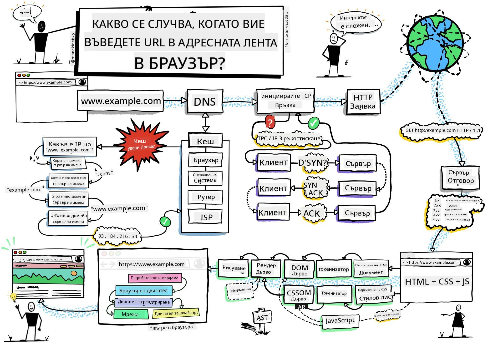
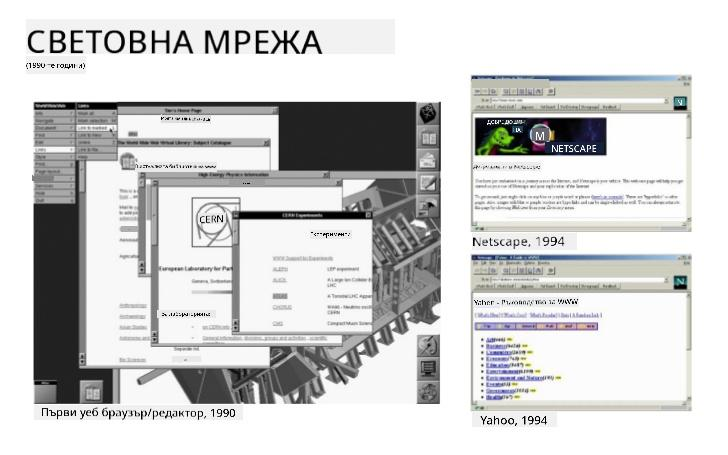
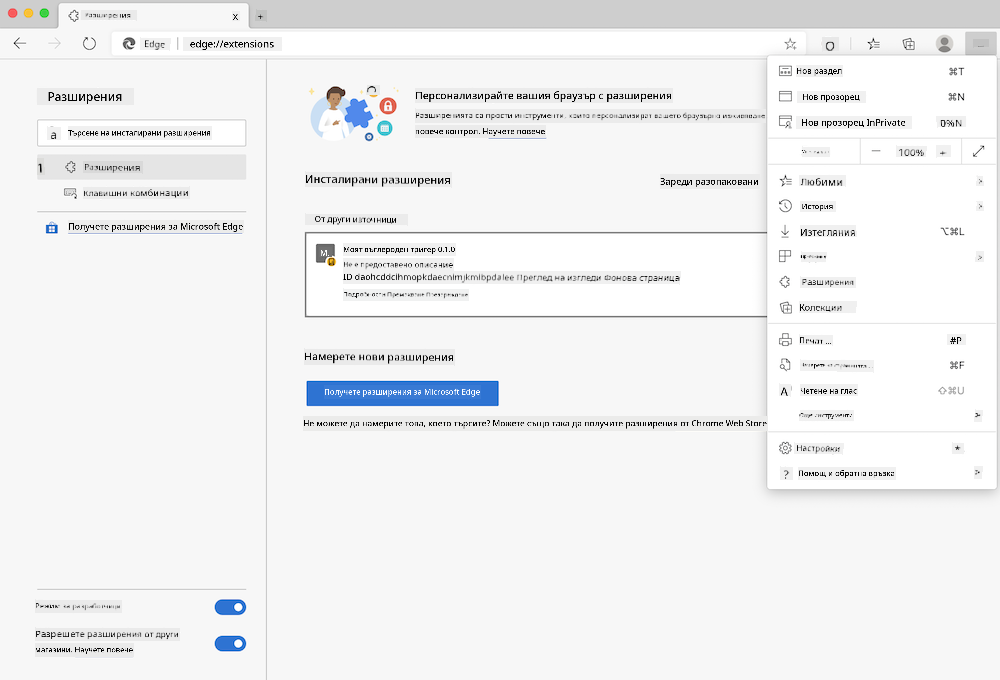
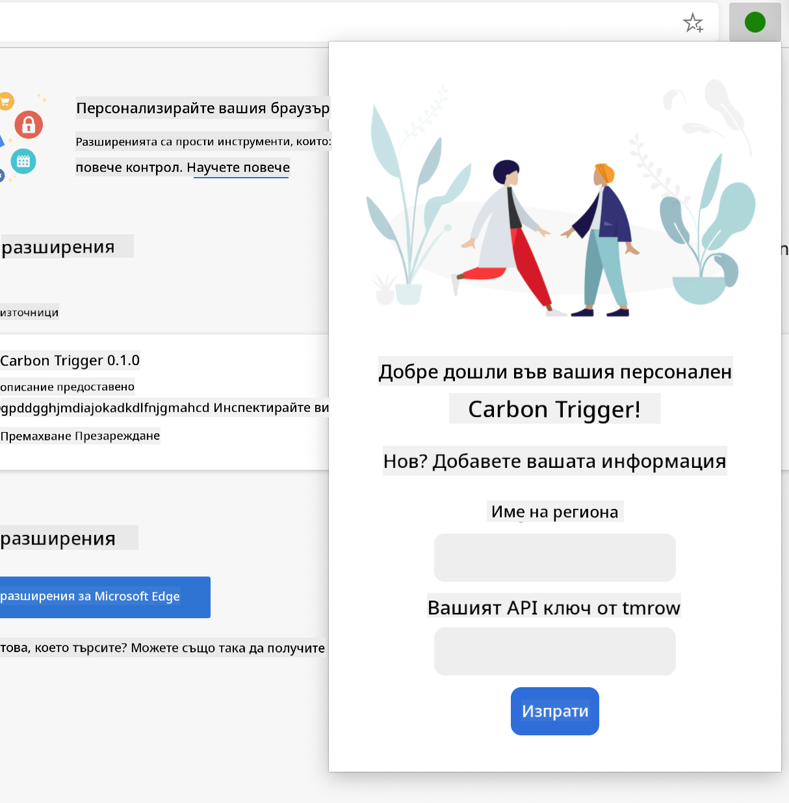
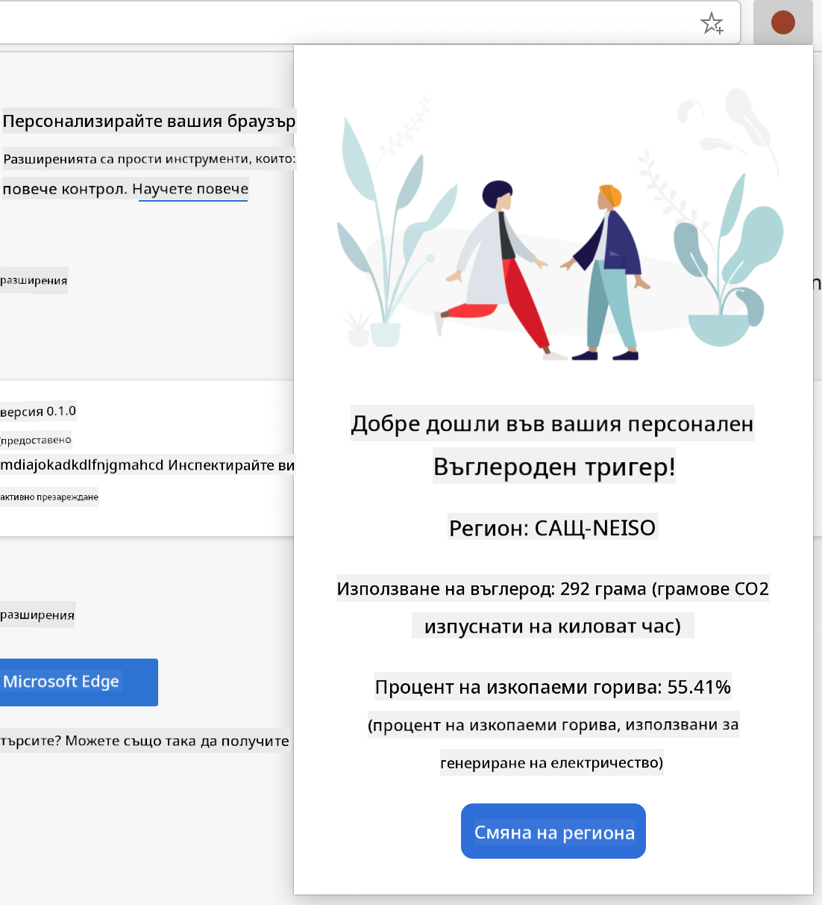

<!--
CO_OP_TRANSLATOR_METADATA:
{
  "original_hash": "0bb55e0b98600afab801eea115228873",
  "translation_date": "2025-08-28T07:42:27+00:00",
  "source_file": "5-browser-extension/1-about-browsers/README.md",
  "language_code": "bg"
}
-->
# Проект за браузърно разширение, част 1: Всичко за браузърите


> Скица от [Wassim Chegham](https://dev.to/wassimchegham/ever-wondered-what-happens-when-you-type-in-a-url-in-an-address-bar-in-a-browser-3dob)

## Предварителен тест

[Предварителен тест](https://ashy-river-0debb7803.1.azurestaticapps.net/quiz/23)

### Въведение

Браузърните разширения добавят допълнителна функционалност към браузъра. Но преди да създадете такова, е добре да научите малко повече за това как браузърите работят.

### За браузъра

В тази серия от уроци ще научите как да създадете браузърно разширение, което ще работи на браузърите Chrome, Firefox и Edge. В тази част ще откриете как работят браузърите и ще изградите основните елементи на браузърното разширение.

Но какво всъщност е браузърът? Това е софтуерно приложение, което позволява на крайния потребител да достъпва съдържание от сървър и да го показва на уеб страници.

✅ Малко история: първият браузър се е наричал 'WorldWideWeb' и е създаден от сър Тимъти Бърнърс-Лий през 1990 година.


> Някои ранни браузъри, чрез [Karen McGrane](https://www.slideshare.net/KMcGrane/week-4-ixd-history-personal-computing)

Когато потребител се свърже с интернет чрез URL (Uniform Resource Locator) адрес, обикновено използвайки Hypertext Transfer Protocol чрез адрес `http` или `https`, браузърът комуникира с уеб сървър и извлича уеб страница.

На този етап, рендериращият двигател на браузъра я показва на устройството на потребителя, което може да бъде мобилен телефон, настолен компютър или лаптоп.

Браузърите също така имат способността да кешират съдържание, за да не се налага то да бъде извличано от сървъра всеки път. Те могат да записват историята на активността на потребителя, да съхраняват 'бисквитки', които са малки частици данни, съдържащи информация за активността на потребителя, и още много други функции.

Едно много важно нещо, което трябва да запомните за браузърите, е че те не са еднакви! Всеки браузър има своите силни и слаби страни, и професионалният уеб разработчик трябва да разбира как да направи уеб страниците да работят добре на различни браузъри. Това включва работа с малки екрани, като тези на мобилни телефони, както и с потребители, които са офлайн.

Един много полезен уебсайт, който вероятно трябва да запазите в предпочитанията на браузъра, който използвате, е [caniuse.com](https://www.caniuse.com). Когато създавате уеб страници, е много полезно да използвате списъците на caniuse за поддържани технологии, за да можете най-добре да подкрепите своите потребители.

✅ Как можете да разберете кои браузъри са най-популярни сред потребителите на вашия уебсайт? Проверете вашата аналитика - можете да инсталирате различни аналитични пакети като част от процеса на уеб разработка, и те ще ви покажат кои браузъри се използват най-често.

## Браузърни разширения

Защо бихте искали да създадете браузърно разширение? Това е удобен инструмент, който можете да добавите към браузъра си, когато имате нужда от бърз достъп до задачи, които често повтаряте. Например, ако често ви се налага да проверявате цветовете на различни уеб страници, с които взаимодействате, можете да инсталирате браузърно разширение за избор на цветове. Ако имате затруднения с запомнянето на пароли, можете да използвате браузърно разширение за управление на пароли.

Създаването на браузърни разширения също е забавно. Те обикновено управляват ограничен брой задачи, които изпълняват добре.

✅ Кои са вашите любими браузърни разширения? Какви задачи изпълняват?

### Инсталиране на разширения

Преди да започнете да създавате, разгледайте процеса на създаване и разгръщане на браузърно разширение. Въпреки че всеки браузър има малки разлики в начина, по който управлява тази задача, процесът е подобен на Chrome и Firefox, както в този пример за Edge:



> Забележка: Уверете се, че сте включили режим за разработчици и сте разрешили разширения от други магазини.

По същество процесът ще бъде:

- създайте вашето разширение, използвайки `npm run build` 
- навигирайте в браузъра до панела с разширения, използвайки бутона "Настройки и още" (иконата `...`) в горния десен ъгъл
- ако е нова инсталация, изберете `load unpacked`, за да качите ново разширение от папката му за изграждане (в нашия случай това е `/dist`) 
- или, кликнете `reload`, ако презареждате вече инсталирано разширение

✅ Тези инструкции се отнасят за разширения, които създавате сами; за да инсталирате разширения, които са публикувани в магазина за браузърни разширения, свързан с всеки браузър, трябва да навигирате до тези [магазини](https://microsoftedge.microsoft.com/addons/Microsoft-Edge-Extensions-Home) и да инсталирате разширението, което сте избрали.

### Започнете

Ще създадете браузърно разширение, което показва въглеродния отпечатък на вашия регион, като показва енергийното потребление на региона и източника на енергията. Разширението ще има форма, която събира API ключ, за да можете да достъпите API на CO2 Signal.

**Необходимо ви е:**

- [API ключ](https://www.co2signal.com/); въведете вашия имейл в полето на тази страница и ще ви бъде изпратен ключ
- [код за вашия регион](http://api.electricitymap.org/v3/zones), съответстващ на [Electricity Map](https://www.electricitymap.org/map) (например, в Бостън използвам 'US-NEISO').
- [начален код](../../../../5-browser-extension/start). Изтеглете папката `start`; ще завършите кода в тази папка.
- [NPM](https://www.npmjs.com) - NPM е инструмент за управление на пакети; инсталирайте го локално и пакетите, изброени във вашия файл `package.json`, ще бъдат инсталирани за използване от вашия уеб актив

✅ Научете повече за управлението на пакети в този [отличен модул за обучение](https://docs.microsoft.com/learn/modules/create-nodejs-project-dependencies/?WT.mc_id=academic-77807-sagibbon)

Отделете минута, за да разгледате базата с код:

dist
    -|manifest.json (настройките по подразбиране са тук)
    -|index.html (HTML маркировката за предния край е тук)
    -|background.js (JS за фонови процеси е тук)
    -|main.js (компилиран JS)
src
    -|index.js (вашият JS код е тук)

✅ След като разполагате с вашия API ключ и код за региона, запазете ги някъде в бележка за бъдеща употреба.

### Създайте HTML за разширението

Това разширение има два изгледа. Един за събиране на API ключ и код за региона:



И втори за показване на въглеродното потребление на региона:



Нека започнем със създаването на HTML за формата и стилизирането му с CSS.

В папката `/dist` ще създадете форма и зона за резултати. Във файла `index.html` попълнете обозначената зона за форма:

```HTML
<form class="form-data" autocomplete="on">
	<div>
		<h2>New? Add your Information</h2>
	</div>
	<div>
		<label for="region">Region Name</label>
		<input type="text" id="region" required class="region-name" />
	</div>
	<div>
		<label for="api">Your API Key from tmrow</label>
		<input type="text" id="api" required class="api-key" />
	</div>
	<button class="search-btn">Submit</button>
</form>	
```
Това е формата, където вашата запазена информация ще бъде въведена и съхранена в локалното хранилище.

След това създайте зоната за резултати; под последния таг на формата добавете няколко div елемента:

```HTML
<div class="result">
	<div class="loading">loading...</div>
	<div class="errors"></div>
	<div class="data"></div>
	<div class="result-container">
		<p><strong>Region: </strong><span class="my-region"></span></p>
		<p><strong>Carbon Usage: </strong><span class="carbon-usage"></span></p>
		<p><strong>Fossil Fuel Percentage: </strong><span class="fossil-fuel"></span></p>
	</div>
	<button class="clear-btn">Change region</button>
</div>
```
На този етап можете да опитате изграждане. Уверете се, че сте инсталирали зависимостите на пакета за това разширение:

```
npm install
```

Тази команда ще използва npm, мениджъра на пакети за Node, за да инсталира webpack за процеса на изграждане на вашето разширение. Можете да видите резултата от този процес, като погледнете в `/dist/main.js` - ще видите, че кодът е бил обединен.

Засега разширението трябва да се изгради и, ако го разположите в Edge като разширение, ще видите форма, която е чисто показана.

Поздравления, направихте първите стъпки към създаването на браузърно разширение. В следващите уроци ще го направите по-функционално и полезно.

---

## 🚀 Предизвикателство

Разгледайте магазин за браузърни разширения и инсталирайте едно на вашия браузър. Можете да разгледате неговите файлове по интересни начини. Какво откривате?

## Тест след лекцията

[Тест след лекцията](https://ashy-river-0debb7803.1.azurestaticapps.net/quiz/24)

## Преглед и самостоятелно обучение

В този урок научихте малко за историята на уеб браузъра; използвайте тази възможност, за да научите повече за това как създателите на Световната мрежа са си представяли нейното използване, като прочетете повече за нейната история. Някои полезни сайтове включват:

[История на уеб браузърите](https://www.mozilla.org/firefox/browsers/browser-history/)

[История на мрежата](https://webfoundation.org/about/vision/history-of-the-web/)

[Интервю с Тим Бърнърс-Лий](https://www.theguardian.com/technology/2019/mar/12/tim-berners-lee-on-30-years-of-the-web-if-we-dream-a-little-we-can-get-the-web-we-want)

## Задание 

[Променете стила на вашето разширение](assignment.md)

---

**Отказ от отговорност**:  
Този документ е преведен с помощта на AI услуга за превод [Co-op Translator](https://github.com/Azure/co-op-translator). Въпреки че се стремим към точност, моля, имайте предвид, че автоматизираните преводи може да съдържат грешки или неточности. Оригиналният документ на неговия роден език трябва да се счита за авторитетен източник. За критична информация се препоръчва професионален човешки превод. Не носим отговорност за недоразумения или погрешни интерпретации, произтичащи от използването на този превод.