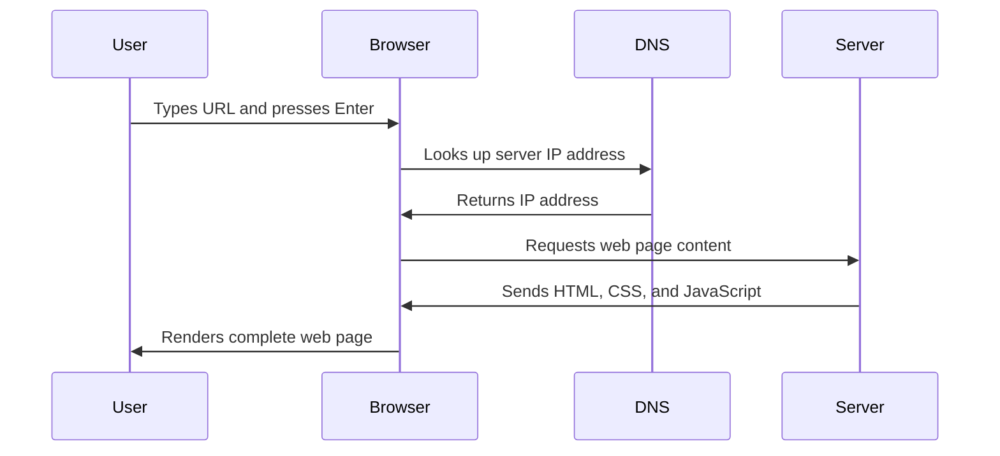

<!--
CO_OP_TRANSLATOR_METADATA:
{
  "original_hash": "33a875c522f237a2026e4653240dfc07",
  "translation_date": "2025-10-24T22:59:50+00:00",
  "source_file": "5-browser-extension/1-about-browsers/README.md",
  "language_code": "bg"
}
-->
# Проект за браузърно разширение, част 1: Всичко за браузърите


> Скица от [Wassim Chegham](https://dev.to/wassimchegham/ever-wondered-what-happens-when-you-type-in-a-url-in-an-address-bar-in-a-browser-3dob)

## Предварителен тест

[Предварителен тест](https://ff-quizzes.netlify.app/web/quiz/23)

### Въведение

Браузърните разширения са мини-приложения, които подобряват вашето преживяване при сърфиране в интернет. Подобно на оригиналната визия на Тим Бърнърс-Лий за интерактивен уеб, разширенията разширяват възможностите на браузъра отвъд простото разглеждане на документи. От мениджъри на пароли, които защитават вашите акаунти, до инструменти за избор на цветове, които помагат на дизайнерите да намерят перфектните нюанси, разширенията решават ежедневни предизвикателства при сърфиране.

Преди да създадем вашето първо разширение, нека разберем как работят браузърите. Точно както Александър Греъм Бел е трябвало да разбере предаването на звук преди да изобрети телефона, познаването на основите на браузърите ще ви помогне да създадете разширения, които се интегрират безпроблемно със съществуващите системи на браузъра.

До края на този урок ще разберете архитектурата на браузърите и ще започнете да изграждате своето първо разширение.

## Разбиране на уеб браузърите

Уеб браузърът е по същество сложен интерпретатор на документи. Когато въведете "google.com" в адресната лента, браузърът извършва сложна серия от операции - заявява съдържание от сървъри по целия свят, след това анализира и визуализира този код в интерактивните уеб страници, които виждате.

Този процес наподобява начина, по който първият уеб браузър, WorldWideWeb, е бил проектиран от Тим Бърнърс-Лий през 1990 г., за да направи хипервръзките достъпни за всички.

✅ **Малко история**: Първият браузър се е наричал 'WorldWideWeb' и е бил създаден от сър Тимъти Бърнърс-Лий през 1990 г.


> Някои ранни браузъри, чрез [Karen McGrane](https://www.slideshare.net/KMcGrane/week-4-ixd-history-personal-computing)

### Как браузърите обработват уеб съдържание

Процесът между въвеждането на URL и виждането на уеб страница включва няколко координирани стъпки, които се случват за секунди:



**Ето какво постига този процес:**
- **Превежда** четимия за хората URL в IP адрес на сървъра чрез DNS търсене
- **Установява** сигурна връзка с уеб сървъра, използвайки HTTP или HTTPS протоколи
- **Заявява** специфичното съдържание на уеб страницата от сървъра
- **Получава** HTML код, CSS стилове и JavaScript код от сървъра
- **Визуализира** цялото съдържание в интерактивната уеб страница, която виждате

### Основни функции на браузърите

Съвременните браузъри предоставят множество функции, които разработчиците на разширения могат да използват:

| Функция | Цел | Възможности за разширения |
|---------|---------|------------------------|
| **Енджин за визуализация** | Показва HTML, CSS и JavaScript | Модификация на съдържание, инжектиране на стилове |
| **JavaScript енджин** | Изпълнява JavaScript код | Персонализирани скриптове, взаимодействие с API |
| **Локално съхранение** | Запазва данни локално | Потребителски предпочитания, кеширани данни |
| **Мрежов стек** | Обработва уеб заявки | Мониторинг на заявки, анализ на данни |
| **Модел за сигурност** | Защитава потребителите от злонамерено съдържание | Филтриране на съдържание, подобрения в сигурността |

**Разбирането на тези функции ви помага:**
- **Да идентифицирате** къде вашето разширение може да добави най-голяма стойност
- **Да изберете** правилните браузърни API за функционалността на вашето разширение
- **Да проектирате** разширения, които работят ефективно със системите на браузъра
- **Да гарантирате**, че вашето разширение следва най-добрите практики за сигурност на браузъра

### Съображения за разработка на разширения за различни браузъри

Различните браузъри прилагат стандартите с леки вариации, подобно на начина, по който различните програмни езици могат да обработват един и същ алгоритъм по различен начин. Chrome, Firefox и Safari имат уникални характеристики, които разработчиците трябва да вземат предвид при разработката на разширения.

> 💡 **Съвет**: Използвайте [caniuse.com](https://www.caniuse.com), за да проверите кои уеб технологии се поддържат в различните браузъри. Това е безценно при планирането на функциите на вашето разширение!

**Основни съображения за разработка на разширения:**
- **Тествайте** вашето разширение в браузърите Chrome, Firefox и Edge
- **Адаптирайте** към различните API за разширения и формати на манифеста
- **Справяйте се** с различни характеристики на производителността и ограниченията
- **Осигурете** резервни варианти за специфични функции на браузъра, които може да не са налични

✅ **Аналитична информация**: Можете да определите кои браузъри предпочитат вашите потребители, като инсталирате аналитични пакети в проектите си за уеб разработка. Тези данни ще ви помогнат да приоритизирате кои браузъри да поддържате първо.

## Разбиране на браузърните разширения

Браузърните разширения решават често срещани предизвикателства при сърфиране, като добавят функционалност директно към интерфейса на браузъра. Вместо да изискват отделни приложения или сложни работни процеси, разширенията предоставят незабавен достъп до инструменти и функции.

Тази концепция наподобява как ранните компютърни пионери като Дъглас Енгелбарт са си представяли разширяване на човешките способности чрез технологии - разширенията разширяват основната функционалност на вашия браузър.

**Популярни категории разширения и техните предимства:**
- **Инструменти за продуктивност**: Мениджъри на задачи, приложения за водене на бележки и тракери на време, които ви помагат да останете организирани
- **Подобрения в сигурността**: Мениджъри на пароли, блокиращи реклами и инструменти за поверителност, които защитават вашите данни
- **Инструменти за разработчици**: Форматори на код, инструменти за избор на цветове и помощни средства за дебъгване, които улесняват разработката
- **Подобрения на съдържанието**: Режими за четене, инструменти за изтегляне на видеа и инструменти за скрийншоти, които подобряват вашето уеб преживяване

✅ **Въпрос за размисъл**: Кои са вашите любими браузърни разширения? Какви конкретни задачи изпълняват и как подобряват вашето преживяване при сърфиране?

## Инсталиране и управление на разширения

Разбирането на процеса на инсталиране на разширения помага да предвидите потребителското преживяване, когато хората инсталират вашето разширение. Процесът на инсталиране е стандартизиран в съвременните браузъри, с малки вариации в дизайна на интерфейса.


> **Важно**: Уверете се, че сте активирали режим за разработчици и сте разрешили разширения от други магазини, когато тествате собствените си разширения.

### Процес на инсталиране на разширения за разработка

Когато разработвате и тествате собствените си разширения, следвайте този работен процес:

```bash
# Step 1: Build your extension
npm run build
```

**Какво постига тази команда:**
- **Компилира** вашия изходен код във файлове, готови за браузъра
- **Пакетира** JavaScript модулите в оптимизирани пакети
- **Генерира** финалните файлове на разширението в папката `/dist`
- **Подготвя** вашето разширение за инсталиране и тестване

**Стъпка 2: Навигирайте до разширенията на браузъра**
1. **Отворете** страницата за управление на разширенията на вашия браузър
2. **Кликнете** върху бутона "Настройки и още" (иконата `...`) в горния десен ъгъл
3. **Изберете** "Разширения" от падащото меню

**Стъпка 3: Заредете вашето разширение**
- **За нови инсталации**: Изберете `load unpacked` и изберете вашата папка `/dist`
- **За актуализации**: Кликнете върху `reload` до вече инсталираното разширение
- **За тестване**: Активирайте "Режим за разработчици", за да получите достъп до допълнителни функции за дебъгване

### Инсталиране на разширение за продукция

> ✅ **Забележка**: Тези инструкции за разработка са специално за разширения, които създавате сами. За да инсталирате публикувани разширения, посетете официалните магазини за браузърни разширения като [Microsoft Edge Add-ons store](https://microsoftedge.microsoft.com/addons/Microsoft-Edge-Extensions-Home).

**Разбиране на разликата:**
- **Инсталациите за разработка** ви позволяват да тествате непубликувани разширения по време на разработката
- **Инсталациите от магазините** предоставят проверени, публикувани разширения с автоматични актуализации
- **Ръчно инсталиране** позволява инсталиране на разширения извън официалните магазини (изисква режим за разработчици)

## Създаване на разширение за въглероден отпечатък

Ще създадем браузърно разширение, което показва въглеродния отпечатък от използването на енергия във вашия регион. Този проект демонстрира основни концепции за разработка на разширения, като същевременно създава практичен инструмент за повишаване на екологичната осведоменост.

Този подход следва принципа "учене чрез правене", който се е доказал като ефективен още от образователните теории на Джон Дюи - съчетавайки технически умения със значими реални приложения.

### Изисквания за проекта

Преди да започнем разработката, нека съберем необходимите ресурси и зависимости:

**Необходим достъп до API:**
- **[CO2 Signal API ключ](https://www.co2signal.com/)**: Въведете вашия имейл адрес, за да получите безплатен API ключ
- **[Код на регион](http://api.electricitymap.org/v3/zones)**: Намерете кода на вашия регион, използвайки [Electricity Map](https://www.electricitymap.org/map) (например, Бостън използва 'US-NEISO')

**Инструменти за разработка:**
- **[Node.js и NPM](https://www.npmjs.com)**: Инструмент за управление на пакети за инсталиране на зависимости на проекта
- **[Начален код](../../../../5-browser-extension/start)**: Изтеглете папката `start`, за да започнете разработката

✅ **Научете повече**: Подобрете уменията си за управление на пакети с този [подробен модул за обучение](https://docs.microsoft.com/learn/modules/create-nodejs-project-dependencies/?WT.mc_id=academic-77807-sagibbon)

### Разбиране на структурата на проекта

Разбирането на структурата на проекта помага за организиране на работата по разработката ефективно. Точно както библиотеката в Александрия е била организирана за лесно извличане на знания, добре структурираният код прави разработката по-ефективна:

```
project-root/
├── dist/                    # Built extension files
│   ├── manifest.json        # Extension configuration
│   ├── index.html           # User interface markup
│   ├── background.js        # Background script functionality
│   └── main.js              # Compiled JavaScript bundle
└── src/                     # Source development files
    └── index.js             # Your main JavaScript code
```

**Разбивка на това, което постига всеки файл:**
- **`manifest.json`**: **Определя** метаданни за разширението, разрешения и входни точки
- **`index.html`**: **Създава** потребителския интерфейс, който се появява, когато потребителите кликнат върху вашето разширение
- **`background.js`**: **Обработва** фонови задачи и слушатели на събития в браузъра
- **`main.js`**: **Съдържа** финалния пакетен JavaScript след процеса на компилация
- **`src/index.js`**: **Съхранява** основния код за разработка, който се компилира в `main.js`

> 💡 **Съвет за организация**: Съхранявайте вашия API ключ и код на региона в защитена бележка за лесен достъп по време на разработката. Ще ви трябват тези стойности, за да тествате функционалността на вашето разширение.

✅ **Забележка за сигурност**: Никога не качвайте API ключове или чувствителни данни в хранилището на вашия код. Ще ви покажем как да се справите с тях безопасно в следващите стъпки.

## Създаване на интерфейса на разширението

Сега ще изградим компонентите на потребителския интерфейс. Разширението използва подход с два екрана: екран за конфигурация за първоначална настройка и екран за резултати за показване на данни.

Това следва принципа на прогресивно разкриване, използван в дизайна на интерфейси още от ранните дни на компютърните технологии - разкриване на информация и опции в логична последователност, за да се избегне претоварване на потребителите.

### Преглед на изгледите на разширението

**Изглед за настройка** - Конфигурация за първоначална употреба:


**Изглед за резултати** - Показване на данни за въглеродния отпечатък:


### Създаване на формуляр за конфигурация

Формулярът за настройка събира данни за конфигурация от потребителя при първоначална употреба. След като бъде конфигуриран, тази информация се запазва в паметта на браузъра за бъдещи сесии.

Във файла `/dist/index.html` добавете тази структура на формуляра:

```html
<form class="form-data" autocomplete="on">
    <div>
        <h2>New? Add your Information</h2>
    </div>
    <div>
        <label for="region">Region Name</label>
        <input type="text" id="region" required class="region-name" />
    </div>
    <div>
        <label for="api">Your API Key from tmrow</label>
        <input type="text" id="api" required class="api-key" />
    </div>
    <button class="search-btn">Submit</button>
</form>
```

**Ето какво постига този формуляр:**
- **Създава** семантична структура на формуляра с правилни етикети и асоциации на полетата
- **Активира** функционалността за автоматично попълване на браузъра за подобрено потребителско преживяване
- **Изисква** попълване на двете полета преди изпращане, използвайки атрибута `required`
- **Организира** полетата с описателни имена на класове за лесно стилизиране и насочване чрез JavaScript
- **Осигурява** ясни инструкции за потребителите,
**Описание:** Подобрете разширението за браузър, като добавите функции за валидиране на формуляри и обратна връзка към потребителя, за да подобрите потребителското изживяване при въвеждане на API ключове и кодове на региони.

**Задача:** Създайте JavaScript функции за валидиране, които проверяват дали полето за API ключ съдържа поне 20 символа и дали кодът на региона следва правилния формат (например 'US-NEISO'). Добавете визуална обратна връзка, като променяте цвета на рамката на полето за въвеждане на зелено за валидни данни и червено за невалидни. Освен това добавете функция за превключване, която позволява показване/скриване на API ключа за сигурност.

Научете повече за [режим агент](https://code.visualstudio.com/blogs/2025/02/24/introducing-copilot-agent-mode) тук.

## 🚀 Предизвикателство

Разгледайте магазин за разширения за браузър и инсталирайте едно на вашия браузър. Можете да изследвате неговите файлове по интересни начини. Какво откривате?

## Тест след лекцията

[Тест след лекцията](https://ff-quizzes.netlify.app/web/quiz/24)

## Преглед и самостоятелно обучение

В този урок научихте малко за историята на уеб браузъра; използвайте тази възможност, за да научите повече за това как създателите на Световната мрежа са си представяли нейното използване, като прочетете повече за нейната история. Някои полезни сайтове включват:

[История на уеб браузърите](https://www.mozilla.org/firefox/browsers/browser-history/)

[История на уеб](https://webfoundation.org/about/vision/history-of-the-web/)

[Интервю с Тим Бърнърс-Лий](https://www.theguardian.com/technology/2019/mar/12/tim-berners-lee-on-30-years-of-the-web-if-we-dream-a-little-we-can-get-the-web-we-want)

## Задача 

[Променете стила на вашето разширение](assignment.md)

---

**Отказ от отговорност**:  
Този документ е преведен с помощта на AI услуга за превод [Co-op Translator](https://github.com/Azure/co-op-translator). Въпреки че се стремим към точност, моля, имайте предвид, че автоматизираните преводи може да съдържат грешки или неточности. Оригиналният документ на неговия роден език трябва да се счита за авторитетен източник. За критична информация се препоръчва професионален човешки превод. Ние не носим отговорност за каквито и да е недоразумения или погрешни интерпретации, произтичащи от използването на този превод.